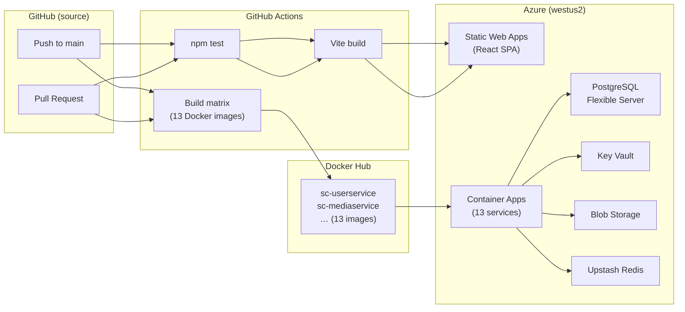
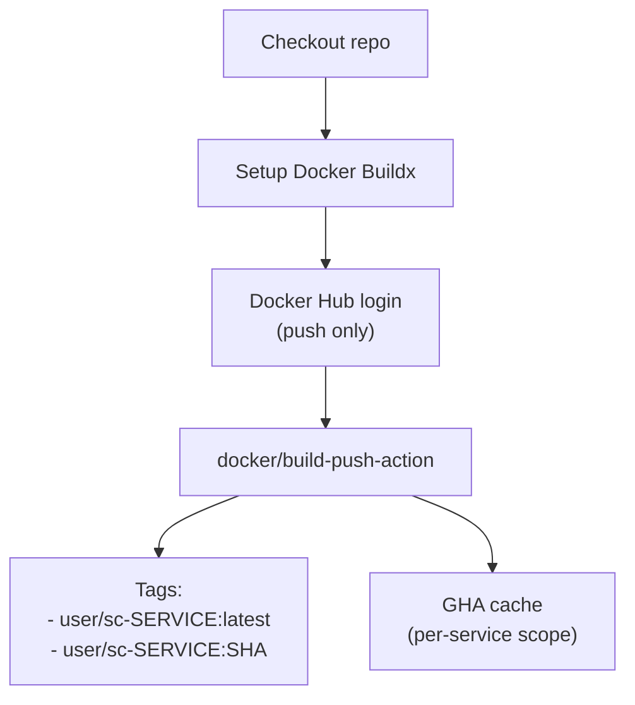
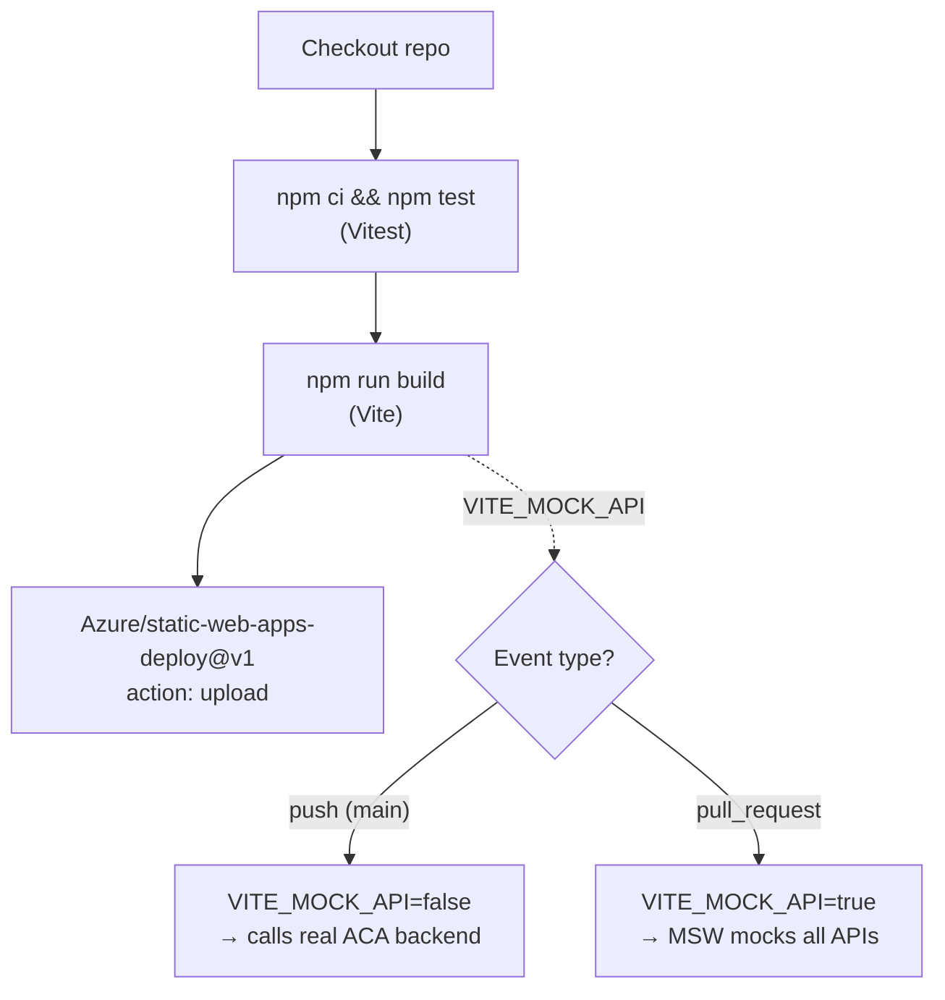
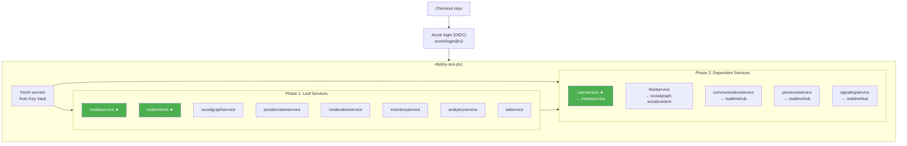
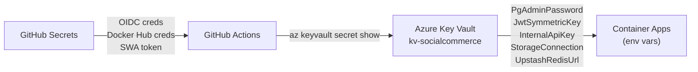
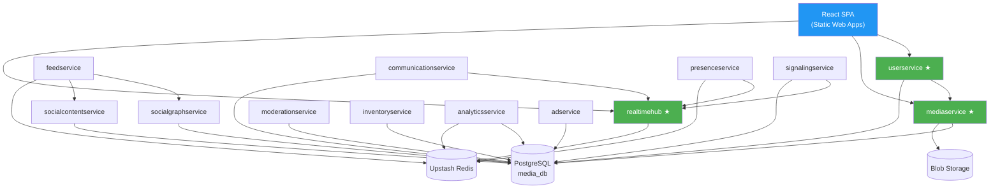

# SocialCommerce CI/CD Pipeline

> End-to-end build, test, and deploy pipeline for 13 .NET microservices + a React SPA,
> powered by **GitHub Actions**, **Docker Hub**, **Azure Container Apps**, and **Azure Static Web Apps**.

---

## High-Level Architecture



---

## Workflow Files

| File | Trigger | Purpose |
|------|---------|---------|
| `.github/workflows/build.yml` | `push` / `pull_request` on `main` | Build images, deploy SPA, deploy ACA |
| `.github/workflows/close-pr-preview.yml` | `pull_request: [closed]` | Tear down SWA PR preview environment |

---

## Pipeline Stages

### 1. Build & Push Docker Images (`build` job)

Runs **13 parallel jobs** via a matrix strategy (one per microservice).



**Key details:**

| Setting | Value |
|---------|-------|
| Runner | `ubuntu-latest` |
| Push condition | Images are only pushed on `push` events (not PRs) |
| Tag format | `<DOCKER_HUB_USERNAME>/sc-<service>:latest` and `…:<git-sha>` |
| Build cache | GitHub Actions cache (`type=gha`), scoped per service |
| fail-fast | `false` — one service failure does not cancel others |

**Matrix services (13):**

| Service | Dockerfile Context | Notes |
|---------|--------------------|-------|
| `userservice` | `services/UserService` | External ingress |
| `mediaservice` | `services/MediaService` | External ingress |
| `realtimehub` | `services/RealTimeHub` | External ingress (SignalR) |
| `socialgraphservice` | `.` (repo root) | Shared project references |
| `socialcontentservice` | `.` (repo root) | Shared project references |
| `feedservice` | `.` (repo root) | Shared project references |
| `moderationservice` | `.` (repo root) | Shared project references |
| `communicationservice` | `services/CommunicationService` | |
| `presenceservice` | `services/PresenceService` | |
| `signalingservice` | `services/SignalingService` | |
| `inventoryservice` | `services/InventoryService` | |
| `analyticsservice` | `services/AnalyticsService` | |
| `adservice` | `services/AdService` | |

> Services using `.` as context need repo-root access because their Dockerfiles
> reference shared project files outside their own directory.

---

### 2. Deploy React SPA (`deploy-spa` job)

Runs on **both** `push` and `pull_request` events — independently of the backend build.



**Environment strategy:**

| Event | `VITE_MOCK_API` | Backend | URL |
|-------|-----------------|---------|-----|
| `push` to `main` | `false` | Real ACA services | Production SWA URL |
| `pull_request` | `true` | MSW mock handlers | SWA PR preview URL |

**SWA configuration** (`staticwebapp.config.json`):

- **Navigation fallback** → `index.html` (SPA client-side routing)
- **MIME type overrides** → `.js`/`.mjs` served as `application/javascript`
- **Exclusions** → `/assets/*`, `/mockServiceWorker.js`, favicons

**PR preview cleanup** (`close-pr-preview.yml`):

When a PR is closed/merged, the `Azure/static-web-apps-deploy@v1` action runs with
`action: close` to tear down the preview environment.

---

### 3. Deploy to Azure Container Apps (`deploy-aca` job)

Runs **only** on `push` to `main`, after all Docker images are built.



> ★ = external ingress (internet-accessible). All others are internal only.

**Authentication:** GitHub Actions uses **OIDC** (no stored Azure credentials).
The Azure AD app `SocialCommerce-GH-Actions` has three federated identity credentials:

| Subject | Purpose |
|---------|---------|
| `repo:mknguyen1202/SocialCommerce:ref:refs/heads/main` | Push to main |
| `repo:mknguyen1202/SocialCommerce:pull_request` | PR builds |
| `repo:mknguyen1202/SocialCommerce:environment:production` | `deploy-aca` job |

**`deploy-aca.ps1` logic:**

```
for each service:
    if (container app exists)  → az containerapp update --set-env-vars ...
    else                       → az containerapp create --env-vars ...
```

- `--env-vars` is used with `create`; `--set-env-vars` is used with `update` (different Azure CLI flags)
- Scale: `min-replicas 0`, `max-replicas 3` (Consumption plan, scale-to-zero)
- Target port: `8080` for all services
- Inter-service communication: `http://<app-name>` (ACA internal DNS, port 80)

---

## Secrets Management



### GitHub Secrets (repo settings)

| Secret | Purpose |
|--------|---------|
| `AZURE_CLIENT_ID` | Azure AD app for OIDC |
| `AZURE_TENANT_ID` | Entra ID tenant |
| `AZURE_SUBSCRIPTION_ID` | Azure subscription |
| `AZURE_STATIC_WEB_APPS_API_TOKEN` | SWA deployment |
| `DOCKER_HUB_USERNAME` | Docker Hub login |
| `DOCKER_HUB_TOKEN` | Docker Hub access token |

### Key Vault Secrets (fetched at deploy time)

| Secret | Used By |
|--------|---------|
| `PgAdminPassword` | All services with PostgreSQL |
| `JwtSymmetricKey` | Services with JWT auth |
| `InternalApiKey` | Inter-service authenticated calls |
| `StorageConnection` | `mediaservice` (Blob Storage) |
| `UpstashRedisUrl` | `realtimehub`, `feedservice`, `analyticsservice`, `presenceservice` |

---

## Azure Infrastructure

| Resource | Name | SKU / Tier |
|----------|------|------------|
| Resource Group | `rg-socialcommerce` | — |
| PostgreSQL Flexible Server | `pgflex-socialcommerce` | B1ms |
| Storage Account | `stsocialcommerce` | Standard LRS |
| Key Vault | `kv-socialcommerce` | Standard |
| Container Apps Environment | `acaenv-socialcommerce` | Consumption |
| Static Web Apps | `swa-socialcommerce` | Free |
| Service Bus | `sb-socialcommerce` | Basic |
| Region | `westus2` | — |

---

## Service Dependency Map



> ★ External ingress — accessible from the internet.  
> All other services have internal-only ingress within the ACA environment.

---

## Local ↔ CI ↔ Production Environment Comparison

| Aspect | Local (`docker-compose`) | PR Preview (CI) | Production (CI) |
|--------|--------------------------|-----------------|-----------------|
| Backend | Docker containers | None (mocked) | Azure Container Apps |
| Frontend | Vite dev server | SWA preview env | SWA production |
| `VITE_MOCK_API` | `true` (`.env.development`) | `true` (CI env var) | `false` (`.env.production`) |
| API calls | Local containers | MSW handlers | ACA endpoints |
| Database | Local PostgreSQL | N/A | Azure PostgreSQL |
| Redis | Local Redis | N/A | Upstash Redis |

---

## Troubleshooting Reference

| Symptom | Cause | Fix |
|---------|-------|-----|
| `AADSTS700213` OIDC error | Missing federated credential for the specific subject | Add credential via `az ad app federated-credential create` |
| `az containerapp create` exit code 2 | Using `--set-env-vars` (update-only flag) with `create` | Use `--env-vars` for `create`, `--set-env-vars` for `update` |
| SWA serves `.js` as `application/octet-stream` | Missing `staticwebapp.config.json` | Add config with `mimeTypes` overrides in `public/` |
| SWA returns 404 on page refresh | No SPA navigation fallback | Add `navigationFallback` to `staticwebapp.config.json` |
| `.env.production` cannot be committed | Listed in `.gitignore` | Add `!socialcommerce/.env.production` exception |
| Docker Hub login fails in CI | Missing `DOCKER_HUB_USERNAME` / `DOCKER_HUB_TOKEN` secrets | Add secrets in GitHub repo → Settings → Secrets → Actions |
| PowerShell JSON parsing fails in `az` CLI | Backslash escaping in inline JSON | Write JSON to a temp file, pass `--parameters "@path"` |
