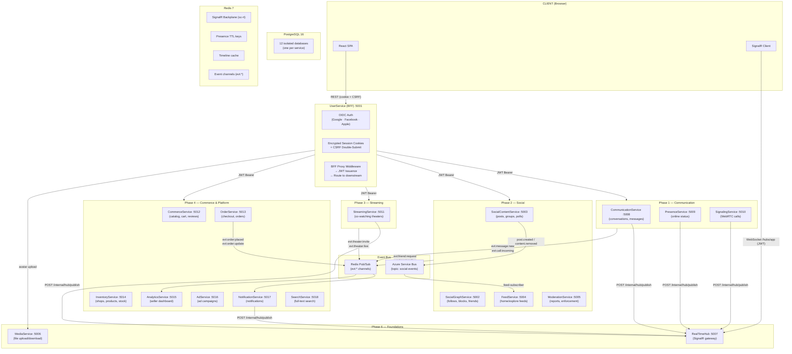
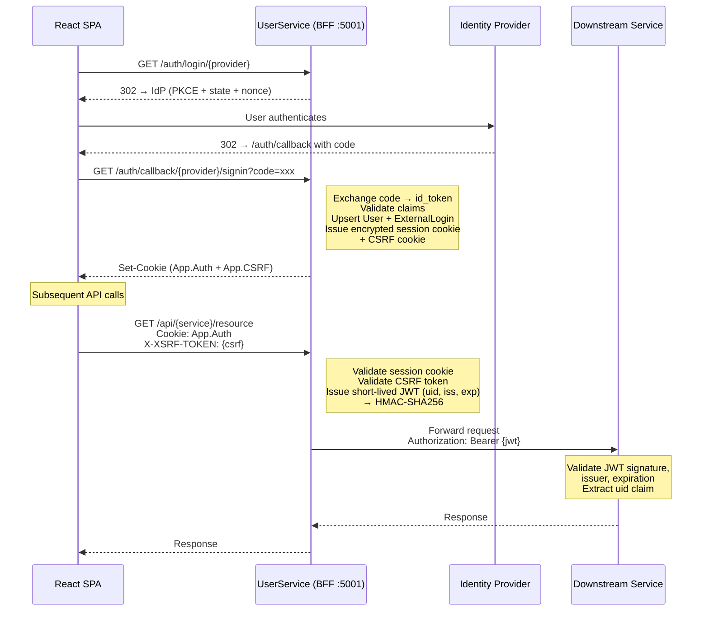
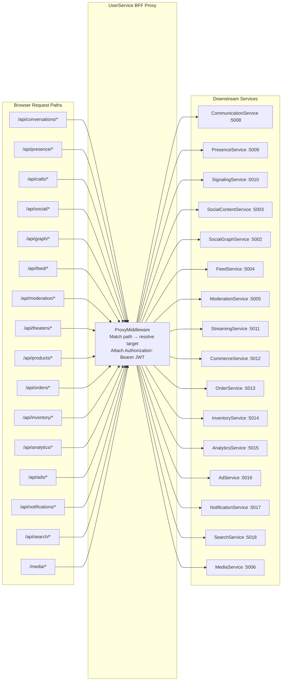
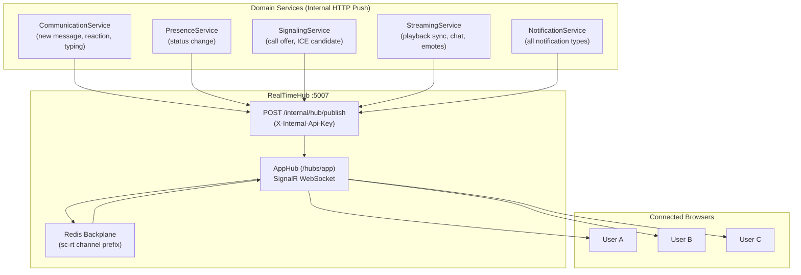
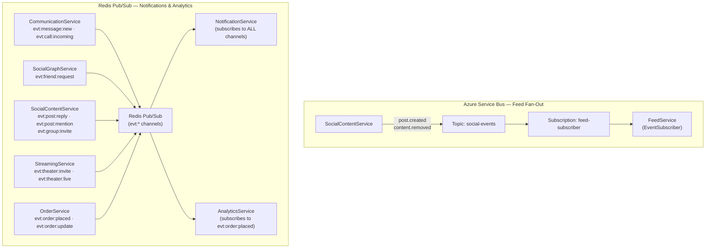
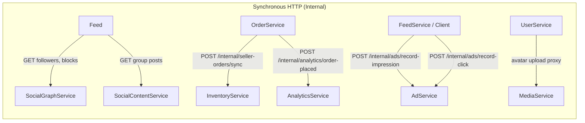
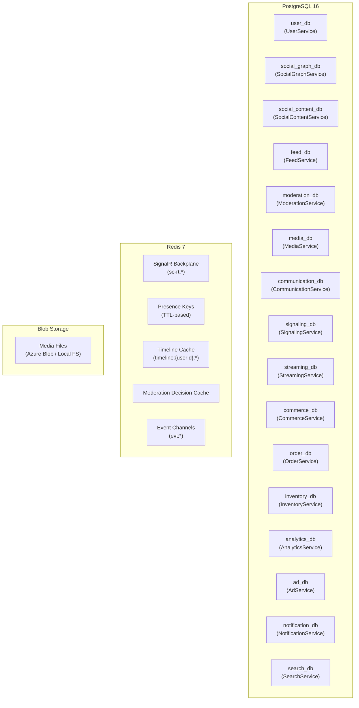
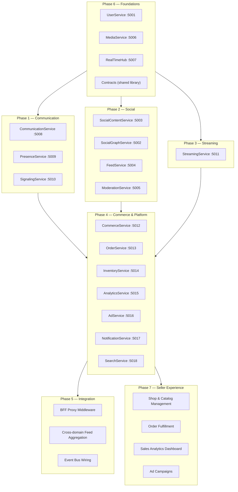
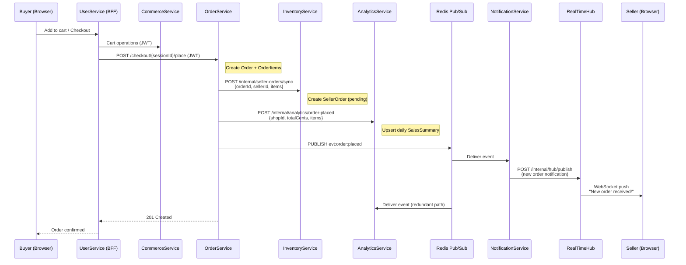
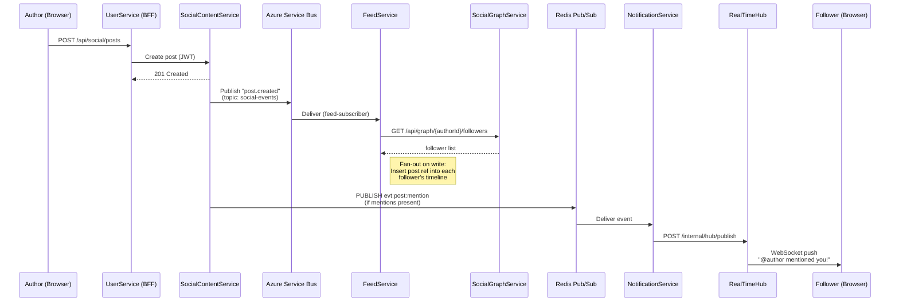

# SocialCommerce — High-Level Dataflow & Architecture

## Overview

SocialCommerce is a **super-app** that unifies social networking,
real-time communication, live streaming, and a commerce marketplace
into a single platform. The backend is composed of **16 domain
services**, a shared **Contracts** library, and two messaging
systems — **Azure Service Bus** and **Redis Pub/Sub** — for
asynchronous cross-service communication.

All browser traffic enters through a single **BFF (Backend for
Frontend)** gateway — **UserService** — which authenticates users via
OIDC providers, manages encrypted session cookies, and issues
short-lived internal JWTs to downstream services.

---

## Service Inventory

| # | Service | Port | Domain | Storage |
|---|---|---|---|---|
| 1 | **UserService** (BFF) | 5001 | Authentication, profiles, BFF proxy | PostgreSQL (`user_db`) |
| 2 | **SocialGraphService** | 5002 | Follow/unfollow, blocks, friend requests | PostgreSQL (`social_graph_db`) |
| 3 | **SocialContentService** | 5003 | Posts, comments, reactions, polls, groups | PostgreSQL (`social_content_db`) |
| 4 | **FeedService** | 5004 | Home/user/explore feeds, fan-out on write | PostgreSQL (`feed_db`) + Redis |
| 5 | **ModerationService** | 5005 | Reports, decisions, enforcement, AI auto-flag | PostgreSQL (`moderation_db`) + Redis |
| 6 | **MediaService** | 5006 | File upload/download, blob storage | PostgreSQL (`media_db`) + Blob Storage |
| 7 | **RealTimeHub** | 5007 | Centralized SignalR WebSocket gateway | Redis (backplane) |
| 8 | **CommunicationService** | 5008 | DM & room conversations, messages | PostgreSQL (`communication_db`) |
| 9 | **PresenceService** | 5009 | Online/offline/idle status, typing indicators | Redis (TTL-based) |
| 10 | **SignalingService** | 5010 | WebRTC call sessions, SDP/ICE relay | PostgreSQL (`signaling_db`) |
| 11 | **StreamingService** | 5011 | Co-watching theaters, live chat, emotes | PostgreSQL (`streaming_db`) |
| 12 | **CommerceService** | 5012 | Product catalog, cart, coupons, reviews | PostgreSQL (`commerce_db`) |
| 13 | **OrderService** | 5013 | Checkout, orders, shipments | PostgreSQL (`order_db`) |
| 14 | **InventoryService** | 5014 | Seller shops, products, variants, stock | PostgreSQL (`inventory_db`) |
| 15 | **AnalyticsService** | 5015 | Seller dashboard, revenue, top products | PostgreSQL (`analytics_db`) + Redis |
| 16 | **AdService** | 5016 | Ad campaigns, impressions, clicks | PostgreSQL (`ad_db`) |
| 17 | **NotificationService** | 5017 | Cross-domain notification persistence & push | PostgreSQL (`notification_db`) + Redis |
| 18 | **SearchService** | 5018 | Unified full-text search (users, posts, products) | PostgreSQL (`search_db` — tsvector) |

**Shared library:** `Contracts` — defines the `DomainEvent` envelope, `EventTypes` constants, and `NotificationPayload` used by all services.

---

## Platform Architecture



---

## Authentication & Request Flow

Every browser request passes through the **UserService BFF**. The SPA
never holds long-lived tokens — authentication state lives in
server-side encrypted cookies.



---

## BFF Proxy Routing

The `ProxyMiddleware` in UserService maps URL prefixes to downstream
services, attaching the internal JWT to each forwarded request.



---

## Real-Time Event Delivery

All real-time push to the browser flows through the centralized
**RealTimeHub** (SignalR). Domain services publish events via an
internal HTTP API; the hub broadcasts them over WebSocket connections.



---

## Asynchronous Event Bus

The platform uses **two complementary messaging systems** for
asynchronous cross-service communication:

| Bus | Purpose | Producers | Consumers |
|---|---|---|---|
| **Azure Service Bus** | Social content fan-out | SocialContentService | FeedService |
| **Redis Pub/Sub** | Cross-domain notifications & analytics | All domain services | NotificationService, AnalyticsService |



### Event Envelope

All events share the `DomainEvent` envelope from the **Contracts**
library:

```
DomainEvent {
    Id:        Guid
    Type:      string        // e.g. "evt:order:placed"
    Source:    string        // originating service
    Timestamp: DateTimeOffset
    Data:      object?       // event-specific payload
}
```

---

## Inter-Service HTTP Dependencies

Beyond the BFF proxy, services communicate directly via internal HTTP
calls for synchronous operations:



| Caller | Callee | Endpoint | Purpose |
|---|---|---|---|
| FeedService | SocialGraphService | `GET /api/graph/{id}/followers` | Fan-out target list |
| FeedService | SocialContentService | `GET /api/social/groups/{slug}/posts` | Group feed proxy |
| OrderService | InventoryService | `POST /internal/seller-orders/sync` | Sync placed order to seller |
| OrderService | AnalyticsService | `POST /internal/analytics/order-placed` | Analytics ingestion |
| FeedService / Client | AdService | `POST /internal/ads/record-impression` | Track ad impression |
| FeedService / Client | AdService | `POST /internal/ads/record-click` | Track ad click |
| UserService | MediaService | `POST /media/upload` | Avatar upload proxy |

---

## Data Storage Layout

Each service owns its **isolated PostgreSQL database** — no
cross-database joins. Redis is shared but used for distinct concerns.



---

## Domain Groupings & Phases

The platform is organized into **seven phases** of development, each
building on the previous:



---

## End-to-End Buyer Purchase Flow

This sequence illustrates how services collaborate during a buyer
purchase — spanning commerce, checkout, seller sync, analytics, and
notifications:



---

## End-to-End Social Content Flow

This sequence shows the path of a social post — from creation through
feed fan-out and real-time notification delivery:



---

## Cross-Cutting Concerns

### Shared JWT Authentication

All services validate the same **HMAC-SHA256 symmetric key JWT**
issued by UserService. No service issues its own tokens.

| Claim | Value | Purpose |
|---|---|---|
| `uid` | User ID (GUID) | Primary identity for all service authorization |
| `iss` | `"SocialCommerce"` | Validated by every downstream service |
| `exp` | Now + 5 min | Short-lived; BFF issues fresh token per request |

### Internal Endpoints

Service-to-service endpoints (prefixed with `/internal/`) use
`[AllowAnonymous]` for simplified local development. In production,
these are protected by API keys (`X-Internal-Api-Key`) or network-level
policies.

### Cursor-Based Pagination

All list endpoints use **cursor-based pagination** with UTC ticks
encoding, providing consistent, performant paging across all services.

### Per-Service Database Isolation

Each service owns its database exclusively — no cross-database joins.
Data sharing happens through HTTP APIs or event bus messages, following
**bounded context** ownership principles.

---

## Phase Reference

| Phase | Document | Focus |
|---|---|---|
| Phase 1 | [`phase1_communication_dataflow_architecture.md`](phase1_communication_dataflow_architecture.md) | Messaging, presence, WebRTC calls |
| Phase 2 | [`phase2_social_dataflow_architecture.md`](phase2_social_dataflow_architecture.md) | Posts, social graph, feeds, moderation |
| Phase 3 | [`phase3_streaming_dataflow_architecture.md`](phase3_streaming_dataflow_architecture.md) | Co-watching theaters, live chat |
| Phase 4 | [`phase4_commerce_platform_dataflow_architecture.md`](phase4_commerce_platform_dataflow_architecture.md) | Commerce, orders, notifications, search, ads |
| Phase 5 | [`phase5_integration_platform_dataflow_architecture.md`](phase5_integration_platform_dataflow_architecture.md) | BFF gateway, feed aggregation, event wiring |
| Phase 6 | [`phase6_foundations_dataflow_architecture.md`](phase6_foundations_dataflow_architecture.md) | UserService, MediaService, RealTimeHub |
| Phase 7 | [`phase7_seller_experience_dataflow_architecture.md`](phase7_seller_experience_dataflow_architecture.md) | Seller shops, catalog, fulfillment, analytics, ads |

---

## End of Document
