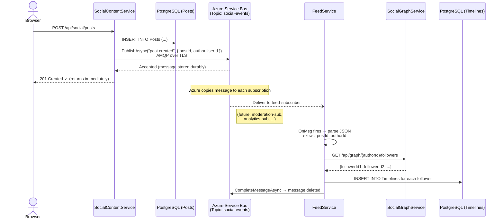
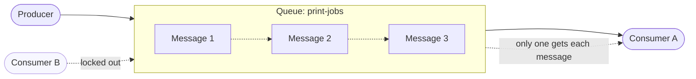

# Azure Service Bus — A Learning Guide

## What Is Azure Service Bus?

Azure Service Bus is a **cloud-hosted message broker** managed by
Microsoft. Think of it as a post office that lives in Azure's data
centers. Your code doesn't send messages directly to another service —
it drops a message into a **queue or topic** hosted in Azure, and a
completely separate piece of code picks that message up later.

The key insight: **your local C# code talks to Azure over the
internet**. The "bus" isn't a physical thing running inside your
computer — it's an HTTP/AMQP endpoint in Azure that your code connects
to using a **connection string** (a URL with credentials).

```
Your Code (localhost)                   Azure Cloud
┌──────────────────────┐    AMQP/TLS     ┌──────────────────────────┐
│ SocialContentService │ ──────────────► │ Azure Service Bus        │
│ (localhost:5003)     │                 │ Namespace: myapp-bus     │
│                      │                 │   Topic: social-events   │
│ "Hey, a post was     │                 │     Sub: feed-subscriber │
│  created!"           │                 │     Sub: moderation-sub  │
└──────────────────────┘                 └──────────────────────────┘
                                                    │
                                          AMQP/TLS  │
                                                    ▼
                                        ┌───────────────────────┐
                                        │ FeedService           │
                                        │ (localhost:5004)      │
                                        │                       │
                                        │ "Oh, a new post!      │
                                        │  Let me fan it out    │
                                        │  to follower feeds."  │
                                        └───────────────────────┘
```

Your services never talk directly to each other for this kind of
event — they both talk to the Service Bus in the cloud, and the bus
handles the delivery.

---

## Why Not Just Call the Other Service Directly?

You *could* make an HTTP call from SocialContentService to FeedService
every time a post is created. But a message bus solves several
problems:

| Problem | Direct HTTP | Service Bus |
|---|---|---|
| **FeedService is down** | Request fails, post creation might fail too | Message waits in the bus; FeedService processes it when it comes back |
| **FeedService is slow** | Post creation is blocked until FeedService responds | Post creation returns immediately; fan-out happens asynchronously |
| **Multiple consumers** | You need to call each one, adding coupling | Add a new subscription — no changes to the publisher |
| **Retry logic** | You have to build it yourself | Built-in: dead-letter queues, retry policies, lock duration |
| **Ordering guarantees** | Complex to manage | Sessions and FIFO queues available |

---

## Core Concepts

### 1. Namespace

A **namespace** is your Service Bus account in Azure. It has a
globally unique hostname like `myapp-bus.servicebus.windows.net`. All
your queues, topics, and subscriptions live inside it.

### 2. Queue (Point-to-Point)

A queue delivers each message to **exactly one** consumer. If three
instances of your service are listening, only one gets each message.

```
Producer → [ Queue ] → Consumer
                         (only one gets it)
```

### 3. Topic + Subscription (Publish/Subscribe)

A topic delivers each message to **every subscription**. Each
subscription is like an independent queue — every subscriber gets its
own copy.

```
                    ┌─ Subscription A → Consumer A (gets every message)
Producer → [ Topic ]┤
                    └─ Subscription B → Consumer B (gets every message)
```

This is what the SocialCommerce project uses. The topic is
`social-events`, and `feed-subscriber` is one subscription. You
could add a `moderation-subscriber` without changing any publisher
code.

### 4. Message

A message is a byte payload (usually JSON) plus metadata
(properties, subject, content type). It sits in the topic/queue
until a consumer picks it up and **completes** it (acknowledges
it).

---

## How Your Local Code Connects to Azure

### The Connection String

Everything starts with a **connection string**. This is a URL that
contains:

- The namespace endpoint (where Azure is hosting your bus)
- A shared access key name (the identity)
- A shared access key (the secret)

```
Endpoint=sb://myapp-bus.servicebus.windows.net/;
SharedAccessKeyName=RootManageSharedAccessKey;
SharedAccessKey=abc123...
```

Your local code uses this string to open a persistent **AMQP
connection** (a binary protocol over TLS) to Azure. From that
point, sending a message is just a method call in C# — the SDK
handles all the networking.

### What Happens Under the Hood

```
1. Your code calls SendMessageAsync(message)
2. The Azure.Messaging.ServiceBus SDK serializes the message
3. The SDK sends it over AMQP/TLS to the Service Bus namespace
4. Azure stores the message durably (replicated across 3 nodes)
5. Azure makes the message available to all topic subscriptions
6. A consumer's ServiceBusProcessor receives the message via AMQP
7. The consumer processes it and calls CompleteMessageAsync()
8. Azure removes the message from the subscription
```

The important thing: **steps 3–6 happen in Azure, not on your
machine**. Your code just pushes bytes into a connection and pulls
bytes out of another connection. Azure handles the storage,
replication, delivery, and retry logic.

---

## Step-by-Step: The SocialCommerce Example

Let's trace the exact path of a "post created" event through the
project.

### Step 1 — Azure Portal Setup (One-Time)

Before any code runs, you create the Azure resources:

```
Azure Portal (or CLI):
1. Create a Service Bus Namespace
   Name:     socialcommerce-bus
   Tier:     Standard (supports topics)
   Region:   East US

2. Create a Topic inside it
   Name:     social-events

3. Create a Subscription on that topic
   Name:     feed-subscriber
   (this is FeedService's "mailbox")

4. Copy the connection string from
   "Shared access policies" → RootManageSharedAccessKey
```

Or with Azure CLI:

```bash
# Create the namespace
az servicebus namespace create \
  --name socialcommerce-bus \
  --resource-group my-rg \
  --sku Standard

# Create the topic
az servicebus topic create \
  --namespace-name socialcommerce-bus \
  --resource-group my-rg \
  --name social-events

# Create the subscription (FeedService's mailbox)
az servicebus topic subscription create \
  --namespace-name socialcommerce-bus \
  --resource-group my-rg \
  --topic-name social-events \
  --name feed-subscriber
```

### Step 2 — Configure the Connection String

Each service stores the connection string in `appsettings.json`.

**SocialContentService** (the publisher):

```json
{
  "ServiceBus": {
    "Connection": "Endpoint=sb://socialcommerce-bus.servicebus.windows.net/;SharedAccessKeyName=...;SharedAccessKey=...",
    "Topic": "social-events"
  }
}
```

**FeedService** (the subscriber):

```json
{
  "ServiceBus": {
    "Connection": "Endpoint=sb://socialcommerce-bus.servicebus.windows.net/;SharedAccessKeyName=...;SharedAccessKey=...",
    "Topic": "social-events",
    "Subscription": "feed-subscriber"
  }
}
```

In local development, the connection string can be **empty** — the
project gracefully falls back to a no-op publisher so you can run
without Azure.

### Step 3 — Register the SDK Client (Program.cs)

At startup, the service creates a `ServiceBusClient` from the
connection string. This opens the AMQP connection to Azure.

From `SocialContentService/Program.cs`:

```csharp
// Read the connection string from config
string? sbConn = builder.Configuration["ServiceBus:Connection"];

if (!string.IsNullOrWhiteSpace(sbConn))
{
    // Create a long-lived client (holds the AMQP connection)
    builder.Services.AddSingleton(new ServiceBusClient(sbConn));

    // Register the real publisher that sends messages
    builder.Services.AddScoped<IBusPublisher, BusPublisher>();
}
else
{
    // No connection string → use a fake publisher that does nothing
    // This lets you run locally without Azure
    builder.Services.AddSingleton<IBusPublisher, NoOpBusPublisher>();
}
```

**What's happening here:**

- `ServiceBusClient` is a long-lived object from the
  `Azure.Messaging.ServiceBus` NuGet package.
- When you call `new ServiceBusClient(connectionString)`, the SDK
  parses the connection string, opens a TLS connection to Azure,
  and authenticates with the shared access key.
- The client is registered as a **singleton** because you want one
  connection shared across all requests.

### Step 4 — The Publisher (Sending Messages)

The `BusPublisher` wraps the SDK's `ServiceBusSender` — a
lightweight object that sends messages to a specific topic.

From `SocialContentService/Services/BusPublisher.cs`:

```csharp
public class BusPublisher : IBusPublisher
{
    private readonly ServiceBusSender _sender;

    public BusPublisher(ServiceBusClient client, IConfiguration cfg)
    {
        // Create a sender that targets the "social-events" topic
        _sender = client.CreateSender(cfg["ServiceBus:Topic"]!);
    }

    public Task PublishAsync(string type, object payload, CancellationToken ct = default)
    {
        // 1. Serialize the payload to JSON bytes
        byte[] body = JsonSerializer.SerializeToUtf8Bytes(payload);

        // 2. Wrap it in a ServiceBusMessage
        ServiceBusMessage msg = new ServiceBusMessage(body)
        {
            Subject = type,                    // e.g. "post.created"
            ContentType = "application/json"
        };

        // 3. Add the event type as a custom property (for filtering)
        msg.ApplicationProperties["type"] = type;

        // 4. Send it to Azure — this is the network call
        return _sender.SendMessageAsync(msg, ct);
    }
}
```

**What `SendMessageAsync` does under the hood:**

```
Your Process                          Azure Service Bus
    │                                       │
    │  ── AMQP TRANSFER frame ──────────►   │
    │     (message body + properties)       │
    │                                       │  Store message durably
    │                                       │  (3x replicated)
    │  ◄── AMQP DISPOSITION (accepted) ──   │
    │                                       │  Deliver copy to each
    │  Method returns (Task completes)      │  subscription's queue
    │                                       │
```

The call takes ~2–10 ms on a fast connection. Your code awaits it
and then moves on — it doesn't wait for any consumer to process the
message.

### Step 5 — The Controller Calls Publish

When a user creates a post, the controller saves it to the database
and then publishes the event:

From `SocialContentService/Controllers/PostsController.cs`:

```csharp
[HttpPost]
[Authorize(Policy = "social.write")]
public async Task<ActionResult<PostReadDto>> Create([FromBody] CreatePostDto dto)
{
    // ... create the Post entity ...

    // Save to PostgreSQL
    await _db.SaveChangesAsync();

    // Publish the event to Azure Service Bus
    await _bus.PublishAsync("post.created", new
    {
        postId = post.Id,
        authorUserId = post.AuthorUserId,
        groupId = post.GroupId,
        createdAt = post.CreatedAt
    });

    return CreatedAtAction(nameof(Get), new { postId = post.Id }, post.ToRead());
}
```

**The message payload** is a simple anonymous object serialized to
JSON. It contains only IDs and timestamps — not the full post
content. The consumer (FeedService) uses these IDs to do its own
work.

At this point, the message is sitting in Azure. The controller
returns `201 Created` to the caller. The post is saved. The
publisher's job is done.

### Step 6 — The Subscriber (Receiving Messages)

FeedService runs an `EventSubscriber` as a `BackgroundService` — it
starts when the application starts and runs continuously in the
background, listening for messages.

From `FeedService/Services/EventSubscriber.cs`:

```csharp
public class EventSubscriber : BackgroundService
{
    private readonly ServiceBusProcessor? _proc;

    public EventSubscriber(
        ILogger<EventSubscriber> log,
        IServiceProvider sp,
        IConfiguration cfg,
        ServiceBusClient? sb)
    {
        string? topic = cfg["ServiceBus:Topic"];        // "social-events"
        string? sub = cfg["ServiceBus:Subscription"];   // "feed-subscriber"

        if (sb != null && !string.IsNullOrWhiteSpace(topic)
                       && !string.IsNullOrWhiteSpace(sub))
        {
            // Create a processor — this is the receiving end
            _proc = sb.CreateProcessor(topic, sub, new ServiceBusProcessorOptions
            {
                AutoCompleteMessages = false,  // We'll manually complete
                MaxConcurrentCalls = 2         // Process 2 messages in parallel
            });

            // Wire up the handlers
            _proc.ProcessMessageAsync += OnMsg;
            _proc.ProcessErrorAsync += OnErr;
        }
    }

    protected override async Task ExecuteAsync(CancellationToken stoppingToken)
    {
        if (_proc != null)
        {
            // Start listening — this opens the AMQP receive link
            await _proc.StartProcessingAsync(stoppingToken);
        }
    }
```

**What `StartProcessingAsync` does:**

```
FeedService Process                     Azure Service Bus
    │                                       │
    │  ── AMQP ATTACH (receive link) ──►    │
    │     "I want messages from             │
    │      social-events/feed-subscriber"   │
    │                                       │
    │  ◄── AMQP TRANSFER ──────────────     │  (when a message arrives)
    │     (message body + properties)       │
    │                                       │
    │  [OnMsg handler runs]                 │
    │                                       │
    │  ── AMQP DISPOSITION (completed) ─►   │  (message removed from sub)
    │                                       │
```

The processor keeps the AMQP link open and Azure **pushes** messages
to it as they arrive. There's no polling loop — the SDK handles it.

### Step 7 — Processing the Message

When a message arrives, the `OnMsg` callback fires:

```csharp
private async Task OnMsg(ProcessMessageEventArgs arg)
{
    // Read the event type from the custom property
    string? type = arg.Message.ApplicationProperties
        .TryGetValue("type", out var t) ? t?.ToString() : arg.Message.Subject;

    try
    {
        // Parse the JSON body
        JsonDocument json = JsonDocument.Parse(arg.Message.Body);
        JsonElement root = json.RootElement;

        switch (type)
        {
            case "post.created":
                Guid postId = root.GetProperty("postId").GetGuid();
                Guid authorId = root.GetProperty("authorUserId").GetGuid();

                // Fetch the author's followers from SocialGraphService
                HashSet<Guid> followers = await graph.GetFollowersAsync(authorId);

                // Insert the post into each follower's timeline
                await builder.UpsertFanoutAsync(authorId, postId, createdAt, followers);
                break;

            case "content.removed":
                // Remove the post from all timelines
                Guid removedPostId = root.GetProperty("targetId").GetGuid();
                await db.Timelines.Where(t => t.PostId == removedPostId).ExecuteDeleteAsync();
                break;
        }

        // Tell Azure: "I processed this message successfully, delete it"
        await arg.CompleteMessageAsync(arg.Message);
    }
    catch (Exception ex)
    {
        // Tell Azure: "Something went wrong, give me this message again later"
        await arg.AbandonMessageAsync(arg.Message);
    }
}
```

**Complete vs. Abandon:**

| Action | What Happens |
|---|---|
| `CompleteMessageAsync` | Azure permanently removes the message from the subscription. Done. |
| `AbandonMessageAsync` | Azure makes the message available again. Another attempt will be made. |
| *(lock expires)* | If your code crashes without responding, the lock expires and Azure redelivers automatically. |

---

## The Complete Journey — Visualized



---

## Queue vs. Topic — When to Use Which

### Queue: One Sender, One Receiver

Use a queue when only **one** service should handle each message.
Example: a print job queue — you don't want three printers to all
print the same document.



```csharp
// Sender
ServiceBusSender sender = client.CreateSender("print-jobs");
await sender.SendMessageAsync(new ServiceBusMessage("Print invoice #42"));

// Receiver (only one instance gets each message)
ServiceBusProcessor processor = client.CreateProcessor("print-jobs");
processor.ProcessMessageAsync += async (args) =>
{
    string body = args.Message.Body.ToString();
    Console.WriteLine($"Printing: {body}");
    await args.CompleteMessageAsync(args.Message);
};
await processor.StartProcessingAsync();
```

### Topic + Subscription: One Sender, Many Receivers

Use a topic when **multiple** services need their own copy of each
message. This is what SocialCommerce uses — when a post is created,
FeedService needs to know, and so might a future moderation service
or analytics service.

```csharp
// Sender (publishes to the topic)
ServiceBusSender sender = client.CreateSender("social-events");
await sender.SendMessageAsync(new ServiceBusMessage("{ ... }"));

// Receiver A: FeedService (gets its own copy)
ServiceBusProcessor feedProc = client.CreateProcessor("social-events", "feed-subscriber");

// Receiver B: ModerationService (gets its own copy)
ServiceBusProcessor modProc = client.CreateProcessor("social-events", "moderation-sub");
```

Both receivers get **every message**. They process independently
at their own pace.

---

## A Minimal Standalone Example

Here's the simplest possible example — two console apps talking
through Azure Service Bus. You can run these side by side.

### Prerequisites

```bash
dotnet new console -n Sender
dotnet new console -n Receiver
cd Sender && dotnet add package Azure.Messaging.ServiceBus
cd ../Receiver && dotnet add package Azure.Messaging.ServiceBus
```

### Sender/Program.cs

```csharp
using Azure.Messaging.ServiceBus;

// This connection string points to YOUR namespace in Azure
string connectionString = "Endpoint=sb://my-namespace.servicebus.windows.net/;SharedAccessKeyName=RootManageSharedAccessKey;SharedAccessKey=YOUR_KEY";
string queueName = "demo-queue";

// Create the client — opens AMQP connection to Azure
ServiceBusClient client = new ServiceBusClient(connectionString);

// Create a sender for the specific queue
ServiceBusSender sender = client.CreateSender(queueName);

// Send 5 messages
for (int i = 1; i <= 5; i++)
{
    ServiceBusMessage message = new ServiceBusMessage($"Hello #{i} at {DateTime.UtcNow}");
    await sender.SendMessageAsync(message);
    Console.WriteLine($"Sent: {message.Body}");
}

Console.WriteLine("All messages sent. They're now sitting in Azure.");

await sender.DisposeAsync();
await client.DisposeAsync();
```

### Receiver/Program.cs

```csharp
using Azure.Messaging.ServiceBus;

string connectionString = "Endpoint=sb://my-namespace.servicebus.windows.net/;SharedAccessKeyName=RootManageSharedAccessKey;SharedAccessKey=YOUR_KEY";
string queueName = "demo-queue";

ServiceBusClient client = new ServiceBusClient(connectionString);

// Create a processor — listens continuously for messages
ServiceBusProcessor processor = client.CreateProcessor(queueName, new ServiceBusProcessorOptions
{
    AutoCompleteMessages = false,
    MaxConcurrentCalls = 1
});

// This callback fires every time a message arrives
processor.ProcessMessageAsync += async (ProcessMessageEventArgs args) =>
{
    string body = args.Message.Body.ToString();
    Console.WriteLine($"Received: {body}");

    // Tell Azure we processed it successfully
    await args.CompleteMessageAsync(args.Message);
};

processor.ProcessErrorAsync += (ProcessErrorEventArgs args) =>
{
    Console.WriteLine($"Error: {args.Exception.Message}");
    return Task.CompletedTask;
};

// Start listening
await processor.StartProcessingAsync();

Console.WriteLine("Listening for messages. Press Enter to stop.");
Console.ReadLine();

await processor.DisposeAsync();
await client.DisposeAsync();
```

### Running It

```
Terminal 1:  cd Receiver && dotnet run    (starts listening)
Terminal 2:  cd Sender && dotnet run      (sends 5 messages)

Terminal 1 output:
  Received: Hello #1 at 2025-01-15 10:00:00
  Received: Hello #2 at 2025-01-15 10:00:00
  ...
```

You can stop the Receiver, run the Sender, and then start the
Receiver again — the messages will still be there, because
**Azure stored them**.

---

## What Happens When Things Go Wrong

### Consumer Crashes

```
1. Message delivered to your processor (lock acquired)
2. Your code crashes before calling CompleteMessageAsync
3. Lock expires (default: 30 seconds)
4. Azure makes the message available again
5. Your processor (or another instance) receives it again
```

### Consumer Is Too Slow

If processing takes longer than the lock duration, Azure assumes you
crashed and redelivers. You can:

- Increase `MaxLockDuration` on the queue/subscription
- Call `RenewMessageLockAsync` periodically during processing

### Too Many Failures (Dead-Letter Queue)

After repeated failures (default: 10 delivery attempts), Azure moves
the message to a **dead-letter queue** — a separate sub-queue where
poison messages go so they don't block healthy messages.

```csharp
// Read from the dead-letter queue to investigate failures
ServiceBusReceiver dlqReceiver = client.CreateReceiver(
    "social-events",
    "feed-subscriber",
    new ServiceBusReceiverOptions
    {
        SubQueue = SubQueue.DeadLetter
    });

ServiceBusReceivedMessage deadMsg = await dlqReceiver.ReceiveMessageAsync();
Console.WriteLine($"Dead letter reason: {deadMsg.DeadLetterReason}");
Console.WriteLine($"Body: {deadMsg.Body}");
```

---

## Local Development Without Azure

The SocialCommerce project handles this gracefully: if the connection
string is empty, it registers a `NoOpBusPublisher` that silently
discards messages.

```csharp
// From SocialContentService/Services/NoOpBusPublisher.cs
public sealed class NoOpBusPublisher : IBusPublisher
{
    public Task PublishAsync(string type, object payload, CancellationToken ct = default)
        => Task.CompletedTask;  // Does nothing
}
```

This means you can `dotnet run` locally without any Azure
subscription. Events just won't propagate — FeedService won't get
notified of new posts. For local development, you can test the
services independently.

**Alternatives for local development:**

| Option | Description |
|---|---|
| Empty connection string (no-op) | What this project does — events are silently dropped |
| Azure Service Bus Emulator | Microsoft's local emulator (Docker-based, preview) |
| Free-tier Azure namespace | Create a real namespace on Azure's free tier for testing |

---

## Message Anatomy

Here's what a Service Bus message looks like in detail:

```
┌─────────────────────────────────────────────────────────┐
│ ServiceBusMessage                                       │
├─────────────────────────────────────────────────────────┤
│ Body (BinaryData):                                      │
│   {"postId":"a1b2...","authorUserId":"c3d4...",         │
│    "createdAt":"2025-01-15T10:00:00+00:00"}             │
├─────────────────────────────────────────────────────────┤
│ System Properties:                                      │
│   MessageId:     "auto-generated-guid"                  │
│   ContentType:   "application/json"                     │
│   Subject:       "post.created"                         │
│   EnqueuedTime:  2025-01-15T10:00:00.123Z (set by Azure)│
│   SequenceNumber: 42 (set by Azure)                     │
│   DeliveryCount: 1 (increments on each attempt)         │
├─────────────────────────────────────────────────────────┤
│ Application Properties (custom key-value pairs):        │
│   "type" = "post.created"                               │
└─────────────────────────────────────────────────────────┘
```

The **Body** is your payload. The **Subject** and **Application
Properties** are metadata you can use for routing and filtering.
Azure adds its own properties like `EnqueuedTime` and
`DeliveryCount`.

---

## Subscription Filters

You can add filters to a subscription so it only receives certain
messages. For example, if you only want order events:

```csharp
// Using Azure.Messaging.ServiceBus.Administration
ServiceBusAdministrationClient admin = new ServiceBusAdministrationClient(connectionString);

await admin.CreateSubscriptionAsync(
    new CreateSubscriptionOptions("social-events", "order-only"),
    new CreateRuleOptions("OrderFilter", new SqlRuleFilter("type LIKE 'evt:order:%'"))
);
```

Now the `order-only` subscription only receives messages where the
`type` application property starts with `evt:order:`.

---

## Key SDK Types — Cheat Sheet

| Type | Role | Lifetime |
|---|---|---|
| `ServiceBusClient` | Holds the AMQP connection to Azure | Singleton (one per app) |
| `ServiceBusSender` | Sends messages to a specific queue/topic | Long-lived (reuse it) |
| `ServiceBusProcessor` | Continuously receives from a queue/subscription | Long-lived (runs in background) |
| `ServiceBusReceiver` | Pull-based receive (manual) | Short-lived (open, receive, close) |
| `ServiceBusMessage` | A message you're about to send | Transient (create per message) |
| `ServiceBusReceivedMessage` | A message you received | Transient (process and complete) |
| `ProcessMessageEventArgs` | Wraps a received message in processor callbacks | Transient (per callback) |

---

## Glossary

| Term | Meaning |
|---|---|
| **Namespace** | Your Service Bus account in Azure. Has a unique hostname. Contains all your queues and topics. |
| **Queue** | Point-to-point: one message → one consumer. |
| **Topic** | Publish/subscribe: one message → copied to each subscription. |
| **Subscription** | A consumer's "mailbox" on a topic. Each gets its own copy of every message. |
| **AMQP** | Advanced Message Queuing Protocol — the binary protocol used to talk to Service Bus. Runs over TLS. |
| **Lock** | When a message is delivered, Azure locks it so no other consumer gets it. You must complete or abandon it before the lock expires. |
| **Dead-letter queue (DLQ)** | Where messages go after too many failed delivery attempts. A safety net for poison messages. |
| **Complete** | Tell Azure: "I processed this message, delete it permanently." |
| **Abandon** | Tell Azure: "I couldn't process this, make it available for retry." |
| **Peek** | Look at a message without locking or removing it (useful for debugging). |
| **Connection string** | URL + credentials that your code uses to connect to the namespace. |
| **Session** | A feature for ordered processing — messages with the same session ID are delivered in order to the same consumer. |
| **Fan-out** | The pattern of writing data to multiple destinations — in this project, inserting a post into many followers' timelines. |

---

## Further Reading

- [Azure Service Bus messaging overview](https://learn.microsoft.com/en-us/azure/service-bus-messaging/service-bus-messaging-overview)
- [Queues, topics, and subscriptions](https://learn.microsoft.com/en-us/azure/service-bus-messaging/service-bus-queues-topics-subscriptions)
- [Get started with Azure Service Bus topics (.NET)](https://learn.microsoft.com/en-us/azure/service-bus-messaging/service-bus-dotnet-how-to-use-topics-subscriptions)
- [Dead-letter queues](https://learn.microsoft.com/en-us/azure/service-bus-messaging/service-bus-dead-letter-queues)
- [Azure.Messaging.ServiceBus NuGet package](https://www.nuget.org/packages/Azure.Messaging.ServiceBus)
