# Phase 1 — Communication Backend: Dataflow & Architecture

## Overview

Phase 1 delivers the **real-time communication** layer of the
SocialCommerce super-app. It comprises three domain services that
handle messaging, online presence, and voice/video calling:

| Service | Port | Style | Storage | Purpose |
|---|---|---|---|---|
| **CommunicationService** | 5008 | REST (Controllers) | PostgreSQL (`communication_db`) | Conversations (DM & Room), messages, reactions, attachments, pins, read receipts, search |
| **PresenceService** | 5009 | REST (Minimal API) | Redis (TTL-based) | Online/offline/idle/DND status, heartbeats, typing indicators |
| **SignalingService** | 5010 | REST (Controllers) | PostgreSQL (`signaling_db`) | WebRTC call session management, SDP/ICE candidate relay, participant state |

### Dependency on Phase 0 Services

| Dependency | Role in Phase 1 |
|---|---|
| **UserService** (5001) | BFF gateway — authenticates browser sessions, issues internal JWTs that Phase 1 services validate |
| **MediaService** (5006) | Processes file uploads; `MediaId` on message attachments references a media asset uploaded via MediaService |
| **RealTimeHub** (5007) | Centralized WebSocket gateway — all Phase 1 services publish real-time events (messages, presence, calls) to the hub via internal HTTP API |

---

## High-Level Architecture

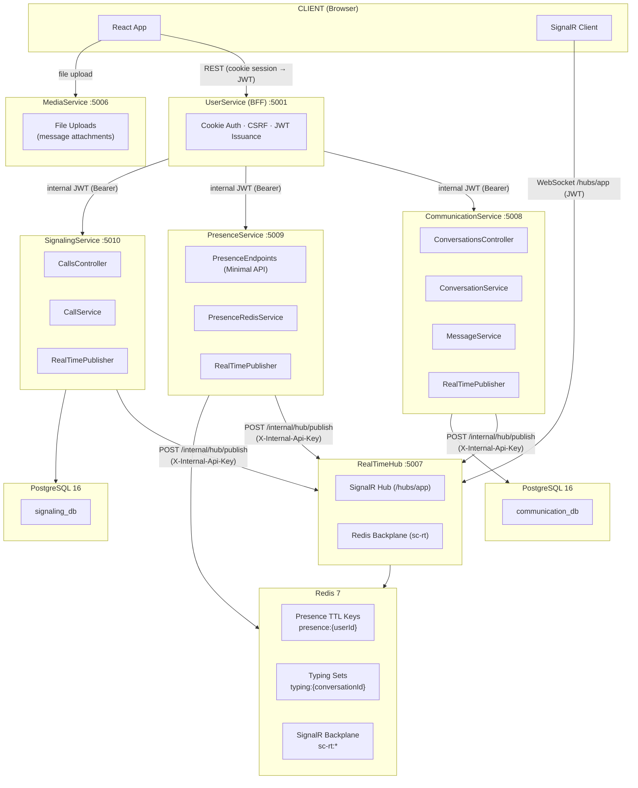
```mermaid
graph TB
    subgraph Client ["CLIENT (Browser)"]
        React["React App"]
        SRClient["SignalR Client"]
    end

    React -- "REST (cookie session → JWT)" --> BFF
    SRClient -- "WebSocket /hubs/app (JWT)" --> RTHub

    subgraph BFF ["UserService (BFF) :5001"]
        Auth["Cookie Auth · CSRF · JWT Issuance"]
    end

    BFF -- "internal JWT (Bearer)" --> Comm
    BFF -- "internal JWT (Bearer)" --> Pres
    BFF -- "internal JWT (Bearer)" --> Sig

    subgraph Comm ["CommunicationService :5008"]
        CC["ConversationsController"]
        CS["ConversationService"]
        MS["MessageService"]
        RTP1["RealTimePublisher"]
    end

    subgraph Pres ["PresenceService :5009"]
        PE["PresenceEndpoints (Minimal API)"]
        PRS["PresenceRedisService"]
        RTP2["RealTimePublisher"]
    end

    subgraph Sig ["SignalingService :5010"]
        CAC["CallsController"]
        CAS["CallService"]
        RTP3["RealTimePublisher"]
    end

    Comm -- "POST /internal/hub/publish\n(X-Internal-Api-Key)" --> RTHub
    Pres -- "POST /internal/hub/publish\n(X-Internal-Api-Key)" --> RTHub
    Sig -- "POST /internal/hub/publish\n(X-Internal-Api-Key)" --> RTHub

    subgraph RTHub ["RealTimeHub :5007"]
        Hub["SignalR Hub (/hubs/app)"]
        BP["Redis Backplane (sc-rt)"]
    end

    RTHub --> Redis
    Comm --> PGComm
    Pres --> Redis
    Sig --> PGSig

    subgraph PGComm ["PostgreSQL 16"]
        DB1["communication_db"]
    end

    subgraph PGSig ["PostgreSQL 16"]
        DB2["signaling_db"]
    end

    subgraph Redis ["Redis 7"]
        PresKeys["Presence TTL Keys\npresence:{userId}"]
        TypingKeys["Typing Sets\ntyping:{conversationId}"]
        Backplane["SignalR Backplane\nsc-rt:*"]
    end

    subgraph Media ["MediaService :5006"]
        Upload["File Uploads\n(message attachments)"]
    end

    React -- "file upload" --> Media
```

---

## Authentication Flow

All Phase 1 services use the **same symmetric-key JWT** scheme. The
**UserService (BFF)** is the sole JWT issuer; Phase 1 services are
consumers only.

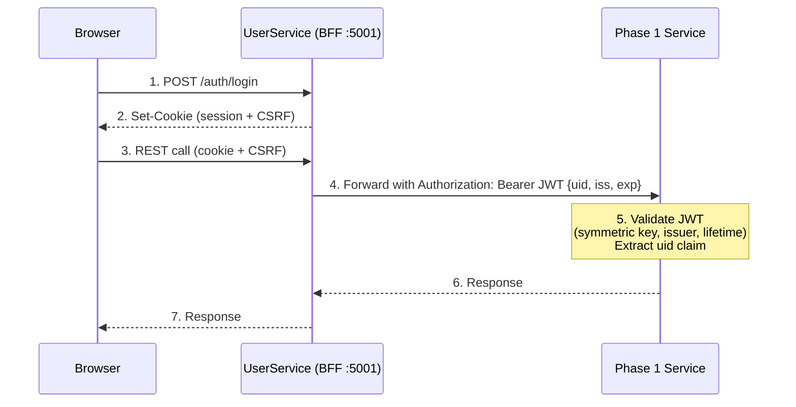
```mermaid
sequenceDiagram
    participant Browser
    participant BFF as UserService (BFF :5001)
    participant Svc as Phase 1 Service

    Browser->>BFF: 1. POST /auth/login
    BFF-->>Browser: 2. Set-Cookie (session + CSRF)

    Browser->>BFF: 3. REST call (cookie + CSRF)
    BFF->>Svc: 4. Forward with Authorization: Bearer JWT {uid, iss, exp}

    Note over Svc: 5. Validate JWT<br/>(symmetric key, issuer, lifetime)<br/>Extract uid claim

    Svc-->>BFF: 6. Response
    BFF-->>Browser: 7. Response
```

**JWT claims used:**

| Claim | Description |
|---|---|
| `uid` | User ID (GUID) — primary identity, extracted via `User.FindFirstValue("uid")` |
| `iss` | `"SocialCommerce"` — validated by `JwtAuthExtensions` |
| `exp` | Token expiration — validated with 30s clock skew |

**Auth configuration (shared across all Phase 1 services):**

```
Authentication:Jwt:SymmetricKey → shared symmetric signing key
Authentication:Jwt:Issuer       → "SocialCommerce"
ValidateAudience                → false (not checked)
```

---

## Real-Time Event Publishing

All Phase 1 services publish events to the **RealTimeHub** via its
internal HTTP API. This is a direct HTTP POST — not Azure Service Bus.

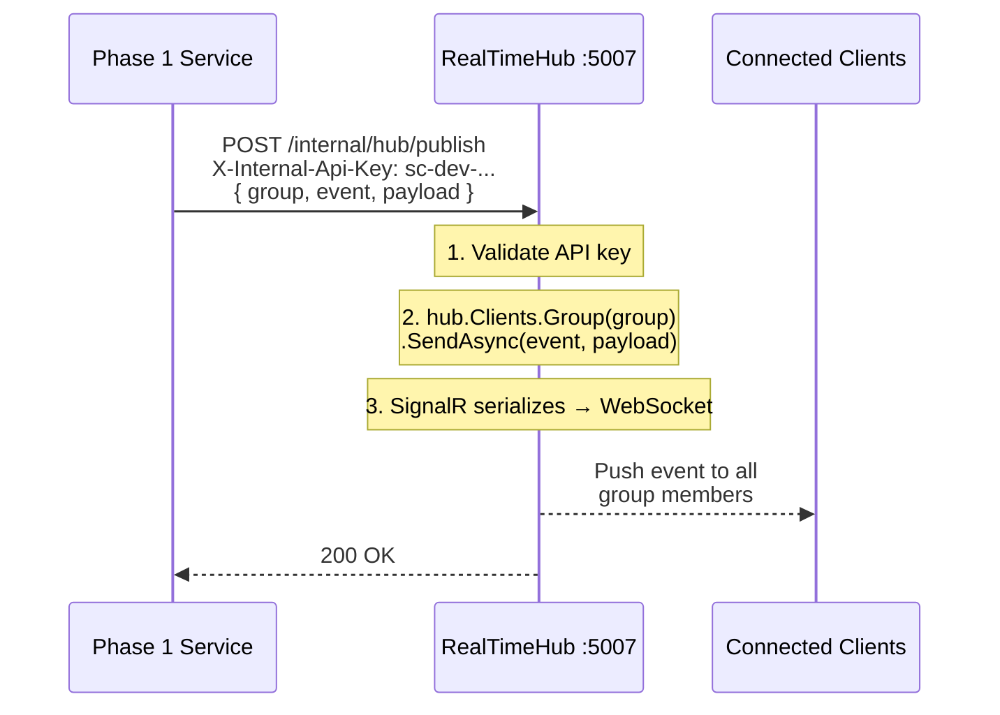
```mermaid
sequenceDiagram
    participant Svc as Phase 1 Service
    participant RTHub as RealTimeHub :5007
    participant Clients as Connected Clients

    Svc->>RTHub: POST /internal/hub/publish<br/>X-Internal-Api-Key: sc-dev-...<br/>{ group, event, payload }

    Note over RTHub: 1. Validate API key
    Note over RTHub: 2. hub.Clients.Group(group)<br/>.SendAsync(event, payload)
    Note over RTHub: 3. SignalR serializes → WebSocket

    RTHub-->>Clients: Push event to all<br/>group members
    RTHub-->>Svc: 200 OK
```

**IRealTimePublisher interface (identical in all three services):**

```
Task PublishAsync(string group, string eventName, object payload, CancellationToken ct)
```

**Best-effort pattern:** `RealTimePublisher` catches all exceptions
from the HTTP call — a domain operation succeeds even if the real-time
push fails.

---

## Service 1 — CommunicationService (:5008)

### Dataflow

#### 1a. Create Conversation

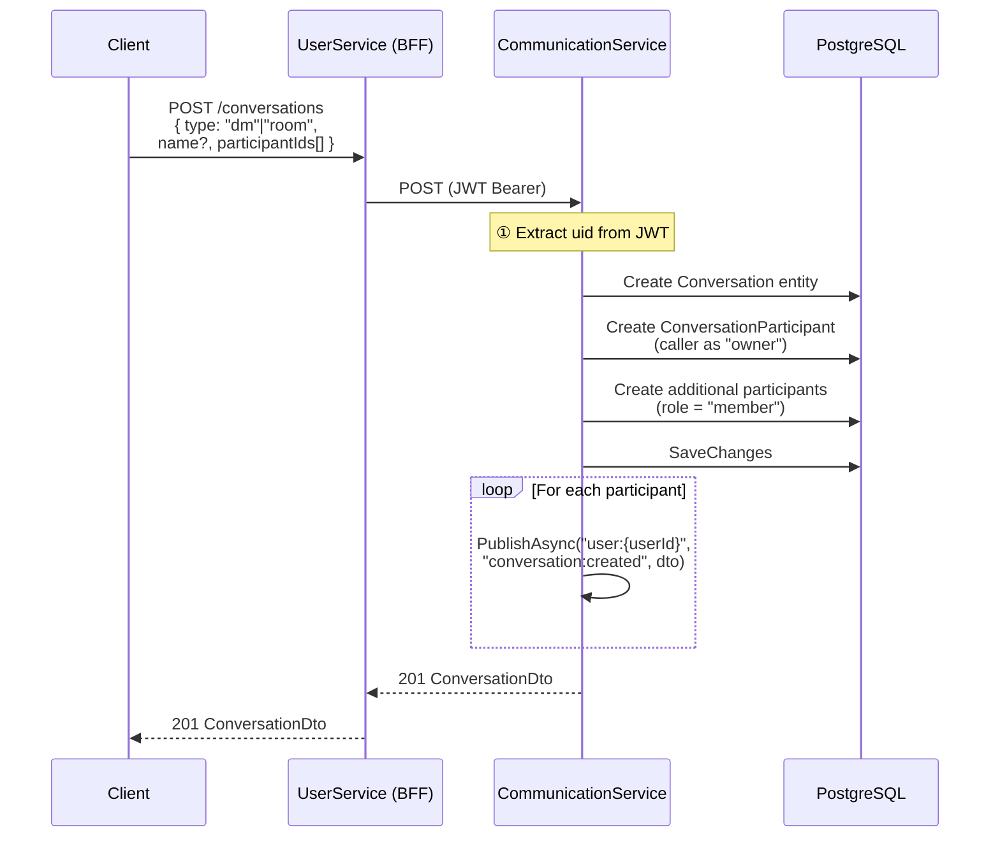
```mermaid
sequenceDiagram
    participant Client
    participant BFF as UserService (BFF)
    participant CS as CommunicationService
    participant PG as PostgreSQL

    Client->>BFF: POST /conversations<br/>{ type: "dm"|"room",<br/>name?, participantIds[] }
    BFF->>CS: POST (JWT Bearer)

    Note over CS: ① Extract uid from JWT

    CS->>PG: Create Conversation entity
    CS->>PG: Create ConversationParticipant<br/>(caller as "owner")
    CS->>PG: Create additional participants<br/>(role = "member")
    CS->>PG: SaveChanges

    loop For each participant
        CS->>CS: PublishAsync("user:{userId}",<br/>"conversation:created", dto)
    end

    CS-->>BFF: 201 ConversationDto
    BFF-->>Client: 201 ConversationDto
```

#### 1b. Send Message

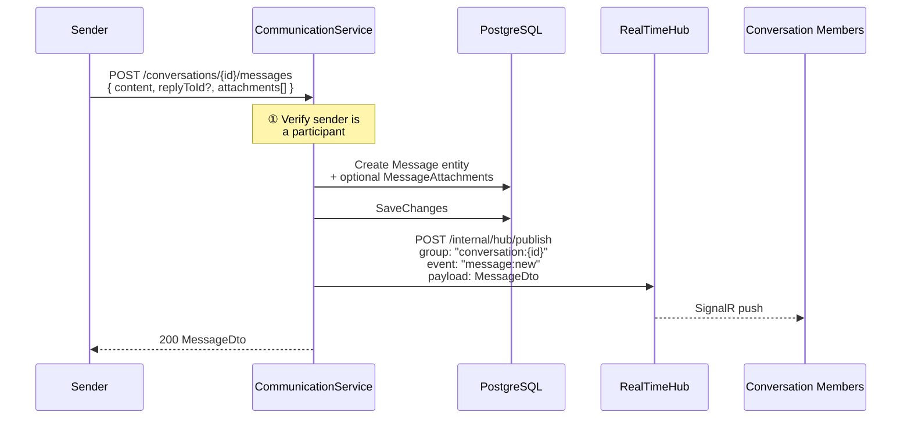
```mermaid
sequenceDiagram
    participant Sender
    participant CS as CommunicationService
    participant PG as PostgreSQL
    participant RTHub as RealTimeHub
    participant Participants as Conversation Members

    Sender->>CS: POST /conversations/{id}/messages<br/>{ content, replyToId?, attachments[] }

    Note over CS: ① Verify sender is<br/>a participant

    CS->>PG: Create Message entity<br/>+ optional MessageAttachments
    CS->>PG: SaveChanges

    CS->>RTHub: POST /internal/hub/publish<br/>group: "conversation:{id}"<br/>event: "message:new"<br/>payload: MessageDto

    RTHub-->>Participants: SignalR push

    CS-->>Sender: 200 MessageDto
```

#### 1c. Edit Message

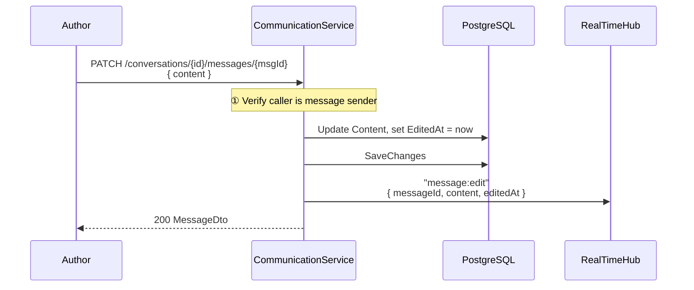
```mermaid
sequenceDiagram
    participant Author
    participant CS as CommunicationService
    participant PG as PostgreSQL
    participant RTHub as RealTimeHub

    Author->>CS: PATCH /conversations/{id}/messages/{msgId}<br/>{ content }

    Note over CS: ① Verify caller is message sender

    CS->>PG: Update Content, set EditedAt = now
    CS->>PG: SaveChanges

    CS->>RTHub: "message:edit"<br/>{ messageId, content, editedAt }

    CS-->>Author: 200 MessageDto
```

#### 1d. Delete Message

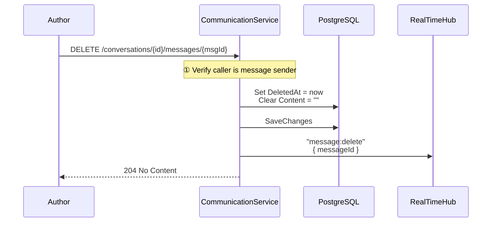
```mermaid
sequenceDiagram
    participant Author
    participant CS as CommunicationService
    participant PG as PostgreSQL
    participant RTHub as RealTimeHub

    Author->>CS: DELETE /conversations/{id}/messages/{msgId}

    Note over CS: ① Verify caller is message sender

    CS->>PG: Set DeletedAt = now<br/>Clear Content = ""
    CS->>PG: SaveChanges

    CS->>RTHub: "message:delete"<br/>{ messageId }

    CS-->>Author: 204 No Content
```

#### 1e. Add / Remove Reaction

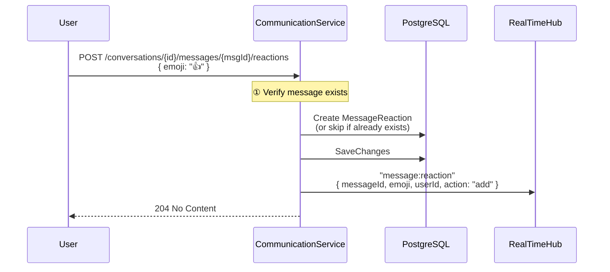
```mermaid
sequenceDiagram
    participant User
    participant CS as CommunicationService
    participant PG as PostgreSQL
    participant RTHub as RealTimeHub

    User->>CS: POST /conversations/{id}/messages/{msgId}/reactions<br/>{ emoji: "👍" }

    Note over CS: ① Verify message exists

    CS->>PG: Create MessageReaction<br/>(or skip if already exists)
    CS->>PG: SaveChanges

    CS->>RTHub: "message:reaction"<br/>{ messageId, emoji, userId, action: "add" }

    CS-->>User: 204 No Content
```

#### 1f. Pin / Unpin Message

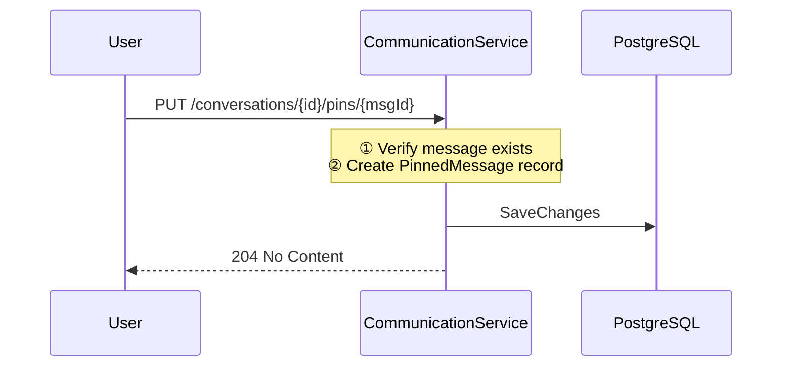
```mermaid
sequenceDiagram
    participant User
    participant CS as CommunicationService
    participant PG as PostgreSQL

    User->>CS: PUT /conversations/{id}/pins/{msgId}

    Note over CS: ① Verify message exists<br/>② Create PinnedMessage record

    CS->>PG: SaveChanges
    CS-->>User: 204 No Content
```

#### 1g. Mark Conversation as Read

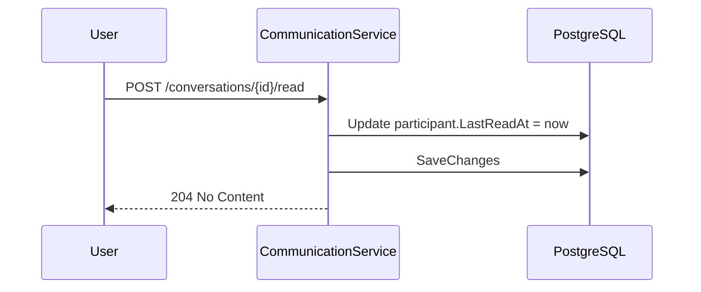
```mermaid
sequenceDiagram
    participant User
    participant CS as CommunicationService
    participant PG as PostgreSQL

    User->>CS: POST /conversations/{id}/read

    CS->>PG: Update participant.LastReadAt = now
    CS->>PG: SaveChanges

    CS-->>User: 204 No Content
```

#### 1h. Message Search (Within Conversation)

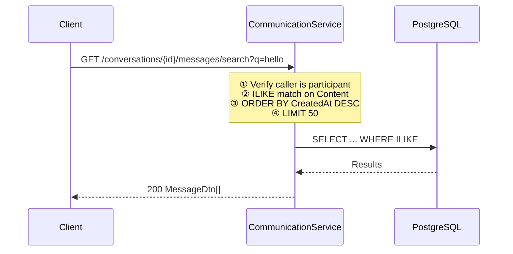
```mermaid
sequenceDiagram
    participant Client
    participant CS as CommunicationService
    participant PG as PostgreSQL

    Client->>CS: GET /conversations/{id}/messages/search?q=hello

    Note over CS: ① Verify caller is participant<br/>② ILIKE match on Content<br/>③ ORDER BY CreatedAt DESC<br/>④ LIMIT 50

    CS->>PG: SELECT ... WHERE ILIKE
    PG-->>CS: Results

    CS-->>Client: 200 MessageDto[]
```

---

## Service 2 — PresenceService (:5009)

### Design Principles

- Presence state is stored in **Redis** with TTL-based heartbeats —
  no PostgreSQL required.
- Heartbeat interval: client calls `POST /presence/heartbeat` every
  **30 seconds**.
- If no heartbeat for **90 seconds** → user status becomes `offline`.
- Typing indicators use Redis SET with **5-second TTL**.

### Redis Key Layout

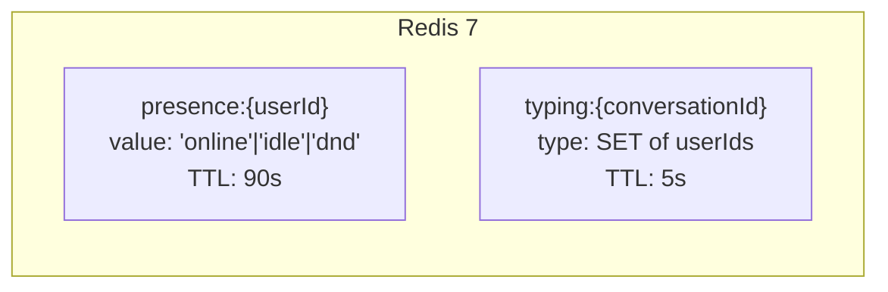
```mermaid
graph LR
    subgraph Redis ["Redis 7"]
        P["presence:{userId}<br/>value: 'online'|'idle'|'dnd'<br/>TTL: 90s"]
        T["typing:{conversationId}<br/>type: SET of userIds<br/>TTL: 5s"]
    end
```

| Key Pattern | Type | TTL | Purpose |
|---|---|---|---|
| `presence:{userId}` | STRING | 90s | User status (`online`, `idle`, `dnd`) |
| `typing:{conversationId}` | SET | 5s | Active typers in a conversation |

### Dataflow

#### 2a. Heartbeat

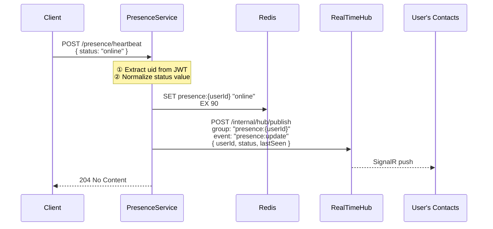
```mermaid
sequenceDiagram
    participant Client
    participant PS as PresenceService
    participant Redis as Redis
    participant RTHub as RealTimeHub
    participant Contacts as User's Contacts

    Client->>PS: POST /presence/heartbeat<br/>{ status: "online" }

    Note over PS: ① Extract uid from JWT<br/>② Normalize status value

    PS->>Redis: SET presence:{userId} "online"<br/>EX 90

    PS->>RTHub: POST /internal/hub/publish<br/>group: "presence:{userId}"<br/>event: "presence:update"<br/>{ userId, status, lastSeen }

    RTHub-->>Contacts: SignalR push

    PS-->>Client: 204 No Content
```

#### 2b. Presence Lookup (Single & Bulk)

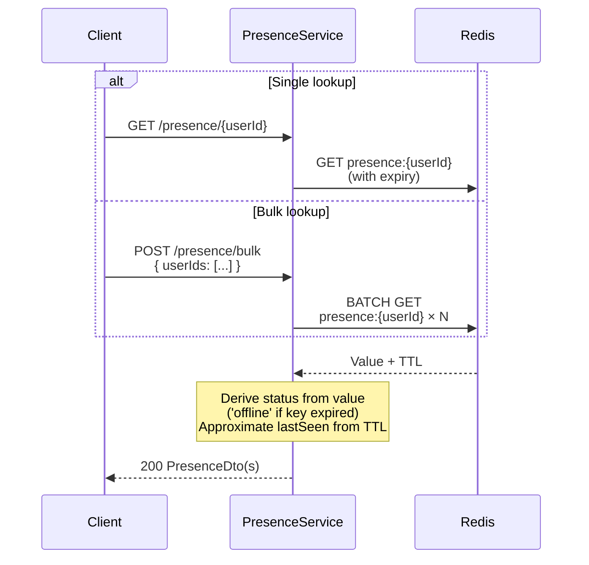
```mermaid
sequenceDiagram
    participant Client
    participant PS as PresenceService
    participant Redis as Redis

    alt Single lookup
        Client->>PS: GET /presence/{userId}
        PS->>Redis: GET presence:{userId}<br/>(with expiry)
    else Bulk lookup
        Client->>PS: POST /presence/bulk<br/>{ userIds: [...] }
        PS->>Redis: BATCH GET<br/>presence:{userId} × N
    end

    Redis-->>PS: Value + TTL

    Note over PS: Derive status from value<br/>('offline' if key expired)<br/>Approximate lastSeen from TTL

    PS-->>Client: 200 PresenceDto(s)
```

#### 2c. Typing Indicators

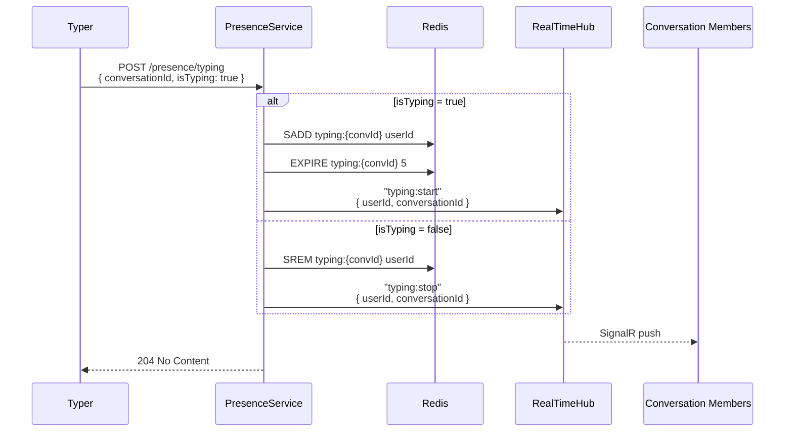
```mermaid
sequenceDiagram
    participant Typer
    participant PS as PresenceService
    participant Redis as Redis
    participant RTHub as RealTimeHub
    participant Members as Conversation Members

    Typer->>PS: POST /presence/typing<br/>{ conversationId, isTyping: true }

    alt isTyping = true
        PS->>Redis: SADD typing:{convId} userId
        PS->>Redis: EXPIRE typing:{convId} 5
        PS->>RTHub: "typing:start"<br/>{ userId, conversationId }
    else isTyping = false
        PS->>Redis: SREM typing:{convId} userId
        PS->>RTHub: "typing:stop"<br/>{ userId, conversationId }
    end

    RTHub-->>Members: SignalR push

    PS-->>Typer: 204 No Content
```

---

## Service 3 — SignalingService (:5010)

### Design Principles

- Manages **WebRTC call session lifecycle** and **SDP/ICE relay** —
  does not handle media streams directly.
- Media flows **peer-to-peer** via WebRTC; a media server (e.g.,
  mediasoup, Janus) is planned for Phase 6 group calls > 4
  participants.
- Call state transitions: `ringing` → `active` → `ended`.
- Auto-end: when all participants leave, the call is automatically
  marked as `ended`.

### Dataflow

#### 3a. Initiate Call

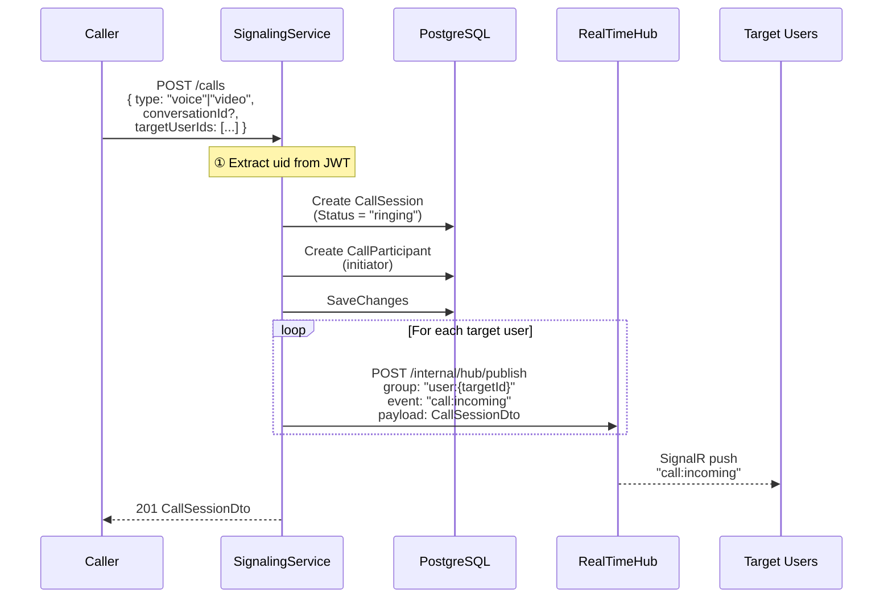
```mermaid
sequenceDiagram
    participant Caller
    participant SS as SignalingService
    participant PG as PostgreSQL
    participant RTHub as RealTimeHub
    participant Targets as Target Users

    Caller->>SS: POST /calls<br/>{ type: "voice"|"video",<br/>conversationId?,<br/>targetUserIds: [...] }

    Note over SS: ① Extract uid from JWT

    SS->>PG: Create CallSession<br/>(Status = "ringing")
    SS->>PG: Create CallParticipant<br/>(initiator)
    SS->>PG: SaveChanges

    loop For each target user
        SS->>RTHub: POST /internal/hub/publish<br/>group: "user:{targetId}"<br/>event: "call:incoming"<br/>payload: CallSessionDto
    end

    RTHub-->>Targets: SignalR push<br/>"call:incoming"

    SS-->>Caller: 201 CallSessionDto
```

#### 3b. Call State Machine

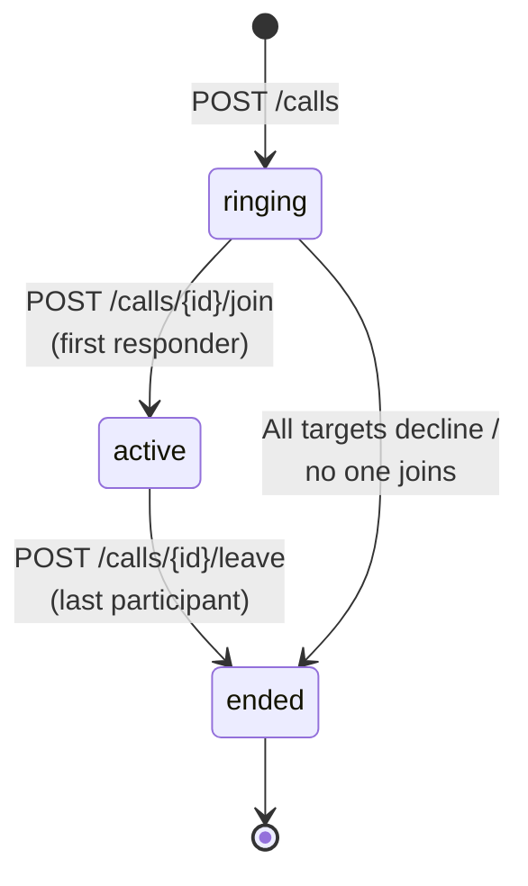
```mermaid
stateDiagram-v2
    [*] --> ringing : POST /calls
    ringing --> active : POST /calls/{id}/join<br/>(first responder)
    active --> ended : POST /calls/{id}/leave<br/>(last participant)
    ringing --> ended : All targets decline /<br/>no one joins
    ended --> [*]
```

#### 3c. Join Call

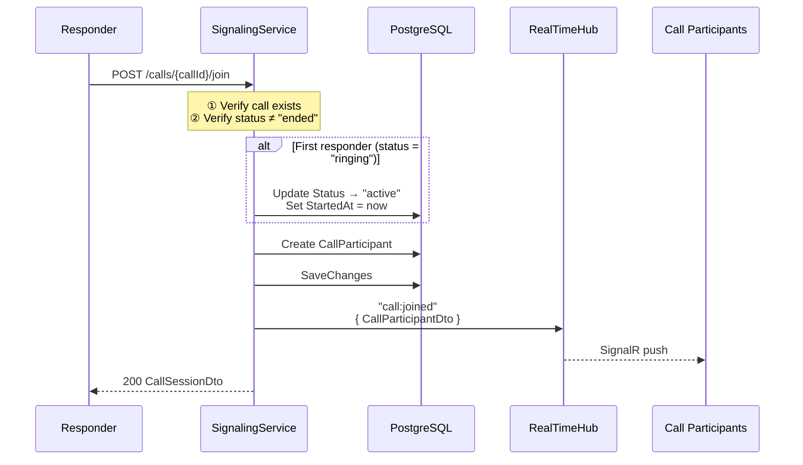
```mermaid
sequenceDiagram
    participant Responder
    participant SS as SignalingService
    participant PG as PostgreSQL
    participant RTHub as RealTimeHub
    participant Others as Call Participants

    Responder->>SS: POST /calls/{callId}/join

    Note over SS: ① Verify call exists<br/>② Verify status ≠ "ended"

    alt First responder (status = "ringing")
        SS->>PG: Update Status → "active"<br/>Set StartedAt = now
    end

    SS->>PG: Create CallParticipant
    SS->>PG: SaveChanges

    SS->>RTHub: "call:joined"<br/>{ CallParticipantDto }

    RTHub-->>Others: SignalR push

    SS-->>Responder: 200 CallSessionDto
```

#### 3d. Leave Call / Hang Up

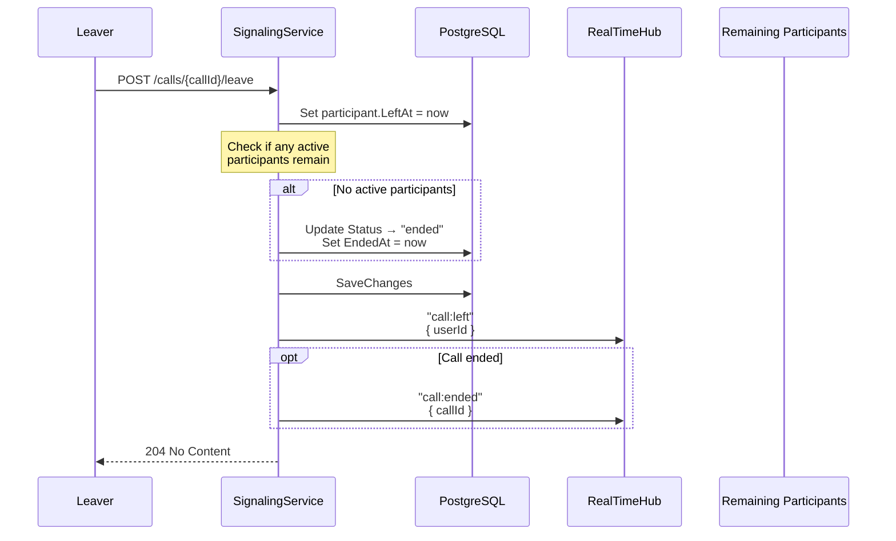
```mermaid
sequenceDiagram
    participant Leaver
    participant SS as SignalingService
    participant PG as PostgreSQL
    participant RTHub as RealTimeHub
    participant Others as Remaining Participants

    Leaver->>SS: POST /calls/{callId}/leave

    SS->>PG: Set participant.LeftAt = now

    Note over SS: Check if any active<br/>participants remain

    alt No active participants
        SS->>PG: Update Status → "ended"<br/>Set EndedAt = now
    end

    SS->>PG: SaveChanges

    SS->>RTHub: "call:left"<br/>{ userId }

    opt Call ended
        SS->>RTHub: "call:ended"<br/>{ callId }
    end

    SS-->>Leaver: 204 No Content
```

#### 3e. SDP / ICE Signal Relay

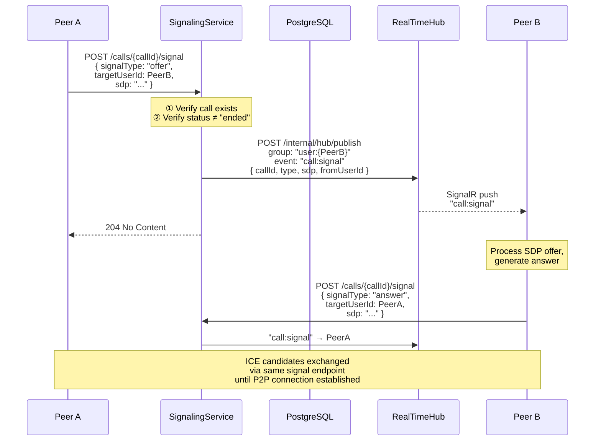
```mermaid
sequenceDiagram
    participant PeerA as Peer A
    participant SS as SignalingService
    participant PG as PostgreSQL
    participant RTHub as RealTimeHub
    participant PeerB as Peer B

    PeerA->>SS: POST /calls/{callId}/signal<br/>{ signalType: "offer",<br/>targetUserId: PeerB,<br/>sdp: "..." }

    Note over SS: ① Verify call exists<br/>② Verify status ≠ "ended"

    SS->>RTHub: POST /internal/hub/publish<br/>group: "user:{PeerB}"<br/>event: "call:signal"<br/>{ callId, type, sdp, fromUserId }

    RTHub-->>PeerB: SignalR push<br/>"call:signal"

    SS-->>PeerA: 204 No Content

    Note over PeerB: Process SDP offer,<br/>generate answer

    PeerB->>SS: POST /calls/{callId}/signal<br/>{ signalType: "answer",<br/>targetUserId: PeerA,<br/>sdp: "..." }

    SS->>RTHub: "call:signal" → PeerA

    Note over PeerA,PeerB: ICE candidates exchanged<br/>via same signal endpoint<br/>until P2P connection established
```

#### 3f. Update Participant State (Mute / Camera / Screen Share)

```mermaid
sequenceDiagram
    participant User
    participant SS as SignalingService
    participant PG as PostgreSQL
    participant RTHub as RealTimeHub
    participant Others as Call Participants

    User->>SS: PATCH /calls/{callId}/participants/{userId}/state<br/>{ isMuted: true, isCameraOn: false }

    Note over SS: ① Verify caller matches userId

    SS->>PG: Update CallParticipant fields
    SS->>PG: SaveChanges

    SS->>RTHub: "call:state_update"<br/>{ userId, isMuted, isCameraOn, ... }

    RTHub-->>Others: SignalR push

    SS-->>User: 204 No Content
```

---

## Data Storage Layout

### PostgreSQL — communication_db (CommunicationService)

```mermaid
erDiagram
    Conversation ||--o{ ConversationParticipant : "has many"
    Conversation ||--o{ Message : "has many"
    Conversation ||--o{ PinnedMessage : "has many"
    Message ||--o{ MessageAttachment : "has many"
    Message ||--o{ MessageReaction : "has many"

    Conversation {
        uuid Id PK
        string Type
        string Name
        string AvatarUrl
        timestamptz CreatedAt
        uuid CreatedBy FK
    }

    ConversationParticipant {
        uuid ConversationId PK,FK
        uuid UserId PK
        string Role
        timestamptz JoinedAt
        timestamptz LastReadAt
    }

    Message {
        uuid Id PK
        uuid ConversationId FK
        uuid SenderId FK
        string Content
        uuid ReplyToId FK
        timestamptz EditedAt
        timestamptz DeletedAt
        timestamptz CreatedAt
    }

    MessageAttachment {
        uuid Id PK
        uuid MessageId FK
        uuid MediaId FK
        string Type
    }

    MessageReaction {
        uuid MessageId PK,FK
        uuid UserId PK
        string Emoji PK
        timestamptz CreatedAt
    }

    PinnedMessage {
        uuid ConversationId PK,FK
        uuid MessageId PK,FK
        uuid PinnedBy FK
        timestamptz PinnedAt
    }
```

### PostgreSQL — signaling_db (SignalingService)

```mermaid
erDiagram
    CallSession ||--o{ CallParticipant : "has many"

    CallSession {
        uuid Id PK
        string Type
        uuid InitiatorId FK
        string Status
        uuid ConversationId FK
        timestamptz StartedAt
        timestamptz EndedAt
        timestamptz CreatedAt
    }

    CallParticipant {
        uuid CallSessionId PK,FK
        uuid UserId PK
        boolean IsMuted
        boolean IsDeafened
        boolean IsCameraOn
        boolean IsScreenSharing
        timestamptz JoinedAt
        timestamptz LeftAt
    }
```

### Redis — Shared with Phase 0

PresenceService uses Redis directly for ephemeral presence and typing
state. The RealTimeHub also uses Redis as its SignalR backplane:

```
Redis 7 (container: redis, port 6379)
│
├── Presence Keys
│   └── presence:{userId}  STRING  TTL 90s
│
├── Typing Keys
│   └── typing:{conversationId}  SET  TTL 5s
│
└── SignalR Backplane (RealTimeHub)
    └── sc-rt:*  PUB/SUB channels
```

**Database indexes (configured in `OnModelCreating`):**

| Table | Index | Purpose |
|---|---|---|
| `Messages` | `(ConversationId, CreatedAt)` | Efficient cursor-paged message history |
| `CallSessions` | `InitiatorId` | Lookup calls by initiator |
| `CallSessions` | `ConversationId` | Lookup calls linked to a conversation |

---

## Cross-Service Communication Map

```mermaid
graph TB
    subgraph Phase0 ["Phase 0 Services"]
        BFF["UserService (BFF)<br/>:5001"]
        Media["MediaService<br/>:5006"]
    end

    subgraph Phase0Infra ["Phase 0 Infrastructure"]
        RTHub["RealTimeHub<br/>:5007"]
        Redis["Redis 7"]
    end

    subgraph Phase1 ["Phase 1"]
        Comm["CommunicationService<br/>:5008"]
        Pres["PresenceService<br/>:5009"]
        Sig["SignalingService<br/>:5010"]
    end

    subgraph Storage ["PostgreSQL 16"]
        DB1["communication_db"]
        DB2["signaling_db"]
    end

    BFF -- "JWT Bearer<br/>(internal)" --> Comm
    BFF -- "JWT Bearer<br/>(internal)" --> Pres
    BFF -- "JWT Bearer<br/>(internal)" --> Sig

    Comm -- "HTTP POST<br/>/internal/hub/publish<br/>(API key)" --> RTHub
    Pres -- "HTTP POST<br/>/internal/hub/publish<br/>(API key)" --> RTHub
    Sig -- "HTTP POST<br/>/internal/hub/publish<br/>(API key)" --> RTHub

    RTHub --- Redis
    Pres -- "GET/SET<br/>presence + typing" --> Redis

    Comm -- "EF Core<br/>read/write" --> DB1
    Sig -- "EF Core<br/>read/write" --> DB2

    Media -. "MediaId<br/>reference" .-> Comm

    Client["Browser"] -- "REST via BFF" --> BFF
    Client -- "WebSocket" --> RTHub
```

---

## Pagination Strategy

CommunicationService uses **cursor-based pagination** consistent with
all other phases:

```mermaid
graph LR
    A["Client Request<br/>?cursor=xxx&limit=30"] --> B["Decode cursor<br/>Base64 → ISO 8601 DateTimeOffset"]
    B --> C["Query: WHERE CreatedAt < cursor<br/>ORDER BY CreatedAt DESC<br/>LIMIT N+1"]
    C --> D{" N rows?"}
    D -- Yes --> E["hasMore = true<br/>Trim to N rows<br/>Encode nextCursor"]
    D -- No --> F["hasMore = false<br/>nextCursor = null"]
    E --> G["Return PagedResult"]
    F --> G
```

**Cursor encoding:** `Base64(DateTimeOffset.ToString("O"))` —
round-trip ISO 8601 format preserves UTC offset and sub-second
precision.

**Default limits:**
- Conversations: 20 per page
- Messages: 30 per page
- Search results: 50 max (no pagination)

---

## Docker Compose — Phase 1 Container Topology

```mermaid
graph TB
    subgraph Docker["docker-compose network"]

        subgraph Infra["Infrastructure"]
            PG["postgres :5432<br/>communication_db +<br/>signaling_db + others"]
            Redis["redis :6379"]
        end

        subgraph Phase0["Phase 0"]
            US["userservice :5001<br/>(BFF)"]
            MS["mediaservice :5006"]
        end

        subgraph Phase0Infra["Phase 0 Infrastructure"]
            RTH["realtimehub :5007"]
        end

        subgraph Phase1svc["Phase 1"]
            CS["communicationservice :5008"]
            PS["presenceservice :5009"]
            SS["signalingservice :5010"]
        end

        PG --- CS
        PG --- SS
        Redis --- PS
        Redis --- RTH
        RTH --- CS
        RTH --- PS
        RTH --- SS
        US -. "JWT proxy" .-> CS
        US -. "JWT proxy" .-> PS
        US -. "JWT proxy" .-> SS
        MS -. "MediaId ref" .-> CS
    end
```

**CommunicationService `docker-compose.yml` entry:**

```yaml
communicationservice:
  build: ./services/CommunicationService
  environment:
    ASPNETCORE_URLS: http://+:8080
    ASPNETCORE_ENVIRONMENT: Development
    ConnectionStrings__Default: >-
      Host=postgres;Port=5432;Database=communication_db;
      Username=postgres;Password=1234;Ssl Mode=Disable
    Authentication__Jwt__Issuer: "SocialCommerce"
    Authentication__Jwt__SymmetricKey: "sc-dev-secret-key-min-32-bytes-long!!"
    RealTimeHub__BaseUrl: "http://realtimehub:8080"
    Internal__ApiKey: "sc-dev-internal-api-key"
  ports:
    - "5008:8080"
  depends_on:
    - postgres
    - realtimehub
```

**PresenceService `docker-compose.yml` entry:**

```yaml
presenceservice:
  build: ./services/PresenceService
  environment:
    ASPNETCORE_URLS: http://+:8080
    ASPNETCORE_ENVIRONMENT: Development
    ConnectionStrings__Redis: "redis:6379"
    Authentication__Jwt__Issuer: "SocialCommerce"
    Authentication__Jwt__SymmetricKey: "sc-dev-secret-key-min-32-bytes-long!!"
    RealTimeHub__BaseUrl: "http://realtimehub:8080"
    Internal__ApiKey: "sc-dev-internal-api-key"
  ports:
    - "5009:8080"
  depends_on:
    - redis
    - realtimehub
```

**SignalingService `docker-compose.yml` entry:**

```yaml
signalingservice:
  build: ./services/SignalingService
  environment:
    ASPNETCORE_URLS: http://+:8080
    ASPNETCORE_ENVIRONMENT: Development
    ConnectionStrings__Default: >-
      Host=postgres;Port=5432;Database=signaling_db;
      Username=postgres;Password=1234;Ssl Mode=Disable
    Authentication__Jwt__Issuer: "SocialCommerce"
    Authentication__Jwt__SymmetricKey: "sc-dev-secret-key-min-32-bytes-long!!"
    RealTimeHub__BaseUrl: "http://realtimehub:8080"
    Internal__ApiKey: "sc-dev-internal-api-key"
  ports:
    - "5010:8080"
  depends_on:
    - postgres
    - realtimehub
```

---

## Complete Event Catalog — Phase 1

### CommunicationService Events

| Event Name | SignalR Group | Trigger | Payload |
|---|---|---|---|
| `message:new` | `conversation:{id}` | Message sent | `MessageDto` |
| `message:edit` | `conversation:{id}` | Message edited | `{ messageId, content, editedAt }` |
| `message:delete` | `conversation:{id}` | Message deleted | `{ messageId }` |
| `message:reaction` | `conversation:{id}` | Reaction added or removed | `{ messageId, emoji, userId, action }` |
| `conversation:created` | `user:{userId}` | Conversation created (sent to each participant) | `ConversationDto` |

### PresenceService Events

| Event Name | SignalR Group | Trigger | Payload |
|---|---|---|---|
| `presence:update` | `presence:{userId}` | Heartbeat refreshes status | `{ userId, status, lastSeen }` |
| `typing:start` | `conversation:{id}` | User begins typing | `{ userId, conversationId }` |
| `typing:stop` | `conversation:{id}` | User stops typing | `{ userId, conversationId }` |

### SignalingService Events

| Event Name | SignalR Group | Trigger | Payload |
|---|---|---|---|
| `call:incoming` | `user:{userId}` | Call initiated → notify targets | `CallSessionDto` |
| `call:joined` | `conversation:{id}` or `user:{initiatorId}` | Participant joins call | `CallParticipantDto` |
| `call:left` | `conversation:{id}` or `user:{initiatorId}` | Participant leaves call | `{ userId }` |
| `call:ended` | `conversation:{id}` or `user:{initiatorId}` | Last participant leaves | `{ callId }` |
| `call:signal` | `user:{targetUserId}` | SDP offer/answer or ICE candidate | `{ callId, type, sdp?, candidate?, fromUserId }` |
| `call:state_update` | `conversation:{id}` or `user:{initiatorId}` | Mute/camera/screen toggle | `CallParticipantDto` |

---

## API Endpoint Summary

### ConversationsController (`/conversations`)

| Endpoint | Method | Auth | Description |
|---|---|---|---|
| `/conversations` | `GET` | ✅ | List user's conversations (cursor-paged) |
| `/conversations` | `POST` | ✅ | Create DM or Room |
| `/conversations/{id}` | `GET` | ✅ Participant | Get conversation detail + participants |
| `/conversations/{id}` | `PATCH` | ✅ Owner/Admin | Update name / avatar (rooms) |
| `/conversations/{id}/participants` | `POST` | ✅ Owner/Admin | Add participant |
| `/conversations/{id}/participants/{userId}` | `DELETE` | ✅ Owner/Admin/Self | Remove participant |
| `/conversations/{id}/messages` | `GET` | ✅ Participant | Messages (cursor-paged, newest-first) |
| `/conversations/{id}/messages` | `POST` | ✅ Participant | Send message |
| `/conversations/{id}/messages/{messageId}` | `PATCH` | ✅ Author | Edit message |
| `/conversations/{id}/messages/{messageId}` | `DELETE` | ✅ Author | Delete message (soft) |
| `/conversations/{id}/messages/{messageId}/reactions` | `POST` | ✅ | Add reaction |
| `/conversations/{id}/messages/{messageId}/reactions/{emoji}` | `DELETE` | ✅ | Remove reaction |
| `/conversations/{id}/messages/search` | `GET` | ✅ Participant | Full-text search within conversation |
| `/conversations/{id}/pins` | `GET` | ✅ Participant | List pinned messages |
| `/conversations/{id}/pins/{messageId}` | `PUT` | ✅ Participant | Pin a message |
| `/conversations/{id}/pins/{messageId}` | `DELETE` | ✅ Participant | Unpin a message |
| `/conversations/{id}/read` | `POST` | ✅ Participant | Mark conversation as read |

### PresenceEndpoints (`/presence`)

| Endpoint | Method | Auth | Description |
|---|---|---|---|
| `/presence/heartbeat` | `POST` | ✅ | Refresh online status (body: `{ status }`) |
| `/presence/bulk` | `POST` | ✅ | Batch presence lookup (body: `{ userIds[] }`) |
| `/presence/{userId}` | `GET` | ✅ | Single user presence |
| `/presence/typing` | `POST` | ✅ | Set typing indicator (body: `{ conversationId, isTyping }`) |

### CallsController (`/calls`)

| Endpoint | Method | Auth | Description |
|---|---|---|---|
| `/calls` | `POST` | ✅ | Initiate a call (returns `CallSessionDto`) |
| `/calls/{callId}` | `GET` | ✅ | Get call session detail |
| `/calls/{callId}/join` | `POST` | ✅ | Join a call |
| `/calls/{callId}/leave` | `POST` | ✅ | Leave / hang up |
| `/calls/{callId}/signal` | `POST` | ✅ | Relay SDP offer/answer or ICE candidate |
| `/calls/{callId}/participants/{userId}/state` | `PATCH` | ✅ Self | Update mute / camera / screen share state |

---

## Error Handling

All Phase 1 services follow the **RFC 7807 Problem Details** standard
configured via `builder.Services.AddProblemDetails()` and
`app.UseExceptionHandler()`.

### CommunicationService

| Scenario | HTTP Status | Handling |
|---|---|---|
| JWT missing or invalid | `401 Unauthorized` | ASP.NET Core auth middleware rejects |
| Non-participant accesses conversation | `404 Not Found` | Query filters by participant membership |
| Non-owner/admin updates room | `403 Forbidden` | Role check → `Forbid()` |
| Non-author edits/deletes message | `403 Forbidden` | Sender check → `UnauthorizedAccessException` → `Forbid()` |
| Conversation not found | `404 Not Found` | `FirstOrDefaultAsync` returns null → `NotFound()` |
| Non-participant sends message | `403 Forbidden` | Participant check → returns null → `Forbid()` |
| RealTimeHub unreachable | Silent failure | `RealTimePublisher` catches all exceptions |

### PresenceService

| Scenario | HTTP Status | Handling |
|---|---|---|
| JWT missing or invalid | `401 Unauthorized` | ASP.NET Core auth middleware rejects |
| Invalid status value in heartbeat | Normalized | Defaults to `"online"` if not `online`/`idle`/`dnd` |
| Redis unavailable | `500 Internal Server Error` | Unhandled → ProblemDetails |

### SignalingService

| Scenario | HTTP Status | Handling |
|---|---|---|
| JWT missing or invalid | `401 Unauthorized` | ASP.NET Core auth middleware rejects |
| Call not found | `404 Not Found` | `FirstOrDefaultAsync` returns null → `NotFound()` |
| Join ended call | `404 Not Found` | Status check → returns null → `NotFound()` |
| User updates another user's state | `403 Forbidden` | `userId != UserId` → `Forbid()` |
| Participant not found in call | `404 Not Found` | LINQ check → `NotFound()` |
| RealTimeHub unreachable | Silent failure | `RealTimePublisher` catches all exceptions |

---

## Key Design Decisions

| Decision | Rationale |
|---|---|
| HTTP POST to RealTimeHub (not Service Bus) | Chat/call events are latency-sensitive and ephemeral; direct HTTP push to SignalR is simpler and lower-latency than async messaging |
| Best-effort event publishing (swallowed exceptions) | A messaging or call operation succeeds even if real-time push fails — clients resync via REST on reconnect |
| Presence in Redis (not PostgreSQL) | Presence is inherently ephemeral — TTL-based keys eliminate the need for cleanup jobs and handle offline detection automatically |
| Three separate services (not one monolith) | Messaging (PostgreSQL), presence (Redis), and signaling (PostgreSQL + WebRTC relay) have fundamentally different storage and scaling characteristics |
| Soft-delete for messages | `DeletedAt` timestamp preserves audit trail; content is cleared to satisfy privacy requirements |
| Conversation-scoped search (ILIKE) | Dev-mode approach using PostgreSQL ILIKE; production path upgrades to Elasticsearch or Azure AI Search |
| `uuid_generate_v4()` as default PK | Server-side UUID generation ensures uniqueness without client coordination |
| PresenceService uses Minimal API | Lightweight endpoints with no EF Core dependency; Redis-only service benefits from the simpler Minimal API style |
| CommunicationService & SignalingService use Controllers | Full CRUD with complex routing (nested resources, multiple HTTP verbs) maps naturally to MVC controllers |
| Cursor-based pagination (ISO 8601 encoded) | Consistent with all other phases; avoids offset-skip performance degradation on large datasets |

---

## End of Document
