# Phase 2 — Social Backend: Dataflow & Architecture

## Overview

Phase 2 delivers the **social content, social graph, feed aggregation,
and moderation** layer of the SocialCommerce super-app. It comprises
four domain services that were scaffolded during Phase 0 and are
fully operational:

| Service | Port | Style | Storage | Purpose |
|---|---|---|---|---|
| **SocialContentService** | 5003 | REST (Controllers) | PostgreSQL (`social_content_db`) | Posts, comments, reactions, polls, groups, group membership |
| **SocialGraphService** | 5002 | REST (Controllers) | PostgreSQL (`social_graph_db`) | Follow/unfollow, block/unblock, friend requests, relationship queries |
| **FeedService** | 5004 | REST (Controllers) | PostgreSQL (`feed_db`) + Redis (cache) | Home feed, user feed, explore/trending, group feed proxy, fan-out on write |
| **ModerationService** | 5005 | REST (Controllers) | PostgreSQL (`moderation_db`) + Redis (decision cache) | Reports, moderation decisions, enforcement cache, audit log, AI auto-flag |

### Dependency on Phase 0 / Phase 1 Services

| Dependency | Role in Phase 2 |
|---|---|
| **UserService** (5001) | BFF gateway — authenticates browser sessions and issues internal JWTs |
| **MediaService** (5006) | Processes file uploads; SocialContentService references media IDs in post attachments |
| **RealTimeHub** (5007) | Shared WebSocket gateway — available for future real-time push of social events |

---

## High-Level Architecture

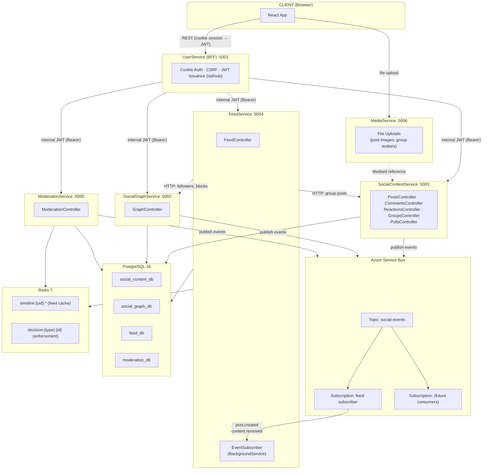
```mermaid
graph TB
    subgraph Client ["CLIENT (Browser)"]
        React["React App"]
    end

    React -- "REST (cookie session → JWT)" --> BFF

    subgraph BFF ["UserService (BFF) :5001"]
        Auth["Cookie Auth · CSRF · JWT Issuance (oid/sub)"]
    end

    BFF -- "internal JWT (Bearer)" --> SCS
    BFF -- "internal JWT (Bearer)" --> SGS
    BFF -- "internal JWT (Bearer)" --> FS
    BFF -- "internal JWT (Bearer)" --> MS

    subgraph SCS ["SocialContentService :5003"]
        SCS_C["PostsController · CommentsController<br/>ReactionsController · GroupsController<br/>PollsController"]
    end

    subgraph SGS ["SocialGraphService :5002"]
        SGS_C["GraphController"]
    end

    subgraph FS ["FeedService :5004"]
        FS_C["FeedController"]
        FS_ES["EventSubscriber<br/>(BackgroundService)"]
    end

    subgraph MS ["ModerationService :5005"]
        MS_C["ModerationController"]
    end

    SCS -- "publish events" --> ASB
    SGS -- "publish events" --> ASB
    MS -- "publish events" --> ASB

    subgraph ASB ["Azure Service Bus"]
        Topic["Topic: social-events"]
        Sub1["Subscription: feed-subscriber"]
        Sub2["Subscription: (future consumers)"]
        Topic --> Sub1
        Topic --> Sub2
    end

    Sub1 -- "post.created<br/>content.removed" --> FS_ES

    FS -- "HTTP: followers, blocks" --> SGS
    FS -- "HTTP: group posts" --> SCS

    SCS --> PG
    SGS --> PG
    FS --> PG
    MS --> PG
    FS --> Redis
    MS --> Redis

    subgraph PG ["PostgreSQL 16"]
        DB1["social_content_db"]
        DB2["social_graph_db"]
        DB3["feed_db"]
        DB4["moderation_db"]
    end

    subgraph Redis ["Redis 7"]
        RC1["timeline:{uid}:* (feed cache)"]
        RC2["decision:{type}:{id} (enforcement)"]
    end

    subgraph Media ["MediaService :5006"]
        Upload["File Uploads<br/>(post images, group avatars)"]
    end

    React -- "file upload" --> Media
    Media -. "MediaId reference" .-> SCS
```

---

## Authentication & Authorization

Phase 2 services use **JWT Bearer** authentication with an
**Authority/Audience** model (OIDC-compliant). This differs from
Phase 1's symmetric key approach.

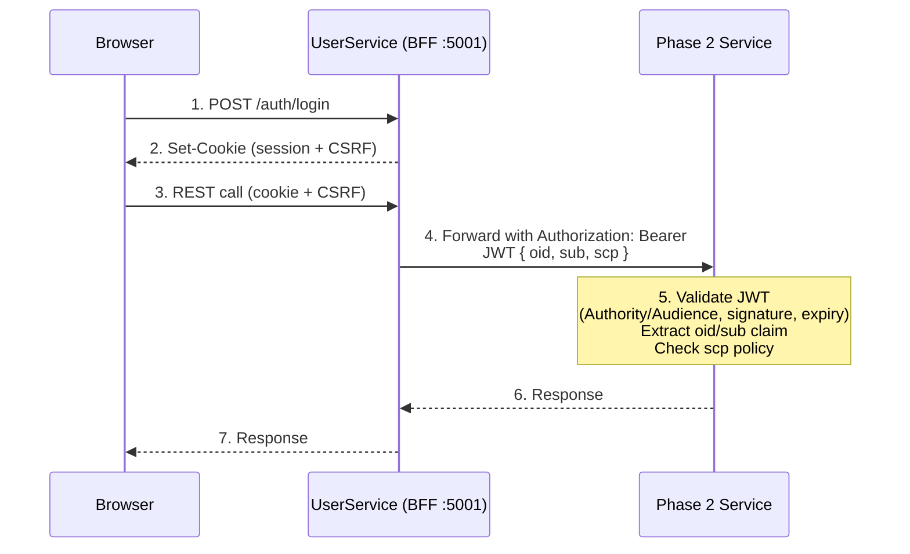
```mermaid
sequenceDiagram
    participant Browser
    participant BFF as UserService (BFF :5001)
    participant Svc as Phase 2 Service

    Browser->>BFF: 1. POST /auth/login
    BFF-->>Browser: 2. Set-Cookie (session + CSRF)

    Browser->>BFF: 3. REST call (cookie + CSRF)
    BFF->>Svc: 4. Forward with Authorization: Bearer<br/>JWT { oid, sub, scp }

    Note over Svc: 5. Validate JWT<br/>(Authority/Audience, signature, expiry)<br/>Extract oid/sub claim<br/>Check scp policy

    Svc-->>BFF: 6. Response
    BFF-->>Browser: 7. Response
```

**JWT claims used across Phase 2:**

| Claim | Description |
|---|---|
| `oid` | Object ID (GUID) — primary user identity |
| `sub` | Subject — alternative identity claim |
| `scp` | Scope — `social.read` and/or `social.write` |
| `iss` | Issuer — validated against configured Authority |
| `exp` | Token expiration |

**Authorization policies (SocialContentService):**

| Policy | Required Scope | Used For |
|---|---|---|
| `social.read` | `scp` contains `social.read` | All GET endpoints |
| `social.write` | `scp` contains `social.write` | All mutation endpoints (POST, PUT, DELETE) |

**SocialGraphService note:** Uses a `me` query parameter for user
identity. This service does not enforce JWT middleware in the current
implementation (designed for internal-only traffic).

---

## Event Bus Architecture — Azure Service Bus

Phase 2 uses **Azure Service Bus** for asynchronous event
communication rather than the HTTP-based publish pattern from Phase 1.

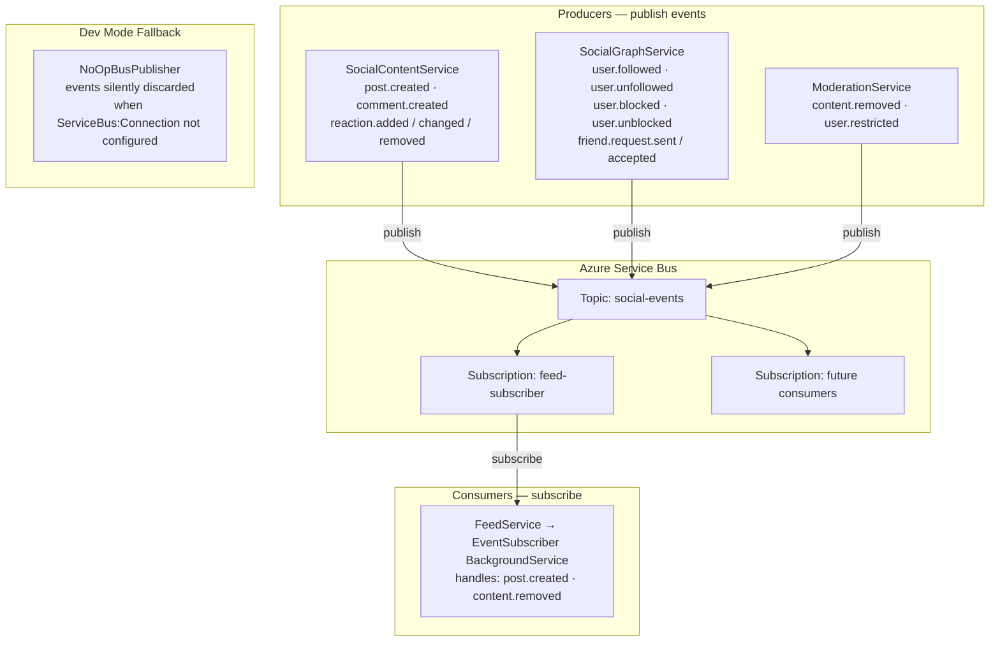
```mermaid
graph TB
    subgraph Producers["Producers — publish events"]
        SCS["SocialContentService<br/>post.created · comment.created<br/>reaction.added / changed / removed"]
        SGS["SocialGraphService<br/>user.followed · user.unfollowed<br/>user.blocked · user.unblocked<br/>friend.request.sent / accepted"]
        MS["ModerationService<br/>content.removed · user.restricted"]
    end

    subgraph ASB["Azure Service Bus"]
        Topic["Topic: social-events"]
        FeedSub["Subscription: feed-subscriber"]
        FutureSub["Subscription: future consumers"]
        Topic --> FeedSub
        Topic --> FutureSub
    end

    subgraph Consumers["Consumers — subscribe"]
        FS["FeedService → EventSubscriber BackgroundService<br/>handles: post.created · content.removed"]
    end

    subgraph DevFallback["Dev Mode Fallback"]
        NoOp["NoOpBusPublisher<br/>events silently discarded<br/>when ServiceBus:Connection not configured"]
    end

    SCS -->|publish| Topic
    SGS -->|publish| Topic
    MS -->|publish| Topic
    FeedSub -->|subscribe| FS
```

### Event Publishing Pattern

All Phase 2 producers implement the `IBusPublisher` interface:

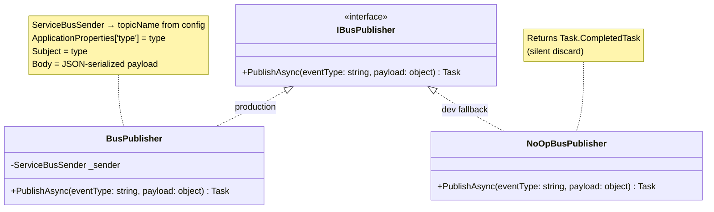
```mermaid
classDiagram
    class IBusPublisher {
        <<interface>>
        +PublishAsync(eventType: string, payload: object) Task
    }
    class BusPublisher {
        -ServiceBusSender _sender
        +PublishAsync(eventType: string, payload: object) Task
    }
    class NoOpBusPublisher {
        +PublishAsync(eventType: string, payload: object) Task
    }
    IBusPublisher <|.. BusPublisher : production
    IBusPublisher <|.. NoOpBusPublisher : dev fallback

    note for BusPublisher "ServiceBusSender → topicName from config<br/>ApplicationProperties['type'] = type<br/>Subject = type<br/>Body = JSON-serialized payload"
    note for NoOpBusPublisher "Returns Task.CompletedTask<br/>(silent discard)"
```

### Event Subscription Pattern (FeedService)

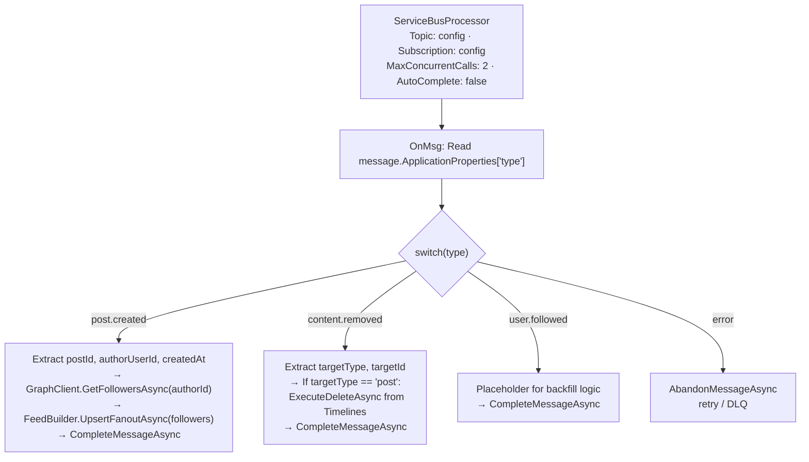
```mermaid
flowchart TD
    SBP["ServiceBusProcessor<br/>Topic: config · Subscription: config<br/>MaxConcurrentCalls: 2 · AutoComplete: false"]
    SBP --> OnMsg["OnMsg: Read message.ApplicationProperties['type']"]
    OnMsg --> Switch{"switch(type)"}

    Switch -->|post.created| PC["Extract postId, authorUserId, createdAt<br/>→ GraphClient.GetFollowersAsync(authorId)<br/>→ FeedBuilder.UpsertFanoutAsync(followers)<br/>→ CompleteMessageAsync"]
    Switch -->|content.removed| CR["Extract targetType, targetId<br/>→ If targetType == 'post':<br/>  ExecuteDeleteAsync from Timelines<br/>→ CompleteMessageAsync"]
    Switch -->|user.followed| UF["Placeholder for backfill logic<br/>→ CompleteMessageAsync"]
    Switch -->|error| ERR["AbandonMessageAsync<br/>retry / DLQ"]
```

---

## Service-by-Service Dataflow

### 1. SocialContentService — Content Management Dataflow

#### 1a. Create Post

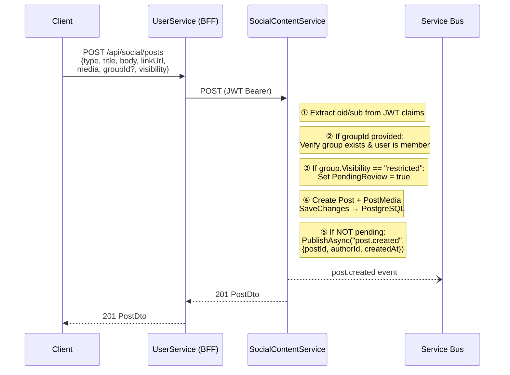
```mermaid
sequenceDiagram
    participant C as Client
    participant BFF as UserService (BFF)
    participant SCS as SocialContentService
    participant SB as Service Bus

    C->>BFF: POST /api/social/posts<br/>{type, title, body, linkUrl,<br/>media, groupId?, visibility}
    BFF->>SCS: POST (JWT Bearer)

    Note right of SCS: ① Extract oid/sub from JWT claims
    Note right of SCS: ② If groupId provided:<br/>Verify group exists & user is member
    Note right of SCS: ③ If group.Visibility == "restricted":<br/>Set PendingReview = true
    Note right of SCS: ④ Create Post + PostMedia<br/>SaveChanges → PostgreSQL
    Note right of SCS: ⑤ If NOT pending:<br/>PublishAsync("post.created",<br/>{postId, authorId, createdAt})

    SCS--)SB: post.created event
    SCS-->>BFF: 201 PostDto
    BFF-->>C: 201 PostDto
```

#### 1b. Vote on Post (Upvote / Downvote)

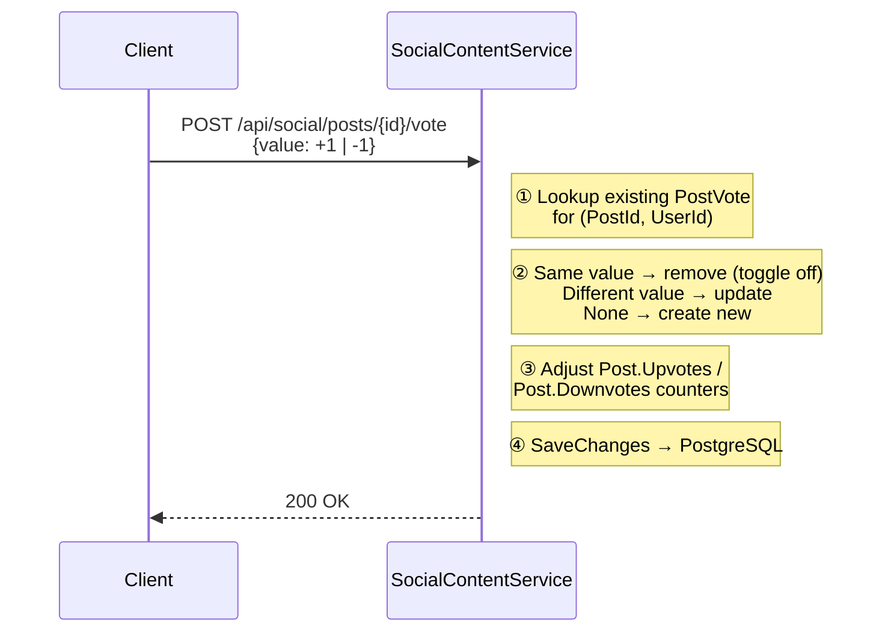
```mermaid
sequenceDiagram
    participant C as Client
    participant SCS as SocialContentService

    C->>SCS: POST /api/social/posts/{id}/vote<br/>{value: +1 | -1}

    Note right of SCS: ① Lookup existing PostVote<br/>for (PostId, UserId)
    Note right of SCS: ② Same value → remove (toggle off)<br/>Different value → update<br/>None → create new
    Note right of SCS: ③ Adjust Post.Upvotes /<br/>Post.Downvotes counters
    Note right of SCS: ④ SaveChanges → PostgreSQL

    SCS-->>C: 200 OK
```

#### 1c. Comment with Threaded Replies

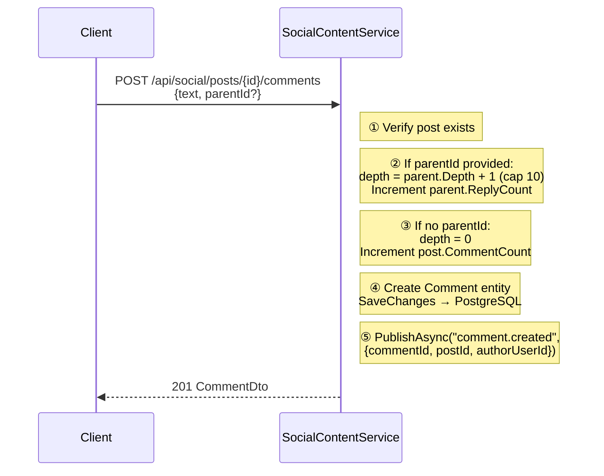
```mermaid
sequenceDiagram
    participant C as Client
    participant SCS as SocialContentService

    C->>SCS: POST /api/social/posts/{id}/comments<br/>{text, parentId?}

    Note right of SCS: ① Verify post exists
    Note right of SCS: ② If parentId provided:<br/>depth = parent.Depth + 1 (cap 10)<br/>Increment parent.ReplyCount
    Note right of SCS: ③ If no parentId:<br/>depth = 0<br/>Increment post.CommentCount
    Note right of SCS: ④ Create Comment entity<br/>SaveChanges → PostgreSQL
    Note right of SCS: ⑤ PublishAsync("comment.created",<br/>{commentId, postId, authorUserId})

    SCS-->>C: 201 CommentDto
```

#### 1d. Reaction Flow

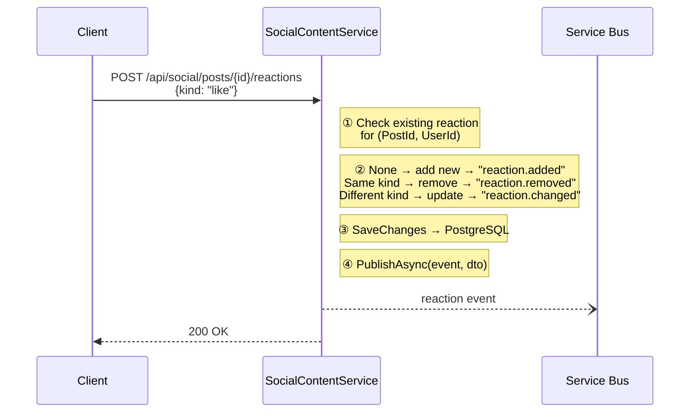
```mermaid
sequenceDiagram
    participant C as Client
    participant SCS as SocialContentService
    participant SB as Service Bus

    C->>SCS: POST /api/social/posts/{id}/reactions<br/>{kind: "like"}

    Note right of SCS: ① Check existing reaction<br/>for (PostId, UserId)
    Note right of SCS: ② None → add new → "reaction.added"<br/>Same kind → remove → "reaction.removed"<br/>Different kind → update → "reaction.changed"
    Note right of SCS: ③ SaveChanges → PostgreSQL
    Note right of SCS: ④ PublishAsync(event, dto)

    SCS--)SB: reaction event
    SCS-->>C: 200 OK
```

#### 1e. Group Lifecycle & Moderation Queue


```mermaid
flowchart TD
    subgraph CreateGroup["Create Group"]
        CG1["POST /api/social/groups"]
        CG2["Create Group entity<br/>Visibility: public | private | restricted"]
        CG3["Add creator as GroupMember role: owner"]
        CG4[("PostgreSQL")]
        CG1 --> CG2 --> CG3 --> CG4
    end

    subgraph JoinLeave["Join / Leave"]
        JG["POST /groups/{slug}/join<br/>→ Check GroupBan → Add member<br/>→ Increment MemberCount"]
        LG["DELETE /groups/{slug}/leave<br/>→ Remove member<br/>→ Decrement MemberCount"]
    end

    subgraph RestrictedPosting["Restricted Group Posting"]
        RP1["Posts to restricted groups<br/>→ PendingReview = true"]
        RP2["GET /groups/{slug}/moderation-queue"]
        RP3["POST .../moderation-queue/{postId}/approve"]
        RP4["POST .../moderation-queue/{postId}/remove"]
        RP1 --> RP2
        RP2 --> RP3
        RP2 --> RP4
    end

    subgraph RoleMgmt["Role Management (owner-only)"]
        RM["PATCH /groups/{slug}/members/{userId}/role<br/>→ Verify caller is owner<br/>→ Update role to moderator | member"]
    end

    subgraph BanMgmt["Ban / Unban"]
        BAN["POST /groups/{slug}/bans<br/>DELETE /groups/{slug}/bans/{userId}<br/>→ Verify caller is owner or moderator<br/>→ Create/remove GroupBan<br/>→ Remove membership on ban"]
    end
```

#### 1f. Content Events Published

| Operation | Event Name | Payload |
|---|---|---|
| Create post | `post.created` | `{ postId, authorUserId, createdAt }` |
| Create comment | `comment.created` | `{ commentId, postId, authorUserId }` |
| Add reaction | `reaction.added` | `{ postId, userId, kind }` |
| Change reaction | `reaction.changed` | `{ postId, userId, kind, previousKind }` |
| Remove reaction | `reaction.removed` | `{ postId, userId, kind }` |

---

### 2. SocialGraphService — Social Graph Dataflow

#### 2a. Follow / Unfollow

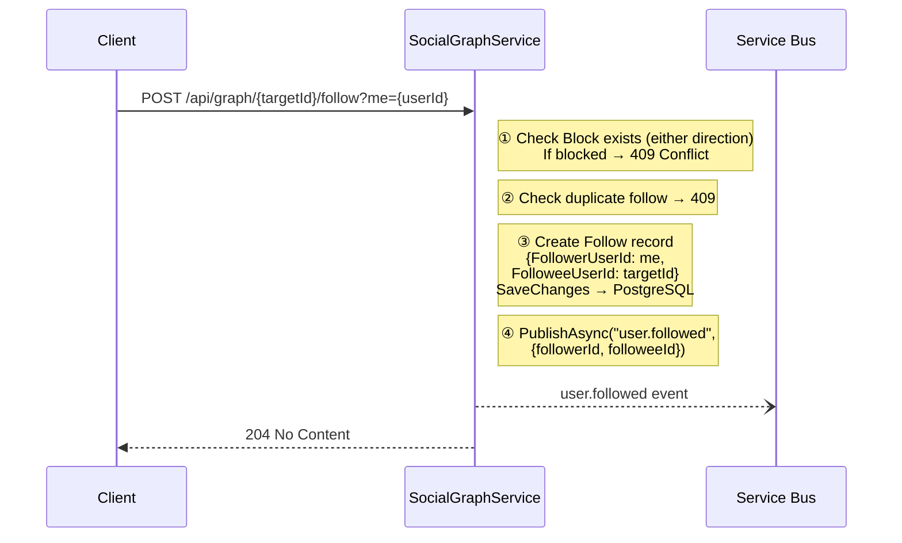
```mermaid
sequenceDiagram
    participant C as Client
    participant SGS as SocialGraphService
    participant SB as Service Bus

    C->>SGS: POST /api/graph/{targetId}/follow?me={userId}

    Note right of SGS: ① Check Block exists (either direction)<br/>If blocked → 409 Conflict
    Note right of SGS: ② Check duplicate follow → 409
    Note right of SGS: ③ Create Follow record<br/>{FollowerUserId: me,<br/>FolloweeUserId: targetId}<br/>SaveChanges → PostgreSQL
    Note right of SGS: ④ PublishAsync("user.followed",<br/>{followerId, followeeId})

    SGS--)SB: user.followed event
    SGS-->>C: 204 No Content
```

#### 2b. Block / Unblock (with auto-cleanup)

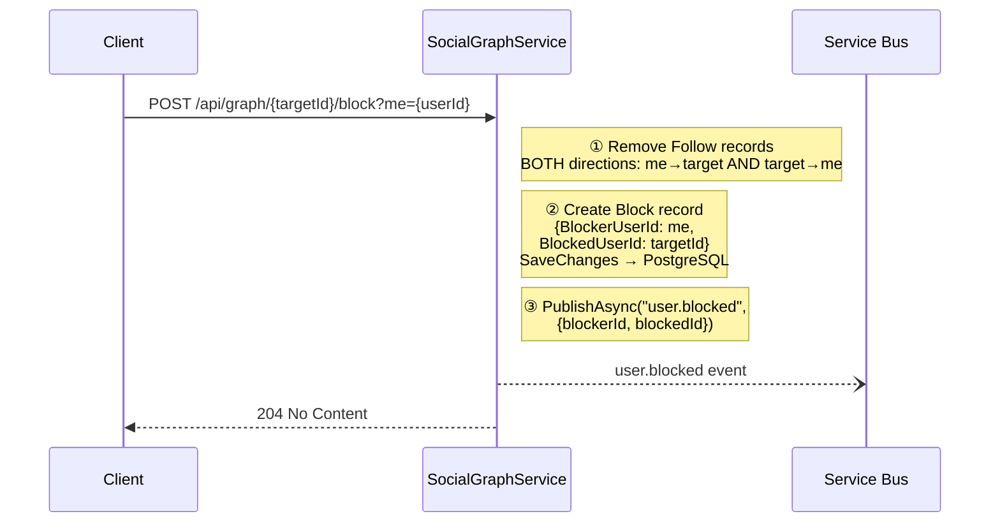
```mermaid
sequenceDiagram
    participant C as Client
    participant SGS as SocialGraphService
    participant SB as Service Bus

    C->>SGS: POST /api/graph/{targetId}/block?me={userId}

    Note right of SGS: ① Remove Follow records<br/>BOTH directions: me→target AND target→me
    Note right of SGS: ② Create Block record<br/>{BlockerUserId: me,<br/>BlockedUserId: targetId}<br/>SaveChanges → PostgreSQL
    Note right of SGS: ③ PublishAsync("user.blocked",<br/>{blockerId, blockedId})

    SGS--)SB: user.blocked event
    SGS-->>C: 204 No Content
```

#### 2c. Friend Request Lifecycle

```mermaid
stateDiagram-v2
    [*] --> Pending : POST /api/graph/friends/request<br/>?me=A&to=B

    Pending --> Accepted : POST .../accept?me=B&requestId=X
    Pending --> Declined : POST .../decline?me=B&requestId=X

    state Accepted {
        direction LR
        note right of Accepted
            Creates mutual Follow records: A→B and B→A
            Publishes: friend.request.accepted
        end note
    }

    state Declined {
        direction LR
        note right of Declined
            Status = declined
            No follow created
        end note
    }
```

#### 2d. Internal Bulk Endpoint

FeedService (and other internal consumers) can call:

```
POST /api/internal/graph/is-following
Body: { "sourceUserId": "...", "targetUserIds": ["..."] }
Response: { "results": [ { "userId": "...", "isFollowing": true } ] }
```

This avoids N+1 HTTP calls when checking follow status for feed
rendering.

#### 2e. Graph Events Published

| Operation | Event Name | Payload |
|---|---|---|
| Follow | `user.followed` | `{ followerId, followeeId }` |
| Unfollow | `user.unfollowed` | `{ followerId, followeeId }` |
| Block | `user.blocked` | `{ blockerId, blockedId }` |
| Unblock | `user.unblocked` | `{ blockerId, blockedId }` |
| Send friend request | `friend.request.sent` | `{ senderId, receiverId, requestId }` |
| Accept friend request | `friend.request.accepted` | `{ senderId, receiverId, requestId }` |

---

### 3. FeedService — Feed Aggregation Dataflow

#### 3a. Fan-Out on Write (Core Feed Strategy)

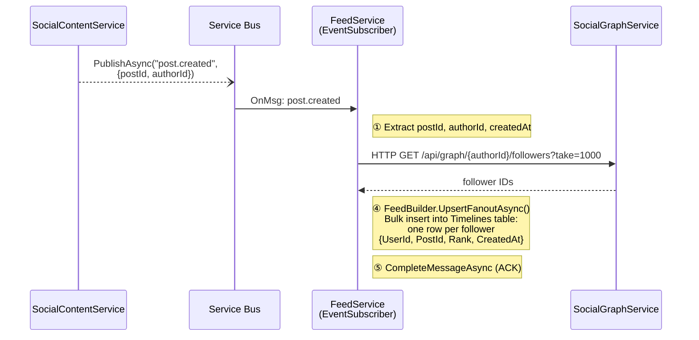
```mermaid
sequenceDiagram
    participant SCS as SocialContentService
    participant SB as Service Bus
    participant FS as FeedService<br/>(EventSubscriber)
    participant SGS as SocialGraphService

    SCS--)SB: PublishAsync("post.created",<br/>{postId, authorId})
    SB->>FS: OnMsg: post.created

    Note right of FS: ① Extract postId, authorId, createdAt

    FS->>SGS: HTTP GET /api/graph/{authorId}/followers?take=1000
    SGS-->>FS: follower IDs

    Note right of FS: ④ FeedBuilder.UpsertFanoutAsync()<br/>Bulk insert into Timelines table:<br/>one row per follower<br/>{UserId, PostId, Rank, CreatedAt}
    Note right of FS: ⑤ CompleteMessageAsync (ACK)
```

#### 3b. Content Removal from Timelines

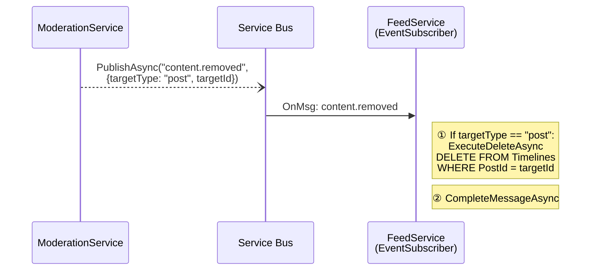
```mermaid
sequenceDiagram
    participant MS as ModerationService
    participant SB as Service Bus
    participant FS as FeedService<br/>(EventSubscriber)

    MS--)SB: PublishAsync("content.removed",<br/>{targetType: "post", targetId})
    SB->>FS: OnMsg: content.removed

    Note right of FS: ① If targetType == "post":<br/>ExecuteDeleteAsync<br/>DELETE FROM Timelines<br/>WHERE PostId = targetId
    Note right of FS: ② CompleteMessageAsync
```

#### 3c. Home Feed Read Path

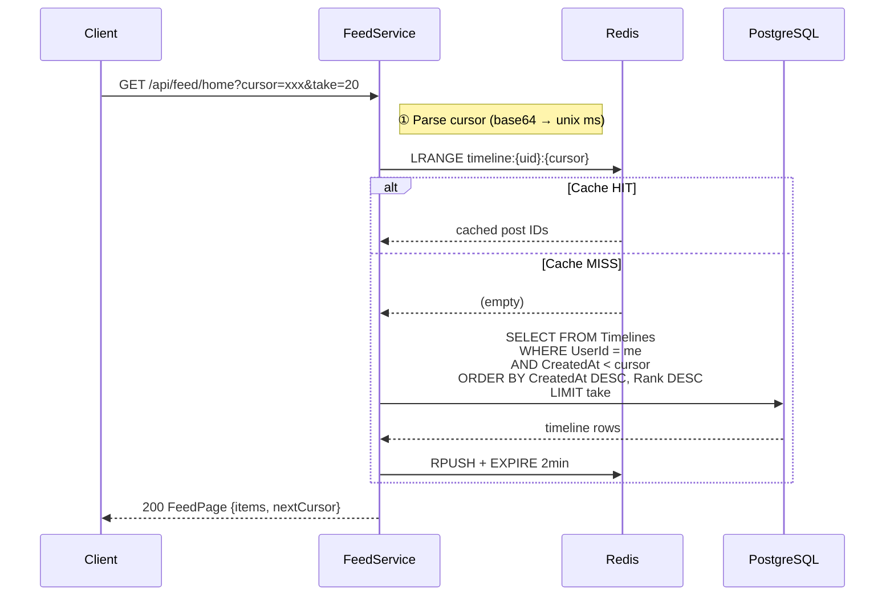
```mermaid
sequenceDiagram
    participant C as Client
    participant FS as FeedService
    participant R as Redis
    participant PG as PostgreSQL

    C->>FS: GET /api/feed/home?cursor=xxx&take=20

    Note right of FS: ① Parse cursor (base64 → unix ms)

    FS->>R: LRANGE timeline:{uid}:{cursor}
    alt Cache HIT
        R-->>FS: cached post IDs
    else Cache MISS
        R-->>FS: (empty)
        FS->>PG: SELECT FROM Timelines<br/>WHERE UserId = me<br/>AND CreatedAt < cursor<br/>ORDER BY CreatedAt DESC, Rank DESC<br/>LIMIT take
        PG-->>FS: timeline rows
        FS->>R: RPUSH + EXPIRE 2min
    end

    FS-->>C: 200 FeedPage {items, nextCursor}
```

#### 3d. Explore / Trending Feed

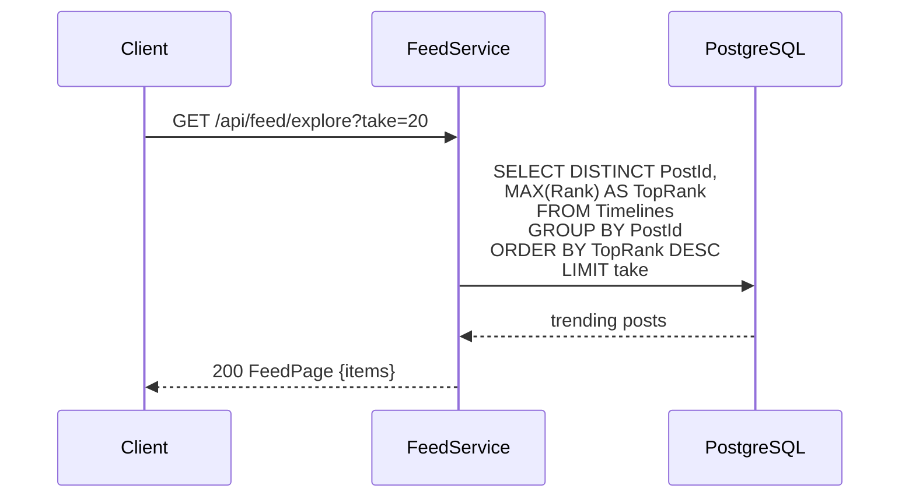
```mermaid
sequenceDiagram
    participant C as Client
    participant FS as FeedService
    participant PG as PostgreSQL

    C->>FS: GET /api/feed/explore?take=20

    FS->>PG: SELECT DISTINCT PostId,<br/>MAX(Rank) AS TopRank<br/>FROM Timelines<br/>GROUP BY PostId<br/>ORDER BY TopRank DESC<br/>LIMIT take
    PG-->>FS: trending posts

    FS-->>C: 200 FeedPage {items}
```

#### 3e. Group Feed (Proxy to SocialContentService)

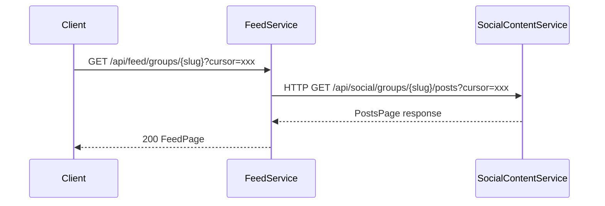
```mermaid
sequenceDiagram
    participant C as Client
    participant FS as FeedService
    participant SCS as SocialContentService

    C->>FS: GET /api/feed/groups/{slug}?cursor=xxx
    FS->>SCS: HTTP GET /api/social/groups/{slug}/posts?cursor=xxx
    SCS-->>FS: PostsPage response
    FS-->>C: 200 FeedPage
```

---

### 4. ModerationService — Enforcement & Audit Dataflow

#### 4a. User Report Flow

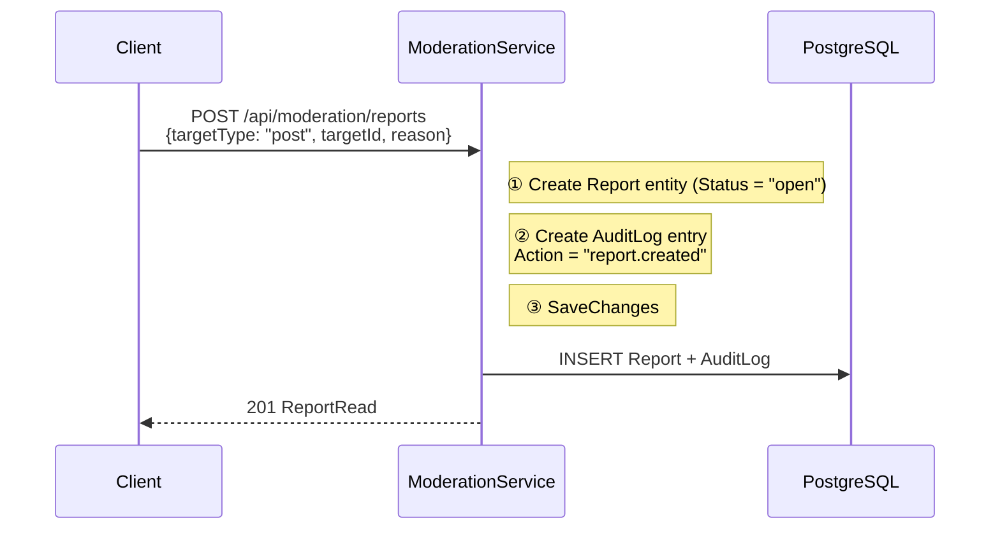
```mermaid
sequenceDiagram
    participant C as Client
    participant MS as ModerationService
    participant PG as PostgreSQL

    C->>MS: POST /api/moderation/reports<br/>{targetType: "post", targetId, reason}

    Note right of MS: ① Create Report entity (Status = "open")
    Note right of MS: ② Create AuditLog entry<br/>Action = "report.created"
    Note right of MS: ③ SaveChanges

    MS->>PG: INSERT Report + AuditLog
    MS-->>C: 201 ReportRead
```

#### 4b. Moderation Decision & Enforcement Pipeline

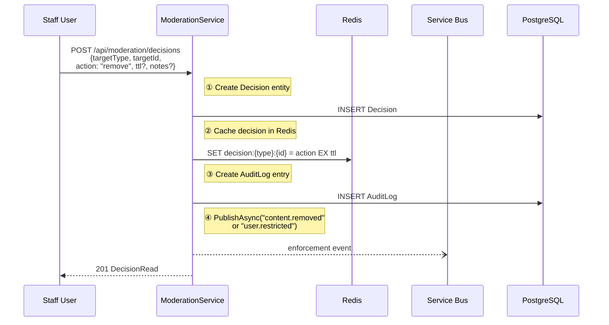
```mermaid
sequenceDiagram
    participant Staff as Staff User
    participant MS as ModerationService
    participant R as Redis
    participant SB as Service Bus
    participant PG as PostgreSQL

    Staff->>MS: POST /api/moderation/decisions<br/>{targetType, targetId,<br/>action: "remove", ttl?, notes?}

    Note right of MS: ① Create Decision entity
    MS->>PG: INSERT Decision

    Note right of MS: ② Cache decision in Redis
    MS->>R: SET decision:{type}:{id} = action EX ttl

    Note right of MS: ③ Create AuditLog entry
    MS->>PG: INSERT AuditLog

    Note right of MS: ④ PublishAsync("content.removed"<br/>or "user.restricted")
    MS--)SB: enforcement event

    MS-->>Staff: 201 DecisionRead
```

#### 4c. Enforcement Lookup (Fast Path)

```mermaid
flowchart TD
    REQ["GET /api/moderation/enforcement/{targetType}/{targetId}"]
    REQ --> Redis{"Check Redis:<br/>GET decision:{targetType}:{targetId}"}

    Redis -->|HIT| ReturnCached["Return cached action immediately"]
    Redis -->|MISS| QueryPG["Query PostgreSQL Decisions table"]

    QueryPG -->|Found| ReCache["Re-cache in Redis + return"]
    QueryPG -->|Not found| NotFound["404 Not Found"]

    ReturnCached --> Resp["Response:<br/>{targetType, targetId, action, createdAt}"]
    ReCache --> Resp
```

#### 4d. AI Auto-Flag Hook

```mermaid
sequenceDiagram
    participant AI as External AI Service
    participant MS as ModerationService
    participant PG as PostgreSQL

    AI->>MS: POST /api/internal/moderation/auto-flag<br/>{targetType, targetId,<br/>scores: {toxicity: 0.85, spam: 0.12, violence: 0.03}}

    Note right of MS: ① Compute maxScore = MAX(all scores)

    alt maxScore ≥ 5
        Note right of MS: ② Auto-remove → Decision<br/>+ AuditLog + publish "content.removed"
        MS->>PG: INSERT Decision + AuditLog
        MS-->>AI: 200 {action: "auto_removed"}
    else maxScore ≥ 3
        Note right of MS: ③ Create Report (system-flagged)<br/>for human review
        MS->>PG: INSERT Report
        MS-->>AI: 200 {action: "flagged"}
    else maxScore < 3
        Note right of MS: ④ No action
        MS-->>AI: 200 {action: "none"}
    end
```

#### 4e. Moderation Queue

```mermaid
sequenceDiagram
    participant Staff as Staff User
    participant MS as ModerationService
    participant PG as PostgreSQL

    Staff->>MS: GET /api/moderation/queue?skip=0&take=20
    MS->>PG: SELECT * FROM Reports<br/>WHERE Status = 'open'<br/>ORDER BY CreatedAt<br/>OFFSET skip LIMIT take
    PG-->>MS: report rows
    MS-->>Staff: 200 [QueueItem]

    Staff->>MS: POST /api/moderation/reports/{id}/action<br/>{action: "remove", reason}

    Note right of MS: ① Update Report.Status = "actioned"
    Note right of MS: ② Create ModerationAction record
    Note right of MS: ③ AuditLog entry
    Note right of MS: ④ SaveChanges

    MS->>PG: UPDATE + INSERT
    MS-->>Staff: 200 OK
```

---

## Data Storage Layout

### PostgreSQL — Per-Service Database Isolation

```mermaid
graph LR
    PG[("PostgreSQL 16<br/>container: pg, port 5432")]

    subgraph social_content_db
        Posts["Posts"]
        PostMedia["PostMedia"]
        PostVotes["PostVotes"]
        PostSaves["PostSaves"]
        Comments["Comments"]
        CommentVotes["CommentVotes"]
        Reactions["Reactions"]
        Polls["Polls"]
        PollOptions["PollOptions"]
        PollVotes["PollVotes"]
        Groups["Groups"]
        GroupMembers["GroupMembers"]
        GroupRules["GroupRules"]
        GroupBans["GroupBans"]
    end

    subgraph social_graph_db
        Follows["Follows"]
        Blocks["Blocks"]
        FriendRequests["FriendRequests"]
    end

    subgraph feed_db
        Timelines["Timelines"]
        Markers["Markers"]
    end

    subgraph moderation_db
        Reports["Reports"]
        ModerationActions["ModerationActions"]
        Decisions["Decisions"]
        AuditLogs["AuditLogs"]
    end

    PG --- social_content_db
    PG --- social_graph_db
    PG --- feed_db
    PG --- moderation_db
```

**Note:** SocialContentService uses **snake_case** naming convention
(`UseSnakeCaseNamingConvention()`) for all table and column names.
Other Phase 2 services use default EF Core naming.

### Redis — Cache & Enforcement State

```mermaid
graph LR
    REDIS[("Redis 7<br/>container: redis, port 6379")]

    subgraph FeedCache["Feed Cache (FeedService)"]
        TL["timeline:{userId}:{cursorKey}<br/>LIST [postId, ...]<br/>TTL 2min"]
    end

    subgraph DecisionCache["Decision Cache (ModerationService)"]
        DC["decision:{targetType}:{targetId}<br/>STRING remove|restrict|ban<br/>TTL optional"]
    end

    subgraph SignalRBP["SignalR Backplane (RealTimeHub)"]
        SR["sc-rt:*<br/>PUB/SUB channels"]
    end

    REDIS --- FeedCache
    REDIS --- DecisionCache
    REDIS --- SignalRBP
```

---

## Cross-Service Communication Map

```mermaid
graph TB
    subgraph ASB["Azure Service Bus (Topic/Sub model)"]
        Topic["social-events topic"]
    end

    SCS["SocialContentService :5003"] -->|publish| Topic
    SGS["SocialGraphService :5002"] -->|publish| Topic
    MS["ModerationService :5005"] -->|publish| Topic
    Topic -->|subscribe:<br/>post.created<br/>content.removed| FS

    FS["FeedService :5004"] -->|"HTTP: group feed proxy"| SCS
    FS -->|"HTTP: followers, blocks"| SGS

    SCS --> PG[("PostgreSQL<br/>social_content_db · social_graph_db<br/>feed_db · moderation_db")]
    SGS --> PG
    FS --> PG
    MS --> PG

    FS --> RD[("Redis<br/>timeline:* · decision:*")]
    MS --> RD
```

### Cross-Service HTTP Dependencies

| Caller | Callee | Endpoint | Purpose |
|---|---|---|---|
| FeedService | SocialGraphService | `GET /api/graph/{userId}/followers` | Get follower IDs for fan-out |
| FeedService | SocialGraphService | `GET /api/graph/{userId}/blocks?direction=both` | Filter blocked users from feed |
| FeedService | SocialContentService | `GET /api/social/groups/{slug}/posts` | Proxy group feed content |

**Key design decisions:**

| Decision | Rationale |
|---|---|
| Azure Service Bus for async events (not HTTP POST) | Decouples producers from consumers; supports retry, dead-letter, and multiple subscriptions |
| NoOp publisher in dev mode | Enables local development without Service Bus dependency |
| Fan-out on write (not fan-out on read) | Optimizes read-heavy feed access by pre-materializing timelines in PostgreSQL |
| Redis cache for timeline pages | Reduces database load for repeated home feed reads (2-minute TTL balances freshness vs performance) |
| Redis decision cache for moderation | Sub-millisecond enforcement lookups for gateway content filtering |
| Separate databases per service | Bounded context isolation; each service migrates independently |
| SocialGraphService uses `me` query parameter | Designed for internal traffic; no JWT middleware overhead for service-to-service calls |
| Cursor-based pagination everywhere | Efficient for large, append-heavy datasets; no offset drift issues |

---

## Complete Event Catalog — Phase 2

| Source Service | Event Name | Trigger | Consumer(s) |
|---|---|---|---|
| SocialContentService | `post.created` | New post published (non-pending) | FeedService (fan-out) |
| SocialContentService | `comment.created` | New comment or reply | (future: notification) |
| SocialContentService | `reaction.added` | Reaction added to post | (future: notification) |
| SocialContentService | `reaction.changed` | Reaction kind changed | (future: notification) |
| SocialContentService | `reaction.removed` | Reaction removed from post | (future: analytics) |
| SocialGraphService | `user.followed` | User A follows B | FeedService (backfill stub) |
| SocialGraphService | `user.unfollowed` | User A unfollows B | (future: feed cleanup) |
| SocialGraphService | `user.blocked` | User A blocks B | (future: feed filter) |
| SocialGraphService | `user.unblocked` | User A unblocks B | (future) |
| SocialGraphService | `friend.request.sent` | Friend request created | (future: notification) |
| SocialGraphService | `friend.request.accepted` | Friend request accepted | (future: notification) |
| ModerationService | `content.removed` | Content removed by staff/AI | FeedService (purge from timelines) |
| ModerationService | `user.restricted` | User restricted by staff | (future: gateway enforcement) |

---

## Pagination Strategy

All Phase 2 list endpoints use **cursor-based pagination**:

```mermaid
flowchart LR
    Req["GET /api/{resource}?cursor=xxx&take=20"] --> Decode["Decode cursor<br/>Base64 → unix_ms"]
    Decode --> Query["WHERE CreatedAt < decoded_cursor<br/>ORDER BY CreatedAt DESC<br/>LIMIT take"]
    Query --> Resp["Response:<br/>{items: [...],<br/>nextCursor: Base64(last_item_created_at)}"]

    style Req fill:#e1f5fe
    style Resp fill:#e8f5e9
```

**Exception:** ModerationService queue uses **offset-based** pagination
(`skip/take`) since the report queue is staff-only and typically small.

---

## Docker Compose — Phase 2 Container Topology

```mermaid
graph TB
    subgraph DockerNetwork["docker-compose network"]
        subgraph Infra["Infrastructure"]
            PG[("postgres :5432<br/>user_db · media_db<br/>social_content_db · social_graph_db<br/>feed_db · moderation_db")]
            RD[("redis :6379")]
        end

        subgraph Phase2["Phase 2 Services"]
            SCS["socialcontentsvr :5003<br/>depends_on: postgres"]
            SGS["socialgraphsvr :5002<br/>depends_on: postgres"]
            FS["feedservice :5004<br/>depends_on: postgres, redis,<br/>socialgraphservice<br/>EventSubscriber (hosted)"]
            MS["moderationservice :5005<br/>depends_on: postgres, redis"]
        end

        subgraph Phase0_1["Phase 0 / Phase 1"]
            US["userservice :5001<br/>(Phase 0 / BFF)"]
            Media["mediaservice :5006<br/>(Phase 0)"]
            RT["realtimehub :5007<br/>(Phase 1 infra)"]
        end

        PG --- SCS
        PG --- SGS
        PG --- FS
        PG --- MS
        RD --- FS
        RD --- MS
        RD --- RT
        SGS -->|"HTTP (followers, blocks)"| FS
    end
```

---

## Error Handling

All Phase 2 services follow the **RFC 7807 Problem Details** standard
via `builder.Services.AddProblemDetails()` and
`app.UseExceptionHandler()`.

| Scenario | HTTP Status | Handling |
|---|---|---|
| JWT missing or invalid | `401 Unauthorized` | ASP.NET Core auth middleware rejects (SocialContentService) |
| Insufficient scope (`scp`) | `403 Forbidden` | Authorization policy rejects |
| Post / comment / group not found | `404 Not Found` | Controller returns `NotFound()` |
| Duplicate follow / already member | `409 Conflict` | Controller returns `Conflict()` |
| User blocked (cannot follow) | `409 Conflict` | SocialGraphService rejects with conflict |
| User banned from group | `403 Forbidden` | Group join endpoint rejects |
| Edit/delete by non-author | `403 Forbidden` | Controller checks `AuthorUserId == caller` |
| Service Bus unavailable | Silent failure | `NoOpBusPublisher` in dev; production retries via Service Bus SDK |
| FeedService → GraphService HTTP failure | Graceful degradation | HttpClient timeout (4s); empty followers → no fan-out |
| Redis unavailable (FeedService cache) | Fallback to PostgreSQL | Cache miss path always queries the database |
| Redis unavailable (ModerationService) | `InMemoryDecisionCache` | Falls back to in-memory dictionary |

---

## Observability

All Phase 2 services are instrumented with **OpenTelemetry** exporting
to **Azure Monitor**:

```mermaid
graph LR
    subgraph Tracing
        T1["✓ ASP.NET Core instrumentation<br/>(HTTP requests)"]
        T2["✓ HttpClient instrumentation<br/>(outgoing calls)"]
        T3["✓ EF Core instrumentation<br/>(SocialContentService only)"]
    end

    subgraph Metrics
        M1["✓ ASP.NET Core instrumentation<br/>(request rate, duration)"]
        M2["✓ HttpClient instrumentation<br/>(outgoing call metrics)"]
    end

    Tracing --> Export["→ Azure Monitor<br/>UseAzureMonitor()"]
    Metrics --> Export
```

---

## End of Document
