# Phase 3 — Streaming Backend: Dataflow & Architecture

## Overview

Phase 3 delivers the **co-watching / theater streaming** layer of the
SocialCommerce super-app. It consists of a single domain service that
manages the full lifecycle of live watch-party sessions — from
creation and discovery, through synchronized playback and live chat,
to post-session archival.

| Service | Port | Style | Storage | Purpose |
|---|---|---|---|---|
| **StreamingService** | 5011 | REST (Controllers) | PostgreSQL (`streaming_db`) | Theater lifecycle, viewer tracking, synchronized playback, theater chat, emotes, discovery |

### Dependency on Phase 0 / Phase 1 Services

| Dependency | Role in Phase 3 |
|---|---|
| **UserService** (5001) | BFF gateway — authenticates browser sessions, issues internal JWTs that StreamingService validates |
| **MediaService** (5006) | Processes file uploads; `SourceMediaId` on a theater references a media asset uploaded via MediaService |
| **RealTimeHub** (5007) | Centralized WebSocket gateway — StreamingService publishes all real-time events (playback sync, chat, viewer join/leave) to the hub via internal HTTP API |

---

## High-Level Architecture

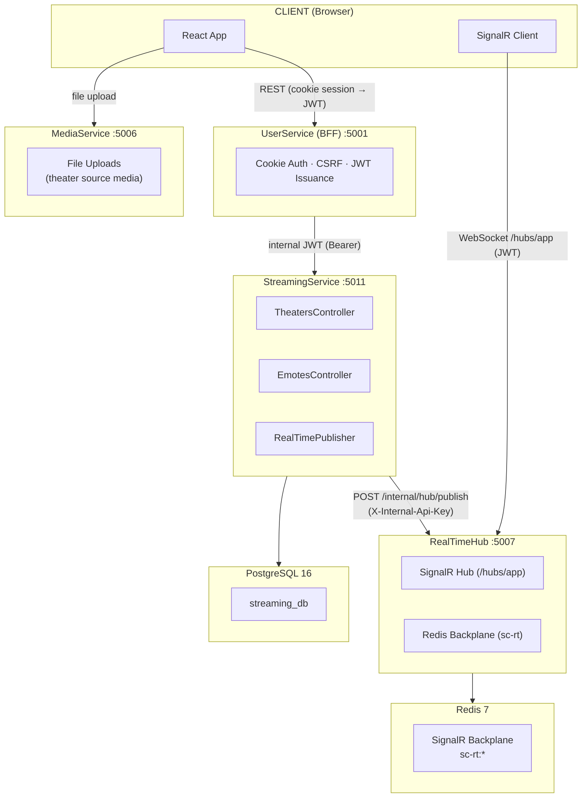
```mermaid
graph TB
    subgraph Client ["CLIENT (Browser)"]
        React["React App"]
        SRClient["SignalR Client"]
    end

    React -- "REST (cookie session → JWT)" --> BFF
    SRClient -- "WebSocket /hubs/app (JWT)" --> RTHub

    subgraph BFF ["UserService (BFF) :5001"]
        Auth["Cookie Auth · CSRF · JWT Issuance"]
    end

    BFF -- "internal JWT (Bearer)" --> Streaming

    subgraph Streaming ["StreamingService :5011"]
        TC["TheatersController"]
        EC["EmotesController"]
        RTP["RealTimePublisher"]
    end

    Streaming -- "POST /internal/hub/publish\n(X-Internal-Api-Key)" --> RTHub

    subgraph RTHub ["RealTimeHub :5007"]
        Hub["SignalR Hub (/hubs/app)"]
        BP["Redis Backplane (sc-rt)"]
    end

    RTHub --> Redis
    Streaming --> PG

    subgraph PG ["PostgreSQL 16"]
        DB["streaming_db"]
    end

    subgraph Redis ["Redis 7"]
        Backplane["SignalR Backplane\nsc-rt:*"]
    end

    subgraph Media ["MediaService :5006"]
        Upload["File Uploads\n(theater source media)"]
    end

    React -- "file upload" --> Media
```

---

## Authentication Flow

StreamingService uses the **same symmetric-key JWT** scheme as Phase 1
services. The **UserService (BFF)** is the sole JWT issuer; the
StreamingService is a consumer only.

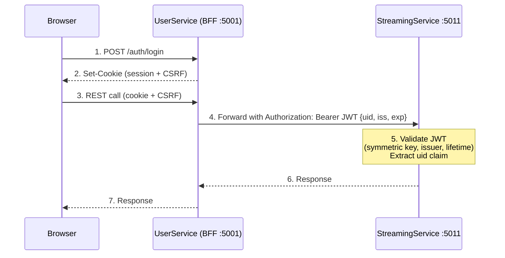
```mermaid
sequenceDiagram
    participant Browser
    participant BFF as UserService (BFF :5001)
    participant SS as StreamingService :5011

    Browser->>BFF: 1. POST /auth/login
    BFF-->>Browser: 2. Set-Cookie (session + CSRF)

    Browser->>BFF: 3. REST call (cookie + CSRF)
    BFF->>SS: 4. Forward with Authorization: Bearer JWT {uid, iss, exp}

    Note over SS: 5. Validate JWT<br/>(symmetric key, issuer, lifetime)<br/>Extract uid claim

    SS-->>BFF: 6. Response
    BFF-->>Browser: 7. Response
```

**JWT claims used:**

| Claim | Description |
|---|---|
| `uid` | User ID (GUID) — primary identity, extracted via `User.FindFirstValue("uid")` |
| `iss` | `"SocialCommerce"` — validated by `JwtAuthExtensions` |
| `exp` | Token expiration — validated with 30s clock skew |

**Auth configuration:**

```
Authentication:Jwt:SymmetricKey → shared symmetric signing key
Authentication:Jwt:Issuer       → "SocialCommerce"
ValidateAudience                → false (not checked)
```

---

## Real-Time Event Publishing

StreamingService publishes events to the **RealTimeHub** via its
internal HTTP API. This is the same pattern used by Phase 1 services
(HTTP POST, not Azure Service Bus).

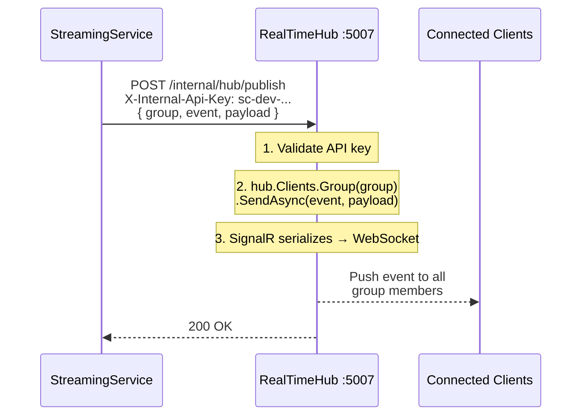
```mermaid
sequenceDiagram
    participant SS as StreamingService
    participant RTHub as RealTimeHub :5007
    participant Viewers as Connected Clients

    SS->>RTHub: POST /internal/hub/publish<br/>X-Internal-Api-Key: sc-dev-...<br/>{ group, event, payload }

    Note over RTHub: 1. Validate API key
    Note over RTHub: 2. hub.Clients.Group(group)<br/>.SendAsync(event, payload)
    Note over RTHub: 3. SignalR serializes → WebSocket

    RTHub-->>Viewers: Push event to all<br/>group members
    RTHub-->>SS: 200 OK
```

**IRealTimePublisher interface:**

```
Task PublishAsync(string group, string eventName, object payload, CancellationToken ct)
```

**Best-effort pattern:** `RealTimePublisher` catches all exceptions
from the HTTP call — a theater operation succeeds even if the
real-time push fails.

---

## Service Dataflow

### 1. Theater Lifecycle

#### 1a. Create Theater

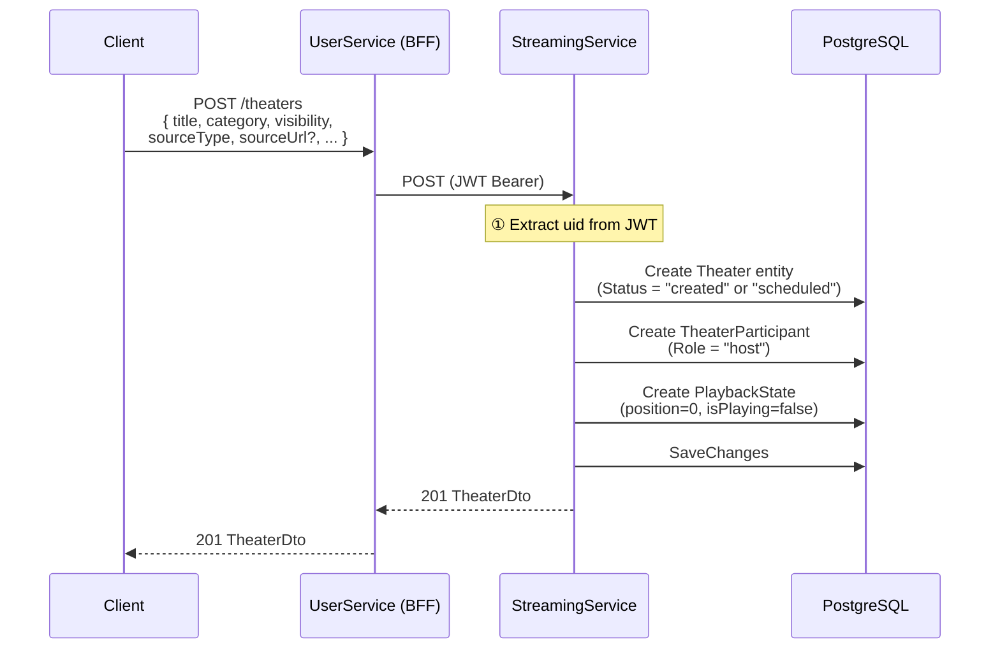
```mermaid
sequenceDiagram
    participant Client
    participant BFF as UserService (BFF)
    participant SS as StreamingService
    participant PG as PostgreSQL

    Client->>BFF: POST /theaters<br/>{ title, category, visibility,<br/>sourceType, sourceUrl?, ... }
    BFF->>SS: POST (JWT Bearer)

    Note over SS: ① Extract uid from JWT

    SS->>PG: Create Theater entity<br/>(Status = "created" or "scheduled")
    SS->>PG: Create TheaterParticipant<br/>(Role = "host")
    SS->>PG: Create PlaybackState<br/>(position=0, isPlaying=false)
    SS->>PG: SaveChanges

    SS-->>BFF: 201 TheaterDto
    BFF-->>Client: 201 TheaterDto
```

#### 1b. Theater State Machine

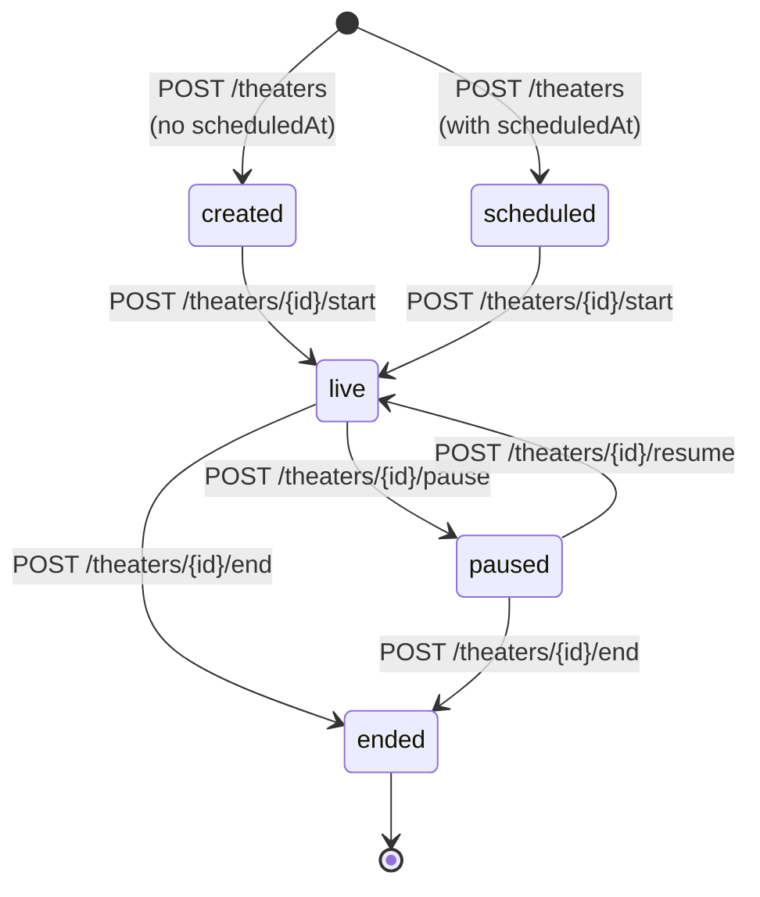
```mermaid
stateDiagram-v2
    [*] --> created : POST /theaters<br/>(no scheduledAt)
    [*] --> scheduled : POST /theaters<br/>(with scheduledAt)

    created --> live : POST /theaters/{id}/start
    scheduled --> live : POST /theaters/{id}/start

    live --> paused : POST /theaters/{id}/pause
    paused --> live : POST /theaters/{id}/resume

    live --> ended : POST /theaters/{id}/end
    paused --> ended : POST /theaters/{id}/end

    ended --> [*]
```

**Transition rules enforced by the controller:**

| Transition | Allowed From | Guard |
|---|---|---|
| `start` | `created`, `scheduled` | Host only |
| `pause` | `live` | Host only |
| `resume` | `paused` | Host only |
| `end` | `live`, `paused` | Host only |

Every state transition **persists to PostgreSQL** then **publishes**
a `theater:status` event to the `theater:{id}` SignalR group.

#### 1c. State Transition Flow

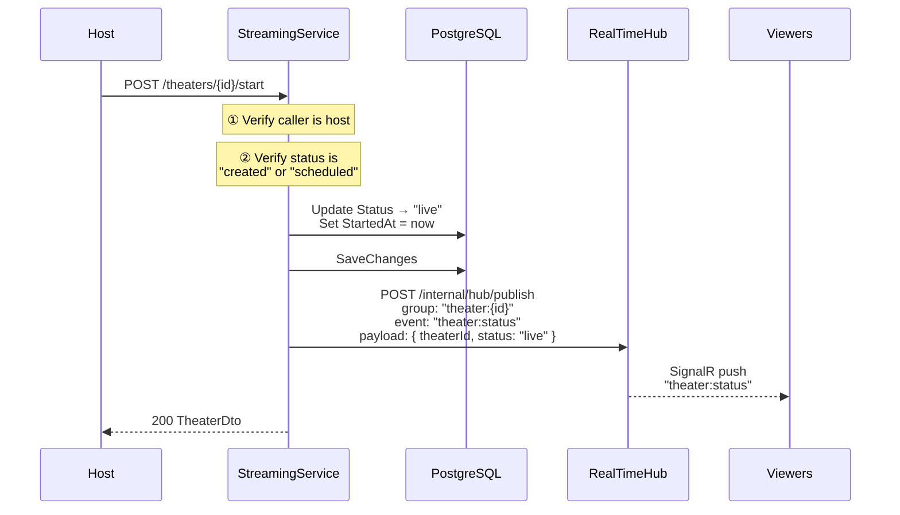
```mermaid
sequenceDiagram
    participant Host
    participant SS as StreamingService
    participant PG as PostgreSQL
    participant RTHub as RealTimeHub
    participant Viewers

    Host->>SS: POST /theaters/{id}/start

    Note over SS: ① Verify caller is host
    Note over SS: ② Verify status is<br/>"created" or "scheduled"

    SS->>PG: Update Status → "live"<br/>Set StartedAt = now
    SS->>PG: SaveChanges

    SS->>RTHub: POST /internal/hub/publish<br/>group: "theater:{id}"<br/>event: "theater:status"<br/>payload: { theaterId, status: "live" }

    RTHub-->>Viewers: SignalR push<br/>"theater:status"

    SS-->>Host: 200 TheaterDto
```

---

### 2. Viewer Participation

#### 2a. Join Theater

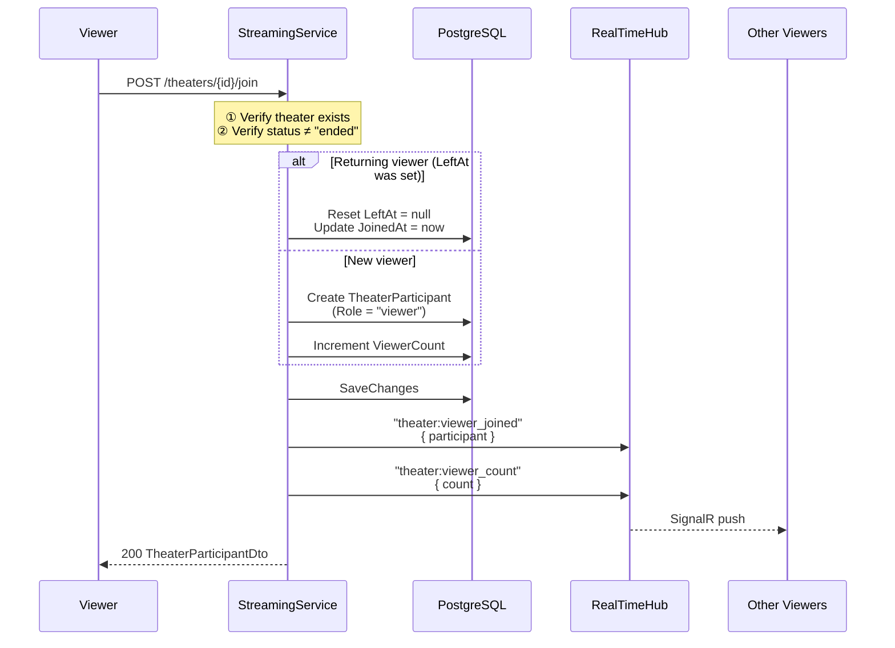
```mermaid
sequenceDiagram
    participant Viewer
    participant SS as StreamingService
    participant PG as PostgreSQL
    participant RTHub as RealTimeHub
    participant Others as Other Viewers

    Viewer->>SS: POST /theaters/{id}/join

    Note over SS: ① Verify theater exists<br/>② Verify status ≠ "ended"

    alt Returning viewer (LeftAt was set)
        SS->>PG: Reset LeftAt = null<br/>Update JoinedAt = now
    else New viewer
        SS->>PG: Create TheaterParticipant<br/>(Role = "viewer")
        SS->>PG: Increment ViewerCount
    end

    SS->>PG: SaveChanges

    SS->>RTHub: "theater:viewer_joined"<br/>{ participant }
    SS->>RTHub: "theater:viewer_count"<br/>{ count }

    RTHub-->>Others: SignalR push

    SS-->>Viewer: 200 TheaterParticipantDto
```

#### 2b. Leave Theater

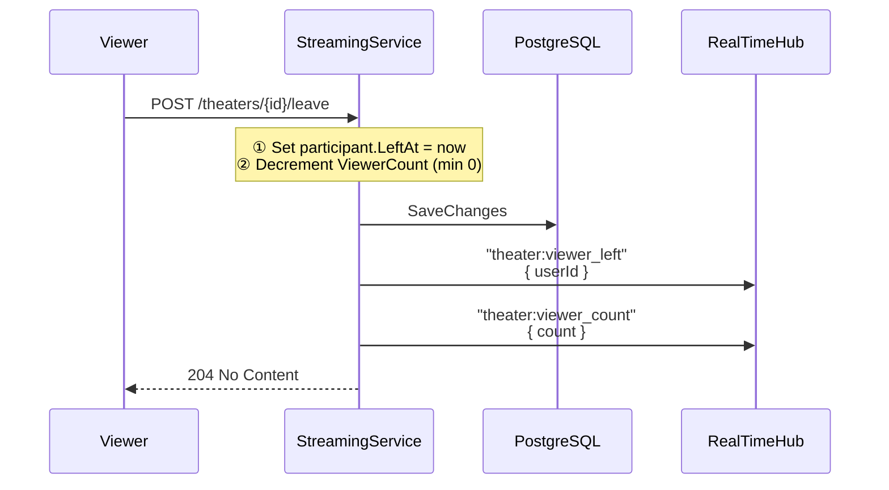
```mermaid
sequenceDiagram
    participant Viewer
    participant SS as StreamingService
    participant PG as PostgreSQL
    participant RTHub as RealTimeHub

    Viewer->>SS: POST /theaters/{id}/leave

    Note over SS: ① Set participant.LeftAt = now<br/>② Decrement ViewerCount (min 0)

    SS->>PG: SaveChanges

    SS->>RTHub: "theater:viewer_left"<br/>{ userId }
    SS->>RTHub: "theater:viewer_count"<br/>{ count }

    SS-->>Viewer: 204 No Content
```

#### 2c. Mute Viewer Chat (Host/Moderator)

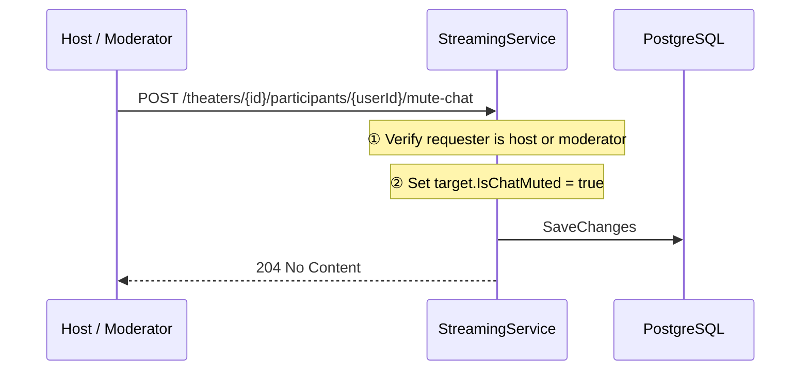
```mermaid
sequenceDiagram
    participant Mod as Host / Moderator
    participant SS as StreamingService
    participant PG as PostgreSQL

    Mod->>SS: POST /theaters/{id}/participants/{userId}/mute-chat

    Note over SS: ① Verify requester is host or moderator
    Note over SS: ② Set target.IsChatMuted = true

    SS->>PG: SaveChanges
    SS-->>Mod: 204 No Content
```

---

### 3. Synchronized Playback

The host controls playback position and play/pause state. All viewers
receive sync events and adjust their local player accordingly.

#### 3a. Playback Sync Flow

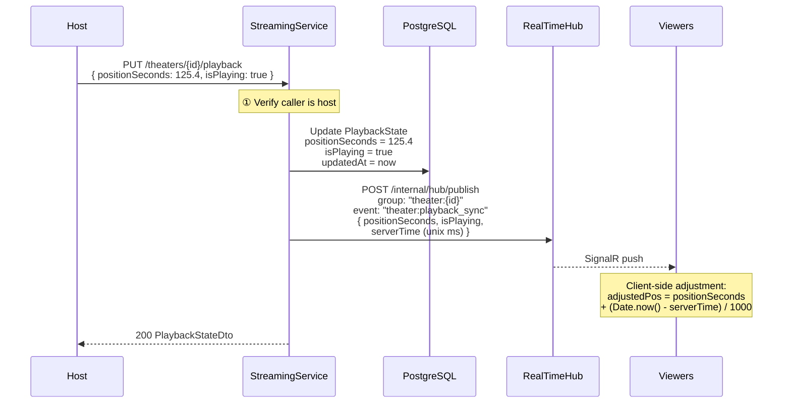
```mermaid
sequenceDiagram
    participant Host
    participant SS as StreamingService
    participant PG as PostgreSQL
    participant RTHub as RealTimeHub
    participant Viewers

    Host->>SS: PUT /theaters/{id}/playback<br/>{ positionSeconds: 125.4, isPlaying: true }

    Note over SS: ① Verify caller is host

    SS->>PG: Update PlaybackState<br/>positionSeconds = 125.4<br/>isPlaying = true<br/>updatedAt = now

    SS->>RTHub: POST /internal/hub/publish<br/>group: "theater:{id}"<br/>event: "theater:playback_sync"<br/>{ positionSeconds, isPlaying,<br/>  serverTime (unix ms) }

    RTHub-->>Viewers: SignalR push

    Note over Viewers: Client-side adjustment:<br/>adjustedPos = positionSeconds<br/>+ (Date.now() - serverTime) / 1000

    SS-->>Host: 200 PlaybackStateDto
```

#### 3b. Playback State Entity (1:1 with Theater)

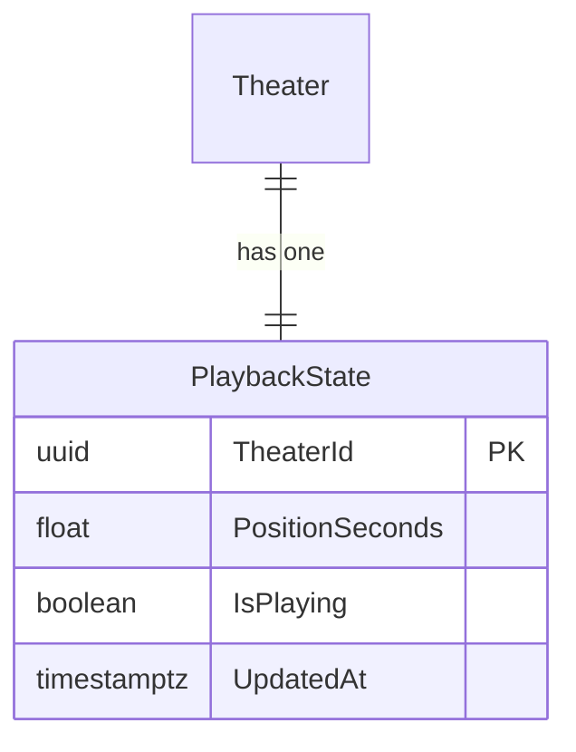
```mermaid
erDiagram
    Theater ||--|| PlaybackState : "has one"

    PlaybackState {
        uuid TheaterId PK
        float PositionSeconds
        boolean IsPlaying
        timestamptz UpdatedAt
    }
```

**Client-side latency compensation:**

```
adjustedPosition = positionSeconds + (Date.now() - serverTime) / 1000
```

The `serverTime` field (unix milliseconds) allows clients to account
for network latency when adjusting the local player position.

---

### 4. Theater Chat

#### 4a. Send Chat Message

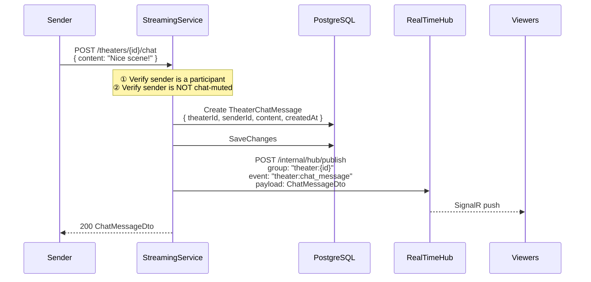
```mermaid
sequenceDiagram
    participant Sender
    participant SS as StreamingService
    participant PG as PostgreSQL
    participant RTHub as RealTimeHub
    participant Viewers

    Sender->>SS: POST /theaters/{id}/chat<br/>{ content: "Nice scene!" }

    Note over SS: ① Verify sender is a participant<br/>② Verify sender is NOT chat-muted

    SS->>PG: Create TheaterChatMessage<br/>{ theaterId, senderId, content, createdAt }
    SS->>PG: SaveChanges

    SS->>RTHub: POST /internal/hub/publish<br/>group: "theater:{id}"<br/>event: "theater:chat_message"<br/>payload: ChatMessageDto

    RTHub-->>Viewers: SignalR push

    SS-->>Sender: 200 ChatMessageDto
```

#### 4b. Delete Chat Message (Host/Moderator or Author)

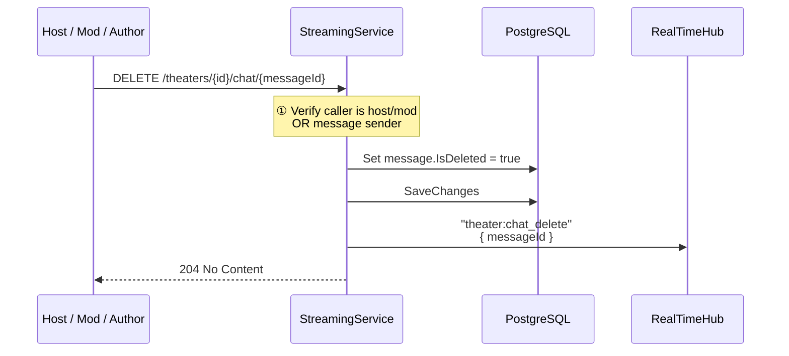
```mermaid
sequenceDiagram
    participant User as Host / Mod / Author
    participant SS as StreamingService
    participant PG as PostgreSQL
    participant RTHub as RealTimeHub

    User->>SS: DELETE /theaters/{id}/chat/{messageId}

    Note over SS: ① Verify caller is host/mod<br/>   OR message sender

    SS->>PG: Set message.IsDeleted = true
    SS->>PG: SaveChanges

    SS->>RTHub: "theater:chat_delete"<br/>{ messageId }

    SS-->>User: 204 No Content
```

#### 4c. Chat History (Cursor-Paginated)

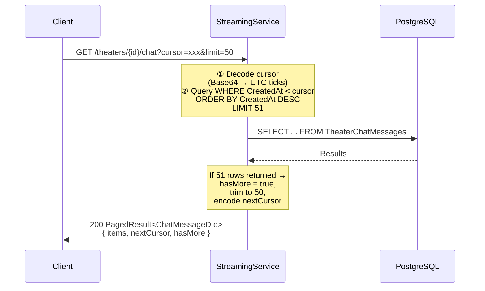
```mermaid
sequenceDiagram
    participant Client
    participant SS as StreamingService
    participant PG as PostgreSQL

    Client->>SS: GET /theaters/{id}/chat?cursor=xxx&limit=50

    Note over SS: ① Decode cursor<br/>(Base64 → UTC ticks)<br/>② Query WHERE CreatedAt < cursor<br/>ORDER BY CreatedAt DESC<br/>LIMIT 51

    SS->>PG: SELECT ... FROM TheaterChatMessages
    PG-->>SS: Results

    Note over SS: If 51 rows returned →<br/>hasMore = true,<br/>trim to 50,<br/>encode nextCursor

    SS-->>Client: 200 PagedResult<ChatMessageDto><br/>{ items, nextCursor, hasMore }
```

---

### 5. Theater Invite

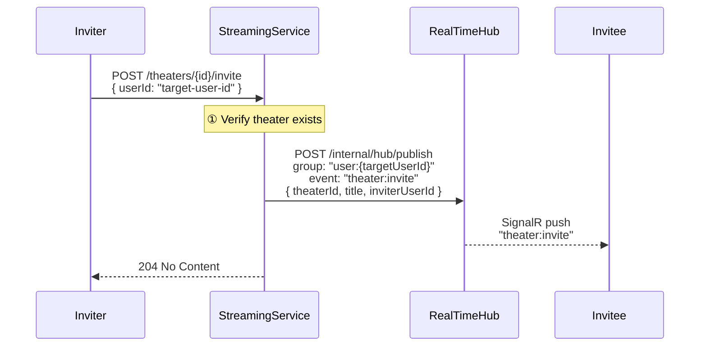
```mermaid
sequenceDiagram
    participant Inviter
    participant SS as StreamingService
    participant RTHub as RealTimeHub
    participant Invitee

    Inviter->>SS: POST /theaters/{id}/invite<br/>{ userId: "target-user-id" }

    Note over SS: ① Verify theater exists

    SS->>RTHub: POST /internal/hub/publish<br/>group: "user:{targetUserId}"<br/>event: "theater:invite"<br/>{ theaterId, title, inviterUserId }

    RTHub-->>Invitee: SignalR push<br/>"theater:invite"

    SS-->>Inviter: 204 No Content
```

**Note:** Invites are fire-and-forget — no persistence. The target
user receives a transient SignalR notification. If offline, the invite
is lost (by design for ephemeral theater sessions).

---

### 6. Discovery & Search

#### 6a. Browse Live / Upcoming Theaters

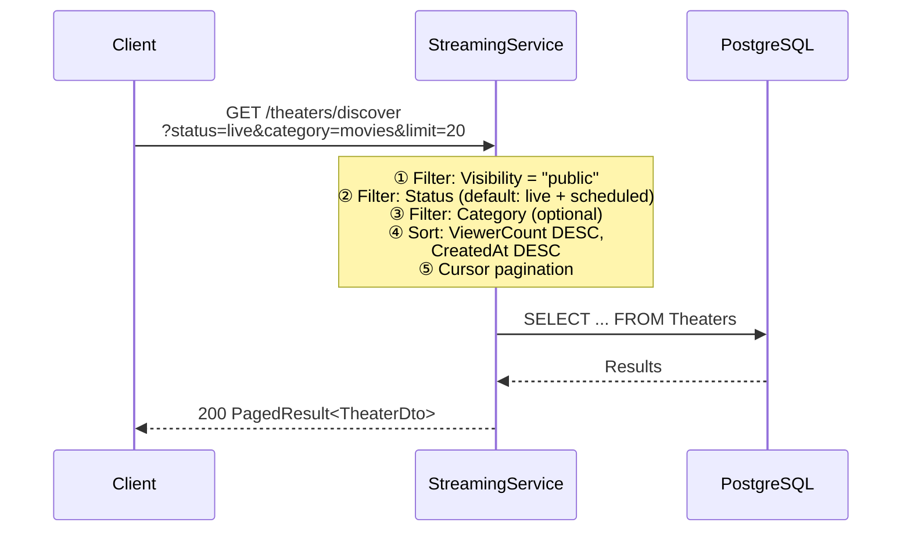
```mermaid
sequenceDiagram
    participant Client
    participant SS as StreamingService
    participant PG as PostgreSQL

    Client->>SS: GET /theaters/discover<br/>?status=live&category=movies&limit=20

    Note over SS: ① Filter: Visibility = "public"<br/>② Filter: Status (default: live + scheduled)<br/>③ Filter: Category (optional)<br/>④ Sort: ViewerCount DESC,<br/>   CreatedAt DESC<br/>⑤ Cursor pagination

    SS->>PG: SELECT ... FROM Theaters
    PG-->>SS: Results

    SS-->>Client: 200 PagedResult<TheaterDto>
```

#### 6b. Full-Text Search

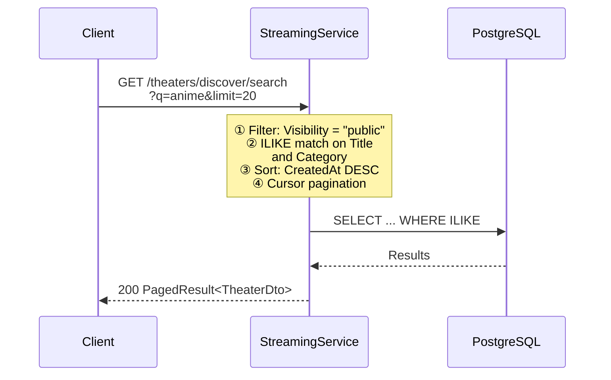
```mermaid
sequenceDiagram
    participant Client
    participant SS as StreamingService
    participant PG as PostgreSQL

    Client->>SS: GET /theaters/discover/search<br/>?q=anime&limit=20

    Note over SS: ① Filter: Visibility = "public"<br/>② ILIKE match on Title<br/>   and Category<br/>③ Sort: CreatedAt DESC<br/>④ Cursor pagination

    SS->>PG: SELECT ... WHERE ILIKE
    PG-->>SS: Results

    SS-->>Client: 200 PagedResult<TheaterDto>
```

---

### 7. Emotes

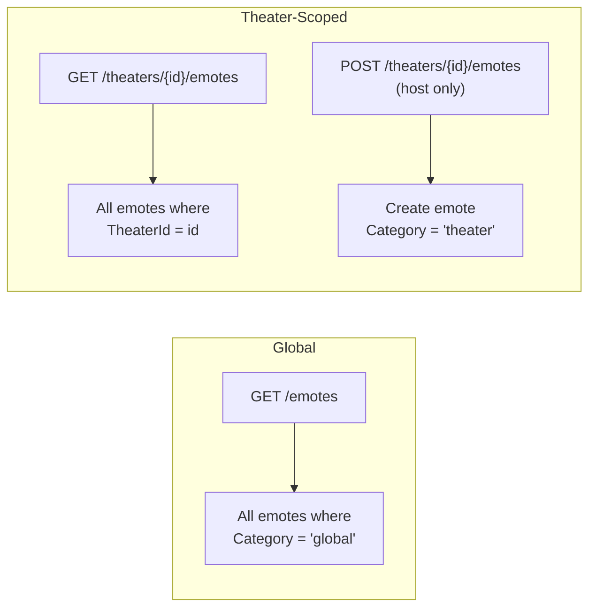
```mermaid
graph LR
    subgraph Global
        A["GET /emotes"] --> B["All emotes where<br/>Category = 'global'"]
    end

    subgraph Theater-Scoped
        C["GET /theaters/{id}/emotes"] --> D["All emotes where<br/>TheaterId = id"]
        E["POST /theaters/{id}/emotes<br/>(host only)"] --> F["Create emote<br/>Category = 'theater'"]
    end
```

---

## Data Storage Layout

### PostgreSQL — streaming_db

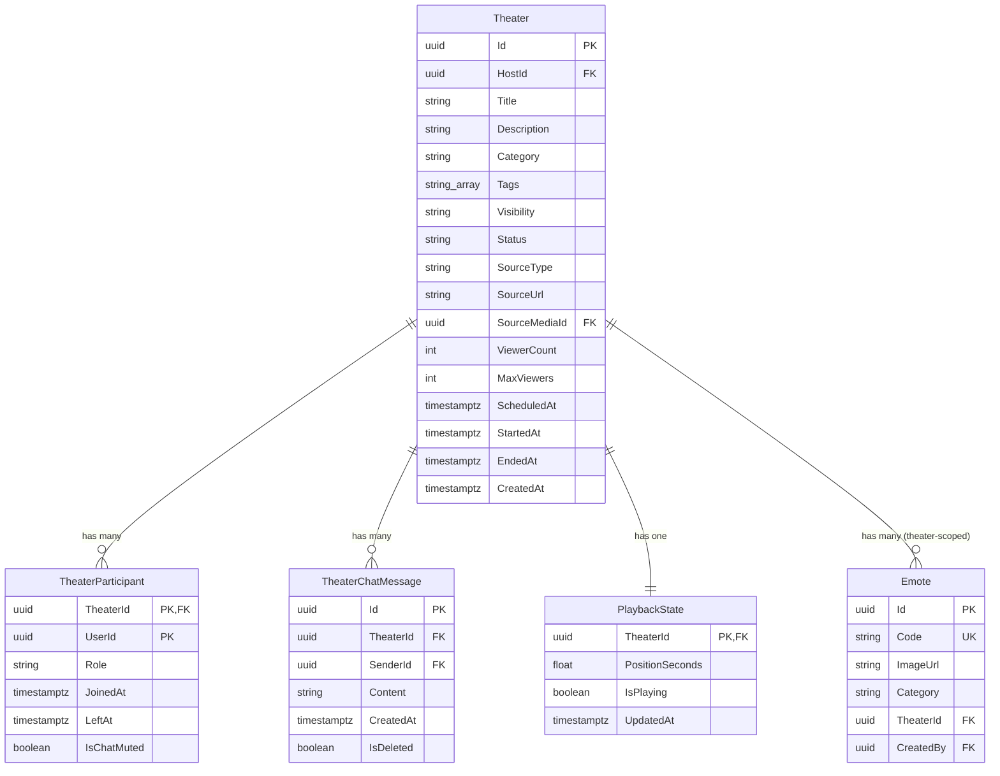
```mermaid
erDiagram
    Theater ||--o{ TheaterParticipant : "has many"
    Theater ||--o{ TheaterChatMessage : "has many"
    Theater ||--|| PlaybackState : "has one"
    Theater ||--o{ Emote : "has many (theater-scoped)"

    Theater {
        uuid Id PK
        uuid HostId FK
        string Title
        string Description
        string Category
        string_array Tags
        string Visibility
        string Status
        string SourceType
        string SourceUrl
        uuid SourceMediaId FK
        int ViewerCount
        int MaxViewers
        timestamptz ScheduledAt
        timestamptz StartedAt
        timestamptz EndedAt
        timestamptz CreatedAt
    }

    TheaterParticipant {
        uuid TheaterId PK,FK
        uuid UserId PK
        string Role
        timestamptz JoinedAt
        timestamptz LeftAt
        boolean IsChatMuted
    }

    TheaterChatMessage {
        uuid Id PK
        uuid TheaterId FK
        uuid SenderId FK
        string Content
        timestamptz CreatedAt
        boolean IsDeleted
    }

    PlaybackState {
        uuid TheaterId PK,FK
        float PositionSeconds
        boolean IsPlaying
        timestamptz UpdatedAt
    }

    Emote {
        uuid Id PK
        string Code UK
        string ImageUrl
        string Category
        uuid TheaterId FK
        uuid CreatedBy FK
    }
```

**Database indexes (configured in `OnModelCreating`):**

| Table | Index | Purpose |
|---|---|---|
| `Theaters` | `Status` | Filter live/scheduled for discovery |
| `Theaters` | `HostId` | Lookup host's theaters |
| `Theaters` | `CreatedAt` | Cursor-based pagination |
| `TheaterChatMessages` | `(TheaterId, CreatedAt)` | Efficient chat history retrieval |
| `Emotes` | `Code` (unique) | Emote lookup by code |

### Redis — Shared with Phase 1

StreamingService does **not** use Redis directly. It relies on the
RealTimeHub's Redis backplane for event fan-out:

```
Redis 7 (container: redis, port 6379)
│
└── SignalR Backplane (RealTimeHub)
    └── sc-rt:*  PUB/SUB channels
```

---

## Cross-Service Communication Map

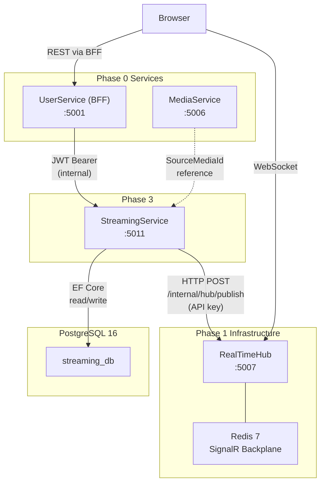
```mermaid
graph TB
    subgraph Phase0 ["Phase 0 Services"]
        BFF["UserService (BFF)<br/>:5001"]
        Media["MediaService<br/>:5006"]
    end

    subgraph Phase1Infra ["Phase 1 Infrastructure"]
        RTHub["RealTimeHub<br/>:5007"]
        Redis["Redis 7<br/>SignalR Backplane"]
    end

    subgraph Phase3 ["Phase 3"]
        SS["StreamingService<br/>:5011"]
    end

    subgraph Storage ["PostgreSQL 16"]
        DB["streaming_db"]
    end

    BFF -- "JWT Bearer<br/>(internal)" --> SS
    SS -- "HTTP POST<br/>/internal/hub/publish<br/>(API key)" --> RTHub
    RTHub --- Redis
    SS -- "EF Core<br/>read/write" --> DB
    Media -. "SourceMediaId<br/>reference" .-> SS

    Client["Browser"] -- "REST via BFF" --> BFF
    Client -- "WebSocket" --> RTHub
```

**Key design decisions:**

| Decision | Rationale |
|---|---|
| HTTP POST to RealTimeHub (not Service Bus) | Theater events are ephemeral and latency-sensitive; direct HTTP push to SignalR is simpler and lower-latency than async messaging |
| Best-effort event publishing (swallowed exceptions) | A theater mutation succeeds even if real-time push fails — viewers resync via REST polling on reconnect |
| Single service for all theater concerns | Theater lifecycle, chat, playback, and emotes are tightly coupled; splitting would add unnecessary inter-service coordination |
| No Redis direct usage | Presence/caching needs are minimal for theaters; PostgreSQL handles all persistence; SignalR backplane (via RealTimeHub) handles fan-out |
| Playback state as 1:1 table | One row per theater avoids schema complexity; updates are frequent but small |
| Fire-and-forget invites (no persistence) | Invites are ephemeral — if the user is offline, the theater session may be over by the time they come online |
| `uuid_generate_v4()` as default PK | Server-side UUID generation ensures uniqueness without client coordination |

---

## Complete Event Catalog — Phase 3

| Event Name | SignalR Group | Trigger | Payload |
|---|---|---|---|
| `theater:status` | `theater:{id}` | Host starts, pauses, resumes, or ends | `{ theaterId, status }` |
| `theater:viewer_joined` | `theater:{id}` | Viewer joins theater | `TheaterParticipantDto` |
| `theater:viewer_left` | `theater:{id}` | Viewer leaves theater | `{ userId }` |
| `theater:viewer_count` | `theater:{id}` | Join or leave changes count | `{ count }` |
| `theater:chat_message` | `theater:{id}` | Chat message sent | `ChatMessageDto` |
| `theater:chat_delete` | `theater:{id}` | Chat message deleted | `{ messageId }` |
| `theater:playback_sync` | `theater:{id}` | Host updates playback position | `{ positionSeconds, isPlaying, serverTime }` |
| `theater:invite` | `user:{userId}` | User invited to theater | `{ theaterId, title, inviterUserId }` |

---

## API Endpoint Summary

### TheatersController (`/theaters`)

| Endpoint | Method | Auth | Description |
|---|---|---|---|
| `/theaters` | `POST` | ✅ | Create theater (caller becomes host) |
| `/theaters/{id}` | `GET` | ✅ | Get theater detail |
| `/theaters/{id}` | `PATCH` | ✅ Host | Update title / description / tags |
| `/theaters/{id}/start` | `POST` | ✅ Host | Transition → `live` |
| `/theaters/{id}/pause` | `POST` | ✅ Host | Transition → `paused` |
| `/theaters/{id}/resume` | `POST` | ✅ Host | Transition → `live` |
| `/theaters/{id}/end` | `POST` | ✅ Host | Transition → `ended` |
| `/theaters/{id}/join` | `POST` | ✅ | Viewer joins theater |
| `/theaters/{id}/leave` | `POST` | ✅ | Viewer leaves theater |
| `/theaters/{id}/participants` | `GET` | ✅ | Active viewer list |
| `/theaters/{id}/participants/{userId}/mute-chat` | `POST` | ✅ Host/Mod | Mute viewer's chat |
| `/theaters/{id}/playback` | `GET` | ✅ | Current playback state |
| `/theaters/{id}/playback` | `PUT` | ✅ Host | Update playback (sync event) |
| `/theaters/{id}/chat` | `GET` | ✅ | Chat history (cursor-paged) |
| `/theaters/{id}/chat` | `POST` | ✅ Participant | Send chat message |
| `/theaters/{id}/chat/{msgId}` | `DELETE` | ✅ Host/Mod/Author | Delete chat message |
| `/theaters/{id}/invite` | `POST` | ✅ | Send theater invite |
| `/theaters/discover` | `GET` | ✅ | Browse public theaters (filterable) |
| `/theaters/discover/search` | `GET` | ✅ | Full-text search theaters |

### EmotesController

| Endpoint | Method | Auth | Description |
|---|---|---|---|
| `/emotes` | `GET` | ✅ | List global emotes |
| `/theaters/{id}/emotes` | `GET` | ✅ | List theater-scoped emotes |
| `/theaters/{id}/emotes` | `POST` | ✅ Host | Create theater emote |

---

## Pagination Strategy

Theater endpoints use **cursor-based pagination** consistent with
Phase 1 and Phase 2:

```mermaid
graph LR
    A["Client Request<br/>?cursor=xxx&limit=50"] --> B["Decode cursor<br/>Base64 → UTC ticks"]
    B --> C["Query: WHERE CreatedAt < cursor<br/>ORDER BY ... DESC<br/>LIMIT N+1"]
    C --> D{"> N rows?"}
    D -- Yes --> E["hasMore = true<br/>Trim to N rows<br/>Encode nextCursor"]
    D -- No --> F["hasMore = false<br/>nextCursor = null"]
    E --> G["Return PagedResult"]
    F --> G
```

**Discovery sort:** `ViewerCount DESC, CreatedAt DESC` (most popular
theaters surface first).

**Search sort:** `CreatedAt DESC` (newest matching theaters first).

---

## Docker Compose — Phase 3 Container Topology

```mermaid
graph TB
    subgraph Docker["docker-compose network"]

        subgraph Infra["Infrastructure"]
            PG["postgres :5432<br/>streaming_db + others"]
            Redis["redis :6379"]
        end

        subgraph Phase0["Phase 0"]
            US["userservice :5001<br/>(BFF)"]
            MS["mediaservice :5006"]
        end

        subgraph Phase1["Phase 1 Infrastructure"]
            RTH["realtimehub :5007"]
        end

        subgraph Phase3svc["Phase 3"]
            SS["streamingservice :5011"]
        end

        PG --- SS
        RTH --- SS
        Redis --- RTH
        US -. "JWT proxy" .-> SS
        MS -. "SourceMediaId ref" .-> SS
    end
```

**StreamingService `docker-compose.yml` entry (planned):**

```yaml
streamingservice:
  build: ./services/StreamingService
  environment:
    ASPNETCORE_URLS: http://+:8080
    ASPNETCORE_ENVIRONMENT: Development
    ConnectionStrings__Default: >-
      Host=postgres;Port=5432;Database=streaming_db;
      Username=postgres;Password=1234;Ssl Mode=Disable
    Authentication__Jwt__Issuer: "SocialCommerce"
    Authentication__Jwt__SymmetricKey: "sc-dev-secret-key-min-32-bytes-long!!"
    RealTimeHub__BaseUrl: "http://realtimehub:8080"
    Internal__ApiKey: "sc-dev-internal-api-key"
  ports:
    - "5011:8080"
  depends_on:
    - postgres
    - realtimehub
```

---

## Error Handling

StreamingService follows the **RFC 7807 Problem Details** standard
configured via `builder.Services.AddProblemDetails()` and
`app.UseExceptionHandler()`.

| Scenario | HTTP Status | Handling |
|---|---|---|
| JWT missing or invalid | `401 Unauthorized` | ASP.NET Core auth middleware rejects before reaching controller |
| Non-host attempts lifecycle action | `403 Forbidden` | Controller checks `theater.HostId != UserId` → `Forbid()` |
| Theater not found | `404 Not Found` | `FindAsync` returns null → `NotFound()` |
| Participant not found | `404 Not Found` | `FirstOrDefaultAsync` returns null → `NotFound()` |
| Invalid state transition (e.g., pause from "created") | `409 Conflict` | Controller returns `Conflict(new { error = "..." })` |
| Viewer joins ended theater | `409 Conflict` | `theater.Status == "ended"` → `Conflict()` |
| Chat-muted sender tries to send | `403 Forbidden` | Participant exists but `IsChatMuted` → `Forbid()` |
| Non-host/mod/author tries to delete chat | `403 Forbidden` | Role + sender check → `Forbid()` |
| RealTimeHub unreachable during event publish | Silent failure | `RealTimePublisher.PublishAsync` catches all exceptions |
| Search query empty | `400 Bad Request` | Controller returns `BadRequest()` |

---

## End of Document
