# Phase 4 — Commerce & Platform Backend: Dataflow & Architecture

## Overview

Phase 4 delivers the **commerce marketplace, notifications, search,
analytics, and advertising** layer of the SocialCommerce super-app.
It comprises seven domain services that collectively enable the
full buyer/seller marketplace experience — from product catalog
browsing and cart management, through checkout and order fulfillment,
to seller dashboards, cross-domain search, real-time notifications,
and promoted product campaigns.

| Service | Port | Style | Storage | Purpose |
|---|---|---|---|---|
| **CommerceService** | 5012 | REST (Controllers) | PostgreSQL (`commerce_db`) | Product catalog, categories, cart, coupons, reviews, search |
| **OrderService** | 5013 | REST (Controllers) | PostgreSQL (`order_db`) | Addresses, checkout sessions, orders, shipments, cancellation |
| **InventoryService** | 5014 | REST (Controllers) | PostgreSQL (`inventory_db`) | Seller shops, inventory products/variants, stock snapshots, seller orders |
| **NotificationService** | 5017 | REST (Controllers) | PostgreSQL (`notification_db`) + Redis (pub/sub) | Cross-domain notification persistence, real-time push via RealTimeHub |
| **AnalyticsService** | 5015 | REST (Controllers) | PostgreSQL (`analytics_db`) + Redis (pub/sub) | Seller sales overview, revenue/order timeseries, top products, CSV export |
| **SearchService** | 5018 | REST (Controllers) | PostgreSQL (`search_db` — tsvector) | Unified full-text search across users, posts, groups, theaters, products |
| **AdService** | 5016 | REST (Controllers) | PostgreSQL (`ad_db`) | Ad campaigns, product promotion, impression/click tracking, budget management |

### Dependency on Phase 0 / Phase 1 / Phase 2 Services

| Dependency | Role in Phase 4 |
|---|---|
| **UserService** (5001) | BFF gateway — authenticates browser sessions, issues internal JWTs that Phase 4 services validate |
| **MediaService** (5006) | Processes file uploads; `MediaId` on product images and review images references a media asset uploaded via MediaService |
| **RealTimeHub** (5007) | Centralized WebSocket gateway — NotificationService publishes real-time notification events to users via the hub's internal HTTP API |
| **Phase 2 Services** | SocialContentService, SocialGraphService, ModerationService publish events that NotificationService consumes for social notifications |
| **Phase 3 StreamingService** | Publishes theater events that NotificationService consumes for streaming notifications |

---

## High-Level Architecture

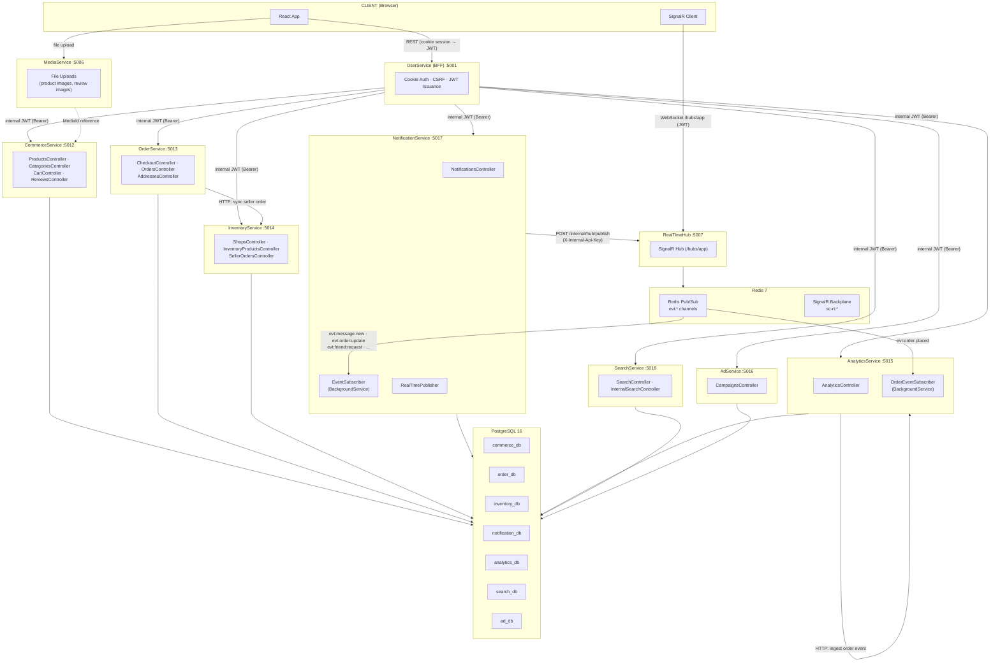
```mermaid
graph TB
    subgraph Client ["CLIENT (Browser)"]
        React["React App"]
        SRClient["SignalR Client"]
    end

    React -- "REST (cookie session → JWT)" --> BFF
    SRClient -- "WebSocket /hubs/app (JWT)" --> RTHub

    subgraph BFF ["UserService (BFF) :5001"]
        Auth["Cookie Auth · CSRF · JWT Issuance"]
    end

    BFF -- "internal JWT (Bearer)" --> Commerce
    BFF -- "internal JWT (Bearer)" --> Order
    BFF -- "internal JWT (Bearer)" --> Inventory
    BFF -- "internal JWT (Bearer)" --> Notif
    BFF -- "internal JWT (Bearer)" --> Analytics
    BFF -- "internal JWT (Bearer)" --> Search
    BFF -- "internal JWT (Bearer)" --> Ad

    subgraph Commerce ["CommerceService :5012"]
        CC["ProductsController · CategoriesController\nCartController · ReviewsController"]
    end

    subgraph Order ["OrderService :5013"]
        OC["CheckoutController · OrdersController\nAddressesController"]
    end

    subgraph Inventory ["InventoryService :5014"]
        IC["ShopsController · InventoryProductsController\nSellerOrdersController"]
    end

    subgraph Notif ["NotificationService :5017"]
        NC["NotificationsController"]
        NES["EventSubscriber\n(BackgroundService)"]
        NRT["RealTimePublisher"]
    end

    subgraph Analytics ["AnalyticsService :5015"]
        AC["AnalyticsController"]
        AES["OrderEventSubscriber\n(BackgroundService)"]
    end

    subgraph Search ["SearchService :5018"]
        SC["SearchController · InternalSearchController"]
    end

    subgraph Ad ["AdService :5016"]
        ADC["CampaignsController"]
    end

    subgraph RTHub ["RealTimeHub :5007"]
        Hub["SignalR Hub (/hubs/app)"]
    end

    Notif -- "POST /internal/hub/publish\n(X-Internal-Api-Key)" --> RTHub
    RTHub --> Redis

    subgraph Redis ["Redis 7"]
        RPS["Redis Pub/Sub\nevt:* channels"]
        SRB["SignalR Backplane\nsc-rt:*"]
    end

    RPS -- "evt:order:placed" --> AES
    RPS -- "evt:message:new · evt:order:update\nevt:friend:request · ..." --> NES

    Order -- "HTTP: sync seller order" --> Inventory
    Analytics -- "HTTP: ingest order event" --> Analytics

    Commerce --> PG
    Order --> PG
    Inventory --> PG
    Notif --> PG
    Analytics --> PG
    Search --> PG
    Ad --> PG

    subgraph PG ["PostgreSQL 16"]
        DB1["commerce_db"]
        DB2["order_db"]
        DB3["inventory_db"]
        DB4["notification_db"]
        DB5["analytics_db"]
        DB6["search_db"]
        DB7["ad_db"]
    end

    subgraph Media ["MediaService :5006"]
        Upload["File Uploads\n(product images, review images)"]
    end

    React -- "file upload" --> Media
    Media -. "MediaId reference" .-> Commerce
```

---

## Authentication & Authorization

All Phase 4 services use the **same symmetric-key JWT** scheme as
Phase 1 and Phase 3 services. The **UserService (BFF)** is the sole
JWT issuer; Phase 4 services are consumers only.

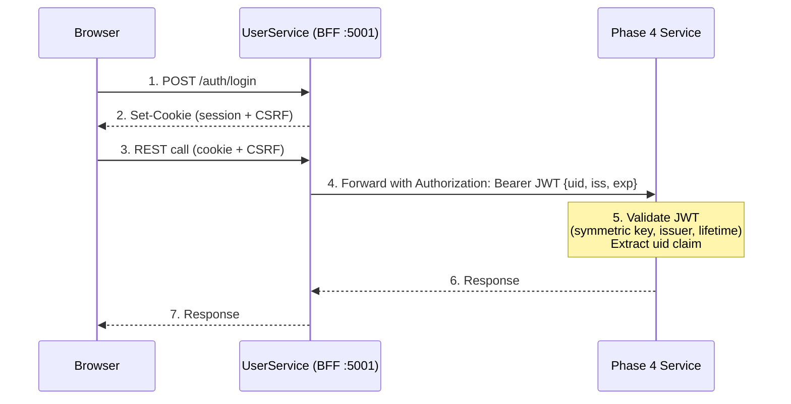
```mermaid
sequenceDiagram
    participant Browser
    participant BFF as UserService (BFF :5001)
    participant Svc as Phase 4 Service

    Browser->>BFF: 1. POST /auth/login
    BFF-->>Browser: 2. Set-Cookie (session + CSRF)

    Browser->>BFF: 3. REST call (cookie + CSRF)
    BFF->>Svc: 4. Forward with Authorization: Bearer JWT {uid, iss, exp}

    Note over Svc: 5. Validate JWT<br/>(symmetric key, issuer, lifetime)<br/>Extract uid claim

    Svc-->>BFF: 6. Response
    BFF-->>Browser: 7. Response
```

**JWT claims used across Phase 4:**

| Claim | Description |
|---|---|
| `uid` | User ID (GUID) — primary identity, extracted via `User.FindFirstValue("uid")` |
| `iss` | `"SocialCommerce"` — validated by `JwtAuthExtensions` |
| `exp` | Token expiration — validated with 30s clock skew |

**Auth configuration (shared across all Phase 4 services):**

```
Authentication:Jwt:SymmetricKey → shared symmetric signing key
Authentication:Jwt:Issuer       → "SocialCommerce"
ValidateAudience                → false (not checked)
```

**Internal endpoints** (e.g., `POST /internal/seller-orders/sync`,
`POST /internal/analytics/order-placed`, `POST /internal/search/upsert`)
use `[AllowAnonymous]` and are intended to be protected by API keys
or network-level controls in production.

---

## Event Bus Architecture — Redis Pub/Sub

Phase 4 uses **Redis Pub/Sub** for asynchronous event communication,
consistent with the `DomainEvent` envelope and `EventTypes` constants
defined in the shared `Contracts` library.

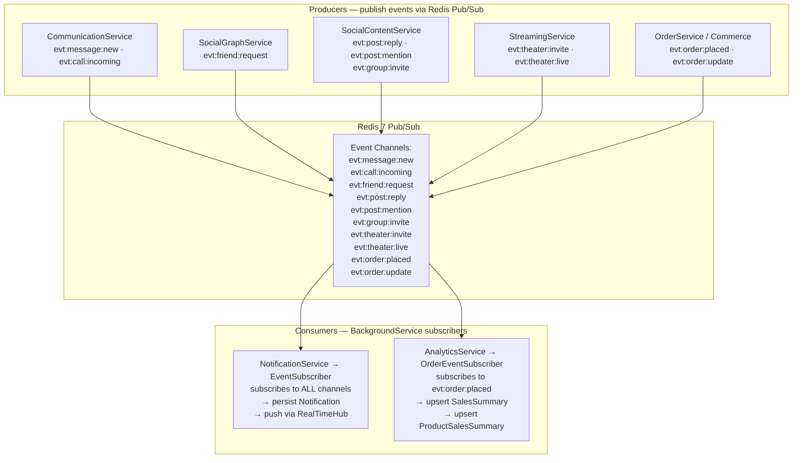
```mermaid
graph TB
    subgraph Producers ["Producers — publish events via Redis Pub/Sub"]
        P1["CommunicationService<br/>evt:message:new · evt:call:incoming"]
        P2["SocialGraphService<br/>evt:friend:request"]
        P3["SocialContentService<br/>evt:post:reply · evt:post:mention<br/>evt:group:invite"]
        P4["StreamingService<br/>evt:theater:invite · evt:theater:live"]
        P5["OrderService / Commerce<br/>evt:order:placed · evt:order:update"]
    end

    subgraph Redis ["Redis 7 Pub/Sub"]
        CH["Event Channels:<br/>evt:message:new<br/>evt:call:incoming<br/>evt:friend:request<br/>evt:post:reply<br/>evt:post:mention<br/>evt:group:invite<br/>evt:theater:invite<br/>evt:theater:live<br/>evt:order:placed<br/>evt:order:update"]
    end

    subgraph Consumers ["Consumers — BackgroundService subscribers"]
        NS["NotificationService → EventSubscriber<br/>subscribes to ALL channels<br/>→ persist Notification<br/>→ push via RealTimeHub"]
        AS["AnalyticsService → OrderEventSubscriber<br/>subscribes to evt:order:placed<br/>→ upsert SalesSummary<br/>→ upsert ProductSalesSummary"]
    end

    P1 --> CH
    P2 --> CH
    P3 --> CH
    P4 --> CH
    P5 --> CH
    CH --> NS
    CH --> AS
```

### Event Envelope Format

All events use the shared `DomainEvent` envelope:

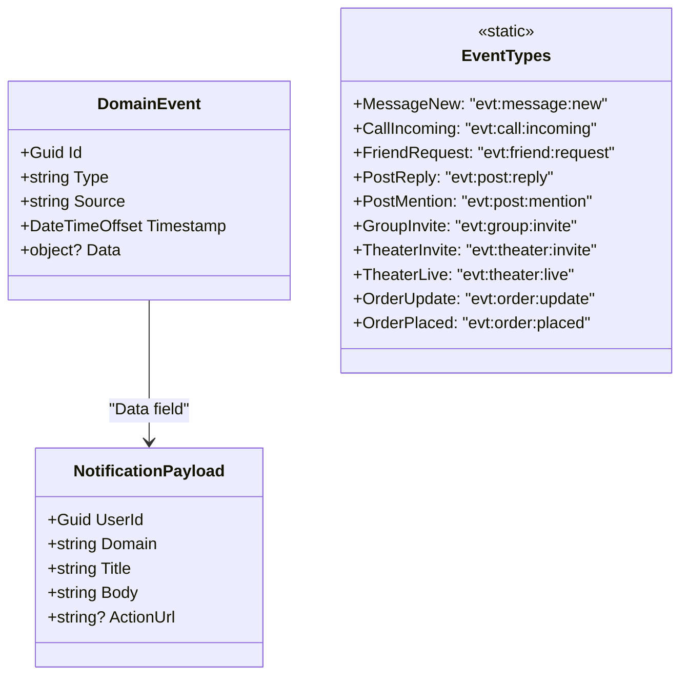
```mermaid
classDiagram
    class DomainEvent {
        +Guid Id
        +string Type
        +string Source
        +DateTimeOffset Timestamp
        +object? Data
    }
    class NotificationPayload {
        +Guid UserId
        +string Domain
        +string Title
        +string Body
        +string? ActionUrl
    }
    class EventTypes {
        <<static>>
        +MessageNew: "evt:message:new"
        +CallIncoming: "evt:call:incoming"
        +FriendRequest: "evt:friend:request"
        +PostReply: "evt:post:reply"
        +PostMention: "evt:post:mention"
        +GroupInvite: "evt:group:invite"
        +TheaterInvite: "evt:theater:invite"
        +TheaterLive: "evt:theater:live"
        +OrderUpdate: "evt:order:update"
        +OrderPlaced: "evt:order:placed"
    }
    DomainEvent --> NotificationPayload : "Data field"
```

---

## Service-by-Service Dataflow

### 1. CommerceService — Product Catalog & Cart Dataflow

#### 1a. Browse Products (Catalog)

```mermaid
sequenceDiagram
    participant C as Client
    participant BFF as UserService (BFF)
    participant CS as CommerceService
    participant PG as PostgreSQL

    C->>BFF: GET /products?category=electronics<br/>&sort=rating&cursor=xxx&limit=20
    BFF->>CS: GET (JWT Bearer)

    Note right of CS: ① Filter: Status = "active"
    Note right of CS: ② Filter by category slug (optional)
    Note right of CS: ③ Filter by availability (optional)
    Note right of CS: ④ Decode cursor → CreatedAt < cursor
    Note right of CS: ⑤ Sort: rating | reviews | newest
    Note right of CS: ⑥ Take limit+1 for hasMore detection

    CS->>PG: SELECT ... FROM Products<br/>JOIN Category, Variants
    PG-->>CS: Results

    CS-->>BFF: 200 PagedResult&lt;ProductSummaryDto&gt;
    BFF-->>C: 200 PagedResult
```

#### 1b. Product Detail

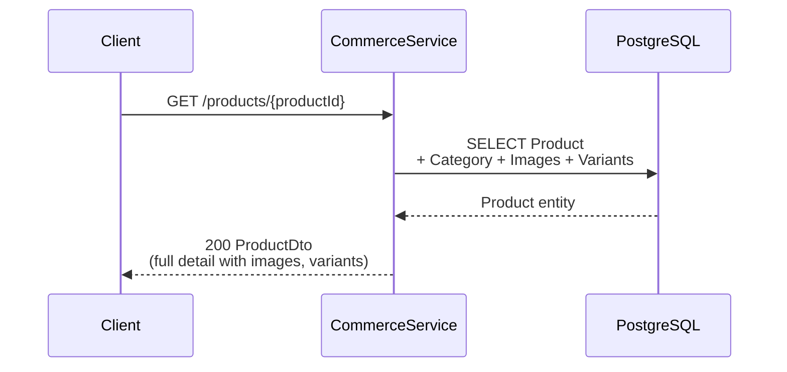
```mermaid
sequenceDiagram
    participant C as Client
    participant CS as CommerceService
    participant PG as PostgreSQL

    C->>CS: GET /products/{productId}

    CS->>PG: SELECT Product<br/>+ Category + Images + Variants
    PG-->>CS: Product entity

    CS-->>C: 200 ProductDto<br/>(full detail with images, variants)
```

#### 1c. Product Search

```mermaid
sequenceDiagram
    participant C as Client
    participant CS as CommerceService
    participant PG as PostgreSQL

    C->>CS: GET /products/search?q=wireless+headphones

    Note right of CS: ① ILIKE match on Title and Description
    Note right of CS: ② Filter: Status = "active"
    Note right of CS: ③ Cursor-based pagination

    CS->>PG: SELECT ... WHERE<br/>ILIKE(Title, '%q%') OR<br/>ILIKE(Description, '%q%')
    PG-->>CS: Results

    CS-->>C: 200 PagedResult&lt;ProductSummaryDto&gt;
```

#### 1d. Related Products

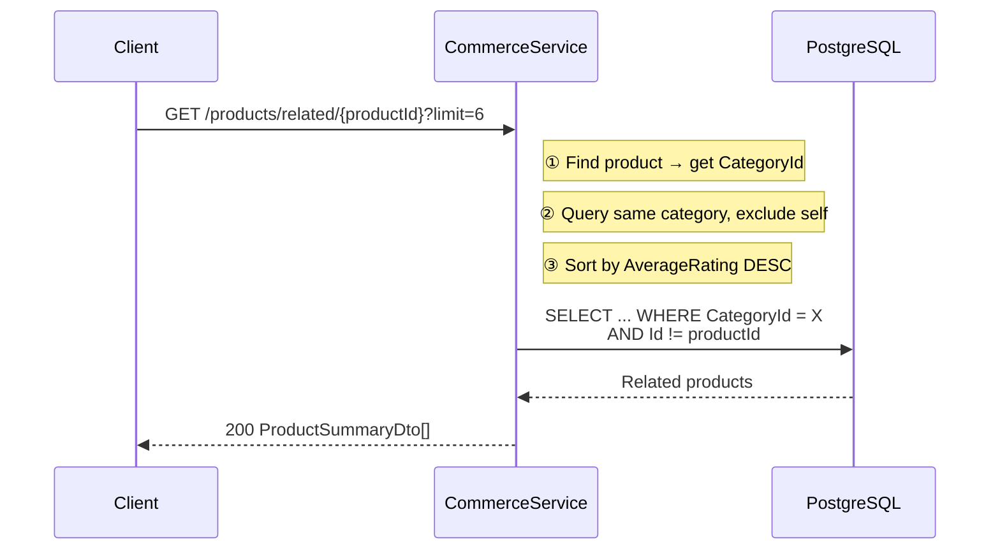
```mermaid
sequenceDiagram
    participant C as Client
    participant CS as CommerceService
    participant PG as PostgreSQL

    C->>CS: GET /products/related/{productId}?limit=6

    Note right of CS: ① Find product → get CategoryId
    Note right of CS: ② Query same category, exclude self
    Note right of CS: ③ Sort by AverageRating DESC

    CS->>PG: SELECT ... WHERE CategoryId = X<br/>AND Id != productId
    PG-->>CS: Related products

    CS-->>C: 200 ProductSummaryDto[]
```

#### 1e. Cart Operations


```mermaid
flowchart TD
    subgraph GetCart ["GET /cart"]
        GC1["Load or create Cart for UserId"]
        GC2["Load CartItems + Product + Variant"]
        GC3["Calculate subtotal, apply coupon discount"]
        GC4["Return CartDto with totals"]
        GC1 --> GC2 --> GC3 --> GC4
    end

    subgraph AddItem ["POST /cart/items"]
        AI1["Validate ProductVariant exists"]
        AI2["Check stock ≥ quantity"]
        AI3{"Existing CartItem<br/>for this variant?"}
        AI3 -- Yes --> AI4["Increment quantity"]
        AI3 -- No --> AI5["Create new CartItem"]
        AI1 --> AI2 --> AI3
    end

    subgraph UpdateItem ["PATCH /cart/items/{itemId}"]
        UI1["Find CartItem by id + cartId"]
        UI2{"quantity ≤ 0?"}
        UI2 -- Yes --> UI3["Remove CartItem"]
        UI2 -- No --> UI4["Update quantity"]
        UI1 --> UI2
    end

    subgraph Coupon ["POST /cart/coupon"]
        CP1["Validate coupon: active, not expired, not maxed"]
        CP2["Set cart.CouponCode"]
        CP3["Recalculate discount on next CartDto build"]
        CP1 --> CP2 --> CP3
    end
```

#### 1f. Coupon Discount Calculation

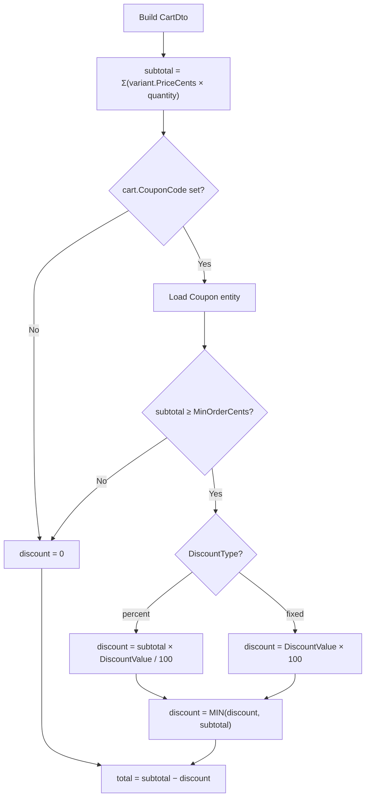
```mermaid
flowchart TD
    Start["Build CartDto"] --> Sub["subtotal = Σ(variant.PriceCents × quantity)"]
    Sub --> HasCoupon{"cart.CouponCode set?"}
    HasCoupon -- No --> NoDiscount["discount = 0"]
    HasCoupon -- Yes --> LoadCoupon["Load Coupon entity"]
    LoadCoupon --> MinOrder{"subtotal ≥ MinOrderCents?"}
    MinOrder -- No --> NoDiscount
    MinOrder -- Yes --> DiscType{"DiscountType?"}
    DiscType -- percent --> Pct["discount = subtotal × DiscountValue / 100"]
    DiscType -- fixed --> Fixed["discount = DiscountValue × 100"]
    Pct --> Cap["discount = MIN(discount, subtotal)"]
    Fixed --> Cap
    Cap --> Total["total = subtotal − discount"]
    NoDiscount --> Total
```

#### 1g. Create Review

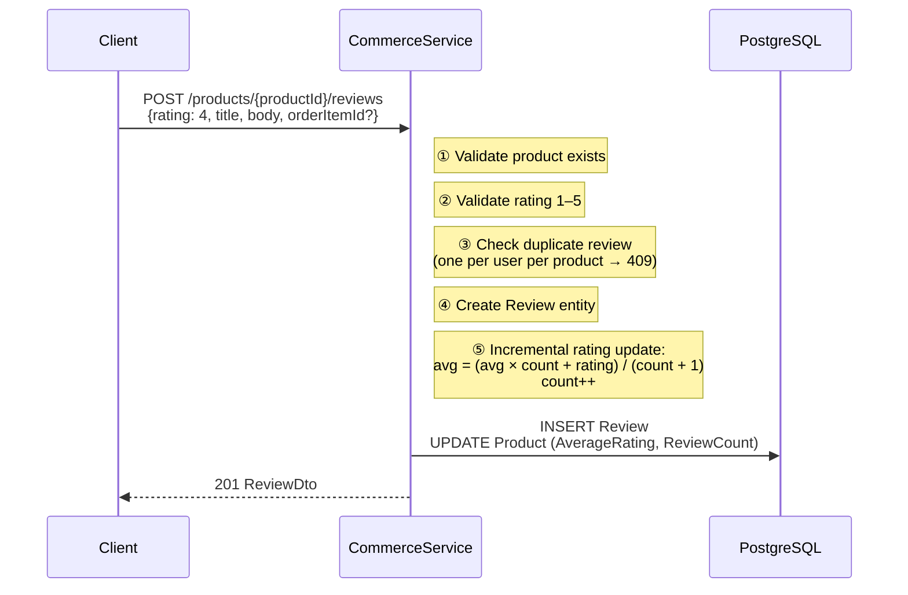
```mermaid
sequenceDiagram
    participant C as Client
    participant CS as CommerceService
    participant PG as PostgreSQL

    C->>CS: POST /products/{productId}/reviews<br/>{rating: 4, title, body, orderItemId?}

    Note right of CS: ① Validate product exists
    Note right of CS: ② Validate rating 1–5
    Note right of CS: ③ Check duplicate review<br/>(one per user per product → 409)
    Note right of CS: ④ Create Review entity

    Note right of CS: ⑤ Incremental rating update:<br/>avg = (avg × count + rating) / (count + 1)<br/>count++

    CS->>PG: INSERT Review<br/>UPDATE Product (AverageRating, ReviewCount)
    CS-->>C: 201 ReviewDto
```

#### 1h. Mark Review Helpful (Toggle)

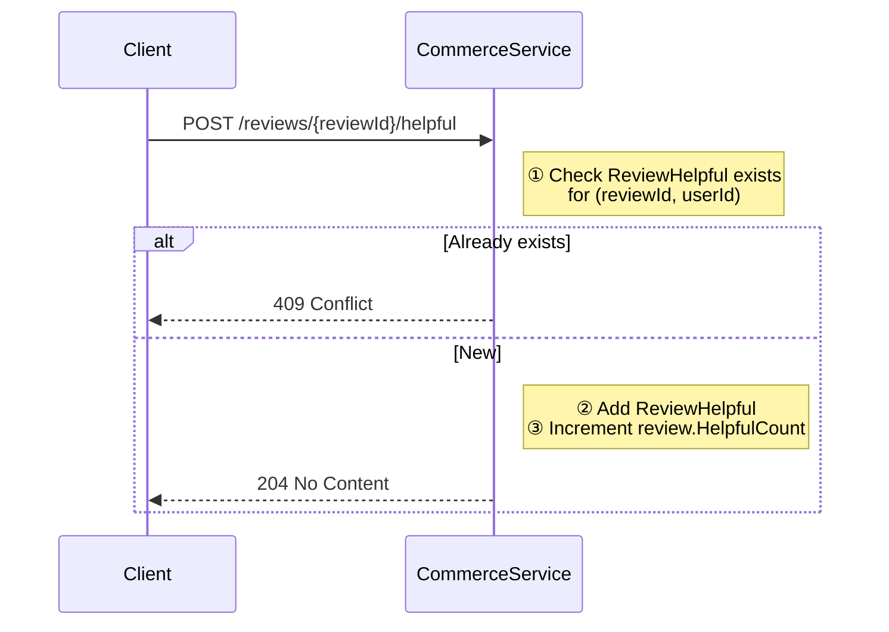
```mermaid
sequenceDiagram
    participant C as Client
    participant CS as CommerceService

    C->>CS: POST /reviews/{reviewId}/helpful
    Note right of CS: ① Check ReviewHelpful exists<br/>for (reviewId, userId)
    alt Already exists
        CS-->>C: 409 Conflict
    else New
        Note right of CS: ② Add ReviewHelpful<br/>③ Increment review.HelpfulCount
        CS-->>C: 204 No Content
    end
```

#### 1i. Category Tree

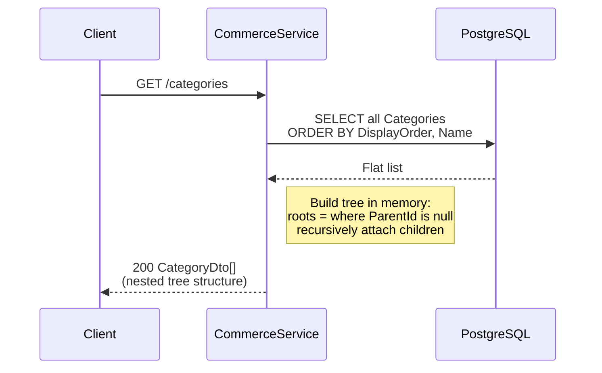
```mermaid
sequenceDiagram
    participant C as Client
    participant CS as CommerceService
    participant PG as PostgreSQL

    C->>CS: GET /categories

    CS->>PG: SELECT all Categories<br/>ORDER BY DisplayOrder, Name
    PG-->>CS: Flat list

    Note right of CS: Build tree in memory:<br/>roots = where ParentId is null<br/>recursively attach children

    CS-->>C: 200 CategoryDto[]<br/>(nested tree structure)
```

---

### 2. OrderService — Checkout & Order Dataflow

#### 2a. Address Management

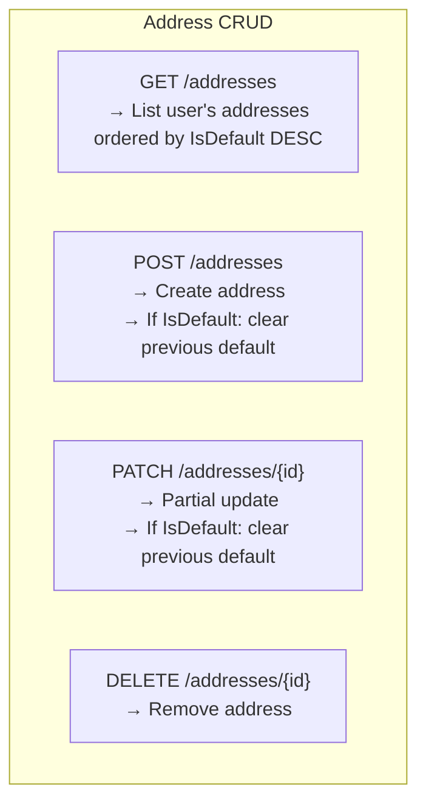
```mermaid
flowchart TD
    subgraph CRUD ["Address CRUD"]
        List["GET /addresses<br/>→ List user's addresses<br/>ordered by IsDefault DESC"]
        Create["POST /addresses<br/>→ Create address<br/>→ If IsDefault: clear previous default"]
        Update["PATCH /addresses/{id}<br/>→ Partial update<br/>→ If IsDefault: clear previous default"]
        Delete["DELETE /addresses/{id}<br/>→ Remove address"]
    end
```

#### 2b. Checkout Flow — State Machine

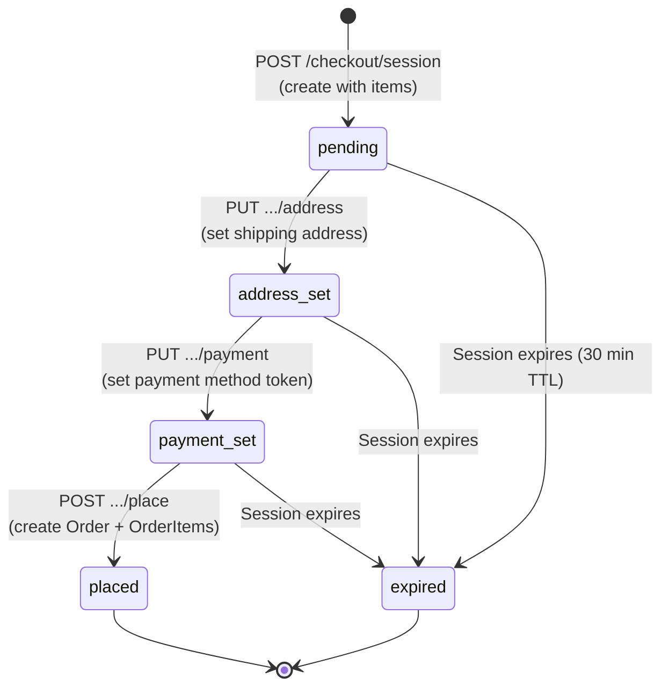
```mermaid
stateDiagram-v2
    [*] --> pending : POST /checkout/session<br/>(create with items)

    pending --> address_set : PUT .../address<br/>(set shipping address)

    address_set --> payment_set : PUT .../payment<br/>(set payment method token)

    payment_set --> placed : POST .../place<br/>(create Order + OrderItems)

    pending --> expired : Session expires (30 min TTL)
    address_set --> expired : Session expires
    payment_set --> expired : Session expires

    placed --> [*]
    expired --> [*]
```

#### 2c. Create Checkout Session

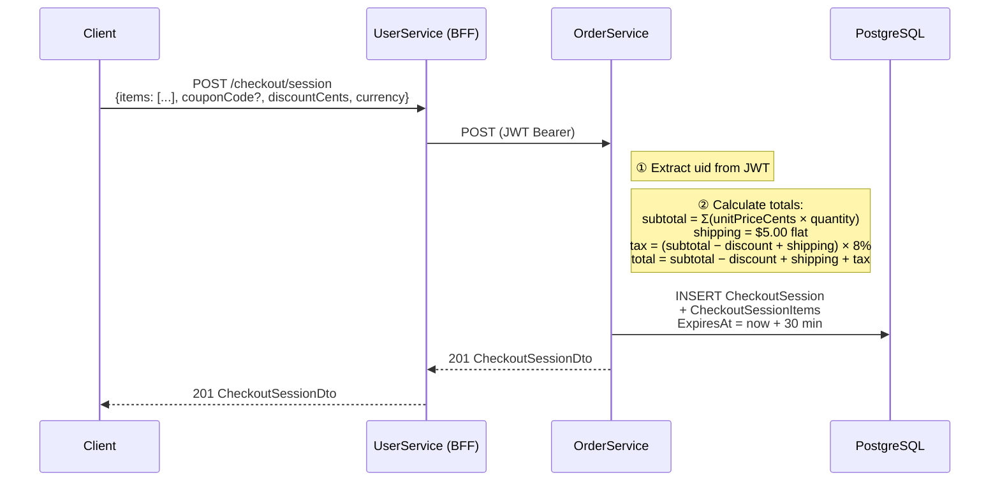
```mermaid
sequenceDiagram
    participant C as Client
    participant BFF as UserService (BFF)
    participant OS as OrderService
    participant PG as PostgreSQL

    C->>BFF: POST /checkout/session<br/>{items: [...], couponCode?, discountCents, currency}
    BFF->>OS: POST (JWT Bearer)

    Note right of OS: ① Extract uid from JWT
    Note right of OS: ② Calculate totals:<br/>subtotal = Σ(unitPriceCents × quantity)<br/>shipping = $5.00 flat<br/>tax = (subtotal − discount + shipping) × 8%<br/>total = subtotal − discount + shipping + tax

    OS->>PG: INSERT CheckoutSession<br/>+ CheckoutSessionItems<br/>ExpiresAt = now + 30 min

    OS-->>BFF: 201 CheckoutSessionDto
    BFF-->>C: 201 CheckoutSessionDto
```

#### 2d. Place Order

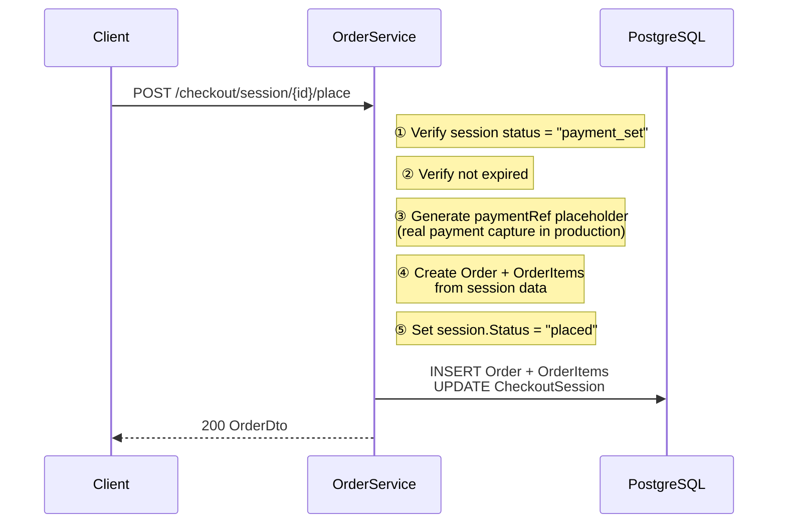
```mermaid
sequenceDiagram
    participant C as Client
    participant OS as OrderService
    participant PG as PostgreSQL

    C->>OS: POST /checkout/session/{id}/place

    Note right of OS: ① Verify session status = "payment_set"
    Note right of OS: ② Verify not expired
    Note right of OS: ③ Generate paymentRef placeholder<br/>(real payment capture in production)
    Note right of OS: ④ Create Order + OrderItems<br/>from session data
    Note right of OS: ⑤ Set session.Status = "placed"

    OS->>PG: INSERT Order + OrderItems<br/>UPDATE CheckoutSession
    OS-->>C: 200 OrderDto
```

#### 2e. Order Lifecycle

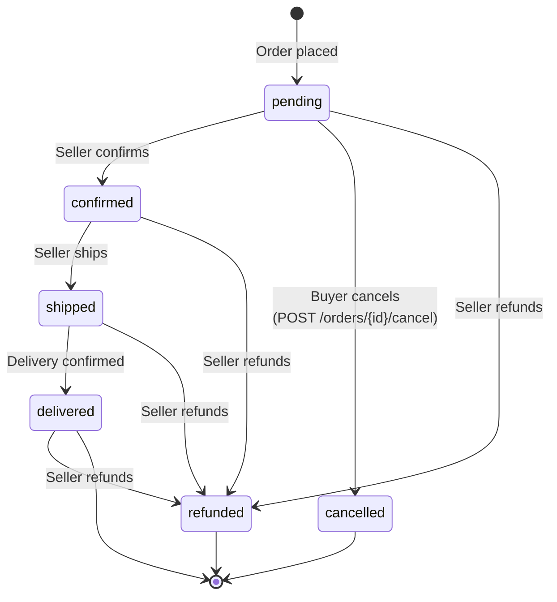
```mermaid
stateDiagram-v2
    [*] --> pending : Order placed

    pending --> confirmed : Seller confirms
    pending --> cancelled : Buyer cancels<br/>(POST /orders/{id}/cancel)

    confirmed --> shipped : Seller ships
    shipped --> delivered : Delivery confirmed

    pending --> refunded : Seller refunds
    confirmed --> refunded : Seller refunds
    shipped --> refunded : Seller refunds
    delivered --> refunded : Seller refunds

    cancelled --> [*]
    delivered --> [*]
    refunded --> [*]
```

#### 2f. Order Tracking

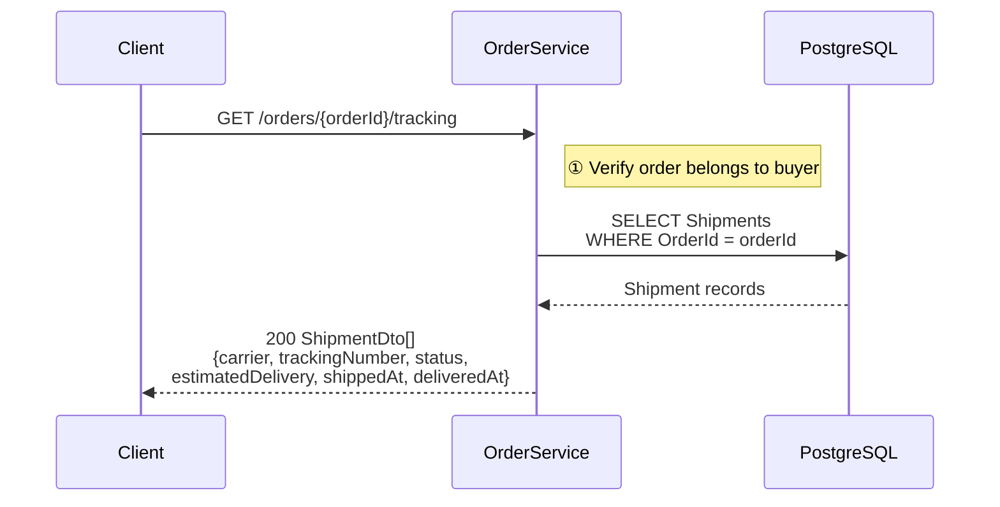
```mermaid
sequenceDiagram
    participant C as Client
    participant OS as OrderService
    participant PG as PostgreSQL

    C->>OS: GET /orders/{orderId}/tracking

    Note right of OS: ① Verify order belongs to buyer

    OS->>PG: SELECT Shipments<br/>WHERE OrderId = orderId
    PG-->>OS: Shipment records

    OS-->>C: 200 ShipmentDto[]<br/>{carrier, trackingNumber, status,<br/>estimatedDelivery, shippedAt, deliveredAt}
```

---

### 3. InventoryService — Seller & Stock Dataflow

#### 3a. Shop Lifecycle

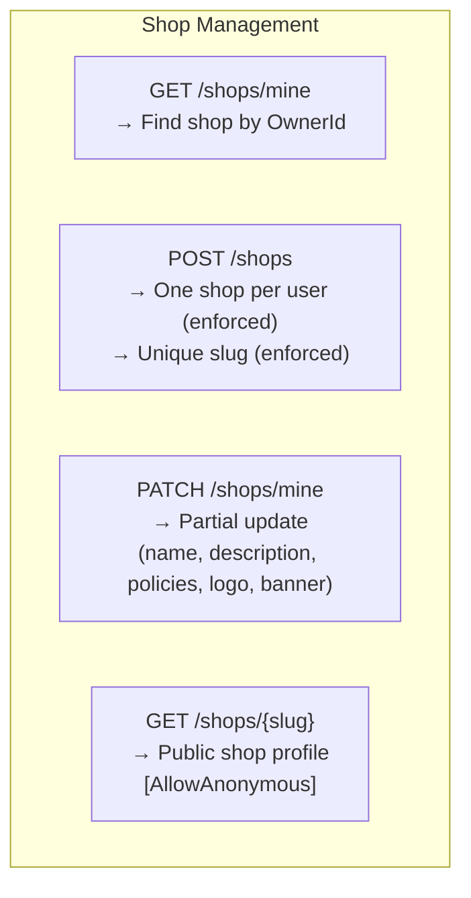
```mermaid
flowchart TD
    subgraph ShopCRUD ["Shop Management"]
        GetMine["GET /shops/mine<br/>→ Find shop by OwnerId"]
        Create["POST /shops<br/>→ One shop per user (enforced)<br/>→ Unique slug (enforced)"]
        Update["PATCH /shops/mine<br/>→ Partial update<br/>(name, description, policies, logo, banner)"]
        Public["GET /shops/{slug}<br/>→ Public shop profile<br/>[AllowAnonymous]"]
    end
```

#### 3b. Inventory Product Management

```mermaid
sequenceDiagram
    participant Seller
    participant IS as InventoryService
    participant PG as PostgreSQL

    Seller->>IS: POST /inventory/products<br/>{title, description, categorySlug, tags}

    Note right of IS: ① Verify seller has a shop
    Note right of IS: ② Create SellerProduct (status: "draft")
    Note right of IS: ③ Increment shop.ProductCount

    IS->>PG: INSERT SellerProduct<br/>UPDATE Shop.ProductCount
    IS-->>Seller: 201 SellerProductDto
```

#### 3c. Variant & Stock Management

```mermaid
sequenceDiagram
    participant Seller
    participant IS as InventoryService
    participant PG as PostgreSQL

    Seller->>IS: POST /inventory/products/{id}/variants<br/>{label, sku, priceCents, currency, stock, lowStockThreshold}

    Note right of IS: ① Verify product belongs to seller's shop
    Note right of IS: ② Check SKU uniqueness → 409 if duplicate
    Note right of IS: ③ Create SellerVariant
    Note right of IS: ④ Auto-create InventorySnapshot<br/>(stock, lowStockThreshold, lastRestockedAt)
    Note right of IS: ⑤ Update product availability:<br/>any variant stock > 0 → "in_stock"<br/>all stock ≤ threshold → "low_stock"<br/>all stock = 0 → "out_of_stock"

    IS->>PG: INSERT SellerVariant + InventorySnapshot<br/>UPDATE SellerProduct.Availability
    IS-->>Seller: 201 SellerVariantDto
```

#### 3d. Product Availability Auto-Update

```mermaid
flowchart TD
    Trigger["Stock change<br/>(create/update/delete variant)"]
    Trigger --> QueryVariants["Query all variants for product"]
    QueryVariants --> Check{"Any variant<br/>stock > 0?"}
    Check -- No --> OutOfStock["Availability = 'out_of_stock'"]
    Check -- Yes --> LowCheck{"Any variant stock<br/>≤ lowStockThreshold?"}
    LowCheck -- "All low" --> LowStock["Availability = 'low_stock'"]
    LowCheck -- "Some healthy" --> InStock["Availability = 'in_stock'"]
```

#### 3e. Product Status Transitions

```mermaid
stateDiagram-v2
    [*] --> draft : POST /inventory/products

    draft --> active : PATCH .../status {status: "active"}
    draft --> archived : PATCH .../status {status: "archived"}

    active --> draft : PATCH .../status {status: "draft"}
    active --> archived : PATCH .../status {status: "archived"}

    archived --> draft : PATCH .../status {status: "draft"}
    archived --> active : PATCH .../status {status: "active"}
```

#### 3f. Seller Order Sync (Internal)

```mermaid
sequenceDiagram
    participant OS as OrderService
    participant IS as InventoryService
    participant PG as PostgreSQL

    OS->>IS: POST /internal/seller-orders/sync<br/>{orderId, sellerId, buyerName,<br/>totalCents, placedAt, items: [...]}

    Note right of IS: ① Check duplicate (orderId) → 409
    Note right of IS: ② Create SellerOrder + SellerOrderItems
    Note right of IS: ③ Decrement stock for each variant:<br/>variant.Stock = max(0, stock − quantity)<br/>Update InventorySnapshot

    IS->>PG: INSERT SellerOrder + Items<br/>UPDATE Variants + Snapshots
    IS-->>OS: 200 OK
```

#### 3g. Seller Order Fulfillment

```mermaid
flowchart TD
    subgraph SellerActions ["Seller Order Actions"]
        List["GET /seller/orders<br/>→ Paginated list, filter by status"]
        Detail["GET /seller/orders/{id}<br/>→ Order detail with items"]
        Status["PATCH /seller/orders/{id}/status<br/>→ confirmed | shipped | delivered"]
        Refund["POST /seller/orders/{id}/refund<br/>→ Set status = 'refunded'<br/>→ Restore stock for each item"]
    end
```

#### 3h. Stock Restoration on Refund

```mermaid
sequenceDiagram
    participant Seller
    participant IS as InventoryService
    participant PG as PostgreSQL

    Seller->>IS: POST /seller/orders/{orderId}/refund

    Note right of IS: ① Verify order not already refunded/cancelled
    Note right of IS: ② Set order.Status = "refunded"
    Note right of IS: ③ For each order item:<br/>variant.Stock += item.Quantity<br/>snapshot.Stock = variant.Stock<br/>snapshot.LastRestockedAt = now

    IS->>PG: UPDATE SellerOrder<br/>UPDATE Variants + Snapshots
    IS-->>Seller: 200 SellerOrderDto
```

---

### 4. NotificationService — Cross-Domain Notification Dataflow

#### 4a. Event Subscription Architecture

```mermaid
graph TB
    subgraph AllServices ["All Domain Services (Producers)"]
        Comm["CommunicationService"]
        Social["SocialContentService<br/>SocialGraphService"]
        Stream["StreamingService"]
        Commerce2["OrderService / Commerce"]
    end

    subgraph Redis ["Redis 7 Pub/Sub"]
        Channels["evt:message:new<br/>evt:call:incoming<br/>evt:friend:request<br/>evt:post:reply<br/>evt:post:mention<br/>evt:group:invite<br/>evt:theater:invite<br/>evt:theater:live<br/>evt:order:placed<br/>evt:order:update"]
    end

    subgraph NotifSvc ["NotificationService :5017"]
        ES["EventSubscriber (BackgroundService)<br/>subscribes to ALL channels"]
        DB["Persist Notification to PostgreSQL"]
        RTP["RealTimePublisher → RealTimeHub"]
        Badge["Push unread badge count"]
    end

    AllServices --> Channels
    Channels --> ES
    ES --> DB
    ES --> RTP
    ES --> Badge
```

#### 4b. Notification Processing Pipeline

```mermaid
sequenceDiagram
    participant Redis as Redis Pub/Sub
    participant ES as EventSubscriber
    participant PG as PostgreSQL
    participant RTP as RealTimePublisher
    participant RTHub as RealTimeHub :5007
    participant User as User (SignalR)

    Redis->>ES: Event on channel (e.g., "evt:message:new")

    Note right of ES: ① Deserialize DomainEvent envelope
    Note right of ES: ② Extract NotificationPayload from Data
    Note right of ES: ③ Lookup channel in ChannelMap<br/>→ determine domain + title

    ES->>PG: INSERT Notification<br/>{userId, type, domain, title,<br/>body, actionUrl, isRead: false}

    ES->>RTP: PublishAsync("user:{userId}",<br/>"notification:new", notificationDto)
    RTP->>RTHub: POST /internal/hub/publish<br/>X-Internal-Api-Key
    RTHub-->>User: SignalR push<br/>"notification:new"

    ES->>PG: COUNT unread notifications
    ES->>RTP: PublishAsync("user:{userId}",<br/>"notification:badge", { unreadCount })
    RTP->>RTHub: POST /internal/hub/publish
    RTHub-->>User: SignalR push<br/>"notification:badge"
```

#### 4c. Channel-to-Notification Mapping

| Redis Channel | Domain | Default Title |
|---|---|---|
| `evt:message:new` | communication | "New message" |
| `evt:call:incoming` | communication | "Incoming call" |
| `evt:friend:request` | social | "New friend request" |
| `evt:post:reply` | social | "Someone replied to your post" |
| `evt:post:mention` | social | "You were mentioned in a post" |
| `evt:group:invite` | social | "Group invitation" |
| `evt:theater:invite` | streaming | "Theater invitation" |
| `evt:theater:live` | streaming | "A user you follow went live" |
| `evt:order:update` | commerce | "Order status updated" |
| `evt:order:placed` | commerce | "New order placed" |

#### 4d. Notification Read Operations

```mermaid
flowchart TD
    subgraph ReadOps ["Notification Read API"]
        List["GET /notifications?cursor=xxx&limit=20<br/>→ Cursor-paginated, newest first"]
        Unread["GET /notifications/unread-count<br/>→ COUNT WHERE isRead = false"]
        MarkOne["POST /notifications/{id}/read<br/>→ Set isRead = true"]
        MarkAll["POST /notifications/read-all<br/>→ ExecuteUpdateAsync: batch set isRead = true"]
    end
```

---

### 5. AnalyticsService — Seller Analytics Dataflow

#### 5a. Order Event Ingestion

```mermaid
sequenceDiagram
    participant Redis as Redis Pub/Sub
    participant AES as OrderEventSubscriber
    participant PG as PostgreSQL

    Redis->>AES: "evt:order:placed" event

    Note right of AES: ① Deserialize OrderPlacedEvent<br/>{orderId, shopId, totalCents,<br/>placedAt, items[]}

    Note right of AES: ② Upsert SalesSummary<br/>(shopId, date):<br/>revenue += totalCents<br/>orderCount++<br/>unitsSold += Σ(item.Quantity)

    Note right of AES: ③ For each item → upsert<br/>ProductSalesSummary<br/>(shopId, productId, date):<br/>unitsSold += quantity<br/>revenue += unitPriceCents × quantity

    AES->>PG: UPSERT SalesSummary<br/>+ ProductSalesSummary
```

**Dual ingestion paths:** AnalyticsService accepts order events via
both Redis Pub/Sub (`OrderEventSubscriber`) and an internal HTTP
endpoint (`POST /internal/analytics/order-placed`) for flexibility.

#### 5b. Analytics Query Endpoints

```mermaid
flowchart TD
    subgraph Overview ["GET /analytics/overview"]
        OV1["Filter by shopId + date range"]
        OV2["Aggregate: totalRevenue, totalOrders,<br/>totalUnitsSold, avgOrderValue"]
    end

    subgraph Revenue ["GET /analytics/revenue"]
        RV1["Filter by shopId + date range"]
        RV2["Group by granularity:<br/>daily | weekly | monthly"]
        RV3["Return RevenuePointDto[]<br/>{period, revenue}"]
        RV1 --> RV2 --> RV3
    end

    subgraph TopProducts ["GET /analytics/top-products"]
        TP1["Filter by shopId + date range"]
        TP2["Group by productId"]
        TP3["Sort by revenue | units"]
        TP4["Return top N"]
        TP1 --> TP2 --> TP3 --> TP4
    end

    subgraph Orders ["GET /analytics/orders"]
        OD1["Filter by shopId + date range"]
        OD2["Group by granularity"]
        OD3["Return OrderVolumePointDto[]<br/>{period, orderCount}"]
        OD1 --> OD2 --> OD3
    end

    subgraph Export ["GET /analytics/export"]
        EX1["Filter by shopId + date range"]
        EX2["Generate CSV: Date, Revenue,<br/>OrderCount, UnitsSold"]
        EX3["Return text/csv file"]
        EX1 --> EX2 --> EX3
    end
```

#### 5c. Granularity Aggregation

```mermaid
flowchart LR
    Raw["Daily SalesSummary rows"] --> Gran{"granularity?"}
    Gran -- daily --> Daily["One point per day"]
    Gran -- weekly --> Weekly["Group by ISO week<br/>→ one point per week"]
    Gran -- monthly --> Monthly["Group by year-month<br/>→ one point per month"]
```

---

### 6. SearchService — Unified Full-Text Search Dataflow

#### 6a. Search Index Architecture

```mermaid
graph TB
    subgraph DomainServices ["Domain Services (Index Producers)"]
        UserSvc["UserService → user entities"]
        SocialSvc["SocialContentService → posts, groups"]
        StreamSvc["StreamingService → theaters"]
        CommerceSvc["CommerceService → products"]
    end

    subgraph SearchSvc ["SearchService :5018"]
        Internal["InternalSearchController<br/>POST /internal/search/upsert<br/>POST /internal/search/delete"]
        Index[("search_db<br/>SearchEntries table<br/>tsvector index")]
        Public["SearchController<br/>GET /search?q=&type="]
    end

    DomainServices -- "HTTP POST<br/>/internal/search/upsert" --> Internal
    Internal --> Index
    Public --> Index

    Client["Browser"] -- "search query" --> Public
```

#### 6b. Index Upsert Flow

```mermaid
sequenceDiagram
    participant DS as Domain Service
    participant SS as SearchService
    participant PG as PostgreSQL

    DS->>SS: POST /internal/search/upsert<br/>{entityType: "product",<br/>entityId: "...",<br/>title: "Wireless Headphones",<br/>body: "Bluetooth 5.0 noise cancelling...",<br/>domainData: "{price: 4999}"}

    Note right of SS: ① Check existing entry by<br/>(EntityType, EntityId)
    alt Exists
        SS->>PG: UPDATE Title, Body,<br/>DomainData, UpdatedAt
    else New
        SS->>PG: INSERT SearchEntry
    end

    Note right of SS: ② PostgreSQL trigger auto-updates<br/>SearchVector tsvector column<br/>from Title + Body

    SS-->>DS: 200 OK
```

#### 6c. Search Query Flow

```mermaid
sequenceDiagram
    participant C as Client
    participant SS as SearchService
    participant PG as PostgreSQL

    C->>SS: GET /search?q=wireless+headphones<br/>&type=product&limit=20

    Note right of SS: ① Parse query → tsquery:<br/>"wireless & headphones"
    Note right of SS: ② Filter by EntityType (optional)
    Note right of SS: ③ Match against SearchVector<br/>(PostgreSQL full-text search)
    Note right of SS: ④ Order by UpdatedAt DESC
    Note right of SS: ⑤ Cursor-based pagination

    SS->>PG: SELECT ... FROM SearchEntries<br/>WHERE SearchVector @@ to_tsquery(...)
    PG-->>SS: Matching entries

    SS-->>C: 200 PagedResult&lt;SearchResultDto&gt;<br/>{entityType, entityId, title,<br/>body, domainData, updatedAt}
```

#### 6d. Type-Specific Search Shortcuts

```mermaid
graph LR
    subgraph Endpoints
        All["GET /search → all types"]
        Users["GET /search/users → type=user"]
        Posts["GET /search/posts → type=post"]
        Groups["GET /search/groups → type=group"]
        Theaters["GET /search/theaters → type=theater"]
        Products["GET /search/products → type=product"]
    end

    All --> Core["Shared ExecuteSearch logic<br/>PostgreSQL tsvector matching<br/>cursor pagination"]
    Users --> Core
    Posts --> Core
    Groups --> Core
    Theaters --> Core
    Products --> Core
```

---

### 7. AdService — Advertising Campaign Dataflow

#### 7a. Campaign Lifecycle

```mermaid
stateDiagram-v2
    [*] --> draft : POST /ads/campaigns<br/>(create with budget, dates, products)

    draft --> active : POST .../resume<br/>(or initial activation)
    active --> paused : POST .../pause
    paused --> active : POST .../resume

    active --> ended : Budget exhausted<br/>(auto-pause on click)

    draft --> [*] : DELETE
    paused --> [*] : DELETE
    ended --> [*] : DELETE
```

#### 7b. Create Campaign

```mermaid
sequenceDiagram
    participant Seller
    participant AS as AdService
    participant PG as PostgreSQL

    Seller->>AS: POST /ads/campaigns?shopId=xxx<br/>{name, budgetCents, startDate,<br/>endDate, productIds}

    Note right of AS: ① Create AdCampaign (status: "draft")
    Note right of AS: ② Create CampaignProduct associations
    Note right of AS: ③ Auto-create CampaignMetrics<br/>(impressions: 0, clicks: 0, conversions: 0)

    AS->>PG: INSERT AdCampaign<br/>+ CampaignProducts<br/>+ CampaignMetrics
    AS-->>Seller: 201 CampaignDto
```

#### 7c. Impression & Click Tracking

```mermaid
sequenceDiagram
    participant Feed as FeedService / Client
    participant AS as AdService
    participant PG as PostgreSQL

    Feed->>AS: POST /internal/ads/record-impression<br/>{campaignId}
    Note right of AS: ① metrics.Impressions++
    AS->>PG: UPDATE CampaignMetrics
    AS-->>Feed: 200 OK

    Feed->>AS: POST /internal/ads/record-click<br/>{campaignId}
    Note right of AS: ① metrics.Clicks++
    Note right of AS: ② Calculate CPC:<br/>cpc = budget / max(1, impressions / 10)
    Note right of AS: ③ campaign.SpentCents += cpc<br/>(capped at budget)
    Note right of AS: ④ If spent ≥ budget:<br/>auto-set status = "ended"
    AS->>PG: UPDATE CampaignMetrics<br/>+ AdCampaign
    AS-->>Feed: 200 OK
```

#### 7d. Budget Exhaustion Flow

```mermaid
flowchart TD
    Click["Record Click"] --> CalcCPC["CPC = budget / max(1, impressions / 10)"]
    CalcCPC --> AddSpent["spent += CPC<br/>(capped at budget)"]
    AddSpent --> Check{"spent ≥ budget<br/>AND status == 'active'?"}
    Check -- Yes --> End["Set status = 'ended'<br/>(auto-pause)"]
    Check -- No --> Done["Continue serving ads"]
```

#### 7e. Campaign Metrics

```mermaid
sequenceDiagram
    participant Seller
    participant AS as AdService
    participant PG as PostgreSQL

    Seller->>AS: GET /ads/campaigns/{id}/metrics

    AS->>PG: SELECT CampaignMetrics
    PG-->>AS: Metrics row

    Note right of AS: Compute derived metrics:<br/>CTR = clicks / impressions × 100<br/>ConvRate = conversions / clicks × 100

    AS-->>Seller: 200 CampaignMetricsDto<br/>{impressions, clicks, conversions,<br/>clickThroughRate, conversionRate}
```

---

## Data Storage Layout

### PostgreSQL — Per-Service Database Isolation

```mermaid
graph LR
    PG[("PostgreSQL 16<br/>container: pg, port 5432")]

    subgraph commerce_db
        Categories["Categories"]
        Products["Products"]
        ProductImages["ProductImages"]
        ProductVariants["ProductVariants"]
        Carts["Carts"]
        CartItems["CartItems"]
        Coupons["Coupons"]
        Reviews["Reviews"]
        ReviewImages["ReviewImages"]
        ReviewHelpfuls["ReviewHelpfuls"]
    end

    subgraph order_db
        Addresses["Addresses"]
        CheckoutSessions["CheckoutSessions"]
        CheckoutSessionItems["CheckoutSessionItems"]
        Orders["Orders"]
        OrderItems["OrderItems"]
        Shipments["Shipments"]
    end

    subgraph inventory_db
        Shops["Shops"]
        SellerProducts["SellerProducts"]
        SellerVariants["SellerVariants"]
        SellerProductImages["SellerProductImages"]
        InventorySnapshots["InventorySnapshots"]
        SellerOrders["SellerOrders"]
        SellerOrderItems["SellerOrderItems"]
    end

    subgraph notification_db
        Notifications["Notifications"]
    end

    subgraph analytics_db
        SalesSummaries["SalesSummaries"]
        ProductSalesSummaries["ProductSalesSummaries"]
    end

    subgraph search_db
        SearchEntries["SearchEntries<br/>(tsvector indexed)"]
    end

    subgraph ad_db
        AdCampaigns["AdCampaigns"]
        CampaignProducts["CampaignProducts"]
        CampaignMetrics["CampaignMetrics"]
    end

    PG --- commerce_db
    PG --- order_db
    PG --- inventory_db
    PG --- notification_db
    PG --- analytics_db
    PG --- search_db
    PG --- ad_db
```

### Entity Relationship Diagrams

#### Commerce Domain

```mermaid
erDiagram
    Category ||--o{ Category : "parent/children"
    Category ||--o{ Product : "has many"
    Product ||--o{ ProductImage : "has many"
    Product ||--o{ ProductVariant : "has many"
    Product ||--o{ Review : "has many"
    Review ||--o{ ReviewImage : "has many"
    Review ||--o{ ReviewHelpful : "has many"
    Cart ||--o{ CartItem : "has many"
    CartItem }o--|| Product : "references"
    CartItem }o--|| ProductVariant : "references"
    Cart }o--o| Coupon : "applies"

    Category {
        uuid Id PK
        string Name
        string Slug
        uuid ParentId FK
        int DisplayOrder
    }

    Product {
        uuid Id PK
        uuid VendorId
        string Title
        string Description
        uuid CategoryId FK
        decimal AverageRating
        int ReviewCount
        string Availability
        string Status
        string[] Tags
        timestamptz CreatedAt
        timestamptz UpdatedAt
    }

    ProductVariant {
        uuid Id PK
        uuid ProductId FK
        string Label
        string Sku
        long PriceCents
        string Currency
        int Stock
        jsonb Attributes
    }

    Cart {
        uuid Id PK
        uuid UserId
        string CouponCode FK
        timestamptz CreatedAt
        timestamptz UpdatedAt
    }

    Coupon {
        string Code PK
        string DiscountType
        decimal DiscountValue
        long MinOrderCents
        timestamptz ExpiresAt
        int MaxUses
        int UsedCount
        bool IsActive
    }

    Review {
        uuid Id PK
        uuid ProductId FK
        uuid AuthorId
        uuid OrderItemId
        short Rating
        string Title
        string Body
        int HelpfulCount
        timestamptz CreatedAt
    }
```

#### Order Domain

```mermaid
erDiagram
    CheckoutSession ||--o{ CheckoutSessionItem : "has many"
    CheckoutSession }o--o| Address : "shipping"
    Order ||--o{ OrderItem : "has many"
    Order ||--o{ Shipment : "has many"
    Order }o--|| Address : "shipping"

    CheckoutSession {
        uuid Id PK
        uuid UserId
        uuid ShippingAddressId FK
        string PaymentMethodToken
        string Status
        long SubtotalCents
        long DiscountCents
        long ShippingCents
        long TaxCents
        long TotalCents
        string Currency
        timestamptz ExpiresAt
    }

    Order {
        uuid Id PK
        uuid BuyerId
        string Status
        uuid ShippingAddressId FK
        string PaymentRef
        long SubtotalCents
        long ShippingCents
        long TaxCents
        long TotalCents
        string Currency
        timestamptz PlacedAt
    }

    Shipment {
        uuid Id PK
        uuid OrderId FK
        string Carrier
        string TrackingNumber
        string Status
        date EstimatedDelivery
        timestamptz ShippedAt
        timestamptz DeliveredAt
    }
```

#### Inventory Domain

```mermaid
erDiagram
    Shop ||--o{ SellerProduct : "has many"
    SellerProduct ||--o{ SellerVariant : "has many"
    SellerProduct ||--o{ SellerProductImage : "has many"
    SellerVariant ||--|| InventorySnapshot : "has one"
    SellerOrder ||--o{ SellerOrderItem : "has many"

    Shop {
        uuid Id PK
        uuid OwnerId
        string Name
        string Slug UK
        string Description
        string ReturnPolicy
        string ShippingPolicy
        decimal AverageRating
        int ProductCount
    }

    SellerProduct {
        uuid Id PK
        uuid ShopId FK
        string Title
        string Description
        string CategorySlug
        string Status
        string Availability
        string[] Tags
    }

    SellerVariant {
        uuid Id PK
        uuid ProductId FK
        string Label
        string Sku UK
        long PriceCents
        string Currency
        int Stock
        jsonb Attributes
    }

    InventorySnapshot {
        uuid VariantId PK_FK
        int Stock
        int LowStockThreshold
        timestamptz LastRestockedAt
        timestamptz UpdatedAt
    }

    SellerOrder {
        uuid OrderId PK
        uuid SellerId
        string Status
        string BuyerName
        long TotalCents
        timestamptz PlacedAt
    }
```

#### Search Domain

```mermaid
erDiagram
    SearchEntry {
        uuid Id PK
        string EntityType
        uuid EntityId
        string Title
        string Body
        tsvector SearchVector
        jsonb DomainData
        timestamptz UpdatedAt
    }
```

### Redis — Event Bus & SignalR Backplane

```mermaid
graph LR
    REDIS[("Redis 7<br/>container: redis, port 6379")]

    subgraph EventBus ["Event Bus (Pub/Sub)"]
        EVT["evt:message:new<br/>evt:call:incoming<br/>evt:friend:request<br/>evt:post:reply · evt:post:mention<br/>evt:group:invite<br/>evt:theater:invite · evt:theater:live<br/>evt:order:placed · evt:order:update"]
    end

    subgraph Subscribers ["Subscribers"]
        NS["NotificationService<br/>EventSubscriber"]
        AS["AnalyticsService<br/>OrderEventSubscriber"]
    end

    subgraph SignalRBP ["SignalR Backplane (RealTimeHub)"]
        SR["sc-rt:*<br/>PUB/SUB channels"]
    end

    REDIS --- EventBus
    EventBus --> NS
    EventBus --> AS
    REDIS --- SignalRBP
```

---

## Cross-Service Communication Map

```mermaid
graph TB
    subgraph Redis ["Redis 7 (Pub/Sub)"]
        Channels["evt:* channels"]
    end

    subgraph Phase4 ["Phase 4 Services"]
        CS["CommerceService :5012"]
        OS["OrderService :5013"]
        IS["InventoryService :5014"]
        NS["NotificationService :5017"]
        AS["AnalyticsService :5015"]
        SS["SearchService :5018"]
        ADS["AdService :5016"]
    end

    subgraph Phase0_1 ["Phase 0/1 Infrastructure"]
        BFF["UserService (BFF) :5001"]
        RTHub["RealTimeHub :5007"]
        Media["MediaService :5006"]
    end

    Channels -->|"evt:order:placed"| AS
    Channels -->|"all evt:* channels"| NS

    NS -- "POST /internal/hub/publish" --> RTHub

    OS -- "POST /internal/seller-orders/sync" --> IS
    OS -. "POST /internal/analytics/order-placed" .-> AS

    BFF -- "JWT Bearer" --> CS
    BFF -- "JWT Bearer" --> OS
    BFF -- "JWT Bearer" --> IS
    BFF -- "JWT Bearer" --> NS
    BFF -- "JWT Bearer" --> AS
    BFF -- "JWT Bearer" --> SS
    BFF -- "JWT Bearer" --> ADS

    Media -. "MediaId reference" .-> CS

    CS --> PG[("PostgreSQL 16<br/>commerce_db · order_db<br/>inventory_db · notification_db<br/>analytics_db · search_db · ad_db")]
    OS --> PG
    IS --> PG
    NS --> PG
    AS --> PG
    SS --> PG
    ADS --> PG
```

### Cross-Service HTTP Dependencies

| Caller | Callee | Endpoint | Purpose |
|---|---|---|---|
| OrderService | InventoryService | `POST /internal/seller-orders/sync` | Sync placed order to seller's dashboard and decrement stock |
| Domain Services | SearchService | `POST /internal/search/upsert` | Maintain unified search index |
| Domain Services | SearchService | `POST /internal/search/delete` | Remove from search index |
| OrderService / Commerce | AnalyticsService | `POST /internal/analytics/order-placed` | HTTP fallback for order event ingestion |
| FeedService / Client | AdService | `POST /internal/ads/record-impression` | Track ad impression |
| FeedService / Client | AdService | `POST /internal/ads/record-click` | Track ad click and update spend |

### Redis Pub/Sub Dependencies

| Subscriber | Channel | Purpose |
|---|---|---|
| NotificationService | All `evt:*` channels (10 total) | Persist notifications and push real-time |
| AnalyticsService | `evt:order:placed` | Aggregate seller sales data |

---

## Pagination Strategy

All Phase 4 list endpoints use **cursor-based pagination** consistent
with earlier phases:

```mermaid
flowchart LR
    Req["GET /api/{resource}?cursor=xxx&limit=20"] --> Decode["Decode cursor<br/>Base64 → unix ticks"]
    Decode --> Query["WHERE CreatedAt < decoded_cursor<br/>ORDER BY CreatedAt DESC<br/>LIMIT limit+1"]
    Query --> Check{"> limit rows?"}
    Check -- Yes --> More["hasMore = true<br/>Trim to limit rows<br/>nextCursor = Base64(last.CreatedAt.UtcTicks)"]
    Check -- No --> NoMore["hasMore = false<br/>nextCursor = null"]
    More --> Resp["Response: PagedResult&lt;T&gt;<br/>{items, nextCursor, hasMore}"]
    NoMore --> Resp

    style Req fill:#e1f5fe
    style Resp fill:#e8f5e9
```

**Shared `PagedResult<T>` record** used across all Phase 4 services:
```
record PagedResult<T>(IEnumerable<T> Items, string? NextCursor, bool HasMore)
```

---

## Docker Compose — Phase 4 Container Topology

```mermaid
graph TB
    subgraph DockerNetwork ["docker-compose network"]
        subgraph Infra ["Infrastructure"]
            PG[("postgres :5432<br/>commerce_db · order_db · inventory_db<br/>notification_db · analytics_db<br/>search_db · ad_db")]
            RD[("redis :6379")]
        end

        subgraph Phase4 ["Phase 4 Services"]
            CS["commerceservice :5012<br/>depends_on: postgres"]
            OS["orderservice :5013<br/>depends_on: postgres"]
            IS["inventoryservice :5014<br/>depends_on: postgres"]
            NS["notificationservice :5017<br/>depends_on: postgres, redis,<br/>realtimehub<br/>EventSubscriber (hosted)"]
            AS["analyticsservice :5015<br/>depends_on: postgres, redis<br/>OrderEventSubscriber (hosted)"]
            SS["searchservice :5018<br/>depends_on: postgres"]
            ADS["adservice :5016<br/>depends_on: postgres"]
        end

        subgraph Phase0_1 ["Phase 0 / Phase 1"]
            US["userservice :5001<br/>(BFF)"]
            Media["mediaservice :5006"]
            RT["realtimehub :5007"]
        end

        PG --- CS
        PG --- OS
        PG --- IS
        PG --- NS
        PG --- AS
        PG --- SS
        PG --- ADS
        RD --- NS
        RD --- AS
        RD --- RT
        NS -->|"HTTP (push notifications)"| RT
        OS -->|"HTTP (sync seller orders)"| IS
    end
```

---

## Error Handling

All Phase 4 services follow the **RFC 7807 Problem Details** standard
via `builder.Services.AddProblemDetails()` and
`app.UseExceptionHandler()`.

| Scenario | HTTP Status | Service | Handling |
|---|---|---|---|
| JWT missing or invalid | `401 Unauthorized` | All | ASP.NET Core auth middleware rejects |
| Product / order / shop not found | `404 Not Found` | All | Controller returns `NotFound()` |
| Duplicate review (one per user per product) | `409 Conflict` | CommerceService | `Conflict()` |
| Duplicate helpful vote | `409 Conflict` | CommerceService | `Conflict()` |
| Insufficient stock for cart add | `409 Conflict` | CommerceService | Stock < requested quantity |
| Invalid or expired coupon | `400 Bad Request` | CommerceService | Validation in controller |
| Coupon max uses reached | `400 Bad Request` | CommerceService | `UsedCount >= MaxUses` |
| Checkout session expired (30 min) | `409 Conflict` | OrderService | Auto-set status = "expired" |
| Place order without address/payment | `409 Conflict` | OrderService | Status must be "payment_set" |
| Cancel non-pending order | `409 Conflict` | OrderService | Only pending orders cancellable |
| Seller already has a shop | `409 Conflict` | InventoryService | One shop per user enforced |
| Duplicate shop slug | `409 Conflict` | InventoryService | Unique slug enforced |
| Duplicate SKU | `409 Conflict` | InventoryService | Unique SKU across all variants |
| Refund already refunded/cancelled order | `400 Bad Request` | InventoryService | Status check |
| Seller order already synced | `409 Conflict` | InventoryService | Duplicate orderId on sync |
| Invalid product status value | `400 Bad Request` | InventoryService | Must be draft/active/archived |
| Invalid order status value | `400 Bad Request` | InventoryService | Must be confirmed/shipped/delivered |
| Only active campaigns can be paused | `400 Bad Request` | AdService | Status guard |
| Search query empty | `400 Bad Request` | SearchService | `q` parameter required |
| Notification not found | `404 Not Found` | NotificationService | `NotFound()` |
| Rating out of range (1–5) | `400 Bad Request` | CommerceService | Validation |
| Non-owner attempts shop update | `404 Not Found` | InventoryService | Shop lookup by OwnerId returns null |
| RealTimeHub unreachable | Silent failure | NotificationService | Best-effort push (exception swallowed) |
| Redis unavailable | Service degradation | NotificationService, AnalyticsService | BackgroundService logs errors; REST endpoints unaffected |

---

## Complete Event Catalog — Phase 4

| Source Service | Event Channel | Trigger | Consumer(s) |
|---|---|---|---|
| CommunicationService | `evt:message:new` | New message received | NotificationService |
| SignalingService | `evt:call:incoming` | Incoming call | NotificationService |
| SocialGraphService | `evt:friend:request` | Friend request sent | NotificationService |
| SocialContentService | `evt:post:reply` | Reply to a post | NotificationService |
| SocialContentService | `evt:post:mention` | User mentioned in post | NotificationService |
| SocialContentService | `evt:group:invite` | Group invitation | NotificationService |
| StreamingService | `evt:theater:invite` | Theater invitation | NotificationService |
| StreamingService | `evt:theater:live` | Followed user goes live | NotificationService |
| OrderService | `evt:order:placed` | New order placed | NotificationService, AnalyticsService |
| OrderService | `evt:order:update` | Order status changed | NotificationService |

---

## API Endpoint Summary

### CommerceService (:5012)

| Endpoint | Method | Auth | Description |
|---|---|---|---|
| `/products` | `GET` | ✅ | Browse product catalog (filterable, sortable, paginated) |
| `/products/{id}` | `GET` | ✅ | Product detail with images and variants |
| `/products/search` | `GET` | ✅ | Full-text search products (ILIKE) |
| `/products/related/{id}` | `GET` | ✅ | Related products by category |
| `/products/{id}/reviews` | `GET` | ✅ | Product reviews (sortable, paginated) |
| `/products/{id}/reviews` | `POST` | ✅ | Create review (one per user) |
| `/reviews/{id}/helpful` | `POST` | ✅ | Mark review as helpful |
| `/reviews/{id}/helpful` | `DELETE` | ✅ | Remove helpful mark |
| `/categories` | `GET` | ✅ | Full category tree |
| `/cart` | `GET` | ✅ | Get user's cart with totals |
| `/cart/items` | `POST` | ✅ | Add item to cart |
| `/cart/items/{id}` | `PATCH` | ✅ | Update cart item quantity |
| `/cart/items/{id}` | `DELETE` | ✅ | Remove cart item |
| `/cart/coupon` | `POST` | ✅ | Apply coupon code |
| `/cart/coupon` | `DELETE` | ✅ | Remove coupon |

### OrderService (:5013)

| Endpoint | Method | Auth | Description |
|---|---|---|---|
| `/addresses` | `GET` | ✅ | List user's addresses |
| `/addresses` | `POST` | ✅ | Create address |
| `/addresses/{id}` | `PATCH` | ✅ | Update address |
| `/addresses/{id}` | `DELETE` | ✅ | Delete address |
| `/checkout/session` | `POST` | ✅ | Create checkout session |
| `/checkout/session/{id}/address` | `PUT` | ✅ | Set shipping address |
| `/checkout/session/{id}/payment` | `PUT` | ✅ | Set payment method |
| `/checkout/session/{id}/review` | `GET` | ✅ | Review session before placing |
| `/checkout/session/{id}/place` | `POST` | ✅ | Place order |
| `/orders` | `GET` | ✅ | List buyer's orders (paginated) |
| `/orders/{id}` | `GET` | ✅ | Order detail |
| `/orders/{id}/tracking` | `GET` | ✅ | Shipment tracking |
| `/orders/{id}/cancel` | `POST` | ✅ | Cancel pending order |

### InventoryService (:5014)

| Endpoint | Method | Auth | Description |
|---|---|---|---|
| `/shops/mine` | `GET` | ✅ | Get seller's own shop |
| `/shops` | `POST` | ✅ | Create shop (one per user) |
| `/shops/mine` | `PATCH` | ✅ | Update shop details |
| `/shops/{slug}` | `GET` | 🔓 | Public shop profile |
| `/inventory/products` | `GET` | ✅ | List seller's products (filterable) |
| `/inventory/products` | `POST` | ✅ | Create product (draft) |
| `/inventory/products/{id}` | `GET` | ✅ | Product detail with variants & snapshots |
| `/inventory/products/{id}` | `PATCH` | ✅ | Update product |
| `/inventory/products/{id}` | `DELETE` | ✅ | Delete product |
| `/inventory/products/{id}/status` | `PATCH` | ✅ | Change product status |
| `/inventory/products/{id}/variants` | `GET` | ✅ | List variants |
| `/inventory/products/{id}/variants` | `POST` | ✅ | Create variant + snapshot |
| `/inventory/variants/{id}` | `PATCH` | ✅ | Update variant + stock |
| `/inventory/variants/{id}` | `DELETE` | ✅ | Delete variant |
| `/seller/orders` | `GET` | ✅ | List seller's orders (filterable) |
| `/seller/orders/{id}` | `GET` | ✅ | Seller order detail |
| `/seller/orders/{id}/status` | `PATCH` | ✅ | Update order status |
| `/seller/orders/{id}/refund` | `POST` | ✅ | Refund order + restore stock |
| `/internal/seller-orders/sync` | `POST` | 🔓 Internal | Sync order from OrderService |

### NotificationService (:5017)

| Endpoint | Method | Auth | Description |
|---|---|---|---|
| `/notifications` | `GET` | ✅ | List notifications (cursor-paged) |
| `/notifications/unread-count` | `GET` | ✅ | Unread notification count |
| `/notifications/{id}/read` | `POST` | ✅ | Mark single notification as read |
| `/notifications/read-all` | `POST` | ✅ | Mark all as read (batch) |

### AnalyticsService (:5015)

| Endpoint | Method | Auth | Description |
|---|---|---|---|
| `/analytics/overview` | `GET` | ✅ | Revenue, orders, units, avg order value |
| `/analytics/revenue` | `GET` | ✅ | Revenue timeseries (daily/weekly/monthly) |
| `/analytics/top-products` | `GET` | ✅ | Top products by revenue or units |
| `/analytics/orders` | `GET` | ✅ | Order volume timeseries |
| `/analytics/export` | `GET` | ✅ | CSV export of sales data |
| `/internal/analytics/order-placed` | `POST` | 🔓 Internal | HTTP fallback for order ingestion |

### SearchService (:5018)

| Endpoint | Method | Auth | Description |
|---|---|---|---|
| `/search` | `GET` | ✅ | Unified search (all entity types) |
| `/search/users` | `GET` | ✅ | Search users |
| `/search/posts` | `GET` | ✅ | Search posts |
| `/search/groups` | `GET` | ✅ | Search groups |
| `/search/theaters` | `GET` | ✅ | Search theaters |
| `/search/products` | `GET` | ✅ | Search products |
| `/internal/search/upsert` | `POST` | ✅ | Upsert search entry |
| `/internal/search/delete` | `POST` | ✅ | Delete search entry |

### AdService (:5016)

| Endpoint | Method | Auth | Description |
|---|---|---|---|
| `/ads/campaigns` | `GET` | ✅ | List campaigns for shop (paginated) |
| `/ads/campaigns` | `POST` | ✅ | Create campaign |
| `/ads/campaigns/{id}` | `GET` | ✅ | Campaign detail |
| `/ads/campaigns/{id}` | `PATCH` | ✅ | Update campaign |
| `/ads/campaigns/{id}` | `DELETE` | ✅ | Delete campaign |
| `/ads/campaigns/{id}/pause` | `POST` | ✅ | Pause active campaign |
| `/ads/campaigns/{id}/resume` | `POST` | ✅ | Resume paused/draft campaign |
| `/ads/campaigns/{id}/metrics` | `GET` | ✅ | Campaign performance metrics |
| `/internal/ads/record-impression` | `POST` | 🔓 Internal | Record ad impression |
| `/internal/ads/record-click` | `POST` | 🔓 Internal | Record ad click + update spend |

---

## Key Design Decisions

| Decision | Rationale |
|---|---|
| Redis Pub/Sub for async events (not Azure Service Bus) | Lightweight, low-latency event delivery suitable for single-deployment topology; consistent with shared `Contracts` library |
| NotificationService subscribes to all domain events | Single point of notification logic; avoids duplicating notification creation across producers |
| Dual ingestion for AnalyticsService (Redis + HTTP) | Redis subscriber for real-time aggregation; HTTP endpoint for manual/batch ingestion or testing |
| Separate CommerceService and InventoryService | Buyer-facing catalog (CommerceService) is read-heavy; seller inventory management (InventoryService) is write-heavy with stock tracking |
| OrderService separate from CommerceService | Checkout/order lifecycle is distinct from catalog browsing; allows independent scaling and deployment |
| InventorySnapshot as 1:1 with SellerVariant | Dedicated stock tracking table with low-stock threshold enables alerting without querying variant details |
| Auto-availability update on stock change | Product availability (in_stock/low_stock/out_of_stock) is derived from variant stock levels automatically |
| PostgreSQL tsvector for SearchService | Native full-text search with automatic trigger-based index maintenance; no external search engine dependency |
| Internal endpoints with `[AllowAnonymous]` | Simplified local development; protected by API keys or network policies in production |
| Best-effort RealTimeHub publishing | Notification persistence succeeds even if real-time push fails |
| Checkout session with 30-minute TTL | Prevents stale sessions from holding inventory references indefinitely |
| One shop per user | Simplifies seller identity model; shop ownership is derived from `uid` claim |
| CPC-based ad spend with auto-pause | Budget protection — campaigns automatically end when spend reaches budget |
| Separate databases per service | Bounded context isolation; each service migrates independently |
| Cursor-based pagination everywhere | Efficient for large, append-heavy datasets; consistent across all phases |

---

## End of Document
