# Phase 5 — Cross-Domain Integration & Platform Infrastructure: Dataflow & Architecture

## Overview

Phase 5 delivers the **cross-domain integration layer** that binds
Communication (Phase 1), Social (Phase 2), Streaming (Phase 3), and
Commerce (Phase 4) into a cohesive super-app. It covers the
**AuthorizationService** (OIDC BFF gateway), the **FeedService**
(cross-domain feed aggregation), the **shared Contracts library**
(event envelope and type constants), and the platform-wide
observability, health, and resilience patterns used across every
service.

| Service / Component | Port | Style | Storage | Purpose |
|---|---|---|---|---|
| **AuthorizationService** | 5001 (BFF) | REST (Controllers) + BFF Proxy | PostgreSQL (`auth_dev`) + Redis (sessions) | OIDC authentication, session management, CSRF, JWT issuance, BFF reverse proxy |
| **FeedService** | 5004 | REST (Controllers) | PostgreSQL (`feed_db`) + Redis (timeline cache) | Home/user/explore/group feed, fan-out on write, event-driven timeline |
| **Contracts** (shared library) | — | NuGet / project ref | — | `DomainEvent` envelope, `EventTypes` constants, `NotificationPayload` |

### Dependency Map — Phase 5 Components

| Component | Depends On |
|---|---|
| **AuthorizationService** | PostgreSQL, Redis, External IdPs (Google, Facebook, Apple, Microsoft) |
| **FeedService** | PostgreSQL, Redis, SocialGraphService (HTTP), SocialContentService (HTTP), Azure Service Bus |
| **Contracts** | Referenced by all domain services (Phase 1–4) |

---

## High-Level Architecture

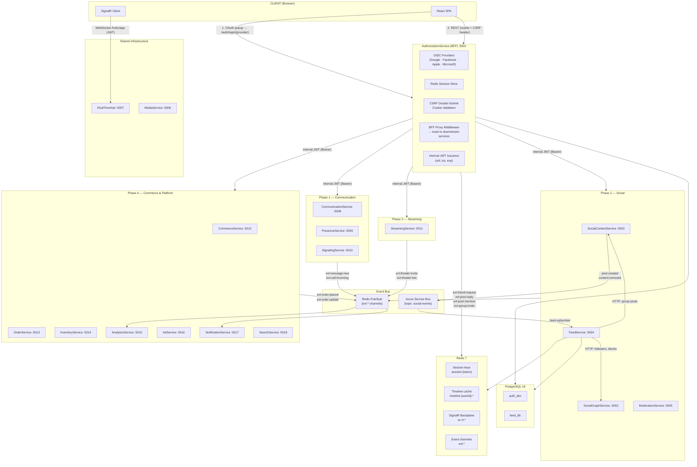
```mermaid
graph TB
    subgraph Client ["CLIENT (Browser)"]
        React["React SPA"]
        SRClient["SignalR Client"]
    end

    React -- "1. OAuth popup → /auth/login/{provider}" --> AuthSvc
    React -- "2. REST (cookie + CSRF header)" --> AuthSvc
    SRClient -- "WebSocket /hubs/app (JWT)" --> RTHub

    subgraph AuthSvc ["AuthorizationService (BFF) :5001"]
        OIDC["OIDC Providers<br />(Google · Facebook · Apple · Microsoft)"]
        Sessions["Redis Session Store"]
        CSRF["CSRF Double-Submit<br />Cookie Validation"]
        Proxy["BFF Proxy Middleware<br />→ route to downstream services"]
        JWT["Internal JWT Issuance<br />(uid, iss, exp)"]
    end

    AuthSvc -- "internal JWT (Bearer)" --> Phase1
    AuthSvc -- "internal JWT (Bearer)" --> Phase2
    AuthSvc -- "internal JWT (Bearer)" --> Phase3
    AuthSvc -- "internal JWT (Bearer)" --> Phase4

    subgraph Phase1 ["Phase 1 — Communication"]
        Comm["CommunicationService :5008"]
        Pres["PresenceService :5009"]
        Sig["SignalingService :5010"]
    end

    subgraph Phase2 ["Phase 2 — Social"]
        SCS["SocialContentService :5003"]
        SGS["SocialGraphService :5002"]
        Feed["FeedService :5004"]
        Mod["ModerationService :5005"]
    end

    subgraph Phase3 ["Phase 3 — Streaming"]
        Stream["StreamingService :5011"]
    end

    subgraph Phase4 ["Phase 4 — Commerce & Platform"]
        Commerce["CommerceService :5012"]
        Order["OrderService :5013"]
        Inventory["InventoryService :5014"]
        Analytics["AnalyticsService :5015"]
        Ad["AdService :5016"]
        Notif["NotificationService :5017"]
        Search["SearchService :5018"]
    end

    subgraph Infra ["Shared Infrastructure"]
        RTHub["RealTimeHub :5007"]
        Media["MediaService :5006"]
    end

    subgraph EventBus ["Event Bus"]
        ASB["Azure Service Bus<br />(topic: social-events)"]
        Redis["Redis Pub/Sub<br />(evt:* channels)"]
    end

    SCS -- "post.created<br />content.removed" --> ASB
    ASB -- "feed-subscriber" --> Feed

    Phase1 -- "evt:message:new<br />evt:call:incoming" --> Redis
    Phase2 -- "evt:friend:request<br />evt:post:reply<br />evt:post:mention<br />evt:group:invite" --> Redis
    Phase3 -- "evt:theater:invite<br />evt:theater:live" --> Redis
    Phase4 -- "evt:order:placed<br />evt:order:update" --> Redis

    Redis --> Notif
    Redis --> Analytics

    Feed -- "HTTP: followers, blocks" --> SGS
    Feed -- "HTTP: group posts" --> SCS

    subgraph PG ["PostgreSQL 16"]
        DB1["auth_dev"]
        DB2["feed_db"]
    end

    subgraph RedisStore ["Redis 7"]
        Sess["Session keys<br />session:{token}"]
        TL["Timeline cache<br />timeline:{userId}:*"]
        BP["SignalR Backplane<br />sc-rt:*"]
        EVT["Event channels<br />evt:*"]
    end

    AuthSvc --> PG
    AuthSvc --> RedisStore
    Feed --> PG
    Feed --> RedisStore
```

---

## 1. AuthorizationService — OIDC BFF Gateway

### 1a. Authentication Architecture

The AuthorizationService is the **sole entry point** for browser
clients. It implements a **Backend for Frontend (BFF)** pattern —
the SPA never holds long-lived tokens directly. Authentication state
is managed server-side via encrypted session cookies.

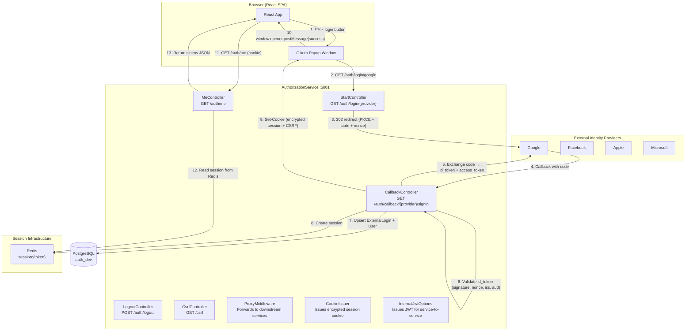
```mermaid
graph TB
    subgraph Browser ["Browser (React SPA)"]
        SPA["React App"]
        Popup["OAuth Popup Window"]
    end

    subgraph BFF ["AuthorizationService :5001"]
        Start["StartController<br />GET /auth/login/{provider}"]
        Callback["CallbackController<br />GET /auth/callback/{provider}/signin"]
        Me["MeController<br />GET /auth/me"]
        Logout["LogoutController<br />POST /auth/logout"]
        CsrfCtrl["CsrfController<br />GET /csrf"]
        Proxy["ProxyMiddleware<br />Forwards to downstream services"]
        CookieIss["CookieIssuer<br />Issues encrypted session cookie"]
        JWTIss["InternalJwtOptions<br />Issues JWT for service-to-service"]
    end

    subgraph IdPs ["External Identity Providers"]
        Google["Google"]
        Facebook["Facebook"]
        Apple["Apple"]
        Microsoft["Microsoft"]
    end

    subgraph Sessions ["Session Infrastructure"]
        RedisSession["Redis<br />session:{token}"]
    end

    SPA -- "1. Click login button" --> Popup
    Popup -- "2. GET /auth/login/google" --> Start
    Start -- "3. 302 redirect (PKCE + state + nonce)" --> Google
    Google -- "4. Callback with code" --> Callback
    Callback -- "5. Exchange code → id_token + access_token" --> Google
    Callback -- "6. Validate id_token (signature, nonce, iss, aud)" --> Callback
    Callback -- "7. Upsert ExternalLogin + User" --> PG[("PostgreSQL<br />auth_dev")]
    Callback -- "8. Create session" --> RedisSession
    Callback -- "9. Set-Cookie (encrypted session + CSRF)" --> Popup
    Popup -- "10. window.opener.postMessage(success)" --> SPA
    SPA -- "11. GET /auth/me (cookie)" --> Me
    Me -- "12. Read session from Redis" --> RedisSession
    Me -- "13. Return claims JSON" --> SPA
```

### 1b. OIDC Provider Flow — Detailed

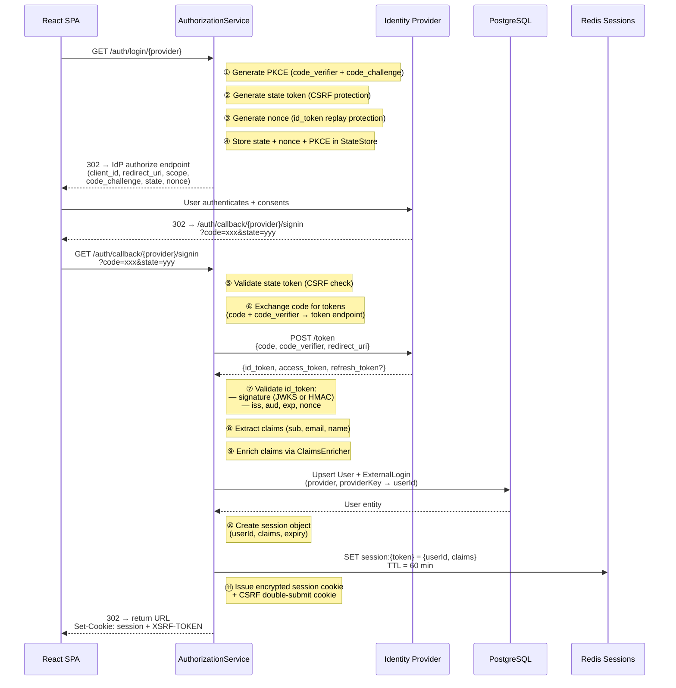
```mermaid
sequenceDiagram
    participant SPA as React SPA
    participant BFF as AuthorizationService
    participant IdP as Identity Provider
    participant DB as PostgreSQL
    participant Redis as Redis Sessions

    SPA->>BFF: GET /auth/login/{provider}

    Note right of BFF: ① Generate PKCE (code_verifier + code_challenge)
    Note right of BFF: ② Generate state token (CSRF protection)
    Note right of BFF: ③ Generate nonce (id_token replay protection)
    Note right of BFF: ④ Store state + nonce + PKCE in StateStore

    BFF-->>SPA: 302 → IdP authorize endpoint<br/>(client_id, redirect_uri, scope,<br/>code_challenge, state, nonce)

    SPA->>IdP: User authenticates + consents
    IdP-->>SPA: 302 → /auth/callback/{provider}/signin<br/>?code=xxx&state=yyy

    SPA->>BFF: GET /auth/callback/{provider}/signin<br/>?code=xxx&state=yyy

    Note right of BFF: ⑤ Validate state token (CSRF check)
    Note right of BFF: ⑥ Exchange code for tokens<br/>(code + code_verifier → token endpoint)

    BFF->>IdP: POST /token<br/>{code, code_verifier, redirect_uri}
    IdP-->>BFF: {id_token, access_token, refresh_token?}

    Note right of BFF: ⑦ Validate id_token:<br/>— signature (JWKS or HMAC)<br/>— iss, aud, exp, nonce

    Note right of BFF: ⑧ Extract claims (sub, email, name)
    Note right of BFF: ⑨ Enrich claims via ClaimsEnricher

    BFF->>DB: Upsert User + ExternalLogin<br/>(provider, providerKey → userId)
    DB-->>BFF: User entity

    Note right of BFF: ⑩ Create session object<br/>(userId, claims, expiry)
    BFF->>Redis: SET session:{token} = {userId, claims}<br/>TTL = 60 min

    Note right of BFF: ⑪ Issue encrypted session cookie<br/>+ CSRF double-submit cookie

    BFF-->>SPA: 302 → return URL<br/>Set-Cookie: session + XSRF-TOKEN
```

### 1c. Session & CSRF Architecture

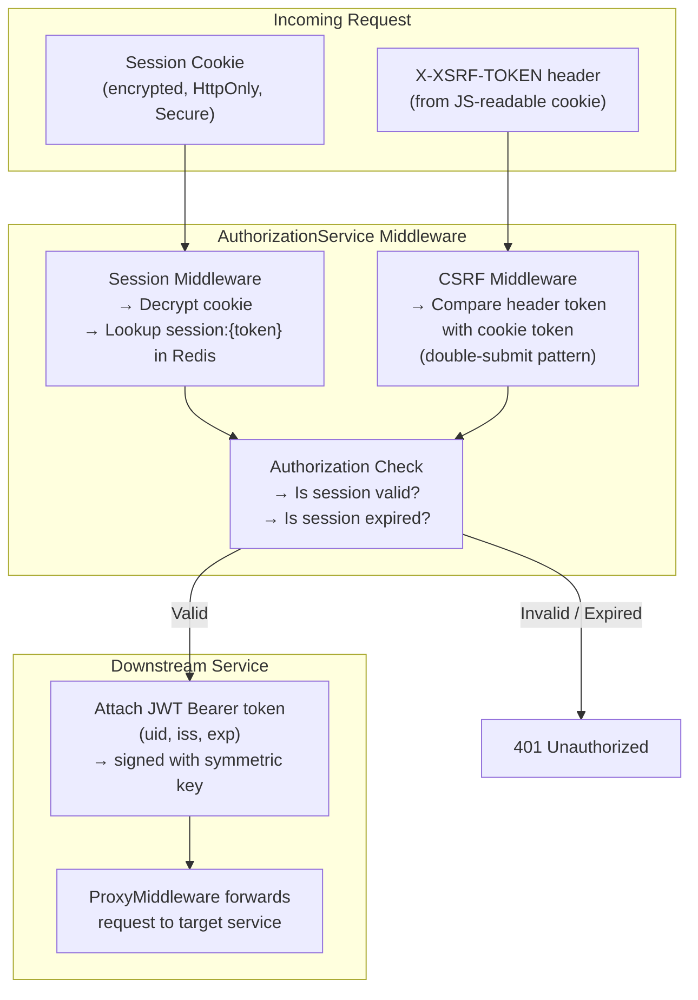
```mermaid
flowchart TD
    subgraph Request ["Incoming Request"]
        Cookie["Session Cookie<br />(encrypted, HttpOnly, Secure)"]
        CSRFHeader["X-XSRF-TOKEN header<br />(from JS-readable cookie)"]
    end

    subgraph BFF ["AuthorizationService Middleware"]
        SessionMW["Session Middleware<br />→ Decrypt cookie<br />→ Lookup session:{token} in Redis"]
        CsrfMW["CSRF Middleware<br />→ Compare header token<br />with cookie token<br />(double-submit pattern)"]
        AuthZ["Authorization Check<br />→ Is session valid?<br />→ Is session expired?"]
    end

    subgraph Downstream ["Downstream Service"]
        JWTAttach["Attach JWT Bearer token<br />(uid, iss, exp)<br />→ signed with symmetric key"]
        ProxyFwd["ProxyMiddleware forwards<br />request to target service"]
    end

    Cookie --> SessionMW
    CSRFHeader --> CsrfMW
    SessionMW --> AuthZ
    CsrfMW --> AuthZ
    AuthZ -- "Valid" --> JWTAttach
    JWTAttach --> ProxyFwd
    AuthZ -- "Invalid / Expired" --> Reject["401 Unauthorized"]
```

### 1d. BFF Proxy — Request Routing

The `ProxyMiddleware` intercepts requests matching configured path
prefixes and forwards them to the appropriate downstream service,
attaching the internal JWT.

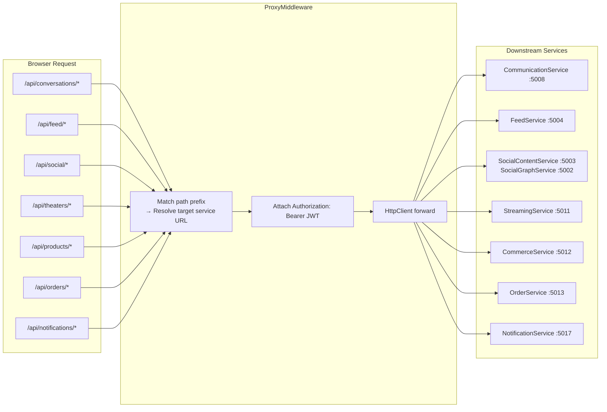
```mermaid
flowchart LR
    subgraph Incoming ["Browser Request"]
        R1["/api/conversations/*"]
        R2["/api/feed/*"]
        R3["/api/social/*"]
        R4["/api/theaters/*"]
        R5["/api/products/*"]
        R6["/api/orders/*"]
        R7["/api/notifications/*"]
    end

    subgraph Proxy ["ProxyMiddleware"]
        Match["Match path prefix<br />→ Resolve target service URL"]
        Attach["Attach Authorization: Bearer JWT"]
        Forward["HttpClient forward"]
    end

    subgraph Targets ["Downstream Services"]
        T1["CommunicationService :5008"]
        T2["FeedService :5004"]
        T3["SocialContentService :5003<br />SocialGraphService :5002"]
        T4["StreamingService :5011"]
        T5["CommerceService :5012"]
        T6["OrderService :5013"]
        T7["NotificationService :5017"]
    end

    R1 --> Match --> Attach --> Forward
    R2 --> Match
    R3 --> Match
    R4 --> Match
    R5 --> Match
    R6 --> Match
    R7 --> Match

    Forward --> T1
    Forward --> T2
    Forward --> T3
    Forward --> T4
    Forward --> T5
    Forward --> T6
    Forward --> T7
```

### 1e. Internal JWT Issuance

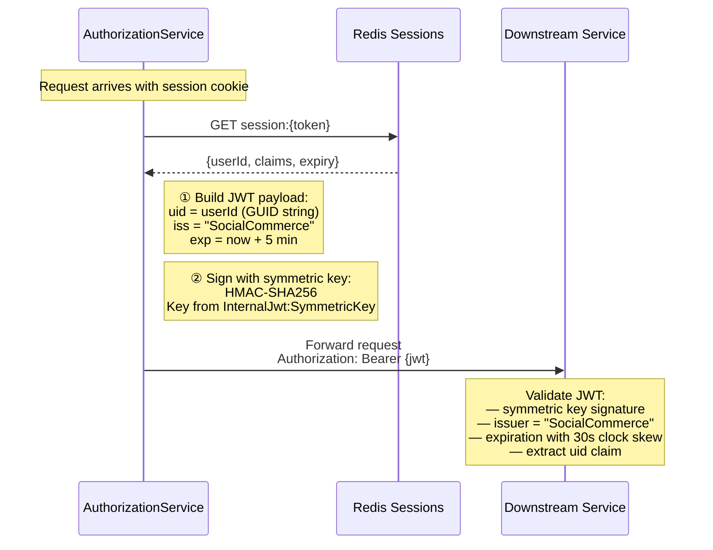
```mermaid
sequenceDiagram
    participant BFF as AuthorizationService
    participant Redis as Redis Sessions
    participant Svc as Downstream Service

    Note over BFF: Request arrives with session cookie

    BFF->>Redis: GET session:{token}
    Redis-->>BFF: {userId, claims, expiry}

    Note right of BFF: ① Build JWT payload:<br/>uid = userId (GUID string)<br/>iss = "SocialCommerce"<br/>exp = now + 5 min

    Note right of BFF: ② Sign with symmetric key:<br/>HMAC-SHA256<br/>Key from InternalJwt:SymmetricKey

    BFF->>Svc: Forward request<br/>Authorization: Bearer {jwt}

    Note over Svc: Validate JWT:<br/>— symmetric key signature<br/>— issuer = "SocialCommerce"<br/>— expiration with 30s clock skew<br/>— extract uid claim
```

### 1f. AuthorizationService Entity Model

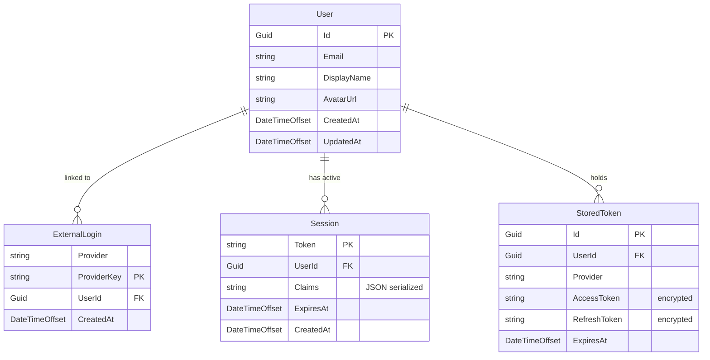
```mermaid
erDiagram
    User ||--o{ ExternalLogin : "linked to"
    User ||--o{ Session : "has active"
    User ||--o{ StoredToken : "holds"

    User {
        Guid Id PK
        string Email
        string DisplayName
        string AvatarUrl
        DateTimeOffset CreatedAt
        DateTimeOffset UpdatedAt
    }

    ExternalLogin {
        string Provider
        string ProviderKey PK
        Guid UserId FK
        DateTimeOffset CreatedAt
    }

    Session {
        string Token PK
        Guid UserId FK
        string Claims "JSON serialized"
        DateTimeOffset ExpiresAt
        DateTimeOffset CreatedAt
    }

    StoredToken {
        Guid Id PK
        Guid UserId FK
        string Provider
        string AccessToken "encrypted"
        string RefreshToken "encrypted"
        DateTimeOffset ExpiresAt
    }
```

### 1g. Supported OIDC Providers

| Provider | Config Section | Authorize Endpoint | Token Endpoint | PKCE |
|---|---|---|---|---|
| Google | `Auth:Google` | `accounts.google.com/o/oauth2/v2/auth` | `oauth2.googleapis.com/token` | ✅ |
| Microsoft | `Auth:Microsoft` | `login.microsoftonline.com/.../authorize` | `login.microsoftonline.com/.../token` | ✅ |
| Facebook | `Auth:Facebook` | `facebook.com/v18.0/dialog/oauth` | `graph.facebook.com/v18.0/oauth/access_token` | ✅ |
| Apple | `Auth:Apple` | `appleid.apple.com/auth/authorize` | `appleid.apple.com/auth/token` | ✅ |

---

## 2. FeedService — Cross-Domain Feed Aggregation

### 2a. Feed Architecture Overview

FeedService aggregates content from **SocialContentService** and
**SocialGraphService** into per-user timelines using a **fan-out on
write** strategy. When a user publishes a post, FeedService receives
an event via Azure Service Bus and inserts the post reference into
every follower's timeline.

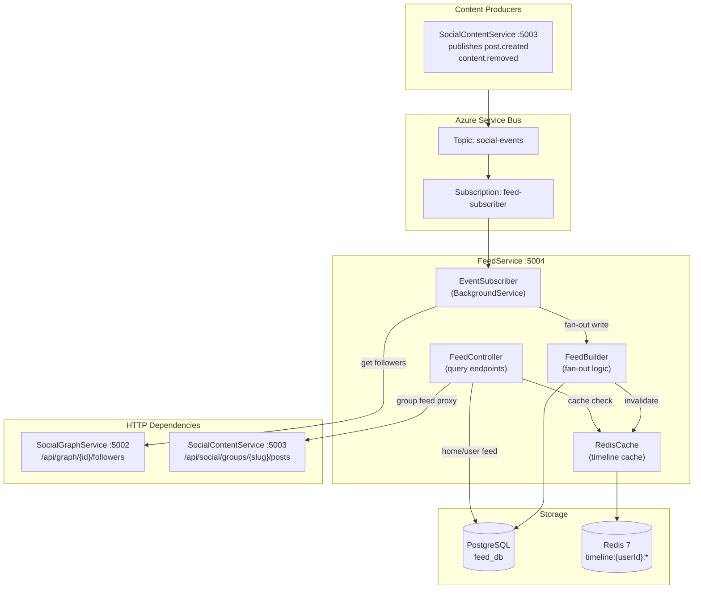
```mermaid
graph TB
    subgraph Producers ["Content Producers"]
        SCS["SocialContentService :5003<br />publishes post.created<br />content.removed"]
    end

    subgraph ASB ["Azure Service Bus"]
        Topic["Topic: social-events"]
        Sub["Subscription: feed-subscriber"]
        Topic --> Sub
    end

    subgraph FeedSvc ["FeedService :5004"]
        ES["EventSubscriber<br />(BackgroundService)"]
        FB["FeedBuilder<br />(fan-out logic)"]
        FC["FeedController<br />(query endpoints)"]
        Cache["RedisCache<br />(timeline cache)"]
    end

    subgraph Deps ["HTTP Dependencies"]
        SGS["SocialGraphService :5002<br />/api/graph/{id}/followers"]
        SCS2["SocialContentService :5003<br />/api/social/groups/{slug}/posts"]
    end

    subgraph Storage ["Storage"]
        PG[("PostgreSQL<br />feed_db")]
        Redis[("Redis 7<br />timeline:{userId}:*")]
    end

    Producers --> Topic
    Sub --> ES
    ES -- "get followers" --> SGS
    ES -- "fan-out write" --> FB
    FB --> PG
    FB -- "invalidate" --> Cache

    FC -- "home/user feed" --> PG
    FC -- "cache check" --> Cache
    FC -- "group feed proxy" --> SCS2

    Cache --> Redis
```

### 2b. Fan-Out on Write — Event Processing

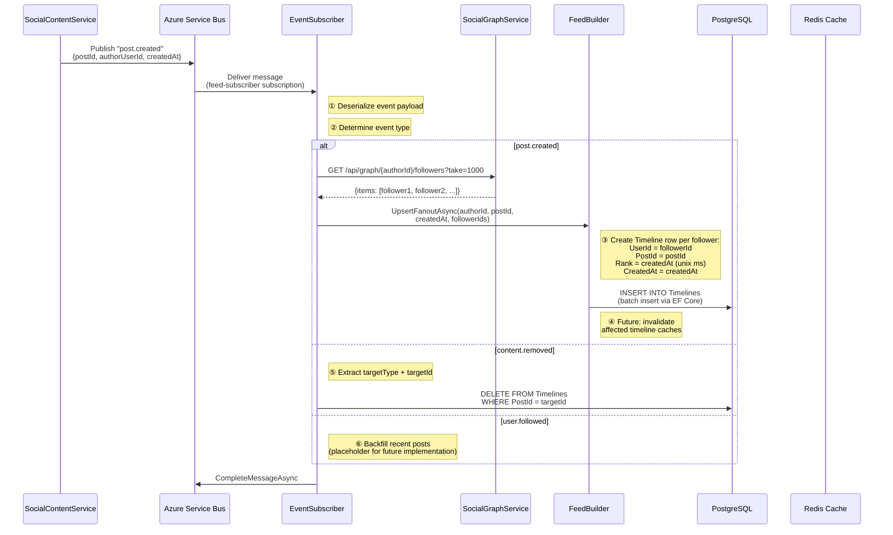
```mermaid
sequenceDiagram
    participant SCS as SocialContentService
    participant ASB as Azure Service Bus
    participant ES as EventSubscriber
    participant SGS as SocialGraphService
    participant FB as FeedBuilder
    participant PG as PostgreSQL
    participant Redis as Redis Cache

    SCS->>ASB: Publish "post.created"<br/>{postId, authorUserId, createdAt}

    ASB->>ES: Deliver message<br/>(feed-subscriber subscription)

    Note right of ES: ① Deserialize event payload
    Note right of ES: ② Determine event type

    alt post.created
        ES->>SGS: GET /api/graph/{authorId}/followers?take=1000
        SGS-->>ES: {items: [follower1, follower2, ...]}

        ES->>FB: UpsertFanoutAsync(authorId, postId,<br/>createdAt, followerIds)

        Note right of FB: ③ Create Timeline row per follower:<br/>UserId = followerId<br/>PostId = postId<br/>Rank = createdAt (unix ms)<br/>CreatedAt = createdAt

        FB->>PG: INSERT INTO Timelines<br/>(batch insert via EF Core)

        Note right of FB: ④ Future: invalidate<br/>affected timeline caches

    else content.removed
        Note right of ES: ⑤ Extract targetType + targetId
        ES->>PG: DELETE FROM Timelines<br/>WHERE PostId = targetId

    else user.followed
        Note right of ES: ⑥ Backfill recent posts<br/>(placeholder for future implementation)
    end

    ES->>ASB: CompleteMessageAsync
```

### 2c. Feed Query Endpoints


```mermaid
flowchart TD
    subgraph HomeFeed ["GET /api/feed/home?me={userId}"]
        H1["Decode cursor → DateTimeOffset"]
        H2{"Timeline cache<br />hit?"}
        H2 -- Yes --> H3["Return cached post IDs"]
        H2 -- No --> H4["Query Timelines table<br />WHERE UserId = me<br />AND CreatedAt < cursor<br />ORDER BY CreatedAt DESC, Rank DESC"]
        H4 --> H5["Cache result in Redis<br />TTL = 2 min"]
        H3 --> H6["Build FeedPage response<br />{items, nextCursor}"]
        H5 --> H6
        H1 --> H2
    end

    subgraph UserFeed ["GET /api/feed/user/{userId}"]
        U1["Query Timelines<br />WHERE UserId = target<br />ORDER BY CreatedAt DESC"]
        U1 --> U2["Build FeedPage response"]
    end

    subgraph ExploreFeed ["GET /api/feed/explore"]
        E1["Query all Timelines<br />ORDER BY Rank DESC,<br />CreatedAt DESC"]
        E1 --> E2["Build FeedPage response<br />(trending / recommended)"]
    end

    subgraph GroupFeed ["GET /api/feed/group/{slug}"]
        G1["Proxy to SocialContentService<br />GET /api/social/groups/{slug}/posts"]
        G1 --> G2["Transform to FeedPage response"]
    end
```

### 2d. Feed Data Model

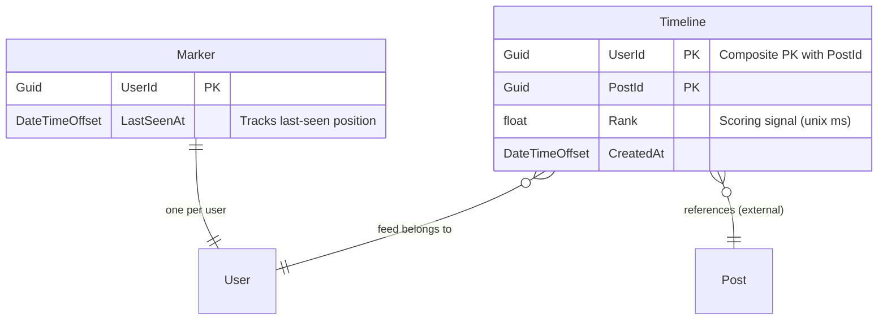
```mermaid
erDiagram
    Timeline {
        Guid UserId PK "Composite PK with PostId"
        Guid PostId PK
        float Rank "Scoring signal (unix ms)"
        DateTimeOffset CreatedAt
    }

    Marker {
        Guid UserId PK
        DateTimeOffset LastSeenAt "Tracks last-seen position"
    }

    Timeline }o--|| User : "feed belongs to"
    Timeline }o--|| Post : "references (external)"
    Marker ||--|| User : "one per user"
```

### 2e. Redis Cache Strategy

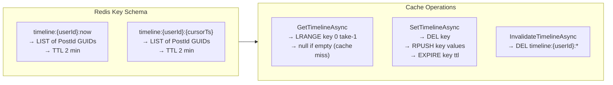
```mermaid
flowchart LR
    subgraph Keys ["Redis Key Schema"]
        K1["timeline:{userId}:now<br />→ LIST of PostId GUIDs<br />→ TTL 2 min"]
        K2["timeline:{userId}:{cursorTs}<br />→ LIST of PostId GUIDs<br />→ TTL 2 min"]
    end

    subgraph Ops ["Cache Operations"]
        Read["GetTimelineAsync<br />→ LRANGE key 0 take-1<br />→ null if empty (cache miss)"]
        Write["SetTimelineAsync<br />→ DEL key<br />→ RPUSH key values<br />→ EXPIRE key ttl"]
        Invalidate["InvalidateTimelineAsync<br />→ DEL timeline:{userId}:*"]
    end

    Keys --> Ops
```

### 2f. Cross-Service HTTP Dependencies

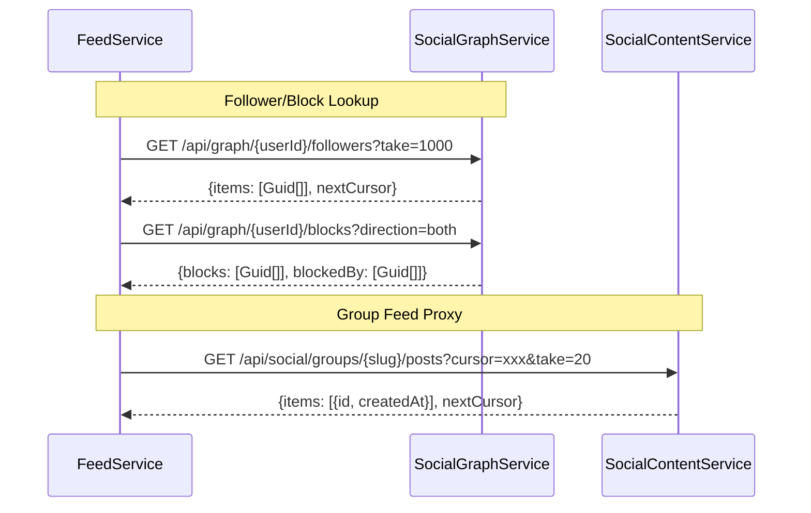
```mermaid
sequenceDiagram
    participant Feed as FeedService
    participant Graph as SocialGraphService
    participant Content as SocialContentService

    Note over Feed,Graph: Follower/Block Lookup

    Feed->>Graph: GET /api/graph/{userId}/followers?take=1000
    Graph-->>Feed: {items: [Guid[]], nextCursor}

    Feed->>Graph: GET /api/graph/{userId}/blocks?direction=both
    Graph-->>Feed: {blocks: [Guid[]], blockedBy: [Guid[]]}

    Note over Feed,Content: Group Feed Proxy

    Feed->>Content: GET /api/social/groups/{slug}/posts?cursor=xxx&take=20
    Content-->>Feed: {items: [{id, createdAt}], nextCursor}
```

---

## 3. Shared Contracts Library

The `Contracts` project (shared library) defines the cross-service
event schema used by all domain services for asynchronous communication
via Redis Pub/Sub and Azure Service Bus.

### 3a. Event Envelope

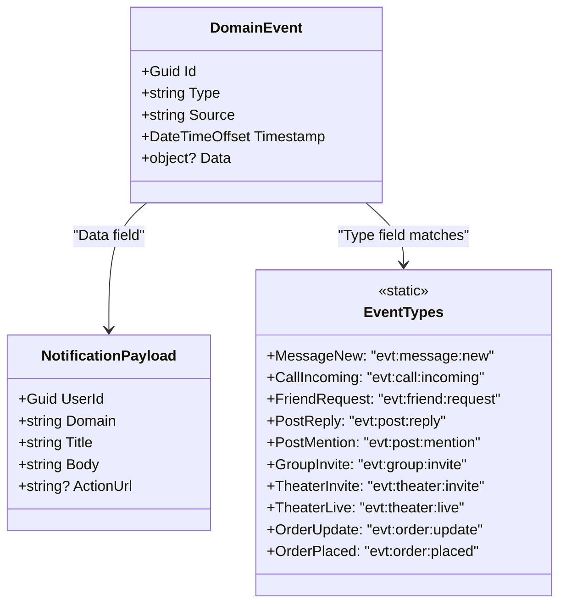
```mermaid
classDiagram
    class DomainEvent {
        +Guid Id
        +string Type
        +string Source
        +DateTimeOffset Timestamp
        +object? Data
    }

    class NotificationPayload {
        +Guid UserId
        +string Domain
        +string Title
        +string Body
        +string? ActionUrl
    }

    class EventTypes {
        <<static>>
        +MessageNew: "evt:message:new"
        +CallIncoming: "evt:call:incoming"
        +FriendRequest: "evt:friend:request"
        +PostReply: "evt:post:reply"
        +PostMention: "evt:post:mention"
        +GroupInvite: "evt:group:invite"
        +TheaterInvite: "evt:theater:invite"
        +TheaterLive: "evt:theater:live"
        +OrderUpdate: "evt:order:update"
        +OrderPlaced: "evt:order:placed"
    }

    DomainEvent --> NotificationPayload : "Data field"
    DomainEvent --> EventTypes : "Type field matches"
```

### 3b. Event Type Catalog — Full Platform

| Constant | Channel | Source Service | Phase |
|---|---|---|---|
| `EventTypes.MessageNew` | `evt:message:new` | CommunicationService | 1 |
| `EventTypes.CallIncoming` | `evt:call:incoming` | SignalingService | 1 |
| `EventTypes.FriendRequest` | `evt:friend:request` | SocialGraphService | 2 |
| `EventTypes.PostReply` | `evt:post:reply` | SocialContentService | 2 |
| `EventTypes.PostMention` | `evt:post:mention` | SocialContentService | 2 |
| `EventTypes.GroupInvite` | `evt:group:invite` | SocialContentService | 2 |
| `EventTypes.TheaterInvite` | `evt:theater:invite` | StreamingService | 3 |
| `EventTypes.TheaterLive` | `evt:theater:live` | StreamingService | 3 |
| `EventTypes.OrderPlaced` | `evt:order:placed` | OrderService | 4 |
| `EventTypes.OrderUpdate` | `evt:order:update` | OrderService | 4 |

### 3c. Dual Event Bus Topology

The platform uses **two event buses** for different communication
patterns, both converging on Redis:

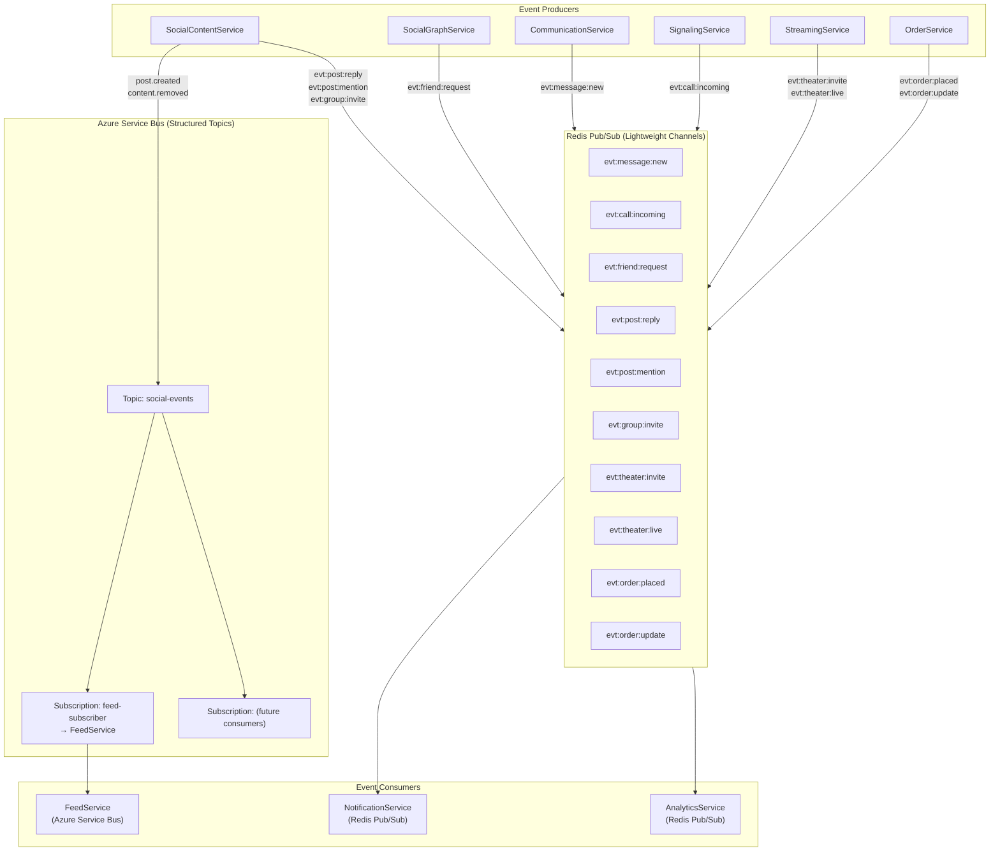
```mermaid
graph TB
    subgraph ASBus ["Azure Service Bus (Structured Topics)"]
        Topic["Topic: social-events"]
        Sub1["Subscription: feed-subscriber<br />→ FeedService"]
        Sub2["Subscription: (future consumers)"]
        Topic --> Sub1
        Topic --> Sub2
    end

    subgraph RedisBus ["Redis Pub/Sub (Lightweight Channels)"]
        CH1["evt:message:new"]
        CH2["evt:call:incoming"]
        CH3["evt:friend:request"]
        CH4["evt:post:reply"]
        CH5["evt:post:mention"]
        CH6["evt:group:invite"]
        CH7["evt:theater:invite"]
        CH8["evt:theater:live"]
        CH9["evt:order:placed"]
        CH10["evt:order:update"]
    end

    subgraph Producers ["Event Producers"]
        SCS["SocialContentService"]
        SGS["SocialGraphService"]
        Comm["CommunicationService"]
        Sig["SignalingService"]
        Strm["StreamingService"]
        Ord["OrderService"]
    end

    subgraph Consumers ["Event Consumers"]
        Feed["FeedService<br />(Azure Service Bus)"]
        Notif["NotificationService<br />(Redis Pub/Sub)"]
        Analy["AnalyticsService<br />(Redis Pub/Sub)"]
    end

    SCS -- "post.created<br />content.removed" --> Topic
    SCS -- "evt:post:reply<br />evt:post:mention<br />evt:group:invite" --> RedisBus
    SGS -- "evt:friend:request" --> RedisBus
    Comm -- "evt:message:new" --> RedisBus
    Sig -- "evt:call:incoming" --> RedisBus
    Strm -- "evt:theater:invite<br />evt:theater:live" --> RedisBus
    Ord -- "evt:order:placed<br />evt:order:update" --> RedisBus

    Sub1 --> Feed
    RedisBus --> Notif
    RedisBus --> Analy
```

| Bus | Use Case | Pattern | Consumer Behavior |
|---|---|---|---|
| **Azure Service Bus** | Feed fan-out (`post.created`, `content.removed`) | Topic → Subscription | Competing consumers, at-least-once delivery, dead-letter queue |
| **Redis Pub/Sub** | Real-time notification & analytics events (`evt:*`) | Channel broadcast | All subscribers receive, fire-and-forget, best-effort |

---

## 4. Platform-Wide Service Conventions

### 4a. Standard Service Structure

All services follow the same project layout established in Phase 0:

```
ServiceName/
├── Controllers/           # REST endpoints
├── Data/
│   ├── AppDb.cs           # EF Core DbContext
│   └── Entities.cs        # Domain entities
├── Dtos/                  # Request/Response DTOs
├── Services/              # Business logic + background services
├── Migrations/            # EF Core migrations
├── Auth/                  # JWT validation (JwtAuthExtensions)
└── Program.cs             # Host builder + middleware pipeline
```

### 4b. Authentication — JWT Validation Chain

Every downstream service (Phase 1–4) validates JWTs issued by the
AuthorizationService using the same shared configuration:

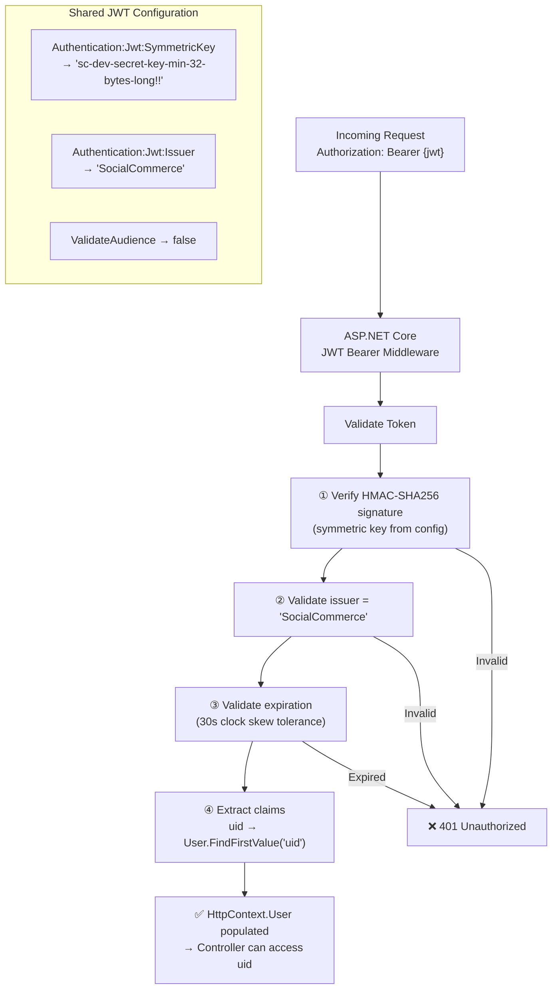
```mermaid
flowchart TD
    Req["Incoming Request<br />Authorization: Bearer {jwt}"] --> MW["ASP.NET Core<br />JWT Bearer Middleware"]
    MW --> Validate["Validate Token"]

    Validate --> Sig["① Verify HMAC-SHA256 signature<br />(symmetric key from config)"]
    Sig --> Iss["② Validate issuer = 'SocialCommerce'"]
    Iss --> Exp["③ Validate expiration<br />(30s clock skew tolerance)"]
    Exp --> Claims["④ Extract claims<br />uid → User.FindFirstValue('uid')"]

    Claims --> OK["✅ HttpContext.User populated<br />→ Controller can access uid"]
    Sig -- "Invalid" --> Reject["❌ 401 Unauthorized"]
    Iss -- "Invalid" --> Reject
    Exp -- "Expired" --> Reject

    subgraph Config ["Shared JWT Configuration"]
        CK["Authentication:Jwt:SymmetricKey<br />→ 'sc-dev-secret-key-min-32-bytes-long!!'"]
        CI["Authentication:Jwt:Issuer<br />→ 'SocialCommerce'"]
        CV["ValidateAudience → false"]
    end
```

### 4c. Health Check Pattern

All services expose standardized health endpoints:

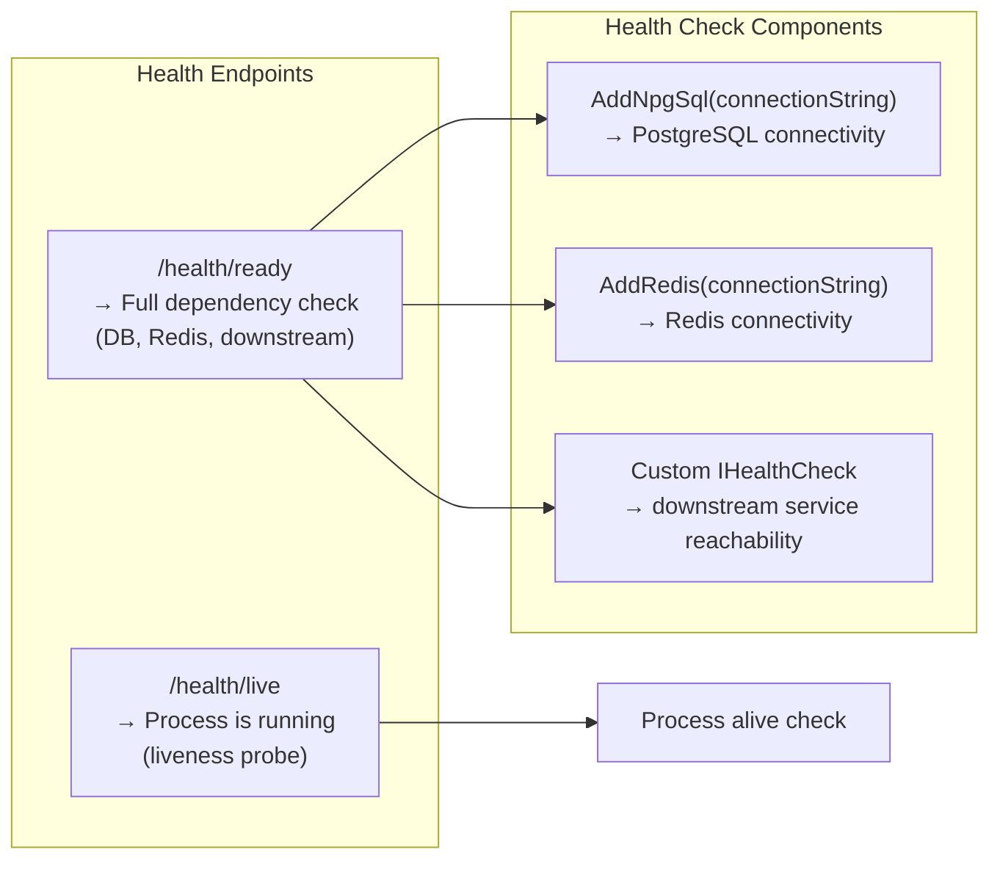
```mermaid
flowchart LR
    subgraph Endpoints ["Health Endpoints"]
        Ready["/health/ready<br />→ Full dependency check<br />(DB, Redis, downstream)"]
        Live["/health/live<br />→ Process is running<br />(liveness probe)"]
    end

    subgraph Checks ["Health Check Components"]
        PG["AddNpgSql(connectionString)<br />→ PostgreSQL connectivity"]
        Redis["AddRedis(connectionString)<br />→ Redis connectivity"]
        Custom["Custom IHealthCheck<br />→ downstream service reachability"]
    end

    Ready --> PG
    Ready --> Redis
    Ready --> Custom
    Live --> Process["Process alive check"]
```

| Service | `/health/ready` Checks | `/health/live` |
|---|---|---|
| AuthorizationService | PostgreSQL, Redis | Process |
| FeedService | PostgreSQL, Redis | Process |
| CommunicationService | PostgreSQL, RealTimeHub | Process |
| PresenceService | Redis, RealTimeHub | Process |
| CommerceService | PostgreSQL | Process |
| OrderService | PostgreSQL | Process |
| NotificationService | PostgreSQL, Redis, RealTimeHub | Process |
| AnalyticsService | PostgreSQL, Redis | Process |
| SearchService | PostgreSQL | Process |

### 4d. Observability — OpenTelemetry

Services that have been instrumented use the Azure Monitor
OpenTelemetry exporter for distributed tracing and metrics:

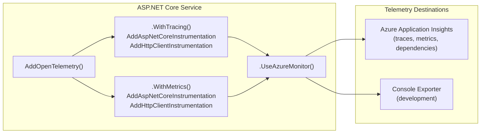
```mermaid
flowchart LR
    subgraph Service ["ASP.NET Core Service"]
        OTEL["AddOpenTelemetry()"]
        Trace[".WithTracing()<br />AddAspNetCoreInstrumentation<br />AddHttpClientInstrumentation"]
        Metric[".WithMetrics()<br />AddAspNetCoreInstrumentation<br />AddHttpClientInstrumentation"]
        Export[".UseAzureMonitor()"]
    end

    subgraph Destinations ["Telemetry Destinations"]
        AppInsights["Azure Application Insights<br />(traces, metrics, dependencies)"]
        Console["Console Exporter<br />(development)"]
    end

    OTEL --> Trace
    OTEL --> Metric
    Trace --> Export
    Metric --> Export
    Export --> AppInsights
    Export --> Console
```

### 4e. Error Handling — RFC 7807 Problem Details

All services return standardized error responses:

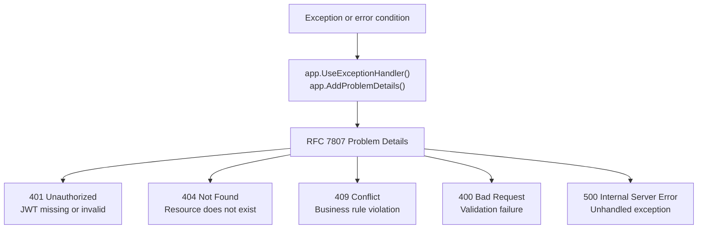
```mermaid
flowchart TD
    Err["Exception or error condition"] --> Handler["app.UseExceptionHandler()<br />app.AddProblemDetails()"]
    Handler --> PD["RFC 7807 Problem Details"]

    PD --> R401["401 Unauthorized<br />JWT missing or invalid"]
    PD --> R404["404 Not Found<br />Resource does not exist"]
    PD --> R409["409 Conflict<br />Business rule violation"]
    PD --> R400["400 Bad Request<br />Validation failure"]
    PD --> R500["500 Internal Server Error<br />Unhandled exception"]
```

### 4f. Pagination — Cursor-Based (Shared)

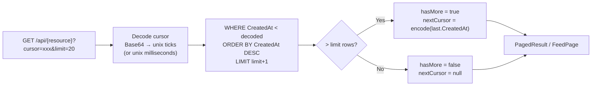
```mermaid
flowchart LR
    Req["GET /api/{resource}?cursor=xxx&limit=20"]
    Req --> Decode["Decode cursor<br />Base64 → unix ticks<br />(or unix milliseconds)"]
    Decode --> Query["WHERE CreatedAt < decoded<br />ORDER BY CreatedAt DESC<br />LIMIT limit+1"]
    Query --> Check{"> limit rows?"}
    Check -- Yes --> More["hasMore = true<br />nextCursor = encode(last.CreatedAt)"]
    Check -- No --> NoMore["hasMore = false<br />nextCursor = null"]
    More --> Resp["PagedResult / FeedPage"]
    NoMore --> Resp
```

Two cursor encoding variants exist across the platform:

| Variant | Used By | Encoding |
|---|---|---|
| UTC Ticks | Phase 4 services | `Base64(BitConverter(DateTimeOffset.UtcTicks))` |
| Unix Milliseconds | FeedService, Phase 2 | `Base64(BitConverter(DateTimeOffset.ToUnixTimeMilliseconds()))` |

---

## 5. Complete Cross-Service Communication Map

```mermaid
graph TB
    subgraph Browser ["Browser (React SPA)"]
        SPA["React App + SignalR Client"]
    end

    subgraph BFF ["AuthorizationService :5001 (BFF)"]
        Auth["OIDC + Session + CSRF + Proxy"]
    end

    subgraph Phase1 ["Phase 1 — Communication"]
        Comm["CommunicationService :5008"]
        Pres["PresenceService :5009"]
        Sig["SignalingService :5010"]
    end

    subgraph Phase2 ["Phase 2 — Social"]
        SCS["SocialContentService :5003"]
        SGS["SocialGraphService :5002"]
        Feed["FeedService :5004"]
        Mod["ModerationService :5005"]
    end

    subgraph Phase3 ["Phase 3 — Streaming"]
        Stream["StreamingService :5011"]
    end

    subgraph Phase4 ["Phase 4 — Commerce & Platform"]
        Commerce["CommerceService :5012"]
        Order["OrderService :5013"]
        Inventory["InventoryService :5014"]
        Analytics["AnalyticsService :5015"]
        Ad["AdService :5016"]
        Notif["NotificationService :5017"]
        Search["SearchService :5018"]
    end

    subgraph Infra ["Shared Infrastructure"]
        RTHub["RealTimeHub :5007"]
        Media["MediaService :5006"]
    end

    SPA -- "cookie + CSRF" --> BFF
    SPA -- "WebSocket (JWT)" --> RTHub

    BFF -- "JWT Bearer" --> Comm
    BFF -- "JWT Bearer" --> Pres
    BFF -- "JWT Bearer" --> Sig
    BFF -- "JWT Bearer" --> SCS
    BFF -- "JWT Bearer" --> SGS
    BFF -- "JWT Bearer" --> Feed
    BFF -- "JWT Bearer" --> Mod
    BFF -- "JWT Bearer" --> Stream
    BFF -- "JWT Bearer" --> Commerce
    BFF -- "JWT Bearer" --> Order
    BFF -- "JWT Bearer" --> Inventory
    BFF -- "JWT Bearer" --> Analytics
    BFF -- "JWT Bearer" --> Ad
    BFF -- "JWT Bearer" --> Notif
    BFF -- "JWT Bearer" --> Search

    Comm -- "POST /internal/hub/publish" --> RTHub
    Pres -- "POST /internal/hub/publish" --> RTHub
    Sig -- "POST /internal/hub/publish" --> RTHub
    Stream -- "POST /internal/hub/publish" --> RTHub
    Notif -- "POST /internal/hub/publish" --> RTHub

    Feed -- "HTTP: followers" --> SGS
    Feed -- "HTTP: group posts" --> SCS
    Order -- "HTTP: sync seller orders" --> Inventory
    Order -. "HTTP: order event" .-> Analytics

    SPA -- "file upload" --> Media
```

### 5a. Service Port Registry — Complete Platform

| Port | Service | Phase | Database |
|---|---|---|---|
| 5001 | AuthorizationService (BFF) | 0 / 5 | `auth_dev` |
| 5002 | SocialGraphService | 2 | `social_graph_db` |
| 5003 | SocialContentService | 2 | `social_content_db` |
| 5004 | FeedService | 2 / 5 | `feed_db` |
| 5005 | ModerationService | 2 | `moderation_db` |
| 5006 | MediaService | 0 | `media_db` |
| 5007 | RealTimeHub | 0 | — (Redis backplane) |
| 5008 | CommunicationService | 1 | `communication_db` |
| 5009 | PresenceService | 1 | — (Redis only) |
| 5010 | SignalingService | 1 | `signaling_db` |
| 5011 | StreamingService | 3 | `streaming_db` |
| 5012 | CommerceService | 4 | `commerce_db` |
| 5013 | OrderService | 4 | `order_db` |
| 5014 | InventoryService | 4 | `inventory_db` |
| 5015 | AnalyticsService | 4 | `analytics_db` |
| 5016 | AdService | 4 | `ad_db` |
| 5017 | NotificationService | 4 | `notification_db` |
| 5018 | SearchService | 4 | `search_db` |

### 5b. Complete HTTP Inter-Service Dependencies

| Caller | Callee | Endpoint | Purpose |
|---|---|---|---|
| AuthorizationService | All downstream services | Various | BFF proxy with JWT injection |
| FeedService | SocialGraphService | `GET /api/graph/{id}/followers` | Get author's followers for fan-out |
| FeedService | SocialGraphService | `GET /api/graph/{id}/blocks` | Filter blocked users from feed |
| FeedService | SocialContentService | `GET /api/social/groups/{slug}/posts` | Proxy group feed requests |
| CommunicationService | RealTimeHub | `POST /internal/hub/publish` | Push messages, reactions, typing |
| PresenceService | RealTimeHub | `POST /internal/hub/publish` | Push presence updates |
| SignalingService | RealTimeHub | `POST /internal/hub/publish` | Push call signals |
| StreamingService | RealTimeHub | `POST /internal/hub/publish` | Push theater events |
| NotificationService | RealTimeHub | `POST /internal/hub/publish` | Push notification + badge |
| OrderService | InventoryService | `POST /internal/seller-orders/sync` | Sync placed order to seller |
| OrderService | AnalyticsService | `POST /internal/analytics/order-placed` | HTTP fallback for analytics |
| Domain Services | SearchService | `POST /internal/search/upsert` | Maintain unified search index |
| Domain Services | SearchService | `POST /internal/search/delete` | Remove from search index |
| FeedService / Client | AdService | `POST /internal/ads/record-impression` | Track ad impression |
| FeedService / Client | AdService | `POST /internal/ads/record-click` | Track ad click |

### 5c. Complete Event Bus Dependencies

| Bus | Subscriber | Channel / Topic | Source(s) | Purpose |
|---|---|---|---|---|
| Azure Service Bus | FeedService | `social-events` → `feed-subscriber` | SocialContentService | Fan-out post to follower timelines; remove posts |
| Redis Pub/Sub | NotificationService | All `evt:*` (10 channels) | All domain services | Persist + push real-time notifications |
| Redis Pub/Sub | AnalyticsService | `evt:order:placed` | OrderService | Aggregate seller sales data |

---

## 6. Docker Compose — Full Platform Topology

```mermaid
graph TB
    subgraph DockerNetwork ["docker-compose network"]
        subgraph Infra ["Infrastructure"]
            PG[("PostgreSQL 16 :5432<br />auth_dev · feed_db · social_content_db<br />social_graph_db · moderation_db<br />communication_db · signaling_db<br />streaming_db · commerce_db · order_db<br />inventory_db · analytics_db<br />search_db · ad_db · media_db")]
            RD[("Redis 7 :6379<br />sessions · cache · pub/sub · backplane")]
        end

        subgraph Phase0 ["Phase 0 — Foundations"]
            Auth["authorizationservice :5001<br />depends_on: postgres, redis"]
            Media["mediaservice :5006<br />depends_on: postgres"]
            RT["realtimehub :5007<br />depends_on: redis"]
        end

        subgraph Phase1Svc ["Phase 1 — Communication"]
            Comm["communicationservice :5008<br />depends_on: postgres, realtimehub"]
            Pres["presenceservice :5009<br />depends_on: redis, realtimehub"]
            Sig["signalingservice :5010<br />depends_on: postgres, realtimehub"]
        end

        subgraph Phase2Svc ["Phase 2 — Social"]
            SGS["socialgraphservice :5002<br />depends_on: postgres"]
            SCS["socialcontentservice :5003<br />depends_on: postgres"]
            FS["feedservice :5004<br />depends_on: postgres, redis,<br />socialgraphservice"]
            MS["moderationservice :5005<br />depends_on: postgres, redis"]
        end

        subgraph Phase3Svc ["Phase 3 — Streaming"]
            Stream["streamingservice :5011<br />depends_on: postgres, realtimehub"]
        end

        subgraph Phase4Svc ["Phase 4 — Commerce & Platform"]
            CS["commerceservice :5012<br />depends_on: postgres"]
            OS["orderservice :5013<br />depends_on: postgres"]
            IS["inventoryservice :5014<br />depends_on: postgres"]
            AS["analyticsservice :5015<br />depends_on: postgres, redis"]
            ADS["adservice :5016<br />depends_on: postgres"]
            NS["notificationservice :5017<br />depends_on: postgres, redis,<br />realtimehub"]
            SS["searchservice :5018<br />depends_on: postgres"]
        end

        PG --- Auth
        PG --- Media
        PG --- Comm
        PG --- Sig
        PG --- SGS
        PG --- SCS
        PG --- FS
        PG --- MS
        PG --- Stream
        PG --- CS
        PG --- OS
        PG --- IS
        PG --- AS
        PG --- ADS
        PG --- NS
        PG --- SS

        RD --- Auth
        RD --- RT
        RD --- Pres
        RD --- FS
        RD --- MS
        RD --- AS
        RD --- NS

        Auth -- "JWT Bearer" --> Comm
        Auth -- "JWT Bearer" --> FS
        Auth -- "JWT Bearer" --> CS
        OS -- "HTTP sync" --> IS
        NS -- "HTTP push" --> RT
    end
```

---

## 7. Data Storage Layout — Phase 5 Services

### PostgreSQL

```mermaid
graph LR
    PG[("PostgreSQL 16")]

    subgraph auth_dev ["auth_dev (AuthorizationService)"]
        Users["Users"]
        ExternalLogins["ExternalLogins"]
        StoredTokens["StoredTokens"]
    end

    subgraph feed_db ["feed_db (FeedService)"]
        Timelines["Timelines<br />(UserId, PostId, Rank, CreatedAt)"]
        Markers["Markers<br />(UserId, LastSeenAt)"]
    end

    PG --- auth_dev
    PG --- feed_db
```

### Redis

```mermaid
graph LR
    REDIS[("Redis 7")]

    subgraph SessionStore ["AuthorizationService Sessions"]
        SK["session:{token}<br />→ {userId, claims, expiry}<br />→ TTL 60 min"]
    end

    subgraph FeedCache ["FeedService Cache"]
        TL["timeline:{userId}:{cursorKey}<br />→ LIST of PostId GUIDs<br />→ TTL 2 min"]
    end

    subgraph EventBus ["Cross-Domain Events (Pub/Sub)"]
        EVT["evt:message:new<br />evt:call:incoming<br />evt:friend:request<br />evt:post:reply · evt:post:mention<br />evt:group:invite<br />evt:theater:invite · evt:theater:live<br />evt:order:placed · evt:order:update"]
    end

    subgraph Backplane ["RealTimeHub Backplane"]
        SR["sc-rt:*<br />SignalR PUB/SUB channels"]
    end

    subgraph Presence ["PresenceService"]
        PK["presence:{userId}<br />→ online|idle|dnd<br />→ TTL 90s"]
        TK["typing:{conversationId}<br />→ SET of userId<br />→ TTL 5s"]
    end

    subgraph ModCache ["ModerationService"]
        DC["decision:{type}:{id}<br />→ enforcement cache"]
    end

    REDIS --- SessionStore
    REDIS --- FeedCache
    REDIS --- EventBus
    REDIS --- Backplane
    REDIS --- Presence
    REDIS --- ModCache
```

---

## 8. Error Handling — Phase 5 Services

| Scenario | HTTP Status | Service | Handling |
|---|---|---|---|
| Session cookie missing or expired | `401 Unauthorized` | AuthorizationService | Redirect to login |
| CSRF token mismatch | `403 Forbidden` | AuthorizationService | CsrfService rejects |
| OIDC state token invalid | `400 Bad Request` | AuthorizationService | StateStore validation |
| OIDC id_token signature invalid | `401 Unauthorized` | AuthorizationService | IdTokenValidator rejects |
| OIDC provider unreachable | `502 Bad Gateway` | AuthorizationService | Token exchange fails |
| Unknown OIDC provider | `404 Not Found` | AuthorizationService | ProviderRegistry lookup |
| External login not found for provider | `404 Not Found` | AuthorizationService | First-time login → create user |
| Downstream service unreachable | `502 Bad Gateway` | AuthorizationService (Proxy) | ProxyMiddleware timeout |
| Feed timeline empty (no posts) | `200 OK` (empty) | FeedService | Return `{items: [], nextCursor: null}` |
| Invalid cursor token | Ignore | FeedService | Decode returns null → use `DateTimeOffset.MaxValue` |
| SocialGraphService unreachable | `502 Bad Gateway` | FeedService | GraphClient HTTP timeout (4s) |
| SocialContentService unreachable | `502 Bad Gateway` | FeedService | ContentClient HTTP timeout (4s) |
| Azure Service Bus unavailable | Service degradation | FeedService | EventSubscriber logs error; REST endpoints unaffected |
| Redis unavailable | Cache miss fallback | FeedService | Falls through to PostgreSQL query |
| Duplicate post in timeline | Silent skip | FeedService | EF Core batch insert (duplicate composite PK ignored) |

---

## 9. Key Design Decisions

| Decision | Rationale |
|---|---|
| BFF pattern with server-side sessions | Tokens never exposed to browser JS; eliminates XSS token theft risk |
| PKCE for all OIDC providers | Prevents authorization code interception attacks |
| Double-submit cookie for CSRF | Stateless CSRF protection compatible with SPA architecture |
| Redis-backed sessions (not in-memory) | Survives service restarts; supports horizontal scaling |
| Fan-out on write (not fan-out on read) | Amortizes cost at write time; read latency is O(1) sorted set lookup |
| Azure Service Bus for feed events (not Redis Pub/Sub) | At-least-once delivery with dead-letter queue; ensures no lost posts in feed |
| Redis Pub/Sub for real-time notifications | Fire-and-forget is acceptable; notification persistence handles durability |
| Two-minute timeline cache TTL | Balances freshness (new posts appear within 2 min) with read performance |
| Separate feed_db from social_content_db | Feed is a projection; decoupled from source-of-truth content store |
| Symmetric JWT signing (not asymmetric) | Single-deployment topology; all services share the same key via config |
| Internal endpoints with `[AllowAnonymous]` | Simplified local development; API keys or network policies in production |
| HTTP timeouts on cross-service calls (4s) | Prevents cascading failures; fail fast and degrade gracefully |
| Cursor pagination with Base64-encoded timestamps | Efficient for append-heavy datasets; no OFFSET performance penalty |
| Per-service database isolation | Bounded context ownership; independent migration and scaling |

---

## API Endpoint Summary

### AuthorizationService (:5001)

| Endpoint | Method | Auth | Description |
|---|---|---|---|
| `/auth/login/{provider}` | `GET` | 🔓 | Initiate OIDC login (302 redirect to IdP) |
| `/auth/callback/{provider}/signin` | `GET` | 🔓 | OIDC callback (exchange code, create session) |
| `/auth/me` | `GET` | ✅ Cookie | Return current user claims |
| `/auth/logout` | `POST` | ✅ Cookie | Destroy session, clear cookies |
| `/csrf` | `GET` | ✅ Cookie | Issue / refresh CSRF token |
| `/api/user/profile` | `GET` | ✅ Cookie | Get authenticated user profile |
| `/api/user/profile` | `PUT` | ✅ Cookie | Update user profile fields |
| `/api/*` | `*` | ✅ Cookie | BFF proxy → downstream services |

### FeedService (:5004)

| Endpoint | Method | Auth | Description |
|---|---|---|---|
| `/api/feed/home` | `GET` | ✅ | Home feed (followed users + groups, cursor-paged) |
| `/api/feed/user/{userId}` | `GET` | ✅ | User's timeline (cursor-paged) |
| `/api/feed/explore` | `GET` | 🔓 | Trending / recommended feed |
| `/api/feed/group/{slug}` | `GET` | ✅ | Group feed (proxied to SocialContentService) |
| `/api/feed/mark-seen` | `POST` | ✅ | Update last-seen marker |

---

## End of Document
