# Phase 6 — Foundations Backend: Dataflow & Architecture

## Overview

Phase 6 documents the **foundational backend services** (scaffolded as
Phase 0) that every domain service in the SocialCommerce super-app
depends upon. These three services — **UserService**, **MediaService**,
and **RealTimeHub** — together with the shared **Contracts** library,
provide authentication, media processing, real-time delivery, and
the cross-service event schema that ties the platform together.

| Service / Component | Port | Style | Storage | Purpose |
|---|---|---|---|---|
| **UserService** | 5001 (BFF) | REST (Controllers + Minimal API) | PostgreSQL (`user_db`) | BFF gateway — OIDC authentication, session cookies, CSRF, JWT issuance, user profile CRUD, internal user lookup |
| **MediaService** | 5006 | REST (Minimal API) | PostgreSQL (`media_db`) + Blob Storage | File upload/download, media asset metadata, category-based organization, soft-delete |
| **RealTimeHub** | 5007 | WebSocket (SignalR) + REST (Minimal API) | Redis (backplane) | Centralized SignalR gateway, Redis-backed horizontal scaling, internal publish API for domain services |
| **Contracts** (shared library) | — | NuGet / project ref | — | `DomainEvent` envelope, `EventTypes` constants, `NotificationPayload` |

### Dependency Map — Phase 6 Components

| Component | Depends On |
|---|---|
| **UserService** | PostgreSQL, External IdPs (Google, Facebook, Apple), MediaService (HTTP) |
| **MediaService** | PostgreSQL, Azure Blob Storage (production) / Local filesystem (dev) |
| **RealTimeHub** | Redis (SignalR backplane) |
| **Contracts** | Referenced by all domain services (Phase 1–5) |

---

## High-Level Architecture

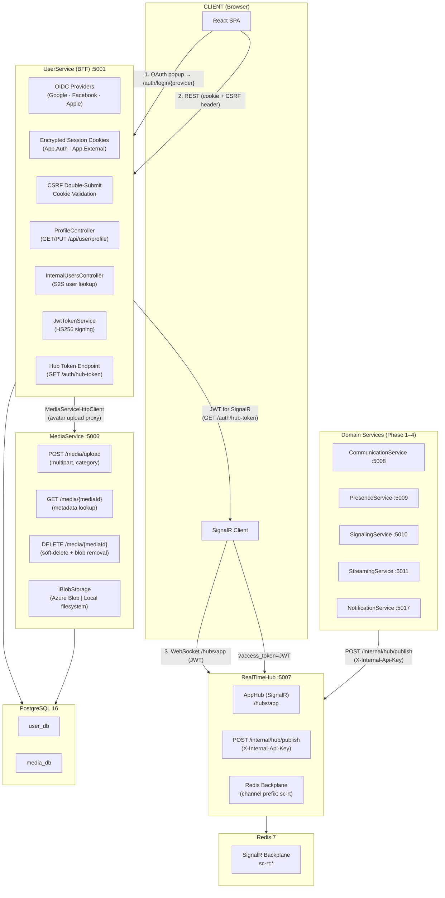
```mermaid
graph TB
    subgraph Client ["CLIENT (Browser)"]
        React["React SPA"]
        SRClient["SignalR Client"]
    end

    React -- "1. OAuth popup → /auth/login/{provider}" --> UserSvc
    React -- "2. REST (cookie + CSRF header)" --> UserSvc
    SRClient -- "3. WebSocket /hubs/app (JWT)" --> RTHub

    subgraph UserSvc ["UserService (BFF) :5001"]
        OIDC["OIDC Providers<br />(Google · Facebook · Apple)"]
        Cookies["Encrypted Session Cookies<br />(App.Auth · App.External)"]
        CSRF["CSRF Double-Submit<br />Cookie Validation"]
        Profile["ProfileController<br />(GET/PUT /api/user/profile)"]
        Internal["InternalUsersController<br />(S2S user lookup)"]
        JWT["JwtTokenService<br />(HS256 signing)"]
        HubToken["Hub Token Endpoint<br />(GET /auth/hub-token)"]
    end

    subgraph MediaSvc ["MediaService :5006"]
        Upload["POST /media/upload<br />(multipart, category)"]
        Meta["GET /media/{mediaId}<br />(metadata lookup)"]
        Delete["DELETE /media/{mediaId}<br />(soft-delete + blob removal)"]
        BlobSvc["IBlobStorage<br />(Azure Blob | Local filesystem)"]
    end

    subgraph RTHub ["RealTimeHub :5007"]
        Hub["AppHub (SignalR)<br />/hubs/app"]
        InternalAPI["POST /internal/hub/publish<br />(X-Internal-Api-Key)"]
        Backplane["Redis Backplane<br />(channel prefix: sc-rt)"]
    end

    UserSvc -- "MediaServiceHttpClient<br />(avatar upload proxy)" --> MediaSvc
    UserSvc -- "JWT for SignalR<br />(GET /auth/hub-token)" --> SRClient
    SRClient -- "?access_token=JWT" --> RTHub

    subgraph DomainServices ["Domain Services (Phase 1–4)"]
        Comm["CommunicationService :5008"]
        Pres["PresenceService :5009"]
        Sig["SignalingService :5010"]
        Stream["StreamingService :5011"]
        Notif["NotificationService :5017"]
    end

    DomainServices -- "POST /internal/hub/publish<br />(X-Internal-Api-Key)" --> RTHub

    subgraph PG ["PostgreSQL 16"]
        DB1["user_db"]
        DB2["media_db"]
    end

    subgraph RedisStore ["Redis 7"]
        BP["SignalR Backplane<br />sc-rt:*"]
    end

    UserSvc --> PG
    MediaSvc --> PG
    RTHub --> RedisStore
```

---

## 1. UserService — BFF Gateway

### 1a. Authentication Architecture

The UserService is the **sole entry point** for browser clients. It
implements a **Backend for Frontend (BFF)** pattern — the SPA never
holds long-lived tokens directly. Authentication state is managed
server-side via encrypted session cookies (`App.Auth`).

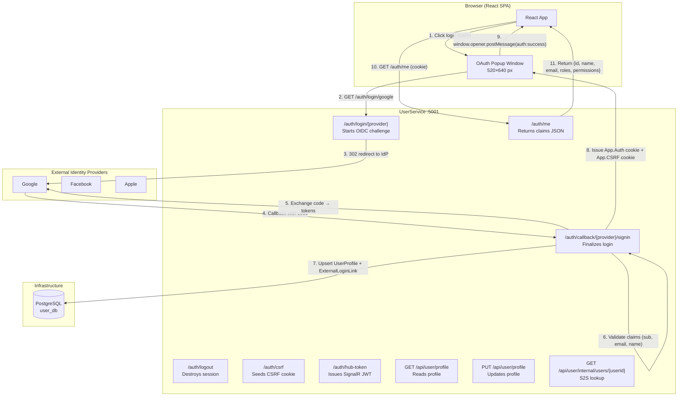
```mermaid
graph TB
    subgraph Browser ["Browser (React SPA)"]
        SPA["React App"]
        Popup["OAuth Popup Window<br />520×640 px"]
    end

    subgraph BFF ["UserService :5001"]
        Start["/auth/login/{provider}<br />Starts OIDC challenge"]
        Callback["/auth/callback/{provider}/signin<br />Finalizes login"]
        Me["/auth/me<br />Returns claims JSON"]
        Logout["/auth/logout<br />Destroys session"]
        CsrfEP["/auth/csrf<br />Seeds CSRF cookie"]
        HubToken["/auth/hub-token<br />Issues SignalR JWT"]
        ProfileGet["GET /api/user/profile<br />Reads profile"]
        ProfilePut["PUT /api/user/profile<br />Updates profile"]
        InternalGet["GET /api/user/internal/users/{userId}<br />S2S lookup"]
    end

    subgraph IdPs ["External Identity Providers"]
        Google["Google"]
        Facebook["Facebook"]
        Apple["Apple"]
    end

    subgraph Storage ["Infrastructure"]
        PG[("PostgreSQL<br />user_db")]
    end

    SPA -- "1. Click login button" --> Popup
    Popup -- "2. GET /auth/login/google" --> Start
    Start -- "3. 302 redirect to IdP" --> Google
    Google -- "4. Callback with code" --> Callback
    Callback -- "5. Exchange code → tokens" --> Google
    Callback -- "6. Validate claims (sub, email, name)" --> Callback
    Callback -- "7. Upsert UserProfile + ExternalLoginLink" --> PG
    Callback -- "8. Issue App.Auth cookie + App.CSRF cookie" --> Popup
    Popup -- "9. window.opener.postMessage(auth:success)" --> SPA
    SPA -- "10. GET /auth/me (cookie)" --> Me
    Me -- "11. Return {id, name, email, roles, permissions}" --> SPA
```

### 1b. OIDC Provider Flow — Detailed

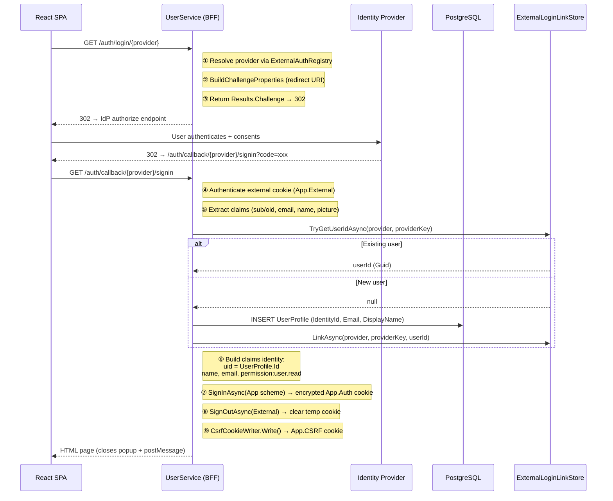
```mermaid
sequenceDiagram
    participant SPA as React SPA
    participant BFF as UserService (BFF)
    participant IdP as Identity Provider
    participant DB as PostgreSQL
    participant Store as ExternalLoginLinkStore

    SPA->>BFF: GET /auth/login/{provider}

    Note right of BFF: ① Resolve provider via ExternalAuthRegistry
    Note right of BFF: ② BuildChallengeProperties (redirect URI)
    Note right of BFF: ③ Return Results.Challenge → 302

    BFF-->>SPA: 302 → IdP authorize endpoint

    SPA->>IdP: User authenticates + consents
    IdP-->>SPA: 302 → /auth/callback/{provider}/signin?code=xxx

    SPA->>BFF: GET /auth/callback/{provider}/signin

    Note right of BFF: ④ Authenticate external cookie (App.External)
    Note right of BFF: ⑤ Extract claims (sub/oid, email, name, picture)

    BFF->>Store: TryGetUserIdAsync(provider, providerKey)
    alt Existing user
        Store-->>BFF: userId (Guid)
    else New user
        Store-->>BFF: null
        BFF->>DB: INSERT UserProfile (IdentityId, Email, DisplayName)
        BFF->>Store: LinkAsync(provider, providerKey, userId)
    end

    Note right of BFF: ⑥ Build claims identity:<br/>uid = UserProfile.Id<br/>name, email, permission:user.read

    Note right of BFF: ⑦ SignInAsync(App scheme) → encrypted App.Auth cookie
    Note right of BFF: ⑧ SignOutAsync(External) → clear temp cookie
    Note right of BFF: ⑨ CsrfCookieWriter.Write() → App.CSRF cookie

    BFF-->>SPA: HTML page (closes popup + postMessage)
```

### 1c. Cookie Architecture

The UserService uses a **dual-cookie scheme** for authentication,
plus a separate CSRF cookie for write protection:

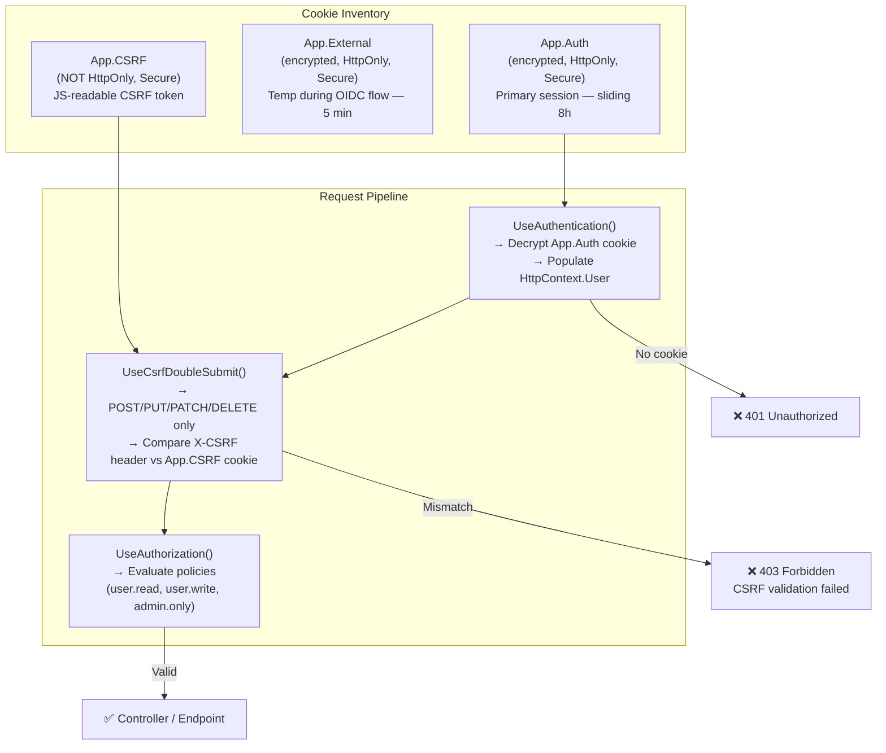
```mermaid
flowchart TD
    subgraph Cookies ["Cookie Inventory"]
        AppAuth["App.Auth<br />(encrypted, HttpOnly, Secure)<br />Primary session — sliding 8h"]
        AppExt["App.External<br />(encrypted, HttpOnly, Secure)<br />Temp during OIDC flow — 5 min"]
        AppCSRF["App.CSRF<br />(NOT HttpOnly, Secure)<br />JS-readable CSRF token"]
    end

    subgraph Middleware ["Request Pipeline"]
        AuthMW["UseAuthentication()<br />→ Decrypt App.Auth cookie<br />→ Populate HttpContext.User"]
        CsrfMW["UseCsrfDoubleSubmit()<br />→ POST/PUT/PATCH/DELETE only<br />→ Compare X-CSRF header vs App.CSRF cookie"]
        AuthzMW["UseAuthorization()<br />→ Evaluate policies<br />(user.read, user.write, admin.only)"]
    end

    AppAuth --> AuthMW
    AppCSRF --> CsrfMW
    AuthMW --> CsrfMW
    CsrfMW --> AuthzMW
    AuthzMW -- "Valid" --> OK["✅ Controller / Endpoint"]
    CsrfMW -- "Mismatch" --> R403["❌ 403 Forbidden<br />CSRF validation failed"]
    AuthMW -- "No cookie" --> R401["❌ 401 Unauthorized"]
```

### 1d. CSRF — Double-Submit Cookie Pattern

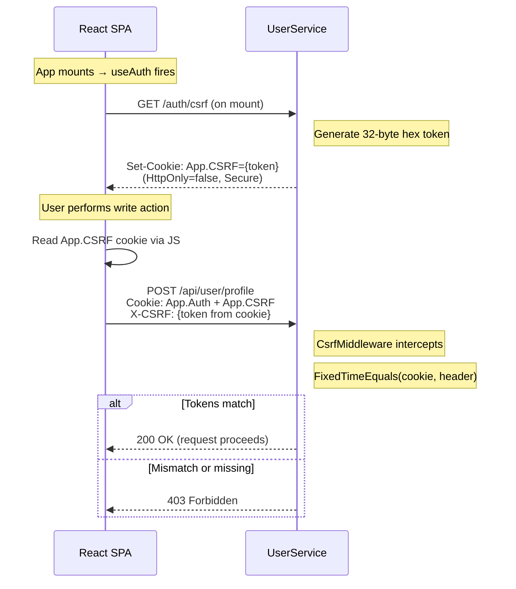
```mermaid
sequenceDiagram
    participant SPA as React SPA
    participant BFF as UserService

    Note over SPA: App mounts → useAuth fires
    SPA->>BFF: GET /auth/csrf (on mount)
    Note right of BFF: Generate 32-byte hex token
    BFF-->>SPA: Set-Cookie: App.CSRF={token}<br/>(HttpOnly=false, Secure)

    Note over SPA: User performs write action
    SPA->>SPA: Read App.CSRF cookie via JS
    SPA->>BFF: POST /api/user/profile<br/>Cookie: App.Auth + App.CSRF<br/>X-CSRF: {token from cookie}

    Note right of BFF: CsrfMiddleware intercepts
    Note right of BFF: FixedTimeEquals(cookie, header)
    alt Tokens match
        BFF-->>SPA: 200 OK (request proceeds)
    else Mismatch or missing
        BFF-->>SPA: 403 Forbidden
    end
```

### 1e. Internal JWT Issuance (SignalR Hub Token)

The SPA needs a short-lived JWT to authenticate with the SignalR hub.
The `/auth/hub-token` endpoint issues this token from the existing
cookie session:

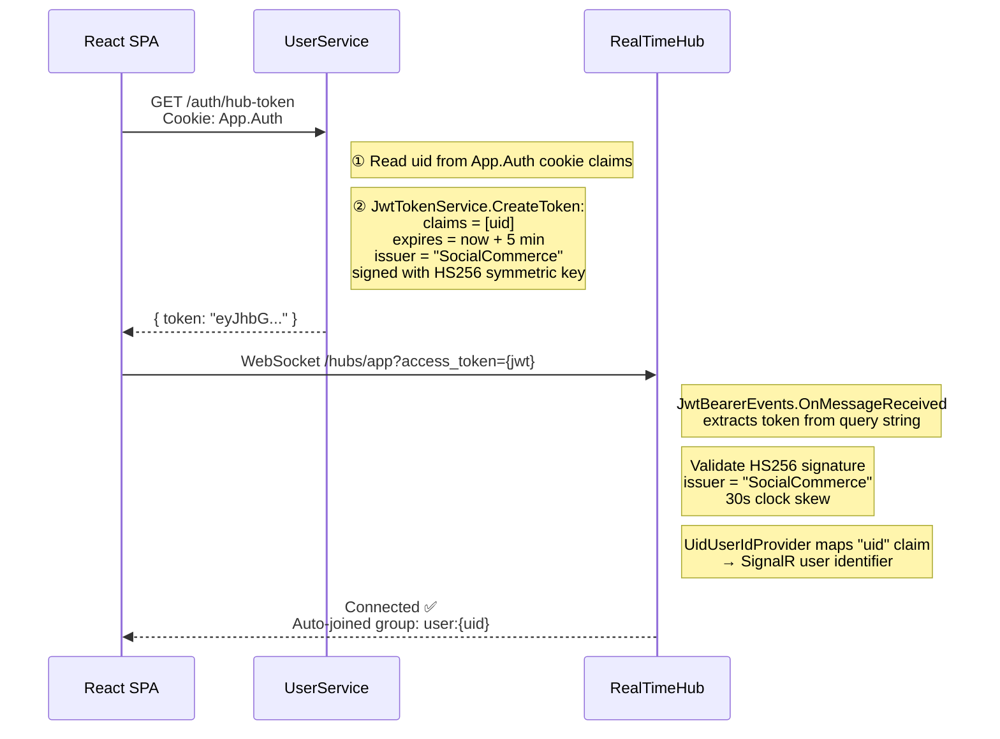
```mermaid
sequenceDiagram
    participant SPA as React SPA
    participant BFF as UserService
    participant Hub as RealTimeHub

    SPA->>BFF: GET /auth/hub-token<br/>Cookie: App.Auth

    Note right of BFF: ① Read uid from App.Auth cookie claims
    Note right of BFF: ② JwtTokenService.CreateToken:<br/>claims = [uid]<br/>expires = now + 5 min<br/>issuer = "SocialCommerce"<br/>signed with HS256 symmetric key

    BFF-->>SPA: { token: "eyJhbG..." }

    SPA->>Hub: WebSocket /hubs/app?access_token={jwt}

    Note right of Hub: JwtBearerEvents.OnMessageReceived<br/>extracts token from query string
    Note right of Hub: Validate HS256 signature<br/>issuer = "SocialCommerce"<br/>30s clock skew
    Note right of Hub: UidUserIdProvider maps "uid" claim<br/>→ SignalR user identifier

    Hub-->>SPA: Connected ✅<br/>Auto-joined group: user:{uid}
```

### 1f. External Provider Registry

The `ExternalAuthRegistrar` conditionally registers OAuth providers
based on configuration availability:

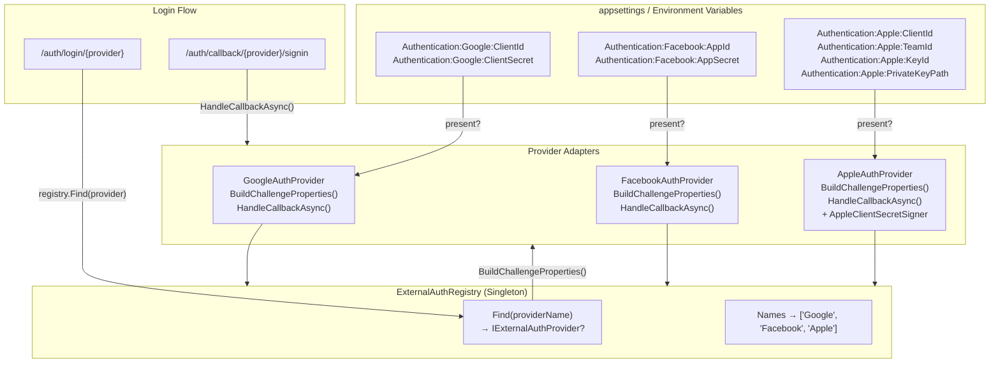
```mermaid
flowchart TD
    subgraph Config ["appsettings / Environment Variables"]
        GC["Authentication:Google:ClientId<br />Authentication:Google:ClientSecret"]
        FC["Authentication:Facebook:AppId<br />Authentication:Facebook:AppSecret"]
        AC["Authentication:Apple:ClientId<br />Authentication:Apple:TeamId<br />Authentication:Apple:KeyId<br />Authentication:Apple:PrivateKeyPath"]
    end

    subgraph Registry ["ExternalAuthRegistry (Singleton)"]
        Resolve["Find(providerName)<br />→ IExternalAuthProvider?"]
        Names["Names → ['Google', 'Facebook', 'Apple']"]
    end

    subgraph Providers ["Provider Adapters"]
        GP["GoogleAuthProvider<br />BuildChallengeProperties()<br />HandleCallbackAsync()"]
        FP["FacebookAuthProvider<br />BuildChallengeProperties()<br />HandleCallbackAsync()"]
        AP["AppleAuthProvider<br />BuildChallengeProperties()<br />HandleCallbackAsync()<br />+ AppleClientSecretSigner"]
    end

    GC -- "present?" --> GP
    FC -- "present?" --> FP
    AC -- "present?" --> AP
    GP --> Registry
    FP --> Registry
    AP --> Registry

    subgraph Flow ["Login Flow"]
        Start["/auth/login/{provider}"]
        CB["/auth/callback/{provider}/signin"]
    end

    Start -- "registry.Find(provider)" --> Resolve
    Resolve -- "BuildChallengeProperties()" --> Providers
    CB -- "HandleCallbackAsync()" --> Providers
```

### 1g. UserService Entity Model

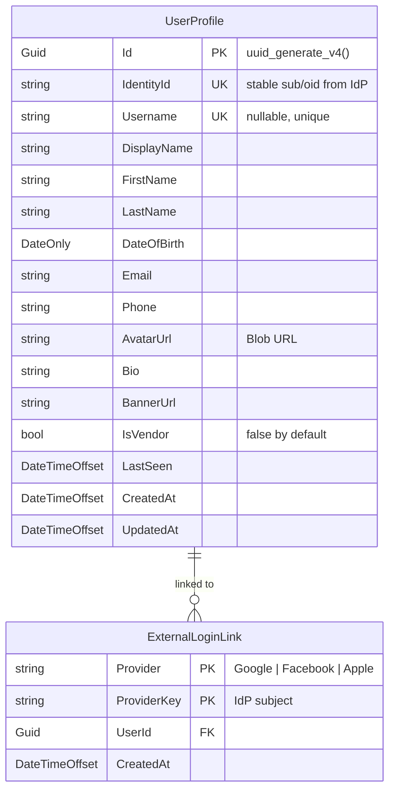
```mermaid
erDiagram
    UserProfile ||--o{ ExternalLoginLink : "linked to"

    UserProfile {
        Guid Id PK "uuid_generate_v4()"
        string IdentityId UK "stable sub/oid from IdP"
        string Username UK "nullable, unique"
        string DisplayName
        string FirstName
        string LastName
        DateOnly DateOfBirth
        string Email
        string Phone
        string AvatarUrl "Blob URL"
        string Bio
        string BannerUrl
        bool IsVendor "false by default"
        DateTimeOffset LastSeen
        DateTimeOffset CreatedAt
        DateTimeOffset UpdatedAt
    }

    ExternalLoginLink {
        string Provider PK "Google | Facebook | Apple"
        string ProviderKey PK "IdP subject"
        Guid UserId FK
        DateTimeOffset CreatedAt
    }
```

### 1h. Authorization Policies

| Policy | Requirement | Usage |
|---|---|---|
| `user.read` | `permission` claim contains `user.read` | `GET /api/user/profile` |
| `user.write` | `permission` claim contains `user.write` | `PUT /api/user/profile` |
| `orders.read` | `permission` claim contains `orders.read` | Future order access |
| `orders.write` | `permission` claim contains `orders.write` | Future order mutations |
| `admin.only` | Role = `Admin` | Administrative endpoints |

---

## 2. MediaService — File Upload & Asset Management

### 2a. Media Architecture Overview

MediaService provides a **unified upload/download/delete API** for all
domain services. It stores metadata in PostgreSQL and delegates binary
storage to a pluggable `IBlobStorage` backend — Azure Blob Storage in
production, local filesystem in development.

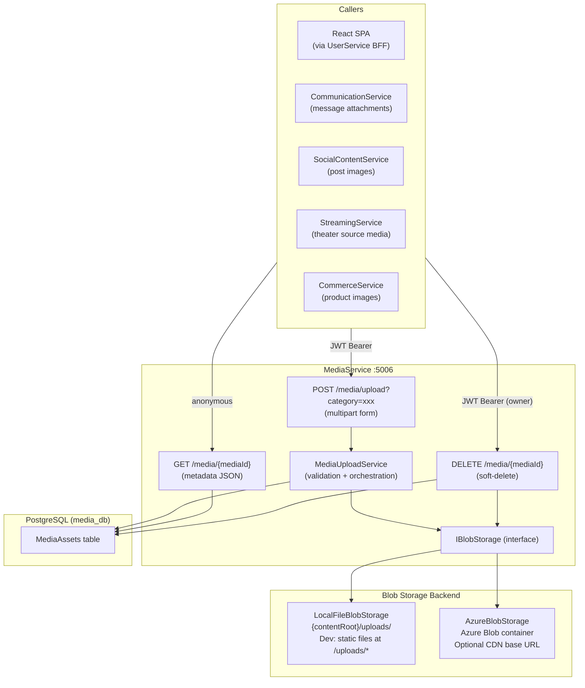
```mermaid
graph TB
    subgraph Callers ["Callers"]
        SPA["React SPA<br />(via UserService BFF)"]
        Comm["CommunicationService<br />(message attachments)"]
        SCS["SocialContentService<br />(post images)"]
        Stream["StreamingService<br />(theater source media)"]
        Commerce["CommerceService<br />(product images)"]
    end

    subgraph MediaSvc ["MediaService :5006"]
        UploadEP["POST /media/upload?category=xxx<br />(multipart form)"]
        GetEP["GET /media/{mediaId}<br />(metadata JSON)"]
        DeleteEP["DELETE /media/{mediaId}<br />(soft-delete)"]
        UploadSvc["MediaUploadService<br />(validation + orchestration)"]
        BlobIface["IBlobStorage (interface)"]
    end

    subgraph BlobBackend ["Blob Storage Backend"]
        Local["LocalFileBlobStorage<br />{contentRoot}/uploads/<br />Dev: static files at /uploads/*"]
        Azure["AzureBlobStorage<br />Azure Blob container<br />Optional CDN base URL"]
    end

    subgraph DB ["PostgreSQL (media_db)"]
        Assets["MediaAssets table"]
    end

    Callers -- "JWT Bearer" --> UploadEP
    Callers -- "anonymous" --> GetEP
    Callers -- "JWT Bearer (owner)" --> DeleteEP

    UploadEP --> UploadSvc
    UploadSvc --> BlobIface
    UploadSvc --> Assets
    BlobIface --> Local
    BlobIface --> Azure

    GetEP --> Assets
    DeleteEP --> Assets
    DeleteEP --> BlobIface
```

### 2b. Upload Flow — Detailed

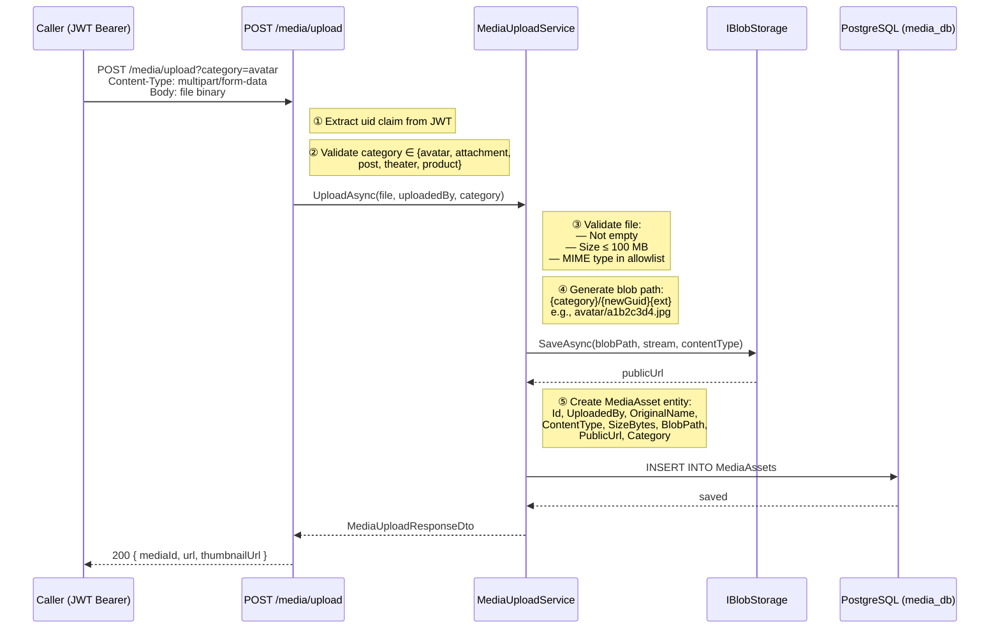
```mermaid
sequenceDiagram
    participant Client as Caller (JWT Bearer)
    participant EP as POST /media/upload
    participant Svc as MediaUploadService
    participant Blob as IBlobStorage
    participant DB as PostgreSQL (media_db)

    Client->>EP: POST /media/upload?category=avatar<br/>Content-Type: multipart/form-data<br/>Body: file binary

    Note right of EP: ① Extract uid claim from JWT
    Note right of EP: ② Validate category ∈ {avatar, attachment,<br/>post, theater, product}

    EP->>Svc: UploadAsync(file, uploadedBy, category)

    Note right of Svc: ③ Validate file:<br/>— Not empty<br/>— Size ≤ 100 MB<br/>— MIME type in allowlist

    Note right of Svc: ④ Generate blob path:<br/>{category}/{newGuid}{ext}<br/>e.g., avatar/a1b2c3d4.jpg

    Svc->>Blob: SaveAsync(blobPath, stream, contentType)
    Blob-->>Svc: publicUrl

    Note right of Svc: ⑤ Create MediaAsset entity:<br/>Id, UploadedBy, OriginalName,<br/>ContentType, SizeBytes, BlobPath,<br/>PublicUrl, Category

    Svc->>DB: INSERT INTO MediaAssets
    DB-->>Svc: saved

    Svc-->>EP: MediaUploadResponseDto
    EP-->>Client: 200 { mediaId, url, thumbnailUrl }
```

### 2c. Allowed MIME Types & Size Limits

| Category | Allowed Types | Max Size |
|---|---|---|
| `avatar` | image/jpeg, image/png, image/gif, image/webp | 100 MB |
| `attachment` | All image, video, audio, PDF types | 100 MB |
| `post` | image/jpeg, image/png, image/gif, image/webp | 100 MB |
| `theater` | video/mp4, video/webm | 100 MB |
| `product` | image/jpeg, image/png, image/gif, image/webp | 100 MB |

Full MIME allowlist: `image/jpeg`, `image/png`, `image/gif`, `image/webp`,
`video/mp4`, `video/webm`, `audio/mpeg`, `audio/ogg`, `audio/wav`,
`application/pdf`.

### 2d. Blob Storage — Pluggable Backend

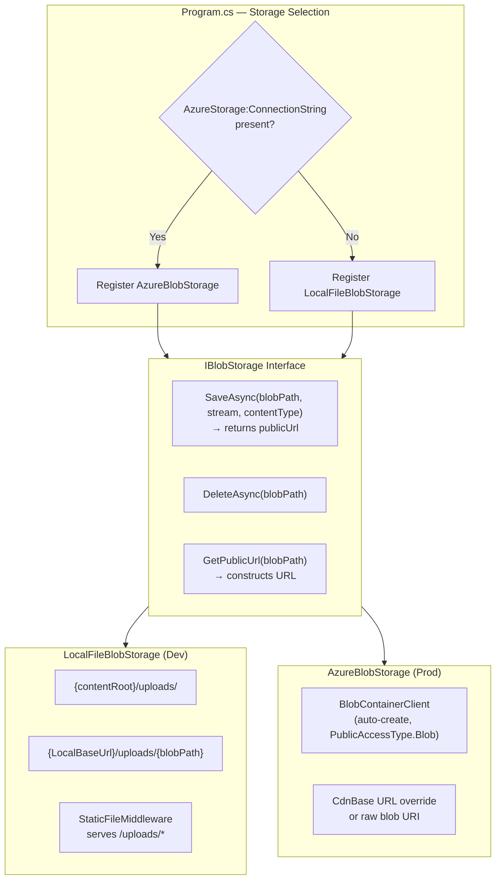
```mermaid
flowchart TD
    subgraph Registration ["Program.cs — Storage Selection"]
        Check{"AzureStorage:ConnectionString<br />present?"}
        Check -- Yes --> AZ["Register AzureBlobStorage"]
        Check -- No --> LC["Register LocalFileBlobStorage"]
    end

    subgraph IBlobStorage ["IBlobStorage Interface"]
        Save["SaveAsync(blobPath, stream, contentType)<br />→ returns publicUrl"]
        Del["DeleteAsync(blobPath)"]
        Url["GetPublicUrl(blobPath)<br />→ constructs URL"]
    end

    subgraph LocalImpl ["LocalFileBlobStorage (Dev)"]
        LRoot["{contentRoot}/uploads/"]
        LUrl["{LocalBaseUrl}/uploads/{blobPath}"]
        LServe["StaticFileMiddleware<br />serves /uploads/*"]
    end

    subgraph AzureImpl ["AzureBlobStorage (Prod)"]
        AContainer["BlobContainerClient<br />(auto-create, PublicAccessType.Blob)"]
        ACdn["CdnBase URL override<br />or raw blob URI"]
    end

    AZ --> IBlobStorage
    LC --> IBlobStorage
    IBlobStorage --> LocalImpl
    IBlobStorage --> AzureImpl
```

### 2e. MediaService Entity Model

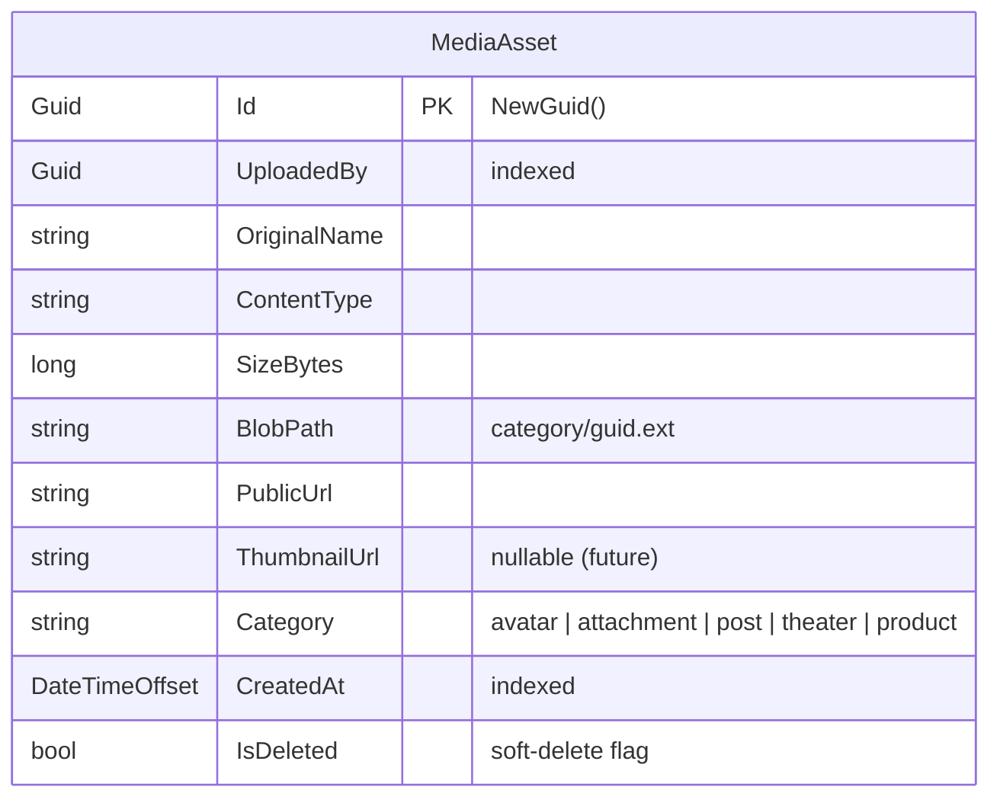
```mermaid
erDiagram
    MediaAsset {
        Guid Id PK "NewGuid()"
        Guid UploadedBy "indexed"
        string OriginalName
        string ContentType
        long SizeBytes
        string BlobPath "category/guid.ext"
        string PublicUrl
        string ThumbnailUrl "nullable (future)"
        string Category "avatar | attachment | post | theater | product"
        DateTimeOffset CreatedAt "indexed"
        bool IsDeleted "soft-delete flag"
    }
```

### 2f. Cross-Service Media References

Domain services store the `MediaId` (Guid) returned by the upload
endpoint. They resolve the public URL by calling `GET /media/{mediaId}`
when needed:

| Domain Service | Media Category | Usage |
|---|---|---|
| UserService | `avatar` | User profile avatar URL |
| CommunicationService | `attachment` | Message attachments |
| SocialContentService | `post` | Post images and media |
| StreamingService | `theater` | Theater source video |
| CommerceService | `product` | Product listing images |

---

## 3. RealTimeHub — Centralized WebSocket Gateway

### 3a. Hub Architecture Overview

RealTimeHub is the **single WebSocket endpoint** for the entire
platform. Domain services never maintain their own WebSocket
connections. Instead, they publish events to the hub via an internal
HTTP API, and the hub broadcasts them to connected clients over
SignalR.

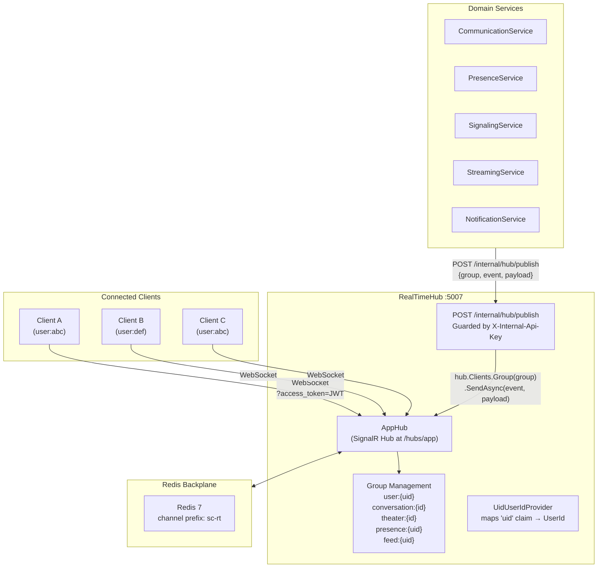
```mermaid
graph TB
    subgraph Clients ["Connected Clients"]
        C1["Client A<br />(user:abc)"]
        C2["Client B<br />(user:def)"]
        C3["Client C<br />(user:abc)"]
    end

    subgraph Hub ["RealTimeHub :5007"]
        AppHub["AppHub<br />(SignalR Hub at /hubs/app)"]
        Groups["Group Management<br />user:{uid}<br />conversation:{id}<br />theater:{id}<br />presence:{uid}<br />feed:{uid}"]
        InternalEP["POST /internal/hub/publish<br />Guarded by X-Internal-Api-Key"]
        UidProvider["UidUserIdProvider<br />maps 'uid' claim → UserId"]
    end

    subgraph Backplane ["Redis Backplane"]
        Redis["Redis 7<br />channel prefix: sc-rt"]
    end

    subgraph Services ["Domain Services"]
        Comm["CommunicationService"]
        Pres["PresenceService"]
        Sig["SignalingService"]
        Stream["StreamingService"]
        Notif["NotificationService"]
    end

    C1 -- "WebSocket<br />?access_token=JWT" --> AppHub
    C2 -- "WebSocket" --> AppHub
    C3 -- "WebSocket" --> AppHub

    AppHub --> Groups
    AppHub <--> Backplane

    Services -- "POST /internal/hub/publish<br />{group, event, payload}" --> InternalEP
    InternalEP -- "hub.Clients.Group(group)<br />.SendAsync(event, payload)" --> AppHub
```

### 3b. SignalR Connection Lifecycle

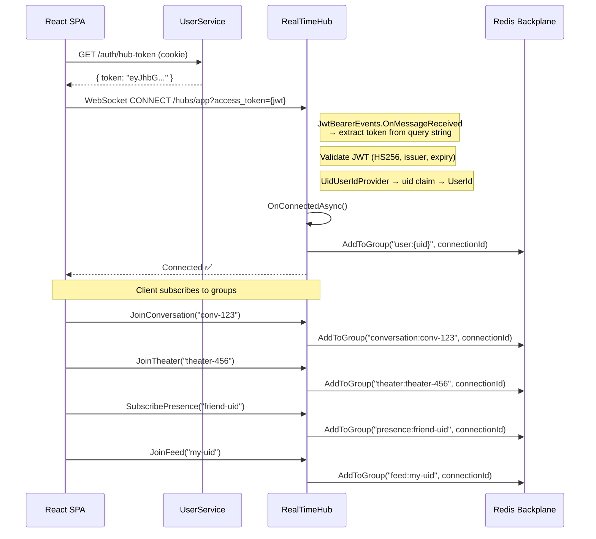
```mermaid
sequenceDiagram
    participant SPA as React SPA
    participant BFF as UserService
    participant Hub as RealTimeHub
    participant Redis as Redis Backplane

    SPA->>BFF: GET /auth/hub-token (cookie)
    BFF-->>SPA: { token: "eyJhbG..." }

    SPA->>Hub: WebSocket CONNECT /hubs/app?access_token={jwt}

    Note right of Hub: JwtBearerEvents.OnMessageReceived<br/>→ extract token from query string
    Note right of Hub: Validate JWT (HS256, issuer, expiry)
    Note right of Hub: UidUserIdProvider → uid claim → UserId

    Hub->>Hub: OnConnectedAsync()
    Hub->>Redis: AddToGroup("user:{uid}", connectionId)
    Hub-->>SPA: Connected ✅

    Note over SPA,Hub: Client subscribes to groups

    SPA->>Hub: JoinConversation("conv-123")
    Hub->>Redis: AddToGroup("conversation:conv-123", connectionId)

    SPA->>Hub: JoinTheater("theater-456")
    Hub->>Redis: AddToGroup("theater:theater-456", connectionId)

    SPA->>Hub: SubscribePresence("friend-uid")
    Hub->>Redis: AddToGroup("presence:friend-uid", connectionId)

    SPA->>Hub: JoinFeed("my-uid")
    Hub->>Redis: AddToGroup("feed:my-uid", connectionId)
```

### 3c. Internal Publish — Service-to-Client Event Delivery

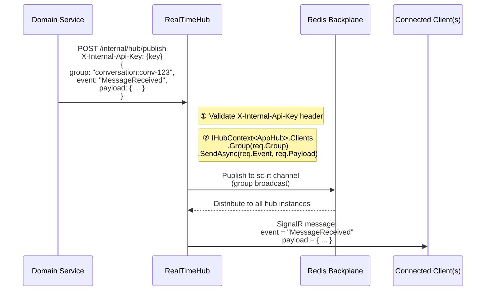
```mermaid
sequenceDiagram
    participant Svc as Domain Service
    participant Hub as RealTimeHub
    participant Redis as Redis Backplane
    participant Client as Connected Client(s)

    Svc->>Hub: POST /internal/hub/publish<br/>X-Internal-Api-Key: {key}<br/>{<br/>  group: "conversation:conv-123",<br/>  event: "MessageReceived",<br/>  payload: { ... }<br/>}

    Note right of Hub: ① Validate X-Internal-Api-Key header
    Note right of Hub: ② IHubContext<AppHub>.Clients<br/>.Group(req.Group)<br/>.SendAsync(req.Event, req.Payload)

    Hub->>Redis: Publish to sc-rt channel<br/>(group broadcast)
    Redis-->>Hub: Distribute to all hub instances

    Hub->>Client: SignalR message:<br/>event = "MessageReceived"<br/>payload = { ... }
```

### 3d. SignalR Group Schema

| Group Pattern | Managed By | Purpose |
|---|---|---|
| `user:{userId}` | Auto-join on connect | Direct-to-user notifications, personal events |
| `conversation:{conversationId}` | `JoinConversation()` / `LeaveConversation()` | Real-time messaging, typing indicators, reactions |
| `theater:{theaterId}` | `JoinTheater()` / `LeaveTheater()` | Playback sync, theater chat, viewer events |
| `presence:{userId}` | `SubscribePresence()` / `UnsubscribePresence()` | Online/offline/idle status updates for a tracked user |
| `feed:{userId}` | `JoinFeed()` | Real-time feed updates (new posts, social events) |

### 3e. Internal API Security

The `/internal/hub/publish` endpoint is **not authenticated via JWT**.
Instead, it uses a shared API key passed via the `X-Internal-Api-Key`
header. This key is configured identically across all domain services:

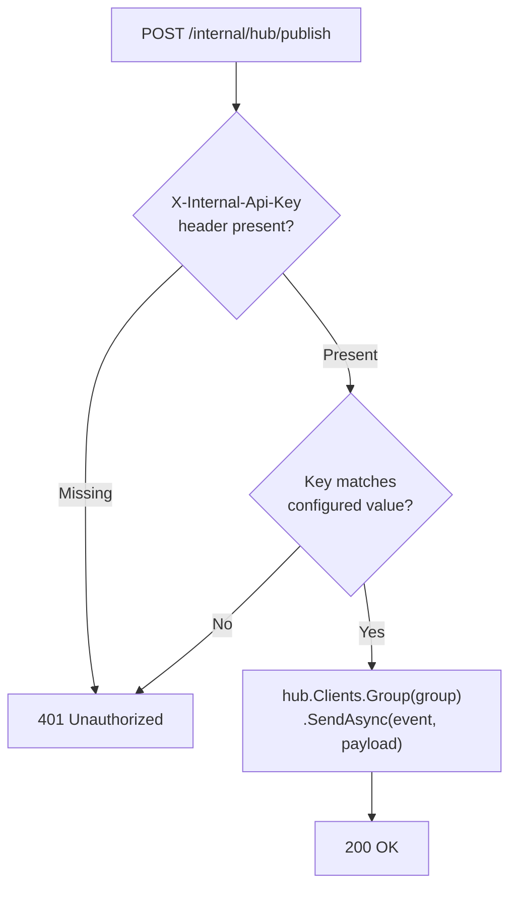
```mermaid
flowchart TD
    Req["POST /internal/hub/publish"] --> Check{"X-Internal-Api-Key<br />header present?"}
    Check -- "Missing" --> R401["401 Unauthorized"]
    Check -- "Present" --> Match{"Key matches<br />configured value?"}
    Match -- "No" --> R401
    Match -- "Yes" --> Dispatch["hub.Clients.Group(group)<br />.SendAsync(event, payload)"]
    Dispatch --> OK["200 OK"]
```

| Config Key | Default Value | Used By |
|---|---|---|
| `Internal:ApiKey` | `sc-dev-internal-api-key` | All domain services + RealTimeHub |

---

## 4. Shared Contracts Library

The `Contracts` project defines the cross-service event schema used
by all domain services for asynchronous communication via Redis
Pub/Sub and Azure Service Bus.

### 4a. Event Envelope

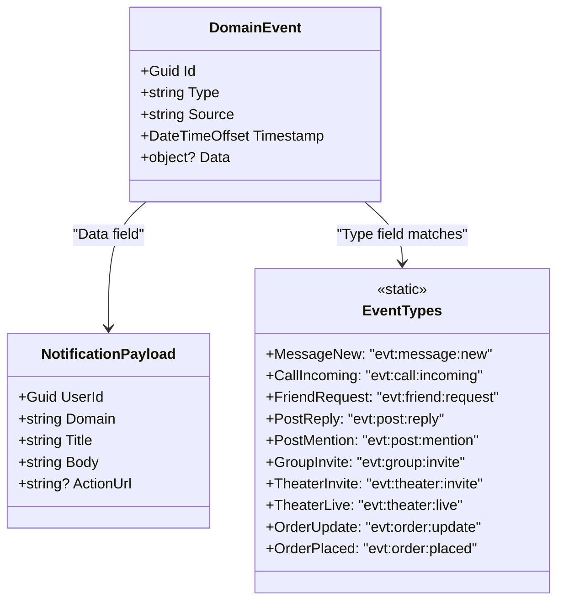
```mermaid
classDiagram
    class DomainEvent {
        +Guid Id
        +string Type
        +string Source
        +DateTimeOffset Timestamp
        +object? Data
    }

    class NotificationPayload {
        +Guid UserId
        +string Domain
        +string Title
        +string Body
        +string? ActionUrl
    }

    class EventTypes {
        <<static>>
        +MessageNew: "evt:message:new"
        +CallIncoming: "evt:call:incoming"
        +FriendRequest: "evt:friend:request"
        +PostReply: "evt:post:reply"
        +PostMention: "evt:post:mention"
        +GroupInvite: "evt:group:invite"
        +TheaterInvite: "evt:theater:invite"
        +TheaterLive: "evt:theater:live"
        +OrderUpdate: "evt:order:update"
        +OrderPlaced: "evt:order:placed"
    }

    DomainEvent --> NotificationPayload : "Data field"
    DomainEvent --> EventTypes : "Type field matches"
```

### 4b. Event Type Catalog

| Constant | Channel | Source Service | Phase |
|---|---|---|---|
| `EventTypes.MessageNew` | `evt:message:new` | CommunicationService | 1 |
| `EventTypes.CallIncoming` | `evt:call:incoming` | SignalingService | 1 |
| `EventTypes.FriendRequest` | `evt:friend:request` | SocialGraphService | 2 |
| `EventTypes.PostReply` | `evt:post:reply` | SocialContentService | 2 |
| `EventTypes.PostMention` | `evt:post:mention` | SocialContentService | 2 |
| `EventTypes.GroupInvite` | `evt:group:invite` | SocialContentService | 2 |
| `EventTypes.TheaterInvite` | `evt:theater:invite` | StreamingService | 3 |
| `EventTypes.TheaterLive` | `evt:theater:live` | StreamingService | 3 |
| `EventTypes.OrderPlaced` | `evt:order:placed` | OrderService | 4 |
| `EventTypes.OrderUpdate` | `evt:order:update` | OrderService | 4 |

### 4c. Usage Pattern — Publishing a Domain Event

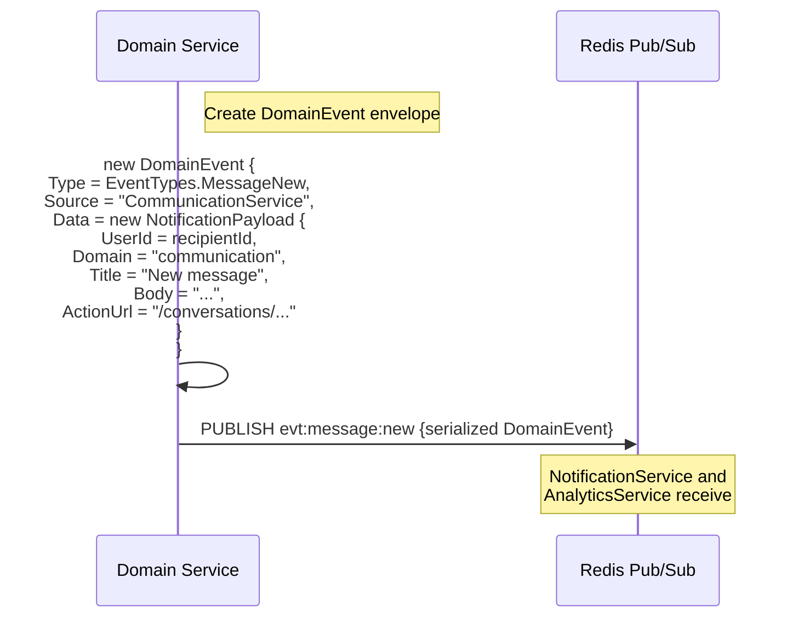
```mermaid
sequenceDiagram
    participant Svc as Domain Service
    participant Redis as Redis Pub/Sub

    Note right of Svc: Create DomainEvent envelope
    Svc->>Svc: new DomainEvent {<br/>  Type = EventTypes.MessageNew,<br/>  Source = "CommunicationService",<br/>  Data = new NotificationPayload {<br/>    UserId = recipientId,<br/>    Domain = "communication",<br/>    Title = "New message",<br/>    Body = "...",<br/>    ActionUrl = "/conversations/..."<br/>  }<br/>}

    Svc->>Redis: PUBLISH evt:message:new {serialized DomainEvent}

    Note over Redis: NotificationService and<br/>AnalyticsService receive
```

---

## 5. Cross-Service Communication Map

### 5a. Who Calls the Foundation Services

```mermaid
graph TB
    subgraph Foundation ["Foundation Services"]
        US["UserService :5001<br />(BFF Gateway)"]
        MS["MediaService :5006<br />(File Storage)"]
        RT["RealTimeHub :5007<br />(WebSocket Gateway)"]
    end

    subgraph Phase1 ["Phase 1 — Communication"]
        Comm["CommunicationService :5008"]
        Pres["PresenceService :5009"]
        Sig["SignalingService :5010"]
    end

    subgraph Phase2 ["Phase 2 — Social"]
        SCS["SocialContentService :5003"]
        SGS["SocialGraphService :5002"]
        Feed["FeedService :5004"]
        Mod["ModerationService :5005"]
    end

    subgraph Phase3 ["Phase 3 — Streaming"]
        Stream["StreamingService :5011"]
    end

    subgraph Phase4 ["Phase 4 — Commerce"]
        Commerce["CommerceService :5012"]
        Order["OrderService :5013"]
        Inventory["InventoryService :5014"]
        Analytics["AnalyticsService :5015"]
        Ad["AdService :5016"]
        Notif["NotificationService :5017"]
        Search["SearchService :5018"]
    end

    US -- "BFF proxy (JWT)" --> Comm
    US -- "BFF proxy (JWT)" --> Pres
    US -- "BFF proxy (JWT)" --> Sig
    US -- "BFF proxy (JWT)" --> SCS
    US -- "BFF proxy (JWT)" --> SGS
    US -- "BFF proxy (JWT)" --> Feed
    US -- "BFF proxy (JWT)" --> Mod
    US -- "BFF proxy (JWT)" --> Stream
    US -- "BFF proxy (JWT)" --> Commerce
    US -- "BFF proxy (JWT)" --> Order
    US -- "BFF proxy (JWT)" --> Inventory
    US -- "BFF proxy (JWT)" --> Analytics
    US -- "BFF proxy (JWT)" --> Ad
    US -- "BFF proxy (JWT)" --> Notif
    US -- "BFF proxy (JWT)" --> Search

    US -- "avatar upload" --> MS

    Comm -- "POST /internal/hub/publish" --> RT
    Pres -- "POST /internal/hub/publish" --> RT
    Sig -- "POST /internal/hub/publish" --> RT
    Stream -- "POST /internal/hub/publish" --> RT
    Notif -- "POST /internal/hub/publish" --> RT
```

### 5b. HTTP Endpoint Catalog — Foundation Services

| Caller | Callee | Endpoint | Auth | Purpose |
|---|---|---|---|---|
| Browser (SPA) | UserService | `GET /auth/login/{provider}` | 🔓 | Start OIDC login |
| Browser (SPA) | UserService | `GET /auth/callback/{provider}/signin` | 🔓 | OIDC callback |
| Browser (SPA) | UserService | `GET /auth/me` | ✅ Cookie | Current user claims |
| Browser (SPA) | UserService | `POST /auth/logout` | ✅ Cookie | Destroy session |
| Browser (SPA) | UserService | `GET /auth/csrf` | 🔓 | Seed CSRF cookie |
| Browser (SPA) | UserService | `GET /auth/hub-token` | ✅ Cookie | SignalR JWT |
| Browser (SPA) | UserService | `GET /api/user/profile` | ✅ Cookie | Read profile |
| Browser (SPA) | UserService | `PUT /api/user/profile` | ✅ Cookie | Update profile |
| Domain services | UserService | `GET /api/user/internal/users/{userId}` | ✅ JWT (ApiJwt) | S2S user lookup |
| All services | MediaService | `POST /media/upload?category=xxx` | ✅ JWT | Upload file |
| All services | MediaService | `GET /media/{mediaId}` | 🔓 | Get metadata |
| All services | MediaService | `DELETE /media/{mediaId}` | ✅ JWT (owner) | Soft-delete |
| Browser (SPA) | RealTimeHub | `WS /hubs/app?access_token=jwt` | ✅ JWT | SignalR connection |
| Domain services | RealTimeHub | `POST /internal/hub/publish` | ✅ API Key | Push event to clients |
| Anyone | MediaService | `GET /health/live` | 🔓 | Liveness probe |
| Anyone | RealTimeHub | `GET /health/live` | 🔓 | Liveness probe |

---

## 6. Data Storage Layout

### PostgreSQL

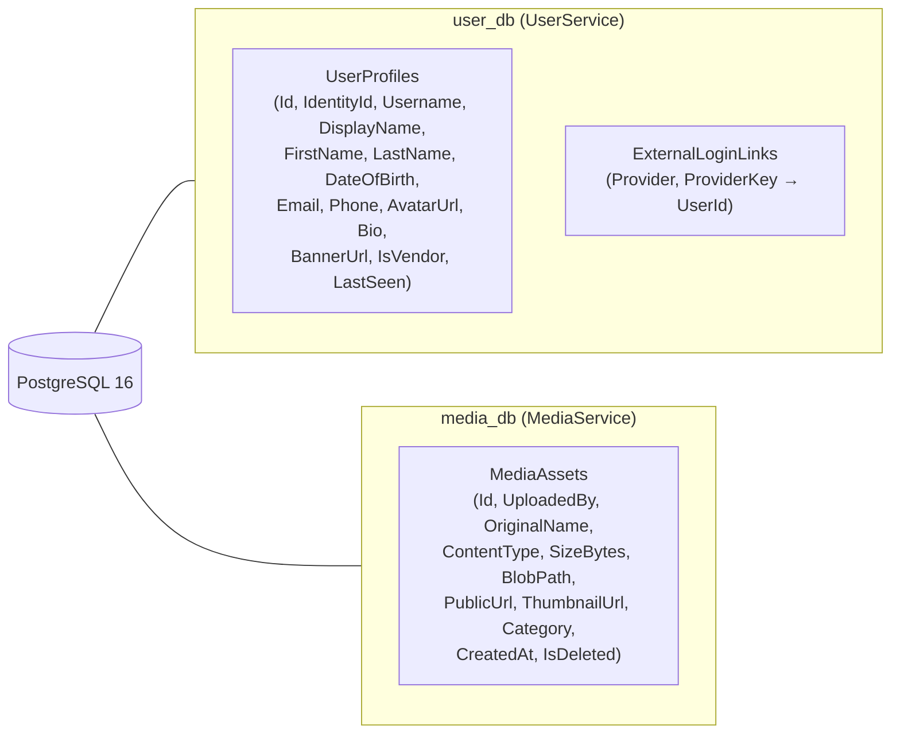
```mermaid
graph LR
    PG[("PostgreSQL 16")]

    subgraph user_db ["user_db (UserService)"]
        UserProfiles["UserProfiles<br />(Id, IdentityId, Username, DisplayName,<br />FirstName, LastName, DateOfBirth,<br />Email, Phone, AvatarUrl, Bio,<br />BannerUrl, IsVendor, LastSeen)"]
        ExternalLoginLinks["ExternalLoginLinks<br />(Provider, ProviderKey → UserId)"]
    end

    subgraph media_db ["media_db (MediaService)"]
        MediaAssets["MediaAssets<br />(Id, UploadedBy, OriginalName,<br />ContentType, SizeBytes, BlobPath,<br />PublicUrl, ThumbnailUrl, Category,<br />CreatedAt, IsDeleted)"]
    end

    PG --- user_db
    PG --- media_db
```

### Redis

```mermaid
graph LR
    REDIS[("Redis 7")]

    subgraph Backplane ["RealTimeHub Backplane"]
        SR["sc-rt:*<br />SignalR PUB/SUB channels<br />for multi-instance broadcast"]
    end

    REDIS --- Backplane
```

---

## 7. JWT Validation — Shared Across All Services

Every downstream service (Phase 1–4) validates JWTs issued by
the UserService using the same configuration pattern via
`JwtAuthExtensions`:

```mermaid
flowchart TD
    Req["Incoming Request<br />Authorization: Bearer {jwt}"] --> MW["JWT Bearer Middleware"]
    MW --> Validate["Validate Token"]

    Validate --> Sig["① Verify HS256 signature<br />(symmetric key from config)"]
    Sig --> Iss["② Validate issuer = 'SocialCommerce'"]
    Iss --> Exp["③ Validate expiration<br />(30s clock skew tolerance)"]
    Exp --> Claims["④ Extract claims<br />uid → User.FindFirstValue('uid')"]

    Claims --> OK["✅ HttpContext.User populated"]
    Sig -- "Invalid" --> Reject["❌ 401 Unauthorized"]
    Iss -- "Invalid" --> Reject
    Exp -- "Expired" --> Reject

    subgraph Config ["Shared JWT Configuration"]
        CK["Authentication:Jwt:SymmetricKey<br />→ 'sc-dev-secret-key-min-32-bytes-long!!'"]
        CI["Authentication:Jwt:Issuer<br />→ 'SocialCommerce'"]
        CV["ValidateAudience → false"]
    end
```

---

## 8. Docker Compose — Foundation Services Topology

```mermaid
graph TB
    subgraph DockerNetwork ["docker-compose network"]
        subgraph Infra ["Infrastructure"]
            PG[("PostgreSQL 16 :5432<br />user_db · media_db")]
            RD[("Redis 7 :6379<br />backplane")]
        end

        subgraph Foundation ["Phase 0 — Foundations"]
            US["userservice :5001<br />depends_on: postgres, mediaservice"]
            MS["mediaservice :5006<br />depends_on: postgres"]
            RT["realtimehub :5007<br />depends_on: redis"]
        end

        PG --- US
        PG --- MS
        RD --- RT

        US -- "HTTP (avatar upload)" --> MS
    end
```

### Environment Configuration Reference

| Service | Key | Value |
|---|---|---|
| **UserService** | `ConnectionStrings__Default` | `Host=postgres;Port=5432;Database=user_db;...` |
| | `Authentication__Jwt__Issuer` | `SocialCommerce` |
| | `Authentication__Jwt__SymmetricKey` | `sc-dev-secret-key-min-32-bytes-long!!` |
| | `MediaService__BaseUrl` | `http://mediaservice:8080` |
| | `Internal__ApiKey` | `sc-dev-internal-api-key` |
| **MediaService** | `ConnectionStrings__Default` | `Host=postgres;Port=5432;Database=media_db;...` |
| | `Authentication__Jwt__Issuer` | `SocialCommerce` |
| | `Authentication__Jwt__SymmetricKey` | `sc-dev-secret-key-min-32-bytes-long!!` |
| | `MediaService__LocalBaseUrl` | `http://localhost:5006` |
| **RealTimeHub** | `Redis__Connection` | `redis:6379,abortConnect=false` |
| | `Authentication__Jwt__Issuer` | `SocialCommerce` |
| | `Authentication__Jwt__SymmetricKey` | `sc-dev-secret-key-min-32-bytes-long!!` |
| | `Internal__ApiKey` | `sc-dev-internal-api-key` |

---

## 9. Error Handling

| Scenario | HTTP Status | Service | Handling |
|---|---|---|---|
| No App.Auth cookie or expired | `401 Unauthorized` | UserService | Authentication middleware rejects |
| CSRF header missing or mismatch | `403 Forbidden` | UserService | CsrfMiddleware returns "CSRF validation failed" |
| Unknown OIDC provider name | `500 Internal Server Error` | UserService | ExternalAuthRegistry throws `InvalidOperationException` |
| OIDC callback fails (denied / error) | `401 Unauthorized` | UserService | HandleCallbackAsync returns null |
| User profile not found (GET) | Auto-provision | UserService | ProfileController creates profile from claims |
| User profile not found (PUT) | `404 Not Found` | UserService | ProfileController returns NotFound |
| Username already taken | `409 Conflict` | UserService | Unique index check before update |
| Internal user lookup not found | `404 Not Found` | UserService | InternalUsersController returns NotFound |
| Upload: empty file | `400 Bad Request` | MediaService | ArgumentException → BadRequest |
| Upload: exceeds 100 MB | `400 Bad Request` | MediaService | ArgumentException → BadRequest |
| Upload: disallowed MIME type | `400 Bad Request` | MediaService | ArgumentException → BadRequest |
| Upload: invalid category | `400 Bad Request` | MediaService | Endpoint validates against allowlist |
| Delete: asset not found | `404 Not Found` | MediaService | Soft-delete check (IsDeleted) |
| Delete: not the owner | `403 Forbidden` | MediaService | UploadedBy ≠ uid claim |
| Hub publish: missing/wrong API key | `401 Unauthorized` | RealTimeHub | InternalEndpoints key comparison |
| SignalR: invalid/expired JWT | Connection rejected | RealTimeHub | JWT Bearer middleware rejects WebSocket upgrade |

---

## 10. Key Design Decisions

| Decision | Rationale |
|---|---|
| BFF pattern with server-side cookies (not client-held tokens) | Tokens never exposed to browser JS; eliminates XSS token theft |
| Dual cookie scheme (App + External) | Isolates transient OIDC flow from primary session; 5 min temp cookie auto-expires |
| Double-submit cookie for CSRF with constant-time comparison | Stateless CSRF protection; prevents timing attacks on token validation |
| Conditional provider registration from config | Services start without all IdPs; add providers by setting environment variables |
| HS256 symmetric JWT signing (not asymmetric) | Single-deployment topology; all services share the same key via config |
| Pluggable `IBlobStorage` (Azure vs Local) | Zero-cost development with local filesystem; production-ready Azure Blob |
| Centralized SignalR hub (not per-service WebSockets) | Single connection per client; reduces connection overhead; Redis backplane for scaling |
| Internal API key (not JWT) for hub publish | Domain services are trusted backends; avoids JWT overhead for internal calls |
| Soft-delete for media assets | Preserves references from other services; blob can be cleaned up asynchronously |
| Per-service database isolation (user_db, media_db) | Bounded context ownership; independent migration and scaling |
| Auto-provision user profile on first `/api/user/profile` GET | Seamless onboarding; no separate registration step after OIDC login |
| Sliding cookie expiration (8h) | Keeps active users logged in; inactive sessions expire naturally |

---

## API Endpoint Summary

### UserService (:5001)

| Endpoint | Method | Auth | Description |
|---|---|---|---|
| `/auth/login/{provider}` | `GET` | 🔓 | Start OIDC login (302 redirect to IdP) |
| `/auth/callback/{provider}/signin` | `GET` | 🔓 | OIDC callback (exchange code, create session) |
| `/auth/me` | `GET` | ✅ Cookie | Return current user claims (id, name, email, roles, permissions) |
| `/auth/logout` | `POST` | ✅ Cookie + CSRF | Destroy session, clear cookies |
| `/auth/csrf` | `GET` | 🔓 | Issue / refresh CSRF cookie |
| `/auth/hub-token` | `GET` | ✅ Cookie | Issue short-lived JWT for SignalR (5 min) |
| `/api/user/profile` | `GET` | ✅ Cookie (user.read) | Get authenticated user profile (auto-provisions) |
| `/api/user/profile` | `PUT` | ✅ Cookie (user.write) | Update user profile fields |
| `/api/user/internal/users/{userId}` | `GET` | ✅ JWT (ApiJwt) | S2S internal user lookup by GUID |

### MediaService (:5006)

| Endpoint | Method | Auth | Description |
|---|---|---|---|
| `/media/upload` | `POST` | ✅ JWT | Upload file (multipart, `?category=` required) |
| `/media/{mediaId}` | `GET` | 🔓 | Get media asset metadata |
| `/media/{mediaId}` | `DELETE` | ✅ JWT (owner) | Soft-delete asset + remove blob |
| `/health/live` | `GET` | 🔓 | Liveness probe |

### RealTimeHub (:5007)

| Endpoint | Method | Auth | Description |
|---|---|---|---|
| `/hubs/app` | `WS` | ✅ JWT (query string) | SignalR WebSocket endpoint |
| `/internal/hub/publish` | `POST` | ✅ API Key | Push event to SignalR group |
| `/health/live` | `GET` | 🔓 | Liveness probe |

---

## End of Document
