# Phase 7 — Seller Experience: Dataflow & Architecture

## Overview

Phase 7 documents the **end-to-end seller experience** that spans
multiple Phase 4 domain services. While individual services were
scaffolded in Phase 4, this phase describes the **cross-service seller
journey** — from shop creation and product catalog management, through
order fulfillment and inventory tracking, to sales analytics and
advertising campaigns. It unifies the seller-facing capabilities of
**InventoryService**, **AnalyticsService**, **AdService**,
**OrderService**, and **CommerceService** into a cohesive seller
dashboard workflow.

| Service | Port | Seller Role | Key Seller Endpoints |
|---|---|---|---|
| **InventoryService** | 5014 | Shop & catalog owner | Shop CRUD, product/variant management, stock tracking, CSV import/export |
| **AnalyticsService** | 5015 | Dashboard consumer | Revenue overview, order volume, top products, CSV export |
| **AdService** | 5016 | Campaign manager | Campaign CRUD, pause/resume, impression/click tracking |
| **OrderService** | 5013 | Fulfillment source | Order placement triggers seller order sync |
| **CommerceService** | 5012 | Catalog source-of-truth | Buyer-facing product catalog, reviews |
| **UserService** | 5001 | Identity & vendor flag | `IsVendor` flag on UserProfile gates seller features |

### Cross-Service Dependency Map — Seller Experience

| Component | Depends On |
|---|---|
| **InventoryService** (seller catalog) | PostgreSQL (`inventory_db`), UserService (JWT auth) |
| **AnalyticsService** (seller dashboard) | PostgreSQL (`analytics_db`), Redis (order event subscription), OrderService (event source) |
| **AdService** (promotions) | PostgreSQL (`ad_db`), InventoryService products (referenced by ID) |
| **OrderService** (fulfillment trigger) | PostgreSQL (`order_db`), InventoryService (HTTP sync), AnalyticsService (HTTP + Redis event), Redis Pub/Sub |
| **CommerceService** (buyer catalog) | PostgreSQL (`commerce_db`), synced from InventoryService product publish |

---

## High-Level Architecture

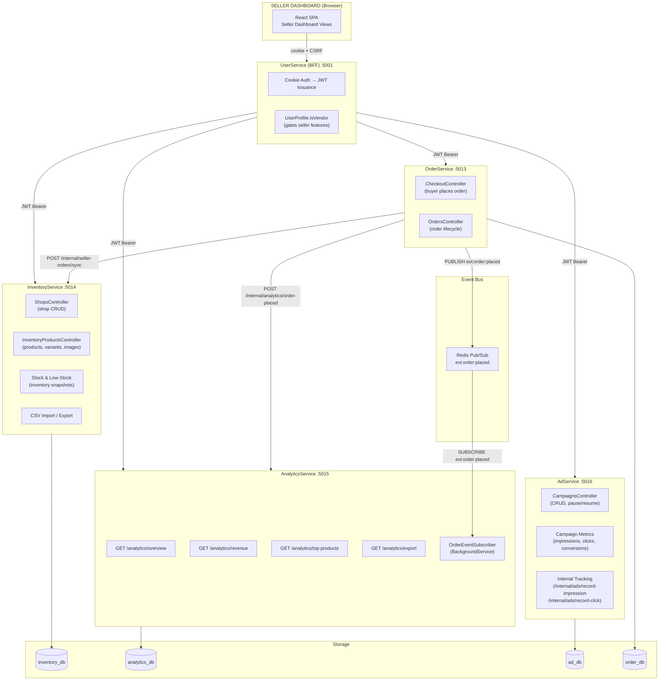
```mermaid
graph TB
    subgraph Client ["SELLER DASHBOARD (Browser)"]
        SPA["React SPA<br />Seller Dashboard Views"]
    end

    SPA -- "cookie + CSRF" --> BFF

    subgraph BFF ["UserService (BFF) :5001"]
        Auth["Cookie Auth → JWT Issuance"]
        VendorFlag["UserProfile.IsVendor<br />(gates seller features)"]
    end

    BFF -- "JWT Bearer" --> Inv
    BFF -- "JWT Bearer" --> Anl
    BFF -- "JWT Bearer" --> Ad
    BFF -- "JWT Bearer" --> Ord

    subgraph Inv ["InventoryService :5014"]
        Shops["ShopsController<br />(shop CRUD)"]
        Products["InventoryProductsController<br />(products, variants, images)"]
        Stock["Stock & Low-Stock<br />(inventory snapshots)"]
        Import["CSV Import / Export"]
    end

    subgraph Ord ["OrderService :5013"]
        Checkout["CheckoutController<br />(buyer places order)"]
        Orders["OrdersController<br />(order lifecycle)"]
    end

    subgraph Anl ["AnalyticsService :5015"]
        Overview["GET /analytics/overview"]
        Revenue["GET /analytics/revenue"]
        TopProd["GET /analytics/top-products"]
        Export["GET /analytics/export"]
        EventSub["OrderEventSubscriber<br />(BackgroundService)"]
    end

    subgraph Ad ["AdService :5016"]
        Campaigns["CampaignsController<br />(CRUD, pause/resume)"]
        Metrics["Campaign Metrics<br />(impressions, clicks, conversions)"]
        Track["Internal Tracking<br />(/internal/ads/record-impression<br />/internal/ads/record-click)"]
    end

    subgraph EventBus ["Event Bus"]
        Redis["Redis Pub/Sub<br />evt:order:placed"]
    end

    Ord -- "POST /internal/seller-orders/sync" --> Inv
    Ord -- "POST /internal/analytics/order-placed" --> Anl
    Ord -- "PUBLISH evt:order:placed" --> Redis
    Redis -- "SUBSCRIBE evt:order:placed" --> EventSub

    subgraph Storage ["Storage"]
        PG_Inv[("inventory_db")]
        PG_Anl[("analytics_db")]
        PG_Ad[("ad_db")]
        PG_Ord[("order_db")]
    end

    Inv --> PG_Inv
    Anl --> PG_Anl
    Ad --> PG_Ad
    Ord --> PG_Ord
```

---

## 1. Seller Onboarding — Shop Creation

### 1a. Vendor Flag & Shop Creation Flow

A user becomes a seller by creating a shop via InventoryService. The
`UserProfile.IsVendor` flag on the UserService side gates access to
seller dashboard features in the SPA. Each user may own **one shop**.

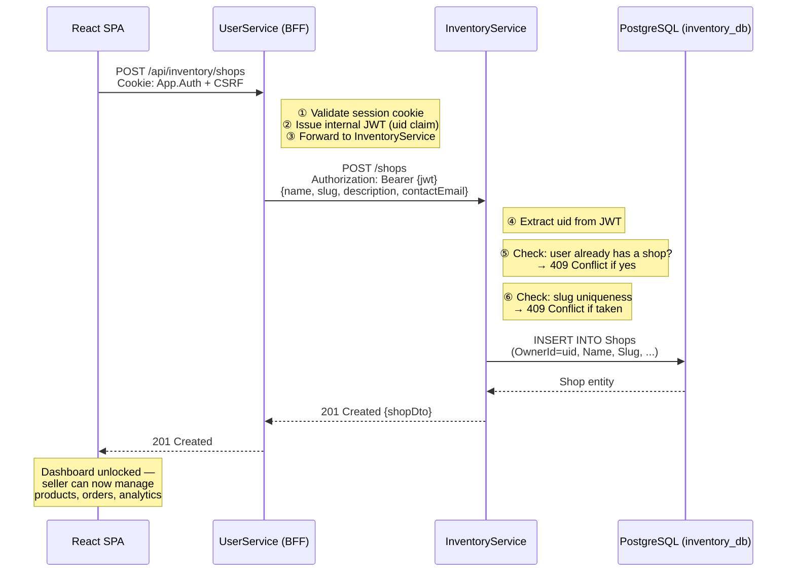
```mermaid
sequenceDiagram
    participant SPA as React SPA
    participant BFF as UserService (BFF)
    participant Inv as InventoryService
    participant DB as PostgreSQL (inventory_db)

    SPA->>BFF: POST /api/inventory/shops<br/>Cookie: App.Auth + CSRF

    Note right of BFF: ① Validate session cookie<br/>② Issue internal JWT (uid claim)<br/>③ Forward to InventoryService

    BFF->>Inv: POST /shops<br/>Authorization: Bearer {jwt}<br/>{name, slug, description, contactEmail}

    Note right of Inv: ④ Extract uid from JWT
    Note right of Inv: ⑤ Check: user already has a shop?<br/>→ 409 Conflict if yes
    Note right of Inv: ⑥ Check: slug uniqueness<br/>→ 409 Conflict if taken

    Inv->>DB: INSERT INTO Shops<br/>(OwnerId=uid, Name, Slug, ...)
    DB-->>Inv: Shop entity

    Inv-->>BFF: 201 Created {shopDto}
    BFF-->>SPA: 201 Created

    Note over SPA: Dashboard unlocked —<br/>seller can now manage<br/>products, orders, analytics
```

### 1b. Shop Entity Model

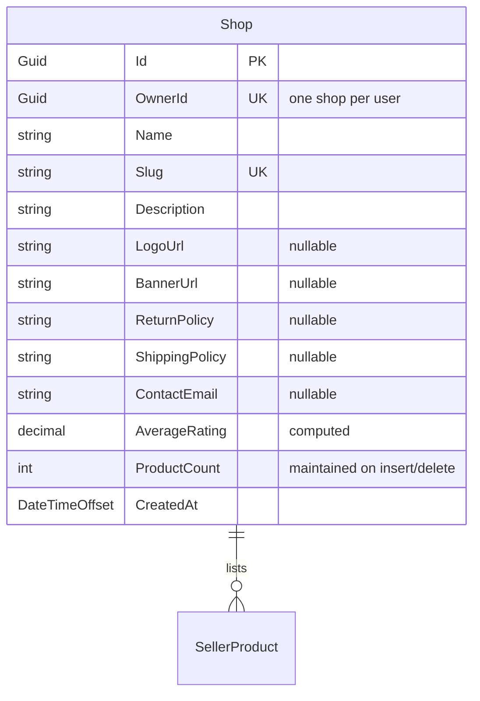
```mermaid
erDiagram
    Shop ||--o{ SellerProduct : "lists"
    Shop {
        Guid Id PK
        Guid OwnerId UK "one shop per user"
        string Name
        string Slug UK
        string Description
        string LogoUrl "nullable"
        string BannerUrl "nullable"
        string ReturnPolicy "nullable"
        string ShippingPolicy "nullable"
        string ContactEmail "nullable"
        decimal AverageRating "computed"
        int ProductCount "maintained on insert/delete"
        DateTimeOffset CreatedAt
    }
```

### 1c. Shop Endpoints

| Endpoint | Method | Auth | Description |
|---|---|---|---|
| `/shops/mine` | `GET` | ✅ JWT | Get the authenticated user's shop |
| `/shops` | `POST` | ✅ JWT | Create a shop (one per user) |
| `/shops/mine` | `PATCH` | ✅ JWT | Update shop details (name, logo, policies) |
| `/shops/{slug}` | `GET` | 🔓 | Public shop profile by slug |

---

## 2. Product Catalog Management

### 2a. Product Lifecycle

Sellers manage their product catalog through InventoryService. Products
move through a **draft → active → archived** lifecycle. Each product
has one or more **variants** (size, color, etc.) that carry price and
stock information.

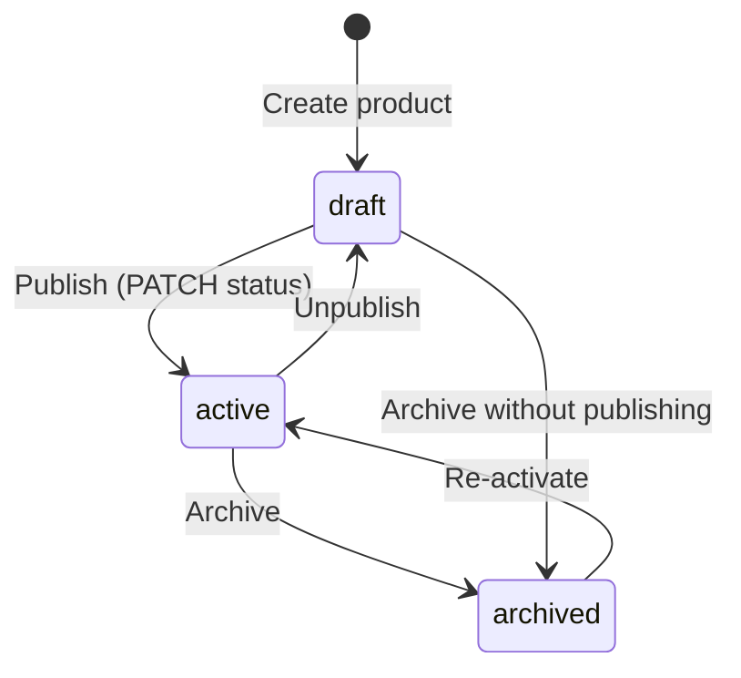
```mermaid
stateDiagram-v2
    [*] --> draft : Create product
    draft --> active : Publish (PATCH status)
    active --> archived : Archive
    archived --> active : Re-activate
    draft --> archived : Archive without publishing
    active --> draft : Unpublish
```

### 2b. Product & Variant Data Model

```mermaid
erDiagram
    Shop ||--o{ SellerProduct : "owns"
    SellerProduct ||--o{ SellerVariant : "has variants"
    SellerProduct ||--o{ SellerProductImage : "has images"
    SellerVariant ||--o| InventorySnapshot : "tracked by"

    SellerProduct {
        Guid Id PK
        Guid ShopId FK
        string Title
        string Description
        string CategorySlug
        string Status "draft | active | archived"
        string Availability "in_stock | low_stock | out_of_stock"
        string[] Tags
        DateTimeOffset CreatedAt
        DateTimeOffset UpdatedAt
    }

    SellerVariant {
        Guid Id PK
        Guid ProductId FK
        string Label "e.g. 'Red / Large'"
        string Sku UK
        long PriceCents
        string Currency "USD"
        int Stock
        json Attributes "key-value pairs"
    }

    SellerProductImage {
        Guid Id PK
        Guid ProductId FK
        Guid MediaId "references MediaService"
        string AltText
        int DisplayOrder
    }

    InventorySnapshot {
        Guid VariantId PK_FK
        int Stock
        int LowStockThreshold "default 5"
        DateTimeOffset LastRestockedAt "nullable"
        DateTimeOffset UpdatedAt
    }
```

### 2c. Product CRUD Flow

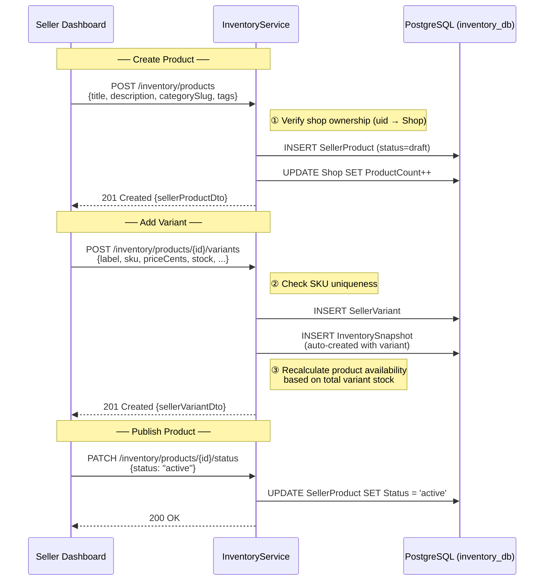
```mermaid
sequenceDiagram
    participant SPA as Seller Dashboard
    participant Inv as InventoryService
    participant DB as PostgreSQL (inventory_db)

    Note over SPA,Inv: ── Create Product ──

    SPA->>Inv: POST /inventory/products<br/>{title, description, categorySlug, tags}
    Note right of Inv: ① Verify shop ownership (uid → Shop)
    Inv->>DB: INSERT SellerProduct (status=draft)
    Inv->>DB: UPDATE Shop SET ProductCount++
    Inv-->>SPA: 201 Created {sellerProductDto}

    Note over SPA,Inv: ── Add Variant ──

    SPA->>Inv: POST /inventory/products/{id}/variants<br/>{label, sku, priceCents, stock, ...}
    Note right of Inv: ② Check SKU uniqueness
    Inv->>DB: INSERT SellerVariant
    Inv->>DB: INSERT InventorySnapshot<br/>(auto-created with variant)
    Note right of Inv: ③ Recalculate product availability<br/>based on total variant stock
    Inv-->>SPA: 201 Created {sellerVariantDto}

    Note over SPA,Inv: ── Publish Product ──

    SPA->>Inv: PATCH /inventory/products/{id}/status<br/>{status: "active"}
    Inv->>DB: UPDATE SellerProduct SET Status = 'active'
    Inv-->>SPA: 200 OK
```

### 2d. Availability Auto-Calculation

Product availability is automatically recalculated whenever a variant's
stock changes. The logic examines all variants belonging to a product:

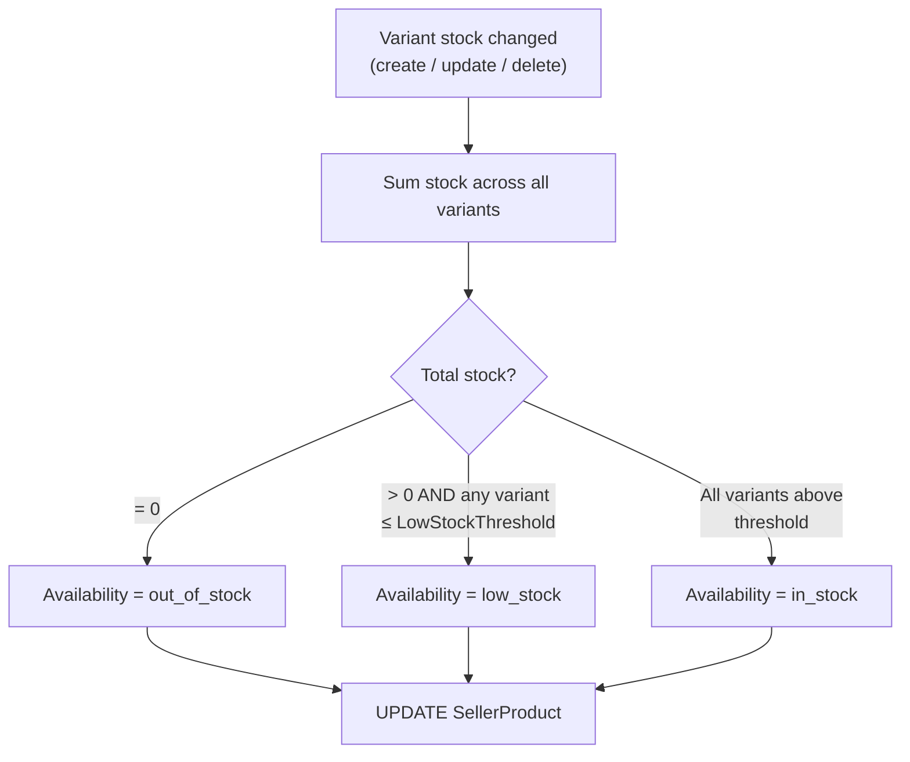
```mermaid
flowchart TD
    Trigger["Variant stock changed<br />(create / update / delete)"] --> Calc["Sum stock across all variants"]
    Calc --> Check{"Total stock?"}
    Check -- "= 0" --> OOS["Availability = out_of_stock"]
    Check -- "> 0 AND any variant<br />≤ LowStockThreshold" --> LOW["Availability = low_stock"]
    Check -- "All variants above<br />threshold" --> IN["Availability = in_stock"]
    OOS --> Save["UPDATE SellerProduct"]
    LOW --> Save
    IN --> Save
```

### 2e. Product Catalog Endpoints (InventoryService)

| Endpoint | Method | Auth | Description |
|---|---|---|---|
| `/inventory/products` | `GET` | ✅ JWT | List seller's products (cursor-paged, filter by status) |
| `/inventory/products` | `POST` | ✅ JWT | Create a new product (draft) |
| `/inventory/products/{id}` | `GET` | ✅ JWT | Get product with variants and images |
| `/inventory/products/{id}` | `PATCH` | ✅ JWT | Update product fields |
| `/inventory/products/{id}` | `DELETE` | ✅ JWT | Delete product (decrements shop count) |
| `/inventory/products/{id}/status` | `PATCH` | ✅ JWT | Change product status (draft/active/archived) |
| `/inventory/products/{id}/variants` | `GET` | ✅ JWT | List variants for a product |
| `/inventory/products/{id}/variants` | `POST` | ✅ JWT | Create variant + inventory snapshot |
| `/inventory/variants/{id}` | `PATCH` | ✅ JWT | Update variant (price, stock, attributes) |
| `/inventory/variants/{id}` | `DELETE` | ✅ JWT | Delete variant + snapshot |
| `/inventory/low-stock` | `GET` | ✅ JWT | List variants at or below low-stock threshold |
| `/inventory/import` | `POST` | ✅ JWT | Bulk CSV import of products + variants |
| `/inventory/export` | `GET` | ✅ JWT | CSV export of all products + variants |

---

## 3. Order Fulfillment — Seller Perspective

### 3a. Order-to-Seller Sync Flow

When a buyer places an order via **OrderService**, the order is
synchronized to the seller's **InventoryService** as a `SellerOrder`.
This enables sellers to view and manage orders from their dashboard
without direct access to OrderService data.

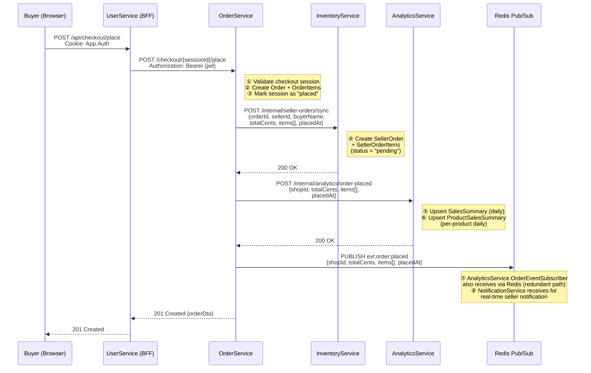
```mermaid
sequenceDiagram
    participant Buyer as Buyer (Browser)
    participant BFF as UserService (BFF)
    participant Ord as OrderService
    participant Inv as InventoryService
    participant Anl as AnalyticsService
    participant Redis as Redis Pub/Sub

    Buyer->>BFF: POST /api/checkout/place<br/>Cookie: App.Auth

    BFF->>Ord: POST /checkout/{sessionId}/place<br/>Authorization: Bearer {jwt}

    Note right of Ord: ① Validate checkout session<br/>② Create Order + OrderItems<br/>③ Mark session as "placed"

    Ord->>Inv: POST /internal/seller-orders/sync<br/>{orderId, sellerId, buyerName,<br/>totalCents, items[], placedAt}

    Note right of Inv: ④ Create SellerOrder<br/>+ SellerOrderItems<br/>(status = "pending")

    Inv-->>Ord: 200 OK

    Ord->>Anl: POST /internal/analytics/order-placed<br/>{shopId, totalCents, items[],<br/>placedAt}

    Note right of Anl: ⑤ Upsert SalesSummary (daily)<br/>⑥ Upsert ProductSalesSummary<br/>(per-product daily)

    Anl-->>Ord: 200 OK

    Ord->>Redis: PUBLISH evt:order:placed<br/>{shopId, totalCents, items[], placedAt}

    Note over Redis: ⑦ AnalyticsService.OrderEventSubscriber<br/>also receives via Redis (redundant path)<br/>⑧ NotificationService receives for<br/>real-time seller notification

    Ord-->>BFF: 201 Created {orderDto}
    BFF-->>Buyer: 201 Created
```

### 3b. Seller Order Lifecycle

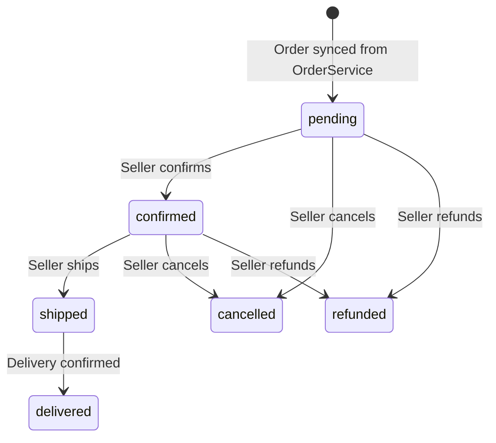
```mermaid
stateDiagram-v2
    [*] --> pending : Order synced from OrderService
    pending --> confirmed : Seller confirms
    confirmed --> shipped : Seller ships
    shipped --> delivered : Delivery confirmed
    pending --> cancelled : Seller cancels
    confirmed --> cancelled : Seller cancels
    pending --> refunded : Seller refunds
    confirmed --> refunded : Seller refunds
```

### 3c. Seller Order Data Model

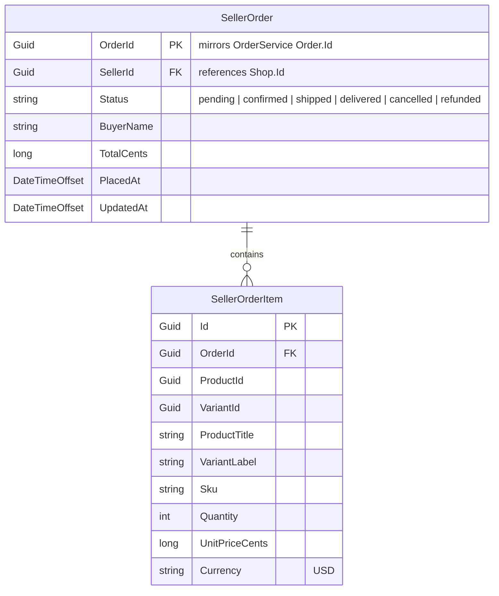
```mermaid
erDiagram
    SellerOrder ||--o{ SellerOrderItem : "contains"

    SellerOrder {
        Guid OrderId PK "mirrors OrderService Order.Id"
        Guid SellerId FK "references Shop.Id"
        string Status "pending | confirmed | shipped | delivered | cancelled | refunded"
        string BuyerName
        long TotalCents
        DateTimeOffset PlacedAt
        DateTimeOffset UpdatedAt
    }

    SellerOrderItem {
        Guid Id PK
        Guid OrderId FK
        Guid ProductId
        Guid VariantId
        string ProductTitle
        string VariantLabel
        string Sku
        int Quantity
        long UnitPriceCents
        string Currency "USD"
    }
```

### 3d. Seller Order Endpoints (InventoryService)

| Endpoint | Method | Auth | Description |
|---|---|---|---|
| `/seller/orders` | `GET` | ✅ JWT | List seller's orders (cursor-paged, filter by status) |
| `/seller/orders/{orderId}` | `GET` | ✅ JWT | Get order detail with items |
| `/seller/orders/{orderId}/status` | `PATCH` | ✅ JWT | Update order status (confirmed/shipped/delivered) |
| `/seller/orders/{orderId}/refund` | `POST` | ✅ JWT | Mark order as refunded |
| `/internal/seller-orders/sync` | `POST` | 🔓 Internal | Receive order from OrderService (AllowAnonymous) |

---

## 4. Sales Analytics — Seller Dashboard

### 4a. Analytics Architecture

AnalyticsService aggregates order data into daily summaries that power
the seller dashboard. Data arrives via **two paths**: a synchronous
HTTP POST from OrderService and an asynchronous Redis Pub/Sub event
(redundant for resilience).

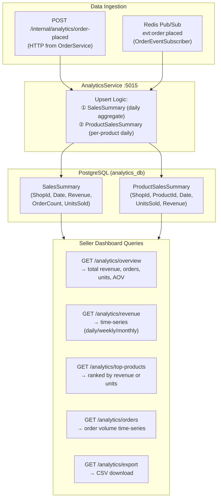
```mermaid
graph TB
    subgraph Sources ["Data Ingestion"]
        HTTP["POST /internal/analytics/order-placed<br />(HTTP from OrderService)"]
        Redis["Redis Pub/Sub<br />evt:order:placed<br />(OrderEventSubscriber)"]
    end

    subgraph Processing ["AnalyticsService :5015"]
        Upsert["Upsert Logic:<br />① SalesSummary (daily aggregate)<br />② ProductSalesSummary (per-product daily)"]
    end

    subgraph Storage ["PostgreSQL (analytics_db)"]
        Sales["SalesSummary<br />(ShopId, Date, Revenue,<br />OrderCount, UnitsSold)"]
        ProdSales["ProductSalesSummary<br />(ShopId, ProductId, Date,<br />UnitsSold, Revenue)"]
    end

    subgraph Dashboard ["Seller Dashboard Queries"]
        OV["GET /analytics/overview<br />→ total revenue, orders, units, AOV"]
        RV["GET /analytics/revenue<br />→ time-series (daily/weekly/monthly)"]
        TP["GET /analytics/top-products<br />→ ranked by revenue or units"]
        OVol["GET /analytics/orders<br />→ order volume time-series"]
        EXP["GET /analytics/export<br />→ CSV download"]
    end

    HTTP --> Upsert
    Redis --> Upsert
    Upsert --> Sales
    Upsert --> ProdSales
    Sales --> Dashboard
    ProdSales --> Dashboard
```

### 4b. Analytics Data Model

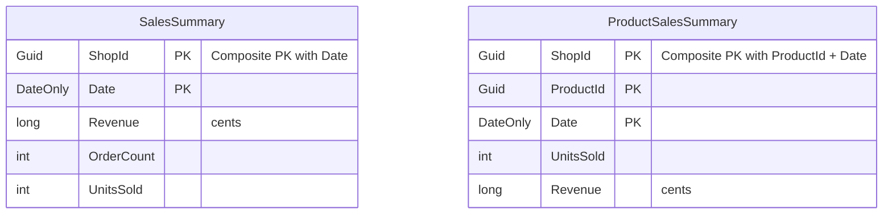
```mermaid
erDiagram
    SalesSummary {
        Guid ShopId PK "Composite PK with Date"
        DateOnly Date PK
        long Revenue "cents"
        int OrderCount
        int UnitsSold
    }

    ProductSalesSummary {
        Guid ShopId PK "Composite PK with ProductId + Date"
        Guid ProductId PK
        DateOnly Date PK
        int UnitsSold
        long Revenue "cents"
    }
```

### 4c. Analytics Query Flow

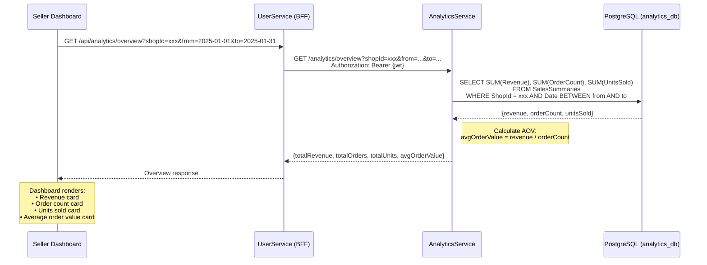
```mermaid
sequenceDiagram
    participant SPA as Seller Dashboard
    participant BFF as UserService (BFF)
    participant Anl as AnalyticsService
    participant DB as PostgreSQL (analytics_db)

    SPA->>BFF: GET /api/analytics/overview?shopId=xxx&from=2025-01-01&to=2025-01-31

    BFF->>Anl: GET /analytics/overview?shopId=xxx&from=...&to=...<br/>Authorization: Bearer {jwt}

    Anl->>DB: SELECT SUM(Revenue), SUM(OrderCount), SUM(UnitsSold)<br/>FROM SalesSummaries<br/>WHERE ShopId = xxx AND Date BETWEEN from AND to
    DB-->>Anl: {revenue, orderCount, unitsSold}

    Note right of Anl: Calculate AOV:<br/>avgOrderValue = revenue / orderCount

    Anl-->>BFF: {totalRevenue, totalOrders, totalUnits, avgOrderValue}
    BFF-->>SPA: Overview response

    Note over SPA: Dashboard renders:<br/>• Revenue card<br/>• Order count card<br/>• Units sold card<br/>• Average order value card
```

### 4d. Analytics Endpoints

| Endpoint | Method | Auth | Description |
|---|---|---|---|
| `/analytics/overview` | `GET` | ✅ JWT | Aggregate overview (revenue, orders, units, AOV) |
| `/analytics/revenue` | `GET` | ✅ JWT | Revenue time-series (daily/weekly/monthly granularity) |
| `/analytics/top-products` | `GET` | ✅ JWT | Top products ranked by revenue or units sold |
| `/analytics/orders` | `GET` | ✅ JWT | Order volume time-series |
| `/analytics/export` | `GET` | ✅ JWT | CSV export of daily summaries |
| `/internal/analytics/order-placed` | `POST` | 🔓 Internal | Ingest order event (AllowAnonymous) |

---

## 5. Advertising Campaigns

### 5a. Campaign Lifecycle

Sellers create ad campaigns to promote products. Campaigns follow a
**draft → active → paused → ended** lifecycle with budget tracking.

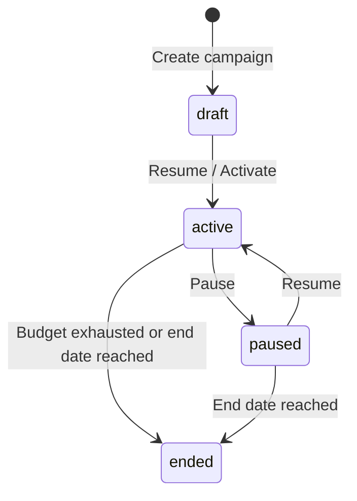
```mermaid
stateDiagram-v2
    [*] --> draft : Create campaign
    draft --> active : Resume / Activate
    active --> paused : Pause
    paused --> active : Resume
    active --> ended : Budget exhausted or end date reached
    paused --> ended : End date reached
```

### 5b. Campaign Data Model

```mermaid
erDiagram
    AdCampaign ||--o{ CampaignProduct : "promotes"
    AdCampaign ||--o| CampaignMetrics : "tracked by"

    AdCampaign {
        Guid Id PK
        Guid ShopId FK
        string Name
        string Status "draft | active | paused | ended"
        long BudgetCents
        long SpentCents
        DateOnly StartDate
        DateOnly EndDate
        DateTimeOffset CreatedAt
    }

    CampaignProduct {
        Guid CampaignId PK_FK
        Guid ProductId PK "references InventoryService product"
    }

    CampaignMetrics {
        Guid CampaignId PK_FK
        long Impressions
        long Clicks
        long Conversions
        DateTimeOffset UpdatedAt
    }
```

### 5c. Campaign Creation & Tracking Flow

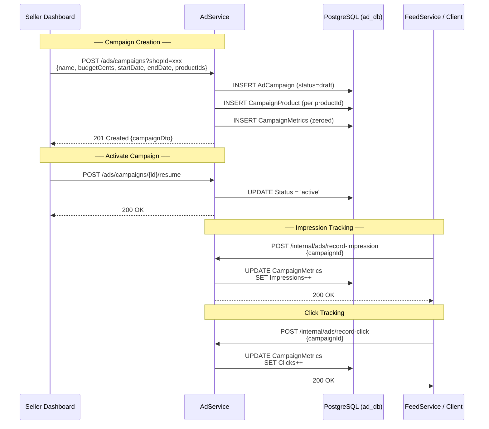
```mermaid
sequenceDiagram
    participant Seller as Seller Dashboard
    participant Ad as AdService
    participant DB as PostgreSQL (ad_db)
    participant Feed as FeedService / Client

    Note over Seller,Ad: ── Campaign Creation ──

    Seller->>Ad: POST /ads/campaigns?shopId=xxx<br/>{name, budgetCents, startDate, endDate, productIds}
    Ad->>DB: INSERT AdCampaign (status=draft)
    Ad->>DB: INSERT CampaignProduct (per productId)
    Ad->>DB: INSERT CampaignMetrics (zeroed)
    Ad-->>Seller: 201 Created {campaignDto}

    Note over Seller,Ad: ── Activate Campaign ──

    Seller->>Ad: POST /ads/campaigns/{id}/resume
    Ad->>DB: UPDATE Status = 'active'
    Ad-->>Seller: 200 OK

    Note over Feed,Ad: ── Impression Tracking ──

    Feed->>Ad: POST /internal/ads/record-impression<br/>{campaignId}
    Ad->>DB: UPDATE CampaignMetrics<br/>SET Impressions++
    Ad-->>Feed: 200 OK

    Note over Feed,Ad: ── Click Tracking ──

    Feed->>Ad: POST /internal/ads/record-click<br/>{campaignId}
    Ad->>DB: UPDATE CampaignMetrics<br/>SET Clicks++
    Ad-->>Feed: 200 OK
```

### 5d. Campaign Endpoints

| Endpoint | Method | Auth | Description |
|---|---|---|---|
| `/ads/campaigns` | `GET` | ✅ JWT | List campaigns (cursor-paged, filter by status) |
| `/ads/campaigns` | `POST` | ✅ JWT | Create campaign (draft) |
| `/ads/campaigns/{id}` | `GET` | ✅ JWT | Get campaign detail |
| `/ads/campaigns/{id}` | `PATCH` | ✅ JWT | Update campaign fields |
| `/ads/campaigns/{id}` | `DELETE` | ✅ JWT | Delete campaign + metrics + products |
| `/ads/campaigns/{id}/pause` | `POST` | ✅ JWT | Pause an active campaign |
| `/ads/campaigns/{id}/resume` | `POST` | ✅ JWT | Resume a paused or draft campaign |
| `/ads/campaigns/{id}/metrics` | `GET` | ✅ JWT | Get impression/click/conversion metrics |
| `/internal/ads/record-impression` | `POST` | 🔓 Internal | Record ad impression |
| `/internal/ads/record-click` | `POST` | 🔓 Internal | Record ad click |

---

## 6. CSV Bulk Operations

### 6a. CSV Import Flow

Sellers can bulk-import products and variants from a CSV file. The
import creates products with a single variant per row.

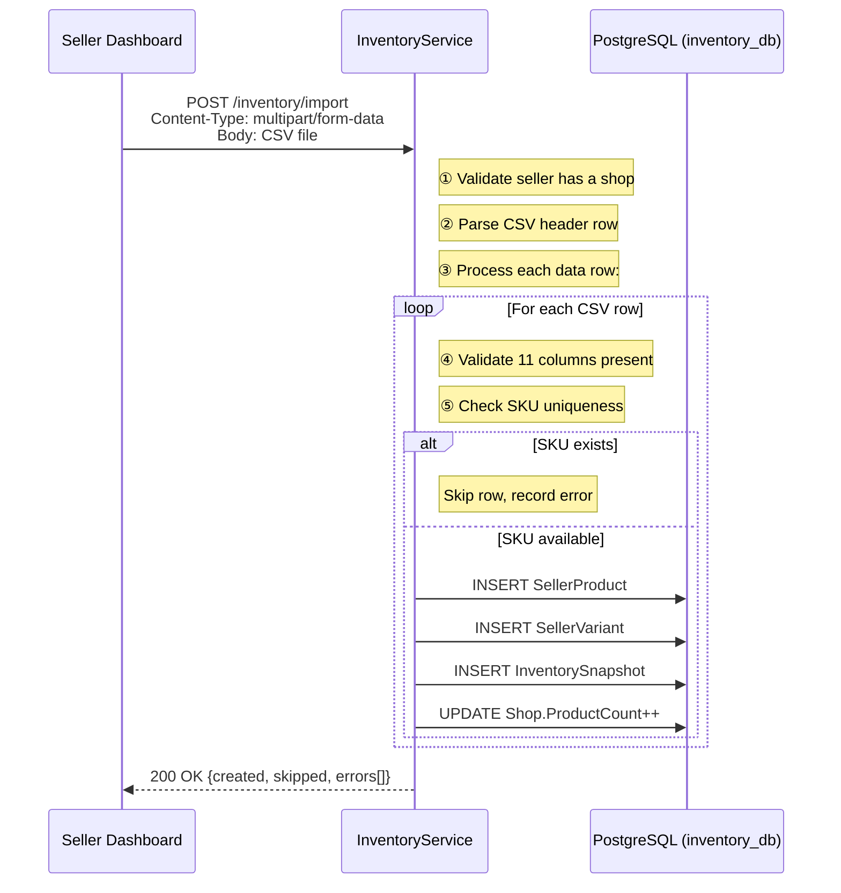
```mermaid
sequenceDiagram
    participant SPA as Seller Dashboard
    participant Inv as InventoryService
    participant DB as PostgreSQL (inventory_db)

    SPA->>Inv: POST /inventory/import<br/>Content-Type: multipart/form-data<br/>Body: CSV file

    Note right of Inv: ① Validate seller has a shop
    Note right of Inv: ② Parse CSV header row
    Note right of Inv: ③ Process each data row:

    loop For each CSV row
        Note right of Inv: ④ Validate 11 columns present
        Note right of Inv: ⑤ Check SKU uniqueness
        alt SKU exists
            Note right of Inv: Skip row, record error
        else SKU available
            Inv->>DB: INSERT SellerProduct
            Inv->>DB: INSERT SellerVariant
            Inv->>DB: INSERT InventorySnapshot
            Inv->>DB: UPDATE Shop.ProductCount++
        end
    end

    Inv-->>SPA: 200 OK {created, skipped, errors[]}
```

### 6b. CSV Format

| Column | Index | Description | Example |
|---|---|---|---|
| Title | 0 | Product title | `"Wireless Mouse"` |
| Description | 1 | Product description | `"Ergonomic wireless mouse"` |
| CategorySlug | 2 | Category identifier | `"electronics"` |
| Tags | 3 | Pipe-delimited tags | `"wireless|mouse|ergonomic"` |
| Status | 4 | Product status | `"active"` |
| VariantLabel | 5 | Variant label | `"Black"` |
| SKU | 6 | Unique SKU | `"WM-BLK-001"` |
| PriceCents | 7 | Price in cents | `2999` |
| Currency | 8 | ISO currency code | `"USD"` |
| Stock | 9 | Initial stock quantity | `100` |
| LowStockThreshold | 10 | Alert threshold | `10` |

---

## 7. Cross-Service Communication Map

### 7a. Complete Seller Data Flow

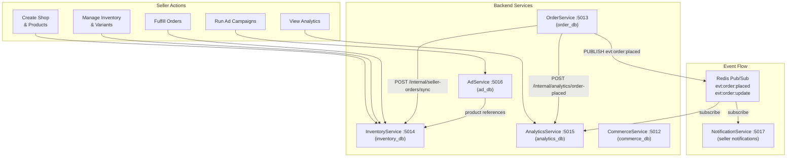
```mermaid
graph TB
    subgraph Seller ["Seller Actions"]
        Create["Create Shop<br />& Products"]
        Manage["Manage Inventory<br />& Variants"]
        Fulfill["Fulfill Orders"]
        Analyze["View Analytics"]
        Promote["Run Ad Campaigns"]
    end

    subgraph Services ["Backend Services"]
        Inv["InventoryService :5014<br />(inventory_db)"]
        Ord["OrderService :5013<br />(order_db)"]
        Anl["AnalyticsService :5015<br />(analytics_db)"]
        Ad["AdService :5016<br />(ad_db)"]
        Comm["CommerceService :5012<br />(commerce_db)"]
    end

    subgraph Events ["Event Flow"]
        Redis["Redis Pub/Sub<br />evt:order:placed<br />evt:order:update"]
        Notif["NotificationService :5017<br />(seller notifications)"]
    end

    Create --> Inv
    Manage --> Inv
    Fulfill --> Inv
    Analyze --> Anl
    Promote --> Ad

    Ord -- "POST /internal/seller-orders/sync" --> Inv
    Ord -- "POST /internal/analytics/order-placed" --> Anl
    Ord -- "PUBLISH evt:order:placed" --> Redis
    Redis -- "subscribe" --> Anl
    Redis -- "subscribe" --> Notif

    Ad -- "product references" --> Inv
```

### 7b. HTTP Inter-Service Dependencies (Seller)

| Caller | Callee | Endpoint | Direction | Purpose |
|---|---|---|---|---|
| OrderService | InventoryService | `POST /internal/seller-orders/sync` | Internal | Sync placed order to seller's view |
| OrderService | AnalyticsService | `POST /internal/analytics/order-placed` | Internal | HTTP fallback for analytics ingestion |
| FeedService / Client | AdService | `POST /internal/ads/record-impression` | Internal | Track ad impression in feed |
| FeedService / Client | AdService | `POST /internal/ads/record-click` | Internal | Track ad click-through |
| UserService (BFF) | InventoryService | Various seller endpoints | JWT Bearer | Proxy seller dashboard requests |
| UserService (BFF) | AnalyticsService | `GET /analytics/*` | JWT Bearer | Proxy analytics dashboard requests |
| UserService (BFF) | AdService | `GET/POST /ads/campaigns/*` | JWT Bearer | Proxy campaign management requests |

### 7c. Event Bus Dependencies (Seller)

| Bus | Subscriber | Channel | Source | Purpose |
|---|---|---|---|---|
| Redis Pub/Sub | AnalyticsService | `evt:order:placed` | OrderService | Aggregate daily sales data (redundant with HTTP) |
| Redis Pub/Sub | NotificationService | `evt:order:placed` | OrderService | Push real-time "new order" notification to seller |
| Redis Pub/Sub | NotificationService | `evt:order:update` | OrderService | Push order status change notification |

---

## 8. Data Storage Layout

### PostgreSQL

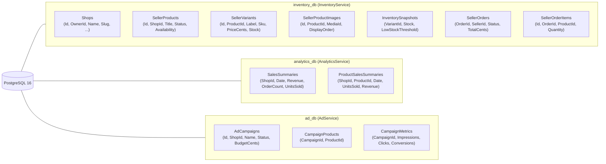
```mermaid
graph LR
    PG[("PostgreSQL 16")]

    subgraph inventory_db ["inventory_db (InventoryService)"]
        Shops["Shops<br />(Id, OwnerId, Name, Slug, ...)"]
        SellerProducts["SellerProducts<br />(Id, ShopId, Title, Status, Availability)"]
        SellerVariants["SellerVariants<br />(Id, ProductId, Label, Sku, PriceCents, Stock)"]
        SellerProductImages["SellerProductImages<br />(Id, ProductId, MediaId, DisplayOrder)"]
        InventorySnapshots["InventorySnapshots<br />(VariantId, Stock, LowStockThreshold)"]
        SellerOrders["SellerOrders<br />(OrderId, SellerId, Status, TotalCents)"]
        SellerOrderItems["SellerOrderItems<br />(Id, OrderId, ProductId, Quantity)"]
    end

    subgraph analytics_db ["analytics_db (AnalyticsService)"]
        SalesSummaries["SalesSummaries<br />(ShopId, Date, Revenue, OrderCount, UnitsSold)"]
        ProductSalesSummaries["ProductSalesSummaries<br />(ShopId, ProductId, Date, UnitsSold, Revenue)"]
    end

    subgraph ad_db ["ad_db (AdService)"]
        AdCampaigns["AdCampaigns<br />(Id, ShopId, Name, Status, BudgetCents)"]
        CampaignProducts["CampaignProducts<br />(CampaignId, ProductId)"]
        CampaignMetrics["CampaignMetrics<br />(CampaignId, Impressions, Clicks, Conversions)"]
    end

    PG --- inventory_db
    PG --- analytics_db
    PG --- ad_db
```

### Redis

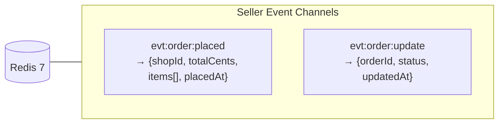
```mermaid
graph LR
    REDIS[("Redis 7")]

    subgraph EventChannels ["Seller Event Channels"]
        OP["evt:order:placed<br />→ {shopId, totalCents, items[], placedAt}"]
        OU["evt:order:update<br />→ {orderId, status, updatedAt}"]
    end

    REDIS --- EventChannels
```

---

## 9. Error Handling

| Scenario | HTTP Status | Service | Handling |
|---|---|---|---|
| User already has a shop | `409 Conflict` | InventoryService | Unique constraint on OwnerId |
| Shop slug already taken | `409 Conflict` | InventoryService | Unique constraint on Slug |
| User has no shop (any seller endpoint) | `404 Not Found` | InventoryService | "You don't have a shop yet." |
| SKU already exists (variant create/update) | `409 Conflict` | InventoryService | Unique constraint on Sku |
| Product not found or not owned | `404 Not Found` | InventoryService | ShopId ownership check |
| Invalid product status transition | `400 Bad Request` | InventoryService | Allowed values: draft, active, archived |
| Invalid order status transition | `400 Bad Request` | InventoryService | Allowed values: confirmed, shipped, delivered |
| CSV file empty | `400 Bad Request` | InventoryService | Validation on upload |
| CSV row has wrong column count | Logged in errors[] | InventoryService | Row skipped, error recorded |
| shopId missing from analytics request | `500 Internal Server Error` | AnalyticsService | InvalidOperationException |
| Only active campaigns can be paused | `400 Bad Request` | AdService | Status check before transition |
| Only paused/draft campaigns can resume | `400 Bad Request` | AdService | Status check before transition |
| Campaign not found | `404 Not Found` | AdService | Standard lookup |
| Redis unavailable (event subscriber) | Service degradation | AnalyticsService | Subscriber logs error; HTTP ingestion unaffected |
| InventoryService unreachable (order sync) | Order placed without seller sync | OrderService | HTTP POST fails; seller order created on retry/reconciliation |

---

## 10. Key Design Decisions

| Decision | Rationale |
|---|---|
| One shop per user (OwnerId unique) | Simplifies ownership model; multi-shop can be added later |
| SellerOrder mirrors OrderService Order.Id | Avoids cross-database joins; seller has independent order lifecycle |
| Dual ingestion path for analytics (HTTP + Redis) | Redundancy — if either path fails, the other still aggregates data |
| Internal endpoints with `[AllowAnonymous]` | Simplified local development; API keys or network policies in production |
| Product status as string enum (draft/active/archived) | Flexible; no database migration needed for new states |
| Availability auto-calculated from variant stock | Single source of truth; prevents stale availability flags |
| CSV import creates product + single variant per row | Simple onboarding for sellers with spreadsheet-based catalogs |
| CampaignMetrics as separate entity (1:1) | Enables high-frequency metric updates without locking campaign row |
| Cursor pagination with UTC ticks encoding | Consistent with Phase 4 pagination convention |
| Per-service database isolation | Bounded context ownership; InventoryService, AnalyticsService, AdService each own their data |
| ShopId passed as query param to AnalyticsService | Decouples analytics from inventory; no cross-service DB lookup needed |

---

## API Endpoint Summary

### InventoryService (:5014) — Seller Endpoints

| Endpoint | Method | Auth | Description |
|---|---|---|---|
| `/shops/mine` | `GET` | ✅ JWT | Get authenticated user's shop |
| `/shops` | `POST` | ✅ JWT | Create a shop |
| `/shops/mine` | `PATCH` | ✅ JWT | Update shop details |
| `/shops/{slug}` | `GET` | 🔓 | Public shop profile |
| `/inventory/products` | `GET` | ✅ JWT | List seller's products (paged) |
| `/inventory/products` | `POST` | ✅ JWT | Create product (draft) |
| `/inventory/products/{id}` | `GET` | ✅ JWT | Get product detail |
| `/inventory/products/{id}` | `PATCH` | ✅ JWT | Update product |
| `/inventory/products/{id}` | `DELETE` | ✅ JWT | Delete product |
| `/inventory/products/{id}/status` | `PATCH` | ✅ JWT | Change product status |
| `/inventory/products/{id}/variants` | `GET` | ✅ JWT | List variants |
| `/inventory/products/{id}/variants` | `POST` | ✅ JWT | Create variant + snapshot |
| `/inventory/variants/{id}` | `PATCH` | ✅ JWT | Update variant |
| `/inventory/variants/{id}` | `DELETE` | ✅ JWT | Delete variant |
| `/inventory/low-stock` | `GET` | ✅ JWT | Low-stock alert items |
| `/inventory/import` | `POST` | ✅ JWT | CSV bulk import |
| `/inventory/export` | `GET` | ✅ JWT | CSV bulk export |
| `/seller/orders` | `GET` | ✅ JWT | List seller orders (paged) |
| `/seller/orders/{id}` | `GET` | ✅ JWT | Get seller order detail |
| `/seller/orders/{id}/status` | `PATCH` | ✅ JWT | Update order status |
| `/seller/orders/{id}/refund` | `POST` | ✅ JWT | Refund order |
| `/internal/seller-orders/sync` | `POST` | 🔓 Internal | Receive order from OrderService |

### AnalyticsService (:5015) — Seller Dashboard

| Endpoint | Method | Auth | Description |
|---|---|---|---|
| `/analytics/overview` | `GET` | ✅ JWT | Revenue, orders, units, AOV |
| `/analytics/revenue` | `GET` | ✅ JWT | Revenue time-series |
| `/analytics/top-products` | `GET` | ✅ JWT | Top products by revenue/units |
| `/analytics/orders` | `GET` | ✅ JWT | Order volume time-series |
| `/analytics/export` | `GET` | ✅ JWT | CSV export |
| `/internal/analytics/order-placed` | `POST` | 🔓 Internal | Ingest order event |

### AdService (:5016) — Campaigns

| Endpoint | Method | Auth | Description |
|---|---|---|---|
| `/ads/campaigns` | `GET` | ✅ JWT | List campaigns (paged) |
| `/ads/campaigns` | `POST` | ✅ JWT | Create campaign |
| `/ads/campaigns/{id}` | `GET` | ✅ JWT | Get campaign |
| `/ads/campaigns/{id}` | `PATCH` | ✅ JWT | Update campaign |
| `/ads/campaigns/{id}` | `DELETE` | ✅ JWT | Delete campaign |
| `/ads/campaigns/{id}/pause` | `POST` | ✅ JWT | Pause campaign |
| `/ads/campaigns/{id}/resume` | `POST` | ✅ JWT | Resume campaign |
| `/ads/campaigns/{id}/metrics` | `GET` | ✅ JWT | Get campaign metrics |
| `/internal/ads/record-impression` | `POST` | 🔓 Internal | Record impression |
| `/internal/ads/record-click` | `POST` | 🔓 Internal | Record click |

---

## End of Document
