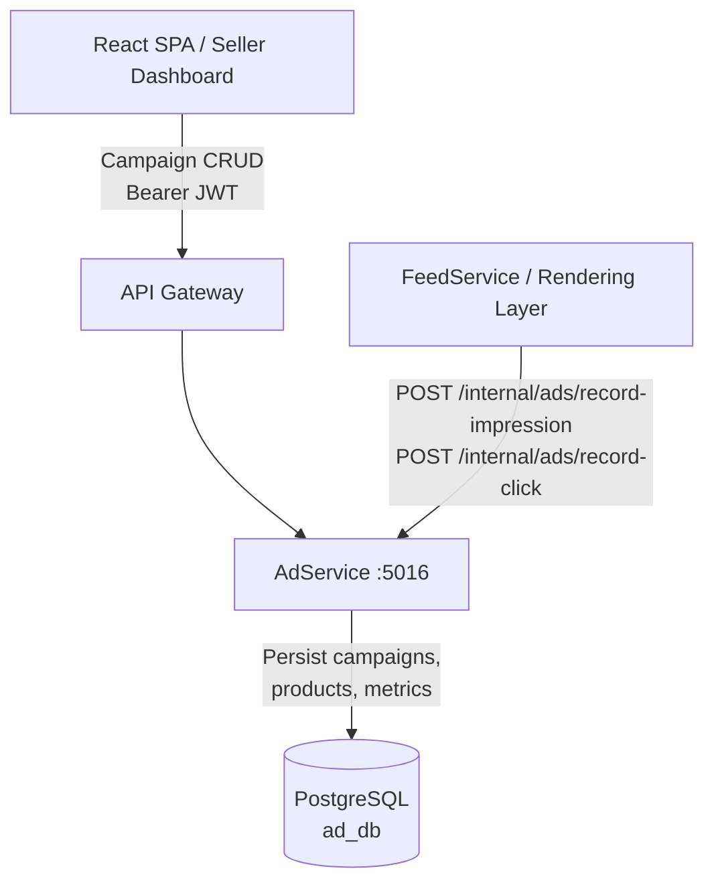
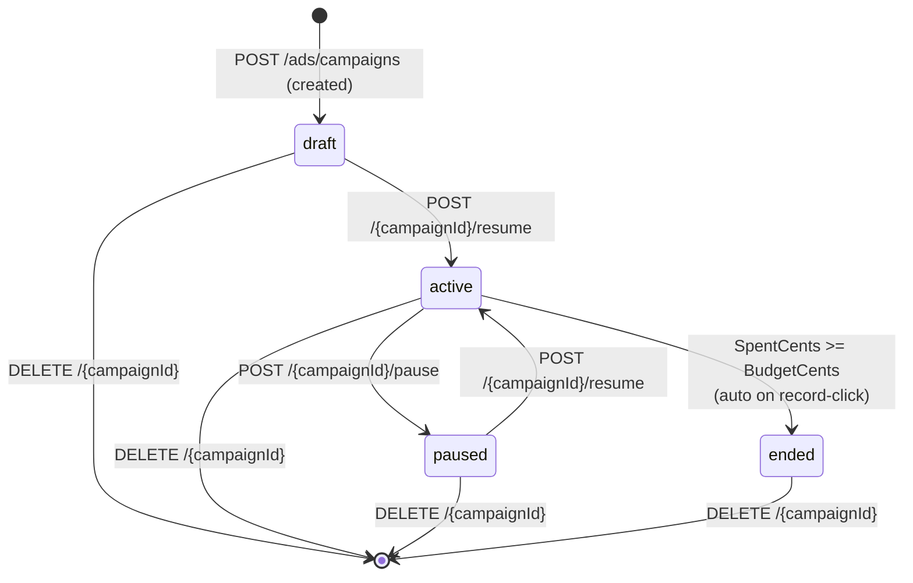
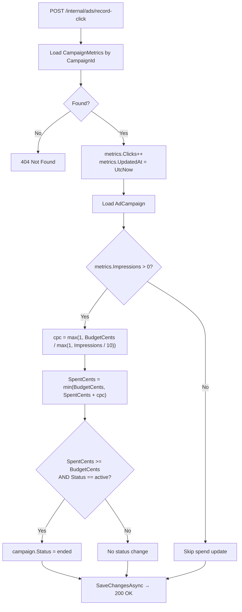
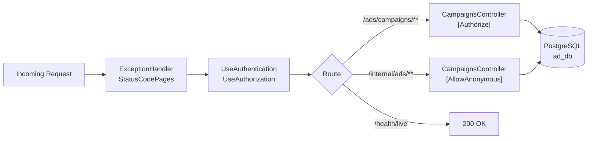
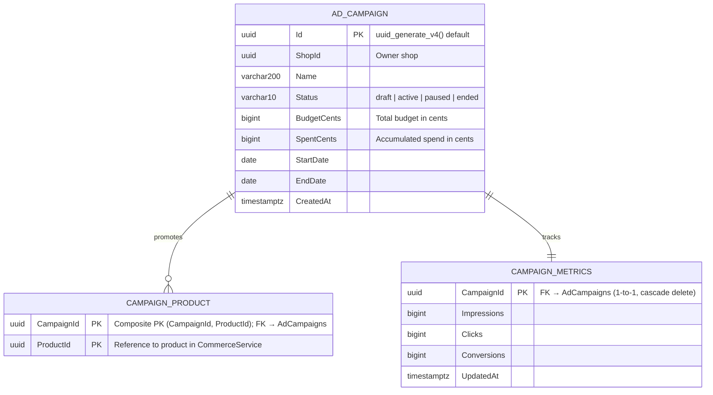

# AdService

> **Port:** 5016 &nbsp;|&nbsp; **Runtime:** ASP.NET Core (.NET 9) &nbsp;|&nbsp; **Database:** PostgreSQL (`ad_db`) &nbsp;|&nbsp; **Phase:** Commerce / Advertising

## Overview

AdService is the **advertising campaign management authority** for the SocialCommerce super-app. It gives sellers full control over the lifecycle of their promotional campaigns and surfaces performance metrics in real time:

- **Campaign CRUD** — Sellers can create, read, update, and delete ad campaigns (`/ads/campaigns`). Each campaign belongs to a shop, carries a date range, a total budget, and an ordered list of promoted products.
- **Campaign lifecycle** — Campaigns move through a four-state machine: `draft` → `active` → `paused` → `ended`. The `pause` and `resume` action endpoints drive state transitions. The `ended` state is entered automatically when a campaign's spend reaches its budget ceiling.
- **Product associations** — Each campaign can promote one or more products via a `CampaignProducts` join table. Associations are replaced wholesale on update, keeping the mutation model simple.
- **Metrics** — A `CampaignMetrics` record is auto-created alongside every new campaign and accumulates raw impression, click, and conversion counts. The read endpoint also derives click-through rate (CTR) and conversion rate (CVR) on the fly.
- **Impression tracking** — `POST /internal/ads/record-impression` increments the impression counter for a campaign. This endpoint is `[AllowAnonymous]` and is intended to be called from within the cluster (e.g., by a feed rendering service when an ad is surfaced).
- **Click tracking & budget enforcement** — `POST /internal/ads/record-click` increments the click counter, estimates a cost-per-click (CPC) from the campaign's budget and impression volume, advances `SpentCents`, and automatically transitions the campaign to `ended` when the budget is exhausted.
- **Cursor-paginated listing** — `GET /ads/campaigns` supports cursor-based pagination by `CreatedAt` DESC, with optional status filtering, keeping list responses bounded regardless of campaign volume.

---

## Architecture

### Position in the Platform



### Campaign Lifecycle



### Click Recording & Budget Enforcement



### Request Pipeline



---

## Project Structure

```
services/AdService/
├── AdService.csproj                 # net9.0; JWT Bearer + EF Core + Npgsql; DockerfileContext = ../..
├── Program.cs                       # Composition root — EF Core, JWT auth, Swagger
├── appsettings.json
│
├── Controllers/
│   └── CampaignsController.cs       # /ads/campaigns — CRUD, pause/resume, metrics + internal ingest
│
├── Data/
│   ├── AppDbContext.cs              # EF Core DbContext — 3 DbSets, 2 indexes, uuid-ossp extension
│   ├── AppDbFactory.cs             # IDesignTimeDbContextFactory for EF CLI
│   ├── Entities.cs                  # AdCampaign, CampaignProduct, CampaignMetrics
│   └── Migrations/
│       └── 20260322200110_InitialCreate  # Full schema — AdCampaigns, CampaignProducts, CampaignMetrics
│
├── Dtos/
│   └── AdDtos.cs                    # CampaignDto, CreateCampaignDto, UpdateCampaignDto,
│                                    # CampaignMetricsDto, RecordImpressionDto, RecordClickDto,
│                                    # PagedResult<T>
│
├── Auth/
│   └── JwtAuthExtensions.cs         # AddServiceJwtAuth — symmetric-key JWT Bearer validation
│
└── Properties/
    └── launchSettings.json          # Local dev — http://localhost:5016
```

---

## Data Model

### ER Diagram



> `CampaignMetrics` is created automatically as part of `POST /ads/campaigns`. Deleting an `AdCampaign` cascades to both `CampaignProducts` and `CampaignMetrics`.

### Entity Column Summary

#### `AdCampaigns`

| Column | Type | Nullable | Notes |
|---|---|---|---|
| `Id` | `uuid` | No | PK; server-generated via `uuid_generate_v4()` |
| `ShopId` | `uuid` | No | The seller shop that owns this campaign |
| `Name` | `varchar(200)` | No | Human-readable campaign name |
| `Status` | `varchar(10)` | No | `"draft"` \| `"active"` \| `"paused"` \| `"ended"` |
| `BudgetCents` | `bigint` | No | Total campaign budget in cents |
| `SpentCents` | `bigint` | No | Accumulated spend in cents; updated on each recorded click |
| `StartDate` | `date` | No | Campaign start date (inclusive) |
| `EndDate` | `date` | No | Campaign end date (inclusive) |
| `CreatedAt` | `timestamptz` | No | Creation timestamp; used as pagination cursor |

#### `CampaignProducts`

| Column | Type | Nullable | Notes |
|---|---|---|---|
| `CampaignId` | `uuid` | No | Composite PK (part 1); FK → `AdCampaigns.Id`, cascade delete |
| `ProductId` | `uuid` | No | Composite PK (part 2); reference to a product in `CommerceService` |

#### `CampaignMetrics`

| Column | Type | Nullable | Notes |
|---|---|---|---|
| `CampaignId` | `uuid` | No | PK; FK → `AdCampaigns.Id`, cascade delete; enforces 1-to-1 relationship |
| `Impressions` | `bigint` | No | Total times an ad for this campaign was displayed |
| `Clicks` | `bigint` | No | Total clicks on an ad for this campaign |
| `Conversions` | `bigint` | No | Total conversions attributed to this campaign |
| `UpdatedAt` | `timestamptz` | No | Timestamp of last impression or click record |

### Database Indexes

| Index | Table | Columns | Purpose |
|---|---|---|---|
| `PK_AdCampaigns` | `AdCampaigns` | `(Id)` | Primary key lookup |
| `IX_AdCampaigns_ShopId` | `AdCampaigns` | `(ShopId)` | List all campaigns for a shop |
| `IX_AdCampaigns_Status` | `AdCampaigns` | `(Status)` | Filter campaigns by status (e.g., find all `active` campaigns) |
| `PK_CampaignProducts` | `CampaignProducts` | `(CampaignId, ProductId)` | Composite PK; prevents duplicate product associations |
| `PK_CampaignMetrics` | `CampaignMetrics` | `(CampaignId)` | PK; 1-to-1 join key for metrics lookup |

---

## Authentication & Authorization

| Aspect | Value |
|---|---|
| Scheme | **JWT Bearer** (fully enforced via `[Authorize]` on controller class) |
| Algorithm | HMAC HS256 (symmetric key) |
| Issuer | `SocialCommerce` (configurable via `Authentication:Jwt:Issuer`) |
| Audience | Not validated |
| Clock skew | 30 seconds |
| `uid` claim | Required on all authenticated endpoints — identifies the calling user |
| `shop` claim | Not used directly; `shopId` is passed as a query parameter |
| Internal ingest | `POST /internal/ads/record-impression` and `POST /internal/ads/record-click` are `[AllowAnonymous]` — intended for intra-cluster calls only |

---

## API Reference

### `CampaignsController` — `/ads/campaigns`

| Method | Path | Auth | Query / Body | Success | Errors | Description |
|---|---|---|---|---|---|---|
| `GET` | `/ads/campaigns` | Bearer JWT | `?shopId` *(required)*, `?status`, `?cursor`, `?limit` (default 20) | `200 PagedResult<CampaignDto>` | — | List campaigns for a shop; cursor by `CreatedAt` DESC; optional status filter |
| `POST` | `/ads/campaigns` | Bearer JWT | `?shopId` + `CreateCampaignDto` body | `201 CampaignDto` | — | Create campaign in `draft` state; auto-creates `CampaignMetrics` record |
| `GET` | `/ads/campaigns/{campaignId}` | Bearer JWT | — | `200 CampaignDto` | `404` | Get a single campaign with products and metrics |
| `PATCH` | `/ads/campaigns/{campaignId}` | Bearer JWT | `UpdateCampaignDto` body | `200 CampaignDto` | `404` | Partial update of name, budget, dates, and/or product list |
| `DELETE` | `/ads/campaigns/{campaignId}` | Bearer JWT | — | `204` | `404` | Delete campaign and cascade-delete products and metrics |
| `POST` | `/ads/campaigns/{campaignId}/pause` | Bearer JWT | — | `200 CampaignDto` | `404`, `400` | Transition `active` → `paused`; returns `400` if not `active` |
| `POST` | `/ads/campaigns/{campaignId}/resume` | Bearer JWT | — | `200 CampaignDto` | `404`, `400` | Transition `paused` or `draft` → `active`; returns `400` otherwise |
| `GET` | `/ads/campaigns/{campaignId}/metrics` | Bearer JWT | — | `200 CampaignMetricsDto` | `404` | Returns raw counters + derived CTR and CVR |

### Internal Endpoints

| Method | Path | Auth | Body | Success | Errors | Description |
|---|---|---|---|---|---|---|
| `POST` | `/internal/ads/record-impression` | None | `RecordImpressionDto` | `200` | `404` | Increment `Impressions` counter; update `UpdatedAt` |
| `POST` | `/internal/ads/record-click` | None | `RecordClickDto` | `200` | `404` | Increment `Clicks`; apply CPC spend estimate; auto-end if budget exhausted |

### Liveness

| Method | Path | Auth | Success |
|---|---|---|---|
| `GET` | `/health/live` | None | `200` |

#### Status Transition Rules

| Current status | `pause` | `resume` | `record-click` (budget exhausted) | `DELETE` |
|---|---|---|---|---|
| `draft` | `400` | → `active` | — | ✓ |
| `active` | → `paused` | `400` | → `ended` | ✓ |
| `paused` | `400` | → `active` | — | ✓ |
| `ended` | `400` | `400` | — | ✓ |

#### Cursor Encoding

List pagination uses UTC ticks encoded as UTF-8 bytes, then Base64:

```
cursor = Base64( UTF8( campaign.CreatedAt.UtcTicks.ToString() ) )
```

An absent or null cursor returns the first page (most recent campaigns).

#### CPC Spend Estimation

On each `record-click` call, the estimated cost-per-click is calculated as:

```
cpc = max(1, BudgetCents / max(1, Impressions / 10))
SpentCents = min(BudgetCents, SpentCents + cpc)
```

This simple heuristic models an expected 10% click-through rate to derive a cost per impression block. When `SpentCents >= BudgetCents` and the campaign is `active`, the status is automatically set to `ended`.

#### CTR and CVR (derived, not stored)

`GET /ads/campaigns/{campaignId}/metrics` computes these on the fly:

```
CTR = Clicks / Impressions × 100  (%)
CVR = Conversions / Clicks × 100  (%)
```

Both return `0` when the denominator is zero.

---

## Data Transfer Objects

### `CampaignDto`

```json
{
  "id": "3fa85f64-5717-4562-b3fc-2c963f66afa6",
  "shopId": "9d4e1c2a-...",
  "name": "Summer Sale Promo",
  "status": "active",
  "budgetCents": 500000,
  "spentCents": 12400,
  "startDate": "2025-06-01",
  "endDate": "2025-06-30",
  "productIds": [
    "a1b2c3d4-...",
    "b2c3d4e5-..."
  ],
  "metrics": {
    "impressions": 1240,
    "clicks": 93,
    "conversions": 11,
    "clickThroughRate": 7.50,
    "conversionRate": 11.83,
    "updatedAt": "2025-06-15T08:42:00Z"
  },
  "createdAt": "2025-05-20T14:00:00Z"
}
```

### `CreateCampaignDto`

```json
{
  "name": "Summer Sale Promo",
  "budgetCents": 500000,
  "startDate": "2025-06-01",
  "endDate": "2025-06-30",
  "productIds": [
    "a1b2c3d4-...",
    "b2c3d4e5-..."
  ]
}
```

> `productIds` is optional. A campaign may be created with no product associations and have them added later via `PATCH`.

### `UpdateCampaignDto`

```json
{
  "name": "Summer Sale Promo — Extended",
  "budgetCents": 750000,
  "endDate": "2025-07-15",
  "productIds": ["a1b2c3d4-..."]
}
```

> All fields are optional. Only non-null fields are applied. Supplying `productIds` **replaces** the entire product list.

### `PagedResult<CampaignDto>`

```json
{
  "items": [ /* CampaignDto[] */ ],
  "nextCursor": "MTc0NjM2MDAwMDAwMDAwMDA=",
  "hasMore": true
}
```

> `nextCursor` is `null` and `hasMore` is `false` when no further pages exist.

### `CampaignMetricsDto`

```json
{
  "impressions": 1240,
  "clicks": 93,
  "conversions": 11,
  "clickThroughRate": 7.50,
  "conversionRate": 11.83,
  "updatedAt": "2025-06-15T08:42:00Z"
}
```

### Internal DTOs

```json
// RecordImpressionDto
{ "campaignId": "3fa85f64-..." }

// RecordClickDto
{ "campaignId": "3fa85f64-..." }
```

---

## Service Dependencies

### Outbound (AdService calls…)

| Dependency | Type | Required | Purpose |
|---|---|---|---|
| PostgreSQL | TCP (EF Core / Npgsql) | **Yes** | Persist `AdCampaigns`, `CampaignProducts`, `CampaignMetrics` |

> AdService has no outbound HTTP clients, no Redis dependency, and no message bus subscription. It is a fully self-contained CRUD + metrics service.

### Inbound (…calls AdService)

| Caller | Endpoint(s) | Purpose |
|---|---|---|
| React SPA / Seller Dashboard | `GET /ads/campaigns` | List seller campaigns with pagination |
| React SPA / Seller Dashboard | `POST /ads/campaigns` | Create a new campaign |
| React SPA / Seller Dashboard | `GET /ads/campaigns/{id}` | View campaign detail |
| React SPA / Seller Dashboard | `PATCH /ads/campaigns/{id}` | Edit campaign |
| React SPA / Seller Dashboard | `DELETE /ads/campaigns/{id}` | Delete campaign |
| React SPA / Seller Dashboard | `POST /ads/campaigns/{id}/pause` | Pause active campaign |
| React SPA / Seller Dashboard | `POST /ads/campaigns/{id}/resume` | Activate draft or paused campaign |
| React SPA / Seller Dashboard | `GET /ads/campaigns/{id}/metrics` | View performance metrics |
| FeedService / Rendering Layer | `POST /internal/ads/record-impression` | Record ad display event |
| FeedService / Rendering Layer | `POST /internal/ads/record-click` | Record ad click event; apply spend |

---

## Configuration

### `appsettings.json` Keys

| Key | Required | Default | Description |
|---|---|---|---|
| `ConnectionStrings:Default` | **Yes** | `""` | Npgsql connection string to `ad_db` PostgreSQL database |
| `Authentication:Jwt:Issuer` | No | `SocialCommerce` | Expected JWT `iss` claim |
| `Authentication:Jwt:SymmetricKey` | **Yes** | `""` | HMAC HS256 symmetric signing key shared with `AuthorizationService` / API gateway |

---

## Containerization

### Dockerfile Stages

| Stage | Base Image | Purpose |
|---|---|---|
| `base` | `mcr.microsoft.com/dotnet/aspnet:9.0` | Final runtime layer |
| `build` | `mcr.microsoft.com/dotnet/sdk:9.0` | Restores and compiles service |
| `publish` | *(from build)* | `dotnet publish` in Release mode |
| `final` | *(from base)* | Copies published output; sets `ENTRYPOINT` |

The build context is the **repo root** (`DockerfileContext = ../..`).

### `docker-compose.yml` Service Entry (example)

```yaml
adservice:
  build:
    context: .
    dockerfile: services/AdService/Dockerfile
  environment:
    ASPNETCORE_URLS: http://+:8080
    ASPNETCORE_ENVIRONMENT: Development
    ConnectionStrings__Default: "Host=postgres;Port=5432;Database=ad_db;Username=postgres;Password=1234;Ssl Mode=Disable"
    Authentication__Jwt__Issuer: "SocialCommerce"
    Authentication__Jwt__SymmetricKey: "${JWT_SYMMETRIC_KEY}"
  ports:
    - "5016:8080"
  depends_on:
    postgres:
      condition: service_healthy
```

---

## Migrations

| Migration | Date | Tables Created |
|---|---|---|
| `20260322200110_InitialCreate` | 2026-03-22 | `AdCampaigns`, `CampaignProducts`, `CampaignMetrics` |

### EF Core Commands

```bash
# Add a new migration
dotnet ef migrations add <MigrationName> \
  --project services/AdService \
  --startup-project services/AdService

# Apply migrations manually
dotnet ef database update \
  --project services/AdService \
  --startup-project services/AdService
```

In development, `db.Database.Migrate()` is called automatically on startup (guarded by `app.Environment.IsDevelopment()`).

---

## Key Design Decisions

| Decision | Rationale |
|---|---|
| **Four-state campaign machine (`draft → active → paused → ended`)** | `draft` lets sellers configure a campaign before it accrues any spend. `paused` supports temporary suspension without loss of metrics history. `ended` is a terminal state reached either by budget exhaustion (automatic) or by the seller deleting/retiring the campaign; it is never reversed, preserving the historical record. |
| **`CampaignMetrics` as a separate 1-to-1 entity** | Separating metrics from the campaign row reduces contention: impression/click increments only lock the narrow `CampaignMetrics` row, not the broader campaign record. The cascade-delete FK keeps teardown atomic and avoids orphan metrics rows. |
| **`CampaignProducts` replace-on-update semantics** | When `PATCH` supplies a new `productIds` list, the existing associations are deleted and re-inserted wholesale. This is simpler than a diff-and-patch approach and avoids partial-update edge cases, at the cost of slightly higher write volume for large product lists. |
| **Internal impression/click endpoints are `[AllowAnonymous]`** | Requiring a JWT on hot-path tracking calls would add latency and create a dependency on `AuthorizationService` availability for every ad display event. Network-layer isolation (internal cluster routing) is the intended security boundary, consistent with the same pattern used in `AnalyticsService`. |
| **Simple CPC heuristic rather than a real bidding model** | The `max(1, BudgetCents / max(1, Impressions / 10))` formula approximates a cost per click based on an assumed 10% CTR. This is a deliberate Phase 1 simplification; it keeps the spend model deterministic and auditable while the data needed to calibrate real CPCs accumulates. |
| **Budget cap enforced synchronously on `record-click`** | Applying the spend check and auto-`ended` transition in the same database transaction as the click increment prevents over-spend: no background job can race between checking the budget and recording additional spend. The trade-off is that high-click-rate campaigns will serialise writes through the `CampaignMetrics` row. |
| **`shopId` as a query parameter rather than a JWT claim** | `CommerceService` and `AnalyticsService` follow the same pattern. Sellers may manage multiple shops; embedding a single `shop` claim in the JWT would require re-authentication to switch shops. Accepting `shopId` as a query parameter and trusting it is consistent with the platform's Phase 1 access-control posture (gateway-enforced). |
| **No Redis or Service Bus dependency** | Ad campaign data is low-frequency write, low-volume read (relative to feeds or content). A direct database read/write loop with indexed queries is fast enough at current scale without an intermediate cache. Adding Redis caching for the campaign list is a straightforward future optimisation if dashboard latency degrades. |
| **`uuid-ossp` extension for server-generated PKs** | Using `uuid_generate_v4()` as the PostgreSQL default for `AdCampaigns.Id` means the PK is assigned by the database, not the application layer. This is consistent with the approach used in `SocialContentService` and `CommerceService`, and avoids the need for the application to round-trip the generated ID before the `INSERT` is committed. |
