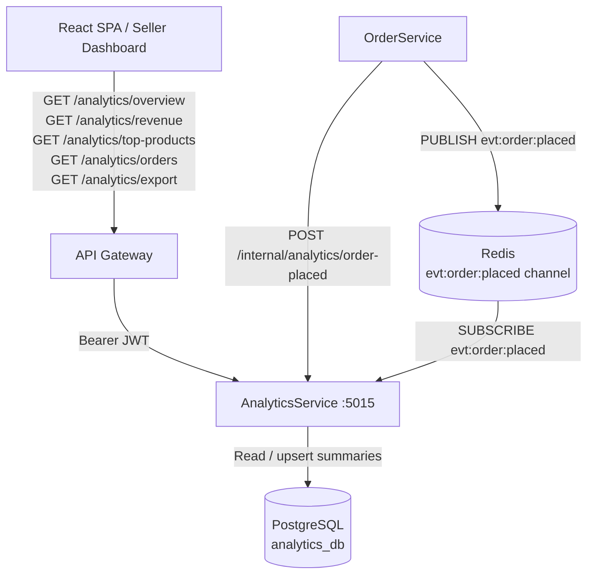
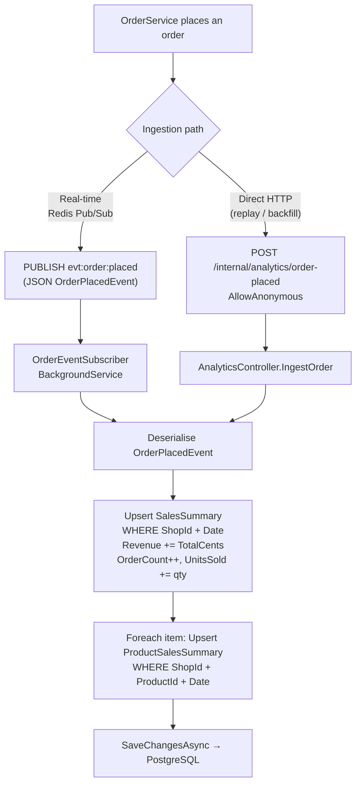
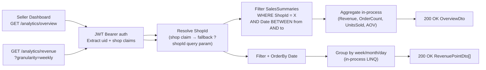
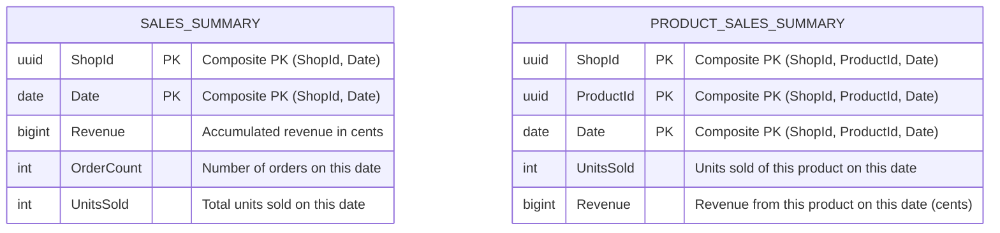
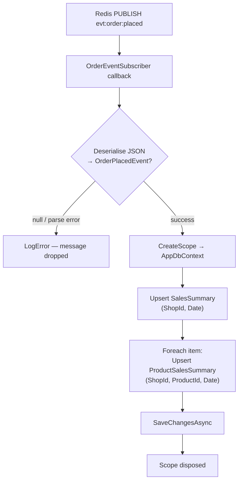

# AnalyticsService

> **Port:** 5015 &nbsp;|&nbsp; **Runtime:** ASP.NET Core (.NET 9) &nbsp;|&nbsp; **Database:** PostgreSQL (`analytics_db`) &nbsp;|&nbsp; **Phase:** Commerce / Analytics

## Overview

AnalyticsService is the **seller metrics and reporting authority** for the SocialCommerce super-app. It owns pre-aggregated, per-shop sales data and exposes it through a set of query endpoints purpose-built for seller dashboards and reporting tools:

- **Sales overview** — `GET /analytics/overview` aggregates total revenue, order count, units sold, and average order value across an optional date range, giving sellers a single-call summary of shop performance.
- **Revenue time-series** — `GET /analytics/revenue` returns a revenue series grouped at daily, weekly, or monthly granularity, enabling trend charts in the seller dashboard.
- **Top products** — `GET /analytics/top-products` ranks products by revenue or units sold over a date window, with a configurable result limit.
- **Order volume time-series** — `GET /analytics/orders` returns order counts at daily, weekly, or monthly granularity, mirroring the revenue endpoint for volume-focused charts.
- **CSV export** — `GET /analytics/export` streams a `text/csv` file of the daily `SalesSummary` rows for a shop, suitable for offline analysis or accounting integrations.
- **Redis Pub/Sub ingestion** — `OrderEventSubscriber` subscribes to the `evt:order:placed` Redis channel and upserts daily `SalesSummary` and per-product `ProductSalesSummary` rows on every incoming order event. This is the primary real-time ingestion path.
- **Internal HTTP ingestion** — `POST /internal/analytics/order-placed` provides an authenticated-bypass HTTP endpoint for direct order ingestion (e.g., from OrderService during replays or backfill), performing the same upsert logic as the Pub/Sub path.

---

## Architecture

### Position in the Platform



### Data Ingestion Paths



### Query Read Path



---

## Project Structure

```
services/AnalyticsService/
├── AnalyticsService.csproj          # net9.0; JWT Bearer + EF Core + Npgsql + Redis; DockerfileContext = ../..
├── Program.cs                       # Composition root — EF Core, Redis, JWT auth, OrderEventSubscriber
├── appsettings.json
├── appsettings.Development.json
│
├── Controllers/
│   └── AnalyticsController.cs       # /analytics — overview, revenue, top-products, orders, export + internal ingest
│
├── Data/
│   ├── AppDbContext.cs              # EF Core DbContext — 2 DbSets, 3 indexes
│   ├── AppDbFactory.cs             # IDesignTimeDbContextFactory for EF CLI
│   ├── Entities.cs                  # SalesSummary, ProductSalesSummary
│   └── Migrations/
│       └── 20260322200055_InitialCreate  # Full schema — SalesSummaries + ProductSalesSummaries
│
├── Dtos/
│   └── AnalyticsDtos.cs             # OverviewDto, RevenuePointDto, TopProductDto, OrderVolumePointDto
│                                    # OrderPlacedEvent, OrderItemEvent (internal ingest contract)
│
├── Services/
│   └── OrderEventSubscriber.cs      # BackgroundService — Redis Pub/Sub subscriber (evt:order:placed)
│
├── Auth/
│   └── JwtAuthExtensions.cs         # AddServiceJwtAuth — symmetric-key JWT Bearer validation
│
└── Properties/
    └── launchSettings.json          # Local dev — http://localhost:5015
```

> `DockerfileContext` is `../..` (repo root) consistent with other services in the platform.

---

## Data Model

### ER Diagram



> `SalesSummary` and `ProductSalesSummary` are independent — there is no FK between them. Both are written atomically within the same `SaveChangesAsync` call in `OrderEventSubscriber` and the internal ingest endpoint.

### Entity Column Summary

#### `SalesSummaries`

| Column | Type | Nullable | Notes |
|---|---|---|---|
| `ShopId` | `uuid` | No | Composite PK (part 1); the seller shop that received the order |
| `Date` | `date` | No | Composite PK (part 2); UTC calendar date of the order |
| `Revenue` | `bigint` | No | Cumulative revenue in **cents** on this date; incremented on each ingest |
| `OrderCount` | `int` | No | Cumulative order count on this date; incremented by 1 per order event |
| `UnitsSold` | `int` | No | Cumulative units sold on this date; incremented by sum of item quantities |

#### `ProductSalesSummaries`

| Column | Type | Nullable | Notes |
|---|---|---|---|
| `ShopId` | `uuid` | No | Composite PK (part 1) |
| `ProductId` | `uuid` | No | Composite PK (part 2); reference to a product in `CommerceService` |
| `Date` | `date` | No | Composite PK (part 3); UTC calendar date |
| `UnitsSold` | `int` | No | Cumulative units sold of this product on this date |
| `Revenue` | `bigint` | No | Cumulative revenue from this product on this date (cents) |

### Database Indexes

| Index | Table | Columns | Purpose |
|---|---|---|---|
| `PK_SalesSummaries` | `SalesSummaries` | `(ShopId, Date)` | Composite PK; idempotent upsert target on every order event; range scan for date-filtered queries |
| `IX_SalesSummaries_ShopId` | `SalesSummaries` | `(ShopId)` | Fast retrieval of all daily rows for a given shop (overview + export) |
| `PK_ProductSalesSummaries` | `ProductSalesSummaries` | `(ShopId, ProductId, Date)` | Composite PK; idempotent per-product upsert on every order item |
| `IX_ProductSalesSummaries_ShopId_Date` | `ProductSalesSummaries` | `(ShopId, Date)` | Fetch all product rows for a shop within a date range (top-products endpoint) |

---

## Authentication & Authorization

| Aspect | Value |
|---|---|
| Scheme | **JWT Bearer** (fully enforced via `[Authorize]`) |
| Algorithm | HMAC HS256 (symmetric key) |
| Issuer | `SocialCommerce` (configurable via `Authentication:Jwt:Issuer`) |
| Audience | Not validated |
| Clock skew | 30 seconds |
| `uid` claim | Required on all authenticated endpoints — identifies the caller |
| `shop` claim | Primary source of `ShopId`; falls back to `?shopId` query parameter if absent |
| Internal ingest | `POST /internal/analytics/order-placed` is `[AllowAnonymous]` — expected to be called only from within the cluster network |

> The `shop` claim is populated by the API gateway / `AuthorizationService` when it attaches the internal JWT to proxied requests. In scenarios where the claim is absent (e.g., admin tools), callers may supply `?shopId` directly.

---

## API Reference

### `AnalyticsController` — `/analytics`

| Method | Path | Auth | Query / Body | Success | Description |
|---|---|---|---|---|---|
| `GET` | `/analytics/overview` | Bearer JWT | `?shopId`, `?from` (`DateOnly`), `?to` (`DateOnly`) | `200 OverviewDto` | Aggregated totals (revenue, orders, units, AOV) across date range |
| `GET` | `/analytics/revenue` | Bearer JWT | `?shopId`, `?from`, `?to`, `?granularity` (`daily`\|`weekly`\|`monthly`, default `daily`) | `200 RevenuePointDto[]` | Revenue time-series at requested granularity |
| `GET` | `/analytics/top-products` | Bearer JWT | `?shopId`, `?from`, `?to`, `?sortBy` (`revenue`\|`units`, default `revenue`), `?limit` (default `10`) | `200 TopProductDto[]` | Top products ranked by revenue or units sold |
| `GET` | `/analytics/orders` | Bearer JWT | `?shopId`, `?from`, `?to`, `?granularity` (`daily`\|`weekly`\|`monthly`, default `daily`) | `200 OrderVolumePointDto[]` | Order count time-series at requested granularity |
| `GET` | `/analytics/export` | Bearer JWT | `?shopId`, `?from`, `?to` | `200 text/csv` | Download daily `SalesSummary` rows as CSV (`analytics-export.csv`) |
| `POST` | `/internal/analytics/order-placed` | None (`AllowAnonymous`) | `OrderPlacedEvent` (JSON body) | `200` | Internal upsert — same logic as Pub/Sub path; used for direct ingestion and replay |
| `GET` | `/health/live` | None | — | `200` | Liveness probe |

#### Date Range Parameters

`?from` and `?to` are `DateOnly` values in `yyyy-MM-dd` format. Both are optional; absent values produce an open-ended range (i.e., all rows for the shop).

#### Granularity Grouping

Revenue and order-volume endpoints perform grouping **in-process** after fetching filtered rows from PostgreSQL:

| `granularity` | `Period` label format | Grouping key |
|---|---|---|
| `daily` *(default)* | `"2025-01-15"` | Each `SalesSummary.Date` row |
| `weekly` | `"W3 2025"` | ISO week number + year |
| `monthly` | `"2025-01"` | `YYYY-MM` |

#### CSV Export Format

```
Date,Revenue,OrderCount,UnitsSold
2025-01-15,125000,12,34
2025-01-16,98500,9,27
```

> `Revenue` is expressed in **cents**. Consumer tools should divide by 100 to display currency values.

---

## Data Transfer Objects

### `OverviewDto`

```json
{
  "totalRevenue": 1250000,
  "totalOrders": 120,
  "totalUnitsSold": 345,
  "averageOrderValue": 10416.67
}
```

> All monetary values are in **cents**.

### `RevenuePointDto`

```json
[
  { "period": "2025-01-13", "revenue": 42500 },
  { "period": "2025-01-14", "revenue": 67000 },
  { "period": "2025-01-15", "revenue": 125000 }
]
```

### `TopProductDto`

```json
[
  {
    "productId": "3fa85f64-5717-4562-b3fc-2c963f66afa6",
    "unitsSold": 87,
    "revenue": 435000
  },
  {
    "productId": "b1c2d3e4-...",
    "unitsSold": 54,
    "revenue": 162000
  }
]
```

### `OrderVolumePointDto`

```json
[
  { "period": "W3 2025", "orderCount": 42 },
  { "period": "W4 2025", "orderCount": 61 }
]
```

### `OrderPlacedEvent` (ingest contract)

```json
{
  "orderId": "3fa85f64-5717-4562-b3fc-2c963f66afa6",
  "shopId": "9d4e1c2a-...",
  "totalCents": 12500,
  "placedAt": "2025-01-15T12:00:00Z",
  "items": [
    {
      "productId": "a1b2c3d4-...",
      "quantity": 2,
      "unitPriceCents": 4500
    }
  ]
}
```

> This contract is shared between the Redis Pub/Sub path (`evt:order:placed` channel) and the internal HTTP endpoint. Both paths deserialise the same `OrderPlacedEvent` record.

---

## Event Handling

### `OrderEventSubscriber` — Redis Pub/Sub

`OrderEventSubscriber` is an `IHostedService` (`BackgroundService`) registered unconditionally on startup. It subscribes to the `evt:order:placed` Redis Pub/Sub channel using `StackExchange.Redis.IConnectionMultiplexer` and processes each message asynchronously:



| Aspect | Detail |
|---|---|
| Channel | `evt:order:placed` (literal, not pattern) |
| Serialisation | `System.Text.Json` with `PropertyNameCaseInsensitive = true` |
| Error handling | Exceptions are caught and logged; the message is **not** retried (fire-and-forget Pub/Sub semantics) |
| Scope management | A new DI scope is created per message to obtain a transient `AppDbContext` |
| Shutdown | `Task.Delay(Timeout.Infinite, stoppingToken)` holds the hosted service alive; cancellation triggers graceful stop |

> Redis Pub/Sub is **at-most-once** delivery. Messages published while the subscriber is disconnected are lost. For guaranteed delivery (e.g., during deployments), callers should fall back to `POST /internal/analytics/order-placed` or use a durable queue.

---

## Service Dependencies

### Outbound (AnalyticsService calls…)

| Dependency | Type | Required | Purpose |
|---|---|---|---|
| PostgreSQL | TCP (EF Core / Npgsql) | **Yes** | Persist and query `SalesSummaries` and `ProductSalesSummaries` |
| Redis | TCP (StackExchange.Redis) | **Yes** | Subscribe to `evt:order:placed` Pub/Sub channel for real-time order ingestion |

### Inbound (…calls AnalyticsService)

| Caller | Endpoint(s) | Purpose |
|---|---|---|
| React SPA / Seller Dashboard | `GET /analytics/overview` | Display shop performance summary |
| React SPA / Seller Dashboard | `GET /analytics/revenue` | Render revenue trend chart |
| React SPA / Seller Dashboard | `GET /analytics/top-products` | Render top-products leaderboard |
| React SPA / Seller Dashboard | `GET /analytics/orders` | Render order volume chart |
| React SPA / Seller Dashboard | `GET /analytics/export` | Download CSV report |
| OrderService | `POST /internal/analytics/order-placed` | Direct HTTP order ingestion (replay / backfill) |
| OrderService | Redis `PUBLISH evt:order:placed` | Real-time order event ingestion via Pub/Sub |

---

## Configuration

### `appsettings.json` Keys

| Key | Required | Default | Description |
|---|---|---|---|
| `ConnectionStrings:Default` | **Yes** | `""` | Npgsql connection string to `analytics_db` PostgreSQL database |
| `Redis:Connection` | **Yes** | `""` | StackExchange.Redis connection string; used for `evt:order:placed` Pub/Sub subscription |
| `Authentication:Jwt:Issuer` | No | `SocialCommerce` | Expected JWT `iss` claim |
| `Authentication:Jwt:SymmetricKey` | **Yes** | `""` | HMAC HS256 signing key shared with `AuthorizationService` / API gateway |

### `appsettings.Development.json`

Overrides log levels only. All connection strings and JWT configuration must be supplied via environment variables or user secrets in local development.

---

## Containerization

### Dockerfile Stages

| Stage | Base Image | Purpose |
|---|---|---|
| `base` | `mcr.microsoft.com/dotnet/aspnet:9.0` | Final runtime layer |
| `build` | `mcr.microsoft.com/dotnet/sdk:9.0` | Restores and compiles service |
| `publish` | *(from build)* | `dotnet publish` in Release mode |
| `final` | *(from base)* | Copies published output; sets `ENTRYPOINT` |

The build context is the **repo root** (`DockerfileContext = ../..`) so the `shared/` directory is accessible during the Docker build.

### `docker-compose.yml` Service Entry (example)

```yaml
analyticsservice:
  build:
    context: .
    dockerfile: services/AnalyticsService/Dockerfile
  environment:
    ASPNETCORE_URLS: http://+:8080
    ASPNETCORE_ENVIRONMENT: Development
    ConnectionStrings__Default: "Host=postgres;Port=5432;Database=analytics_db;Username=postgres;Password=1234;Ssl Mode=Disable"
    Redis__Connection: "redis:6379,abortConnect=false"
    Authentication__Jwt__Issuer: "SocialCommerce"
    Authentication__Jwt__SymmetricKey: "${JWT_SYMMETRIC_KEY}"
  ports:
    - "5015:8080"
  depends_on:
    postgres:
      condition: service_healthy
    redis:
      condition: service_started
```

---

## Migrations

| Migration | Date | Tables Created |
|---|---|---|
| `20260322200055_InitialCreate` | 2026-03-22 | `SalesSummaries`, `ProductSalesSummaries` |

### EF Core Commands

```bash
# Add a new migration
dotnet ef migrations add <MigrationName> \
  --project services/AnalyticsService \
  --startup-project services/AnalyticsService

# Apply migrations manually
dotnet ef database update \
  --project services/AnalyticsService \
  --startup-project services/AnalyticsService
```

In development, `db.Database.Migrate()` is called automatically on startup (guarded by `app.Environment.IsDevelopment()`).

---

## Key Design Decisions

| Decision | Rationale |
|---|---|
| **Pre-aggregated daily summaries (not raw event storage)** | Storing every order event would require aggregation at query time, making dashboard loads proportionally slower as order volume grows. Pre-aggregating to a `(ShopId, Date)` row on write means all read endpoints execute a bounded `WHERE + SUM` over at most a few hundred rows, regardless of the underlying order volume. |
| **Composite PKs as idempotent upsert targets** | `(ShopId, Date)` and `(ShopId, ProductId, Date)` composite keys mean repeated ingestion of the same order event (e.g., Redis reconnect replay) performs a read-then-increment rather than creating duplicate rows. The pattern mirrors the fan-out deduplication used in `FeedService`. |
| **Revenue stored in cents (integer)** | Floating-point accumulation over thousands of orders introduces rounding drift. Storing revenue as `bigint` cents eliminates fractional arithmetic until the final display layer, where division by 100 is a single deterministic operation. |
| **Redis Pub/Sub as the primary ingestion channel** | Pub/Sub delivers order events in real time with sub-millisecond latency within the same Redis instance used by other services. The `BackgroundService` pattern requires no additional infrastructure and keeps the service footprint minimal. |
| **At-most-once delivery acknowledged; HTTP fallback provided** | Redis Pub/Sub has no durability guarantee. The `POST /internal/analytics/order-placed` endpoint is a deliberate escape hatch for `OrderService` to push events synchronously during startup replays, deployments, or when Pub/Sub delivery cannot be confirmed. |
| **Granularity grouping performed in-process** | Daily `SalesSummary` rows are fetched for the requested date range and grouped by week or month in .NET LINQ after the database round-trip. The dataset is small (one row per calendar day per shop), so in-process grouping avoids the complexity of database-level `DATE_TRUNC` expressions while remaining fast. |
| **`[AllowAnonymous]` on the internal ingest endpoint** | The internal endpoint is protected by network-layer isolation (not routable from the public internet via the API gateway) rather than JWT auth. Requiring a token would create a circular dependency: `OrderService` would need a valid JWT to push events, but `AnalyticsService` should not depend on the auth infrastructure being available for write operations. |
| **`shop` claim with `?shopId` fallback** | The `shop` claim is injected into the internal JWT by `AuthorizationService` for authenticated seller sessions. The query-parameter fallback supports administrative tooling and integration tests where a full JWT claim set is impractical, without requiring a separate admin endpoint. |
| **No caching layer on read endpoints** | Dashboard queries are already fast against the small pre-aggregated tables. Adding a Redis read cache would introduce invalidation complexity (e.g., after each order ingestion) for marginal latency gains at current traffic volumes. A cache can be added transparently in front of the existing endpoints when seller dashboard traffic warrants it. |
