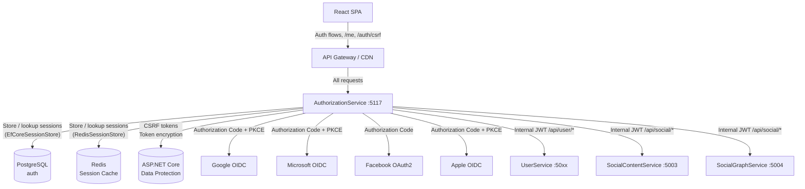
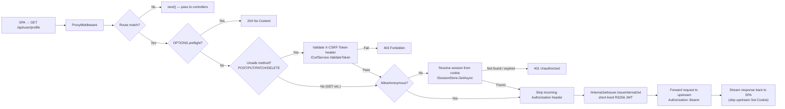
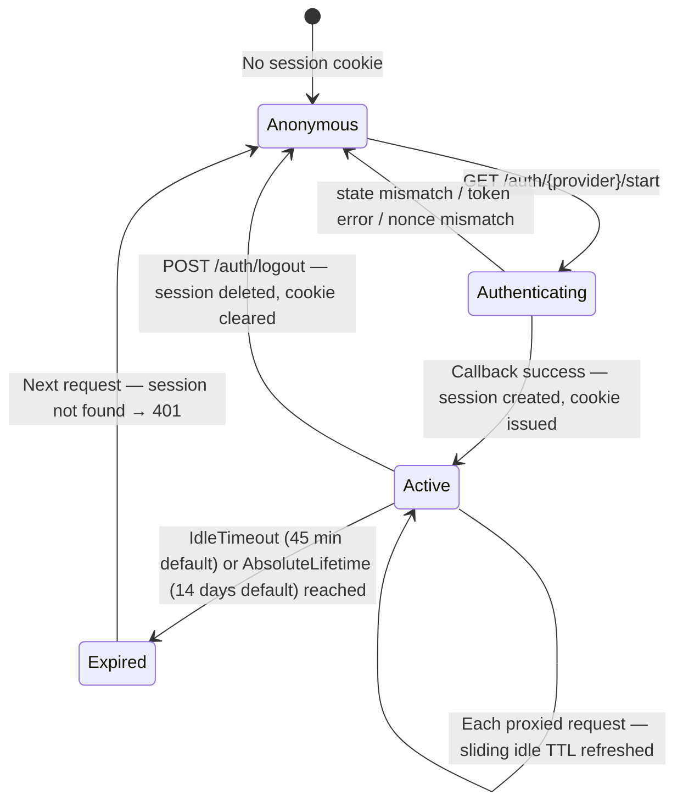
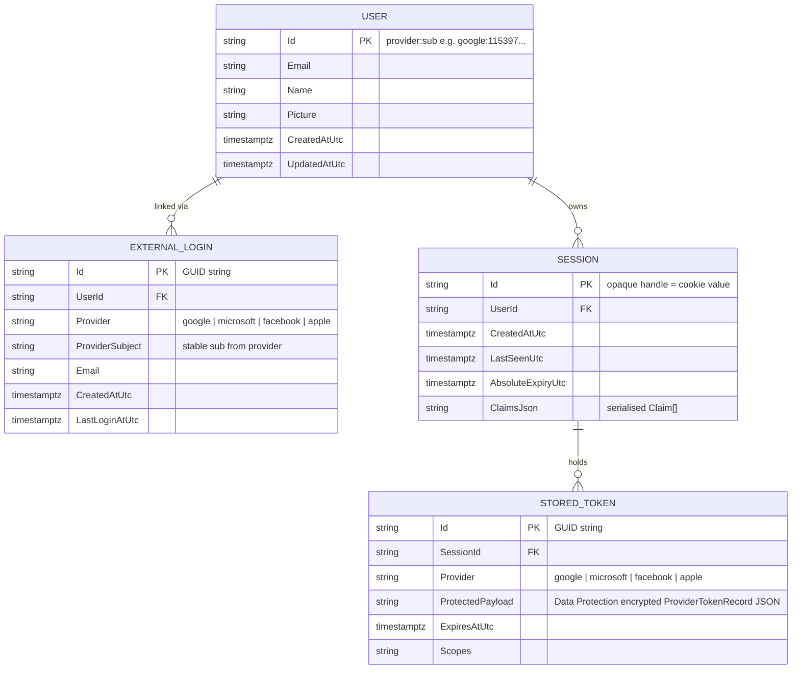

# AuthorizationService

> **Port:** 5117 &nbsp;|&nbsp; **Runtime:** ASP.NET Core (.NET 8) &nbsp;|&nbsp; **Database:** PostgreSQL (`auth`) &nbsp;|&nbsp; **Phase:** Platform / Identity

## Overview

AuthorizationService is the **centralised identity and session authority** for the SocialCommerce super-app. It implements a Backend-for-Frontend (BFF) authentication pattern, owning every phase of the OAuth2/OIDC flow so that tokens never reach the browser:

- **OIDC login** — `GET /auth/{provider}/start` generates a PKCE code verifier, a cryptographically random `state` parameter, and a `nonce`, then redirects the browser to the chosen provider's authorisation endpoint.
- **Callback handling** — `GET /auth/{provider}/callback` validates the returned `state` (one-time read from `IStateStore`), exchanges the authorisation code for tokens via the provider's token endpoint (PKCE), validates the `id_token` signature and nonce against cached JWKS, enriches the raw provider claims into a normalised `AppUser`, creates a server-side session, and issues an opaque `HttpOnly` session cookie.
- **Session identity** — `GET /me` resolves the session cookie to the stored `AppUser` and returns identity, roles, and permissions to the SPA without ever exposing a raw token.
- **CSRF protection** — `GET /auth/csrf` issues a Data Protection-backed token bound to the session handle, setting a non-`HttpOnly` `XSRF-TOKEN` double-submit cookie that the SPA echoes as an `X-CSRF-Token` header on all state-changing requests.
- **BFF reverse proxy** — `ProxyMiddleware` intercepts every `/api/*` request, validates the session cookie and CSRF token (on unsafe methods), strips the incoming `Authorization` header, mints a short-lived internal JWT carrying the user's identity and claims, and forwards the request to the appropriate upstream microservice with `Authorization: Bearer <internalJwt>`.
- **Logout** — `POST /auth/logout` (CSRF-protected) destroys the server-side session, clears the cookie, and performs best-effort provider token revocation.
- **Four OIDC providers** — Google, Microsoft, Facebook, and Apple are supported through a common `IProvider` abstraction. Apple uses a dynamically generated ES256 `client_secret` (signed JWT from the P8 private key). Facebook does not issue an `id_token` and is validated through the Graph API instead.

---

## Architecture

### Position in the Platform



### OIDC Login Flow

```mermaid
sequenceDiagram
    participant Browser
    participant AuthSvc as AuthorizationService
    participant StateStore
    participant Provider as OIDC Provider
    participant SessionStore

    Browser->>AuthSvc: GET /auth/{provider}/start?returnUrl=
    AuthSvc->>AuthSvc: GenerateCodeVerifier + CodeChallenge (S256)
    AuthSvc->>AuthSvc: Generate state (32-byte base64url)
    AuthSvc->>AuthSvc: Generate nonce (32-byte base64url)
    AuthSvc->>StateStore: Save AuthStateRecord (state → codeVerifier, nonce, returnUrl) TTL 10 min
    AuthSvc-->>Browser: 302 Redirect → provider authorise URL

    Browser->>Provider: GET /authorize?response_type=code&code_challenge=...
    Provider-->>Browser: 302 Redirect → /auth/{provider}/callback?code=&state=

    Browser->>AuthSvc: GET /auth/{provider}/callback?code=&state=
    AuthSvc->>StateStore: Load + delete AuthStateRecord (one-time)
    AuthSvc->>Provider: POST /token (code + code_verifier + client_secret)
    Provider-->>AuthSvc: access_token, id_token, refresh_token

    AuthSvc->>AuthSvc: Validate id_token (JWKS signature, issuer, audience, nonce)
    AuthSvc->>AuthSvc: ClaimsEnricher → AppUser (id, email, name, picture)
    AuthSvc->>SessionStore: CreateAsync(AppUser, claims, ProviderTokenRecord)
    AuthSvc-->>Browser: 302 Redirect returnUrl + Set-Cookie: bff.session=<handle>; HttpOnly
```

### BFF Proxy Request Flow



### Session Lifecycle



---

## Project Structure

```
services/AuthorizationService/
├── AuthorizationService.csproj      # net8.0; OIDC + JWT + EF Core + Redis + Swashbuckle
├── Program.cs                       # Composition root — all DI registrations, middleware pipeline
├── appsettings.json
│
├── Controllers/
│   ├── Auth/
│   │   ├── StartController.cs       # GET /auth/{provider}/start — PKCE + state + nonce + redirect
│   │   ├── CallbackController.cs    # GET /auth/{provider}/callback — code exchange + session creation
│   │   └── LogoutController.cs      # POST /auth/logout — CSRF-protected session + cookie teardown
│   ├── MeController.cs              # GET /me — session → AppUser + roles + permissions
│   └── CsrfController.cs            # GET /auth/csrf — issue CSRF token + XSRF-TOKEN cookie
│
├── Bff/
│   ├── ProxyMiddleware.cs           # BFF reverse proxy — session gate, CSRF, internal JWT, streaming
│   ├── ClaimsEnricher.cs            # IClaimsEnricher — provider ID token → AppUser + Claim[]
│   └── Contracts.cs                 # AppUser, SessionRecord
│
├── Oidc/
│   ├── Contracts.cs                 # AuthorizeRequest, TokenExchangeRequest/Result, IdTokenValidationResult
│   ├── PkceService.cs               # IPkceService — GenerateCodeVerifier + S256 challenge
│   ├── IdTokenValidator.cs          # IIdTokenValidator — JWKS fetch + JWT signature/nonce validation
│   ├── TokenExchangeService.cs      # ITokenExchangeService — authorization_code + refresh_token grant
│   ├── ProviderLogoutService.cs     # IProviderLogoutService — best-effort token revocation (no-op default)
│   └── Providers/
│       ├── IProvider.cs             # IProvider interface + ProviderTokenBuildArgs
│       ├── ProviderRegistry.cs      # IProviderRegistry — case-insensitive provider lookup by name
│       ├── GoogleProvider.cs        # Google OIDC — standard PKCE; offline access; JWKS validation
│       ├── MicrosoftProvider.cs     # Microsoft OIDC — common tenant endpoint
│       ├── FacebookProvider.cs      # Facebook OAuth2 — no id_token; Graph API validation
│       └── AppleProvider.cs         # Apple OIDC — ES256 dynamic client_secret from P8 key + form_post
│
├── Sessions/
│   ├── SessionStore.cs              # ISessionStore + InMemorySessionStore + ProviderTokenRecord + SessionCreateRequest
│   ├── RedisSessionStore.cs         # Redis-backed session store — sliding + absolute expiry
│   ├── CookieIssuer.cs              # ICookieIssuer — __Host- prefix, HttpOnly, persistent / session cookie
│   ├── SessionCookieOptions.cs      # Session cookie configuration POCO
│   └── TokenProtection.cs           # ITokenProtector — Data Protection encrypt/decrypt ProviderTokenRecord
│
├── Security/
│   ├── CsrfService.cs               # ICsrfService — double-submit + header-only CSRF token modes
│   ├── StateStore.cs                # IStateStore + InMemoryStateStore + DistributedStateStore + AuthStateRecord
│   └── SecurityOptions.cs           # Security configuration POCO (state TTL, nonce TTL, CSRF options)
│
├── Options/
│   ├── BffProxyOptions.cs           # BFF route table (PathPrefix, Destination, AttachInternalJwt, AllowAnonymous)
│   ├── GoogleOptions.cs
│   ├── MicrosoftOptions.cs
│   ├── FacebookOptions.cs
│   ├── AppleOptions.cs              # Includes TeamId, KeyId, P8PrivateKeyPem for client_secret generation
│   └── InternalJwtOptions.cs        # Issuer, Audience, LifetimeSeconds, RSA/HMAC signing key
│
├── Infrastructure/
│   └── Persistence/
│       ├── AppDbContext.cs          # EF Core DbContext — 4 DbSets, indexes, cascade-delete rules
│       ├── Entities/
│       │   ├── User.cs              # Stable app-level identity ("provider:sub" PK)
│       │   ├── ExternalLogin.cs     # Provider-to-User link (supports multiple providers per user)
│       │   ├── Session.cs           # EF Core server-side session row
│       │   └── StoredToken.cs       # Encrypted provider tokens stored per session
│       └── Migrations/
│
└── Properties/
    └── launchSettings.json          # Local dev — http://localhost:5117
```

---

## Authentication & Session Architecture

### Cookie & Token Flow

AuthorizationService never sends OAuth2 tokens or JWTs to the browser. The browser holds a single opaque `HttpOnly` cookie (`bff.session` by default, emitted with the `__Host-` prefix when conditions allow). All token custody remains server-side:

| Artefact | Location | Lifetime | Purpose |
|---|---|---|---|
| Session handle | `HttpOnly` cookie (`bff.session`) | Idle 45 min / absolute 14 days | Identifies server-side session |
| `AppUser` + claims | Session store (Redis or EF Core) | Same as cookie | Identity resolved by `GET /me` and proxy middleware |
| Provider access token | Session store (encrypted via Data Protection) | Provider-issued | Passed to `IProviderLogoutService` for revocation; available for token-refresh |
| Provider refresh token | Session store (encrypted via Data Protection) | Provider-issued | Used by `ITokenExchangeService.RefreshAsync` when access token nears expiry |
| Internal JWT | In-memory (constructed per proxied request) | 180 s (default) | Carries `AppUser` claims to downstream microservices; never persisted |
| CSRF token | `XSRF-TOKEN` non-`HttpOnly` cookie + response body | 30 min (default) | SPA echoes as `X-CSRF-Token` header on all unsafe requests |

### PKCE (`IPkceService`)

Every login generates a fresh code verifier (64 URL-safe base64url characters, ~384 bits) and its S256 code challenge. The verifier is stored in `AuthStateRecord` alongside the `state` and `nonce` in `IStateStore` (TTL 10 min). The verifier is consumed once on callback and never stored in a client-visible location.

### ID Token Validation (`IIdTokenValidator`)

On callback, the service fetches the provider's JWKS (cached in `IMemoryCache` to avoid per-request network round-trips), then validates:

1. Signature against one of the published JWKS keys
2. Issuer (`iss`) against `IProvider.Authority`
3. Audience (`aud`) against `IProvider.ClientId`
4. Expiry (`exp`) with ±5-minute clock skew
5. Nonce (`nonce`) matches the value saved during `/start`

Facebook does not issue `id_token`; its callback path validates identity through the Graph API instead.

### Internal JWT (`IInternalJwtIssuer`)

Each proxied request triggers on-the-fly minting of a short-lived RS256 (or HS256 in dev) JWT containing the user's `AppUser.Id`, `email`, `name`, and any `role` / `perm` claims from the session. Downstream microservices validate this token independently — they trust `authorization-service` as the issuer, and need only the corresponding public key.

---

## Data Model

### ER Diagram



> The EF Core persistence layer (`EfCoreSessionStore`) is **optional**. The default and development store is `RedisSessionStore`. The EF Core entities exist for scenarios where durable session storage, audit trails, or administrative session management (e.g., forced logout of all user sessions) are required.

### Entity Column Summary

#### `users`

| Column | Type | Nullable | Notes |
|---|---|---|---|
| `Id` | `varchar(160)` | No | PK; format `"provider:sub"` (e.g., `"google:115397735986226032844"`) |
| `Email` | `varchar(320)` | Yes | Sourced from `id_token`; may be absent for some Apple logins |
| `Name` | `varchar(200)` | Yes | Display name from provider claims |
| `Picture` | `varchar(500)` | Yes | Profile photo URL |
| `CreatedAtUtc` | `timestamptz` | No | First login timestamp |
| `UpdatedAtUtc` | `timestamptz` | No | Last claims refresh timestamp |

#### `external_logins`

| Column | Type | Nullable | Notes |
|---|---|---|---|
| `Id` | `varchar(64)` | No | PK (GUID) |
| `UserId` | `varchar(160)` | No | FK → `users.Id`; cascade delete |
| `Provider` | `varchar(40)` | No | `"google"`, `"microsoft"`, `"facebook"`, `"apple"` |
| `ProviderSubject` | `varchar(200)` | No | Stable `sub` claim from provider |
| `Email` | `varchar(320)` | Yes | Email at time of last login |
| `CreatedAtUtc` | `timestamptz` | No | |
| `LastLoginAtUtc` | `timestamptz` | No | Updated on each successful callback |

#### `sessions`

| Column | Type | Nullable | Notes |
|---|---|---|---|
| `Id` | `varchar(200)` | No | PK; opaque handle — equal to the cookie value issued to the browser |
| `UserId` | `varchar(160)` | No | FK → `users.Id`; cascade delete |
| `CreatedAtUtc` | `timestamptz` | No | |
| `LastSeenUtc` | `timestamptz` | No | Updated on each active request (sliding TTL) |
| `AbsoluteExpiryUtc` | `timestamptz` | Yes | Hard cap; `null` means no absolute expiry configured |
| `ClaimsJson` | `text` | Yes | JSON-serialised `ClaimDto[]` — roles, permissions, custom claims |

#### `stored_tokens`

| Column | Type | Nullable | Notes |
|---|---|---|---|
| `Id` | `varchar(64)` | No | PK (GUID) |
| `SessionId` | `varchar(200)` | No | FK → `sessions.Id`; cascade delete |
| `Provider` | `varchar(40)` | No | Which provider issued this token |
| `ProtectedPayload` | `text` | No | ASP.NET Core Data Protection ciphertext of `ProviderTokenRecord` JSON |
| `ExpiresAtUtc` | `timestamptz` | No | Provider-issued `expires_in` timestamp; used to drive refresh |
| `Scopes` | `varchar(2000)` | Yes | Space-delimited granted scopes |

### Database Indexes

| Index | Table | Columns | Purpose |
|---|---|---|---|
| `PK_users` | `users` | `(Id)` | Primary key lookup |
| `IX_users_Email` | `users` | `(Email)` | Find user by email (e.g., deduplication on first login) |
| `PK_external_logins` | `external_logins` | `(Id)` | Primary key lookup |
| `IX_external_logins_Provider_Subject` | `external_logins` | `(Provider, ProviderSubject)` | Unique; prevents duplicate provider links; used on every callback to find existing user |
| `PK_sessions` | `sessions` | `(Id)` | Session handle lookup on every proxied request |
| `IX_sessions_LastSeenUtc` | `sessions` | `(LastSeenUtc)` | Background cleanup of idle/expired sessions |
| `PK_stored_tokens` | `stored_tokens` | `(Id)` | Primary key lookup |
| `IX_stored_tokens_SessionId_Provider` | `stored_tokens` | `(SessionId, Provider)` | Unique; one token record per provider per session; used by refresh path |
| `IX_stored_tokens_ExpiresAtUtc` | `stored_tokens` | `(ExpiresAtUtc)` | Background cleanup of expired tokens |

---

## API Reference

### Auth Controller — `/auth`

| Method | Path | Auth | Query / Body | Success | Description |
|---|---|---|---|---|---|
| `GET` | `/auth/{provider}/start` | None | `?returnUrl=` | `302` → provider | Generates PKCE verifier + challenge, `state`, `nonce`; saves `AuthStateRecord`; redirects to provider authorise URL |
| `GET` | `/auth/{provider}/callback` | None (provider redirect) | `?code`, `?state`, `?error` | `302` → returnUrl | Validates `state`; exchanges code + verifier; validates `id_token`; creates session; issues cookie |
| `POST` | `/auth/logout` | Session cookie + `X-CSRF-Token` | — | `204` | Deletes session; clears cookie; best-effort provider token revocation |
| `GET` | `/auth/csrf` | Session cookie | — | `200 { token }` + `XSRF-TOKEN` cookie | Issues a Data Protection-backed CSRF token bound to the session handle |

#### `{provider}` Values

| Value | Protocol | Notes |
|---|---|---|
| `google` | OIDC Authorization Code + PKCE | `access_type=offline&prompt=consent` for refresh tokens |
| `microsoft` | OIDC Authorization Code + PKCE | Common tenant endpoint — works for personal + work accounts |
| `facebook` | OAuth2 Authorization Code | No `id_token`; identity validated via Graph API |
| `apple` | OIDC Authorization Code + PKCE | `response_mode=form_post`; dynamic ES256 `client_secret` signed from P8 key |

#### `returnUrl` Validation

`StartController` validates the `returnUrl` against `Auth:ReturnUrl:AllowedPathPrefixes` (path-only, no external origins by default) to prevent open-redirect attacks. Invalid or absent values fall back to `Auth:ReturnUrl:DefaultPath` (`"/"`).

### Identity Controller — `/me`

| Method | Path | Auth | Success | Errors | Description |
|---|---|---|---|---|---|
| `GET` | `/me` | Session cookie | `200 MeResponse` | `401` | Resolves session handle → `AppUser`; returns id, email, name, picture, roles (`claim type "role"`), permissions (`claim type "perm"`) |

### BFF Proxy — `/api/*`

| Method | Path | Auth | Description |
|---|---|---|---|
| `ANY` | `/api/user/**` | Session + CSRF (unsafe methods) | Proxied to `UserService`; internal JWT attached |
| `ANY` | `/api/social/**` | Session + CSRF (unsafe methods) | Proxied to `SocialContentService` / `SocialGraphService`; internal JWT attached |
| `ANY` | `/api/public/**` | None (`AllowAnonymous: true`) | Proxied without session requirement; no internal JWT |

> Route table is fully configurable via `BffProxy:Routes[]` in `appsettings.json`. The examples above reflect the default development configuration.

#### CSRF Enforcement

| Request type | CSRF required? |
|---|---|
| `GET`, `HEAD`, `OPTIONS` | No |
| `POST`, `PUT`, `PATCH`, `DELETE` on `AllowAnonymous: false` routes | **Yes** — `X-CSRF-Token` header must match the session-bound token |
| `POST`, `PUT`, `PATCH`, `DELETE` on `AllowAnonymous: true` routes | No |

---

## Data Transfer Objects

### `MeResponse`

```json
{
  "id": "google:115397735986226032844",
  "email": "alice@example.com",
  "name": "Alice Smith",
  "picture": "https://lh3.googleusercontent.com/...",
  "roles": ["user", "moderator"],
  "permissions": ["post:create", "post:delete"]
}
```

### CSRF Token Response

```json
{
  "token": "CfDJ8..."
}
```

> The same value is also set as the `XSRF-TOKEN` non-`HttpOnly` cookie. The SPA must read this cookie and forward its value as the `X-CSRF-Token` request header.

### `SessionRecord` (internal — BFF + `/me`)

```json
{
  "userId": "google:115397735986226032844",
  "email": "alice@example.com",
  "name": "Alice Smith",
  "picture": "https://...",
  "claims": [
    { "type": "role", "value": "moderator" },
    { "type": "perm", "value": "post:delete" }
  ]
}
```

---

## OIDC Service Internals

### Provider Abstraction (`IProvider`)

All four providers implement `IProvider`:

```
IProvider
  ├── Name              — "google" | "microsoft" | "facebook" | "apple"
  ├── ClientId          — app registration client ID
  ├── ClientSecret      — static (Google/Microsoft/Facebook) or null (Apple — dynamic)
  ├── AuthorizeEndpoint — provider authorise URL
  ├── TokenEndpoint     — provider token URL
  ├── JwksUri           — JWKS endpoint for id_token validation (null for Facebook)
  ├── Authority         — expected issuer (null for Facebook)
  ├── BuildAuthorizeUrl(AuthorizeRequest)         → string
  └── BuildTokenRequestAsync(ProviderTokenBuildArgs) → Dictionary<string,string>
```

`IProviderRegistry` wraps the four singletons, providing case-insensitive lookup by name. An unknown provider name in `/auth/{provider}/start` returns `404`.

### Token Exchange (`ITokenExchangeService`)

`TokenExchangeService` supports two grant types against any `IProvider`:

- `RedeemCodeAsync` — `authorization_code` with `code_verifier` (PKCE)
- `RefreshAsync` — `refresh_token` grant

Responses are parsed from JSON (`access_token`, `refresh_token`, `id_token`, `expires_in`, `scope`). HTTP errors produce a `TokenExchangeResult.Fail(reason)` without throwing.

### Claims Enrichment (`IClaimsEnricher`)

`ClaimsEnricher.EnrichAsync` maps provider-specific `id_token` payload fields to a normalised `AppUser`:

| Provider field | Maps to |
|---|---|
| `sub` | `AppUser.Id` suffix (combined with provider name as `"provider:sub"`) |
| `email` / `preferred_username` | `AppUser.Email` |
| `name` / `given_name + family_name` | `AppUser.Name` |
| `picture` / `avatar` | `AppUser.Picture` |

---

## Service Dependencies

### Outbound (AuthorizationService calls…)

| Dependency | Type | Required | Purpose |
|---|---|---|---|
| PostgreSQL | TCP (EF Core / Npgsql) | If `Sessions:UseEfCoreStore: true` | Persist `users`, `external_logins`, `sessions`, `stored_tokens` |
| Redis | TCP (StackExchange.Redis) | No (fallback: `InMemorySessionStore`) | Session storage with sliding TTL; also used for `DistributedStateStore` |
| Google | HTTPS | No (provider optional) | OIDC authorise + token + JWKS endpoints |
| Microsoft | HTTPS | No (provider optional) | OIDC authorise + token + JWKS endpoints |
| Facebook | HTTPS | No (provider optional) | OAuth2 authorise + token + Graph API identity validation |
| Apple | HTTPS | No (provider optional) | OIDC authorise + token + JWKS endpoints |
| UserService | HTTP (BFF proxy) | Yes (if route configured) | Forwards `/api/user/*` requests with internal JWT |
| SocialContentService | HTTP (BFF proxy) | Yes (if route configured) | Forwards `/api/social/*` requests with internal JWT |
| ASP.NET Core Data Protection | In-process | **Yes** | CSRF token signing; provider token encryption at rest |

### Inbound (…calls AuthorizationService)

| Caller | Endpoint(s) | Purpose |
|---|---|---|
| React SPA / Browser | `GET /auth/{provider}/start` | Initiate login |
| OIDC Provider | `GET /auth/{provider}/callback` | Deliver authorisation code |
| React SPA | `GET /me` | Retrieve current user identity |
| React SPA | `GET /auth/csrf` | Obtain CSRF token before mutating operations |
| React SPA | `POST /auth/logout` | End session |
| React SPA | `ANY /api/*` | BFF-proxied calls to downstream microservices |

---

## Configuration

### `appsettings.json` Keys

| Key | Required | Default | Description |
|---|---|---|---|
| `ConnectionStrings:Default` | If `UseEfCoreStore: true` | `Host=postgres;Database=auth;...` | Npgsql connection string for EF Core session persistence |
| `ConnectionStrings:Redis` | No | `localhost:6379` | Redis connection string for `RedisSessionStore` |
| `Cors:AllowedOrigins` | **Yes** | `[]` | Array of allowed CORS origins; must include the SPA origin |
| `DataProtection:KeysDirectory` | No | *(in-memory keys)* | File-system path for persisting Data Protection keys across restarts |
| `Sessions:UseEfCoreStore` | No | `false` | `true` to use EF Core PostgreSQL session store; `false` uses `RedisSessionStore` |
| `SessionCookie:Name` | No | `bff.session` | Cookie name; emitted as `__Host-bff.session` when `UseHostPrefix: true` |
| `SessionCookie:UseHostPrefix` | No | `true` | Emits `__Host-` prefix (requires Secure + Path=/ + no Domain) |
| `SessionCookie:IdleTimeoutMinutes` | No | `45` | Sliding idle TTL for server-side session |
| `SessionCookie:AbsoluteLifetimeDays` | No | `14` | Hard cap on session lifetime (0 = disabled) |
| `SessionCookie:PersistentCookie` | No | `false` | Issue `Max-Age` persistent cookie; if `false`, session cookie (browser lifetime) |
| `Security:StateTtlMinutes` | No | `10` | TTL for PKCE state records in `IStateStore` |
| `Security:NonceTtlMinutes` | No | `10` | TTL for nonce records |
| `Security:Csrf:Mode` | No | `DoubleSubmit` | `DoubleSubmit` (cookie + header) or `HeaderOnly` |
| `Security:Csrf:CookieName` | No | `XSRF-TOKEN` | Non-`HttpOnly` CSRF double-submit cookie name |
| `Security:Csrf:HeaderName` | No | `X-CSRF-Token` | Expected request header for CSRF validation |
| `Security:Csrf:TokenTtlMinutes` | No | `30` | CSRF token validity window |
| `Auth:ReturnUrl:AllowedPathPrefixes` | No | `["/"]` | Safe return URL path prefixes after login |
| `Auth:ReturnUrl:AllowExternal` | No | `false` | Allow cross-origin return URLs (dangerous — keep `false`) |
| `Auth:Google:ClientId` | If Google enabled | — | Google OAuth2 app client ID |
| `Auth:Google:ClientSecret` | If Google enabled | — | Google OAuth2 app client secret |
| `Auth:Google:RedirectUri` | If Google enabled | — | Must match Google console registration |
| `Auth:Microsoft:ClientId` | If Microsoft enabled | — | Azure AD app registration client ID |
| `Auth:Microsoft:ClientSecret` | If Microsoft enabled | — | Azure AD app registration client secret |
| `Auth:Facebook:ClientId` | If Facebook enabled | — | Facebook app ID |
| `Auth:Facebook:ClientSecret` | If Facebook enabled | — | Facebook app secret |
| `Auth:Apple:ClientId` | If Apple enabled | — | Apple Services ID |
| `Auth:Apple:TeamId` | If Apple enabled | — | Apple Developer Team ID |
| `Auth:Apple:KeyId` | If Apple enabled | — | Apple private key ID |
| `Auth:Apple:P8PrivateKeyPem` | If Apple enabled | — | ES256 private key PEM (store in secret manager) |
| `BffProxy:Routes[]` | No | See below | Array of `{ PathPrefix, Destination, AttachInternalJwt, AllowAnonymous, TimeoutSeconds }` |
| `InternalJwt:Issuer` | No | `authorization-service` | JWT `iss` claim sent to downstream services |
| `InternalJwt:Audience` | No | `socialcommerce-internal` | JWT `aud` claim sent to downstream services |
| `InternalJwt:LifetimeSeconds` | No | `180` | Internal JWT validity window (3 minutes) |
| `InternalJwt:RsaPrivateKeyPem` | Production | — | RS256 signing key for internal JWTs (HMAC symmetric key usable in dev) |

### Default BFF Proxy Routes

```json
"BffProxy": {
  "Routes": [
    { "PathPrefix": "/api/user/",   "Destination": "http://userservice:8080/",   "AttachInternalJwt": true,  "AllowAnonymous": false, "TimeoutSeconds": 15 },
    { "PathPrefix": "/api/social/", "Destination": "http://socialsvc:8080/",     "AttachInternalJwt": true,  "AllowAnonymous": false, "TimeoutSeconds": 15 },
    { "PathPrefix": "/api/public/", "Destination": "http://publicsvc:8080/",     "AttachInternalJwt": false, "AllowAnonymous": true,  "TimeoutSeconds": 10 }
  ]
}
```

---

## Containerization

### Dockerfile Stages

| Stage | Base Image | Purpose |
|---|---|---|
| `base` | `mcr.microsoft.com/dotnet/aspnet:8.0` | Final runtime layer |
| `build` | `mcr.microsoft.com/dotnet/sdk:8.0` | Restores and compiles service |
| `publish` | *(from build)* | `dotnet publish` in Release mode |
| `final` | *(from base)* | Copies published output; `ENTRYPOINT` |

### `docker-compose.yml` Service Entry (example)

```yaml
authorizationservice:
  build:
    context: .
    dockerfile: services/AuthorizationService/Dockerfile
  environment:
    ASPNETCORE_URLS: http://+:8080
    ASPNETCORE_ENVIRONMENT: Development
    ConnectionStrings__Default: "Host=postgres;Port=5432;Database=auth;Username=postgres;Password=1234;Ssl Mode=Disable"
    ConnectionStrings__Redis: "redis:6379,abortConnect=false"
    Cors__AllowedOrigins__0: "http://localhost:3000"
    Sessions__UseEfCoreStore: "true"
    Auth__Google__ClientId: "${GOOGLE_CLIENT_ID}"
    Auth__Google__ClientSecret: "${GOOGLE_CLIENT_SECRET}"
    Auth__Google__RedirectUri: "http://localhost:5117/auth/google/callback"
    InternalJwt__RsaPrivateKeyPem: "${INTERNAL_JWT_RSA_PRIVATE_PEM}"
  ports:
    - "5117:8080"
  depends_on:
    postgres:
      condition: service_healthy
    redis:
      condition: service_started
```

> Data Protection keys should be persisted to a mounted volume in production (`DataProtection__KeysDirectory`). Without persistence, all sessions are invalidated on container restart.

---

## Migrations

| Migration | Date | Tables Created |
|---|---|---|
| *(initial)* | — | `users`, `external_logins`, `sessions`, `stored_tokens` |

### EF Core Commands

```bash
# Add a new migration
dotnet ef migrations add <MigrationName> \
  --project services/AuthorizationService \
  --startup-project services/AuthorizationService

# Apply migrations manually
dotnet ef database update \
  --project services/AuthorizationService \
  --startup-project services/AuthorizationService
```

In development, `db.Database.MigrateAsync()` is called automatically on startup (guarded by `app.Environment.IsDevelopment()`).

---

## Key Design Decisions

| Decision | Rationale |
|---|---|
| **BFF pattern — tokens never reach the browser** | Storing tokens in `localStorage` or `sessionStorage` exposes them to XSS attacks. The BFF pattern confines all token custody to server memory and encrypted server-side storage. The browser holds only an opaque `HttpOnly` cookie that has no value outside the TLS session it was issued on. |
| **`IProvider` abstraction over built-in ASP.NET Core handlers** | ASP.NET Core's built-in `AddGoogleAuthentication` / `AddOpenIdConnect` use cookie-based state that conflicts with the custom session and CSRF model. A bespoke `IProvider` interface gives precise control over every parameter of each OIDC round-trip, including PKCE, response mode, and dynamic `client_secret` generation for Apple. |
| **PKCE for all providers** | PKCE (RFC 7636) prevents authorisation code interception attacks without relying on `client_secret` alone. It is mandatory for Apple and Google and applied uniformly to all providers for consistency, even where not strictly required. |
| **Opaque session handle (not a self-contained JWT in the cookie)** | A self-contained JWT cookie cannot be revoked before expiry (logout is a no-op). An opaque handle forces a server-side session lookup on every request, enabling instant revocation via `ISessionStore.DeleteAsync`. |
| **Three session store implementations** | `InMemorySessionStore` enables zero-dependency local development and unit tests. `RedisSessionStore` is the production default — fast, TTL-managed, and horizontally scalable. `EfCoreSessionStore` is available when durable audit trails or admin session management (force-logout all) are needed; it adds a database round-trip per request but enables session enumeration queries. |
| **Data Protection for token encryption at rest** | Provider access and refresh tokens stored in Redis or PostgreSQL are encrypted with ASP.NET Core Data Protection (`AuthorizationService.StoredTokens.v1` purpose string). If the Data Protection key ring is compromised, stored tokens cannot be decrypted without the key; rotation of Data Protection keys invalidates all existing encrypted token payloads gracefully (stored tokens are re-encrypted on next refresh). |
| **CSRF double-submit cookie pattern** | The SPA reads the non-`HttpOnly` `XSRF-TOKEN` cookie (set by `GET /auth/csrf`) and echoes it as an `X-CSRF-Token` header. The server validates the header value against the session-bound protected token. Cross-origin attackers cannot read `HttpOnly` cookies and cannot craft the correct header value, providing CSRF protection without requiring a synchroniser token in server state per request. |
| **Short-lived internal JWTs (180 s default)** | Downstream microservices validate internal JWTs using the public RSA key without contacting AuthorizationService per request. The short lifetime bounds the blast radius of a compromised internal JWT to three minutes. Downstream services do not need to maintain a revocation list. |
| **`__Host-` cookie prefix** | When `UseHostPrefix: true` (default), the session cookie is emitted with the `__Host-` prefix, which the browser enforces to only send on HTTPS requests to the exact host (no subdomain leakage). This prevents session fixation via a sibling subdomain. |
| **Best-effort provider logout (`NoopProviderLogoutService` default)** | Provider token revocation endpoints are unreliable and slow (especially Apple). Local logout (session delete + cookie clear) is always fast and deterministic. The `IProviderLogoutService` interface allows `TokenRevocationProviderLogoutService` to be swapped in when best-effort revocation is desired, but it is not in the critical path. |
| **`user.followed` / downstream events not consumed** | AuthorizationService is identity-only. It does not subscribe to Service Bus topics. Identity changes (e.g., profile updates) propagate to downstream services through the internal JWT claims on the next request, or via explicit `GET /me` polling from the SPA. |
