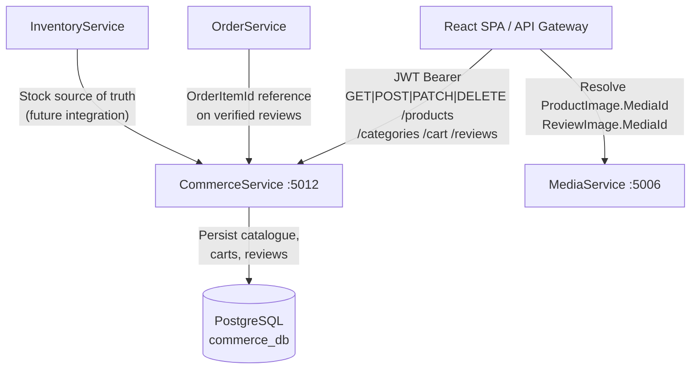
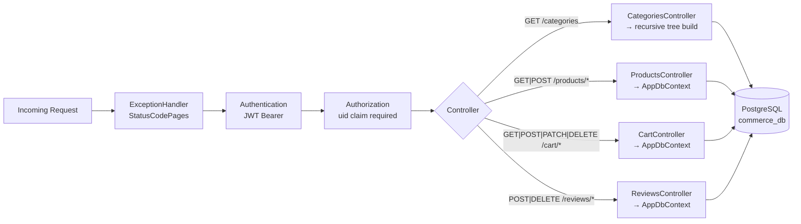
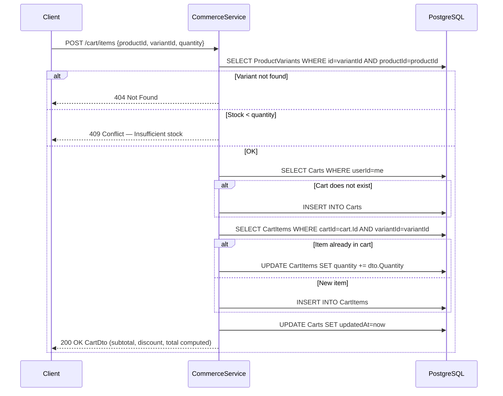
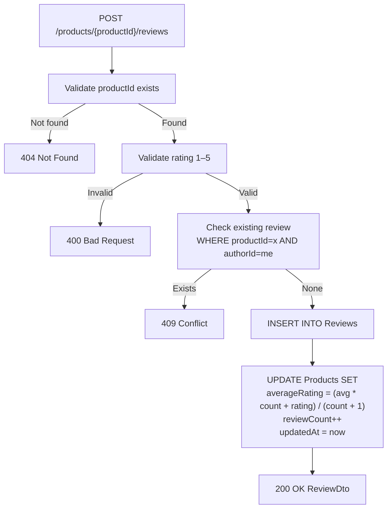
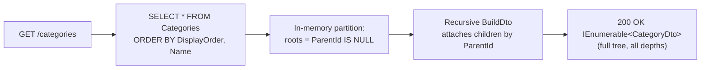
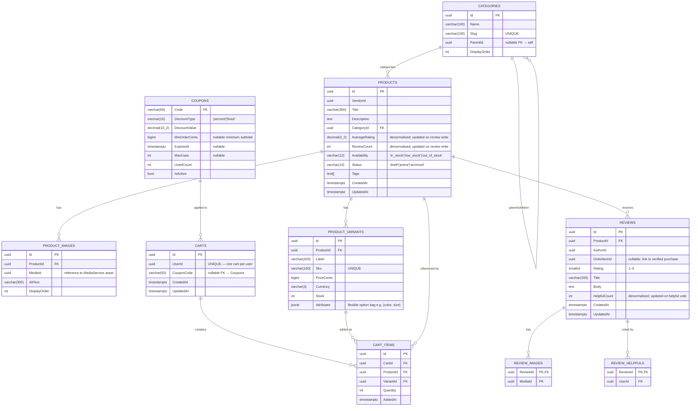

# CommerceService

> **Port:** 5012 &nbsp;|&nbsp; **Runtime:** ASP.NET Core (.NET 9) &nbsp;|&nbsp; **Database:** PostgreSQL (`commerce_db`) &nbsp;|&nbsp; **Phase:** Commerce

## Overview

CommerceService is the **product catalogue and shopping authority** for the SocialCommerce super-app. It owns:

- **Category tree** — A hierarchical, self-referential category structure with unique slugs and display ordering, returned as a fully-resolved recursive tree in a single query.
- **Product catalogue** — Active products browsable by category slug and availability status, sortable by recency, average rating, or review count, and cursor-paginated. Each product carries vendor attribution, a `text[]` tag array, and denormalised aggregate rating fields.
- **Product variants** — Every product has one or more variants, each with its own SKU, price (stored in integer cents), stock count, and a JSONB attribute bag for flexible option modelling (e.g., `{ "color": "red", "size": "M" }`).
- **Product images** — Ordered media references linked to `MediaService` by `MediaId`. Content resolution is delegated to the consuming client.
- **Product search** — Case-insensitive full-text substring search across product title and description using PostgreSQL `ILike`, scoped to active products.
- **Related products** — Returns up to N active products in the same category, ranked by average rating, excluding the anchor product.
- **Shopping cart** — A per-user cart, auto-created on first access, holding any number of line items. Stock is validated at add-time. Adding a duplicate variant increments the existing quantity rather than inserting a second row.
- **Coupons** — Supports `percent` and `fixed` discount types, optional minimum order threshold, expiry date, and max-use cap. Cart totals (subtotal, discount, total) are computed in cents on every response, never persisted.
- **Product reviews** — One review per authenticated user per product, rated 1–5. `AverageRating` and `ReviewCount` on the `Product` row are updated incrementally on every new submission. Optional `OrderItemId` links a review to a purchase for verified-buyer display.
- **Review helpfulness** — Users vote reviews helpful with an idempotent add and an explicit remove; `HelpfulCount` on the `Review` row is kept in sync.

---

## Architecture

### Position in the Platform



> `CommerceService` stores `MediaId` and `OrderItemId` as opaque UUID references. It never calls `MediaService` or `OrderService` directly — those cross-service resolutions are the responsibility of the consuming client or a future integration layer.

### Request Pipeline



### Cart Mutation Flow



### Review Creation Flow



### Category Tree Resolution



---

## Project Structure

```
services/CommerceService/
├── CommerceService.csproj              # net9.0; JWT Bearer, EF Core, Npgsql, Swashbuckle
├── Program.cs                          # Composition root — EF Core, JWT auth, controllers
├── appsettings.json
├── appsettings.Development.json
│
├── Controllers/
│   ├── CategoriesController.cs         # GET /categories — full recursive tree
│   ├── ProductsController.cs           # /products — browse, get, search, related, reviews (CRUD)
│   ├── CartController.cs               # /cart — get, add/update/remove items, coupon apply/remove
│   └── ReviewsController.cs            # /reviews — helpful vote add/remove
│
├── Data/
│   ├── AppDbContext.cs                 # EF Core DbContext — 10 DbSets, composite PKs, cascade deletes
│   ├── AppDbFactory.cs                 # IDesignTimeDbContextFactory for EF CLI
│   ├── Entities.cs                     # Category, Product, ProductImage, ProductVariant,
│   │                                   # Cart, CartItem, Coupon, Review, ReviewImage, ReviewHelpful
│   └── Migrations/
│       └── 20260322185033_InitialCreate  # Full schema — all 10 tables + indexes
│
├── Dtos/
│   └── CommerceDtos.cs                 # All request/response records — CategoryDto, ProductDto,
│                                       # ProductSummaryDto, CartDto, ReviewDto, PagedResult<T>, …
│
├── Auth/
│   └── JwtAuthExtensions.cs            # AddServiceJwtAuth — symmetric HMAC JWT, uid claim, 30 s clock skew
│
└── Properties/
    └── launchSettings.json             # Local dev — http://localhost:5012
```

---

## Data Model

### ER Diagram



### Entity Column Summary

#### `Categories`

| Column | Type | Nullable | Notes |
|---|---|---|---|
| `Id` | `uuid` | No | PK; generated by `uuid_generate_v4()` |
| `Name` | `varchar(100)` | No | Display name |
| `Slug` | `varchar(100)` | No | URL-safe identifier; **unique** index |
| `ParentId` | `uuid` | Yes | Self-referencing FK; `null` for root categories |
| `DisplayOrder` | `int` | No | Sort order within a level |

#### `Products`

| Column | Type | Nullable | Notes |
|---|---|---|---|
| `Id` | `uuid` | No | PK |
| `VendorId` | `uuid` | No | Seller identity; indexed |
| `Title` | `varchar(300)` | No | Searchable via `ILike` |
| `Description` | `text` | No | Searchable via `ILike` |
| `CategoryId` | `uuid` | No | FK → `Categories` (cascade delete); indexed |
| `AverageRating` | `decimal(3,2)` | No | Incremental running mean; updated on review write |
| `ReviewCount` | `int` | No | Incremental counter; updated on review write |
| `Availability` | `varchar(12)` | No | `"in_stock"`, `"low_stock"`, or `"out_of_stock"` |
| `Status` | `varchar(10)` | No | `"draft"`, `"active"`, or `"archived"`; indexed |
| `Tags` | `text[]` | No | PostgreSQL native array |
| `CreatedAt` | `timestamptz` | No | Pagination cursor for browse/search |
| `UpdatedAt` | `timestamptz` | No | Set on any product mutation |

#### `ProductVariants`

| Column | Type | Nullable | Notes |
|---|---|---|---|
| `Id` | `uuid` | No | PK |
| `ProductId` | `uuid` | No | FK → `Products` (cascade delete); indexed |
| `Label` | `varchar(200)` | No | Human-readable name (e.g., `"Red / Medium"`) |
| `Sku` | `varchar(100)` | No | **Unique** stock-keeping unit |
| `PriceCents` | `bigint` | No | Price in smallest currency unit (e.g., cents) |
| `Currency` | `varchar(3)` | No | ISO 4217 code (e.g., `"USD"`) |
| `Stock` | `int` | No | Available units; checked at cart add-time |
| `Attributes` | `jsonb` | No | Flexible option map (e.g., `{"color":"red","size":"M"}`) |

#### `Carts`

| Column | Type | Nullable | Notes |
|---|---|---|---|
| `Id` | `uuid` | No | PK |
| `UserId` | `uuid` | No | **Unique** — enforces one-cart-per-user |
| `CouponCode` | `varchar(50)` | Yes | FK → `Coupons.Code`; `null` if no coupon applied |
| `CreatedAt` | `timestamptz` | No | Set at cart creation |
| `UpdatedAt` | `timestamptz` | No | Bumped on every cart mutation |

#### `Coupons`

| Column | Type | Nullable | Notes |
|---|---|---|---|
| `Code` | `varchar(50)` | No | PK; the coupon string callers enter |
| `DiscountType` | `varchar(10)` | No | `"percent"` or `"fixed"` |
| `DiscountValue` | `decimal(10,2)` | No | Percentage (e.g., `10.00`) or fixed amount in currency units (e.g., `5.00`) |
| `MinOrderCents` | `bigint` | Yes | Minimum subtotal required before the coupon applies |
| `ExpiresAt` | `timestamptz` | Yes | Coupon invalid after this timestamp |
| `MaxUses` | `int` | Yes | Usage cap; `null` = unlimited |
| `UsedCount` | `int` | No | Incremented on successful checkout (owned by `OrderService`) |
| `IsActive` | `bool` | No | Soft-enable/disable flag |

#### `Reviews`

| Column | Type | Nullable | Notes |
|---|---|---|---|
| `Id` | `uuid` | No | PK |
| `ProductId` | `uuid` | No | FK → `Products` (cascade delete); composite index with `AuthorId` |
| `AuthorId` | `uuid` | No | Caller's `uid` JWT claim; composite index with `ProductId` |
| `OrderItemId` | `uuid` | Yes | Optional reference to a purchase line item for verified-buyer display |
| `Rating` | `smallint` | No | 1–5; validated in controller |
| `Title` | `varchar(200)` | No | Review headline |
| `Body` | `text` | No | Review text |
| `HelpfulCount` | `int` | No | Incremental counter; updated by helpful-vote endpoints |
| `CreatedAt` | `timestamptz` | No | Pagination cursor |
| `UpdatedAt` | `timestamptz` | No | Set on review edits |

### Database Indexes

| Index | Table | Columns | Purpose |
|---|---|---|---|
| `PK_Categories` | `Categories` | `(Id)` | Primary key |
| `IX_Categories_Slug` | `Categories` | `(Slug)` UNIQUE | Slug-based category lookup |
| `IX_Categories_ParentId` | `Categories` | `(ParentId)` | Children lookup per parent |
| `PK_Products` | `Products` | `(Id)` | Primary key |
| `IX_Products_Status` | `Products` | `(Status)` | Filter active/draft/archived products |
| `IX_Products_CategoryId` | `Products` | `(CategoryId)` | Category browse queries |
| `IX_Products_VendorId` | `Products` | `(VendorId)` | Vendor product listing |
| `PK_ProductVariants` | `ProductVariants` | `(Id)` | Primary key |
| `IX_ProductVariants_Sku` | `ProductVariants` | `(Sku)` UNIQUE | SKU uniqueness enforcement |
| `IX_ProductVariants_ProductId` | `ProductVariants` | `(ProductId)` | Variants eager-load |
| `PK_ProductImages` | `ProductImages` | `(Id)` | Primary key |
| `IX_ProductImages_ProductId` | `ProductImages` | `(ProductId)` | Images eager-load |
| `PK_Coupons` | `Coupons` | `(Code)` | Primary key |
| `PK_Carts` | `Carts` | `(Id)` | Primary key |
| `IX_Carts_UserId` | `Carts` | `(UserId)` UNIQUE | One-cart-per-user enforcement |
| `IX_Carts_CouponCode` | `Carts` | `(CouponCode)` | FK index |
| `PK_CartItems` | `CartItems` | `(Id)` | Primary key |
| `IX_CartItems_CartId` | `CartItems` | `(CartId)` | Items lookup per cart |
| `IX_CartItems_VariantId` | `CartItems` | `(VariantId)` | Variant FK index |
| `IX_CartItems_ProductId` | `CartItems` | `(ProductId)` | Product FK index |
| `PK_Reviews` | `Reviews` | `(Id)` | Primary key |
| `IX_Reviews_ProductId_AuthorId` | `Reviews` | `(ProductId, AuthorId)` | One-review-per-user-per-product enforcement lookup |
| `PK_ReviewHelpfuls` | `ReviewHelpfuls` | `(ReviewId, UserId)` | Composite PK; prevents duplicate votes |
| `PK_ReviewImages` | `ReviewImages` | `(ReviewId, MediaId)` | Composite PK |

---

## Authentication & Authorization

| Aspect | Value |
|---|---|
| Scheme | **JWT Bearer** (fully enforced) |
| `[Authorize]` | Applied at controller class level on all four controllers — every endpoint requires a valid token |
| User identity | `uid` claim extracted via `User.FindFirstValue("uid")` |
| Role enforcement | None beyond membership — any authenticated user can browse, shop, and review; no admin/vendor write endpoints exist in this phase |
| Token parameters | HMAC-SHA256; issuer `SocialCommerce`; audience validation disabled; 30 s clock skew |

---

## API Reference

### `CategoriesController` — `/categories`

| Method | Path | Auth | Success | Errors | Description |
|---|---|---|---|---|---|
| `GET` | `/categories` | Required | `200 IEnumerable<CategoryDto>` | `401` | Full recursive category tree, ordered by `DisplayOrder` then `Name` |

### `ProductsController` — `/products`

| Method | Path | Auth | Query / Body | Success | Errors | Description |
|---|---|---|---|---|---|---|
| `GET` | `/products` | Required | `?category` (slug), `?availability`, `?sort` (`rating`\|`reviews`\|default), `?cursor`, `?limit` (default 20) | `200 PagedResult<ProductSummaryDto>` | `401` | Browse active products; cursor by `CreatedAt` DESC |
| `GET` | `/products/{productId}` | Required | — | `200 ProductDto` | `401`, `404` | Full product detail including images and all variants |
| `GET` | `/products/search` | Required | `?q` (required), `?cursor`, `?limit` (default 20) | `200 PagedResult<ProductSummaryDto>` | `400`, `401` | Case-insensitive search on title and description; active products only |
| `GET` | `/products/related/{productId}` | Required | `?limit` (default 6) | `200 IEnumerable<ProductSummaryDto>` | `401`, `404` | Up to N active products in the same category, ranked by `AverageRating` |
| `GET` | `/products/{productId}/reviews` | Required | `?sort` (`helpful`\|`rating_high`\|`rating_low`\|default), `?cursor`, `?limit` (default 20) | `200 PagedResult<ReviewDto>` | `401` | Paginated reviews for a product |
| `POST` | `/products/{productId}/reviews` | Required | `CreateReviewDto` | `200 ReviewDto` | `400`, `401`, `404`, `409` | Submit a review; one per user per product; updates `AverageRating` and `ReviewCount` |

### `CartController` — `/cart`

| Method | Path | Auth | Body | Success | Errors | Description |
|---|---|---|---|---|---|---|
| `GET` | `/cart` | Required | — | `200 CartDto` | `401` | Get or auto-create the caller's cart with computed totals |
| `POST` | `/cart/items` | Required | `AddCartItemDto` | `200 CartDto` | `401`, `404`, `409` | Add a variant to the cart; validates stock; increments quantity if already present |
| `PATCH` | `/cart/items/{itemId}` | Required | `UpdateCartItemDto` | `200 CartDto` | `401`, `404` | Update item quantity; quantity ≤ 0 removes the item |
| `DELETE` | `/cart/items/{itemId}` | Required | — | `200 CartDto` | `401`, `404` | Remove a specific item from the cart |
| `POST` | `/cart/coupon` | Required | `ApplyCouponDto` | `200 CartDto` | `400`, `401` | Validate and apply a coupon code; checks `IsActive`, expiry, and max-use cap |
| `DELETE` | `/cart/coupon` | Required | — | `200 CartDto` | `401`, `404` | Remove the currently applied coupon |

### `ReviewsController` — `/reviews`

| Method | Path | Auth | Success | Errors | Description |
|---|---|---|---|---|---|
| `POST` | `/reviews/{reviewId}/helpful` | Required | `204` | `401`, `404`, `409` | Mark a review helpful; idempotent guard returns `409` if already voted |
| `DELETE` | `/reviews/{reviewId}/helpful` | Required | `204` | `401`, `404` | Remove helpful vote; decrements `HelpfulCount` |

### Cursor Encoding

All paginated endpoints (browse, search, reviews) share the same cursor scheme: `UtcTicks` of `CreatedAt` is serialised as a decimal string, UTF-8 encoded, then Base64-encoded.

```
cursor = Base64( UTF8( createdAt.UtcTicks.ToString() ) )
```

---

## Data Transfer Objects

### `ProductSummaryDto`

```json
{
  "id": "3fa85f64-5717-4562-b3fc-2c963f66afa6",
  "vendorId": "9d4e1c2a-0000-0000-0000-000000000001",
  "title": "Classic Hoodie",
  "category": "Apparel",
  "averageRating": 4.35,
  "reviewCount": 128,
  "availability": "in_stock",
  "status": "active",
  "tags": ["hoodie", "casual", "unisex"],
  "minPriceCents": 4999,
  "currency": "USD",
  "createdAt": "2025-01-10T09:00:00Z"
}
```

### `ProductDto`

```json
{
  "id": "3fa85f64-...",
  "vendorId": "9d4e1c2a-...",
  "title": "Classic Hoodie",
  "description": "Premium cotton blend hoodie...",
  "categoryId": "aabbccdd-...",
  "category": "Apparel",
  "averageRating": 4.35,
  "reviewCount": 128,
  "availability": "in_stock",
  "status": "active",
  "tags": ["hoodie", "casual"],
  "images": [
    { "id": "...", "mediaId": "...", "altText": "Front view", "displayOrder": 0 }
  ],
  "variants": [
    { "id": "...", "label": "Black / S", "sku": "HOD-BLK-S", "priceCents": 4999, "currency": "USD", "stock": 42, "attributes": { "color": "black", "size": "S" } }
  ],
  "createdAt": "2025-01-10T09:00:00Z",
  "updatedAt": "2025-03-01T12:00:00Z"
}
```

### `CartDto`

```json
{
  "id": "b1c2d3e4-...",
  "userId": "9d4e1c2a-...",
  "couponCode": "SAVE10",
  "items": [
    {
      "id": "...",
      "productId": "...",
      "productTitle": "Classic Hoodie",
      "variantId": "...",
      "variantLabel": "Black / S",
      "sku": "HOD-BLK-S",
      "priceCents": 4999,
      "currency": "USD",
      "quantity": 2,
      "addedAt": "2025-01-15T10:00:00Z"
    }
  ],
  "subtotalCents": 9998,
  "discountCents": 999,
  "totalCents": 8999,
  "updatedAt": "2025-01-15T10:05:00Z"
}
```

### `PagedResult<T>`

```json
{
  "items": [ "..." ],
  "nextCursor": "MTczNjk0MTIwMDAwMDAwMDA=",
  "hasMore": true
}
```

> `nextCursor` is `null` and `hasMore` is `false` when there are no further pages.

---

## Service Dependencies

### Outbound (CommerceService calls…)

| Dependency | Type | Required | Purpose |
|---|---|---|---|
| PostgreSQL | TCP (EF Core / Npgsql) | **Yes** | Persist all catalogue, cart, coupon, and review data |

> CommerceService has **no outbound HTTP dependencies**. All cross-service data (`MediaId`, `OrderItemId`) is stored as opaque UUID references and resolved by the consuming client.

### Inbound (…calls CommerceService)

| Caller | Endpoint(s) | Purpose |
|---|---|---|
| React SPA / API Gateway | `GET /categories` | Render navigation tree and filter menus |
| React SPA / API Gateway | `GET /products` | Render product listing / search results page |
| React SPA / API Gateway | `GET /products/{id}` | Render product detail page |
| React SPA / API Gateway | `GET /products/search` | Render search results |
| React SPA / API Gateway | `GET /products/related/{id}` | Render "You may also like" widget |
| React SPA / API Gateway | `GET|POST /products/{id}/reviews` | Display and submit product reviews |
| React SPA / API Gateway | `GET|POST|PATCH|DELETE /cart/*` | Shopping cart management |
| React SPA / API Gateway | `POST|DELETE /reviews/{id}/helpful` | Helpful vote interactions |
| OrderService *(planned)* | — | Will increment `Coupon.UsedCount` and supply `OrderItemId` on verified reviews |

---

## Configuration

### `appsettings.json` Keys

| Key | Required | Default | Description |
|---|---|---|---|
| `ConnectionStrings:Default` | **Yes** | `""` | Npgsql connection string to `commerce_db` |
| `Authentication:Jwt:Issuer` | **Yes** | `"SocialCommerce"` | Expected JWT issuer |
| `Authentication:Jwt:SymmetricKey` | **Yes** | `""` | HMAC-SHA256 signing key (minimum 32 bytes recommended) |

> CommerceService has no Redis, Service Bus, or external HTTP client configuration. Its only runtime dependency is PostgreSQL.

---

## Migrations

| Migration | Date | Tables Created |
|---|---|---|
| `20260322185033_InitialCreate` | 2026-03-22 | `Categories`, `Products`, `ProductImages`, `ProductVariants`, `Coupons`, `Carts`, `CartItems`, `Reviews`, `ReviewImages`, `ReviewHelpfuls` |

### EF Core Commands

```bash
# Add a new migration
dotnet ef migrations add <MigrationName> \
  --project services/CommerceService \
  --startup-project services/CommerceService

# Apply migrations manually
dotnet ef database update \
  --project services/CommerceService \
  --startup-project services/CommerceService
```

In development, `db.Database.Migrate()` is called automatically on startup (guarded by `app.Environment.IsDevelopment()`).

---

## Key Design Decisions

| Decision | Rationale |
|---|---|
| **Prices stored in integer cents** | Floating-point arithmetic is unsuitable for monetary values. Storing prices as `bigint` cents eliminates rounding errors at the storage and computation layer. All totals (`SubtotalCents`, `DiscountCents`, `TotalCents`) are computed in cents on every response. |
| **Cart totals computed on read, never persisted** | Cart totals are a pure function of the line items and the applied coupon. Persisting them would require invalidation on every price or stock change. Computing on read keeps the `CartDto` always authoritative and simplifies the write path. |
| **`AverageRating` and `ReviewCount` denormalised on `Product`** | Computing the average at query time with `AVG(Rating)` and `COUNT(*)` per product would be expensive on high-volume listing pages. The incremental running-mean formula `(avg * count + newRating) / (count + 1)` keeps the denormalised fields accurate without a separate aggregation job. The trade-off is a two-row write (review + product) per submission. |
| **One-review-per-user-per-product enforced at application layer** | The `IX_Reviews_ProductId_AuthorId` index supports the existence check, and the controller returns `409 Conflict` if a review already exists. A unique constraint could enforce this at the DB level but was omitted to allow future admin override scenarios. |
| **`ProductVariant.Attributes` as JSONB** | Product options vary by category — apparel has `color` and `size`, electronics have `storage` and `colour`. A JSONB column avoids an EAV (Entity-Attribute-Value) table or a wide nullable schema while remaining queryable and indexable in PostgreSQL when needed. |
| **Cart auto-creation on first access** | Callers never need to call a separate "create cart" endpoint. `GetOrCreateCartAsync` is called by every mutating cart operation, so the first `POST /cart/items` creates the cart implicitly. This simplifies client integration. |
| **`Coupon.UsedCount` managed outside `CommerceService`** | `UsedCount` is incremented by `OrderService` at checkout confirmation, not by `CommerceService` at coupon application. This reflects the real-time transactional nature of the coupon lifecycle — a coupon applied to a cart has not yet been "used" until an order is placed. |
| **Category tree resolved in memory** | All categories are fetched in a single ordered query and the recursive `BuildDto` method constructs the tree in application memory. This avoids recursive CTEs or multiple round-trips. It works well for the expected category count (tens to low hundreds); a deeper tree with thousands of nodes would warrant a CTE-based approach. |
| **`MediaId` stored, never resolved** | `CommerceService` is not responsible for media lifecycle. Storing UUIDs keeps the service decoupled from `MediaService`, avoids circular HTTP dependencies, and allows media URLs to change (CDN migration, signed URL rotation) without touching the commerce database. |
| **No vendor write endpoints in current phase** | `VendorId` is stored on `Product` and indexed, but there are no `POST /products` or `PATCH /products/{id}` endpoints yet. Product seeding is done directly via database or migration scripts in the current phase. Vendor-facing CRUD is planned for a later phase. |
