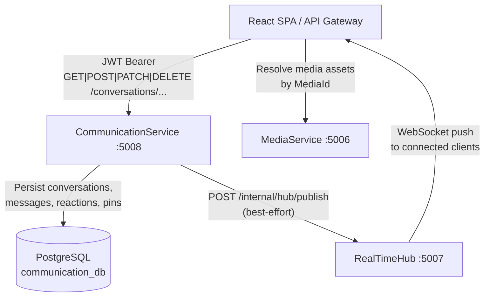
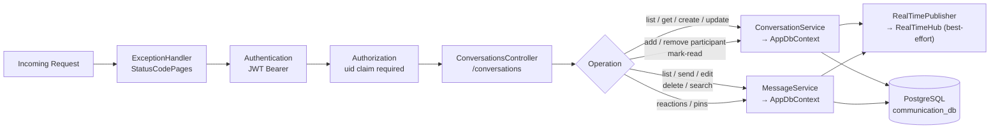
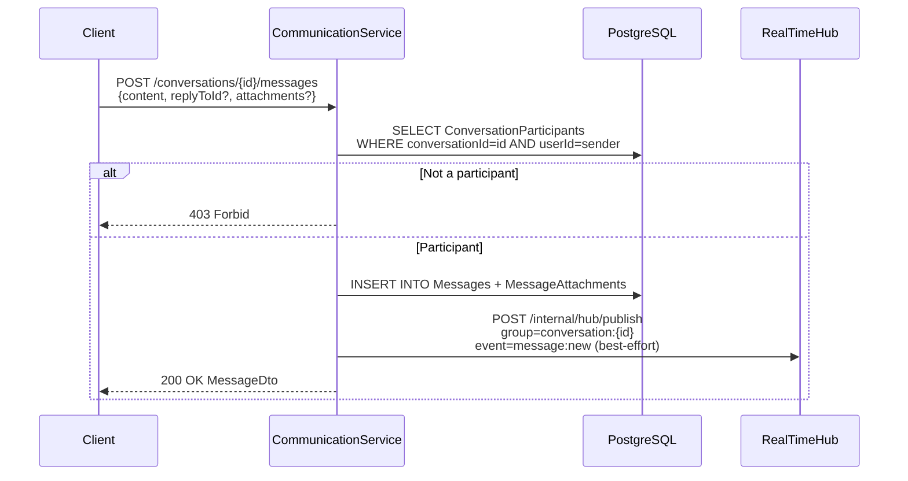
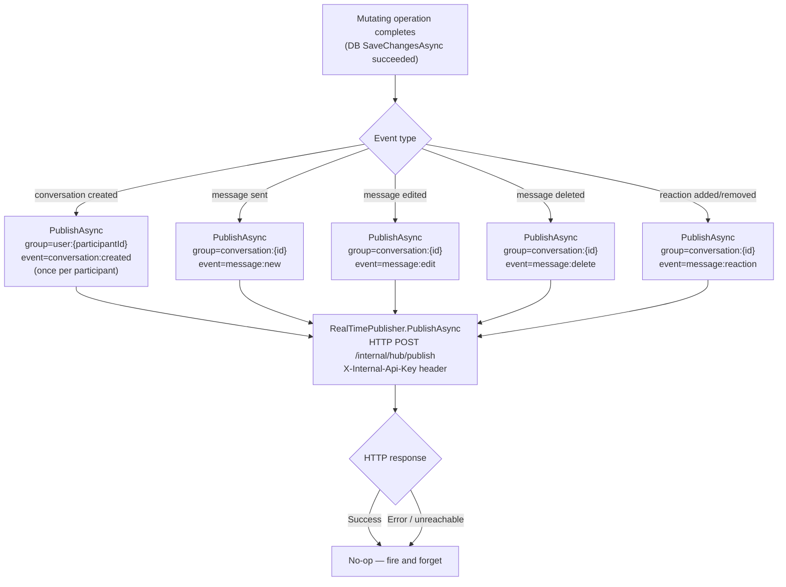
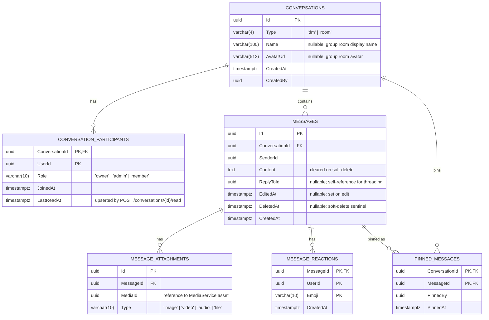

# CommunicationService

> **Port:** 5008 &nbsp;|&nbsp; **Runtime:** ASP.NET Core (.NET 9) &nbsp;|&nbsp; **Database:** PostgreSQL (`communication_db`) &nbsp;|&nbsp; **Phase:** Messaging

## Overview

CommunicationService is the **private messaging authority** for the SocialCommerce super-app. It owns:

- **Conversations** — Creation and management of both direct-message (`dm`) and group-room (`room`) conversations. Participants are tracked with per-user roles (`owner`, `admin`, `member`) and cursor-paginated listing.
- **Messages** — Full message lifecycle: send, edit, and soft-delete. Supports threaded replies via `ReplyToId` and media attachments linked to `MediaService` by `MediaId`.
- **Reactions** — Per-user emoji reactions on any message, with idempotent add and explicit remove operations.
- **Pinned messages** — Conversations can surface a curated list of pinned messages, managed by any participant.
- **Message search** — Case-insensitive full-text search across a conversation's non-deleted messages using PostgreSQL `ILike`.
- **Read receipts** — `POST /conversations/{id}/read` upserts a per-participant `LastReadAt` timestamp, enabling unread-badge counts in downstream clients.
- **Real-time push** — After every mutating operation (new message, edit, delete, reaction, conversation created) the service fires a best-effort HTTP call to `RealTimeHub`, which fans the event out to connected WebSocket clients.

---

## Architecture

### Position in the Platform



> `CommunicationService` stores only a `MediaId` reference in `MessageAttachment`. The consuming client resolves full media metadata (URL, dimensions, duration) by calling `MediaService` directly.

### Request Pipeline



### Message Send Flow



### Real-Time Event Publishing



> Publishing is **best-effort**: the `catch` block in `RealTimePublisher` swallows all exceptions so a hub outage never fails the primary operation.

---

## Project Structure

```
services/CommunicationService/
├── CommunicationService.csproj         # net9.0; JWT Bearer, EF Core, Npgsql, Swashbuckle
├── Program.cs                          # Composition root — EF Core, JWT auth, HttpClient, domain services
├── appsettings.json
├── appsettings.Development.json
│
├── Controllers/
│   └── ConversationsController.cs      # /conversations — all conversation, message, reaction, pin, search endpoints
│
├── Data/
│   ├── AppDbContext.cs                 # EF Core DbContext — 6 DbSets, composite PKs, cascade deletes
│   ├── Entities.cs                     # Conversation, ConversationParticipant, Message, MessageAttachment, MessageReaction, PinnedMessage
│   └── Migrations/
│       └── 20260322173459_InitialCreate  # Full schema — all 6 tables + indexes
│
├── Dtos/
│   ├── ConversationDtos.cs             # PagedResult<T>, ConversationDto, ParticipantDto, request records
│   └── MessageDtos.cs                  # MessageDto, AttachmentDto, ReactionDto, PinnedMessageDto, request records
│
├── Auth/
│   └── JwtAuthExtensions.cs            # AddServiceJwtAuth — symmetric HMAC JWT, uid claim, 30 s clock skew
│
├── Services/
│   ├── ConversationService.cs          # Conversation CRUD, participant management, read receipts, cursor pagination
│   ├── MessageService.cs               # Message CRUD, reactions, pins, search, cursor pagination
│   ├── IRealTimePublisher.cs           # Abstraction for real-time push
│   └── RealTimePublisher.cs            # HTTP client → RealTimeHub /internal/hub/publish (best-effort)
│
└── Properties/
    └── launchSettings.json             # Local dev — http://localhost:5008
```

---

## Data Model

### ER Diagram



### Entity Column Summary

#### `Conversations`

| Column | Type | Nullable | Notes |
|---|---|---|---|
| `Id` | `uuid` | No | PK; generated by `uuid_generate_v4()` |
| `Type` | `varchar(4)` | No | `"dm"` (direct message) or `"room"` (group) |
| `Name` | `varchar(100)` | Yes | Display name; relevant for `room` type |
| `AvatarUrl` | `varchar(512)` | Yes | Group avatar URL |
| `CreatedAt` | `timestamptz` | No | Creation timestamp; used as pagination cursor |
| `CreatedBy` | `uuid` | No | UserId of the conversation creator |

#### `ConversationParticipants`

| Column | Type | Nullable | Notes |
|---|---|---|---|
| `ConversationId` | `uuid` | No | Composite PK (part 1); FK → `Conversations` |
| `UserId` | `uuid` | No | Composite PK (part 2) |
| `Role` | `varchar(10)` | No | `"owner"`, `"admin"`, or `"member"` |
| `JoinedAt` | `timestamptz` | No | Set when participant is added |
| `LastReadAt` | `timestamptz` | No | Updated by `POST /conversations/{id}/read` |

#### `Messages`

| Column | Type | Nullable | Notes |
|---|---|---|---|
| `Id` | `uuid` | No | PK; generated by `uuid_generate_v4()` |
| `ConversationId` | `uuid` | No | FK → `Conversations` (cascade delete) |
| `SenderId` | `uuid` | No | UserId from JWT `uid` claim |
| `Content` | `text` | No | Cleared to empty string on soft-delete |
| `ReplyToId` | `uuid` | Yes | References another `Message.Id` for thread context |
| `EditedAt` | `timestamptz` | Yes | Set on `PATCH`; `null` if never edited |
| `DeletedAt` | `timestamptz` | Yes | Soft-delete sentinel; `null` if not deleted |
| `CreatedAt` | `timestamptz` | No | Used as pagination cursor |

#### `MessageAttachments`

| Column | Type | Nullable | Notes |
|---|---|---|---|
| `Id` | `uuid` | No | PK |
| `MessageId` | `uuid` | No | FK → `Messages` (cascade delete) |
| `MediaId` | `uuid` | No | Opaque reference to a `MediaService` asset |
| `Type` | `varchar(10)` | No | `"image"`, `"video"`, `"audio"`, or `"file"` |

#### `MessageReactions`

| Column | Type | Nullable | Notes |
|---|---|---|---|
| `MessageId` | `uuid` | No | Composite PK (part 1); FK → `Messages` (cascade delete) |
| `UserId` | `uuid` | No | Composite PK (part 2) |
| `Emoji` | `varchar(10)` | No | Composite PK (part 3); emoji string |
| `CreatedAt` | `timestamptz` | No | Reaction timestamp |

#### `PinnedMessages`

| Column | Type | Nullable | Notes |
|---|---|---|---|
| `ConversationId` | `uuid` | No | Composite PK (part 1); FK → `Conversations` (cascade delete) |
| `MessageId` | `uuid` | No | Composite PK (part 2); FK → `Messages` (cascade delete) |
| `PinnedBy` | `uuid` | No | UserId who performed the pin |
| `PinnedAt` | `timestamptz` | No | Pin timestamp |

### Database Indexes

| Index | Table | Columns | Purpose |
|---|---|---|---|
| `PK_Conversations` | `Conversations` | `(Id)` | Primary key lookup |
| `PK_ConversationParticipants` | `ConversationParticipants` | `(ConversationId, UserId)` | Composite PK; prevents duplicate membership |
| `PK_Messages` | `Messages` | `(Id)` | Primary key lookup |
| `IX_Messages_ConversationId_CreatedAt` | `Messages` | `(ConversationId, CreatedAt)` | Cursor-based pagination queries per conversation |
| `PK_MessageAttachments` | `MessageAttachments` | `(Id)` | Primary key lookup |
| `IX_MessageAttachments_MessageId` | `MessageAttachments` | `(MessageId)` | Eager-load attachments for a message |
| `PK_MessageReactions` | `MessageReactions` | `(MessageId, UserId, Emoji)` | Composite PK; prevents duplicate reactions |
| `PK_PinnedMessages` | `PinnedMessages` | `(ConversationId, MessageId)` | Composite PK; prevents duplicate pins |
| `IX_PinnedMessages_MessageId` | `PinnedMessages` | `(MessageId)` | Reverse lookup from message to its pin record |

---

## Authentication & Authorization

| Aspect | Value |
|---|---|
| Scheme | **JWT Bearer** (fully enforced) |
| `[Authorize]` | Applied at controller class level — all endpoints require a valid token |
| User identity | `uid` claim extracted from the validated JWT via `User.FindFirstValue("uid")` |
| Role enforcement | Conversation `update`, `add/remove participant` — requires `owner` or `admin` role; edit/delete message — requires `SenderId == caller` |
| Token parameters | HMAC-SHA256; issuer `SocialCommerce`; audience validation disabled; 30 s clock skew |

---

## API Reference

### `ConversationsController` — `/conversations`

#### Conversations

| Method | Path | Auth | Query / Body | Success | Errors | Description |
|---|---|---|---|---|---|---|
| `GET` | `/conversations` | Required | `?cursor`, `?limit` (1–100, default 20) | `200 PagedResult<ConversationDto>` | `401` | List conversations the caller participates in; cursor by `CreatedAt` DESC |
| `POST` | `/conversations` | Required | `CreateConversationRequest` | `201 ConversationDto` | `401` | Create a new conversation; caller is assigned `owner` role |
| `GET` | `/conversations/{id}` | Required | — | `200 ConversationDto` | `401`, `404` | Get a single conversation the caller is a member of |
| `PATCH` | `/conversations/{id}` | Required | `UpdateConversationRequest` | `200 ConversationDto` | `401`, `403`, `404` | Update name or avatar; `owner`/`admin` only |

#### Participants

| Method | Path | Auth | Body | Success | Errors | Description |
|---|---|---|---|---|---|---|
| `POST` | `/conversations/{id}/participants` | Required | `AddParticipantRequest` | `204` | `401`, `403`, `404` | Add a user to the conversation; `owner`/`admin` only; idempotent |
| `DELETE` | `/conversations/{id}/participants/{userId}` | Required | — | `204` | `401`, `403`, `404` | Remove a participant; `owner`/`admin` can remove others; any member can remove themselves |

#### Messages

| Method | Path | Auth | Query / Body | Success | Errors | Description |
|---|---|---|---|---|---|---|
| `GET` | `/conversations/{id}/messages` | Required | `?cursor`, `?limit` (1–100, default 30) | `200 PagedResult<MessageDto>` | `401` | List messages in the conversation; cursor by `CreatedAt` DESC; empty result if caller is not a member |
| `POST` | `/conversations/{id}/messages` | Required | `SendMessageRequest` | `200 MessageDto` | `401`, `403` | Send a message; must be a participant; fires `message:new` event |
| `PATCH` | `/conversations/{id}/messages/{messageId}` | Required | `EditMessageRequest` | `200 MessageDto` | `401`, `403`, `404` | Edit message content; sender only; fires `message:edit` event |
| `DELETE` | `/conversations/{id}/messages/{messageId}` | Required | — | `204` | `401`, `403`, `404` | Soft-delete message (clears content, sets `DeletedAt`); sender only; fires `message:delete` event |
| `GET` | `/conversations/{id}/messages/search` | Required | `?q` | `200 IReadOnlyList<MessageDto>` | `401` | Case-insensitive full-text search; max 50 results; excludes deleted messages |

#### Reactions

| Method | Path | Auth | Body | Success | Errors | Description |
|---|---|---|---|---|---|---|
| `POST` | `/conversations/{id}/messages/{messageId}/reactions` | Required | `AddReactionRequest` | `204` | `401`, `404` | Add an emoji reaction; idempotent if already reacted with the same emoji; fires `message:reaction` event |
| `DELETE` | `/conversations/{id}/messages/{messageId}/reactions/{emoji}` | Required | — | `204` | `401`, `404` | Remove a specific emoji reaction by the caller; fires `message:reaction` event |

#### Pins

| Method | Path | Auth | Success | Errors | Description |
|---|---|---|---|---|---|
| `GET` | `/conversations/{id}/pins` | Required | `200 IReadOnlyList<PinnedMessageDto>` | `401` | List all pinned messages in a conversation |
| `PUT` | `/conversations/{id}/pins/{messageId}` | Required | `204` | `401`, `404` | Pin a message; idempotent |
| `DELETE` | `/conversations/{id}/pins/{messageId}` | Required | `204` | `401`, `404` | Unpin a message |

#### Read Receipts

| Method | Path | Auth | Success | Errors | Description |
|---|---|---|---|---|---|
| `POST` | `/conversations/{id}/read` | Required | `204` | `401`, `404` | Update `LastReadAt` for the caller in this conversation to `UtcNow` |

### Cursor Encoding

All paginated endpoints share the same cursor scheme: the `CreatedAt` timestamp is serialised as an ISO 8601 string, UTF-8 encoded, then Base64-encoded. An absent or unparseable cursor defaults to `DateTimeOffset.UtcNow` (start of list).

```
cursor = Base64( UTF8( createdAt.ToString("O") ) )
```

---

## Data Transfer Objects

### `ConversationDto`

```json
{
  "id": "3fa85f64-5717-4562-b3fc-2c963f66afa6",
  "type": "room",
  "name": "Design Team",
  "avatarUrl": "https://cdn.example.com/avatars/design-team.png",
  "createdAt": "2025-01-15T12:00:00Z",
  "createdBy": "9d4e1c2a-1234-5678-abcd-000000000001",
  "participants": [
    {
      "userId": "9d4e1c2a-1234-5678-abcd-000000000001",
      "role": "owner",
      "joinedAt": "2025-01-15T12:00:00Z",
      "lastReadAt": "2025-01-15T13:30:00Z"
    }
  ]
}
```

### `MessageDto`

```json
{
  "id": "b1c2d3e4-0000-0000-0000-000000000001",
  "conversationId": "3fa85f64-5717-4562-b3fc-2c963f66afa6",
  "senderId": "9d4e1c2a-1234-5678-abcd-000000000001",
  "content": "Hello, team!",
  "replyToId": null,
  "editedAt": null,
  "deletedAt": null,
  "createdAt": "2025-01-15T12:05:00Z",
  "attachments": [
    { "id": "aaa00000-...", "mediaId": "bbb11111-...", "type": "image" }
  ],
  "reactions": [
    { "messageId": "b1c2d3e4-...", "userId": "...", "emoji": "👍", "createdAt": "2025-01-15T12:06:00Z" }
  ]
}
```

### `PagedResult<T>`

```json
{
  "items": [ "..." ],
  "nextCursor": "MjAyNS0wMS0xNVQxMjowNTowMC4wMDAwMDAwKzAwOjAw",
  "hasMore": true
}
```

> `nextCursor` is `null` and `hasMore` is `false` when there are no further pages.

---

## Real-Time Events

`CommunicationService` pushes events to `RealTimeHub` which forwards them to subscribed WebSocket clients. All events are delivered on a best-effort basis — hub unavailability does not affect the HTTP response to the caller.

| Event | Target Group | Trigger | Payload summary |
|---|---|---|---|
| `conversation:created` | `user:{participantId}` | `POST /conversations` (once per participant) | Full `ConversationDto` |
| `message:new` | `conversation:{id}` | `POST /conversations/{id}/messages` | Full `MessageDto` |
| `message:edit` | `conversation:{id}` | `PATCH /conversations/{id}/messages/{messageId}` | `{ messageId, content, editedAt }` |
| `message:delete` | `conversation:{id}` | `DELETE /conversations/{id}/messages/{messageId}` | `{ messageId }` |
| `message:reaction` | `conversation:{id}` | `POST|DELETE .../reactions/...` | `{ messageId, emoji, userId, action: "add"\|"remove" }` |

### Hub Publish Request Format

```http
POST /internal/hub/publish
X-Internal-Api-Key: <Internal:ApiKey>
Content-Type: application/json

{
  "group": "conversation:3fa85f64-...",
  "event": "message:new",
  "payload": { ... }
}
```

---

## Service Dependencies

### Outbound (CommunicationService calls…)

| Dependency | Type | Required | Purpose |
|---|---|---|---|
| PostgreSQL | TCP (EF Core / Npgsql) | **Yes** | Persist all conversations, messages, reactions, and pins |
| RealTimeHub | HTTP (`IRealTimePublisher`) | No (best-effort) | Push real-time events to connected WebSocket clients |

### Inbound (…calls CommunicationService)

| Caller | Endpoint(s) | Purpose |
|---|---|---|
| React SPA / API Gateway | `GET /conversations` | List user's conversations for inbox view |
| React SPA / API Gateway | `POST /conversations` | Initiate a new DM or group room |
| React SPA / API Gateway | `GET /conversations/{id}/messages` | Load message history |
| React SPA / API Gateway | `POST /conversations/{id}/messages` | Send a message |
| React SPA / API Gateway | All other endpoints | Participant management, reactions, pins, read receipts, search |

---

## Configuration

### `appsettings.json` Keys

| Key | Required | Default | Description |
|---|---|---|---|
| `ConnectionStrings:Default` | **Yes** | `""` | Npgsql connection string to `communication_db` |
| `Authentication:Jwt:Issuer` | **Yes** | `"SocialCommerce"` | Expected JWT issuer |
| `Authentication:Jwt:SymmetricKey` | **Yes** | `""` | HMAC-SHA256 signing key (minimum 32 bytes recommended) |
| `RealTimeHub:BaseUrl` | No | `http://localhost:5007` | Base URL of `RealTimeHub`; used by `RealTimePublisher` |
| `Internal:ApiKey` | **Yes** | `""` | Shared secret sent in `X-Internal-Api-Key` header when publishing to `RealTimeHub` |

### `docker-compose.yml` Service Entry

```yaml
communicationservice:
  build: ./services/CommunicationService
  environment:
    ASPNETCORE_URLS: http://+:8080
    ASPNETCORE_ENVIRONMENT: Development
    ConnectionStrings__Default: "Host=postgres;Port=5432;Database=communication_db;Username=postgres;Password=1234;Ssl Mode=Disable"
    Authentication__Jwt__Issuer: "SocialCommerce"
    Authentication__Jwt__SymmetricKey: "sc-dev-secret-key-min-32-bytes-long!!"
    RealTimeHub__BaseUrl: "http://realtimehub:8080"
    Internal__ApiKey: "sc-dev-internal-api-key"
  ports:
    - "5008:8080"
  depends_on:
    postgres:
      condition: service_healthy
    realtimehub:
      condition: service_started
```

---

## Migrations

| Migration | Date | Tables Created |
|---|---|---|
| `20260322173459_InitialCreate` | 2026-03-22 | `Conversations`, `ConversationParticipants`, `Messages`, `MessageAttachments`, `MessageReactions`, `PinnedMessages` |

### EF Core Commands

```bash
# Add a new migration
dotnet ef migrations add <MigrationName> \
  --project services/CommunicationService \
  --startup-project services/CommunicationService

# Apply migrations manually
dotnet ef database update \
  --project services/CommunicationService \
  --startup-project services/CommunicationService
```

In development, `db.Database.Migrate()` is called automatically on startup (guarded by `app.Environment.IsDevelopment()`).

---

## Key Design Decisions

| Decision | Rationale |
|---|---|
| **Soft-delete for messages** | Setting `DeletedAt` and clearing `Content` preserves the structural integrity of the conversation thread (reply chains, pinned message references) without leaving dangling foreign keys. Consumers can render a "This message was deleted" placeholder by checking `DeletedAt != null`. |
| **Composite PK `(MessageId, UserId, Emoji)` on `MessageReactions`** | Enforces the business rule that a user can react with a given emoji only once per message at the database level, making `AddReactionAsync` naturally idempotent without a separate existence check before insert. |
| **Composite PK `(ConversationId, UserId)` on `ConversationParticipants`** | Prevents duplicate membership rows and makes `AddParticipantAsync` idempotent — the service simply returns `true` if the participant already exists. |
| **`RealTimePublisher` swallows all exceptions** | The messaging operations (send, edit, delete) must not fail because a notification could not be delivered. Real-time push is a UX enhancement; the authoritative state is always PostgreSQL. Clients that miss a push can re-fetch via the REST API. |
| **`conversation:created` published per-participant** | Each participant subscribes to their own `user:{id}` group in `RealTimeHub`. Publishing one event per participant (rather than a single broadcast) allows the hub to target only the relevant WebSocket connections, avoiding cross-user data leakage in the push path. |
| **`MediaId` stored, not media content** | Attachments store only a UUID reference to a `MediaService` asset. This keeps `CommunicationService` stateless with respect to binary content, allows `MediaService` to handle storage, CDN, and access control independently, and avoids bloating the `communication_db` with BLOBs. |
| **`LastReadAt` on `ConversationParticipant`** | Collocating the read receipt with the participant row means an unread count can be derived by `COUNT(Messages WHERE CreatedAt > LastReadAt)` without a separate receipts table. This is a deliberate simplification for Phase 1; per-message delivery receipts can be introduced in a later phase. |
| **Full JWT enforcement (no commented-out `[Authorize]`)** | Unlike some other services in the platform, `CommunicationService` enforces authentication unconditionally at the controller class level. Private messages are sensitive data and must never be accessible without a verified identity, even during early development phases. |
| **`ILike` for message search** | PostgreSQL's `ILike` provides case-insensitive substring matching with no additional schema changes. Results are capped at 50 and ordered by recency. Full-text ranking (`tsvector`/`tsquery`) is the natural upgrade path when relevance scoring becomes a requirement. |
