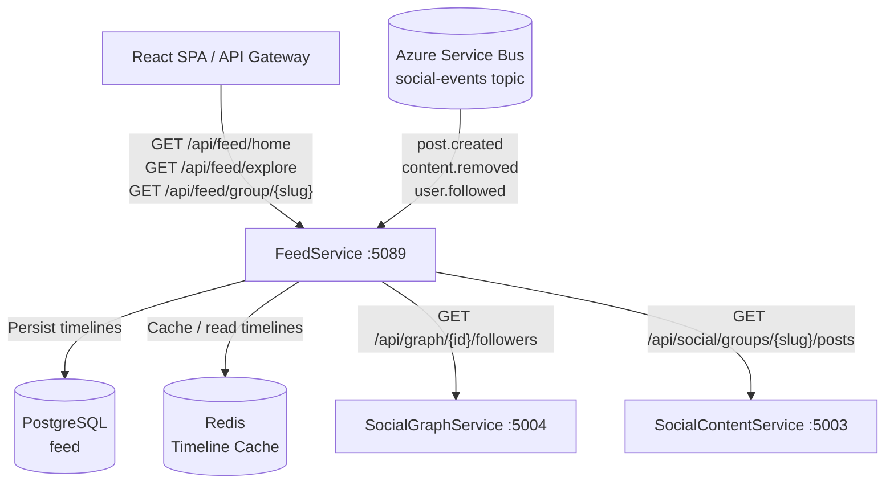
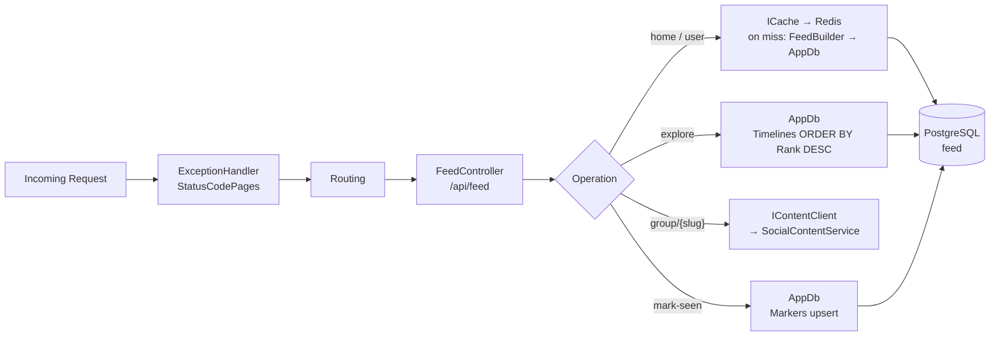
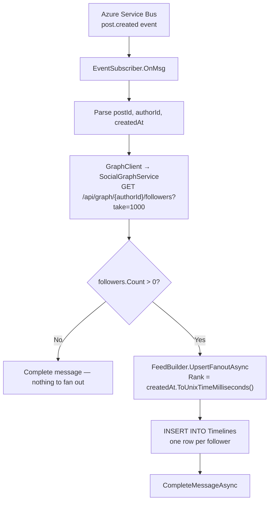
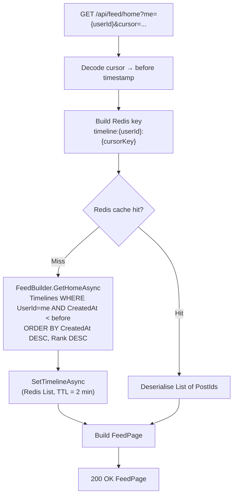
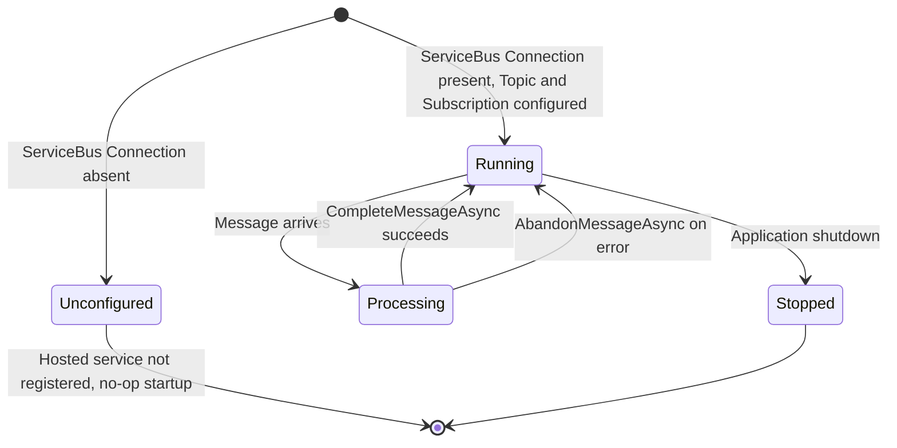
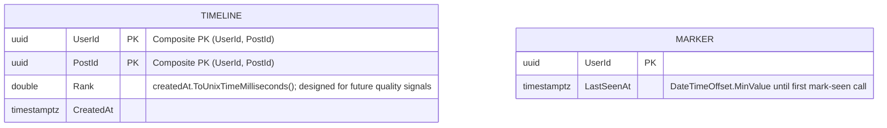

# FeedService

> **Port:** 5089 &nbsp;|&nbsp; **Runtime:** ASP.NET Core (.NET 9) &nbsp;|&nbsp; **Database:** PostgreSQL (`feed`) &nbsp;|&nbsp; **Phase:** Social

## Overview

FeedService is the **personalised content delivery authority** for the SocialCommerce super-app. It owns:

- **Home feed** — A pre-computed, per-user timeline of posts from followed accounts (`GET /api/feed/home`). The timeline is stored in PostgreSQL and served cache-first from Redis to minimise database load on high-frequency page renders. Supports cursor-based pagination.
- **User feed** — A public chronological view of all posts by a specific user (`GET /api/feed/user/{userId}`), served directly from the `Timelines` table.
- **Explore feed** — A platform-wide trending view (`GET /api/feed/explore`) that ranks all timeline entries by their `Rank` score (descending), giving visitors a high-signal discovery surface without requiring authentication.
- **Group feed** — Posts for a named social group (`GET /api/feed/group/{slug}`), proxied in real time from `SocialContentService`. Group feeds are not stored locally; FeedService acts as a thin aggregation facade.
- **Mark-seen** — Records the timestamp of the last post a user has seen (`POST /api/feed/mark-seen`), enabling unread-count badges and notification triggers in downstream clients.
- **Fan-out on write** — When a `post.created` event arrives from Azure Service Bus, FeedService calls `SocialGraphService` to resolve the author's follower list and writes a `Timeline` row for every follower. The `Rank` field is seeded with the post's creation timestamp in milliseconds, with the architecture designed for future quality-signal enrichment.
- **Content removal propagation** — `content.removed` Service Bus events trigger a bulk delete of all `Timeline` rows referencing the removed post, ensuring tombstoned content never surfaces in any user's feed.

---

## Architecture

### Position in the Platform



### Request Pipeline



### Fan-out on Write



### Home Feed Read Path



### Event Subscriber Lifecycle



---

## Project Structure

```
services/FeedService/
├── FeedService.csproj              # net9.0; refs shared/Contracts; DockerfileContext = ../..
├── Program.cs                      # Composition root — EF Core, Redis, HttpClients, Service Bus, OTEL
├── Dockerfile                      # Multi-stage .NET 9 container build; context = repo root
├── appsettings.json
├── appsettings.Development.json
│
├── Controllers/
│   └── FeedController.cs           # /api/feed — home, user, explore, group, mark-seen
│
├── Data/
│   ├── AppDb.cs                    # EF Core DbContext — 2 DbSets, 3 indexes
│   ├── AppDbFactory.cs             # IDesignTimeDbContextFactory for EF CLI
│   ├── Entities.cs                 # Timeline, Marker
│   └── Migrations/
│       └── 20260322181809_Init     # Full schema — Timelines + Markers tables
│
├── Dtos/
│   └── FeedDtos.cs                 # FeedItem, FeedPage, MarkSeenRequest
│
├── Services/
│   ├── Cache.cs                    # ICache + RedisCache — timeline Redis List cache
│   ├── ContentClient.cs            # IContentClient + ContentClient — HTTP to SocialContentService
│   ├── EventSubscriber.cs          # BackgroundService — Service Bus subscriber (post.created, content.removed)
│   ├── FeedBuilder.cs              # IFeedBuilder + FeedBuilder — timeline queries + fan-out writes
│   └── GraphClient.cs              # IGraphClient + GraphClient — HTTP to SocialGraphService
│
└── Properties/
    └── launchSettings.json         # Local dev — http://localhost:5089
```

> **Shared dependency:** `shared/Contracts/Contracts.csproj` is referenced. The `DockerfileContext` is `../..` (repo root) to include `shared/` in the Docker build context.

---

## Data Model

### ER Diagram



> `Timeline` and `Marker` are independent — there is no FK between them. `Timeline` is written by fan-out (async, event-driven); `Marker` is written directly by the client.

### Entity Column Summary

#### `Timeline`

| Column | Type | Nullable | Notes |
|---|---|---|---|
| `UserId` | `uuid` | No | Composite PK (part 1); the user whose home feed receives this post |
| `PostId` | `uuid` | No | Composite PK (part 2); reference to a post in `SocialContentService` |
| `Rank` | `double precision` | No | Initial value = `createdAt.ToUnixTimeMilliseconds()`; designed for future quality-signal enrichment |
| `CreatedAt` | `timestamptz` | No | Post creation timestamp; used as cursor for pagination |

#### `Marker`

| Column | Type | Nullable | Notes |
|---|---|---|---|
| `UserId` | `uuid` | No | PK |
| `LastSeenAt` | `timestamptz` | No | Default `DateTimeOffset.MinValue`; upserted by `POST /api/feed/mark-seen` |

### Database Indexes

| Index | Columns | Purpose |
|---|---|---|
| `PK_Timelines` | `(UserId, PostId)` | Composite PK; prevents duplicate fan-out rows for the same user + post |
| `IX_Timelines_UserId` | `(UserId)` | Retrieve all timeline entries for a given user |
| `IX_Timelines_CreatedAt` | `(CreatedAt)` | Cursor-based pagination and explore-feed range scans |
| `PK_Markers` | `(UserId)` | Mark-seen upsert and lookup |

---

## Authentication & Authorization

| Aspect | Value |
|---|---|
| Scheme | **None** (JWT Bearer not enforced in current phase) |
| `[Authorize]` attributes | Present in code but commented out (`//[Authorize(Policy = "social.read")]`) |
| User identity | `me` query parameter (`Guid`) supplied by caller |
| Access control | Expected at API gateway layer |

> Authentication is an acknowledged gap. The `[Authorize(Policy = "social.read")]` decoration is stubbed on `home`, `user`, and `mark-seen` endpoints. Until Phase 8 enforcement, callers must supply the correct `me` GUID; the service trusts it without verification.

---

## API Reference

### `FeedController` — `/api/feed`

| Method | Path | Auth | Query / Body | Success | Errors | Description |
|---|---|---|---|---|---|---|
| `GET` | `/api/feed/home` | *(stub)* | `?me`, `?cursor`, `?take` (1–100, default 20) | `200 FeedPage` | — | Personal home feed; Redis cache-first, then `Timelines` table; cursor by `CreatedAt` DESC |
| `GET` | `/api/feed/user/{userId}` | *(stub)* | `?cursor`, `?take` (1–100, default 20) | `200 FeedPage` | — | Public chronological post list for a user |
| `GET` | `/api/feed/explore` | None | `?cursor`, `?take` (1–100, default 20) | `200 FeedPage` | — | Trending feed — all timeline entries ordered by `Rank` DESC, then `CreatedAt` DESC |
| `GET` | `/api/feed/group/{slug}` | None | `?cursor`, `?take` (1–100, default 20) | `200 FeedPage` | — | Group post feed, proxied from `SocialContentService` |
| `POST` | `/api/feed/mark-seen` | *(stub)* | `MarkSeenRequest` + `?me` | `204` | — | Upsert `Marker.LastSeenAt` for the given user |

#### Cursor Encoding

All paginated endpoints share the same cursor scheme: the `CreatedAt` timestamp is serialised as an 8-byte little-endian Unix millisecond integer, then Base64-encoded. An absent or unparseable cursor is treated as `DateTimeOffset.MaxValue` (start of list).

```
cursor = Base64( LittleEndian( createdAt.ToUnixTimeMilliseconds() ) )
```

---

## Data Transfer Objects

### `FeedItem`

```json
{
  "postId": "3fa85f64-5717-4562-b3fc-2c963f66afa6",
  "rank": 1736941200000.0,
  "createdAt": "2025-01-15T12:00:00Z"
}
```

### `FeedPage`

```json
{
  "items": [
    {
      "postId": "3fa85f64-...",
      "rank": 1736941200000.0,
      "createdAt": "2025-01-15T12:00:00Z"
    },
    {
      "postId": "b1c2d3e4-...",
      "rank": 1736940600000.0,
      "createdAt": "2025-01-15T11:50:00Z"
    }
  ],
  "nextCursor": "AACgQ5KCAAAA"
}
```

> `nextCursor` is `null` when there are no more pages.

### `MarkSeenRequest`

```json
{
  "lastSeenAt": "2025-01-15T12:00:00Z"
}
```

---

## Event Handling

FeedService subscribes to the `social-events` Azure Service Bus topic under the `feed` subscription. The `EventSubscriber` background service processes the following event types:

| Event type | Source service | Action |
|---|---|---|
| `post.created` | `SocialContentService` | Call `GraphClient.GetFollowersAsync(authorId)`; fan out a `Timeline` row for each follower via `FeedBuilder.UpsertFanoutAsync` |
| `user.followed` | `SocialGraphService` | *(Stub — backfill of recent followee posts not yet implemented)* |
| `content.removed` | `ModerationService` | If `targetType == "post"`: `DELETE FROM Timelines WHERE PostId = targetId` |

### Message Format (`post.created`)

```json
{
  "type": "post.created",
  "postId": "3fa85f64-...",
  "authorUserId": "9d4e1c2a-...",
  "createdAt": "2025-01-15T12:00:00Z"
}
```

The `type` is read from the `ApplicationProperties["type"]` header (falling back to `Message.Subject`). On processing failure the message is abandoned (returned to the subscription for retry). On success it is explicitly completed.

---

## Timeline Cache

FeedService caches home feed pages in Redis using a list-based structure for fast index reads.

### Cache Key Format

```
timeline:{userId}:{cursorKey}
```

| `cursorKey` | Meaning |
|---|---|
| `"now"` | First page (no cursor supplied) |
| `"{unixEpochSeconds}"` | Cursor page anchored at that timestamp |

### Behaviour

| Operation | Detail |
|---|---|
| **Read** | `LRANGE timeline:{userId}:{key} 0 take-1`; returns `null` (cache miss) if key is empty |
| **Write** | `DEL` existing key; `RPUSH` all PostId strings; `EXPIRE` with 2-minute TTL |
| **Invalidate** | `DEL timeline:{userId}:*` — called when needed (e.g., future follow/unfollow invalidation) |

> The cache stores only PostIds (GUIDs as strings). Hydration of full post details (author, content, media) is the responsibility of the consuming client, which calls `SocialContentService` directly per-post.

---

## Service Dependencies

### Outbound (FeedService calls…)

| Dependency | Type | Required | Purpose |
|---|---|---|---|
| PostgreSQL | TCP (EF Core / Npgsql) | **Yes** | Persist `Timelines` and `Markers` |
| Redis | TCP (StackExchange.Redis) | **Yes** | Timeline page cache (`ICache`) |
| SocialGraphService | HTTP (`IGraphClient`) | Yes (for fan-out) | Resolve follower/followee/block lists on fan-out |
| SocialContentService | HTTP (`IContentClient`) | Yes (for group feed) | Proxy `GET /api/feed/group/{slug}` requests |
| Azure Service Bus | AMQP (`EventSubscriber`) | No | Receive `post.created`, `content.removed`, `user.followed`; falls back to no-op when connection string is absent |
| Azure Monitor | HTTPS (OpenTelemetry) | No | Distributed tracing + metrics; activated by `APPLICATIONINSIGHTS_CONNECTION_STRING` |

### Inbound (…calls FeedService)

| Caller | Endpoint(s) | Purpose |
|---|---|---|
| React SPA / API Gateway | `GET /api/feed/home` | Render personalised home feed |
| React SPA / API Gateway | `GET /api/feed/user/{userId}` | Render a user's public post list |
| React SPA / API Gateway | `GET /api/feed/explore` | Render trending / discovery feed |
| React SPA / API Gateway | `GET /api/feed/group/{slug}` | Render group post feed |
| React SPA / API Gateway | `POST /api/feed/mark-seen` | Record last-seen position for unread badge |

---

## Configuration

### `appsettings.json` Keys

| Key | Required | Default | Description |
|---|---|---|---|
| `ConnectionStrings:Default` | **Yes** | `Host=localhost;Port=5432;Database=feed;...` | Npgsql connection string to `feed` database |
| `Redis:Connection` | No | `localhost:6379,abortConnect=false` | Redis connection string; falls back to localhost if absent |
| `ServiceBus:Connection` | No | `""` (subscriber not started) | Azure Service Bus connection string; omit to disable event consumption |
| `ServiceBus:Topic` | No | `social-events` | Service Bus topic name |
| `ServiceBus:Subscription` | No | `feed` | Service Bus subscription name on the topic |
| `GraphService:BaseUrl` | No | `http://localhost:5005` | Base URL of `SocialGraphService` |
| `GraphService:TimeoutSeconds` | No | `4` | HTTP client timeout for graph calls |
| `ContentService:BaseUrl` | No | `http://localhost:5003` | Base URL of `SocialContentService` |
| `ContentService:TimeoutSeconds` | No | `4` | HTTP client timeout for content calls |
| `APPLICATIONINSIGHTS_CONNECTION_STRING` | No | — | Azure Monitor OTEL exporter; omit to disable cloud telemetry |

### `appsettings.Development.json` Defaults

The `appsettings.Development.json` file only overrides log levels. All other settings are read from `appsettings.json` or environment variables during local development.

---

## Containerization

### Dockerfile Stages

| Stage | Base Image | Purpose |
|---|---|---|
| `base` | `mcr.microsoft.com/dotnet/aspnet:9.0` | Final runtime layer; exposes ports `8080` and `8081` |
| `build` | `mcr.microsoft.com/dotnet/sdk:9.0` | Copies `shared/Contracts` and service project, restores, compiles |
| `publish` | *(from build)* | Runs `dotnet publish` in Release mode |
| `final` | *(from base)* | Copies published output; sets `ENTRYPOINT` |

The build context is the **repo root** (`context: .`) so the `shared/Contracts` project reference is resolvable inside Docker.

### `docker-compose.yml` Service Entry

```yaml
feedservice:
  build:
    context: .
    dockerfile: services/FeedService/Dockerfile
  environment:
    ASPNETCORE_URLS: http://+:8080
    ASPNETCORE_ENVIRONMENT: Development
    ConnectionStrings__Default: "Host=postgres;Port=5432;Database=feed;Username=postgres;Password=1234;Ssl Mode=Disable"
    Redis__Connection: "redis:6379,abortConnect=false"
    GraphService__BaseUrl: "http://socialgraphservice:8080"
    ContentService__BaseUrl: "http://socialcontentservice:8080"
  ports:
    - "5089:8080"
  depends_on:
    postgres:
      condition: service_healthy
    redis:
      condition: service_started
```

> To enable Service Bus event consumption in compose, add `ServiceBus__Connection`, `ServiceBus__Topic`, and `ServiceBus__Subscription` environment variables.

---

## Migrations

| Migration | Date | Tables Created |
|---|---|---|
| `20260322181809_Init` | 2026-03-22 | `Timelines`, `Markers` |

### EF Core Commands

```bash
# Add a new migration
dotnet ef migrations add <MigrationName> \
  --project services/FeedService \
  --startup-project services/FeedService

# Apply migrations manually
dotnet ef database update \
  --project services/FeedService \
  --startup-project services/FeedService
```

In development, `db.Database.MigrateAsync()` is called automatically on startup (guarded by `app.Environment.IsDevelopment()`).

---

## Key Design Decisions

| Decision | Rationale |
|---|---|
| **Fan-out on write (push model)** | Home feed reads are far more frequent than writes. Pre-computing a per-user `Timeline` table means reads are a single indexed query (or a Redis cache hit), avoiding expensive fan-in aggregations at read time. The trade-off is write amplification: one post write becomes N timeline inserts, where N is the follower count. |
| **Composite PK `(UserId, PostId)` on `Timelines`** | Prevents duplicate rows if the `post.created` event is delivered more than once (Service Bus at-least-once guarantee). The composite key also makes bulk fan-out idempotent without needing a separate deduplication check. |
| **`Rank` as a double seeded with Unix milliseconds** | The current ranking is pure recency (`createdAt.ToUnixTimeMilliseconds()`). Storing a `double` rather than a derived column means quality signals (engagement, social proximity, freshness decay) can be layered in as a score without a schema migration. The code comment in `FeedBuilder` explicitly marks this as the intended extension point. |
| **Redis timeline cache as a Redis List** | `LRANGE` on a Redis List gives O(N) ordered retrieval by insertion order, which maps naturally to cursor-page reads. The 2-minute TTL balances freshness against database load; invalidation via `DEL` on follow/unfollow events will be added when the `user.followed` handler is implemented. |
| **Group feed proxied, not stored** | Group membership and posts are owned by `SocialContentService`. Caching group feeds locally would require invalidation on every group post mutation. For the current traffic profile, a direct HTTP proxy with the existing 4-second timeout is simpler and keeps data ownership clean. |
| **`EventSubscriber` conditionally registered** | The Service Bus hosted service is only added to the DI container when `ServiceBus:Connection` is non-empty. This lets the service start and serve cached/DB reads in local development or integration tests without any Azure credentials, with zero code-path changes. |
| **`user.followed` handler is a stub** | Backfilling the new followee's recent posts into the follower's timeline on follow is desirable UX but is a non-trivial fan-in operation. The stub reserves the event handler slot so the feature can be added without touching the subscriber dispatch logic. |
| **`GraphClient` fetches up to 1,000 followers in one call** | The current follower query uses `?take=1000` and is not paginated. This is a deliberate simplification for Phase 1 — high-follower accounts (> 1,000) will have truncated fan-out until a paginated or celebrity-fan-out strategy is introduced in a later phase. |
| **No auth enforced in current phase** | The `[Authorize(Policy = "social.read")]` attributes are commented out. The `me` identity is caller-supplied via query parameter and trusted without verification. JWT enforcement is planned for Phase 8, at which point the `me` GUID will be extracted from the validated token claim instead. |
| **OpenTelemetry with optional Azure Monitor** | Full OTEL instrumentation (ASP.NET Core + HTTP client) is wired unconditionally; Azure Monitor export is opt-in via `APPLICATIONINSIGHTS_CONNECTION_STRING`. This means traces and metrics are emitted to any OTEL-compatible collector in production and silently omitted in development, with zero code changes. |
