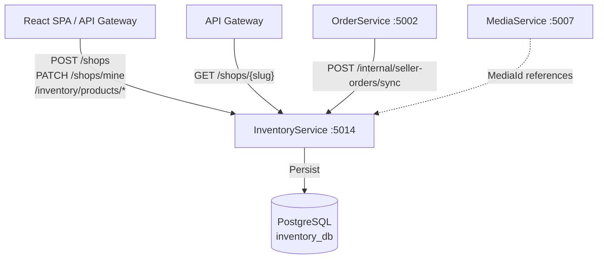
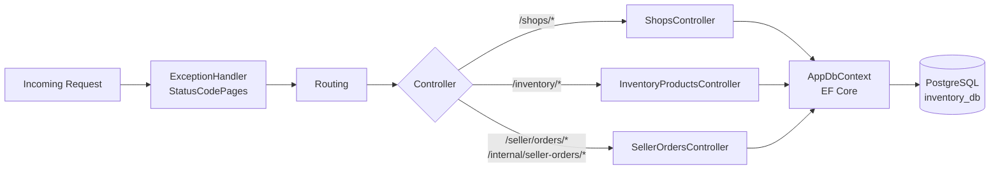
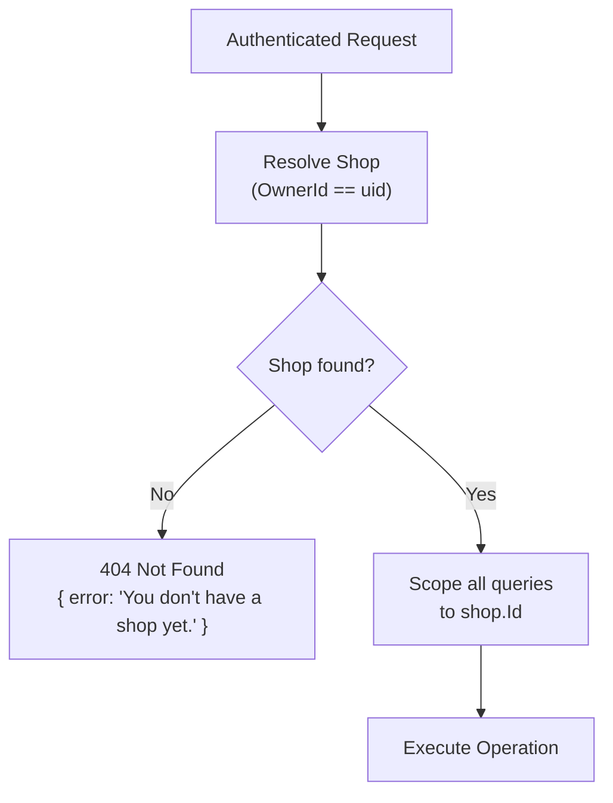
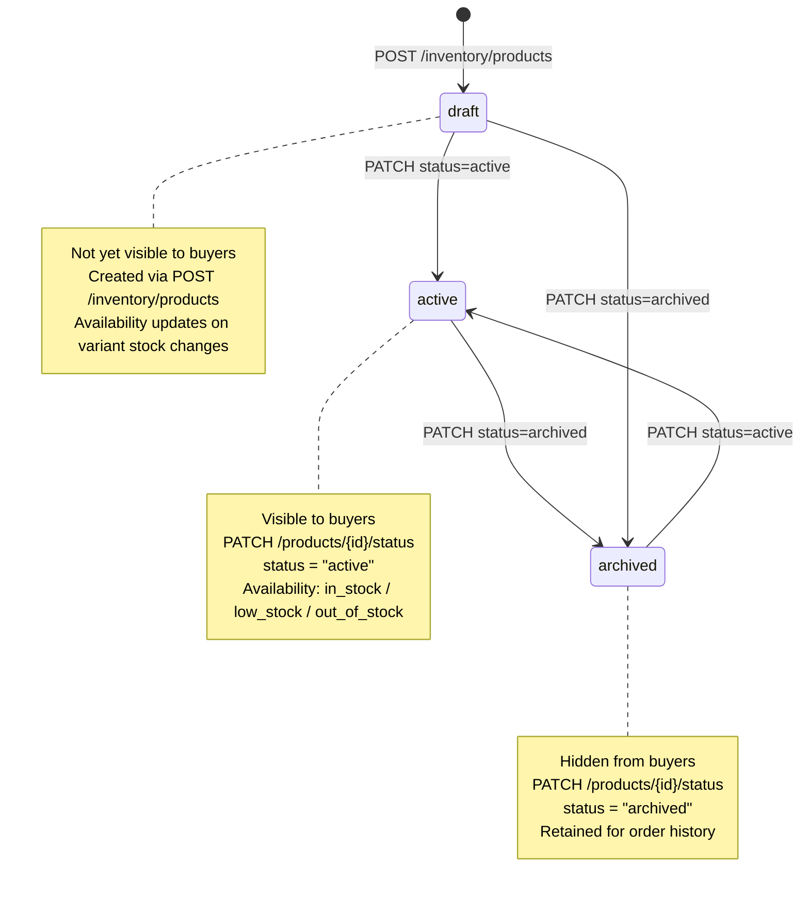
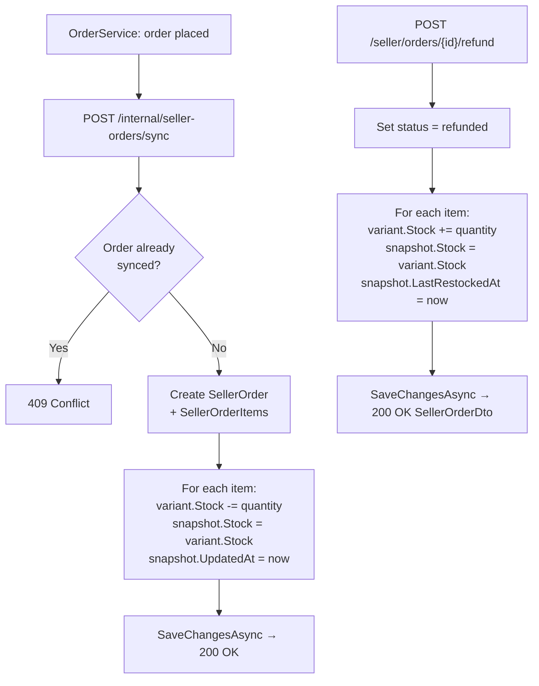
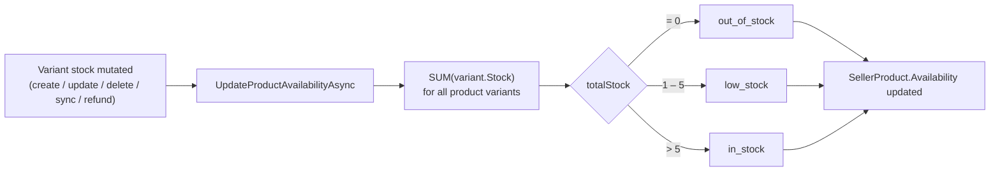
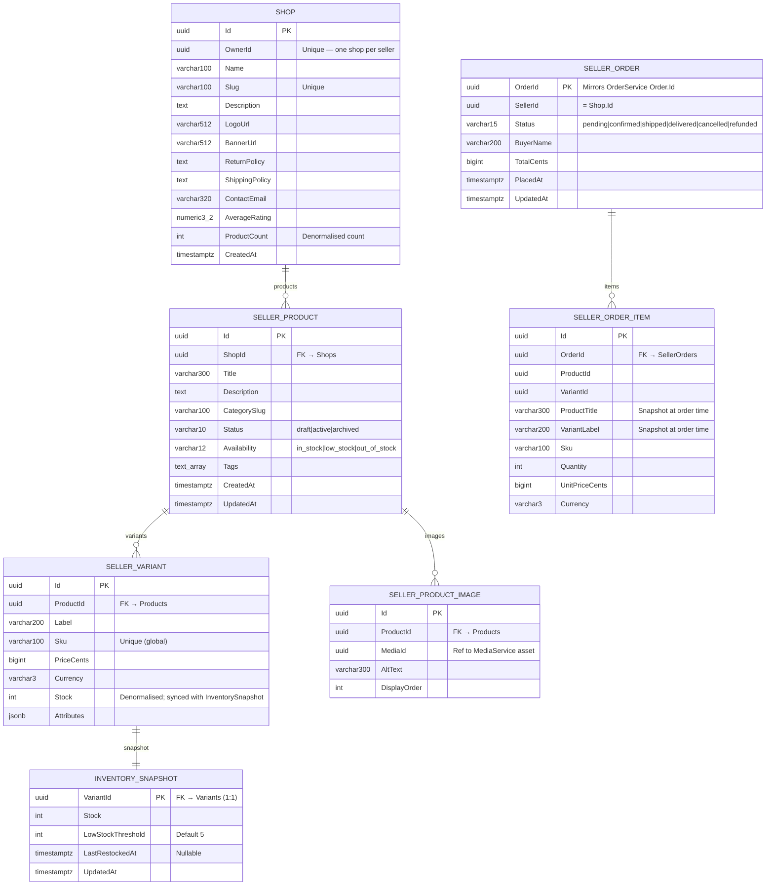

# InventoryService

> **Port:** 5014 &nbsp;|&nbsp; **Runtime:** ASP.NET Core (.NET 9) &nbsp;|&nbsp; **Database:** PostgreSQL (`inventory_db`) &nbsp;|&nbsp; **Phase:** Commerce

## Overview

InventoryService is the **seller-side commerce authority** for the SocialCommerce super-app. It owns:

- **Shop management** — Each seller may register exactly one shop (`POST /shops`). Shops are identified by a globally unique slug and carry branding fields (logo, banner), policy text (return, shipping), and denormalised product-count / average-rating aggregates.
- **Product catalogue** — Sellers maintain a full product hierarchy: `SellerProduct` (title, description, category, tags, status lifecycle) → `SellerVariant` (SKU, price, stock, free-form attributes) → `SellerProductImage` (ordered media references). Products start in `draft` status and surface to buyers only when transitioned to `active`.
- **Inventory tracking** — An `InventorySnapshot` record (1:1 with each `SellerVariant`) stores the low-stock threshold, last restock timestamp, and a writeable stock count that is kept in sync with `SellerVariant.Stock` on every mutation. A dedicated `GET /inventory/low-stock` endpoint surfaces all variants at or below threshold for seller dashboards.
- **Availability auto-derivation** — After any stock change the service recomputes `SellerProduct.Availability` (`in_stock` / `low_stock` / `out_of_stock`) from the aggregate variant stock, giving buyers and search indexes a single field to filter on.
- **Bulk catalogue management** — CSV import (`POST /inventory/import`) and export (`GET /inventory/export`) endpoints enable sellers to manage large catalogues outside the UI. The 11-column CSV schema maps directly to product + variant + snapshot fields; each row is validated independently and errors are returned per-line without halting the batch.
- **Seller order view** — A read-optimised projection of `OrderService` data (`SellerOrder` / `SellerOrderItem`) scoped to the seller's shop. Sellers can advance order status (`confirmed → shipped → delivered`) and issue refunds, which automatically restore variant stock.
- **Internal order sync** — `POST /internal/seller-orders/sync` is an unauthenticated hook for `OrderService` to push newly placed orders into the seller's view and atomically decrement variant stock. Intended to be protected at the network / API-gateway layer in production.

---

## Architecture

### Position in the Platform



### Request Pipeline



### Seller Ownership Model

Every authenticated request to `/inventory/*` and `/seller/orders/*` resolves the caller's `Shop` by matching `Shop.OwnerId == uid` (from the JWT `uid` claim). All products, variants, images, and orders are then filtered through that shop ID, ensuring strict data isolation between sellers.



### Product Status & Availability



### Order Sync & Stock Flow



### Availability Derivation



---

## Project Structure

```
services/InventoryService/
├── InventoryService.csproj            # net9.0; no shared/Contracts; DockerfileContext = ../..
├── Program.cs                         # Composition root — EF Core, JWT, MVC, Swagger, health check
├── Dockerfile                         # Multi-stage .NET 9 container build; context = service dir
├── appsettings.json
├── appsettings.Development.json
│
├── Controllers/
│   ├── ShopsController.cs             # /shops — shop CRUD and public slug lookup
│   ├── InventoryProductsController.cs # /inventory — products, variants, snapshots, CSV import/export
│   └── SellerOrdersController.cs      # /seller/orders + /internal/seller-orders/sync
│
├── Data/
│   ├── AppDbContext.cs                # EF Core DbContext — 7 DbSets, 10 indexes
│   ├── AppDbFactory.cs                # IDesignTimeDbContextFactory for EF CLI
│   ├── Entities.cs                    # Shop, SellerProduct, SellerVariant, SellerProductImage,
│   │                                  # InventorySnapshot, SellerOrder, SellerOrderItem
│   └── Migrations/
│       └── 20260322200040_InitialCreate  # Full schema — all 7 tables
│
├── Dtos/
│   └── InventoryDtos.cs               # All request/response records + PagedResult<T>
│
├── Auth/
│   └── JwtAuthExtensions.cs           # AddServiceJwtAuth — HS256, SocialCommerce issuer, uid claim
│
└── Properties/
    └── launchSettings.json            # Local dev — http://localhost:5014
```

---

## Data Model

### ER Diagram



### Entity Column Summary

#### `Shop`

| Column | Type | Nullable | Notes |
|---|---|---|---|
| `Id` | `uuid` | No | PK; `uuid_generate_v4()` default |
| `OwnerId` | `uuid` | No | Unique — one shop per authenticated user |
| `Name` | `varchar(100)` | No | Display name |
| `Slug` | `varchar(100)` | No | Unique URL-friendly identifier |
| `Description` | `text` | No | — |
| `LogoUrl` | `varchar(512)` | Yes | — |
| `BannerUrl` | `varchar(512)` | Yes | — |
| `ReturnPolicy` | `text` | Yes | — |
| `ShippingPolicy` | `text` | Yes | — |
| `ContactEmail` | `varchar(320)` | Yes | — |
| `AverageRating` | `numeric(3,2)` | No | — |
| `ProductCount` | `int` | No | Denormalised; incremented/decremented on product create/delete |
| `CreatedAt` | `timestamptz` | No | — |

#### `SellerProduct`

| Column | Type | Nullable | Notes |
|---|---|---|---|
| `Id` | `uuid` | No | PK |
| `ShopId` | `uuid` | No | FK → `Shops` (cascade delete) |
| `Title` | `varchar(300)` | No | — |
| `Description` | `text` | No | — |
| `CategorySlug` | `varchar(100)` | No | — |
| `Status` | `varchar(10)` | No | `draft`, `active`, `archived`; index on `Status` |
| `Availability` | `varchar(12)` | No | `in_stock`, `low_stock`, `out_of_stock`; auto-computed from variant stock |
| `Tags` | `text[]` | No | PostgreSQL native array |
| `CreatedAt` | `timestamptz` | No | — |
| `UpdatedAt` | `timestamptz` | No | Set on every mutation |

#### `SellerVariant`

| Column | Type | Nullable | Notes |
|---|---|---|---|
| `Id` | `uuid` | No | PK |
| `ProductId` | `uuid` | No | FK → `Products` (cascade delete) |
| `Label` | `varchar(200)` | No | e.g. `"Red / XL"` |
| `Sku` | `varchar(100)` | No | Globally unique across all shops |
| `PriceCents` | `bigint` | No | Price in smallest currency unit |
| `Currency` | `varchar(3)` | No | ISO 4217 code, e.g. `USD` |
| `Stock` | `int` | No | Denormalised; kept in sync with `InventorySnapshot.Stock` |
| `Attributes` | `jsonb` | No | Free-form key/value pairs, e.g. `{ "color": "red", "size": "XL" }` |

#### `SellerProductImage`

| Column | Type | Nullable | Notes |
|---|---|---|---|
| `Id` | `uuid` | No | PK |
| `ProductId` | `uuid` | No | FK → `Products` (cascade delete) |
| `MediaId` | `uuid` | No | Reference to a `MediaService` asset |
| `AltText` | `varchar(300)` | No | — |
| `DisplayOrder` | `int` | No | Ascending sort order; lowest first |

#### `InventorySnapshot`

| Column | Type | Nullable | Notes |
|---|---|---|---|
| `VariantId` | `uuid` | No | PK and FK → `Variants` (1:1, cascade delete) |
| `Stock` | `int` | No | Mirror of `SellerVariant.Stock` |
| `LowStockThreshold` | `int` | No | Default `5`; low-stock alert fires when `Stock ≤ Threshold` |
| `LastRestockedAt` | `timestamptz` | Yes | Set when stock increases via update, refund, or import |
| `UpdatedAt` | `timestamptz` | No | Set on every stock write |

#### `SellerOrder`

| Column | Type | Nullable | Notes |
|---|---|---|---|
| `OrderId` | `uuid` | No | PK; mirrors `OrderService.Order.Id` |
| `SellerId` | `uuid` | No | Equals `Shop.Id` of the owning seller |
| `Status` | `varchar(15)` | No | `pending`, `confirmed`, `shipped`, `delivered`, `cancelled`, `refunded` |
| `BuyerName` | `varchar(200)` | No | Snapshot at order time |
| `TotalCents` | `bigint` | No | — |
| `PlacedAt` | `timestamptz` | No | — |
| `UpdatedAt` | `timestamptz` | No | — |

#### `SellerOrderItem`

| Column | Type | Nullable | Notes |
|---|---|---|---|
| `Id` | `uuid` | No | PK |
| `OrderId` | `uuid` | No | FK → `SellerOrders` (cascade delete) |
| `ProductId` | `uuid` | No | Reference (no FK constraint) |
| `VariantId` | `uuid` | No | Reference (no FK constraint); used for stock restoration on refund |
| `ProductTitle` | `varchar(300)` | No | Snapshot at order time |
| `VariantLabel` | `varchar(200)` | No | Snapshot at order time |
| `Sku` | `varchar(100)` | No | Snapshot at order time |
| `Quantity` | `int` | No | — |
| `UnitPriceCents` | `bigint` | No | — |
| `Currency` | `varchar(3)` | No | — |

### Database Indexes

| Index | Columns | Notes |
|---|---|---|
| `IX_Shops_OwnerId` | `(OwnerId)` | **Unique** — enforces one shop per seller |
| `IX_Shops_Slug` | `(Slug)` | **Unique** — public slug lookup |
| `IX_Products_ShopId` | `(ShopId)` | List all products for a shop |
| `IX_Products_Status` | `(Status)` | Filter by `draft`, `active`, `archived` |
| `IX_ProductImages_ProductId` | `(ProductId)` | Join images to product |
| `IX_Variants_Sku` | `(Sku)` | **Unique** — global SKU enforcement |
| `IX_Variants_ProductId` | `(ProductId)` | List variants for a product |
| `IX_SellerOrders_SellerId` | `(SellerId)` | Scope orders to seller's shop |
| `IX_SellerOrders_Status` | `(Status)` | Filter by order status |
| `IX_SellerOrderItems_OrderId` | `(OrderId)` | Join items to order |

---

## Authentication & Authorization

| Aspect | Value |
|---|---|
| Scheme | **JWT Bearer HS256** |
| Issuer | `SocialCommerce` |
| Audience validation | Disabled |
| User identity claim | `uid` (parsed as `Guid`) |
| Public endpoints | `GET /shops/{slug}` (`[AllowAnonymous]`) |
| Internal endpoints | `POST /internal/seller-orders/sync` (`[AllowAnonymous]` — protected by network policy / API key in production) |
| All other endpoints | Require a valid JWT |

All inventory and order endpoints resolve `UserId` from the JWT `uid` claim and scope every operation to the shop owned by that user. Resources belonging to other sellers are indistinguishable from "not found" — a `404` is returned rather than `403`.

---

## API Reference

### `ShopsController` — `/shops`

| Method | Path | Auth | Body | Success | Errors | Description |
|---|---|---|---|---|---|---|
| `GET` | `/shops/mine` | Required | — | `200 ShopDto` | `404` | Get the caller's shop |
| `POST` | `/shops` | Required | `CreateShopDto` | `201 ShopDto` | `409` | Create a shop (one per seller; slug must be globally unique) |
| `PATCH` | `/shops/mine` | Required | `UpdateShopDto` | `200 ShopDto` | `404` | Partial update of the caller's shop |
| `GET` | `/shops/{slug}` | None | — | `200 ShopDto` | `404` | Public shop lookup by slug |

### `InventoryProductsController` — `/inventory`

| Method | Path | Auth | Query / Body | Success | Errors | Description |
|---|---|---|---|---|---|---|
| `GET` | `/inventory/products` | Required | `?status`, `?cursor`, `?limit` (default 20) | `200 PagedResult<SellerProductSummaryDto>` | `404` | List own products with cursor pagination, newest first |
| `POST` | `/inventory/products` | Required | `CreateProductDto` | `201 SellerProductDto` | `404` | Create a product; always starts as `draft` / `out_of_stock` |
| `GET` | `/inventory/products/{productId}` | Required | — | `200 SellerProductDto` | `404` | Get full product with variants, snapshots, and images |
| `PATCH` | `/inventory/products/{productId}` | Required | `UpdateProductDto` | `200 SellerProductDto` | `404` | Partial update of product metadata |
| `DELETE` | `/inventory/products/{productId}` | Required | — | `204` | `404` | Delete product; cascade-deletes variants, images, and snapshots |
| `PATCH` | `/inventory/products/{productId}/status` | Required | `UpdateProductStatusDto` | `200 SellerProductDto` | `400`, `404` | Set product status (`draft`, `active`, `archived`) |
| `GET` | `/inventory/products/{productId}/variants` | Required | — | `200 SellerVariantDto[]` | `404` | List variants for a product, ordered by label |
| `POST` | `/inventory/products/{productId}/variants` | Required | `CreateVariantDto` | `201 SellerVariantDto` | `404`, `409` | Create variant and auto-create `InventorySnapshot`; SKU must be globally unique |
| `PATCH` | `/inventory/variants/{variantId}` | Required | `UpdateVariantDto` | `200 SellerVariantDto` | `404`, `409` | Update variant; syncs snapshot stock and `LastRestockedAt`; recomputes product availability |
| `DELETE` | `/inventory/variants/{variantId}` | Required | — | `204` | `404` | Delete variant and its `InventorySnapshot`; recomputes product availability |
| `GET` | `/inventory/low-stock` | Required | — | `200 LowStockItemDto[]` | `404` | All variants where `Stock ≤ LowStockThreshold`, ordered by stock ascending |
| `POST` | `/inventory/import` | Required | `multipart/form-data` (CSV) | `200 ImportResultDto` | `400`, `404` | Bulk import products + variants from 11-column CSV; per-row errors returned without halting batch |
| `GET` | `/inventory/export` | Required | — | `200 text/csv` | `404` | Export all shop products + variants as `inventory-export.csv` |

### `SellerOrdersController` — `/seller/orders` + `/internal`

| Method | Path | Auth | Query / Body | Success | Errors | Description |
|---|---|---|---|---|---|---|
| `GET` | `/seller/orders` | Required | `?status`, `?cursor`, `?limit` (default 20) | `200 PagedResult<SellerOrderSummaryDto>` | `404` | List shop orders with cursor pagination, newest first |
| `GET` | `/seller/orders/{orderId}` | Required | — | `200 SellerOrderDto` | `404` | Get a single order with line items |
| `PATCH` | `/seller/orders/{orderId}/status` | Required | `UpdateOrderStatusDto` | `200 SellerOrderDto` | `400`, `404` | Advance order status; only `confirmed`, `shipped`, `delivered` are accepted |
| `POST` | `/seller/orders/{orderId}/refund` | Required | — | `200 SellerOrderDto` | `400`, `404` | Mark order as `refunded` and restore variant stock |
| `POST` | `/internal/seller-orders/sync` | None | `SyncOrderDto` | `200` | `409` | *(Internal)* Sync a placed order from `OrderService`; decrements variant stock |

---

## Data Transfer Objects

### `CreateShopDto`

```json
{
  "name": "Artisan Crafts Co.",
  "slug": "artisan-crafts-co",
  "description": "Handmade goods from independent artists.",
  "contactEmail": "hello@artisancrafts.co"
}
```

### `ShopDto`

```json
{
  "id": "3fa85f64-...",
  "ownerId": "9d4e1c2a-...",
  "name": "Artisan Crafts Co.",
  "slug": "artisan-crafts-co",
  "description": "Handmade goods from independent artists.",
  "logoUrl": "https://cdn.example.com/logos/artisan.png",
  "bannerUrl": null,
  "returnPolicy": "30-day returns accepted.",
  "shippingPolicy": "Ships within 3 business days.",
  "contactEmail": "hello@artisancrafts.co",
  "averageRating": 4.82,
  "productCount": 14,
  "createdAt": "2025-01-10T09:00:00Z"
}
```

### `CreateProductDto`

```json
{
  "title": "Hand-woven Wool Scarf",
  "description": "100% merino wool, naturally dyed.",
  "categorySlug": "accessories",
  "tags": ["wool", "handmade", "scarf"]
}
```

### `SellerProductSummaryDto`

```json
{
  "id": "3fa85f64-...",
  "shopId": "b1c2d3e4-...",
  "title": "Hand-woven Wool Scarf",
  "categorySlug": "accessories",
  "status": "active",
  "availability": "in_stock",
  "variantCount": 3,
  "minPriceCents": 4500,
  "createdAt": "2025-01-12T10:00:00Z",
  "updatedAt": "2025-01-15T14:30:00Z"
}
```

### `CreateVariantDto`

```json
{
  "label": "Red / One Size",
  "sku": "SCARF-RED-OS",
  "priceCents": 4500,
  "currency": "USD",
  "stock": 25,
  "attributes": { "color": "red" },
  "lowStockThreshold": 5
}
```

### `SellerVariantDto`

```json
{
  "id": "c3d4e5f6-...",
  "productId": "3fa85f64-...",
  "label": "Red / One Size",
  "sku": "SCARF-RED-OS",
  "priceCents": 4500,
  "currency": "USD",
  "stock": 25,
  "attributes": { "color": "red" },
  "snapshot": {
    "variantId": "c3d4e5f6-...",
    "stock": 25,
    "lowStockThreshold": 5,
    "lastRestockedAt": "2025-01-14T08:00:00Z",
    "updatedAt": "2025-01-15T14:30:00Z"
  }
}
```

### `LowStockItemDto`

```json
{
  "productId": "3fa85f64-...",
  "productTitle": "Hand-woven Wool Scarf",
  "variantId": "c3d4e5f6-...",
  "variantLabel": "Blue / One Size",
  "sku": "SCARF-BLUE-OS",
  "stock": 2,
  "lowStockThreshold": 5
}
```

### `ImportResultDto`

```json
{
  "created": 12,
  "skipped": 2,
  "errors": [
    "Line 4: SKU 'SCARF-RED-OS' already exists",
    "Line 9: expected 11 columns, got 8"
  ]
}
```

### `SyncOrderDto` *(internal)*

```json
{
  "orderId": "aabbccdd-...",
  "sellerId": "b1c2d3e4-...",
  "buyerName": "Jane Doe",
  "totalCents": 9000,
  "placedAt": "2025-01-15T16:00:00Z",
  "items": [
    {
      "productId": "3fa85f64-...",
      "variantId": "c3d4e5f6-...",
      "productTitle": "Hand-woven Wool Scarf",
      "variantLabel": "Red / One Size",
      "sku": "SCARF-RED-OS",
      "quantity": 2,
      "unitPriceCents": 4500,
      "currency": "USD"
    }
  ]
}
```

### `SellerOrderDto`

```json
{
  "orderId": "aabbccdd-...",
  "sellerId": "b1c2d3e4-...",
  "status": "confirmed",
  "buyerName": "Jane Doe",
  "totalCents": 9000,
  "items": [
    {
      "id": "eeee1111-...",
      "productId": "3fa85f64-...",
      "variantId": "c3d4e5f6-...",
      "productTitle": "Hand-woven Wool Scarf",
      "variantLabel": "Red / One Size",
      "sku": "SCARF-RED-OS",
      "quantity": 2,
      "unitPriceCents": 4500,
      "currency": "USD"
    }
  ],
  "placedAt": "2025-01-15T16:00:00Z",
  "updatedAt": "2025-01-15T17:00:00Z"
}
```

### CSV Import / Export Format

```
Title,Description,CategorySlug,Tags,Status,VariantLabel,Sku,PriceCents,Currency,Stock,LowStockThreshold
"Hand-woven Wool Scarf","100% merino wool",accessories,wool|handmade|scarf,draft,Red / One Size,SCARF-RED-OS,4500,USD,25,5
"Ceramic Mug","Handmade stoneware",kitchen,ceramic|mug,draft,White,MUG-WHITE,2200,USD,10,3
```

> Each row creates exactly **one product + one variant + one snapshot**. Multi-variant products repeat the product columns across rows. Tags are pipe-delimited (`|`). Quoted fields support embedded commas.

---

## Service Dependencies

### Outbound (InventoryService calls…)

| Dependency | Type | Required | Purpose |
|---|---|---|---|
| PostgreSQL | TCP (EF Core / Npgsql) | **Yes** | Persist all shop, product, variant, snapshot, and order data |

> InventoryService has **no Redis, no Azure Service Bus, and no outbound HTTP** dependencies. It is the simplest infrastructure profile in the SocialCommerce platform.

### Inbound (…calls InventoryService)

| Caller | Endpoint(s) | Purpose |
|---|---|---|
| React SPA / sellers | `POST /shops`, `PATCH /shops/mine` | Shop registration and profile management |
| React SPA / sellers | `/inventory/products/*`, `/inventory/variants/*` | Product and variant catalogue management |
| React SPA / sellers | `GET /inventory/low-stock`, `POST /inventory/import`, `GET /inventory/export` | Inventory dashboard and bulk operations |
| React SPA / sellers | `/seller/orders/*` | Seller order management |
| API Gateway / public | `GET /shops/{slug}` | Public shop page lookup |
| OrderService | `POST /internal/seller-orders/sync` | Push placed orders and atomically decrement stock |

---

## Configuration

### `appsettings.json` Keys

| Key | Required | Default | Description |
|---|---|---|---|
| `ConnectionStrings:Default` | **Yes** | `""` | Npgsql connection string to `inventory_db` |
| `Authentication:Jwt:Issuer` | **Yes** | `SocialCommerce` | Expected JWT issuer |
| `Authentication:Jwt:SymmetricKey` | **Yes** | `""` | HS256 signing key (minimum 32 bytes in production) |

### `appsettings.Development.json` Defaults

| Key | Development Value |
|---|---|
| `ConnectionStrings:Default` | `Host=localhost;Port=5432;Database=inventory_db;Username=postgres;Password=1234;Include Error Detail=true;Ssl Mode=Disable` |
| `Authentication:Jwt:Issuer` | `SocialCommerce` |
| `Authentication:Jwt:SymmetricKey` | `sc-dev-secret-key-min-32-bytes-long!!` |

---

## Containerization

### Dockerfile Stages

| Stage | Base Image | Purpose |
|---|---|---|
| `base` | `mcr.microsoft.com/dotnet/aspnet:9.0` | Final runtime layer; exposes port `8080` |
| `build` | `mcr.microsoft.com/dotnet/sdk:9.0` | Copies service project, restores, compiles |
| `publish` | *(from build)* | Runs `dotnet publish` in Release mode |
| `final` | *(from base)* | Copies published output; sets `ENTRYPOINT` |

> **Build context:** The Dockerfile copies only `InventoryService.csproj` and the service directory. There is no `shared/Contracts` project reference because InventoryService does not publish Service Bus events. The `DockerfileContext` in the `.csproj` is `../..` (repo root) for tooling compatibility, but the Docker build is self-contained.

### `docker-compose.yml` Service Entry

```yaml
inventoryservice:
  build:
    context: .
    dockerfile: services/InventoryService/Dockerfile
  environment:
    ASPNETCORE_URLS: http://+:8080
    ASPNETCORE_ENVIRONMENT: Development
    ConnectionStrings__Default: "Host=postgres;Port=5432;Database=inventory_db;Username=postgres;Password=1234;Ssl Mode=Disable"
    Authentication__Jwt__Issuer: "SocialCommerce"
    Authentication__Jwt__SymmetricKey: "sc-dev-secret-key-min-32-bytes-long!!"
  ports:
    - "5014:8080"
  depends_on:
    postgres:
      condition: service_healthy
```

---

## Migrations

| Migration | Date | Tables Created |
|---|---|---|
| `20260322200040_InitialCreate` | 2026-03-22 | `Shops`, `Products`, `Variants`, `ProductImages`, `InventorySnapshots`, `SellerOrders`, `SellerOrderItems` |

### EF Core Commands

```bash
# Add a new migration
dotnet ef migrations add <MigrationName> \
  --project services/InventoryService \
  --startup-project services/InventoryService

# Apply migrations manually
dotnet ef database update \
  --project services/InventoryService \
  --startup-project services/InventoryService
```

In development, `db.Database.Migrate()` is called automatically on startup (guarded by `app.Environment.IsDevelopment()`).

---

## Key Design Decisions

| Decision | Rationale |
|---|---|
| **One shop per seller** | Enforced by a unique index on `Shops.OwnerId`. The API returns `409 Conflict` on a second creation attempt, keeping the ownership model simple and preventing fragmented seller identities across the platform. |
| **Global SKU uniqueness** | A unique index on `Variants.Sku` applies platform-wide, not per-shop. This simplifies order fulfilment and integration with external warehouse systems where SKUs are typically treated as globally canonical identifiers. |
| **Stock denormalized into two places** | `SellerVariant.Stock` serves as the live count for fast queries and joins; `InventorySnapshot.Stock` provides the extended tracking record (threshold, restock timestamp, last-updated). The controller keeps them in sync on every write. This avoids a JOIN for the common case of reading stock during product listing while still providing rich inventory history. |
| **`InventorySnapshot` as a 1:1 companion table** | Rather than adding threshold and restock metadata directly to `SellerVariant`, a separate table avoids bloating the hot `Variants` table. Using `VariantId` as the PK (not a surrogate) makes the 1:1 relationship structurally explicit and eliminates a redundant lookup column. |
| **`Availability` auto-derived and persisted** | Computing `in_stock` / `low_stock` / `out_of_stock` from variant stock on every mutation and storing the result allows downstream services (search indexing, storefronts) to filter by availability without aggregating variant rows at read time. The `low_stock` boundary (total stock ≤ 5) is a fixed constant, consistent with `InventorySnapshot.LowStockThreshold` default. |
| **`SellerOrder` as a read-optimised projection** | Rather than querying `OrderService` cross-service on each seller dashboard load, `OrderService` pushes placed orders to `InventoryService` via the internal sync endpoint. This gives sellers a locally queryable order view and decouples read performance from order processing throughput. |
| **`[AllowAnonymous]` on the internal sync endpoint** | `POST /internal/seller-orders/sync` is called by `OrderService` (a peer service), not an end user, so JWT auth does not apply. The code comment notes that an API key or mutual TLS is the intended production protection mechanism, enforced at the infrastructure layer. |
| **Cursor pagination by timestamp ticks** | Both product lists (`CreatedAt.UtcTicks`) and order lists (`PlacedAt.UtcTicks`) use opaque Base64-encoded cursors rather than `OFFSET`. This avoids page drift on inserts and provides stable pagination for real-time seller dashboards. |
| **`ProductCount` denormalized on `Shop`** | Incremented on `POST /inventory/products` and decremented on `DELETE /inventory/products/{id}`. Avoids a `COUNT(*)` scan on `Products` during shop profile rendering. |
| **CSV schema mirrors entity structure exactly** | The 11-column import/export format (`Title, Description, CategorySlug, Tags, Status, VariantLabel, Sku, PriceCents, Currency, Stock, LowStockThreshold`) creates exactly one product + one variant + one snapshot per row. Sellers with multi-variant products repeat the product columns across rows — the same pattern used by major e-commerce platforms, reducing the learning curve for migrating sellers. |
| **No Redis or Service Bus** | InventoryService does not publish enforcement events or require sub-millisecond cache lookups. Omitting these dependencies keeps the service self-contained, reduces operational surface area, and means local development requires only PostgreSQL. |
