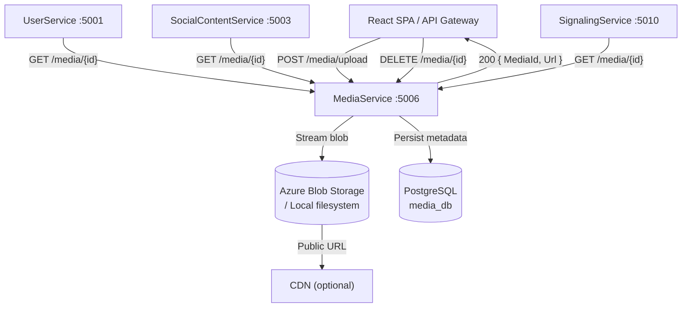
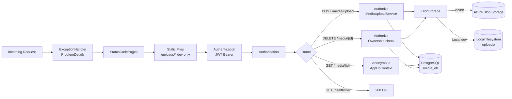
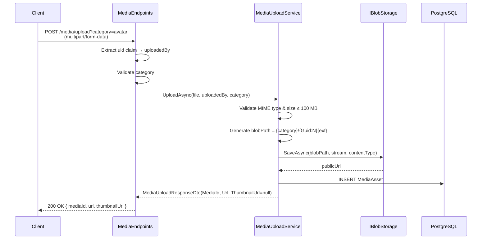
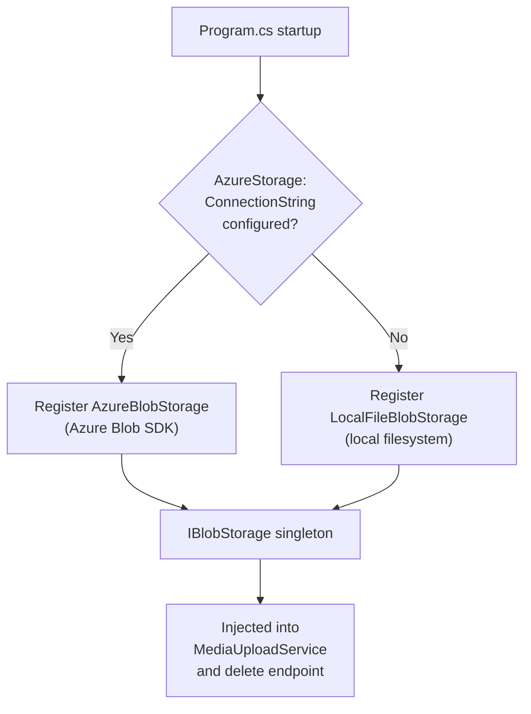
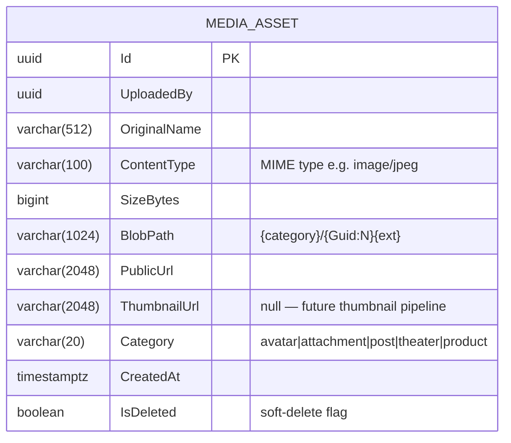
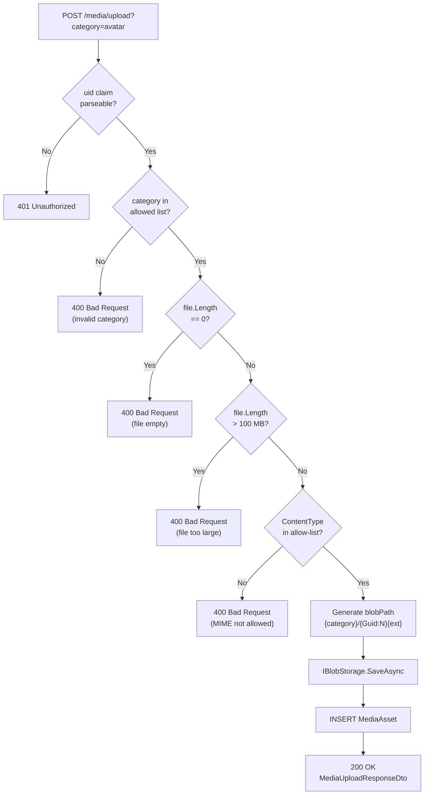

# MediaService

> **Port:** 5006 &nbsp;|&nbsp; **Runtime:** ASP.NET Core (.NET 9) &nbsp;|&nbsp; **Database:** PostgreSQL (`media_db`) &nbsp;|&nbsp; **Phase:** Infrastructure

## Overview

MediaService is the **platform-wide binary asset authority** for the SocialCommerce super-app. It owns:

- **File upload** — Authenticated multipart upload endpoint that validates MIME type and size, streams the file to blob storage, and records asset metadata in PostgreSQL. Supported types span images (JPEG, PNG, GIF, WebP), video (MP4, WebM), audio (MP3, OGG, WAV), and PDF. Maximum file size is 100 MB.
- **Asset metadata** — Public endpoint to retrieve the full metadata record for any non-deleted asset by its UUID, including the public URL, category, uploader, and content type.
- **Soft deletion** — Authenticated, ownership-gated delete that marks the `MediaAsset` record as `IsDeleted = true` and physically removes the blob from storage.
- **Dual storage backends** — `AzureBlobStorage` for production (Azure Blob Storage with optional CDN prefix) and `LocalFileBlobStorage` for development (local filesystem served via ASP.NET Core static files middleware at `/uploads/*`). The backend is selected at startup based on whether `AzureStorage:ConnectionString` is populated.
- **JWT Bearer auth** — Upload and delete require a valid HS256 JWT; the `uid` claim identifies the uploading user. Metadata retrieval is publicly accessible.

---

## Architecture

### Position in the Platform



### Request Pipeline



### Upload Flow



### Storage Backend Selection



---

## Project Structure

```
services/MediaService/
├── MediaService.csproj                # net9.0; no shared/Contracts ref; build context = service dir
├── Program.cs                         # Composition root — EF Core, JWT, IBlobStorage, Minimal API
├── Dockerfile                         # Single-context build; no shared project dependency
├── appsettings.json
├── appsettings.Development.json
│
├── Auth/
│   └── JwtAuthExtensions.cs          # AddServiceJwtAuth — HS256 JWT Bearer, no audience check
│
├── Data/
│   ├── AppDbContext.cs               # EF Core DbContext — 1 DbSet, uuid-ossp extension
│   └── Entities.cs                   # MediaAsset entity
│
├── Dtos/
│   └── MediaDtos.cs                  # MediaUploadResponseDto, MediaMetaDto
│
├── Endpoints/
│   └── MediaEndpoints.cs             # Minimal API — MapMediaEndpoints extension
│
├── Migrations/
│   └── 20260322172605_InitialCreate  # MediaAssets table + 2 indexes
│
├── Services/
│   ├── IBlobStorage.cs               # SaveAsync, DeleteAsync, GetPublicUrl
│   ├── AzureBlobStorage.cs           # Azure Blob SDK implementation (production)
│   ├── LocalFileBlobStorage.cs       # Filesystem implementation (development)
│   └── MediaUploadService.cs         # MIME validation, path generation, persist
│
└── Properties/
    └── launchSettings.json           # Local dev — http://localhost:5006
```

> MediaService has **no dependency on `shared/Contracts`**. It is fully self-contained; the Dockerfile uses the service directory as its build context (`build: ./services/MediaService`), unlike services that reference shared projects.

---

## Data Model

### ER Diagram



### Entity Column Summary

#### `MediaAsset`

| Column | Type | Nullable | Notes |
|---|---|---|---|
| `Id` | `uuid` | No | PK; generated in application layer |
| `UploadedBy` | `uuid` | No | `uid` claim from JWT; index on this column |
| `OriginalName` | `varchar(512)` | No | Original file name from the form upload |
| `ContentType` | `varchar(100)` | No | MIME type validated against allow-list |
| `SizeBytes` | `bigint` | No | File size in bytes; max 104,857,600 (100 MB) |
| `BlobPath` | `varchar(1024)` | No | Storage path used as blob key, e.g. `avatar/3fa85f64...jpg` |
| `PublicUrl` | `varchar(2048)` | No | Publicly addressable URL (CDN or storage URL) |
| `ThumbnailUrl` | `varchar(2048)` | Yes | Always `null` currently; reserved for future thumbnail pipeline |
| `Category` | `varchar(20)` | No | One of `avatar`, `attachment`, `post`, `theater`, `product` |
| `CreatedAt` | `timestamptz` | No | Set to `UtcNow` at insert; index on this column |
| `IsDeleted` | `boolean` | No | Soft-delete flag; `false` on creation; filtered on all reads |

### Database Indexes

| Index | Column | Purpose |
|---|---|---|
| `IX_MediaAssets_UploadedBy` | `UploadedBy` | Query all assets by a specific user |
| `IX_MediaAssets_CreatedAt` | `CreatedAt` | Chronological listing and range scans |

### Allowed MIME Types

| MIME type | Extension | Category(ies) |
|---|---|---|
| `image/jpeg` | `.jpg` | avatar, attachment, post, product |
| `image/png` | `.png` | avatar, attachment, post, product |
| `image/gif` | `.gif` | attachment, post |
| `image/webp` | `.webp` | avatar, attachment, post, product |
| `video/mp4` | `.mp4` | post, theater, attachment |
| `video/webm` | `.webm` | post, theater, attachment |
| `audio/mpeg` | `.mp3` | attachment |
| `audio/ogg` | `.ogg` | attachment |
| `audio/wav` | `.wav` | attachment |
| `application/pdf` | `.pdf` | attachment |

---

## Authentication & Authorization

| Aspect | Value |
|---|---|
| Scheme | JWT Bearer (`Authorization: Bearer <token>`) |
| Algorithm | HS256 (symmetric key) |
| Issuer | `SocialCommerce` |
| Audience validation | **Disabled** |
| Lifetime validation | Enabled; `ClockSkew = 30 s` |
| Key source | `Authentication:Jwt:SymmetricKey` (config) |
| User identity | `uid` claim parsed as `Guid`; used as `UploadedBy` on insert |

| Endpoint | Auth required | Ownership enforced |
|---|---|---|
| `POST /media/upload` | **Yes** — `[Authorize]` | — (uploads always belong to caller) |
| `GET /media/{id}` | **No** — anonymous | — |
| `DELETE /media/{id}` | **Yes** — `[Authorize]` | **Yes** — `403 Forbid()` if `UploadedBy != uid` |
| `GET /health/live` | **No** — anonymous | — |

> The `GET /media/{id}` endpoint is intentionally public. The public URL of an asset (returned on upload) is already accessible from the blob store; the metadata endpoint mirrors that openness. Deletion is ownership-gated and returns `403` (not `404`) to clearly signal the resource exists but is not owned by the caller.

---

## API Reference

### `MediaEndpoints` — `/media`

| Method | Path | Body / Query | Success | Errors | Description |
|---|---|---|---|---|---|
| `POST` | `/media/upload` | `multipart/form-data` + `?category=` | `200 MediaUploadResponseDto` | `400`, `401` | Upload a file; validates MIME type and size |
| `GET` | `/media/{id}` | — | `200 MediaMetaDto` | `404` | Retrieve asset metadata (public) |
| `DELETE` | `/media/{id}` | — | `204 No Content` | `401`, `403`, `404` | Soft-delete asset record + physical blob removal |
| `GET` | `/health/live` | — | `200 OK` | — | Liveness probe |

#### `POST /media/upload` — Validation Flow



#### Blob Path Format

```
{category}/{id:N}{ext}
```

Examples:
- `avatar/3fa85f645717456...jpg`
- `post/9d4e1c2a0000000...mp4`
- `product/b1c2d3e4f5a6b7c...png`

---

## Data Transfer Objects

### `MediaUploadResponseDto`

Returned by `POST /media/upload` on success.

```json
{
  "mediaId": "3fa85f64-5717-4562-b3fc-2c963f66afa6",
  "url": "https://myaccount.blob.core.windows.net/media/avatar/3fa85f64...jpg",
  "thumbnailUrl": null
}
```

> `thumbnailUrl` is always `null` in the current phase. Thumbnail generation (e.g., via Azure Functions or a media processing pipeline) is planned for a later phase.

### `MediaMetaDto`

Returned by `GET /media/{id}`.

```json
{
  "id": "3fa85f64-5717-4562-b3fc-2c963f66afa6",
  "uploadedBy": "9d4e1c2a-0000-0000-0000-000000000000",
  "originalName": "profile-photo.jpg",
  "contentType": "image/jpeg",
  "sizeBytes": 204800,
  "publicUrl": "https://myaccount.blob.core.windows.net/media/avatar/3fa85f64...jpg",
  "thumbnailUrl": null,
  "category": "avatar",
  "createdAt": "2025-01-15T12:34:56Z"
}
```

---

## Storage Backends

### `AzureBlobStorage` (production)

| Aspect | Detail |
|---|---|
| SDK | `Azure.Storage.Blobs` v12 |
| Container creation | `CreateIfNotExistsAsync(PublicAccessType.Blob)` — container is public-read |
| `ContentType` | Set via `BlobHttpHeaders` on upload |
| Public URL | `{CdnBase}/{blobPath}` if `AzureStorage:CdnBase` is set; otherwise native blob URI |
| Deletion | `blob.DeleteIfExistsAsync()` — physical removal |

### `LocalFileBlobStorage` (development)

| Aspect | Detail |
|---|---|
| Storage root | `{contentRoot}/uploads/` (created on startup) |
| Served via | ASP.NET Core `StaticFileOptions` at `/uploads/*` (dev only) |
| Public URL | `{MediaService:LocalBaseUrl}/uploads/{blobPath}` |
| Deletion | `File.Delete()` — physical removal |
| Activation | Registered when `AzureStorage:ConnectionString` is absent |

---

## Service Dependencies

### Outbound (MediaService calls…)

| Dependency | Type | Required | Purpose |
|---|---|---|---|
| PostgreSQL | TCP (EF Core / Npgsql) | **Yes** | Persist and query `MediaAsset` records |
| Azure Blob Storage | HTTPS (Azure SDK) | No | Production blob storage; local filesystem used when absent |

### Inbound (…calls MediaService)

| Caller | Endpoint(s) | Purpose |
|---|---|---|
| React SPA / end users | `POST /media/upload` | Upload user avatars, post images/videos, product images, attachments |
| UserService | `GET /media/{id}` | Resolve avatar asset metadata on profile reads |
| SocialContentService | `GET /media/{id}` | Resolve post/attachment metadata on content reads |
| SignalingService | `GET /media/{id}` | Resolve theater/streaming media assets |
| Any peer service | `DELETE /media/{id}` | Owner-initiated asset removal |

---

## Configuration

### `appsettings.json` Keys

| Key | Required | Default | Description |
|---|---|---|---|
| `ConnectionStrings:Default` | **Yes** | — | Npgsql connection string to `media_db` |
| `Authentication:Jwt:Issuer` | No | `SocialCommerce` | JWT issuer claim to validate |
| `Authentication:Jwt:SymmetricKey` | **Yes** | — | Shared HS256 signing key (≥ 32 bytes) |
| `MediaService:LocalBaseUrl` | No | `http://localhost:5006` | Base URL used by `LocalFileBlobStorage` to build public asset URLs |
| `AzureStorage:ConnectionString` | No | `""` (local mode) | Azure Storage account connection string; empty activates `LocalFileBlobStorage` |
| `AzureStorage:Container` | No | `media` | Azure Blob container name |
| `AzureStorage:CdnBase` | No | `""` (storage URL) | CDN prefix for public URLs; e.g. `https://media.example.com` |

### `appsettings.Development.json` Defaults

| Key | Development Value |
|---|---|
| `ConnectionStrings:Default` | `Host=host.docker.internal;Port=5432;Database=media_db;Username=postgres;Password=1234;Ssl Mode=Disable` |
| `Authentication:Jwt:Issuer` | `SocialCommerce` |
| `Authentication:Jwt:SymmetricKey` | `sc-dev-secret-key-min-32-bytes-long!!` |
| `MediaService:LocalBaseUrl` | `http://localhost:5006` |
| `AzureStorage:ConnectionString` | *(absent — `LocalFileBlobStorage` active)* |

---

## Containerization

### Dockerfile Stages

| Stage | Base Image | Purpose |
|---|---|---|
| `base` | `mcr.microsoft.com/dotnet/aspnet:9.0` | Final runtime layer; exposes port `8080` |
| `build` | `mcr.microsoft.com/dotnet/sdk:9.0` | Copies only the service `.csproj`, restores, compiles |
| `publish` | *(from build)* | Runs `dotnet publish` in Release mode |
| `final` | *(from base)* | Copies published output; sets `ENTRYPOINT` |

> MediaService has **no shared project dependency**. The build context is the service directory (`build: ./services/MediaService`), not the repo root. The Dockerfile copies `MediaService.csproj` directly without any `shared/` paths.

### `docker-compose.yml` Service Entry

```yaml
mediaservice:
  build: ./services/MediaService
  environment:
    ASPNETCORE_URLS: http://+:8080
    ASPNETCORE_ENVIRONMENT: Development
    ConnectionStrings__Default: "Host=postgres;Port=5432;Database=media_db;Username=postgres;Password=1234;Ssl Mode=Disable"
    Authentication__Jwt__Issuer: "SocialCommerce"
    Authentication__Jwt__SymmetricKey: "sc-dev-secret-key-min-32-bytes-long!!"
    MediaService__LocalBaseUrl: "http://localhost:5006"
  ports:
    - "5006:8080"
  depends_on:
    postgres:
      condition: service_healthy
```

> To switch to Azure Blob Storage in compose, add `AzureStorage__ConnectionString`, `AzureStorage__Container`, and optionally `AzureStorage__CdnBase` to the `environment` block.

---

## Migrations

| Migration | Date | Tables Created |
|---|---|---|
| `20260322172605_InitialCreate` | 2026-03-22 | `MediaAssets` |

### EF Core Commands

```bash
# Add a new migration
dotnet ef migrations add <MigrationName> \
  --project services/MediaService \
  --startup-project services/MediaService

# Apply migrations manually
dotnet ef database update \
  --project services/MediaService \
  --startup-project services/MediaService
```

In development, `db.Database.Migrate()` is called automatically on startup (guarded by `app.Environment.IsDevelopment()`).

---

## Key Design Decisions

| Decision | Rationale |
|---|---|
| **Minimal API instead of MVC controllers** | MediaService has three narrow endpoints with no shared routing logic, filters, or model binding requirements beyond a single `IFormFile`. Minimal API reduces boilerplate and keeps the endpoint surface explicit and co-located in `MediaEndpoints.cs`. |
| **Dual storage backend (Azure / local)** | Forcing Azure credentials for local development creates friction. `LocalFileBlobStorage` provides a zero-config filesystem fallback served via `StaticFileOptions`. The backend is selected purely by configuration presence, with no code-path changes between environments. |
| **Blob path as `{category}/{Guid:N}{ext}`** | The UUID component prevents enumeration and collisions; the category prefix enables cheap prefix queries and lifecycle policies (e.g., Azure Blob lifecycle rules can be scoped to `avatar/` or `post/`). |
| **Soft delete with physical blob removal** | `IsDeleted = true` preserves the audit trail and allows future restore, while `blob.DeleteIfExistsAsync()` frees storage immediately. Queries filter `IsDeleted == false` so deleted assets are invisible to callers without exposing the tombstone. |
| **`GET /media/{id}` is unauthenticated** | The public URL returned on upload is already directly accessible from blob storage. Requiring auth on the metadata endpoint would create inconsistency — the bytes are public but the record would be private. Treating both as public is the simpler, consistent contract. |
| **`403` on ownership mismatch (not `404`)** | Unlike services that return `404` to avoid ID enumeration, MediaService returns `403 Forbid()` on a delete by a non-owner. Because `GET /media/{id}` is public and confirms asset existence, returning `404` on delete would create a misleading inconsistency without adding security value. |
| **MIME type allow-list (not extension-based)** | File extensions are caller-controlled and trivially spoofed. Validating `IFormFile.ContentType` against an explicit allow-list prevents disguised executable uploads and simplifies the `Content-Type` header on served blobs. |
| **`ThumbnailUrl` reserved as null** | The `MediaAsset` schema and response DTOs include `ThumbnailUrl` today so that the contract between MediaService and callers does not need to change when a thumbnail pipeline (e.g., Azure Functions triggered by blob events) is added. Callers can already handle a non-null value without a breaking DTO change. |
| **No `shared/Contracts` dependency** | MediaService deals only with binary assets and has no need for the domain event or notification types defined in `shared/Contracts`. Keeping it independent reduces the build graph and allows the service Dockerfile to use the service directory as its sole build context. |
