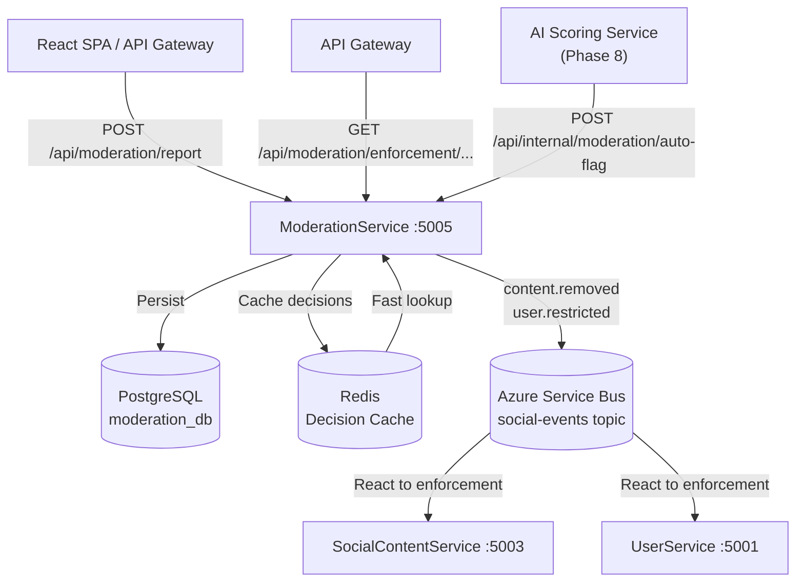
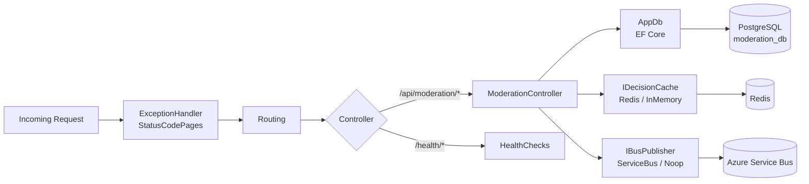
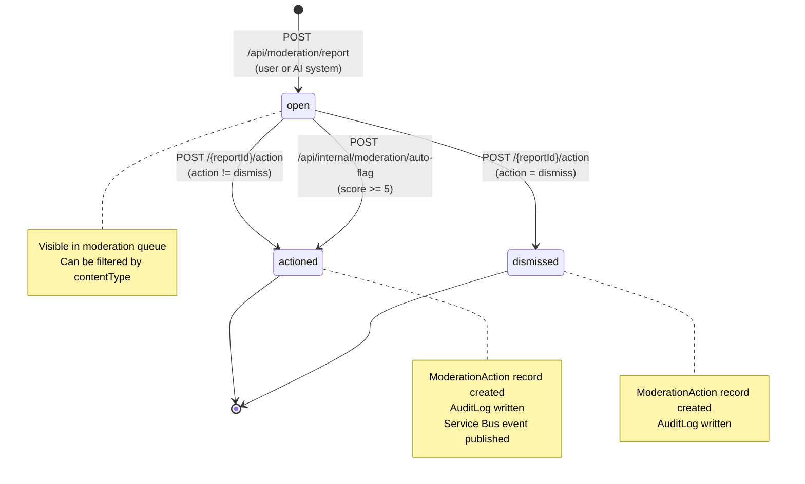
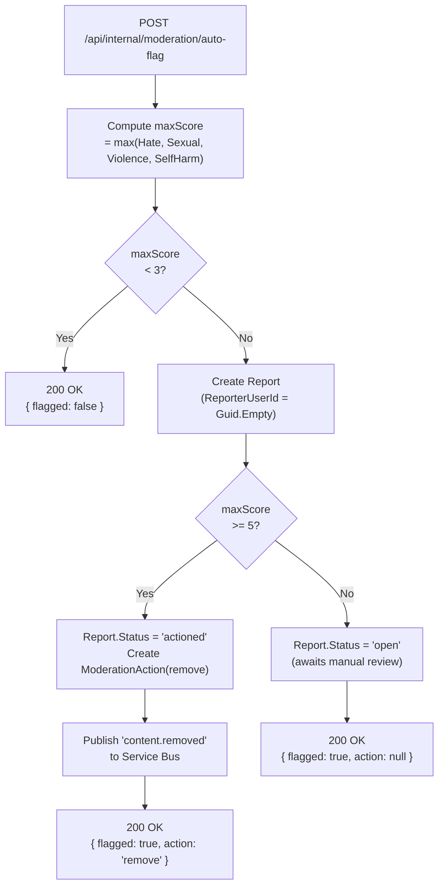
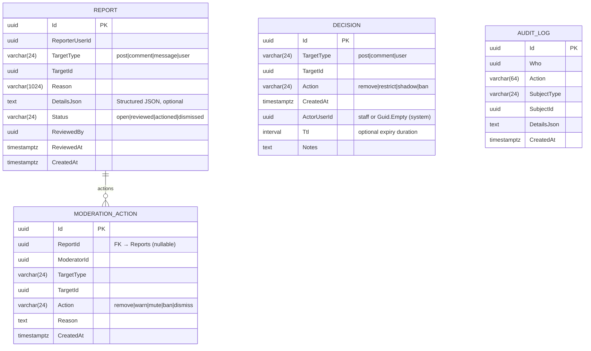
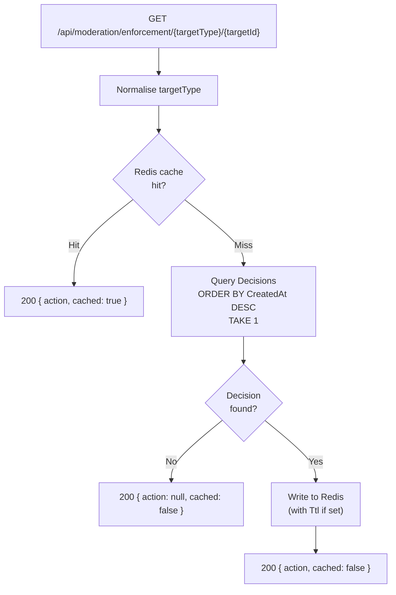
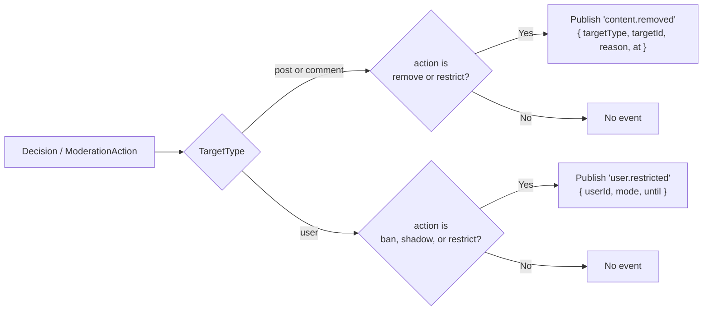

# ModerationService

> **Port:** 5005 &nbsp;|&nbsp; **Runtime:** ASP.NET Core (.NET 9) &nbsp;|&nbsp; **Database:** PostgreSQL (`moderation_db`) &nbsp;|&nbsp; **Phase:** Trust & Safety

## Overview

ModerationService is the **platform-wide trust and safety authority** for the SocialCommerce super-app. It owns:

- **Report intake** — Any authenticated client can submit a user-generated content report (`POST /api/moderation/report`). Reports capture the target entity type (`post`, `comment`, `message`, `user`), the reporting user, and optional freeform reason text plus structured detail.
- **Moderation queue** — Staff tools for listing open reports filtered by content type, with offset pagination.
- **Action application** — Moderators apply a named action (`remove`, `warn`, `mute`, `ban`, `dismiss`) against a queued report, advancing its status and writing an immutable `AuditLog` entry.
- **Enforcement decisions** — Staff or system actors issue durable `Decision` records (independent of individual reports) that bind an action to any platform entity with an optional TTL. Decisions are immediately written to a Redis cache for sub-millisecond enforcement lookups by downstream services.
- **Enforcement lookup** — A dedicated cache-first endpoint (`GET /api/moderation/enforcement/{targetType}/{targetId}`) allows API gateways and peer services to check the current enforcement state of any entity without reading the full decision history.
- **AI auto-flag integration** — An internal hook (`POST /api/internal/moderation/auto-flag`) accepts AI-scored content with four harm dimensions (hate, sexual, violence, self-harm), automatically creating reports and triggering removals based on configurable score thresholds.
- **Event publishing** — Enforcement decisions are broadcast to downstream consumers via Azure Service Bus (`content.removed`, `user.restricted`) on the `social-events` topic. A `NoopBusPublisher` is used when no Service Bus connection is configured, allowing the service to run fully offline.
- **Observability** — Full OpenTelemetry tracing and metrics with optional Azure Monitor / Application Insights export; dual health-check endpoints.

---

## Architecture

### Position in the Platform



### Request Pipeline



> **Note:** ModerationService has **no JWT Bearer authentication** in the current phase. All endpoints are accessible without a token. Access control is expected to be enforced at the API gateway layer or via network policy. The `POST /api/moderation/report` endpoint is explicitly public; staff endpoints are logically segregated by route but not technically guarded.

### Report Lifecycle



### AI Auto-Flag Flow



---

## Project Structure

```
services/ModerationService/
├── ModerationService.csproj           # net9.0; refs shared/Contracts; DockerfileContext = ../..
├── Program.cs                         # Composition root — EF Core, Redis, Service Bus, OTEL, health checks
├── Dockerfile                         # Multi-stage .NET 9 container build; context = repo root
├── appsettings.json
├── appsettings.Development.json
│
├── Controllers/
│   └── ModerationController.cs        # /api/moderation — reports, queue, decisions, enforcement, auto-flag
│
├── Data/
│   ├── AppDb.cs                       # EF Core DbContext — 4 DbSets, 6 indexes
│   ├── AppDbFactory.cs                # IDesignTimeDbContextFactory for EF CLI
│   ├── Entities.cs                    # Report, ModerationAction, Decision, AuditLog
│   └── Migrations/
│       └── 20260322181825_Init        # Full schema — all 4 tables
│
├── Dtos/
│   └── ModDtos.cs                     # All request/response records
│
├── Services/
│   ├── BusPublisher.cs                # IBusPublisher + BusPublisher (Azure SB) + NoopBusPublisher
│   └── DecisionCache.cs               # IDecisionCache + RedisDecisionCache + InMemoryDecisionCache
│
└── Properties/
    └── launchSettings.json            # Local dev — http://localhost:5297
```

> **Shared dependency:** `shared/Contracts/Contracts.csproj` is referenced. The `DockerfileContext` is `../..` (repo root) to include `shared/` in the Docker build context.

---

## Data Model

### ER Diagram



> `Decision` is independent of `Report` — staff can issue a `Decision` directly without a prior report. `ModerationAction` is the human or system response to a specific report; `Decision` is the durable enforcement record that gate-keeps content visibility.

### Entity Column Summary

#### `Report`

| Column | Type | Nullable | Notes |
|---|---|---|---|
| `Id` | `uuid` | No | PK |
| `ReporterUserId` | `uuid` | No | `Guid.Empty` for AI-generated reports |
| `TargetType` | `varchar(24)` | No | `post`, `comment`, `message`, `user`; normalised to lowercase |
| `TargetId` | `uuid` | No | ID of the reported entity |
| `Reason` | `varchar(1024)` | Yes | Free-text reason from reporter |
| `DetailsJson` | `text` | Yes | Serialised `Details` object from `CreateReport` |
| `Status` | `varchar(24)` | No | Default `open`; index on `Status` |
| `ReviewedBy` | `uuid` | Yes | Moderator user ID set on action apply |
| `ReviewedAt` | `timestamptz` | Yes | Set when action is applied |
| `CreatedAt` | `timestamptz` | No | — |

#### `ModerationAction`

| Column | Type | Nullable | Notes |
|---|---|---|---|
| `Id` | `uuid` | No | PK |
| `ReportId` | `uuid` | Yes | FK → `Reports`; nullable (actions can exist without a report) |
| `ModeratorId` | `uuid` | No | `Guid.Empty` for AI-triggered actions |
| `TargetType` | `varchar(24)` | No | Copied from linked report |
| `TargetId` | `uuid` | No | Copied from linked report |
| `Action` | `varchar(24)` | No | `remove`, `warn`, `mute`, `ban`, `dismiss` |
| `Reason` | `text` | No | — |
| `CreatedAt` | `timestamptz` | No | — |

#### `Decision`

| Column | Type | Nullable | Notes |
|---|---|---|---|
| `Id` | `uuid` | No | PK |
| `TargetType` | `varchar(24)` | No | `post`, `comment`, `user` |
| `TargetId` | `uuid` | No | Composite index with `TargetType` and `CreatedAt` |
| `Action` | `varchar(24)` | No | `remove`, `restrict`, `shadow`, `ban` |
| `CreatedAt` | `timestamptz` | No | — |
| `ActorUserId` | `uuid` | No | `Guid.Empty` for system decisions |
| `Ttl` | `interval` | Yes | Duration until the decision expires; applied to Redis cache TTL |
| `Notes` | `text` | Yes | — |

#### `AuditLog`

| Column | Type | Nullable | Notes |
|---|---|---|---|
| `Id` | `uuid` | No | PK |
| `Who` | `uuid` | No | User performing the action |
| `Action` | `varchar(64)` | No | Action name, e.g. `decision.create`, `action.apply` |
| `SubjectType` | `varchar(24)` | No | Target entity type |
| `SubjectId` | `uuid` | No | Target entity ID |
| `DetailsJson` | `text` | Yes | Serialised request DTO |
| `CreatedAt` | `timestamptz` | No | Index on `CreatedAt` |

### Database Indexes

| Index | Columns | Purpose |
|---|---|---|
| `IX_Reports_TargetType_TargetId` | `(TargetType, TargetId)` | Look up all reports against a specific entity |
| `IX_Reports_Status` | `(Status)` | Filter open queue; count by status |
| `IX_ModerationActions_ReportId` | `(ReportId)` | Join actions to a report |
| `IX_ModerationActions_TargetType_TargetId` | `(TargetType, TargetId)` | Enforcement history for a target |
| `IX_Decisions_TargetType_TargetId_CreatedAt` | `(TargetType, TargetId, CreatedAt)` | Latest-decision lookup and history range scans |
| `IX_AuditLogs_CreatedAt` | `(CreatedAt)` | Chronological audit trail queries |

---

## Authentication & Authorization

| Aspect | Value |
|---|---|
| Scheme | **None** (no JWT Bearer in current phase) |
| Access control | Expected at API gateway / network policy layer |
| Staff vs. public distinction | Comments in code only (`// public endpoint`, `// staff`); not technically enforced |
| AI hook | `POST /api/internal/moderation/auto-flag` — intended for internal network only |

> ModerationService does not currently validate JWT tokens. This is an acknowledged gap for Phase 8 (Trust & Safety hardening). Until then, staff-facing routes must be protected at the infrastructure layer (e.g., ingress allow-list, VNet peering, or API gateway role enforcement).

---

## API Reference

### `ModerationController` — `/api/moderation`

| Method | Path | Query / Body | Success | Errors | Description |
|---|---|---|---|---|---|
| `POST` | `/api/moderation/report` | `CreateReport` | `201 ReportRead` | `400` | Submit a user report (public) |
| `GET` | `/api/moderation/report/{id}` | — | `200 ReportRead` | `404` | Fetch a single report (staff) |
| `GET` | `/api/moderation/queue` | `contentType`, `take`, `skip` | `200 QueueItem[]` | — | List open reports (staff); `take` clamped 1–200; default 50 |
| `POST` | `/api/moderation/{reportId}/action` | `ApplyActionRequest` | `200 ModerationActionRead` | `404` | Apply moderation action to a report (staff) |
| `POST` | `/api/moderation/decision` | `CreateDecision` | `201 DecisionRead` | `400` | Issue a direct enforcement decision (staff/system) |
| `GET` | `/api/moderation/decision/{id}` | — | `200 DecisionRead` | `404` | Fetch a single decision (staff) |
| `GET` | `/api/moderation/decisions` | `targetType`, `targetId` | `200 DecisionRead[]` | — | List all decisions for a target, newest first (staff) |
| `GET` | `/api/moderation/enforcement/{targetType}/{targetId}` | — | `200 { action, cached }` | — | Cache-first enforcement lookup (gateway / services) |
| `POST` | `/api/internal/moderation/auto-flag` | `AutoFlagRequest` | `200 { flagged, action, reportId? }` | `400` | AI scoring hook; triggers auto-removal at score ≥ 5 (internal) |

#### Enforcement Lookup Flow



#### Decision → Service Bus Routing



---

## Data Transfer Objects

### `CreateReport`

```json
{
  "reporterUserId": "9d4e1c2a-...",
  "targetType": "post",
  "targetId": "3fa85f64-...",
  "reason": "This post contains hate speech.",
  "details": { "screenshots": ["url1", "url2"] }
}
```

### `ReportRead`

```json
{
  "id": "3fa85f64-...",
  "reporterUserId": "9d4e1c2a-...",
  "targetType": "post",
  "targetId": "b1c2d3e4-...",
  "reason": "This post contains hate speech.",
  "status": "open",
  "createdAt": "2025-01-15T12:34:56Z"
}
```

### `QueueItem`

```json
{
  "reportId": "3fa85f64-...",
  "reportedBy": "9d4e1c2a-...",
  "contentType": "post",
  "contentId": "b1c2d3e4-...",
  "reason": "Spam",
  "createdAt": "2025-01-15T12:34:56Z"
}
```

### `ApplyActionRequest`

```json
{
  "moderatorId": "staff-user-uuid",
  "action": "remove",
  "reason": "Confirmed policy violation: hate speech."
}
```

### `ModerationActionRead`

```json
{
  "id": "3fa85f64-...",
  "reportId": "b1c2d3e4-...",
  "moderatorId": "staff-user-uuid",
  "targetType": "post",
  "targetId": "c3d4e5f6-...",
  "action": "remove",
  "reason": "Confirmed policy violation: hate speech.",
  "createdAt": "2025-01-15T13:00:00Z"
}
```

### `CreateDecision`

```json
{
  "targetType": "user",
  "targetId": "9d4e1c2a-...",
  "action": "ban",
  "actorUserId": "staff-user-uuid",
  "ttlMinutes": null,
  "notes": "Permanent ban — repeat severe violations."
}
```

### `DecisionRead`

```json
{
  "id": "3fa85f64-...",
  "targetType": "user",
  "targetId": "9d4e1c2a-...",
  "action": "ban",
  "actorUserId": "staff-user-uuid",
  "createdAt": "2025-01-15T13:00:00Z",
  "ttlMinutes": null,
  "notes": "Permanent ban — repeat severe violations."
}
```

### `AutoFlagRequest`

```json
{
  "contentType": "post",
  "contentId": "3fa85f64-...",
  "content": "Raw content text submitted for scoring",
  "scores": {
    "hate": 7,
    "sexual": 0,
    "violence": 2,
    "selfHarm": 0
  }
}
```

---

## Event Publishing

ModerationService publishes enforcement events to Azure Service Bus on the `social-events` topic. Messages are serialised as JSON with a `type` application property and `Subject` header.

### Published Events

| Event type | Trigger | Payload |
|---|---|---|
| `content.removed` | Decision / action with `remove` or `restrict` on `post` or `comment`; AI auto-remove | `{ targetType, targetId, reason, at }` |
| `content.removed` | Action with `mute` or `ban` on any `TargetType` (via apply-action path) | `{ targetType, targetId, reason, at }` |
| `user.restricted` | Decision with `ban`, `shadow`, or `restrict` on `user` | `{ userId, mode, until }` — `until` is `null` for permanent bans |

### `IBusPublisher` Implementations

| Class | Active when | Behaviour |
|---|---|---|
| `BusPublisher` | `ServiceBus:Connection` is set | Sends `ServiceBusMessage` with `Subject = type` and JSON body to configured topic |
| `NoopBusPublisher` | `ServiceBus:Connection` is empty/absent | Silently discards all publish calls; safe for local development |

---

## Decision Cache

The decision cache provides sub-millisecond enforcement lookups for gateway and peer services, avoiding a database round-trip on every content render or API call.

### `IDecisionCache` Implementations

| Class | Active when | Storage | TTL support |
|---|---|---|---|
| `RedisDecisionCache` | `Redis:Connection` is set | Redis string `decision:{targetType}:{targetId}` → action string | Uses `Decision.Ttl`; key expires automatically |
| `InMemoryDecisionCache` | `Redis:Connection` is absent | `Dictionary<string, (action, expiry)>` in-process | Simulated TTL checked on read; expired entries removed lazily |

### Cache Key Format

```
decision:{targetType}:{targetId}
```

Examples:
- `decision:post:3fa85f64-5717-4562-b3fc-2c963f66afa6` → `"remove"`
- `decision:user:9d4e1c2a-0000-0000-0000-000000000000` → `"ban"`

Cache entries are written on both `POST /api/moderation/decision` (immediately after DB save) and on a cache miss at `GET /api/moderation/enforcement/...` (lazy warm-up). `InvalidateAsync` is available on the interface for future use (e.g., expiry of time-limited decisions).

---

## Service Dependencies

### Outbound (ModerationService calls…)

| Dependency | Type | Required | Purpose |
|---|---|---|---|
| PostgreSQL | TCP (EF Core / Npgsql) | **Yes** | Persist all moderation records |
| Redis | TCP (StackExchange.Redis) | No | Decision cache; falls back to in-process dictionary |
| Azure Service Bus | AMQP (Azure.Messaging.ServiceBus) | No | Publish `content.removed` and `user.restricted`; falls back to noop |
| Azure Monitor | HTTPS (OpenTelemetry exporter) | No | Distributed tracing and metrics; activated by `APPLICATIONINSIGHTS_CONNECTION_STRING` |

### Inbound (…calls ModerationService)

| Caller | Endpoint(s) | Purpose |
|---|---|---|
| React SPA / end users | `POST /api/moderation/report` | User-submitted content reports |
| API Gateway / staff tools | `GET /api/moderation/queue`, `POST /{reportId}/action` | Manual moderation workflow |
| API Gateway / staff tools | `POST /api/moderation/decision`, `GET /api/moderation/decisions` | Direct enforcement decisions |
| API Gateway / peer services | `GET /api/moderation/enforcement/{targetType}/{targetId}` | Real-time content visibility checks |
| AI Scoring Service *(Phase 8)* | `POST /api/internal/moderation/auto-flag` | Automated content scoring and removal |

### Service Bus Consumers (downstream)

| Consumer | Event | Reaction |
|---|---|---|
| SocialContentService | `content.removed` | Hide / tombstone post or comment |
| UserService | `user.restricted` | Apply account restriction mode |

---

## Configuration

### `appsettings.json` Keys

| Key | Required | Default | Description |
|---|---|---|---|
| `ConnectionStrings:Default` | **Yes** | — | Npgsql connection string to `moderation_db` |
| `ServiceBus:Connection` | No | `""` (noop) | Azure Service Bus connection string; omit to disable event publishing |
| `ServiceBus:Topic` | No | `social-events` | Service Bus topic name for enforcement events |
| `Redis:Connection` | No | `localhost:6379,abortConnect=false` | Redis connection string; omit to use in-memory decision cache |
| `APPLICATIONINSIGHTS_CONNECTION_STRING` | No | — | Azure Monitor OTEL exporter; omit to disable cloud telemetry |

### `appsettings.Development.json` Defaults

| Key | Development Value |
|---|---|
| `ConnectionStrings:Default` | `Host=localhost;Port=5432;Database=moderation;Username=postgres;Password=1234;Ssl Mode=Disable` |
| `ServiceBus:Connection` | *(empty — noop publisher active)* |
| `ServiceBus:Topic` | `social-events` |
| `Redis:Connection` | `localhost:6379,abortConnect=false` |

---

## Containerization

### Dockerfile Stages

| Stage | Base Image | Purpose |
|---|---|---|
| `base` | `mcr.microsoft.com/dotnet/aspnet:9.0` | Final runtime layer; exposes ports `8080` and `8081` |
| `build` | `mcr.microsoft.com/dotnet/sdk:9.0` | Copies `shared/Contracts` and service project, restores, compiles |
| `publish` | *(from build)* | Runs `dotnet publish` in Release mode |
| `final` | *(from base)* | Copies published output; sets `ENTRYPOINT` |

The build context is the **repo root** (`context: .`) so the `shared/Contracts` project reference is resolvable inside Docker.

### `docker-compose.yml` Service Entry

```yaml
moderationservice:
  build:
    context: .
    dockerfile: services/ModerationService/Dockerfile
  environment:
    ASPNETCORE_URLS: http://+:8080
    ASPNETCORE_ENVIRONMENT: Development
    ConnectionStrings__Default: "Host=postgres;Port=5432;Database=moderation_db;Username=postgres;Password=1234;Ssl Mode=Disable"
  ports:
    - "5005:8080"
  depends_on:
    postgres:
      condition: service_healthy
    redis:
      condition: service_started
```

> To enable Service Bus event publishing in compose, add `ServiceBus__Connection` and `ServiceBus__Topic` environment variables. To enable the Redis decision cache, add `Redis__Connection: "redis:6379,abortConnect=false"`.

---

## Migrations

| Migration | Date | Tables Created |
|---|---|---|
| `20260322181825_Init` | 2026-03-22 | `Reports`, `ModerationActions`, `Decisions`, `AuditLogs` |

### EF Core Commands

```bash
# Add a new migration
dotnet ef migrations add <MigrationName> \
  --project services/ModerationService \
  --startup-project services/ModerationService

# Apply migrations manually
dotnet ef database update \
  --project services/ModerationService \
  --startup-project services/ModerationService
```

In development, `db.Database.MigrateAsync()` is called automatically on startup (guarded by `app.Environment.IsDevelopment()`).

---

## Key Design Decisions

| Decision | Rationale |
|---|---|
| **No JWT auth in current phase** | ModerationService is a staff/internal tool expected to be deployed behind an API gateway or VNet boundary. Adding full RBAC-aware JWT enforcement is planned for Phase 8 (Trust & Safety hardening) alongside the AI integration. |
| **`Decision` independent of `Report`** | Staff sometimes need to pre-emptively restrict a user or remove content that has not been reported (e.g., from proactive scanning or AI flagging). Decoupling `Decision` from `Report` ensures enforcement is never blocked on the existence of a user complaint. |
| **Redis decision cache with in-memory fallback** | Content visibility checks (`GET /enforcement/...`) are on the critical path for every page render. Redis provides sub-millisecond lookups. The `InMemoryDecisionCache` fallback means the service starts and stays functional in local development or on nodes where Redis is unavailable, without any code-path changes. |
| **Noop Service Bus publisher** | Enforcement events are important but should not block local development or integration tests. `NoopBusPublisher` is registered automatically when `ServiceBus:Connection` is absent, making the service fully runnable without Azure credentials. |
| **`AuditLog` written on every decision and action** | All state-changing operations write an immutable `AuditLog` row before the transaction commits. This provides a tamper-resistant trail for compliance, appeals, and post-incident forensics without requiring an external audit system. |
| **`TargetType` normalised to lowercase** | All `TargetType` values pass through `Normalize()` (`.Trim().ToLowerInvariant()`) before any DB write or cache key construction. This prevents duplicate entries from caller casing differences and keeps Redis keys deterministic. |
| **AI auto-flag thresholds as constants** | `FlagThreshold = 3` and `RemoveThreshold = 5` are compile-time constants in `ModerationController`. Moving them to configuration (or a database-backed rules table) is the intended Phase 8 upgrade path when the AI pipeline is production-ready. |
| **`Decision.Ttl` stored as PostgreSQL `interval`** | Storing the duration rather than an absolute expiry timestamp means the semantics survive re-reads: the original intent ("ban for 7 days") is preserved in the record even after the Redis cache entry has expired, and the TTL can be re-applied to a new cache entry on any enforcement lookup miss. |
| **OpenTelemetry with optional Azure Monitor** | Full OTEL instrumentation is wired unconditionally; Azure Monitor export is opt-in via `APPLICATIONINSIGHTS_CONNECTION_STRING`. This means the service emits traces and metrics to any OTEL-compatible collector in production and simply omits cloud export in development, with zero code changes. |
