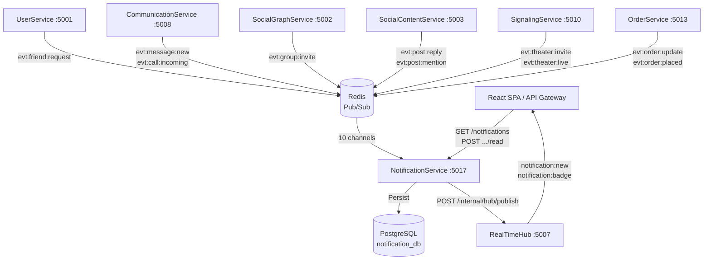
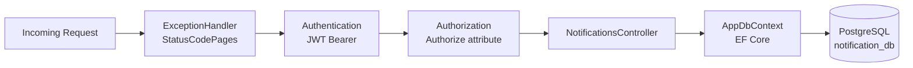
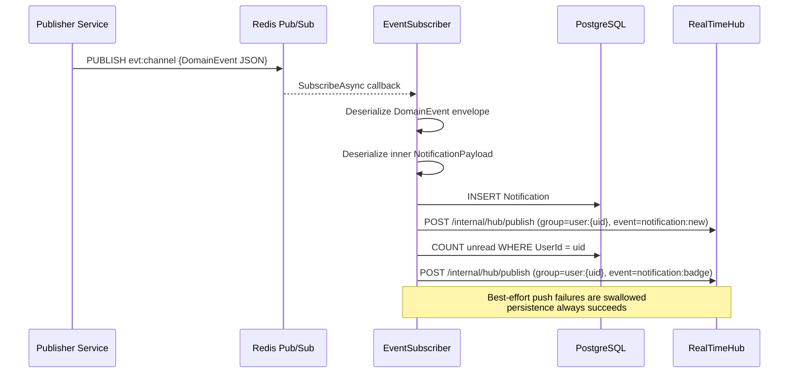
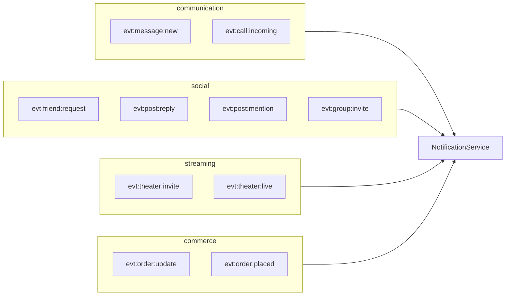
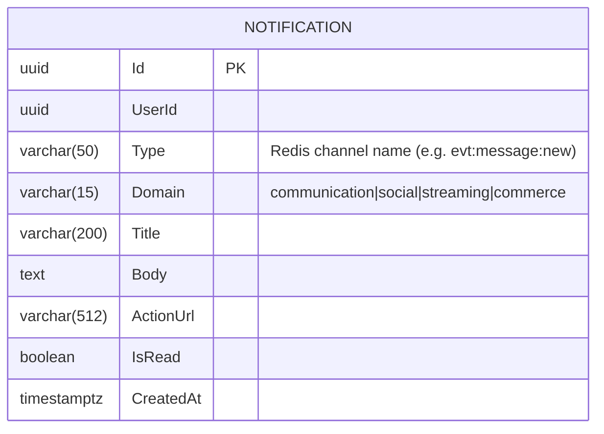
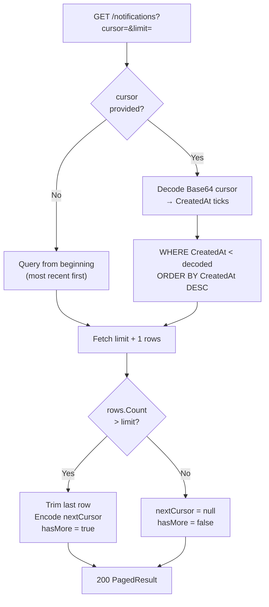

# NotificationService

> **Port:** 5017 &nbsp;|&nbsp; **Runtime:** ASP.NET Core (.NET 9) &nbsp;|&nbsp; **Database:** PostgreSQL (`notification_db`) &nbsp;|&nbsp; **Phase:** Cross-cutting

## Overview

NotificationService is the **platform-wide notification fan-in** for the SocialCommerce super-app. It owns:

- **Event subscription** — A hosted `BackgroundService` subscribes to 10 Redis Pub/Sub channels, each representing a domain event published by an upstream service. Every arriving event is translated into a persisted `Notification` record for the target user.
- **Notification inbox** — Cursor-paginated REST API for the SPA to fetch a user's notification history, ordered most-recent first.
- **Read state management** — Individual and bulk mark-as-read operations; live unread badge count endpoint.
- **Real-time push** — After persisting each notification, the service pushes both a `notification:new` event and a `notification:badge` count update to the user's group on RealTimeHub (:5007), enabling instant inbox and badge updates in the browser.
- **JWT Bearer auth** — All REST endpoints require a valid HS256 JWT; the `uid` claim identifies the acting user throughout.

---

## Architecture

### Position in the Platform



### Request Pipeline



### Event Processing Pipeline



### Notification Domains



---

## Project Structure

```
services/NotificationService/
├── NotificationService.csproj         # net9.0; refs shared/Contracts; DockerfileContext = ../..
├── Program.cs                         # Composition root — EF Core, Redis, JWT, RTH HttpClient, EventSubscriber
├── appsettings.json
├── appsettings.Development.json
│
├── Auth/
│   └── JwtAuthExtensions.cs          # AddServiceJwtAuth — HS256 JWT Bearer, no audience check
│
├── Controllers/
│   └── NotificationsController.cs    # /notifications — inbox, unread count, mark-read
│
├── Data/
│   ├── AppDbContext.cs               # EF Core DbContext — 1 DbSet, uuid-ossp, 2 composite indexes
│   └── Entities.cs                   # Notification entity
│
├── Dtos/
│   └── NotificationDtos.cs           # PagedResult<T>, NotificationDto, UnreadCountDto
│
├── Services/
│   ├── EventSubscriber.cs            # BackgroundService — subscribes to 10 Redis channels
│   ├── IRealTimePublisher.cs         # Abstraction for push to RealTimeHub
│   └── RealTimePublisher.cs          # HttpClient impl — POST /internal/hub/publish, best-effort
│
└── Properties/
    └── launchSettings.json           # Local dev profile — http://localhost:5017
```

> **Shared dependency:** `shared/Contracts/Contracts.csproj` provides `DomainEvent`, `NotificationPayload`, and `EventTypes` string constants. The `DockerfileContext` is set to `../..` (repo root) so the Docker build context includes the `shared/` directory.

---

## Data Model

### ER Diagram



> NotificationService owns a single table. All relational data (e.g., sender names, post titles) is embedded in `Title`, `Body`, and `ActionUrl` at event-creation time by the publisher; no joins are required at read time.

### Entity Column Summary

#### `Notification`

| Column | Type | Nullable | Notes |
|---|---|---|---|
| `Id` | `uuid` | No | PK, `uuid_generate_v4()` |
| `UserId` | `uuid` | No | Composite index with `CreatedAt`; composite index with `IsRead` |
| `Type` | `varchar(50)` | No | Raw event channel string (e.g., `evt:post:reply`) |
| `Domain` | `varchar(15)` | No | Logical group: `communication`, `social`, `streaming`, `commerce` |
| `Title` | `varchar(200)` | No | Short human-readable heading |
| `Body` | `text` | No | Full notification body copy |
| `ActionUrl` | `varchar(512)` | Yes | Deep-link URL for the SPA to navigate on tap |
| `IsRead` | `boolean` | No | `false` on creation; set via mark-read endpoints |
| `CreatedAt` | `timestamptz` | No | Cursor anchor; set to `UtcNow` on insert |

### Database Indexes

| Index | Columns | Purpose |
|---|---|---|
| `IX_Notifications_UserId_CreatedAt` | `(UserId, CreatedAt)` | Cursor-paginated inbox listing |
| `IX_Notifications_UserId_IsRead` | `(UserId, IsRead)` | Unread badge count query |

---

## Authentication & Authorization

| Aspect | Value |
|---|---|
| Scheme | JWT Bearer (`Authorization: Bearer <token>`) |
| Algorithm | HS256 (symmetric key) |
| Issuer | `SocialCommerce` |
| Audience validation | **Disabled** |
| Lifetime validation | Enabled; `ClockSkew = 30 s` |
| Key source | `Authentication:Jwt:SymmetricKey` (config) |
| User identity | `uid` claim parsed as `Guid`; used as `UserId` on all queries |

`NotificationsController` is decorated with `[Authorize]`. All queries are filtered by `UserId == caller.uid`; requests for another user's notifications simply return empty results rather than `403` to avoid enumeration.

---

## API Reference

### `NotificationsController` — `/notifications`

| Method | Path | Query | Success | Errors | Description |
|---|---|---|---|---|---|
| `GET` | `/notifications` | `cursor`, `limit` | `200 PagedResult<NotificationDto>` | `401` | Cursor-paginated inbox, `CreatedAt DESC`, default limit 20 |
| `GET` | `/notifications/unread-count` | — | `200 UnreadCountDto` | `401` | Count of unread notifications for the caller |
| `POST` | `/notifications/{id}/read` | — | `204 No Content` | `401`, `404` | Mark a single notification as read |
| `POST` | `/notifications/read-all` | — | `200 { updated: N }` | `401` | Mark all of the caller's notifications as read |

#### `GET /notifications` — Cursor Flow



---

## Data Transfer Objects

### `NotificationDto`

```json
{
  "id": "3fa85f64-5717-4562-b3fc-2c963f66afa6",
  "userId": "9d4e1c2a-...",
  "type": "evt:message:new",
  "domain": "communication",
  "title": "New message",
  "body": "Alice sent you a message: \"Hey, are you free tonight?\"",
  "actionUrl": "/messages/thread/abc123",
  "isRead": false,
  "createdAt": "2025-01-15T12:34:56Z"
}
```

### `UnreadCountDto`

```json
{
  "unreadCount": 7
}
```

### `PagedResult<NotificationDto>`

```json
{
  "items": [ /* NotificationDto[] */ ],
  "nextCursor": "MTczODU3NjQ5NjAwMDAwMDA=",
  "hasMore": true
}
```

---

## Event Subscriptions

`EventSubscriber` subscribes to all 10 channels at startup using `RedisChannel.Literal(channel)`. Each channel maps to a domain and a default title generator; if the publisher populates `NotificationPayload.Title`, that value is used verbatim instead.

### Channel Map

| Channel (`EventTypes.*`) | Redis Key | Domain | Default Title |
|---|---|---|---|
| `MessageNew` | `evt:message:new` | `communication` | New message |
| `CallIncoming` | `evt:call:incoming` | `communication` | Incoming call |
| `FriendRequest` | `evt:friend:request` | `social` | New friend request |
| `PostReply` | `evt:post:reply` | `social` | Someone replied to your post |
| `PostMention` | `evt:post:mention` | `social` | You were mentioned in a post |
| `GroupInvite` | `evt:group:invite` | `social` | Group invitation |
| `TheaterInvite` | `evt:theater:invite` | `streaming` | Theater invitation |
| `TheaterLive` | `evt:theater:live` | `streaming` | A user you follow went live |
| `OrderUpdate` | `evt:order:update` | `commerce` | Order status updated |
| `OrderPlaced` | `evt:order:placed` | `commerce` | New order placed |

### `DomainEvent` Envelope (from `shared/Contracts`)

```json
{
  "id": "3fa85f64-...",
  "type": "evt:message:new",
  "source": "CommunicationService",
  "timestamp": "2025-01-15T12:34:56Z",
  "data": {
    "userId": "9d4e1c2a-...",
    "title": "",
    "body": "Alice sent you a message",
    "actionUrl": "/messages/thread/abc123"
  }
}
```

The `data` field is deserialized as `NotificationPayload`. If `UserId` is `Guid.Empty` or the payload is missing, the event is discarded with a warning log.

---

## Real-Time Push

After persisting each `Notification`, `EventSubscriber` makes two sequential fire-and-forget calls to RealTimeHub:

| Push event | Group | Payload |
|---|---|---|
| `notification:new` | `user:{userId}` | Full `NotificationDto`-shaped object |
| `notification:badge` | `user:{userId}` | `{ "unreadCount": N }` (live DB count) |

`RealTimePublisher` calls `POST /internal/hub/publish` with an `X-Internal-Api-Key` header. Any HTTP or network exception is silently swallowed — notification persistence is never blocked or rolled back due to a push failure.

---

## Cursor Pagination

The `GET /notifications` endpoint uses cursor-based pagination anchored on `CreatedAt`.

| Property | Value |
|---|---|
| Field encoded | `CreatedAt.UtcTicks` (100-ns intervals since 0001-01-01) |
| Encoding | `Base64( UTF-8( ticks.ToString() ) )` |
| Direction | `CreatedAt DESC` (most recent notifications first) |
| Default page size | 20 |
| Last-page signal | `nextCursor == null && hasMore == false` |

---

## Service Dependencies

### Outbound (NotificationService calls…)

| Dependency | Type | Purpose |
|---|---|---|
| PostgreSQL | TCP (EF Core / Npgsql) | Persist and query `Notification` records |
| Redis | TCP (StackExchange.Redis) | Subscribe to 10 domain event channels via Pub/Sub |
| RealTimeHub `:5007` | HTTP (`POST /internal/hub/publish`) | Push `notification:new` and `notification:badge` to user groups |

### Inbound (…calls NotificationService)

| Caller | Endpoint(s) | Purpose |
|---|---|---|
| React SPA / API Gateway | `GET /notifications`, `GET /notifications/unread-count` | Fetch inbox and badge count |
| React SPA / API Gateway | `POST /notifications/{id}/read`, `POST /notifications/read-all` | Mark notifications as read |

### Event Publishers (Redis Pub/Sub)

| Service | Channels published |
|---|---|
| CommunicationService | `evt:message:new`, `evt:call:incoming` |
| SocialGraphService | `evt:friend:request`, `evt:group:invite` |
| SocialContentService | `evt:post:reply`, `evt:post:mention` |
| SignalingService | `evt:theater:invite`, `evt:theater:live` |
| OrderService | `evt:order:update`, `evt:order:placed` |

---

## Configuration

### `appsettings.json` Keys

| Key | Required | Description |
|---|---|---|
| `ConnectionStrings:Default` | **Yes** | Npgsql connection string to `notification_db` |
| `ConnectionStrings:Redis` | **Yes** | StackExchange.Redis connection string (e.g., `localhost:6379`) |
| `Authentication:Jwt:Issuer` | No | JWT issuer; defaults to `SocialCommerce` |
| `Authentication:Jwt:SymmetricKey` | **Yes** | Shared HS256 signing key (≥ 32 bytes) |
| `RealTimeHub:BaseUrl` | No | Base URL of RealTimeHub; defaults to `http://localhost:5007` |
| `Internal:ApiKey` | **Yes** | Shared secret sent as `X-Internal-Api-Key` to RealTimeHub |

### `appsettings.Development.json` Defaults

| Key | Development Value |
|---|---|
| `ConnectionStrings:Default` | `Host=localhost;Port=5432;Database=notification_db;Username=postgres;Password=1234;Include Error Detail=true;Ssl Mode=Disable` |
| `ConnectionStrings:Redis` | `localhost:6379` |
| `Authentication:Jwt:Issuer` | `SocialCommerce` |
| `Authentication:Jwt:SymmetricKey` | `sc-dev-secret-key-min-32-bytes-long!!` |
| `RealTimeHub:BaseUrl` | `http://localhost:5007` |
| `Internal:ApiKey` | `sc-internal-dev-key` |

---

## Containerization

### Dockerfile Stages

| Stage | Base Image | Purpose |
|---|---|---|
| `base` | `mcr.microsoft.com/dotnet/aspnet:9.0` | Final runtime layer; exposes port `8080` |
| `build` | `mcr.microsoft.com/dotnet/sdk:9.0` | Copies `shared/Contracts` and service project, restores, compiles |
| `publish` | *(from build)* | Runs `dotnet publish` in Release mode |
| `final` | *(from base)* | Copies published output; sets `ENTRYPOINT` |

The `DockerfileContext` is `../..` (repo root) so that the `shared/Contracts` project reference is available inside the Docker build context.

### Recommended `docker-compose.yml` Service Entry

```yaml
notificationservice:
  build:
    context: .
    dockerfile: services/NotificationService/Dockerfile
  environment:
    ASPNETCORE_URLS: http://+:8080
    ASPNETCORE_ENVIRONMENT: Development
    ConnectionStrings__Default: "Host=postgres;Port=5432;Database=notification_db;Username=postgres;Password=1234;Include Error Detail=true;Ssl Mode=Disable"
    ConnectionStrings__Redis: "redis:6379,abortConnect=false"
    Authentication__Jwt__Issuer: "SocialCommerce"
    Authentication__Jwt__SymmetricKey: "sc-dev-secret-key-min-32-bytes-long!!"
    RealTimeHub__BaseUrl: "http://realtimehub:8080"
    Internal__ApiKey: "sc-dev-internal-api-key"
  ports:
    - "5017:8080"
  depends_on:
    postgres:
      condition: service_healthy
    redis:
      condition: service_started
    realtimehub:
      condition: service_started
```

> **Note:** NotificationService is not yet present in the root `docker-compose.yml`. Add the above entry alongside the existing service definitions.

---

## Migrations

No EF Core migration has been created yet for this service. Run the following commands to scaffold and apply the initial schema:

### EF Core Commands

```bash
# Add the initial migration
dotnet ef migrations add InitialCreate \
  --project services/NotificationService \
  --startup-project services/NotificationService

# Apply migrations manually
dotnet ef database update \
  --project services/NotificationService \
  --startup-project services/NotificationService
```

In development, `db.Database.Migrate()` is called automatically on startup (guarded by `app.Environment.IsDevelopment()`), so the `Notifications` table will be created on first run once the migration exists.

---

## Key Design Decisions

| Decision | Rationale |
|---|---|
| **Single-table, denormalised notifications** | Notification data (`Title`, `Body`, `ActionUrl`) is copied from the event payload at insertion time. This eliminates joins at read time and ensures inbox entries remain accurate even if the source entity (message, post, order) is later deleted or modified. |
| **Redis Pub/Sub for event fan-in** | All upstream services already use Redis for other purposes (caching, presence, signaling). Pub/Sub provides a zero-infrastructure-overhead broadcast mechanism suitable for the current phase; the `DomainEvent` / `NotificationPayload` envelope from `shared/Contracts` is designed to be compatible with Azure Service Bus in a future production phase. |
| **`IServiceScopeFactory` in `BackgroundService`** | `EventSubscriber` is a singleton hosted service but needs scoped EF Core `DbContext` and `IRealTimePublisher` instances per event. `IServiceScopeFactory.CreateScope()` is used to resolve and dispose these services safely on each event, preventing context reuse across concurrent callbacks. |
| **Best-effort real-time push** | `RealTimePublisher` silently swallows all exceptions. Notification persistence (the source of truth) is never blocked by RealTimeHub availability. The SPA will see notifications on next poll even if the socket push was missed. |
| **`notification:badge` as a live count** | Instead of inferring the unread count on the client from incremental events, NotificationService queries the live unread count from PostgreSQL after each insert and pushes it explicitly. This self-corrects any badge drift caused by missed push events (e.g., tab was closed during delivery). |
| **`Type` stores the raw channel string** | Persisting the raw `EventTypes` constant (e.g., `evt:post:reply`) rather than a numeric enum preserves human-readable meaning in the database and allows new event types to be added without a schema migration. |
| **`Domain` as a grouping field** | Storing the logical domain (`communication`, `social`, `streaming`, `commerce`) separately from `Type` lets the SPA filter or badge-group notifications by domain without parsing the `Type` string. |
| **Cursor pagination on `CreatedAt DESC`** | Notification inboxes are always read newest-first. A `CreatedAt` descending cursor avoids the page-drift problem that affects offset pagination when new notifications arrive between pages. |
| **`ActionUrl` as an optional deep-link** | Embedding a relative URL in the notification record lets the SPA navigate directly to the relevant resource (thread, post, order) on tap without any client-side routing logic keyed on `Type`. Publishers are free to omit it for informational-only notifications. |
