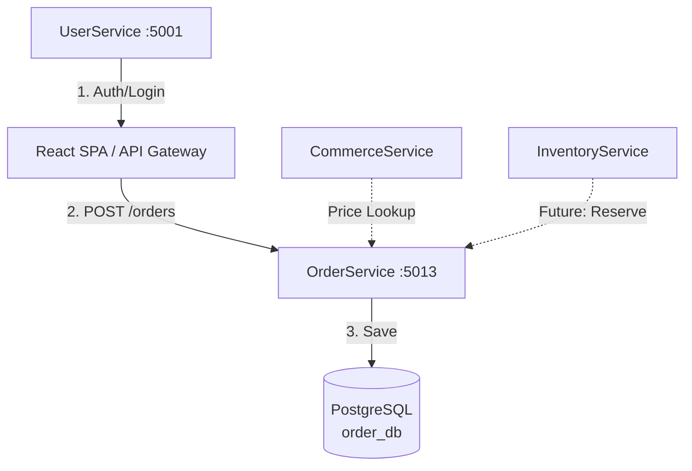
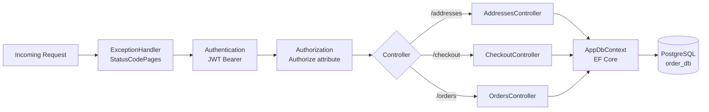
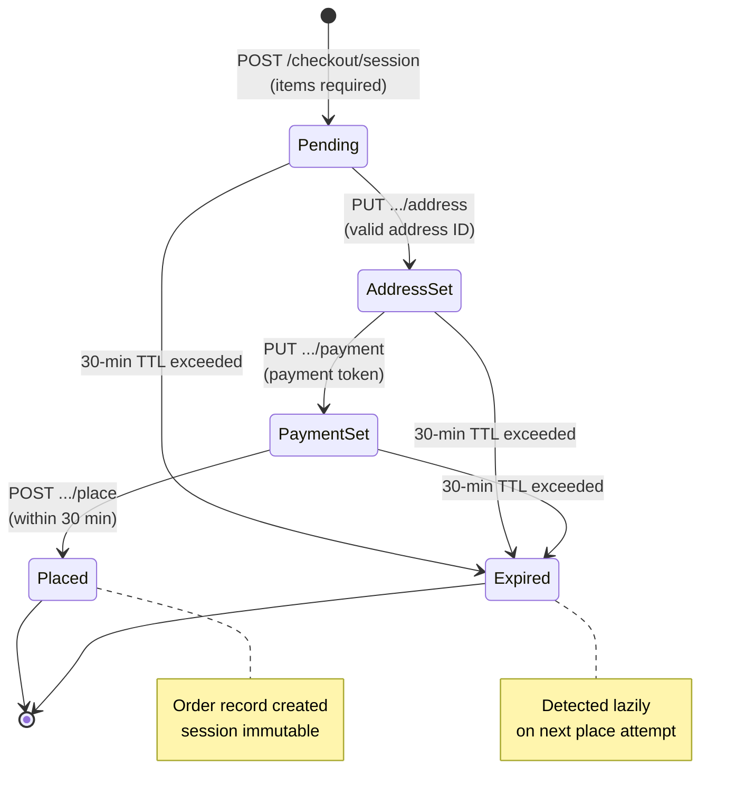
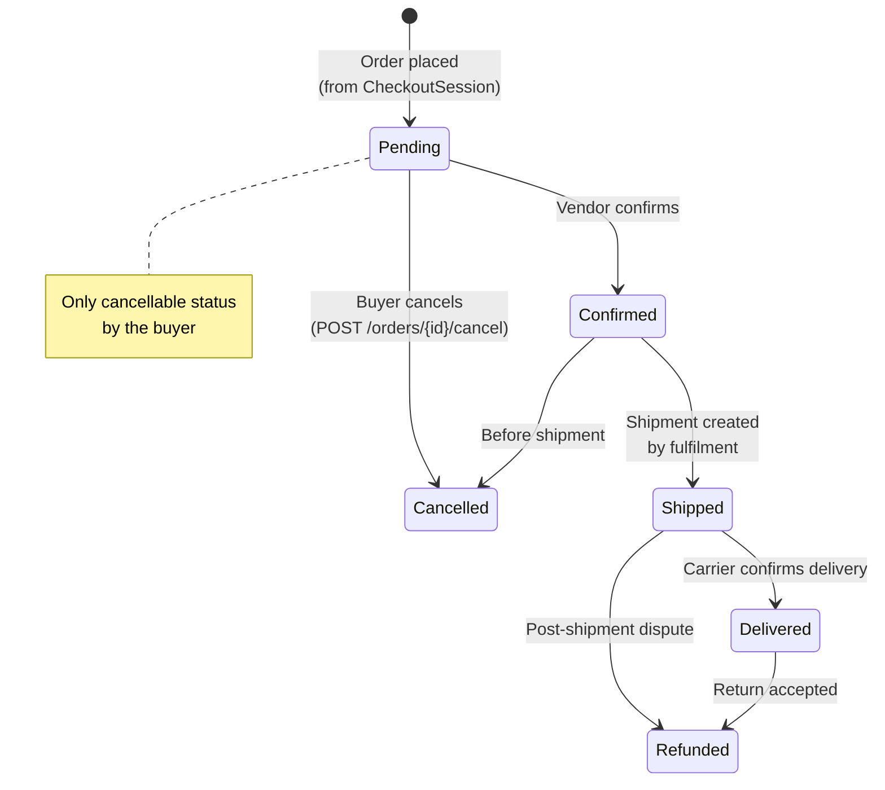
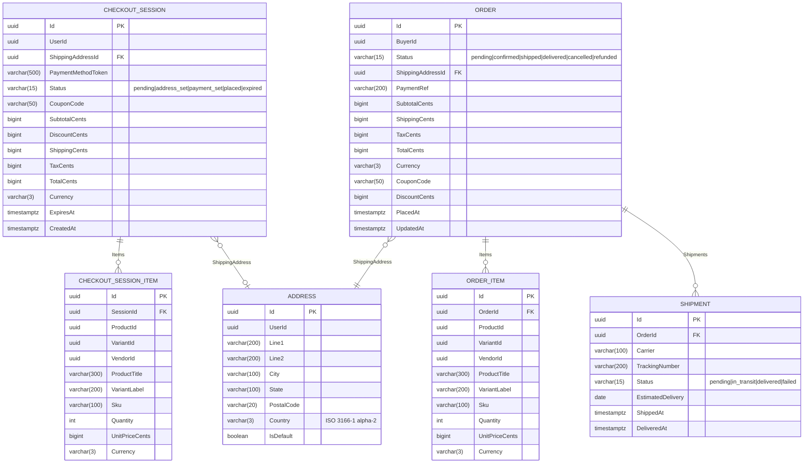
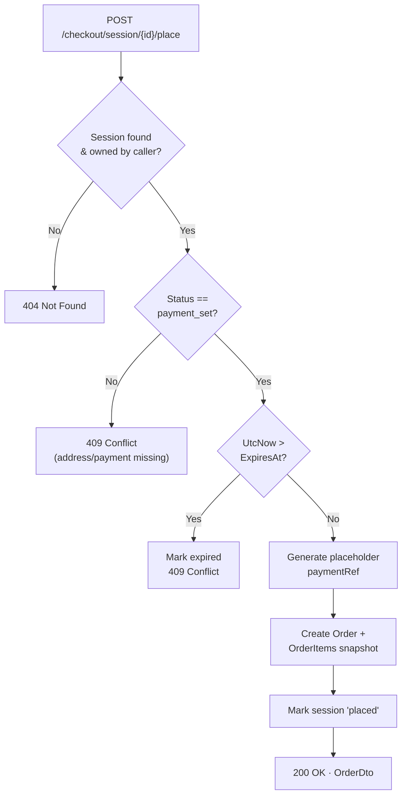
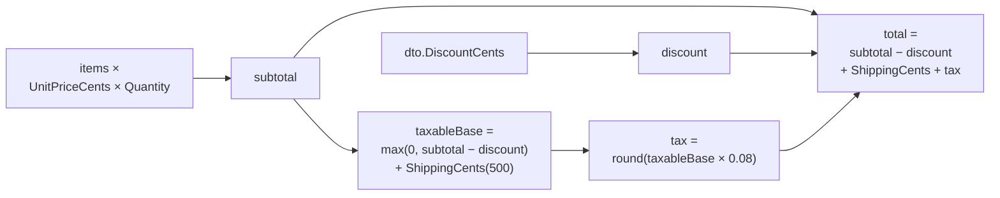

# OrderService

> **Port:** 5013 &nbsp;|&nbsp; **Runtime:** ASP.NET Core (.NET 9) &nbsp;|&nbsp; **Database:** PostgreSQL (`order_db`) &nbsp;|&nbsp; **Phase:** Commerce

## Overview

OrderService is the **checkout and order lifecycle authority** for the SocialCommerce super-app. It owns:

- **Address book** — CRUD management of a buyer's saved shipping addresses with single-default enforcement.
- **Multi-step checkout sessions** — Stateful 30-minute sessions that walk a buyer through item collection → shipping address → payment token → order placement, with an explicit status machine preventing out-of-order transitions.
- **Order management** — Immutable order records created from placed checkout sessions; buyers can list, inspect, and cancel pending orders.
- **Shipment tracking** — Carrier and tracking-number records attached to orders for per-order delivery status visibility.
- **Pricing engine (flat-rate)** — Subtotal, coupon discount, flat $5.00 shipping, and 8 % tax computed at session creation; totals are snapshotted on order placement.
- **JWT Bearer auth** — All endpoints require a valid HS256 JWT; the `uid` claim identifies the acting buyer throughout.

---

## Architecture

### Position in the Platform



> OrderService does not call any other service at runtime. Product prices and variant details are supplied by the caller in the checkout session creation request. Payment capture is currently stubbed with a placeholder `paymentRef`; integration with a payment provider (Stripe) is planned for a later phase.

### Request Pipeline



### Checkout Session State Machine



### Order Status Lifecycle



---

## Project Structure

```
services/OrderService/
├── OrderService.csproj
├── Program.cs                         # Composition root — EF Core, JWT auth, MVC
├── Dockerfile                         # Multi-stage .NET 9 container build
├── appsettings.json
├── appsettings.Development.json
│
├── Auth/
│   └── JwtAuthExtensions.cs          # AddServiceJwtAuth — HS256 JWT Bearer, no audience check
│
├── Controllers/
│   ├── AddressesController.cs        # /addresses — saved address CRUD
│   ├── CheckoutController.cs         # /checkout — session lifecycle + order placement
│   └── OrdersController.cs           # /orders — order history, detail, tracking, cancel
│
├── Data/
│   ├── AppDbContext.cs               # EF Core DbContext — 6 DbSets, uuid-ossp, indexes
│   ├── AppDbFactory.cs               # IDesignTimeDbContextFactory for EF CLI
│   └── Entities.cs                   # Address, CheckoutSession, CheckoutSessionItem,
│                                     #   Order, OrderItem, Shipment
│
├── Dtos/
│   └── OrderDtos.cs                  # All request/response records
│
├── Migrations/
│   └── 20260322185053_InitialCreate  # Full schema — all 6 tables
│
└── Properties/
    └── launchSettings.json           # Local dev profile — http://localhost:5013
```

---

## Data Model

### ER Diagram



### Entity Column Summary

#### `Address`

| Column | Type | Nullable | Constraint |
|---|---|---|---|
| `Id` | `uuid` | No | PK, `uuid_generate_v4()` |
| `UserId` | `uuid` | No | Index |
| `Line1` | `varchar(200)` | No | — |
| `Line2` | `varchar(200)` | Yes | — |
| `City` | `varchar(100)` | No | — |
| `State` | `varchar(100)` | No | — |
| `PostalCode` | `varchar(20)` | No | — |
| `Country` | `varchar(3)` | No | ISO 3166-1 alpha-2 |
| `IsDefault` | `boolean` | No | Single-default enforced in app |

#### `CheckoutSession`

| Column | Type | Nullable | Notes |
|---|---|---|---|
| `Id` | `uuid` | No | PK |
| `UserId` | `uuid` | No | Index |
| `ShippingAddressId` | `uuid` | Yes | FK → `Addresses` |
| `PaymentMethodToken` | `varchar(500)` | Yes | Opaque provider token |
| `Status` | `varchar(15)` | No | State-machine value |
| `CouponCode` | `varchar(50)` | Yes | — |
| `SubtotalCents` | `bigint` | No | Sum of line items |
| `DiscountCents` | `bigint` | No | From coupon / promo |
| `ShippingCents` | `bigint` | No | Flat 500 |
| `TaxCents` | `bigint` | No | 8 % of taxable base |
| `TotalCents` | `bigint` | No | Final payable amount |
| `Currency` | `varchar(3)` | No | Default `"USD"` |
| `ExpiresAt` | `timestamptz` | No | `CreatedAt + 30 min` |
| `CreatedAt` | `timestamptz` | No | — |

#### `Order` (columns mirroring `CheckoutSession` for immutable snapshot)

| Column | Type | Nullable | Notes |
|---|---|---|---|
| `Id` | `uuid` | No | PK |
| `BuyerId` | `uuid` | No | Index; from `uid` claim |
| `Status` | `varchar(15)` | No | Index; lifecycle value |
| `ShippingAddressId` | `uuid` | No | FK → `Addresses` |
| `PaymentRef` | `varchar(200)` | Yes | Provider confirmation ID |
| `PlacedAt` | `timestamptz` | No | Cursor anchor |
| `UpdatedAt` | `timestamptz` | No | Updated on status changes |

#### `Shipment`

| Column | Type | Nullable | Notes |
|---|---|---|---|
| `Id` | `uuid` | No | PK |
| `OrderId` | `uuid` | No | FK → `Orders` |
| `Carrier` | `varchar(100)` | No | e.g., `"UPS"`, `"FedEx"` |
| `TrackingNumber` | `varchar(200)` | No | — |
| `Status` | `varchar(15)` | No | `pending\|in_transit\|delivered\|failed` |
| `EstimatedDelivery` | `date` | Yes | — |
| `ShippedAt` | `timestamptz` | Yes | — |
| `DeliveredAt` | `timestamptz` | Yes | — |

---

## Authentication & Authorization

| Aspect | Value |
|---|---|
| Scheme | JWT Bearer (`Authorization: Bearer <token>`) |
| Algorithm | HS256 (symmetric key) |
| Issuer | `SocialCommerce` |
| Audience validation | **Disabled** |
| Lifetime validation | Enabled; `ClockSkew = 30 s` |
| Key source | `Authentication:Jwt:SymmetricKey` (config) |
| User identity | `uid` claim parsed as `Guid`; used as `UserId` / `BuyerId` on all writes |

All three controllers are decorated with `[Authorize]`. Resource ownership is enforced at the data layer — queries always filter by `UserId == UserId` (addresses, checkout sessions) or `BuyerId == UserId` (orders); a mismatched `sessionId` or `orderId` returns `404 Not Found` rather than `403 Forbidden` to avoid enumeration.

---

## API Reference

### `AddressesController` — `/addresses`

| Method | Path | Body | Success | Errors | Description |
|---|---|---|---|---|---|
| `GET` | `/addresses` | — | `200 AddressDto[]` | `401` | List all saved addresses; default first |
| `POST` | `/addresses` | `CreateAddressDto` | `201 AddressDto` | `401` | Create address; clears prior default if `IsDefault: true` |
| `PATCH` | `/addresses/{id}` | `UpdateAddressDto` | `200 AddressDto` | `401`, `404` | Partial update; promotes to default if `IsDefault: true` |
| `DELETE` | `/addresses/{id}` | — | `204` | `401`, `404` | Remove address |

### `CheckoutController` — `/checkout`

| Method | Path | Body | Success | Errors | Description |
|---|---|---|---|---|---|
| `POST` | `/checkout/session` | `CreateCheckoutSessionDto` | `201 CheckoutSessionDto` | `400`, `401` | Create session; computes pricing; 30-min TTL |
| `PUT` | `/checkout/session/{id}/address` | `SetAddressDto` | `200 CheckoutSessionDto` | `401`, `403`, `404`, `409` | Assign shipping address; advances status |
| `PUT` | `/checkout/session/{id}/payment` | `SetPaymentDto` | `200 CheckoutSessionDto` | `401`, `403`, `404`, `409` | Record payment token; requires address first |
| `GET` | `/checkout/session/{id}/review` | — | `200 CheckoutSessionDto` | `401`, `403`, `404` | Retrieve full session summary before placing |
| `POST` | `/checkout/session/{id}/place` | — | `200 OrderDto` | `401`, `403`, `404`, `409` | Place order; requires `payment_set` status and non-expired session |

#### `POST /checkout/session/{id}/place` — Validation Flowchart



#### Pricing Calculation



| Constant | Value | Notes |
|---|---|---|
| `ShippingCents` | `500` | Flat rate ($5.00); shipping engine planned for later phase |
| `TaxRate` | `0.08` | 8 %; applied to `(subtotal − discount + shipping)` |
| Session TTL | 30 minutes | `ExpiresAt = CreatedAt + 30 min`; enforced lazily on `place` |

### `OrdersController` — `/orders`

| Method | Path | Query | Success | Errors | Description |
|---|---|---|---|---|---|
| `GET` | `/orders` | `cursor`, `limit` | `200 PagedResult<OrderSummaryDto>` | `401` | Cursor-paginated order history |
| `GET` | `/orders/{id}` | — | `200 OrderDto` | `401`, `404` | Full order detail with address, items, and shipments |
| `GET` | `/orders/{id}/tracking` | — | `200 ShipmentDto[]` | `401`, `404` | All shipments for an order |
| `POST` | `/orders/{id}/cancel` | — | `200 OrderDto` | `401`, `404`, `409` | Cancel a `pending` order only |

---

## Data Transfer Objects

### `CreateCheckoutSessionDto`

```json
{
  "items": [
    {
      "productId": "3fa85f64-...",
      "variantId": "9d4e1c2a-...",
      "vendorId": "b1c2d3e4-...",
      "productTitle": "Classic Tee",
      "variantLabel": "Blue / M",
      "sku": "CT-BLU-M",
      "quantity": 2,
      "unitPriceCents": 2999,
      "currency": "USD"
    }
  ],
  "couponCode": "SAVE10",
  "discountCents": 500,
  "currency": "USD"
}
```

### `CheckoutSessionDto`

```json
{
  "id": "3fa85f64-...",
  "userId": "9d4e1c2a-...",
  "status": "payment_set",
  "shippingAddress": { "id": "...", "line1": "123 Main St", "city": "Austin", "state": "TX", "postalCode": "78701", "country": "US", "isDefault": true },
  "couponCode": "SAVE10",
  "items": [{ "id": "...", "productId": "...", "productTitle": "Classic Tee", "quantity": 2, "unitPriceCents": 2999, "currency": "USD" }],
  "subtotalCents": 5998,
  "discountCents": 500,
  "shippingCents": 500,
  "taxCents": 480,
  "totalCents": 6478,
  "currency": "USD",
  "expiresAt": "2025-01-15T13:04:56Z",
  "createdAt": "2025-01-15T12:34:56Z"
}
```

### `OrderDto`

```json
{
  "id": "3fa85f64-...",
  "buyerId": "9d4e1c2a-...",
  "status": "pending",
  "shippingAddress": { "id": "...", "line1": "123 Main St", "city": "Austin", "state": "TX", "postalCode": "78701", "country": "US", "isDefault": true },
  "paymentRef": "pay_abc123",
  "items": [{ "id": "...", "productId": "...", "productTitle": "Classic Tee", "variantLabel": "Blue / M", "sku": "CT-BLU-M", "quantity": 2, "unitPriceCents": 2999, "currency": "USD" }],
  "subtotalCents": 5998,
  "shippingCents": 500,
  "taxCents": 480,
  "totalCents": 6478,
  "currency": "USD",
  "couponCode": "SAVE10",
  "discountCents": 500,
  "placedAt": "2025-01-15T12:34:56Z",
  "updatedAt": "2025-01-15T12:34:56Z"
}
```

### `OrderSummaryDto`

```json
{
  "id": "3fa85f64-...",
  "status": "pending",
  "itemCount": 3,
  "totalCents": 6478,
  "currency": "USD",
  "placedAt": "2025-01-15T12:34:56Z"
}
```

### `ShipmentDto`

```json
{
  "id": "3fa85f64-...",
  "orderId": "9d4e1c2a-...",
  "carrier": "UPS",
  "trackingNumber": "1Z999AA10123456784",
  "status": "in_transit",
  "estimatedDelivery": "2025-01-18",
  "shippedAt": "2025-01-15T18:00:00Z",
  "deliveredAt": null
}
```

---

## Cursor Pagination

The `GET /orders` endpoint uses cursor-based pagination anchored on `PlacedAt`.

| Property | Value |
|---|---|
| Field encoded | `PlacedAt.UtcTicks` (100-ns intervals since 0001-01-01) |
| Encoding | `Base64( UTF-8( ticks.ToString() ) )` |
| Direction | `PlacedAt DESC` (most recent orders first) |
| Default page size | 20 |
| Max page size | No server-side cap (caller supplies `limit`) |
| Last-page signal | `nextCursor == null && hasMore == false` |

---

## Service Dependencies

### Outbound (OrderService calls…)

OrderService has **no outbound HTTP or message-bus dependencies** at this phase. Product prices and variant metadata are supplied by the caller in the request body.

| Dependency | Type | Purpose |
|---|---|---|
| PostgreSQL | TCP (EF Core / Npgsql) | All persistent state |

### Inbound (…calls OrderService)

| Caller | Endpoint(s) | Purpose |
|---|---|---|
| React SPA / API Gateway | All `/addresses`, `/checkout`, `/orders` routes | Buyer self-service |
| CommerceService *(future)* | `POST /checkout/session` | Cart-to-checkout hand-off with validated prices |
| InventoryService *(future)* | — | Stock reservation on `place` |

---

## Configuration

### `appsettings.json` Keys

| Key | Required | Description |
|---|---|---|
| `ConnectionStrings:Default` | **Yes** | Npgsql connection string to `order_db` |
| `Authentication:Jwt:Issuer` | No | JWT issuer; defaults to `SocialCommerce` |
| `Authentication:Jwt:SymmetricKey` | **Yes** | Shared HS256 signing key (≥ 32 bytes) |

### `appsettings.Development.json` Defaults

| Key | Development Value |
|---|---|
| `ConnectionStrings:Default` | `Host=localhost;Port=5432;Database=order_db;Username=postgres;Password=1234;Include Error Detail=true;Ssl Mode=Disable` |
| `Authentication:Jwt:Issuer` | `SocialCommerce` |
| `Authentication:Jwt:SymmetricKey` | `sc-dev-secret-key-min-32-bytes-long!!` |

---

## Containerization

### Dockerfile Stages

| Stage | Base Image | Purpose |
|---|---|---|
| `base` | `mcr.microsoft.com/dotnet/aspnet:9.0` | Final runtime layer; exposes port `8080` |
| `build` | `mcr.microsoft.com/dotnet/sdk:9.0` | Restores NuGet packages and compiles |
| `publish` | *(from build)* | Runs `dotnet publish` in Release mode |
| `final` | *(from base)* | Copies published output; sets `ENTRYPOINT` |

The `Dockerfile` uses the **service directory** as its build context (`build: ./services/OrderService`). OrderService has no dependency on `shared/Contracts`.

### Recommended `docker-compose.yml` Service Entry

```yaml
orderservice:
  build: ./services/OrderService
  environment:
    ASPNETCORE_URLS: http://+:8080
    ASPNETCORE_ENVIRONMENT: Development
    ConnectionStrings__Default: "Host=postgres;Port=5432;Database=order_db;Username=postgres;Password=1234;Include Error Detail=true;Ssl Mode=Disable"
    Authentication__Jwt__Issuer: "SocialCommerce"
    Authentication__Jwt__SymmetricKey: "sc-dev-secret-key-min-32-bytes-long!!"
  ports:
    - "5013:8080"
  depends_on:
    postgres:
      condition: service_healthy
```

---

## Migrations

| Migration | Date | Tables Created |
|---|---|---|
| `20260322185053_InitialCreate` | 2026-03-22 | `Addresses`, `CheckoutSessions`, `CheckoutSessionItems`, `Orders`, `OrderItems`, `Shipments` |

### EF Core Commands

```bash
# Add a new migration
dotnet ef migrations add <MigrationName> \
  --project services/OrderService \
  --startup-project services/OrderService

# Apply migrations manually
dotnet ef database update \
  --project services/OrderService \
  --startup-project services/OrderService
```

In development, `db.Database.Migrate()` is called automatically on startup. All monetary values are stored as `bigint` cents to avoid floating-point rounding issues.

---

## Key Design Decisions

| Decision | Rationale |
|---|---|
| **Explicit checkout session state machine** | Enforcing `pending → address_set → payment_set → placed` prevents partial orders (e.g., no shipping address) and provides a clear audit trail of the buyer's checkout progress. |
| **30-minute session TTL** | Balances cart abandonment UX with stale-price risk. The expiry is detected lazily on the `place` call rather than via a background job, keeping the service stateless. |
| **Prices supplied by caller** | OrderService does not call CommerceService at checkout time. The calling client (or an API gateway) assembles the cart with current prices. This avoids a synchronous dependency that could fail or introduce latency during peak checkout load. |
| **Monetary amounts in integer cents** | All `*Cents` fields are `bigint` to eliminate floating-point rounding errors in tax and discount calculations. Division is avoided; intermediate results are rounded using `MidpointRounding.AwayFromZero`. |
| **Line-item snapshots on order placement** | `OrderItem` fields (`ProductTitle`, `VariantLabel`, `Sku`, `UnitPriceCents`) are copied from the checkout session at placement time. This preserves the exact state of the order regardless of future catalogue changes. |
| **Address as FK (not embedded)** | Shipping address is a FK to the buyer's address book at session/order creation time. This lets buyers reuse addresses across orders without duplicating rows, while the `OrderItem` snapshot pattern covers the need to preserve price data. |
| **Resource ownership via query filter (not 403)** | Controllers filter all queries with `UserId`/`BuyerId == caller.uid`. An unowned resource returns `404` rather than `403` to avoid confirming the existence of IDs the caller does not own. |
| **No event publishing** | OrderService does not currently publish to Azure Service Bus. Downstream reactions (inventory release, notifications, analytics) are deferred to a later phase where an integration event pattern will be introduced. |
| **`paymentRef` placeholder** | The `PlaceOrder` action generates a stub `paymentRef = "pay_{Guid}"`. The comment in the code explicitly marks the integration point for Stripe payment intent capture in the production phase. |
