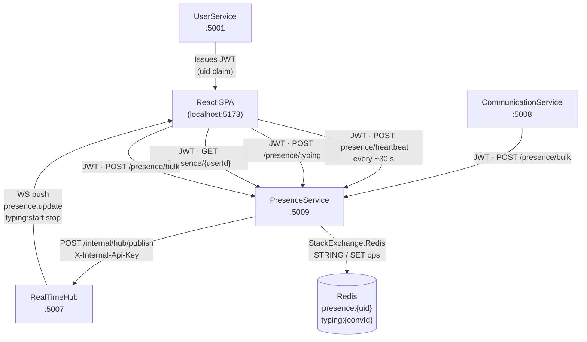
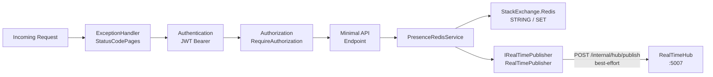
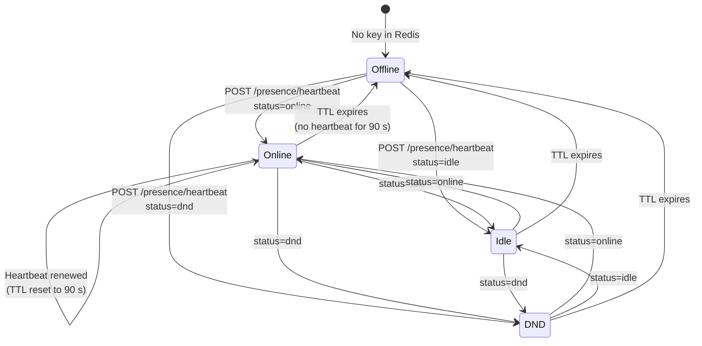
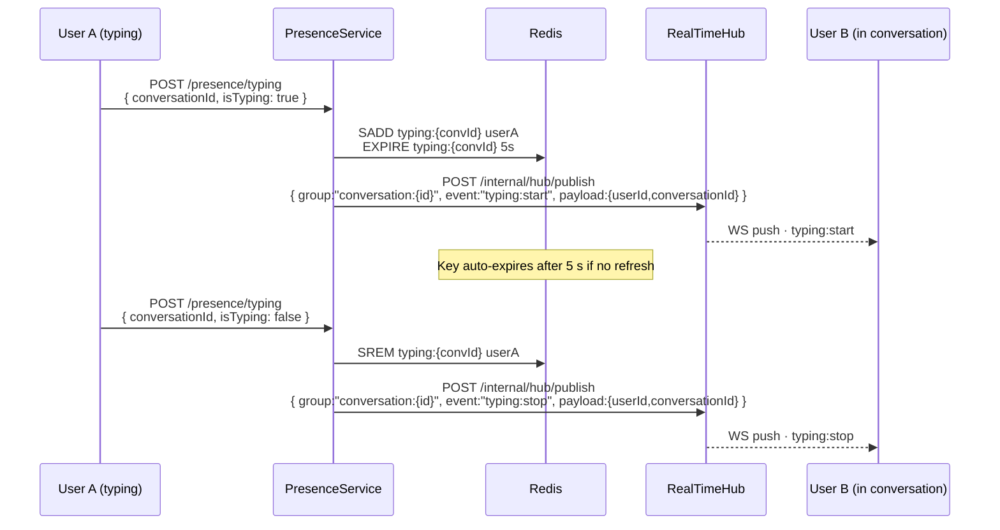
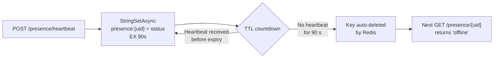
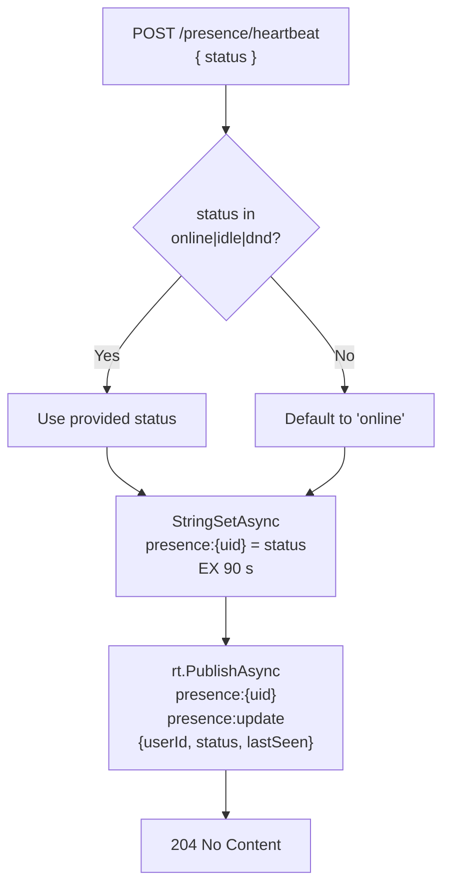

# PresenceService

> **Port:** 5009 &nbsp;|&nbsp; **Runtime:** ASP.NET Core (.NET 9) &nbsp;|&nbsp; **Database:** Redis (no SQL) &nbsp;|&nbsp; **Phase:** Cross-cutting — Real-time

## Overview

PresenceService is the **online-status and typing-indicator authority** for the SocialCommerce super-app. It owns:

- **Heartbeat-based presence** — Clients periodically call `POST /presence/heartbeat` to declare their status (`online`, `idle`, `dnd`). Each heartbeat writes a Redis string key with a 90-second TTL; a user whose key has expired is implicitly `offline`.
- **Single and bulk presence queries** — Callers can fetch the status and approximate last-seen time for one user or a batch of users in a single Redis pipeline round-trip.
- **Typing indicators** — `POST /presence/typing` maintains a short-lived Redis Set of typing users per conversation and pushes `typing:start` / `typing:stop` events to connected clients in real time.
- **Real-time push** — Every state change (heartbeat update, typing start/stop) is forwarded as a push event to RealTimeHub via `POST /internal/hub/publish`, targeting the appropriate `presence:` or `conversation:` group.
- **JWT Bearer auth** — All four endpoints require a valid HS256 JWT; the caller's `uid` claim is used to identify the acting user without an extra database lookup.
- **Stateless & schema-free** — No SQL database, no EF Core, no migrations. All state is ephemeral in Redis; the service is horizontally scalable behind any load balancer.

---

## Architecture

### Position in the Platform



### Request Pipeline



### Presence State Machine



### Typing Indicator Flow



---

## Project Structure

```
services/PresenceService/
├── PresenceService.csproj
├── Program.cs                         # Composition root — Redis, JWT auth, HttpClient, endpoints
├── Dockerfile                         # Multi-stage .NET 9 container build
├── appsettings.json
├── appsettings.Development.json
│
├── Auth/
│   └── JwtAuthExtensions.cs          # AddServiceJwtAuth — HS256 JWT Bearer, no audience check
│
├── Dtos/
│   └── PresenceDtos.cs               # HeartbeatRequest, BulkPresenceRequest, PresenceDto,
│                                     #   TypingRequest
│
├── Endpoints/
│   └── PresenceEndpoints.cs          # MapPresenceEndpoints — 4 minimal API routes under /presence
│
├── Services/
│   ├── IRealTimePublisher.cs         # Abstraction for fire-and-forget SignalR push
│   ├── RealTimePublisher.cs          # HTTP implementation — POST /internal/hub/publish
│   └── PresenceRedisService.cs       # All Redis reads/writes + real-time notifications
│
└── Properties/
    └── launchSettings.json           # Local dev profile — http://localhost:5009
```

---

## Redis Data Model

PresenceService uses two Redis data structures with no persistent schema.

### Key Patterns

| Key | Type | Value | TTL | Purpose |
|---|---|---|---|---|
| `presence:{userId}` | STRING | `"online"` \| `"idle"` \| `"dnd"` | **90 s** | Active presence; absence of key means `offline` |
| `typing:{conversationId}` | SET | `{userId, userId, …}` | **5 s** | Currently-typing users in a conversation |

### TTL Semantics



| Constant | Value | Reason |
|---|---|---|
| `HeartbeatTtl` | 90 seconds | Allows clients to miss 2–3 heartbeat cycles (typically every 30 s) before being marked offline |
| `TypingTtl` | 5 seconds | Auto-clears stale typing indicators if the client fails to send an explicit `isTyping: false` |

### `lastSeen` Approximation

`lastSeen` in `PresenceDto` is derived from the remaining TTL rather than stored separately:

```
lastSeen ≈ UtcNow + (remainingTtl − HeartbeatTtl)
         = UtcNow − (HeartbeatTtl − remainingTtl)
```

This gives the approximate time of the most recent heartbeat without requiring a separate write.

---

## Authentication & Authorization

| Aspect | Value |
|---|---|
| Scheme | JWT Bearer (`Authorization: Bearer <token>`) |
| Algorithm | HS256 (symmetric key) |
| Issuer | `SocialCommerce` |
| Audience validation | **Disabled** |
| Lifetime validation | Enabled; `ClockSkew = 30 s` |
| Key source | `Authentication:Jwt:SymmetricKey` (config) |
| User identity | `uid` claim parsed as `Guid`; required on mutating endpoints |

All four endpoints use `.RequireAuthorization()`. The `uid` claim is extracted from `HttpContext.User` by the `GetUserId` helper inside `PresenceEndpoints`; a missing claim throws `InvalidOperationException` (caught by the exception handler, returned as `500`).

---

## API Reference

All endpoints are registered as **Minimal API** routes under the `/presence` group (tag: `Presence`).

| Method | Path | Auth | Request Body | Response | Description |
|---|---|---|---|---|---|
| `POST` | `/presence/heartbeat` | JWT | `HeartbeatRequest` | `204 No Content` | Declare or renew the caller's online status; fires `presence:update` push |
| `POST` | `/presence/bulk` | JWT | `BulkPresenceRequest` | `200 PresenceDto[]` | Batch-fetch presence for a list of user IDs via a Redis pipeline |
| `GET` | `/presence/{userId}` | JWT | — | `200 PresenceDto` | Get presence for a single user |
| `POST` | `/presence/typing` | JWT | `TypingRequest` | `204 No Content` | Set or clear typing indicator; fires `typing:start` or `typing:stop` push |
| `GET` | `/health/live` | None | — | `200 OK` | Liveness probe |

### `POST /presence/heartbeat`

The caller's `uid` claim is used as the target user. The `status` field is validated against the allowed set; any unrecognised value silently defaults to `"online"`.



### `POST /presence/bulk`

Issues a Redis batch (`IBatch`) with one `StringGetWithExpiryAsync` per user ID and executes them in a single pipeline round-trip, regardless of list length.

### `POST /presence/typing`

`isTyping: true` → `SADD` + `EXPIRE` + push `typing:start`  
`isTyping: false` → `SREM` + push `typing:stop`

The typing Set's TTL is refreshed on every `SADD`, providing an automatic fallback cleanup if the client disconnects without sending `isTyping: false`.

---

## Data Transfer Objects

### `HeartbeatRequest`

```json
{ "status": "online" }
```

| Field | Type | Allowed Values | Default |
|---|---|---|---|
| `status` | `string` | `"online"`, `"idle"`, `"dnd"` | `"online"` (any other value) |

### `BulkPresenceRequest`

```json
{
  "userIds": [
    "3fa85f64-5717-4562-b3fc-2c963f66afa6",
    "9d4e1c2a-1234-5678-abcd-ef0123456789"
  ]
}
```

### `PresenceDto`

Returned by `GET /presence/{userId}` and each element of the `POST /presence/bulk` response array.

```json
{
  "userId": "3fa85f64-5717-4562-b3fc-2c963f66afa6",
  "status": "online",
  "lastSeen": "2025-01-15T12:34:56.789Z"
}
```

| Field | Type | Notes |
|---|---|---|
| `userId` | `Guid` | Target user |
| `status` | `string` | `"online"` \| `"idle"` \| `"dnd"` \| `"offline"` (absent key) |
| `lastSeen` | `DateTimeOffset` | Approximated from remaining TTL; UTC |

### `TypingRequest`

```json
{
  "conversationId": "3fa85f64-5717-4562-b3fc-2c963f66afa6",
  "isTyping": true
}
```

---

## Real-time Events

PresenceService publishes three distinct events to RealTimeHub. Delivery is best-effort: `RealTimePublisher.PublishAsync` wraps `HttpClient.SendAsync` in a try/catch and silently discards any exception.

| Event Name | Target Group | Trigger | Payload Fields |
|---|---|---|---|
| `presence:update` | `presence:{userId}` | `POST /presence/heartbeat` | `userId`, `status`, `lastSeen` |
| `typing:start` | `conversation:{conversationId}` | `POST /presence/typing` (`isTyping: true`) | `userId`, `conversationId` |
| `typing:stop` | `conversation:{conversationId}` | `POST /presence/typing` (`isTyping: false`) | `userId`, `conversationId` |

Clients must subscribe to the relevant groups on RealTimeHub (`SubscribePresence(userId)` for presence updates; `JoinConversation(id)` for typing indicators) to receive these events.

---

## Service Dependencies

### Outbound (PresenceService calls…)

| Dependency | Type | Config Key | Purpose |
|---|---|---|---|
| Redis | TCP (StackExchange.Redis 2.*) | `ConnectionStrings:Redis` | Presence and typing state storage |
| RealTimeHub | HTTP (`HttpClient`) | `RealTimeHub:BaseUrl` | Best-effort push of `presence:update`, `typing:start`, `typing:stop` |

### Inbound (…calls PresenceService)

| Caller | Endpoint | Purpose |
|---|---|---|
| React SPA / Browser | `POST /presence/heartbeat` | Periodic keep-alive (~every 30 s) |
| React SPA / Browser | `POST /presence/typing` | User typing in a chat conversation |
| React SPA / Browser | `GET /presence/{userId}` | Profile page presence badge |
| React SPA / Browser | `POST /presence/bulk` | Social feed or contact list presence display |
| CommunicationService | `POST /presence/bulk` | Enrich conversation participant list with presence |

---

## Configuration

### `appsettings.json` Keys

| Key | Required | Description |
|---|---|---|
| `ConnectionStrings:Redis` | **Yes** | StackExchange.Redis connection string |
| `Authentication:Jwt:Issuer` | No | JWT issuer; defaults to `SocialCommerce` |
| `Authentication:Jwt:SymmetricKey` | **Yes** | Shared HS256 signing key (≥ 32 bytes) |
| `RealTimeHub:BaseUrl` | No | Base URL of RealTimeHub; defaults to `http://localhost:5007` |
| `Internal:ApiKey` | **Yes** | Shared secret forwarded as `X-Internal-Api-Key` to RealTimeHub |

### `appsettings.Development.json` Defaults

| Key | Development Value |
|---|---|
| `ConnectionStrings:Redis` | `localhost:6379` |
| `Authentication:Jwt:Issuer` | `SocialCommerce` |
| `Authentication:Jwt:SymmetricKey` | `sc-dev-secret-key-min-32-bytes-long!!` |
| `RealTimeHub:BaseUrl` | `http://localhost:5007` |
| `Internal:ApiKey` | `sc-dev-internal-api-key` |

---

## Containerization

### Dockerfile Stages

| Stage | Base Image | Purpose |
|---|---|---|
| `base` | `mcr.microsoft.com/dotnet/aspnet:9.0` | Final runtime layer; exposes port `8080` |
| `build` | `mcr.microsoft.com/dotnet/sdk:9.0` | Restores packages and compiles |
| `publish` | *(from build)* | Runs `dotnet publish` in Release mode |
| `final` | *(from base)* | Copies published output; sets `ENTRYPOINT` |

The `Dockerfile` uses the **service directory** as its build context (`build: ./services/PresenceService`), so `COPY ["PresenceService.csproj", "."]` resolves correctly. PresenceService has no dependency on `shared/Contracts`.

### `docker-compose.yml` Service Entry

```yaml
presenceservice:
  build: ./services/PresenceService
  environment:
    ASPNETCORE_URLS: http://+:8080
    ASPNETCORE_ENVIRONMENT: Development
    Authentication__Jwt__Issuer: "SocialCommerce"
    Authentication__Jwt__SymmetricKey: "sc-dev-secret-key-min-32-bytes-long!!"
    ConnectionStrings__Redis: "redis:6379,abortConnect=false"
    RealTimeHub__BaseUrl: "http://realtimehub:8080"
    Internal__ApiKey: "sc-dev-internal-api-key"
  ports:
    - "5009:8080"
  depends_on:
    - redis
    - realtimehub
```

---

## Key Design Decisions

| Decision | Rationale |
|---|---|
| **Redis STRING for presence (TTL-based offline)** | Avoids an explicit "go offline" write path. A missed heartbeat is indistinguishable from a clean logout, which simplifies client reconnect logic and handles abrupt disconnects (browser tab closed, network drop) identically. |
| **90-second heartbeat TTL** | Tolerates 2–3 missed client heartbeat cycles (typical interval 30 s) before marking the user offline, preventing transient network blips from toggling the presence badge. |
| **Redis SET for typing with 5-second TTL** | Allows multiple users to type simultaneously in the same conversation. The short TTL provides automatic cleanup without a dedicated "stop typing" message from the server, making the indicator resilient to sudden disconnects. |
| **`lastSeen` derived from remaining TTL** | Eliminates a separate `LastSeen` write on each heartbeat. The approximation is accurate to within one heartbeat interval, which is sufficient for a "last active X minutes ago" display. |
| **Redis pipeline (`IBatch`) for bulk queries** | All presence lookups in a bulk request are batched into a single Redis round-trip, keeping latency constant regardless of the number of requested user IDs. |
| **Best-effort RealTimeHub push** | `IRealTimePublisher` wraps exceptions so a SignalR delivery failure never fails the API response. Presence and typing events are low-stakes and self-correcting (next heartbeat re-establishes truth); guaranteed delivery would add unnecessary complexity. |
| **Minimal API (no controllers)** | The four endpoints have no shared middleware or complex routing; Minimal API avoids the controller/action overhead and keeps the routing surface explicit in one file. |
| **`uid` claim for user identity** | Consistent with every other service in the platform. The `uid` claim is resolved directly from the JWT without a round-trip to UserService, keeping each presence operation to a single external call (Redis). |
