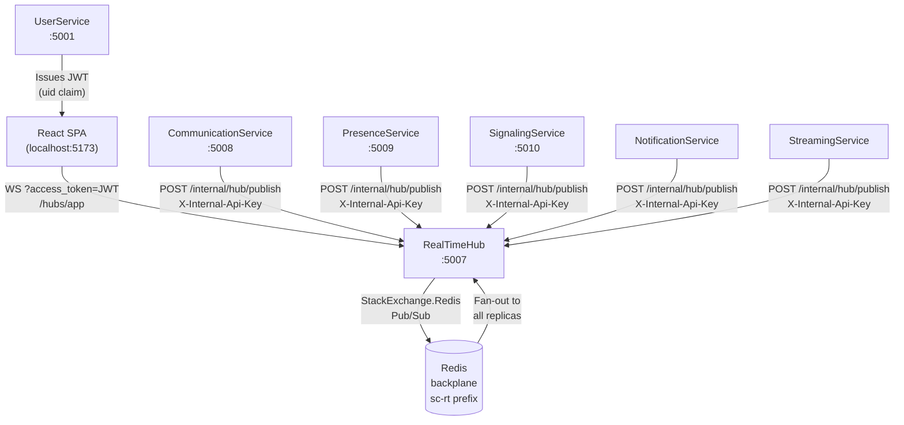
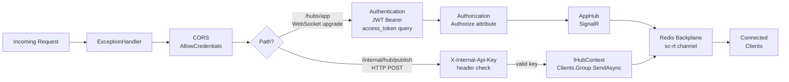
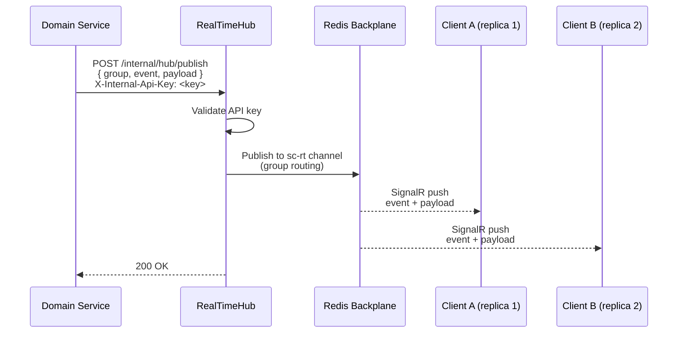
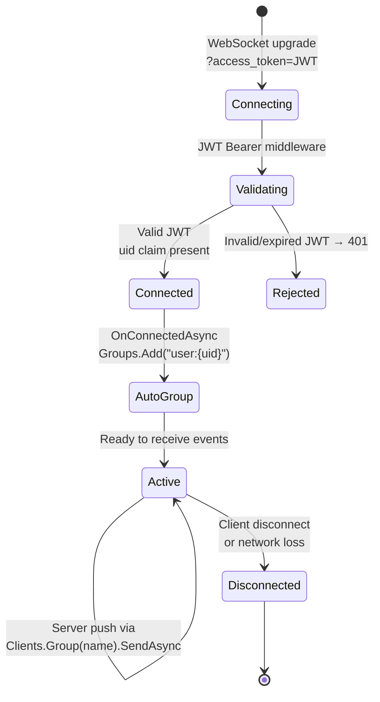
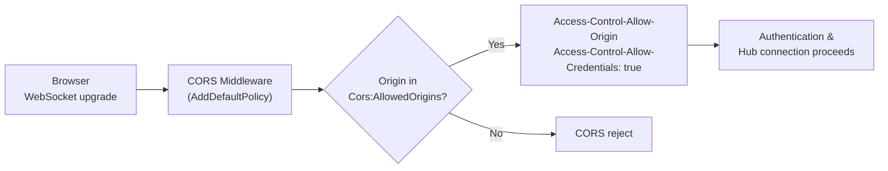

# RealTimeHub

> **Port:** 5007 &nbsp;|&nbsp; **Runtime:** ASP.NET Core (.NET 9) &nbsp;|&nbsp; **Database:** None (stateless) &nbsp;|&nbsp; **Phase:** 0 — Foundations

## Overview

RealTimeHub is the **centralised real-time fan-out relay** for the SocialCommerce super-app. It owns:

- **SignalR hub** — A single `AppHub` at `/hubs/app` provides full-duplex, event-driven communication to browser clients over WebSocket (with Server-Sent Events / long-poll fallback).
- **Named-group routing** — Clients self-subscribe to typed group channels (`user:`, `conversation:`, `theater:`, `presence:`, `feed:`) by calling hub methods, enabling targeted delivery without per-client routing logic in domain services.
- **Internal publish API** — `POST /internal/hub/publish` accepts a group name, event name, and JSON payload from any trusted domain service and fans the message out to all group members via `IHubContext<AppHub>`.
- **Redis backplane** — `Microsoft.AspNetCore.SignalR.StackExchangeRedis` with channel prefix `sc-rt` synchronises connection state across multiple RealTimeHub replicas, enabling horizontal scale-out.
- **JWT Bearer auth (query-string mode)** — Clients authenticate via `?access_token=<jwt>` on the WebSocket upgrade request (browser SignalR transport requirement). The `uid` claim is mapped to the SignalR user identifier via a custom `IUserIdProvider`.
- **Stateless** — No database, no EF Core, no persistent storage. All connection and group state is held in-process and synchronised through Redis.

---

## Architecture

### Position in the Platform



### Request Pipeline



### Publish Flow (Domain Service → Client)



### Connection Lifecycle



---

## Project Structure

```
services/RealTimeHub/
├── RealTimeHub.csproj
├── Program.cs                         # Composition root — SignalR, Redis, CORS, auth, routes
├── Dockerfile                         # Multi-stage .NET 9 container build
├── appsettings.json
├── appsettings.Development.json
│
├── Auth/
│   └── JwtAuthExtensions.cs          # AddHubJwtAuth — HS256 JWT, query-string token extraction
│
├── Endpoints/
│   └── InternalEndpoints.cs          # POST /internal/hub/publish — API-key-guarded fan-out
│
├── Hubs/
│   ├── AppHub.cs                     # SignalR hub — group management methods
│   └── UidUserIdProvider.cs          # IUserIdProvider — maps "uid" claim → SignalR user ID
│
├── Models/
│   └── PublishRequest.cs             # PublishRequest record — Group, Event, Payload
│
└── Properties/
    └── launchSettings.json           # Local dev profile — http://localhost:5007
```

---

## Hub: `AppHub`

`AppHub` is the sole SignalR hub. It is decorated with `[Authorize]`, requiring a valid JWT on every connection. The hub exposes no server-to-client methods directly — all server pushes are initiated via the internal API using `IHubContext<AppHub>`.

### Client-Callable Hub Methods

| Method | Group Pattern | Direction | Description |
|---|---|---|---|
| *(auto on connect)* | `user:{uid}` | Server → Client | On connection, the server adds the client to its personal user group using the `uid` claim. |
| `JoinConversation(id)` | `conversation:{id}` | Client → Server | Subscribe to messaging events for a specific conversation. |
| `LeaveConversation(id)` | `conversation:{id}` | Client → Server | Unsubscribe from a conversation. |
| `JoinTheater(id)` | `theater:{id}` | Client → Server | Subscribe to live-streaming events for a theater. |
| `LeaveTheater(id)` | `theater:{id}` | Client → Server | Unsubscribe from a theater. |
| `SubscribePresence(userId)` | `presence:{userId}` | Client → Server | Subscribe to online/offline presence changes for another user. |
| `UnsubscribePresence(userId)` | `presence:{userId}` | Client → Server | Unsubscribe from a user's presence channel. |
| `JoinFeed(userId)` | `feed:{userId}` | Client → Server | Subscribe to social feed update events (typically the authenticated user's own feed). |

### Group Name Conventions

| Prefix | Full Pattern | Populated By | Consumer(s) |
|---|---|---|---|
| `user:` | `user:{uid}` | `OnConnectedAsync` (auto) | NotificationService, CommunicationService |
| `conversation:` | `conversation:{conversationId}` | Client calls `JoinConversation` | CommunicationService |
| `theater:` | `theater:{theaterId}` | Client calls `JoinTheater` | StreamingService |
| `presence:` | `presence:{userId}` | Client calls `SubscribePresence` | PresenceService |
| `feed:` | `feed:{userId}` | Client calls `JoinFeed` | FeedService / SocialContentService |

---

## Internal Publish API

### `POST /internal/hub/publish`

This endpoint is the **only write surface** for domain services. It is not protected by JWT — instead it uses a shared static API key passed in the `X-Internal-Api-Key` request header.

#### Request

| Field | Type | Description |
|---|---|---|
| `group` | `string` | Target group name (e.g., `user:abc123`, `conversation:xyz`) |
| `event` | `string` | SignalR event name; received by the client as the method name |
| `payload` | `JsonElement` | Arbitrary JSON payload forwarded verbatim to all group members |

```json
{
  "group": "user:3fa85f64-5717-4562-b3fc-2c963f66afa6",
  "event": "notification",
  "payload": {
    "type": "follow",
    "actorId": "9d4e1c2a-...",
    "message": "Alice started following you"
  }
}
```

#### Response Codes

| Code | Condition |
|---|---|
| `200 OK` | Message dispatched to group (delivery is best-effort) |
| `401 Unauthorized` | `X-Internal-Api-Key` header is missing or does not match |

> **Best-effort delivery**: `SendAsync` is fire-and-forget from the caller's perspective. If no clients are in the target group at the time of the call, the event is silently dropped. Domain services that call this API (via their local `RealTimePublisher`) swallow exceptions so real-time failures never block a primary write path.

---

## Authentication & Authorization

### Client (WebSocket) Authentication

| Aspect | Value |
|---|---|
| Scheme | JWT Bearer (`?access_token=<token>` query string) |
| Algorithm | HS256 (symmetric key) |
| Issuer | `SocialCommerce` |
| Audience validation | **Disabled** |
| Lifetime validation | Enabled; `ClockSkew = 30 s` |
| Key source | `Authentication:Jwt:SymmetricKey` (config) |
| User ID mapping | `uid` claim → `IUserIdProvider` → `Clients.User(userId)` |

The `OnMessageReceived` event in `JwtBearerEvents` extracts the token from `?access_token=` when the request path starts with `/hubs`. This is required because browsers cannot set custom `Authorization` headers during a WebSocket upgrade.

### Internal API Authentication

| Aspect | Value |
|---|---|
| Scheme | Static shared secret (`X-Internal-Api-Key` header) |
| Key source | `Internal:ApiKey` (config) |
| Scope | `/internal/*` routes only |
| Failure response | `401 Unauthorized` |

The internal API intentionally does **not** use JWT. Domain services on the same Docker network call it directly without needing to obtain a token, which simplifies service-to-service wiring for fire-and-forget push operations.

---

## Redis Backplane

RealTimeHub uses `Microsoft.AspNetCore.SignalR.StackExchangeRedis` to synchronise hub state across multiple instances.

| Property | Value |
|---|---|
| Package | `Microsoft.AspNetCore.SignalR.StackExchangeRedis` 9.* |
| Channel prefix | `sc-rt` (literal, no pattern expansion) |
| Connection | `Redis:Connection` config key |
| Dev default | `redis:6379,abortConnect=false` |
| Scale-out | Multiple RealTimeHub replicas share group membership via Redis Pub/Sub |

When `IHubContext<AppHub>.Clients.Group(...).SendAsync(...)` is called, SignalR serialises the message and publishes it to Redis. Every other replica subscribed to that channel receives the message and forwards it to locally connected clients in the named group.

---

## CORS



| CORS Setting | Value |
|---|---|
| Allowed origins (default) | `http://localhost:5173`, `http://localhost:3000` |
| `AllowAnyHeader` | ✓ |
| `AllowAnyMethod` | ✓ |
| `AllowCredentials` | ✓ (required for SignalR WebSocket) |
| Config key | `Cors:AllowedOrigins` (string array) |

`AllowCredentials()` is mandatory for SignalR connections when `withCredentials: true` is set by the JavaScript client.

---

## Models

### `PublishRequest`

The sole model used by the internal endpoint.

```csharp
public sealed record PublishRequest(
    string Group,
    string Event,
    JsonElement Payload
);
```

| Field | Type | Notes |
|---|---|---|
| `Group` | `string` | Must match an existing SignalR group; no validation — unknown groups silently drop |
| `Event` | `string` | SignalR method name received by the client |
| `Payload` | `JsonElement` | Raw JSON — forwarded as-is; structure is event-type-specific |

---

## Service Dependencies

### Outbound (RealTimeHub calls…)

RealTimeHub has **no outbound HTTP or message-bus dependencies**. Its only external dependency is Redis for the backplane.

| Dependency | Type | Purpose |
|---|---|---|
| Redis | TCP (StackExchange.Redis) | SignalR backplane for multi-replica fan-out |

### Inbound (…calls RealTimeHub)

| Caller | Method | Group Pattern(s) Used |
|---|---|---|
| CommunicationService (:5008) | `POST /internal/hub/publish` | `user:{uid}`, `conversation:{id}` |
| PresenceService (:5009) | `POST /internal/hub/publish` | `presence:{uid}` |
| SignalingService (:5010) | `POST /internal/hub/publish` | `user:{uid}` (call events) |
| NotificationService | `POST /internal/hub/publish` | `user:{uid}` |
| StreamingService | `POST /internal/hub/publish` | `theater:{id}` |
| React SPA / Browser | WebSocket `/hubs/app` | *(connects and self-subscribes to groups)* |

---

## Configuration

### `appsettings.json` Keys

| Key | Required | Description |
|---|---|---|
| `Authentication:Jwt:Issuer` | No | JWT issuer; defaults to `SocialCommerce` |
| `Authentication:Jwt:SymmetricKey` | **Yes** | Shared HS256 signing key (≥ 32 bytes) |
| `Redis:Connection` | No | Redis connection string; defaults to `localhost:6379,abortConnect=false` |
| `Internal:ApiKey` | **Yes** | Shared secret for `X-Internal-Api-Key` header on the publish endpoint |
| `Cors:AllowedOrigins` | No | JSON string array of allowed browser origins; defaults to `["http://localhost:5173","http://localhost:3000"]` |

### `appsettings.Development.json` Defaults

| Key | Development Value |
|---|---|
| `Authentication:Jwt:Issuer` | `SocialCommerce` |
| `Authentication:Jwt:SymmetricKey` | `sc-dev-secret-key-min-32-bytes-long!!` |
| `Redis:Connection` | `redis:6379,abortConnect=false` |
| `Internal:ApiKey` | `sc-dev-internal-api-key` |

---

## Containerization

### Dockerfile Stages

| Stage | Base Image | Purpose |
|---|---|---|
| `base` | `mcr.microsoft.com/dotnet/aspnet:9.0` | Final runtime layer; exposes port `8080` |
| `build` | `mcr.microsoft.com/dotnet/sdk:9.0` | Restores NuGet packages and compiles |
| `publish` | *(from build)* | Runs `dotnet publish` in Release mode |
| `final` | *(from base)* | Copies published output; sets `ENTRYPOINT` |

> The `Dockerfile` uses the service directory as its build context (`build: ./services/RealTimeHub` in `docker-compose.yml`), so `COPY ["RealTimeHub.csproj", "."]` resolves correctly without a `shared/Contracts` reference path.

### `docker-compose.yml` Service Entry

```yaml
realtimehub:
  build: ./services/RealTimeHub
  environment:
    ASPNETCORE_URLS: http://+:8080
    ASPNETCORE_ENVIRONMENT: Development
    Authentication__Jwt__Issuer: "SocialCommerce"
    Authentication__Jwt__SymmetricKey: "sc-dev-secret-key-min-32-bytes-long!!"
    Redis__Connection: "redis:6379,abortConnect=false"
    Internal__ApiKey: "sc-dev-internal-api-key"
  ports:
    - "5007:8080"
  depends_on:
    - redis
```

Services that call RealTimeHub declare it as a dependency:

```yaml
communicationservice:
  environment:
    RealTimeHub__BaseUrl: "http://realtimehub:8080"
    Internal__ApiKey: "sc-dev-internal-api-key"
  depends_on:
    realtimehub:
      condition: service_started
```

---

## Key Design Decisions

| Decision | Rationale |
|---|---|
| **Single hub (`AppHub`)** | One hub with named groups covers all real-time channels (user, conversation, theater, presence, feed) without the overhead of multiple hub classes and separate WebSocket connections per concern. |
| **`uid` claim as SignalR user ID** | Consistent with all other services in the platform; `Clients.User(uid)` can target all connections for a user (e.g., multiple browser tabs) without application-level session tracking. |
| **Query-string token (`?access_token=`)** | The WebSocket upgrade handshake in browsers cannot carry custom headers, so JWT must travel in the URL. The `OnMessageReceived` hook moves it into the `Authorization` context before validation. |
| **Static API key for internal endpoint** | Domain services call `/internal/hub/publish` as a fire-and-forget side effect of their primary write operations. Using a static key avoids token acquisition overhead and circular dependencies (e.g., a service calling UserService for a JWT before pushing a notification). |
| **Redis backplane with `sc-rt` prefix** | Channel prefix isolation prevents cross-contamination if the same Redis instance is shared with other services (e.g., PresenceService, AnalyticsService). Allows safe horizontal scale-out of RealTimeHub without sticky sessions. |
| **Best-effort delivery** | SignalR push is not a reliable message bus. Callers (domain services) wrap `POST /internal/hub/publish` in try/catch and swallow exceptions so a SignalR failure never rolls back a database transaction. Persistent notifications should additionally be stored in a database (NotificationService concern). |
| **No database** | RealTimeHub is intentionally stateless. Durability and history are the responsibility of the originating domain service. This keeps the hub horizontally scalable with minimal operational footprint. |
| **CORS `AllowCredentials`** | Required by the browser SignalR client when the hub origin differs from the SPA origin (cross-origin WebSocket with cookies / credentials). Paired with an explicit `WithOrigins` list to avoid the `AllowAnyOrigin` + `AllowCredentials` conflict. |
