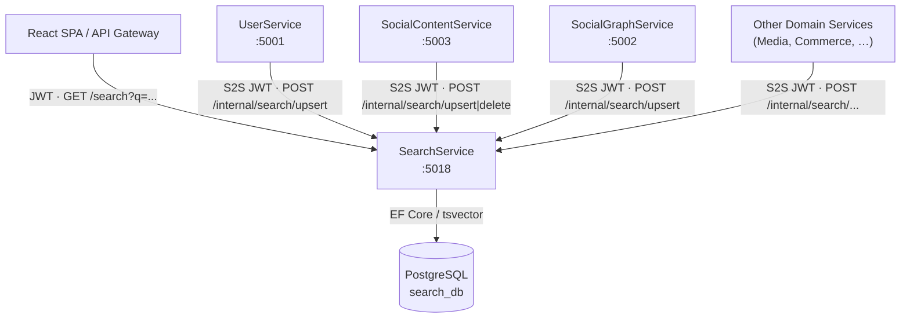
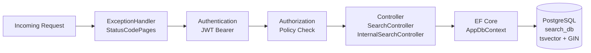
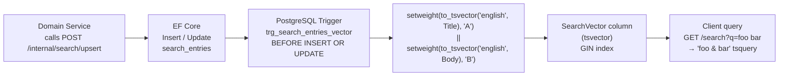
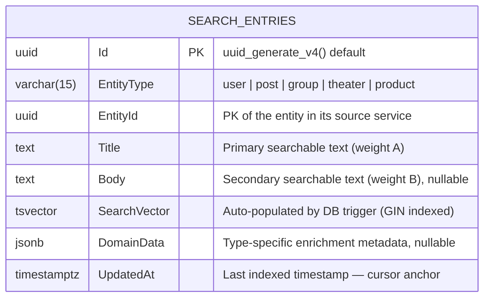
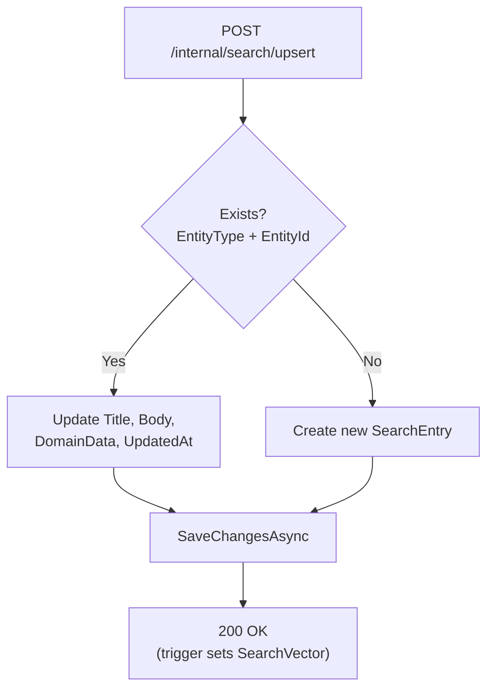
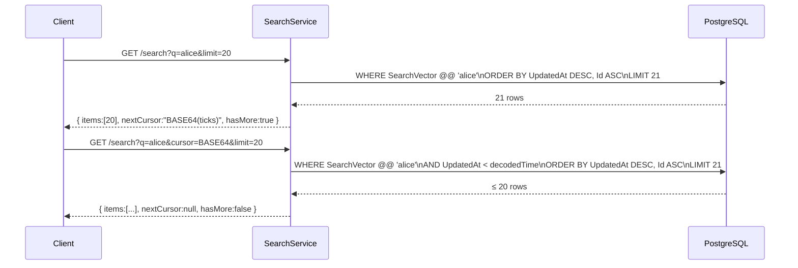
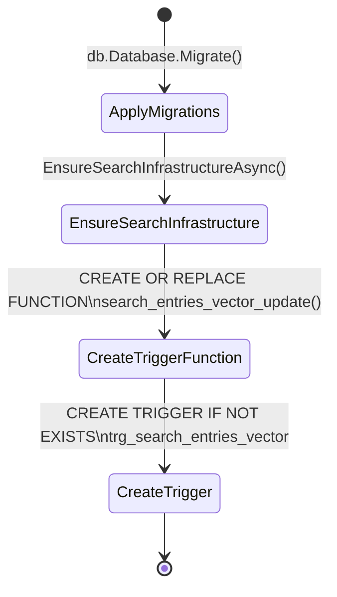

# SearchService

> **Port:** 5018 &nbsp;|&nbsp; **Runtime:** ASP.NET Core (.NET 9) &nbsp;|&nbsp; **Database:** PostgreSQL (`search_db`) &nbsp;|&nbsp; **Phase:** Cross-cutting — Search

## Overview

SearchService is the **unified full-text search index** for the SocialCommerce super-app. It owns:

- **Unified search index** — A single `search_entries` table stores searchable representations of every entity type in the platform (users, posts, groups, theaters, products).
- **PostgreSQL full-text search** — Entries are indexed via a `tsvector` column auto-populated by a database trigger using the `english` text-search configuration. A GIN index enables sub-millisecond query evaluation.
- **Type-scoped queries** — Callers can search all entity types at once or scope to a specific type (`user`, `post`, `group`, `theater`, `product`) via dedicated shortcut routes.
- **Internal index maintenance API** — Domain services upsert or delete their own entries via a JWT-protected internal API, keeping the index eventually consistent.
- **Cursor-based pagination** — Results are paginated using a Base64-encoded `UpdatedAt` timestamp cursor, ordered newest-indexed first.
- **No event publishing** — SearchService is a passive consumer; it receives write commands from domain services rather than subscribing to the message bus.

---

## Architecture

### Position in the Platform



### Request Pipeline



### Full-Text Search Pipeline



---

## Project Structure

```
services/SearchService/
├── SearchService.csproj
├── Program.cs                          # Composition root — DI, auth, middleware, auto-migrate
├── appsettings.json
├── appsettings.Development.json
│
├── Auth/
│   └── JwtAuthExtensions.cs           # AddServiceJwtAuth — HS256 JWT Bearer, no audience check
│
├── Controllers/
│   ├── SearchController.cs            # /search — public full-text search (JWT required)
│   └── InternalSearchController.cs    # /internal/search — S2S index maintenance (JWT required)
│
├── Data/
│   ├── AppDbContext.cs                # EF Core DbContext; tsvector trigger setup
│   └── Entities.cs                    # SearchEntry entity
│
├── Dtos/
│   └── SearchDtos.cs                  # PagedResult<T>, SearchResultDto, UpsertSearchEntryDto,
│                                      #   DeleteSearchEntryDto, SearchRequest
│
└── Properties/
    └── launchSettings.json            # Local dev profile — http://localhost:5018
```

---

## Data Model

### ER Diagram



### `search_entries` Column Reference

| Column | Type | Nullable | Default | Notes |
|---|---|---|---|---|
| `Id` | `uuid` | No | `uuid_generate_v4()` | Surrogate PK |
| `EntityType` | `varchar(15)` | No | — | Discriminator: `user`, `post`, `group`, `theater`, `product` |
| `EntityId` | `uuid` | No | — | PK of the entity in its origin service |
| `Title` | `text` | No | — | Primary search field; weight **A** in tsvector |
| `Body` | `text` | Yes | `NULL` | Secondary field; weight **B** in tsvector |
| `SearchVector` | `tsvector` | No | trigger | Auto-set before insert/update; GIN indexed |
| `DomainData` | `jsonb` | Yes | `NULL` | Enrichment payload (e.g., `avatarUrl`, `price`, `memberCount`) |
| `UpdatedAt` | `timestamptz` | No | — | Set by upsert logic; used as cursor anchor |

### Indexes

| Index | Columns | Type | Purpose |
|---|---|---|---|
| PK | `Id` | B-tree | Row identity |
| `UQ_entity` | `(EntityType, EntityId)` | B-tree (unique) | Enforces one entry per entity; used by upsert lookup |
| `IX_entity_type` | `EntityType` | B-tree | Fast type-scoped filtering |
| `IX_updated_at` | `UpdatedAt` | B-tree | Cursor pagination ordering |
| `IX_search_vector` | `SearchVector` | **GIN** | Full-text query acceleration |

---

## Full-Text Search Infrastructure

### Trigger Function

The `tsvector` column is maintained entirely by the database. No application code computes the vector.

```sql
-- Trigger function (created via EnsureSearchInfrastructureAsync on dev startup)
CREATE OR REPLACE FUNCTION search_entries_vector_update() RETURNS trigger AS $$
BEGIN
    NEW."SearchVector" :=
        setweight(to_tsvector('english', coalesce(NEW."Title", '')), 'A') ||
        setweight(to_tsvector('english', coalesce(NEW."Body", '')), 'B');
    RETURN NEW;
END;
$$ LANGUAGE plpgsql;

CREATE TRIGGER trg_search_entries_vector
    BEFORE INSERT OR UPDATE ON search_entries
    FOR EACH ROW EXECUTE FUNCTION search_entries_vector_update();
```

### Weighting Strategy

| Field | Weight | Relevance |
|---|---|---|
| `Title` | **A** (highest) | Name, display title, product title |
| `Body` | **B** | Description, post body, biography |

### Query Construction

User input is split on whitespace and joined with the PostgreSQL `&` (AND) operator before being passed to `to_tsquery`:

```
"hello world" → "hello & world"
```

All terms must appear in the document for a row to match. Prefix wildcards (`:*`) are not currently applied; this is noted as a Phase 8 enhancement (see [Key Design Decisions](#key-design-decisions)).

---

## Authentication & Authorization

### Scheme

| Aspect | Value |
|---|---|
| Scheme | JWT Bearer (`Authorization: Bearer <token>`) |
| Algorithm | HS256 (symmetric key) |
| Issuer | `SocialCommerce` |
| Audience validation | **Disabled** |
| Lifetime validation | Enabled; `ClockSkew = 30 s` |
| Key source | `Authentication:Jwt:SymmetricKey` (config) |

The same shared symmetric key is used across all SocialCommerce services, enabling any service to present a valid token to the internal API without a separate exchange.

Both the public `SearchController` and the internal `InternalSearchController` use `[Authorize]` with the default Bearer scheme. There is no scope or role differentiation — holding a valid JWT is sufficient for both read and write operations. Production hardening (scope-based policies for the internal API) is a noted design decision.

---

## API Reference

### `SearchController` — `/search`

All endpoints require a valid JWT (`Authorization: Bearer <token>`). Results are paginated using the cursor model described in [Cursor Pagination](#cursor-pagination). The `limit` parameter is clamped to `[1, 50]` with a default of `20`.

#### Unified Search

| Method | Path | Query Params | Response |
|---|---|---|---|
| `GET` | `/search` | `q`\* `type` `cursor` `limit` | `PagedResult<SearchResultDto>` |

When `type` is omitted, results span all entity types. When provided, it filters to a single type.

#### Type-Scoped Shortcuts

All shortcuts accept `q`\*, `cursor`, and `limit`. They delegate to the same internal `ExecuteSearch` method with the type pre-set.

| Method | Path | Implicit `type` |
|---|---|---|
| `GET` | `/search/users` | `user` |
| `GET` | `/search/posts` | `post` |
| `GET` | `/search/groups` | `group` |
| `GET` | `/search/theaters` | `theater` |
| `GET` | `/search/products` | `product` |

#### Query Parameter Reference

| Parameter | Required | Type | Description |
|---|---|---|---|
| `q` | **Yes** | `string` | Search query; blank returns `400 Bad Request` |
| `type` | No | `string` | Filter by entity type (unified endpoint only) |
| `cursor` | No | `string` | Opaque Base64 cursor returned by a previous response |
| `limit` | No | `int` | Page size (1–50, default `20`) |

#### Response Codes

| Code | Condition |
|---|---|
| `200 OK` | Results found (may be empty array with `hasMore: false`) |
| `400 Bad Request` | `q` is missing or whitespace |
| `401 Unauthorized` | Missing or invalid JWT |

---

### `InternalSearchController` — `/internal/search`

Used exclusively by domain services to maintain the search index. Requires a valid JWT — typically issued by UserService for service-to-service calls.

| Method | Path | Body | Success | Error |
|---|---|---|---|---|
| `POST` | `/internal/search/upsert` | `UpsertSearchEntryDto` | `200 OK` | `401` |
| `POST` | `/internal/search/delete` | `DeleteSearchEntryDto` | `200 OK` | `404 Not Found` / `401` |

#### `POST /internal/search/upsert` — Upsert Logic



#### `POST /internal/search/delete`

Executes a bulk `DELETE` via `ExecuteDeleteAsync`. Returns `404 Not Found` if no matching `(EntityType, EntityId)` row exists.

---

## Data Transfer Objects

### `SearchResultDto`

Returned by all `GET /search*` endpoints as elements of `PagedResult<SearchResultDto>`.

```json
{
  "entityType": "post",
  "entityId": "3fa85f64-5717-4562-b3fc-2c963f66afa6",
  "title": "My first post",
  "body": "This is the content of the post…",
  "domainData": "{\"authorHandle\":\"alice\",\"likeCount\":42}",
  "updatedAt": "2025-01-15T12:34:56.789Z"
}
```

| Field | Type | Notes |
|---|---|---|
| `entityType` | `string` | `user` \| `post` \| `group` \| `theater` \| `product` |
| `entityId` | `Guid` | PK in the origin service |
| `title` | `string` | Primary text (name, title) |
| `body` | `string?` | Secondary text (description, excerpt), may be `null` |
| `domainData` | `string?` | Raw JSONB string with enrichment data; structure is entity-type-specific |
| `updatedAt` | `DateTimeOffset` | ISO-8601 UTC timestamp; serves as cursor anchor |

### `PagedResult<T>`

```json
{
  "items": [ /* array of SearchResultDto */ ],
  "nextCursor": "MTczNjk0NjA5NjAwMDAwMDA=",
  "hasMore": true
}
```

| Field | Type | Notes |
|---|---|---|
| `items` | `T[]` | Up to `limit` results |
| `nextCursor` | `string?` | Base64 cursor; `null` when on the last page |
| `hasMore` | `bool` | `true` if more results exist beyond this page |

### `UpsertSearchEntryDto`

```json
{
  "entityType": "user",
  "entityId": "3fa85f64-5717-4562-b3fc-2c963f66afa6",
  "title": "Alice Smith",
  "body": "Fashion lover and tech enthusiast",
  "domainData": "{\"avatarUrl\":\"/avatars/alice.jpg\",\"followerCount\":128}"
}
```

| Field | Type | Notes |
|---|---|---|
| `entityType` | `string` | Must be one of the recognised entity types |
| `entityId` | `Guid` | Must be stable across upserts for the same entity |
| `title` | `string` | Required; weight-A search field |
| `body` | `string?` | Optional; weight-B search field |
| `domainData` | `string?` | Optional; raw JSON string stored as JSONB |

### `DeleteSearchEntryDto`

```json
{
  "entityType": "post",
  "entityId": "3fa85f64-5717-4562-b3fc-2c963f66afa6"
}
```

---

## Cursor Pagination

### Design

Results are ordered by `UpdatedAt DESC, Id ASC`. The cursor encodes the `UtcTicks` of the last result's `UpdatedAt` as a Base64-encoded UTF-8 string. On the next page request, results are filtered to `UpdatedAt < decodedTime`.



### Cursor Encoding

```
encode : Base64( UTF-8( updatedAt.UtcTicks.ToString() ) )
decode : new DateTimeOffset( long.Parse( UTF-8( Base64.Decode(cursor) ) ), TimeSpan.Zero )
```

| Property | Value |
|---|---|
| Field encoded | `UpdatedAt.UtcTicks` (100-nanosecond intervals since 0001-01-01) |
| Direction | `UpdatedAt DESC` (most recently indexed first) |
| Tie-break | `Id ASC` |
| Max page size | 50 |
| Last-page signal | `nextCursor == null && hasMore == false` |

---

## Service Dependencies

### Outbound (SearchService calls…)

SearchService has **no outbound HTTP or message-bus dependencies**. It is a pure data store with a query API.

### Inbound (…calls SearchService)

| Caller | Endpoint | Trigger |
|---|---|---|
| UserService | `POST /internal/search/upsert` | Profile created / updated |
| SocialContentService | `POST /internal/search/upsert` | Post / Group created or updated |
| SocialContentService | `POST /internal/search/delete` | Post / Group deleted |
| SocialGraphService | `POST /internal/search/upsert` | User profile propagation |
| Other domain services | `POST /internal/search/upsert|delete` | On entity lifecycle events |
| React SPA / API Gateway | `GET /search*` | User-initiated search |

---

## Configuration

### `appsettings.json` Keys

| Key | Required | Description |
|---|---|---|
| `ConnectionStrings:Default` | **Yes** | Npgsql connection string to `search_db` |
| `Authentication:Jwt:Issuer` | No | JWT issuer; defaults to `SocialCommerce` |
| `Authentication:Jwt:SymmetricKey` | **Yes** | Shared HS256 signing key (≥ 32 bytes) |

### `appsettings.Development.json` Defaults

| Key | Development Value |
|---|---|
| `ConnectionStrings:Default` | `Host=localhost;Port=5432;Database=search_db;Username=postgres;Password=1234;Include Error Detail=true;Ssl Mode=Disable` |
| `Authentication:Jwt:Issuer` | `SocialCommerce` |
| `Authentication:Jwt:SymmetricKey` | `sc-dev-secret-key-min-32-bytes-long!!` |

---

## Containerization

No `Dockerfile` is present in the repository for SearchService at this time. The recommended multi-stage build follows the pattern used by the other services in the solution:

```dockerfile
# Stage 1 — restore & build
FROM mcr.microsoft.com/dotnet/sdk:9.0 AS build
WORKDIR /src
COPY services/SearchService/SearchService.csproj services/SearchService/
RUN dotnet restore services/SearchService/SearchService.csproj
COPY services/SearchService/ services/SearchService/
RUN dotnet publish services/SearchService/SearchService.csproj -c Release -o /app/publish

# Stage 2 — runtime image
FROM mcr.microsoft.com/dotnet/aspnet:9.0
WORKDIR /app
COPY --from=build /app/publish .
ENTRYPOINT ["dotnet", "SearchService.dll"]
```

### Recommended `docker-compose.yml` Service Entry

SearchService has no `shared/Contracts` dependency, so `DockerfileContext` is the service directory itself.

```yaml
searchservice:
  build: ./services/SearchService
  environment:
    ASPNETCORE_URLS: http://+:8080
    ASPNETCORE_ENVIRONMENT: Development
    ConnectionStrings__Default: "Host=postgres;Port=5432;Database=search_db;Username=postgres;Password=1234;Include Error Detail=true;Ssl Mode=Disable"
    Authentication__Jwt__Issuer: "SocialCommerce"
    Authentication__Jwt__SymmetricKey: "sc-dev-secret-key-min-32-bytes-long!!"
  ports:
    - "5018:8080"
  depends_on:
    postgres:
      condition: service_healthy
```

---

## Database Setup

SearchService uses EF Core to manage the `search_entries` table schema. The `tsvector` trigger is provisioned separately because EF Core has no built-in migration support for PostgreSQL trigger objects.

### Startup Sequence (Development)



### EF Core Commands

```bash
# Add a new migration (from repo root)
dotnet ef migrations add <MigrationName> \
  --project services/SearchService \
  --startup-project services/SearchService

# Apply migrations manually
dotnet ef database update \
  --project services/SearchService \
  --startup-project services/SearchService
```

> **Note:** EF Core migrations handle table DDL only. The trigger function and trigger are idempotent SQL executed by `EnsureSearchInfrastructureAsync()` on every development startup. In production these should be applied via a separate migration or deployment script.

### `uuid-ossp` Extension

`AppDbContext.OnModelCreating` calls `model.HasPostgresExtension("uuid-ossp")` to ensure the extension is available for `uuid_generate_v4()` default values.

---

## Key Design Decisions

| Decision | Rationale |
|---|---|
| **Single unified index table** | Avoids per-entity-type search tables and allows cross-entity ranked results in a single query, simplifying the public API surface. |
| **PostgreSQL tsvector + GIN** | Leverages built-in FTS without adding an external search engine (Elasticsearch / Meilisearch) in early phases; planned for replacement/augmentation in Phase 8. |
| **DB trigger maintains `SearchVector`** | Decouples vector computation from application code; any `INSERT`/`UPDATE`—including direct SQL scripts—keeps the index current automatically. |
| **Weight A/B (Title/Body)** | Standard PostgreSQL weighting; `Title` matches rank higher than `Body` matches in future `ts_rank_cd` scoring. Currently results are ordered by `UpdatedAt` only. |
| **JSONB `DomainData` column** | Each entity type needs different enrichment fields for result display (e.g., `avatarUrl` for users, `price` for products). JSONB avoids schema changes when new entity types are introduced. |
| **No audience validation** | All SocialCommerce services share one issuer and symmetric key; audience is not meaningful in this intra-cluster topology. |
| **No scope/role differentiation on internal API** | Acceptable for initial phases; production hardening should add a `search.index` scope required on `/internal/search/*` to prevent end-user tokens from writing to the index. |
| **AND-only tsquery construction** | Conservative default ensuring high precision (all terms must match). Prefix matching (`term:*`) and OR/phrase support are Phase 8 backlog items. |
| **`ts_rank_cd` not yet applied** | Results ordered by `UpdatedAt DESC` rather than relevance rank; relevance ranking deferred to Phase 8 alongside optional Elasticsearch integration. |
| **Cursor anchored on `UpdatedAt`** | Unlike `CreatedAt`-cursored services, search results can change relative order as entities are re-indexed; `UpdatedAt` reflects the most recent index state and provides a stable forward-only cursor. |
