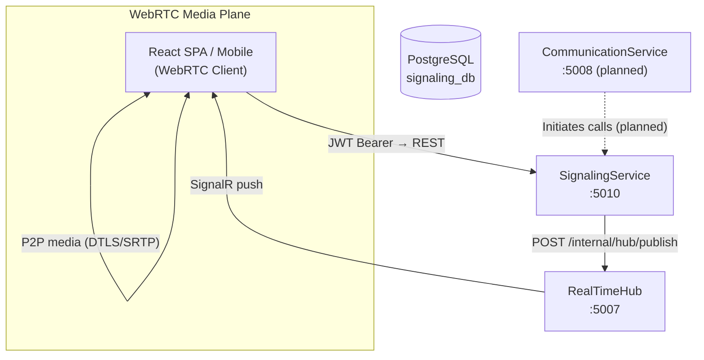
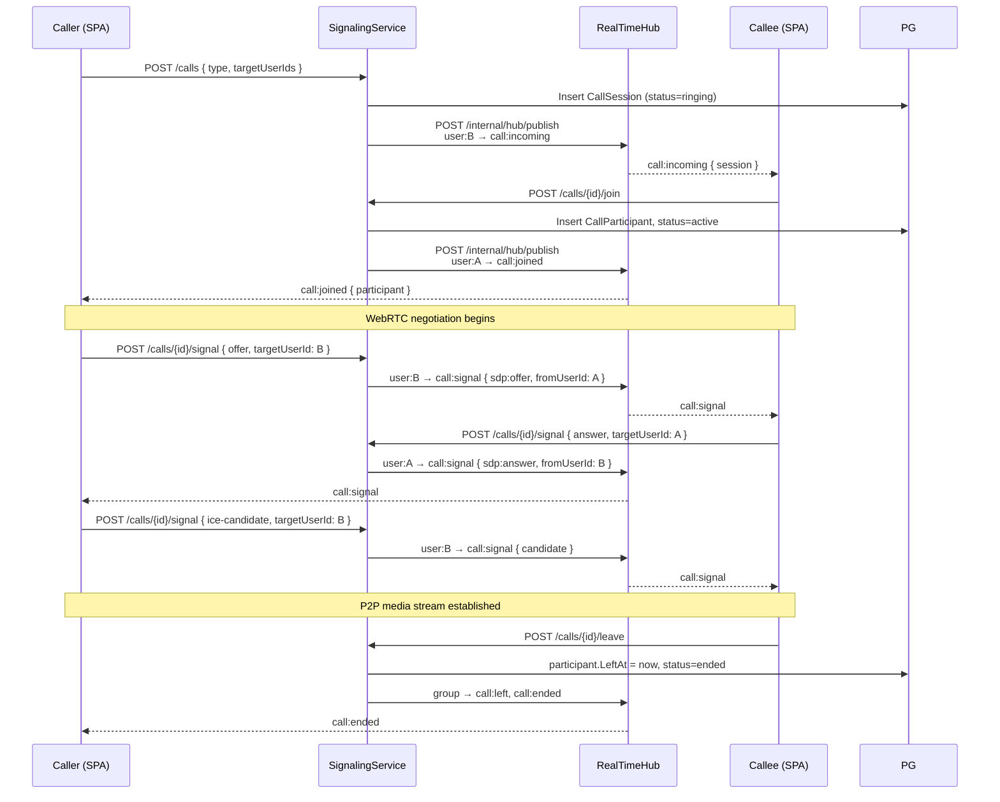
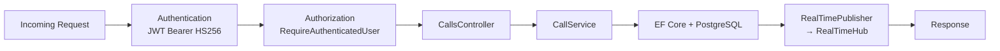
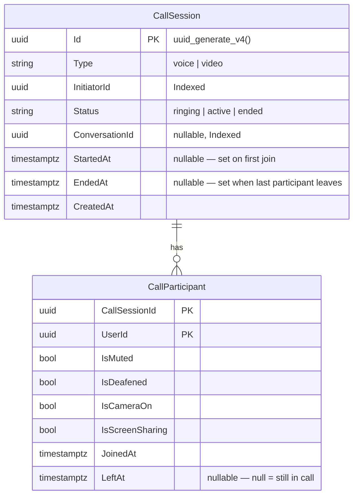
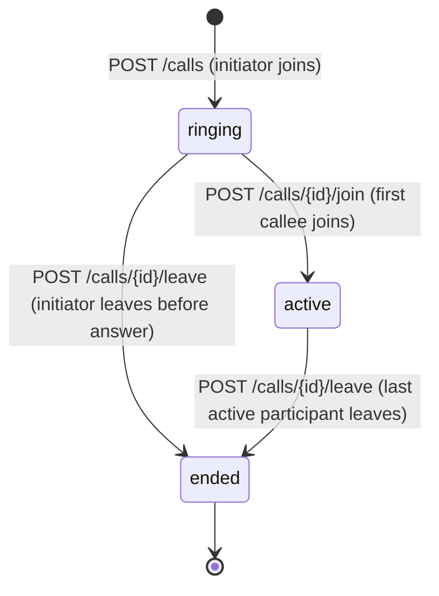
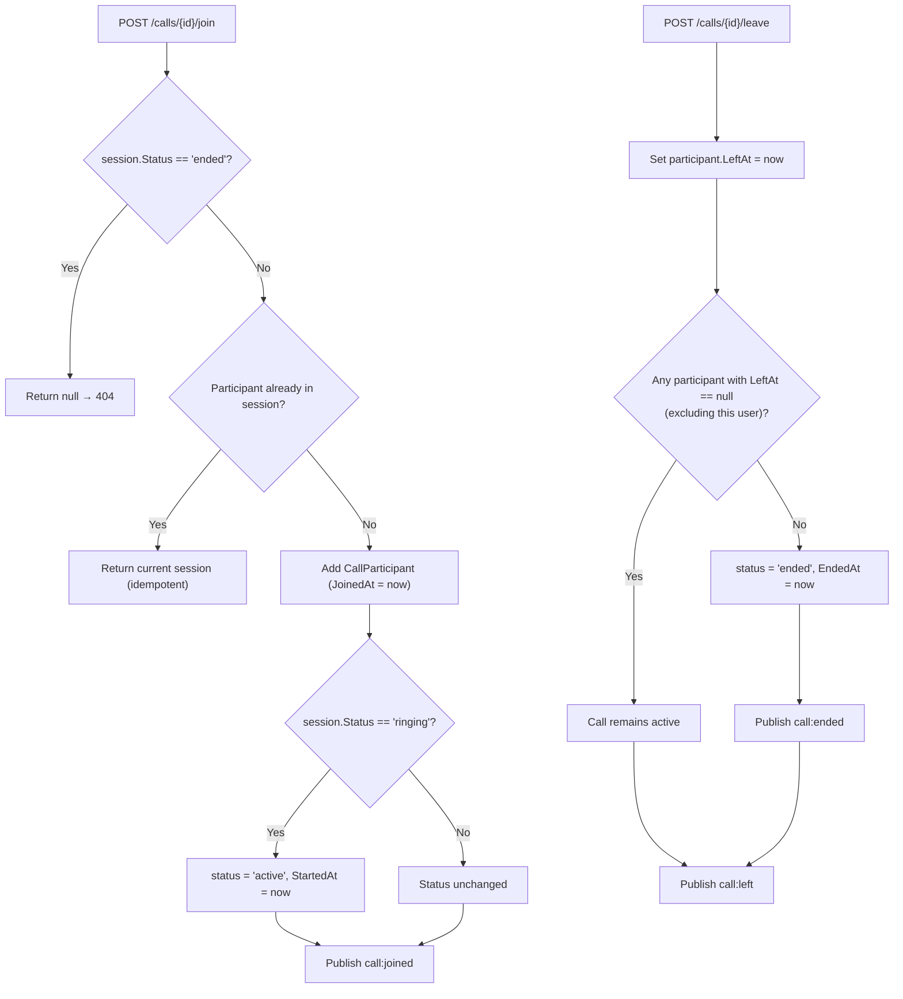

# SignalingService

> **Port:** 5010 &nbsp;|&nbsp; **Runtime:** ASP.NET Core (.NET 9) &nbsp;|&nbsp; **Database:** PostgreSQL (`signaling_db`) &nbsp;|&nbsp; **Phase:** 2 — Real-Time Communication

## Overview

SignalingService is the **WebRTC call orchestration layer** for the SocialCommerce super-app. It handles the server-side coordination required to establish and manage peer-to-peer voice and video calls between users. It owns:

- **Call initiation** — Creates a `CallSession`, records the initiator as the first participant, and pushes `call:incoming` notifications to all target users via RealTimeHub.
- **Call join / leave** — Tracks participant lifecycle, transitions call status (`ringing` → `active` → `ended`), and auto-ends a call when the last active participant leaves.
- **WebRTC signal relay** — Proxies SDP offers/answers and ICE candidates between peers through RealTimeHub, enabling NAT traversal without a direct peer-to-peer connection to this service.
- **Participant state** — Persists and broadcasts media state changes (mute, deafen, camera on/off, screen share) to all call participants in real time.
- **Call history** — Persists all session and participant records to PostgreSQL for audit, analytics, and call-history UIs.

> SignalingService is a **pure signaling plane** — it never touches audio or video streams. The actual media flows directly between peers (or via a TURN/STUN server) using the WebRTC stack in the browser/client.

---

## Architecture

### Position in the Platform



### Call Signal Flow



### Request Pipeline



---

## Project Structure

```
services/SignalingService/
├── SignalingService.csproj
├── Program.cs                          # Composition root — DI, JWT auth, HTTP client, EF, migration
├── Dockerfile                          # Multi-stage .NET 9 container build
├── appsettings.json
├── appsettings.Development.json
│
├── Controllers/
│   └── CallsController.cs              # /calls — initiate, get, join, leave, signal, state
│
├── Data/
│   ├── AppDbContext.cs                 # EF Core DbContext (CallSessions, CallParticipants)
│   └── Entities.cs                     # CallSession, CallParticipant entities
│
├── Dtos/
│   └── CallDtos.cs                     # CallSessionDto, CallParticipantDto,
│                                       #   InitiateCallRequest, SignalRequest,
│                                       #   UpdateParticipantStateRequest
│
├── Services/
│   ├── IRealTimePublisher.cs           # Contract for pushing events to RealTimeHub
│   ├── RealTimePublisher.cs            # HTTP client impl → POST /internal/hub/publish
│   └── CallService.cs                  # All call business logic
│
├── Auth/
│   └── JwtAuthExtensions.cs            # AddServiceJwtAuth() — HS256 JWT Bearer setup
│
├── Migrations/
│   └── 20260322174204_InitialCreate.cs # CallSessions + CallParticipants tables
│
└── Properties/
    └── launchSettings.json
```

---

## Data Model

### Entity-Relationship Diagram



### `CallSession`

| Column | Type | Constraints | Notes |
|---|---|---|---|
| `Id` | `uuid` | PK, `uuid_generate_v4()` | |
| `Type` | `varchar(5)` | Required | `voice` or `video` |
| `InitiatorId` | `uuid` | Required, Indexed | References `UserProfile.Id` |
| `Status` | `varchar(10)` | Required | `ringing` → `active` → `ended` |
| `ConversationId` | `uuid?` | Indexed | Links to a CommunicationService conversation if present |
| `StartedAt` | `timestamptz?` | — | Set when the first non-initiator joins |
| `EndedAt` | `timestamptz?` | — | Set when the last active participant leaves |
| `CreatedAt` | `timestamptz` | Required | |

### `CallParticipant`

| Column | Type | Constraints | Notes |
|---|---|---|---|
| `CallSessionId` | `uuid` | PK (composite), FK → `CallSession.Id` | Cascade delete |
| `UserId` | `uuid` | PK (composite) | References `UserProfile.Id` |
| `IsMuted` | `bool` | Default `false` | |
| `IsDeafened` | `bool` | Default `false` | |
| `IsCameraOn` | `bool` | Default `false` | |
| `IsScreenSharing` | `bool` | Default `false` | |
| `JoinedAt` | `timestamptz` | Required | |
| `LeftAt` | `timestamptz?` | — | `null` = participant is still active in the call |

---

## Authentication & Authorization

SignalingService uses **JWT Bearer** authentication with **HS256** symmetric signing — the same shared key used by UserService and CommunicationService.

| Parameter | Value |
|---|---|
| **Scheme** | JWT Bearer |
| **Algorithm** | HS256 |
| **Issuer** | `SocialCommerce` (validated) |
| **Audience** | Not validated |
| **Clock skew** | 30 seconds |
| **User identity claim** | `uid` (parsed as `Guid`) |

All controller endpoints require an authenticated user. The `uid` claim must be present; a missing claim throws `InvalidOperationException` and yields a `500` before the action executes.

---

## API Reference

All endpoints are under `CallsController` at `/calls` and require a valid JWT Bearer token.

### Call Session Endpoints

| Endpoint | Method | Description |
|---|---|---|
| `/calls` | `POST` | Initiate a new call. Creates the session with `status=ringing`, adds the caller as a participant, and pushes `call:incoming` to each target user. |
| `/calls/{callId}` | `GET` | Get the full call session including all participant states. |
| `/calls/{callId}/join` | `POST` | Join an existing call. Transitions `ringing` → `active` on first join. Publishes `call:joined`. |
| `/calls/{callId}/leave` | `POST` | Leave a call. Sets `LeftAt` on the participant. If no active participants remain, sets `status=ended` and publishes `call:ended`. |
| `/calls/{callId}/signal` | `POST` | Relay a WebRTC signal (SDP offer, answer, or ICE candidate) to a specific target user via RealTimeHub. |
| `/calls/{callId}/participants/{userId}/state` | `PATCH` | Update the calling user's own media state (mute/deafen/camera/screen share). Publishes `call:state_update` to the call group. |

> `PATCH .../participants/{userId}/state` enforces that `userId == currentUser` — a user may only update their own state.

---

## DTOs

### `InitiateCallRequest` (Request Body — `POST /calls`)

```
{
  "type":          "voice | video",
  "conversationId": "uuid?",
  "targetUserIds": ["uuid", "uuid", "…"]
}
```

### `SignalRequest` (Request Body — `POST /calls/{callId}/signal`)

```
{
  "signalType":   "offer | answer | ice-candidate",
  "targetUserId": "uuid",
  "sdp":          "string? (present for offer/answer)",
  "candidate":    "string? (present for ice-candidate)"
}
```

### `UpdateParticipantStateRequest` (Request Body — `PATCH .../state`)

```
{
  "isMuted":        true | false | null,
  "isDeafened":     true | false | null,
  "isCameraOn":     true | false | null,
  "isScreenSharing": true | false | null
}
```

> All fields are nullable — only non-null values are applied.

### `CallSessionDto` (Response)

```
{
  "id":             "uuid",
  "type":           "voice | video",
  "initiatorId":    "uuid",
  "status":         "ringing | active | ended",
  "conversationId": "uuid?",
  "startedAt":      "timestamptz?",
  "endedAt":        "timestamptz?",
  "createdAt":      "timestamptz",
  "participants": [
    {
      "userId":          "uuid",
      "isMuted":         false,
      "isDeafened":      false,
      "isCameraOn":      false,
      "isScreenSharing": false,
      "joinedAt":        "timestamptz",
      "leftAt":          "timestamptz?"
    }
  ]
}
```

---

## Real-Time Events

SignalingService publishes all real-time events by calling `POST /internal/hub/publish` on RealTimeHub with a shared `X-Internal-Api-Key` header. Each call specifies a **group** that RealTimeHub uses to target the correct SignalR connections.

### Group Routing

| Condition | Group used |
|---|---|
| `ConversationId` is set | `conversation:{conversationId}` |
| `ConversationId` is null | `user:{initiatorId}` |

> On `call:signal`, the group is always `user:{targetUserId}` regardless of conversation context, ensuring the SDP/ICE payload reaches only the intended peer.

### Events Published

| Event | Target Group | Trigger | Payload |
|---|---|---|---|
| `call:incoming` | `user:{targetUserId}` | `POST /calls` — once per target | Full `CallSessionDto` |
| `call:joined` | Conversation or initiator group | `POST /calls/{id}/join` | `CallParticipantDto` of the joining user |
| `call:left` | Conversation or initiator group | `POST /calls/{id}/leave` | `{ userId }` |
| `call:ended` | Conversation or initiator group | `POST /calls/{id}/leave` — last participant | `{ callId }` |
| `call:signal` | `user:{targetUserId}` | `POST /calls/{id}/signal` | `{ callId, type, sdp?, candidate?, fromUserId }` |
| `call:state_update` | Conversation or initiator group | `PATCH .../participants/{id}/state` | `CallParticipantDto` |

---

## Call Lifecycle

### Status Transitions



### Participant Join / Leave Rules



---

## WebRTC Signaling Design

SignalingService acts as a **signaling channel only** — it relays WebRTC negotiation messages between peers but never inspects or processes SDP or ICE data. The three signal types it relays are:

| Signal Type | Direction | Purpose |
|---|---|---|
| `offer` | Caller → Callee | SDP offer describing the caller's media capabilities |
| `answer` | Callee → Caller | SDP answer confirming media negotiation |
| `ice-candidate` | Both directions | ICE candidates for NAT traversal (may be sent multiple times) |

All signals are forwarded via RealTimeHub as `call:signal` events directed at a specific `user:{targetUserId}` group, ensuring delivery to exactly one peer.

> **Note:** For production deployments behind symmetric NAT, a TURN server should be provisioned and its URLs embedded in the SDP offer/answer. SignalingService has no awareness of TURN — it is configured entirely on the client side.

---

## Service Dependencies

### Outbound

| Dependency | Protocol | Purpose |
|---|---|---|
| **PostgreSQL** (`signaling_db`) | TCP / EF Core | Persistent call session and participant records |
| **RealTimeHub** (`:5007`) | HTTP (`POST /internal/hub/publish`) | Push real-time events to call participants |

### Inbound (Consumers)

| Consumer | Endpoint | Notes |
|---|---|---|
| **React SPA / Mobile app** | `/calls/*` | Full call lifecycle via JWT |
| **CommunicationService** *(planned)* | `/calls` | Auto-initiate calls from chat conversations |

### Failure Handling

`RealTimePublisher` wraps each `SendAsync` in a `try/catch` and swallows exceptions — real-time delivery is **best-effort**. A failed push to RealTimeHub does not fail the HTTP response to the caller. Call state is always persisted to PostgreSQL first.

---

## Configuration

### `appsettings.json` Keys

| Section | Key | Description |
|---|---|---|
| `ConnectionStrings:Default` | `Host=…;Database=signaling_db;…` | PostgreSQL connection string |
| `Authentication:Jwt:Issuer` | `SocialCommerce` | JWT issuer claim (validated) |
| `Authentication:Jwt:SymmetricKey` | — | HS256 signing key — must match the key used by UserService |
| `RealTimeHub:BaseUrl` | `http://localhost:5007` | Base URL for the RealTimeHub internal publish endpoint |
| `Internal:ApiKey` | — | Shared secret sent as `X-Internal-Api-Key` header to RealTimeHub |

> ⚠️ **Never commit secrets.** Use `dotnet user-secrets` in development and Azure Key Vault / Kubernetes Secrets in production.

---

## Containerization

### Dockerfile

Single-context build targeting .NET 9 (no shared project references):

| Stage | Base Image | Purpose |
|---|---|---|
| `base` | `mcr.microsoft.com/dotnet/aspnet:9.0` | Runtime (exposes 8080) |
| `build` | `mcr.microsoft.com/dotnet/sdk:9.0` | Restore + build |
| `publish` | (from `build`) | `dotnet publish` |
| `final` | (from `base`) | Copy published output, `ENTRYPOINT` |

> Unlike most other services, SignalingService has **no `shared/Contracts` reference**, so its Docker build context is the service directory itself (`build: ./services/SignalingService`).

### Docker Compose

```yaml
signalingservice:
  build: ./services/SignalingService
  ports: [ "5010:8080" ]
  depends_on:
    postgres:
      condition: service_healthy
    realtimehub:
      condition: service_started
  environment:
    - ConnectionStrings__Default=Host=postgres;Database=signaling_db;Username=postgres;Password=1234;Ssl Mode=Disable
    - Authentication__Jwt__Issuer=SocialCommerce
    - Authentication__Jwt__SymmetricKey=sc-dev-secret-key-min-32-bytes-long!!
    - RealTimeHub__BaseUrl=http://realtimehub:8080
    - Internal__ApiKey=sc-dev-internal-api-key
```

---

## Migrations

Migrations are applied synchronously at startup in Development mode via `Database.Migrate()`.

| Migration | Date | Description |
|---|---|---|
| `InitialCreate` | 2026-03-22 | `CallSessions` table with `uuid-ossp` extension; `CallParticipants` table with composite PK and cascade FK |

Manual migration commands:

```bash
cd services/SignalingService
dotnet ef migrations add <MigrationName>
dotnet ef database update
```

---

## Key Design Decisions

| Decision | Rationale |
|---|---|
| **Pure signaling, no media** | SignalingService only relays WebRTC negotiation messages. Audio/video flows P2P, keeping the server load minimal and latency low. |
| **RealTimeHub for push delivery** | Rather than holding long-lived WebSocket connections itself, SignalingService delegates all push to RealTimeHub via a single internal HTTP call, keeping the service stateless between requests. |
| **Best-effort RealTimeHub publish** | A dropped push does not fail the REST response. Call state is always durable in PostgreSQL, so a client can re-fetch session state if a push is missed. |
| **`ConversationId` for group routing** | When a call is linked to a CommunicationService conversation, events are routed to the `conversation:{id}` SignalR group so all conversation members receive them without enumerating individual user IDs. |
| **Auto-end on last participant** | The service automatically transitions to `ended` when no active participants remain, preventing orphaned `ringing` sessions that would never be cleaned up. |
| **HS256 JWT (no OIDC authority)** | Uses the same symmetric key as UserService for zero-latency local validation. No network call to an identity provider is needed per request. |
| **`uid` claim for identity** | Caller identity is resolved from the `uid` claim (a Guid) rather than `sub` or `oid`, matching the token shape issued by UserService's hub-token endpoint. |

---

## Related Documents

- [Backend Super-App Strategy](../backend_superapp_strategy.md) — Full architecture and phase plan
- [RealTimeHub](./RealTimeHub.md) — SignalR hub that delivers `call:*` events to browser clients *(planned)*
- [UserService](./UserService.md) — Issues HS256 JWTs consumed by this service; `UserProfile.Id` is the `userId` in all call records
- [CommunicationService](./CommunicationService.md) — Planned initiator of calls linked to chat conversations *(planned)*
