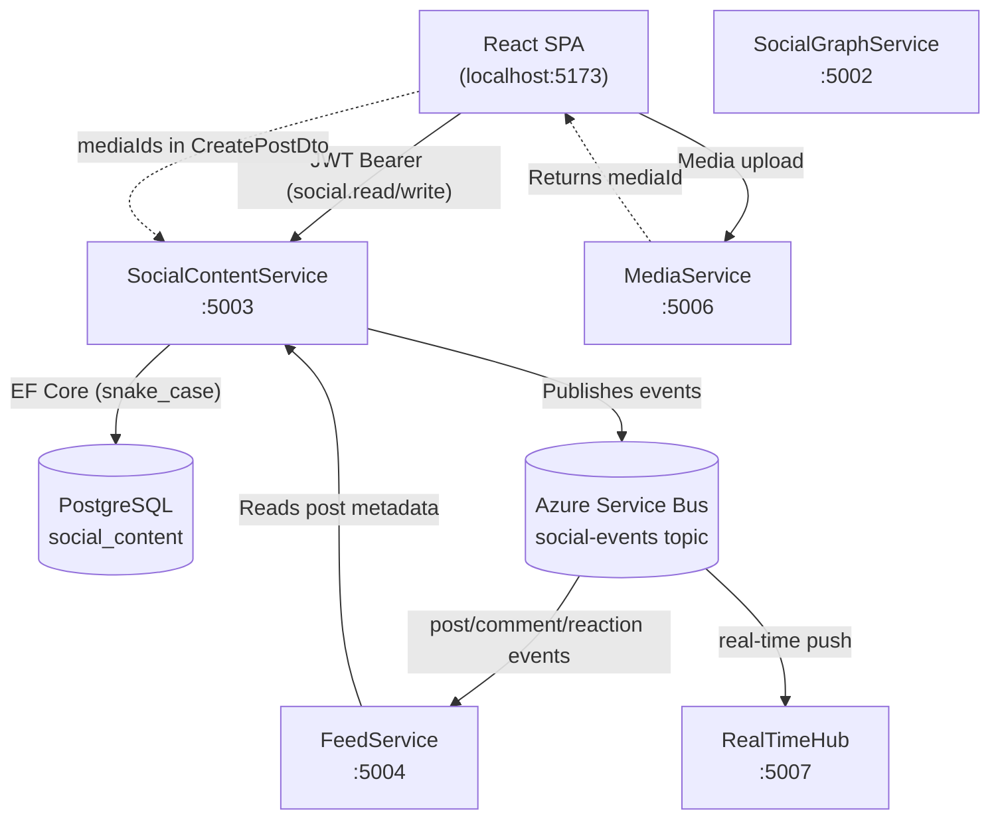
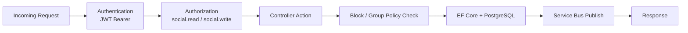
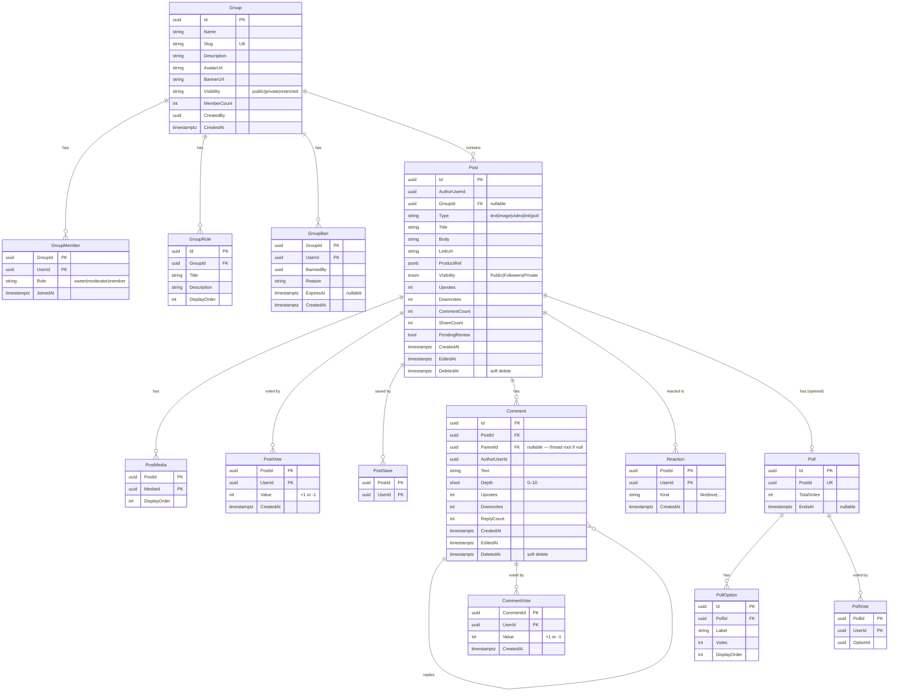
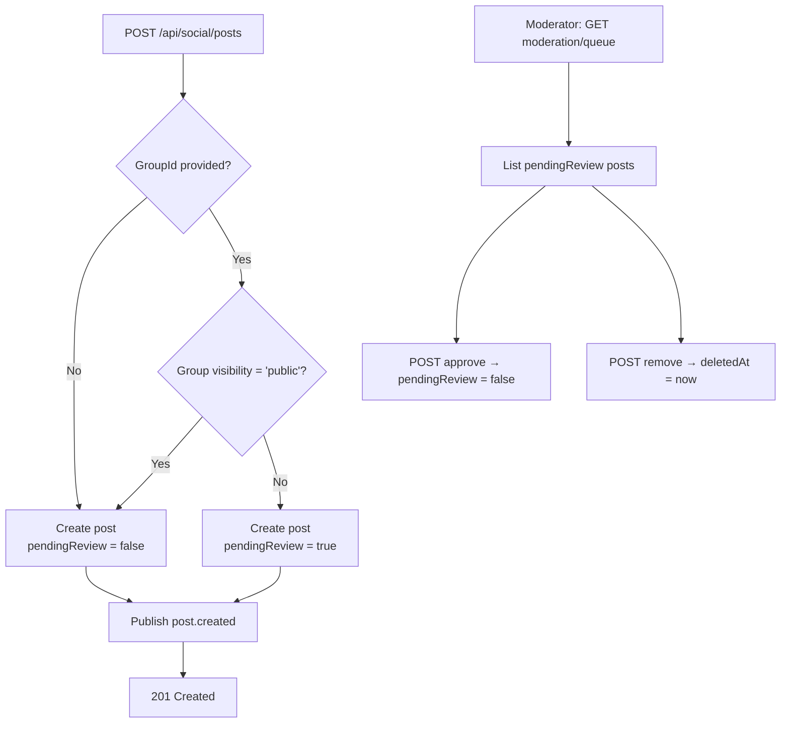
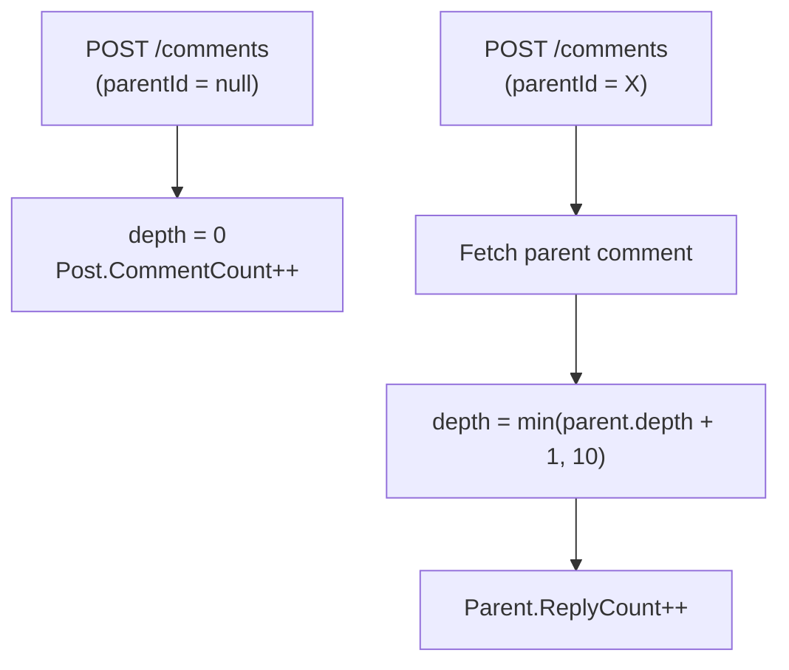
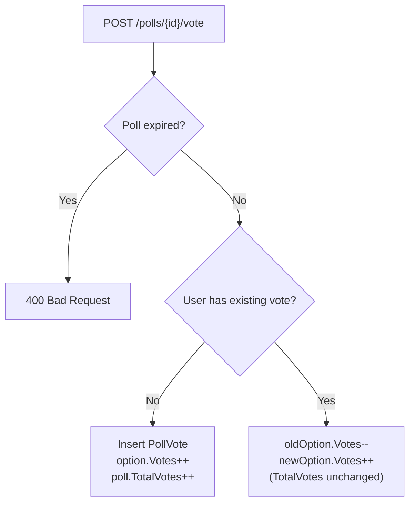

# SocialContentService

> **Port:** 5003 &nbsp;|&nbsp; **Runtime:** ASP.NET Core (.NET 9) &nbsp;|&nbsp; **Database:** PostgreSQL (`social_content`) &nbsp;|&nbsp; **Phase:** 1 — Social Content

## Overview

SocialContentService is the **user-generated content authority** for the SocialCommerce super-app. It owns the full lifecycle of social content and community spaces. It manages:

- **Posts** — Create, read, update, and soft-delete posts of multiple types (`text`, `image`, `video`, `link`, `poll`). Supports visibility levels, vote counts, and optional product references for commerce integration.
- **Comments** — Threaded comment trees on posts with depth tracking, soft deletes, and per-comment voting.
- **Reactions** — Emoji-style reactions on posts (one per user, changeable kind).
- **Polls** — Time-bounded polls attached to posts with per-option vote counts and one-vote-per-user enforcement.
- **Groups** — Community spaces with public/private/restricted visibility, role-based moderation, member management, ban enforcement, and a moderation queue for pending posts.
- **User walls & saved posts** — Public post walls per user and private saved-post collections.
- **Event publishing** — Publishes content-change events to Azure Service Bus (`social-events` topic) for downstream fanout to FeedService, RealTimeHub, and notification services.

---

## Architecture

### Position in the Platform



### Request Pipeline



---

## Project Structure

```
services/SocialContentService/
├── SocialContentService.csproj
├── Program.cs                          # Composition root — DI, JWT auth, policies, OTEL, Service Bus
├── Dockerfile                          # Multi-stage .NET 9 container build
├── appsettings.json
├── appsettings.Development.json
│
├── Controllers/
│   ├── PostsController.cs              # /api/social/posts — CRUD, voting, saving
│   ├── CommentsController.cs           # /api/social/posts/{postId}/comments — create & list
│   ├── CommentActionsController.cs     # /api/social/comments — edit, delete, vote, replies
│   ├── ReactionsController.cs          # /api/social/posts/{postId}/reactions — add, remove
│   ├── PollsController.cs              # /api/social/polls — get, vote
│   ├── GroupsController.cs             # /api/social/groups — full group + moderation management
│   └── UserPostsController.cs          # /api/social/users — user wall, saved posts
│
├── Data/
│   ├── AppDb.cs                        # EF Core DbContext (all entities, snake_case naming)
│   ├── AppDbFactory.cs                 # IDesignTimeDbContextFactory for migrations
│   └── Entities.cs                     # All entity classes + Visibility enum
│
├── Dtos/
│   ├── PostDtos.cs                     # CreatePostDto, UpdatePostDto, PostReadDto, VoteDto, PostMapping
│   ├── CommentDtos.cs                  # CreateCommentDto, UpdateCommentDto, CommentReadDto, CommentMapping
│   ├── ReactionDtos.cs                 # ReactDto
│   ├── PollDtos.cs                     # CreatePollDto, CastPollVoteDto, PollReadDto, PollOptionReadDto
│   └── GroupDtos.cs                    # CreateGroupDto, UpdateGroupDto, GroupReadDto,
│                                       #   GroupMemberReadDto, GroupRuleDto, BanUserDto, GroupBanReadDto
│
├── Services/
│   ├── BusPublisher.cs                 # IBusPublisher + BusPublisher (Azure SB)
│   ├── NoOpBusPublisher.cs             # Dev no-op implementation
│   └── Pagination.cs                   # Cursor.Encode / Cursor.Decode helpers
│
└── Migrations/
    ├── 20250829051402_Init.cs          # Posts, Comments, Reactions tables
    └── 20260322181907_Phase2.cs        # Groups, Polls, PostVotes, PostSaves, PostMedia + Post extensions
```

---

## Data Model

### Entity-Relationship Diagram



### Entity Column Reference

#### `Post`

| Column | Type | Constraints | Notes |
|---|---|---|---|
| `Id` | `uuid` | PK | |
| `AuthorUserId` | `uuid` | Required, Indexed | References `UserProfile.Id` in UserService |
| `GroupId` | `uuid?` | Indexed | `null` for user-wall posts |
| `Type` | `varchar(10)` | Default `text` | `text` \| `image` \| `video` \| `link` \| `poll` |
| `Title` | `varchar(300)` | — | |
| `Body` | `varchar(4000)` | — | Primary content field |
| `LinkUrl` | `varchar(2048)` | — | For `link`-type posts |
| `ProductRef` | `jsonb` | — | Commerce product reference |
| `Visibility` | `enum` | Default `Public` | PostgreSQL native enum |
| `Upvotes` | `int` | Default `0` | Denormalized counter refreshed on vote |
| `Downvotes` | `int` | Default `0` | Denormalized counter refreshed on vote |
| `CommentCount` | `int` | Default `0` | Incremented on top-level comment creation |
| `PendingReview` | `bool` | Default `false` | Set for posts in non-public groups |
| `CreatedAt` | `timestamptz` | Default `UtcNow` | Cursor field for pagination |
| `EditedAt` | `timestamptz?` | — | Set on `PATCH` |
| `DeletedAt` | `timestamptz?` | — | Soft delete; filtered from all read queries |

#### `Comment`

| Column | Type | Constraints | Notes |
|---|---|---|---|
| `Id` | `uuid` | PK | |
| `PostId` | `uuid` | Required, Indexed | |
| `ParentId` | `uuid?` | Indexed | `null` = top-level comment |
| `AuthorUserId` | `uuid` | Required | |
| `Text` | `varchar(2000)` | Required | |
| `Depth` | `smallint` | Clamped to `[0, 10]` | Prevents infinite nesting |
| `Upvotes` | `int` | Default `0` | Denormalized |
| `Downvotes` | `int` | Default `0` | Denormalized |
| `ReplyCount` | `int` | Default `0` | Incremented when a direct reply is added |
| `CreatedAt` | `timestamptz` | Default `UtcNow` | Cursor field |
| `DeletedAt` | `timestamptz?` | — | Soft delete |

#### `Group`

| Column | Type | Constraints | Notes |
|---|---|---|---|
| `Id` | `uuid` | PK | |
| `Slug` | `varchar(100)` | Unique index | URL-safe identifier, lowercased on create |
| `Visibility` | `varchar(12)` | Default `public` | `public` \| `private` \| `restricted` |
| `MemberCount` | `int` | Default `0` | Incremented/decremented on join/leave |
| `CreatedBy` | `uuid` | Required | Creator is automatically the `owner` member |

---

## Authentication & Authorization

SocialContentService uses **JWT Bearer** authentication. Tokens are validated against a configured OIDC authority (e.g., Azure AD B2C).

### Policies

| Policy | Scope Claim (`scp`) | Applied to |
|---|---|---|
| `social.read` | `social.read` | All `GET` endpoints |
| `social.write` | `social.write` | All `POST`, `PATCH`, `DELETE` endpoints |

> User identity is resolved from the `oid`, `sub`, or `ClaimTypes.NameIdentifier` claim in this order of preference.

### Group Role Hierarchy

Within groups, actions are gated by the member's role:

| Role | Permissions |
|---|---|
| `owner` | All moderator permissions + transfer ownership, change member roles |
| `moderator` | Update group metadata, manage bans, approve/remove posts from moderation queue, replace rules |
| `member` | Post, comment, vote, react, leave |

---

## API Reference

All endpoints require a valid JWT Bearer token unless stated otherwise.

### Posts (`/api/social/posts`)

| Endpoint | Method | Policy | Description |
|---|---|---|---|
| `/api/social/posts` | `GET` | `social.read` | Cursor-paginated post feed. Filter by `authorId` or `groupId`. |
| `/api/social/posts` | `POST` | `social.write` | Create a post. Posts in non-public groups start as `pendingReview = true`. |
| `/api/social/posts/{postId}` | `GET` | `social.read` | Get a single post by ID. |
| `/api/social/posts/{postId}` | `PATCH` | `social.write` | Update title/body/linkUrl/visibility (author only). |
| `/api/social/posts/{postId}` | `DELETE` | `social.write` | Soft-delete a post (author only). Sets `deletedAt`. |
| `/api/social/posts/{postId}/vote` | `POST` | `social.write` | Vote on a post. `value: 1` (up), `-1` (down), `0` (remove). Refreshes denormalized counters. |
| `/api/social/posts/{postId}/save` | `POST` | `social.write` | Toggle save/unsave a post for the current user. |

#### Query Parameters — `GET /api/social/posts`

| Parameter | Type | Default | Description |
|---|---|---|---|
| `authorId` | `Guid?` | — | Filter to a specific author. |
| `groupId` | `Guid?` | — | Filter to a specific group. |
| `cursor` | `string?` | — | Base64 timestamp from the previous page's `nextCursor`. |
| `take` | `int` | `20` | Page size. Clamped to `[1, 100]`. |

### Comments (`/api/social/posts/{postId}/comments` and `/api/social/comments`)

| Endpoint | Method | Policy | Description |
|---|---|---|---|
| `/api/social/posts/{postId}/comments` | `GET` | `social.read` | Cursor-paginated list of **top-level** comments for a post. |
| `/api/social/posts/{postId}/comments` | `POST` | `social.write` | Create a comment. Include `parentId` for a reply. Increments `post.CommentCount` or `parent.ReplyCount`. |
| `/api/social/comments/{commentId}/replies` | `GET` | `social.read` | Cursor-paginated list of direct replies to a comment. |
| `/api/social/comments/{commentId}` | `PATCH` | `social.write` | Edit comment text (author only). Sets `editedAt`. |
| `/api/social/comments/{commentId}` | `DELETE` | `social.write` | Soft-delete a comment (author only). Sets `deletedAt`. |
| `/api/social/comments/{commentId}/vote` | `POST` | `social.write` | Vote on a comment (`+1`, `-1`, or `0` to remove). |

### Reactions (`/api/social/posts/{postId}/reactions`)

| Endpoint | Method | Policy | Description |
|---|---|---|---|
| `/api/social/posts/{postId}/reactions` | `POST` | `social.write` | Add or change a reaction. One reaction per user per post. Publishes `reaction.added` or `reaction.changed`. |
| `/api/social/posts/{postId}/reactions` | `DELETE` | `social.write` | Remove the current user's reaction. Publishes `reaction.removed`. |

### Polls (`/api/social/polls`)

| Endpoint | Method | Policy | Description |
|---|---|---|---|
| `/api/social/polls/{pollId}` | `GET` | `social.read` | Get poll details including options with vote counts. |
| `/api/social/polls/{pollId}/vote` | `POST` | `social.write` | Cast or change a vote. One vote per user. Expired polls (`EndsAt < now`) → `400`. Changing vote decrements old option. |

### Groups (`/api/social/groups`)

| Endpoint | Method | Policy | Role Required | Description |
|---|---|---|---|---|
| `/api/social/groups/discover` | `GET` | `social.read` | — | Cursor-paginated list of **public** groups. Supports keyword search via `q`. |
| `/api/social/groups` | `POST` | `social.write` | — | Create a group. Creator becomes `owner`. Slug must be unique. |
| `/api/social/groups/{slug}` | `GET` | `social.read` | — | Get group details by slug. |
| `/api/social/groups/{slug}` | `PATCH` | `social.write` | `moderator+` | Update name, description, avatar, or banner. |
| `/api/social/groups/{slug}/posts` | `GET` | `social.read` | — | Cursor-paginated posts within the group (excludes `pendingReview`). |
| `/api/social/groups/{slug}/join` | `POST` | `social.write` | — | Join a group. Banned users → `403`. Idempotent. |
| `/api/social/groups/{slug}/leave` | `POST` | `social.write` | — | Leave a group. `owner` must transfer before leaving. |
| `/api/social/groups/{slug}/members` | `GET` | `social.read` | — | List all group members with roles. |
| `/api/social/groups/{slug}/members/{memberId}/role` | `PATCH` | `social.write` | `owner` | Promote or demote a member. Cannot change `owner` role. |
| `/api/social/groups/{slug}/ban/{targetUserId}` | `POST` | `social.write` | `moderator+` | Ban a user (with optional reason and expiry). Removes membership. Upsert on existing ban. |
| `/api/social/groups/{slug}/bans` | `GET` | `social.read` | `moderator+` | List all active bans for the group. |
| `/api/social/groups/{slug}/rules` | `GET` | `social.read` | — | List group rules ordered by `displayOrder`. |
| `/api/social/groups/{slug}/rules` | `PUT` | `social.write` | `moderator+` | Replace all group rules atomically. |
| `/api/social/groups/{slug}/moderation/queue` | `GET` | `social.read` | `moderator+` | Cursor-paginated list of posts awaiting review (`pendingReview = true`). |
| `/api/social/groups/{slug}/moderation/{postId}/approve` | `POST` | `social.write` | `moderator+` | Approve a pending post (sets `pendingReview = false`). |
| `/api/social/groups/{slug}/moderation/{postId}/remove` | `POST` | `social.write` | `moderator+` | Soft-delete a post from the moderation queue. |

### User Posts & Saved (`/api/social/users`)

| Endpoint | Method | Policy | Description |
|---|---|---|---|
| `/api/social/users/{userId}/posts` | `GET` | `social.read` | Cursor-paginated public wall — non-group, `Public` visibility posts by `userId`. |
| `/api/social/users/{userId}/saved` | `GET` | `social.read` | Cursor-paginated saved posts. Accessible only by the owning user (`me == userId`), otherwise `403`. |

---

## DTOs

### `PostReadDto` (Response)

```
{
  "id":           "uuid",
  "authorUserId": "uuid",
  "title":        "string?",
  "body":         "string?",
  "type":         "text | image | video | link | poll",
  "visibility":   "Public | Followers | Private",
  "groupId":      "uuid?",
  "linkUrl":      "string?",
  "upvotes":      0,
  "downvotes":    0,
  "commentCount": 0,
  "pendingReview": false,
  "createdAt":    "timestamptz",
  "editedAt":     "timestamptz?",
  "isDeleted":    false
}
```

### `CreatePostDto` (Request Body)

```
{
  "title":      "string?",
  "body":       "string?",
  "type":       "text",
  "linkUrl":    "string?",
  "visibility": "Public",
  "groupId":    "uuid?",
  "mediaIds":   ["uuid"],
  "productRef": { }
}
```

### `CommentReadDto` (Response)

```
{
  "id":           "uuid",
  "postId":       "uuid",
  "authorUserId": "uuid",
  "parentId":     "uuid?",
  "text":         "string",
  "depth":        0,
  "upvotes":      0,
  "downvotes":    0,
  "replyCount":   0,
  "createdAt":    "timestamptz",
  "editedAt":     "timestamptz?",
  "isDeleted":    false
}
```

### `PollReadDto` (Response)

```
{
  "id":         "uuid",
  "postId":     "uuid",
  "totalVotes": 0,
  "endsAt":     "timestamptz?",
  "options": [
    { "id": "uuid", "label": "string", "votes": 0, "displayOrder": 0 }
  ]
}
```

### `GroupReadDto` (Response)

```
{
  "id":          "uuid",
  "name":        "string",
  "slug":        "string",
  "description": "string?",
  "avatarUrl":   "string?",
  "bannerUrl":   "string?",
  "visibility":  "public | private | restricted",
  "memberCount": 0,
  "createdBy":   "uuid",
  "createdAt":   "timestamptz"
}
```

### Paginated Response Shape (all list endpoints)

```
{
  "items":      [ … ],
  "nextCursor": "string? (null on last page)"
}
```

---

## Event Publishing

SocialContentService publishes domain events to the Azure Service Bus topic configured by `ServiceBus:Topic` (default: `social-events`). When `ServiceBus:Connection` is absent in development, a `NoOpBusPublisher` is registered and no messages are sent.

| Event Type | Trigger | Payload Fields |
|---|---|---|
| `post.created` | `POST /api/social/posts` | `postId`, `authorUserId`, `groupId`, `createdAt` |
| `comment.created` | `POST /api/social/posts/{postId}/comments` | `postId`, `commentId`, `authorUserId`, `parentId`, `createdAt` |
| `reaction.added` | `POST /api/social/posts/{postId}/reactions` (new) | `postId`, `userId`, `kind` |
| `reaction.changed` | `POST /api/social/posts/{postId}/reactions` (update) | `postId`, `userId`, `kind` |
| `reaction.removed` | `DELETE /api/social/posts/{postId}/reactions` | `postId`, `userId` |

Each message is JSON-serialized with `Subject` and the `type` application property set to the event type string, and `ContentType: application/json`.

---

## Business Rules

### Post Visibility & Group Moderation Queue



### Comment Threading



### Poll Vote Flow



---

## Pagination Design

All list endpoints use cursor-based pagination, shared with `SocialGraphService`:

- **Encoding:** The cursor is the `CreatedAt` timestamp of the last item, encoded as a little-endian `int64` (Unix milliseconds) wrapped in Base64.
- **Sort direction:** All lists are ordered `ORDER BY CreatedAt DESC` — newest first.
- **Fetch strategy:** The service fetches `take + 1` rows. If `take + 1` rows are returned, a `nextCursor` is derived from the last row and the extra item is dropped from the response.
- **Terminal page:** `nextCursor` is `null` when no further pages exist.
- **Page size:** Default `20`, clamped to `[1, 100]` on all endpoints.

---

## Observability

| Concern | Implementation |
|---|---|
| **Health — Readiness** | `GET /health/ready` — NpgSql health check verifies PostgreSQL connectivity |
| **Tracing** | OpenTelemetry with `AddAspNetCoreInstrumentation`, `AddHttpClientInstrumentation`, and `AddEntityFrameworkCoreInstrumentation` |
| **Metrics** | OpenTelemetry with ASP.NET Core and HTTP client meters |
| **Azure Monitor** | Automatically enabled when `APPLICATIONINSIGHTS_CONNECTION_STRING` is set |
| **Swagger UI** | Available at `/swagger` in Development mode or when `Swagger:Enabled = true` |

---

## Service Dependencies

### Outbound

| Dependency | Protocol | Purpose |
|---|---|---|
| **PostgreSQL** (`social_content`) | TCP / EF Core | Persistent storage for all content entities |
| **Azure Service Bus** (`social-events`) | AMQP | Content event publishing (optional in dev) |

### Inbound (Consumers)

| Consumer | Usage | Notes |
|---|---|---|
| **React SPA** | `/api/social/*` | Full content interaction via JWT |
| **FeedService** | Reads post metadata *(planned)* | Populates timelines from `post.created` events |
| **RealTimeHub** | Receives `post.created`, `comment.created`, `reaction.*` via Service Bus | Pushes real-time notifications |

---

## Configuration

### `appsettings.json` Keys

| Section | Key | Description |
|---|---|---|
| `ConnectionStrings:Default` | `Host=…;Database=social_content;…` | PostgreSQL connection string |
| `Jwt:Authority` | `https://<tenant>.b2clogin.com/…` | OIDC authority for JWT validation |
| `Jwt:Audience` | `<api-client-id>` | Expected JWT audience |
| `ServiceBus:Connection` | — | Azure Service Bus connection string. Leave empty in dev for `NoOpBusPublisher`. |
| `ServiceBus:Topic` | `social-events` | Service Bus topic name for content events |
| `Swagger:Enabled` | `true` / `false` | Show Swagger UI outside of Development environment |
| `APPLICATIONINSIGHTS_CONNECTION_STRING` | — | Enables Azure Monitor OpenTelemetry exporter when set |

> ⚠️ **Never commit secrets.** Use `dotnet user-secrets` in development and Azure Key Vault / Kubernetes Secrets in production.

---

## Containerization

### Dockerfile

Multi-stage build targeting .NET 9:

| Stage | Base Image | Purpose |
|---|---|---|
| `base` | `mcr.microsoft.com/dotnet/aspnet:9.0` | Runtime (exposes 8080, 8081) |
| `build` | `mcr.microsoft.com/dotnet/sdk:9.0` | Restore + build (context: repository root) |
| `publish` | (from `build`) | `dotnet publish` |
| `final` | (from `base`) | Copy published output, `ENTRYPOINT` |

> The `DockerfileContext` is set to the **repository root** so that the `shared/Contracts` project reference resolves correctly during the Docker build.

### Docker Compose

```yaml
socialcontentservice:
  build:
    context: .
    dockerfile: services/SocialContentService/Dockerfile
  ports: [ "5003:8080" ]
  depends_on:
    postgres:
      condition: service_healthy
  environment:
    - ConnectionStrings__Default=Host=postgres;Database=social_content;Username=postgres;Password=1234;Ssl Mode=Disable
    - ServiceBus__Connection=
```

---

## Migrations

Migrations are applied automatically on startup in Development mode (`Program.cs`).

| Migration | Date | Description |
|---|---|---|
| `Init` | 2025-08-29 | `posts`, `comments`, `reactions` tables; `visibility` PostgreSQL enum |
| `Phase2` | 2026-03-22 | Added `body`, `comment_count`, `deleted_at`, `downvotes`, `edited_at`, `group_id`, `link_url`, `pending_review`, `title`, `type`, `upvotes` to `posts`; added `groups`, `group_members`, `group_bans`, `group_rules`, `post_media`, `post_votes`, `post_saves`, `polls`, `poll_options`, `poll_votes` tables; depth/reply-count/edit fields on `comments` |

Manual migration commands:

```bash
cd services/SocialContentService
dotnet ef migrations add <MigrationName>
dotnet ef database update
```

---

## Key Design Decisions

| Decision | Rationale |
|---|---|
| **Soft deletes on `Post` and `Comment`** | Preserves conversation context — replies to a deleted comment remain visible. The `deletedAt` field is filtered from all read queries but can be inspected by moderation tooling. |
| **Denormalized vote and comment counters** | `Post.Upvotes`, `Post.CommentCount`, and `Comment.ReplyCount` are refreshed in-process after each mutation. This avoids expensive `COUNT(*)` aggregates on every read at the cost of eventual consistency under concurrent writes. |
| **`PendingReview` for non-public groups** | Posts in `private` and `restricted` groups enter a moderation queue automatically, giving group moderators control over content before it appears to members. |
| **Depth cap on comment threads** | Replies are capped at depth 10 to prevent pathological thread nesting that would break UI rendering and pagination assumptions. |
| **One poll per post (unique index)** | A `Poll` is linked to a `Post` via a unique index on `PostId`, ensuring a post can only ever have one associated poll. |
| **Poll vote change (not revoke)** | Changing a poll vote decrements the old option's count and increments the new one, keeping `TotalVotes` stable. This avoids the ambiguity of allowing vote removal on polls. |
| **Slug as group identifier** | Groups are addressed by a human-readable `slug` rather than a UUID in all API routes, making URLs bookmarkable and shareable. |
| **Snake_case column naming** | `EFCore.NamingConventions` applies snake_case to all columns and tables, following PostgreSQL conventions and avoiding quoted-identifier issues. |
| **`NoOpBusPublisher` in dev** | Allows full local development without an Azure Service Bus connection. All publish calls are silently swallowed. |

---

## Related Documents

- [Backend Super-App Strategy](../backend_superapp_strategy.md) — Full architecture and phase plan
- [UserService](./UserService.md) — Identity anchor; `UserProfile.Id` is the `AuthorUserId` and `UserId` referenced throughout this service
- [SocialGraphService](./SocialGraphService.md) — Block/follow graph consulted for content visibility *(planned integration)*
- [FeedService](./FeedService.md) — Consumes `post.created` events to build user timelines *(planned)*
- [MediaService](./MediaService.md) — Handles media uploads; returns `mediaId` values used in `PostMedia` *(planned)*
