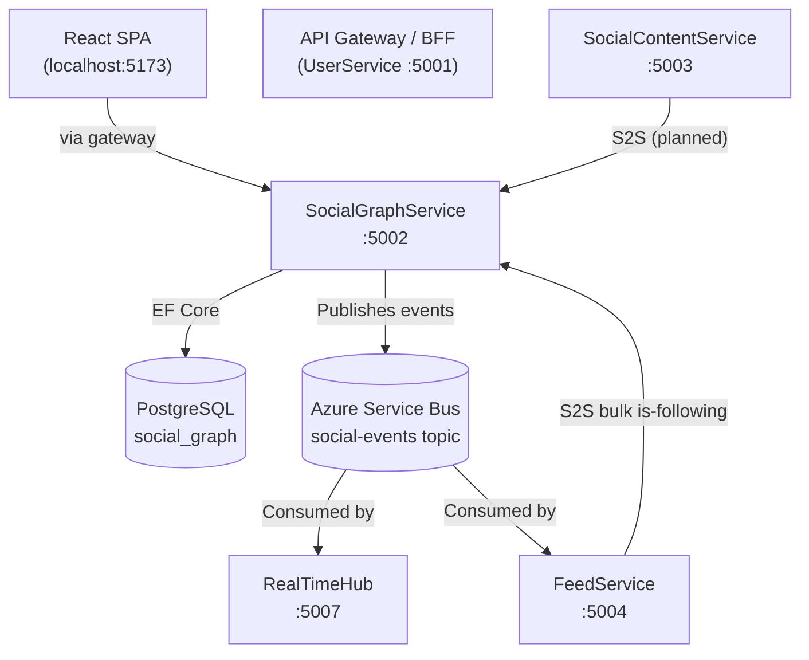
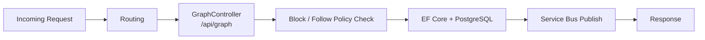
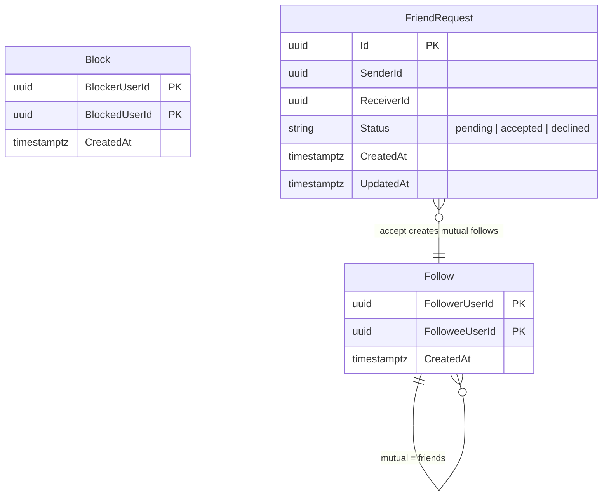
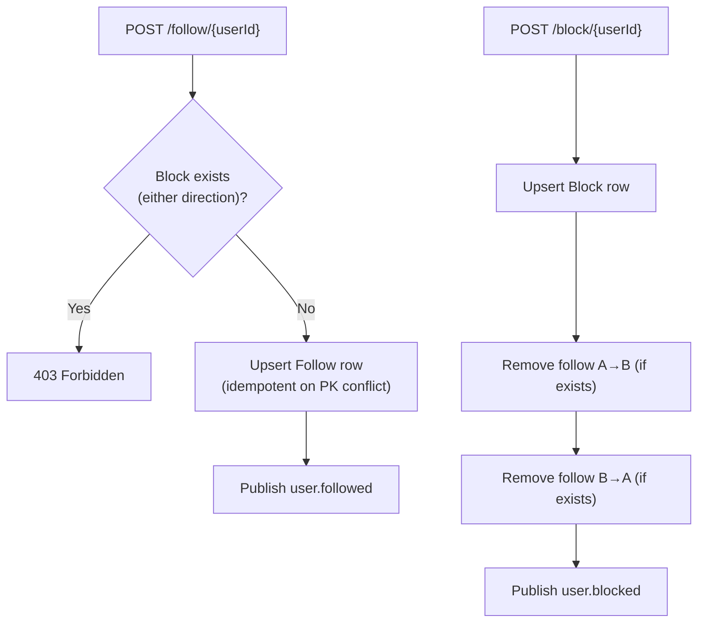
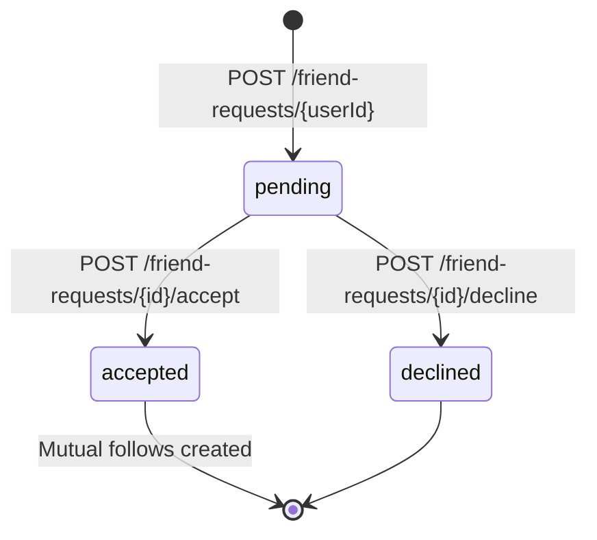

# SocialGraphService

> **Port:** 5002 &nbsp;|&nbsp; **Runtime:** ASP.NET Core (.NET 9) &nbsp;|&nbsp; **Database:** PostgreSQL (`social_graph`) &nbsp;|&nbsp; **Phase:** 1 — Social Graph

## Overview

SocialGraphService is the **relationship authority** for the SocialCommerce super-app. It owns the directed social graph between users and exposes a clean HTTP API consumed by other services and the SPA (via a gateway). It manages:

- **Follow / Unfollow** — Directed follow relationships with block enforcement.
- **Block / Unblock** — Bidirectional block state, automatically removing existing follow edges on block.
- **Relationship check** — Point-in-time query of the full relationship state between any two users.
- **Mutual follows (friends)** — Derived concept of bidirectional follow pairs, paginated via cursor.
- **Friend Requests** — Formal request/accept/decline flow that creates mutual follows on acceptance.
- **Internal bulk lookup** — Batch `is-following` check consumed by FeedService and other domain services.
- **Event publishing** — Publishes relationship-change events to Azure Service Bus (`social-events` topic) for downstream fanout.

---

## Architecture

### Position in the Platform



### Request Pipeline



---

## Project Structure

```
services/SocialGraphService/
├── SocialGraphService.csproj
├── Program.cs                          # Composition root — DI, pipeline, EF, Service Bus, OTEL
├── Dockerfile                          # Multi-stage .NET 9 container build
├── appsettings.json
├── appsettings.Development.json
│
├── Controllers/
│   └── GraphController.cs              # /api/graph — follow, block, lists, rel, friends, friend-requests
│                                       # /api/internal/graph — S2S bulk is-following
│
├── Data/
│   ├── AppDb.cs                        # EF Core DbContext (Follows, Blocks, FriendRequests)
│   ├── Entities.cs                     # Follow, Block, FriendRequest entities
│   └── Migrations/                     # EF Core migrations
│
├── Dtos/
│   └── GraphDtos.cs                    # PagedIds, RelCheck, FriendRequestRead,
│                                       #   BulkIsFollowingRequest, BulkIsFollowingResult
│
└── Services/
    └── BusPublisher.cs                 # IBusPublisher, BusPublisher (Azure SB), NoopBusPublisher
```

---

## Data Model

### Entity-Relationship Diagram



### `Follow`

| Column | Type | Constraints | Notes |
|---|---|---|---|
| `FollowerUserId` | `uuid` | PK (composite), Indexed | The user who is following |
| `FolloweeUserId` | `uuid` | PK (composite), Indexed | The user being followed |
| `CreatedAt` | `timestamptz` | Default `UtcNow` | Used as cursor for pagination |

### `Block`

| Column | Type | Constraints | Notes |
|---|---|---|---|
| `BlockerUserId` | `uuid` | PK (composite), Indexed | The user who initiated the block |
| `BlockedUserId` | `uuid` | PK (composite), Indexed | The user being blocked |
| `CreatedAt` | `timestamptz` | Default `UtcNow` | |

### `FriendRequest`

| Column | Type | Constraints | Notes |
|---|---|---|---|
| `Id` | `uuid` | PK, auto `Guid.NewGuid()` | |
| `SenderId` | `uuid` | Unique composite with `ReceiverId` | Prevents duplicate requests |
| `ReceiverId` | `uuid` | Indexed with `Status` | Efficient inbox queries |
| `Status` | `varchar(10)` | `pending` \| `accepted` \| `declined` | Default `pending` |
| `CreatedAt` | `timestamptz` | Default `UtcNow` | |
| `UpdatedAt` | `timestamptz` | Default `UtcNow` | Set on accept/decline |

---

## API Reference

All endpoints are served by `GraphController`.

### Follow Endpoints (`/api/graph`)

| Endpoint | Method | Description |
|---|---|---|
| `/api/graph/follow/{userId}?me={guid}` | `POST` | Follow `userId` as `me`. Blocked in either direction → `403`. Idempotent on duplicate. |
| `/api/graph/follow/{userId}?me={guid}` | `DELETE` | Unfollow `userId` as `me`. No-op if not following. |

### Block Endpoints (`/api/graph`)

| Endpoint | Method | Description |
|---|---|---|
| `/api/graph/block/{userId}?me={guid}` | `POST` | Block `userId` as `me`. Also removes follow edges in both directions. Idempotent. |
| `/api/graph/block/{userId}?me={guid}` | `DELETE` | Unblock `userId` as `me`. No-op if not blocked. |

### List & Query Endpoints (`/api/graph`)

| Endpoint | Method | Description |
|---|---|---|
| `/api/graph/{userId}/following` | `GET` | Cursor-paginated list of users `userId` follows. |
| `/api/graph/{userId}/followers` | `GET` | Cursor-paginated list of users following `userId`. |
| `/api/graph/{userId}/blocks` | `GET` | Block list. `direction=out` (default), `in`, or `both`. |
| `/api/graph/rel/{me}/{other}` | `GET` | Full relationship state between `me` and `other`. |
| `/api/graph/friends?me={guid}` | `GET` | Cursor-paginated mutual follows (bidirectional) for `me`. |

#### Query Parameters — Paginated Endpoints

| Parameter | Type | Default | Description |
|---|---|---|---|
| `cursor` | `string?` | — | Base64-encoded UTC millisecond timestamp from the previous page's `nextCursor`. |
| `take` | `int` | `50` | Page size. Clamped to `[1, 1000]`. |

### Friend Request Endpoints (`/api/graph/friend-requests`)

| Endpoint | Method | Description |
|---|---|---|
| `/api/graph/friend-requests?me={guid}` | `GET` | List all incoming **pending** friend requests for `me`. |
| `/api/graph/friend-requests/{userId}?me={guid}` | `POST` | Send a friend request from `me` to `userId`. Self-send → `400`. Blocked → `403`. Duplicate → `409`. |
| `/api/graph/friend-requests/{requestId}/accept?me={guid}` | `POST` | Accept request. Creates mutual follow edges. `404` if not found or `me` is not the receiver. Non-pending → `409`. |
| `/api/graph/friend-requests/{requestId}/decline?me={guid}` | `POST` | Decline request. No graph edges created. Non-pending → `409`. |

### Internal Endpoints (`/api/internal/graph`)

| Endpoint | Method | Description |
|---|---|---|
| `/api/internal/graph/is-following` | `POST` | Bulk follow check. Returns a `Dictionary<Guid, bool>` for each supplied `followeeId`. Consumed by FeedService. |

> **Note:** Internal endpoints are not intended for direct SPA consumption. They should be called only from trusted backend services within the compose network.

---

## DTOs

### `PagedIds` (Response — Paginated Lists)

```
{
  "items":      ["uuid", "uuid", "…"],
  "nextCursor": "string? (base64 timestamp, null on last page)"
}
```

### `RelCheck` (Response — Relationship Query)

```
{
  "me":            "uuid",
  "other":         "uuid",
  "isFollowing":   false,
  "isBlockedByMe": false,
  "hasBlockedMe":  false
}
```

### `FriendRequestRead` (Response — Friend Requests)

```
{
  "id":         "uuid",
  "senderId":   "uuid",
  "receiverId": "uuid",
  "status":     "pending | accepted | declined",
  "createdAt":  "timestamptz",
  "updatedAt":  "timestamptz"
}
```

### `BulkIsFollowingRequest` (Request Body — Internal)

```
{
  "followerId":  "uuid",
  "followeeIds": ["uuid", "uuid", "…"]
}
```

### `BulkIsFollowingResult` (Response — Internal)

```
{
  "followerId": "uuid",
  "results": {
    "<followeeId>": true,
    "<followeeId>": false
  }
}
```

---

## Event Publishing

SocialGraphService publishes domain events to the Azure Service Bus topic configured by `ServiceBus:Topic` (default: `social-events`). In development, when `ServiceBus:Connection` is empty, a `NoopBusPublisher` is registered and no messages are sent.

| Event Type | Trigger | Payload Fields |
|---|---|---|
| `user.followed` | `POST /follow/{userId}` | `followerId`, `followeeId`, `createdAt` |
| `user.unfollowed` | `DELETE /follow/{userId}` | `followerId`, `followeeId`, `createdAt` |
| `user.blocked` | `POST /block/{userId}` | `blockerId`, `blockedId`, `createdAt` |
| `user.unblocked` | `DELETE /block/{userId}` | `blockerId`, `blockedId`, `createdAt` |
| `friend.request.sent` | `POST /friend-requests/{userId}` | `requestId`, `senderId`, `receiverId` |
| `friend.request.accepted` | `POST /friend-requests/{requestId}/accept` | `requestId`, `senderId`, `receiverId` |

Each message is JSON-serialized with `Subject` and the `type` application property set to the event type string, and `ContentType: application/json`.

---

## Business Rules

### Follow / Block Interaction



### Friend Request Lifecycle



On **accept**, two `Follow` rows are inserted (`me → sender` and `sender → me`), making the pair appear in `/friends` results immediately. Duplicate follow edges — if both users had already followed each other manually — are silently ignored via `DbUpdateException` catch.

---

## Pagination Design

Cursor-based pagination is used on all list endpoints to avoid the performance cost of SQL `OFFSET` on large graphs.

- **Encoding:** The cursor is the `CreatedAt` timestamp of the last item on the current page, encoded as a little-endian `int64` (Unix milliseconds) then Base64-URL-safe wrapped.
- **Sort direction:** All lists are ordered `ORDER BY CreatedAt DESC` — newest first.
- **Fetch strategy:** The service fetches `take + 1` rows. If `take + 1` rows are returned, a `nextCursor` is derived from the last row and the extra item is dropped from the response.
- **Terminal page:** `nextCursor` is `null` when no further pages exist.

---

## Observability

| Concern | Implementation |
|---|---|
| **Health — Readiness** | `GET /health/ready` — NpgSql health check verifies PostgreSQL connectivity |
| **Health — Liveness** | `GET /health/live` — Basic ASP.NET Core liveness probe |
| **Tracing** | OpenTelemetry with `AddAspNetCoreInstrumentation` + `AddHttpClientInstrumentation` |
| **Metrics** | OpenTelemetry with ASP.NET Core and HTTP client meters |
| **Azure Monitor** | Automatically enabled when `APPLICATIONINSIGHTS_CONNECTION_STRING` is set |
| **Swagger UI** | Available at `/swagger` in Development mode |

---

## Service Dependencies

### Outbound

| Dependency | Protocol | Purpose |
|---|---|---|
| **PostgreSQL** (`social_graph`) | TCP / EF Core | Persistent storage for follows, blocks, and friend requests |
| **Azure Service Bus** (`social-events`) | AMQP | Relationship change event publishing (optional in dev) |

### Inbound (Consumers)

| Consumer | Endpoint | Notes |
|---|---|---|
| **React SPA** (via gateway) | `/api/graph/*` | Follow/unfollow, block/unblock, relationship queries |
| **FeedService** | `/api/internal/graph/is-following` | Bulk follow check for feed filtering and ranking |
| **SocialContentService** | `/api/internal/graph/*` *(planned)* | Block-aware content visibility |

---

## Configuration

### `appsettings.json` Keys

| Section | Key | Description |
|---|---|---|
| `ConnectionStrings:Default` | `Host=…;Database=social_graph;…` | PostgreSQL connection string |
| `ServiceBus:Connection` | — | Azure Service Bus connection string. Leave empty in development to use `NoopBusPublisher`. |
| `ServiceBus:Topic` | `social-events` | Service Bus topic name for relationship events |
| `APPLICATIONINSIGHTS_CONNECTION_STRING` | — | Enables Azure Monitor OpenTelemetry exporter when set |

> ⚠️ **Never commit secrets.** Use `dotnet user-secrets` in development and Azure Key Vault / Kubernetes Secrets in production.

---

## Containerization

### Dockerfile

Multi-stage build targeting .NET 9:

| Stage | Base Image | Purpose |
|---|---|---|
| `base` | `mcr.microsoft.com/dotnet/aspnet:9.0` | Runtime (exposes 8080, 8081) |
| `build` | `mcr.microsoft.com/dotnet/sdk:9.0` | Restore + build (context: repository root) |
| `publish` | (from `build`) | `dotnet publish` |
| `final` | (from `base`) | Copy published output, `ENTRYPOINT` |

> The `DockerfileContext` is set to the **repository root** so that the `shared/Contracts` project reference resolves correctly during the Docker build.

### Docker Compose

```yaml
socialgraphservice:
  build:
    context: .
    dockerfile: services/SocialGraphService/Dockerfile
  ports: [ "5002:8080" ]
  depends_on:
    postgres:
      condition: service_healthy
  environment:
    - ConnectionStrings__Default=Host=postgres;Database=social_graph;Username=postgres;Password=1234;Ssl Mode=Disable
```

---

## Migrations

Migrations are applied automatically on startup in Development mode (`Program.cs`):

```csharp
if (app.Environment.IsDevelopment())
{
    using IServiceScope scope = app.Services.CreateScope();
    AppDb db = scope.ServiceProvider.GetRequiredService<AppDb>();
    await db.Database.MigrateAsync();
}
```

Manual migration commands:

```bash
cd services/SocialGraphService
dotnet ef migrations add <MigrationName>
dotnet ef database update
```

---

## Key Design Decisions

| Decision | Rationale |
|---|---|
| **Composite PKs for `Follow` and `Block`** | Enforces uniqueness at the database level and makes idempotent upserts safe using a `DbUpdateException` catch, avoiding an extra `SELECT` before every write. |
| **Block removes follow edges** | Keeps the graph consistent — a blocked user should neither see nor appear in the blocker's follower list, so both directions are pruned atomically on block. |
| **Friend request → mutual follow** | Friendship is modelled as two `Follow` rows rather than a separate entity, so all follow-based queries (feed ranking, suggestions) naturally include friends without extra joins. |
| **Cursor-based pagination** | Avoids `OFFSET` performance degradation on large follow graphs. Timestamps encoded in Base64 keep URLs opaque and prevent clients from constructing arbitrary cursors. |
| **`NoopBusPublisher` in dev** | Allows the service to run fully without an Azure Service Bus connection string, keeping the local dev loop dependency-free. |
| **Internal bulk `is-following`** | FeedService needs to filter/rank potentially hundreds of posts against a single user's follow set per request. A single `POST` with a list of IDs is far more efficient than N individual lookups. |
| **No authentication on graph endpoints** | The service is designed to run inside a trusted service mesh / Docker Compose network. The `me` identity is passed as a query parameter. Public exposure must be gated by an upstream API gateway that supplies a verified user identity. |

---

## Related Documents

- [Backend Super-App Strategy](../backend_superapp_strategy.md) — Full architecture and phase plan
- [UserService](./UserService.md) — Identity anchor; `UserProfile.Id` is the `userId` referenced throughout this service
- [FeedService](./FeedService.md) — Primary consumer of the bulk `is-following` internal endpoint *(planned)*
- [SocialContentService](./SocialContentService.md) — Content visibility filtered by block state *(planned)*
