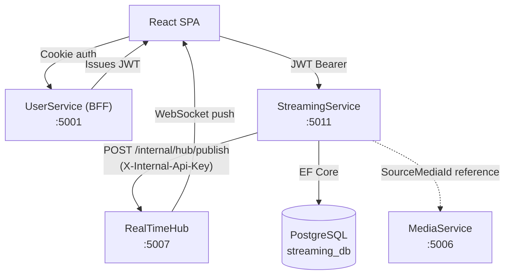
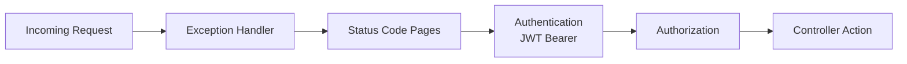
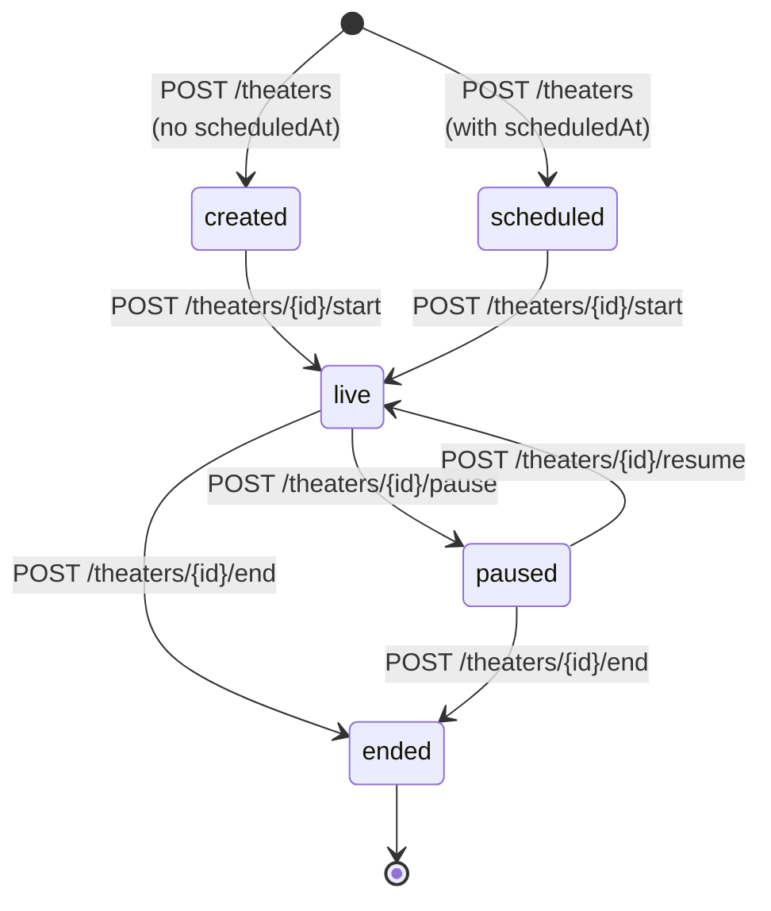
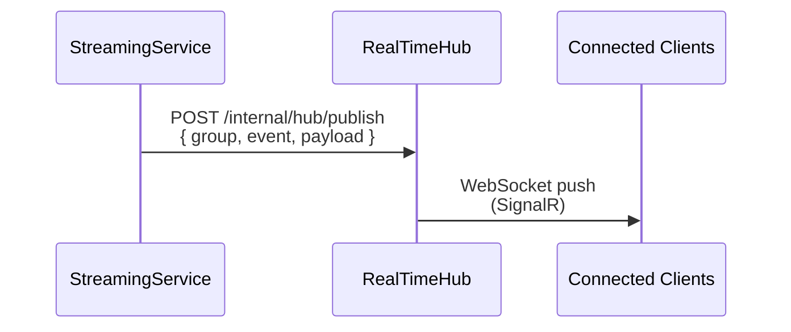
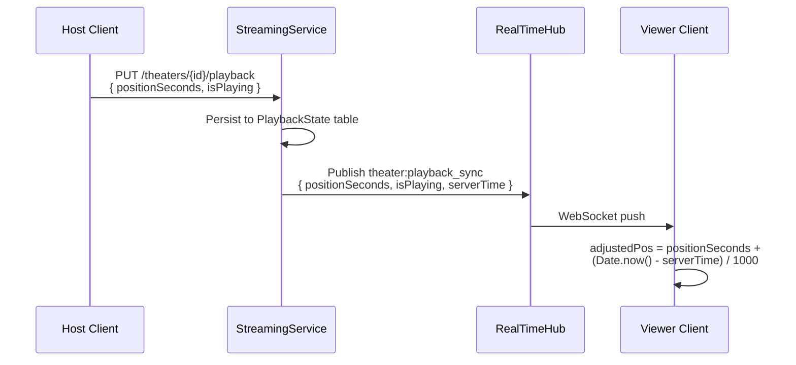

# StreamingService

> **Port:** 5011 &nbsp;|&nbsp; **Runtime:** ASP.NET Core (.NET 9) &nbsp;|&nbsp; **Database:** PostgreSQL (`streaming_db`) &nbsp;|&nbsp; **Phase:** 3 — Streaming

---

## Overview

StreamingService manages the **Theater** experience in the SocialCommerce super-app — synchronized watch parties where a host streams content (screen share, uploaded media, or external URL) to an audience in real time. It owns:

- **Theater lifecycle** — Create, schedule, start, pause, resume, and end theaters with an enforced state machine.
- **Participant management** — Join/leave tracking, viewer counts, role-based moderation (host/moderator/viewer), and chat muting.
- **Synchronized playback** — Host-controlled playback state (position + playing flag) broadcast to all viewers via RealTimeHub with client-side latency compensation.
- **Theater chat** — Cursor-paginated chat with soft-delete, mute enforcement, and real-time message delivery.
- **Emotes** — Global emotes and per-theater custom emotes created by the host.
- **Discovery** — Browse live/upcoming public theaters filtered by status and category, plus full-text search.
- **Invitations** — Invite individual users to a theater via real-time push.

---

## Architecture

### Position in the Platform



### Request Pipeline



---

## Project Structure

```
services/StreamingService/
├── StreamingService.csproj               # .NET 9, Npgsql, JWT Bearer, Swashbuckle
├── Program.cs                            # Composition root — DI, pipeline, health check
├── Dockerfile                            # Multi-stage .NET 9 container build
├── appsettings.json
├── appsettings.Development.json
│
├── Controllers/
│   ├── TheatersController.cs             # /theaters — full theater CRUD, lifecycle,
│   │                                     #   participants, playback, chat, invite, discovery
│   └── EmotesController.cs              # /emotes (global), /theaters/{id}/emotes (scoped)
│
├── Data/
│   ├── AppDbContext.cs                   # EF Core DbContext — 5 DbSets, Fluent API config
│   ├── AppDbFactory.cs                   # IDesignTimeDbContextFactory for EF migrations
│   ├── Entities.cs                       # Theater, TheaterParticipant, TheaterChatMessage,
│   │                                     #   PlaybackState, Emote
│   └── Migrations/
│       ├── 20260322182758_Init.cs
│       └── AppDbContextModelSnapshot.cs
│
├── Dtos/
│   └── TheaterDtos.cs                    # All request/response DTOs + PagedResult<T>
│
├── Services/
│   ├── IRealTimePublisher.cs             # Real-time event publishing contract
│   └── RealTimePublisher.cs              # HTTP client → RealTimeHub internal API
│
└── Auth/
    └── JwtAuthExtensions.cs              # AddServiceJwtAuth() — HS256 JWT Bearer setup
```

---

## Data Model

### Entity-Relationship Diagram

```mermaid
erDiagram
    Theater {
        uuid Id PK
        uuid HostId FK
        string Title
        string Description
        string Category
        text_arr Tags
        string Visibility "public | private | friends"
        string Status "created | scheduled | live | paused | ended"
        string SourceType "screen_share | media_upload | external_url"
        string SourceUrl
        uuid SourceMediaId FK
        int ViewerCount
        int MaxViewers
        timestamptz ScheduledAt
        timestamptz StartedAt
        timestamptz EndedAt
        timestamptz CreatedAt
    }

    TheaterParticipant {
        uuid TheaterId PK_FK
        uuid UserId PK
        string Role "host | moderator | viewer"
        timestamptz JoinedAt
        timestamptz LeftAt
        bool IsChatMuted
    }

    TheaterChatMessage {
        uuid Id PK
        uuid TheaterId FK
        uuid SenderId FK
        string Content
        timestamptz CreatedAt
        bool IsDeleted
    }

    PlaybackState {
        uuid TheaterId PK_FK
        float PositionSeconds
        bool IsPlaying
        timestamptz UpdatedAt
    }

    Emote {
        uuid Id PK
        string Code UK
        string ImageUrl
        string Category "global | theater"
        uuid TheaterId FK
        uuid CreatedBy FK
    }

    Theater ||--o{ TheaterParticipant : "has"
    Theater ||--o{ TheaterChatMessage : "has"
    Theater ||--o| PlaybackState : "has"
    Theater ||--o{ Emote : "scoped to"
```

### Table Details

#### `Theater`

| Column | Type | Constraints | Notes |
|---|---|---|---|
| `Id` | `uuid` | PK, auto `uuid_generate_v4()` | |
| `HostId` | `uuid` | Indexed | References `UserProfile.Id` (cross-service) |
| `Title` | `varchar(200)` | Required | |
| `Description` | `text` | Nullable | |
| `Category` | `varchar(100)` | Required, Indexed | e.g. `"gaming"`, `"music"`, `"education"` |
| `Tags` | `text[]` | PostgreSQL array | Filterable tag list |
| `Visibility` | `varchar(10)` | Required | `public` · `private` · `friends` |
| `Status` | `varchar(10)` | Required, Indexed | `created` · `scheduled` · `live` · `paused` · `ended` |
| `SourceType` | `varchar(15)` | Required | `screen_share` · `media_upload` · `external_url` |
| `SourceUrl` | `varchar(2048)` | Nullable | External URL or CDN path |
| `SourceMediaId` | `uuid` | Nullable | References `MediaAsset.Id` (cross-service) |
| `ViewerCount` | `int` | Default `0` | Denormalized count, updated on join/leave |
| `MaxViewers` | `int` | Nullable | Optional viewer cap |
| `ScheduledAt` | `timestamptz` | Nullable | If set during creation, status becomes `scheduled` |
| `StartedAt` | `timestamptz` | Nullable | Set when transitioning to `live` |
| `EndedAt` | `timestamptz` | Nullable | Set when transitioning to `ended` |
| `CreatedAt` | `timestamptz` | Indexed | |

#### `TheaterParticipant`

| Column | Type | Constraints | Notes |
|---|---|---|---|
| `TheaterId` | `uuid` | PK (composite), FK → `Theater` | |
| `UserId` | `uuid` | PK (composite) | |
| `Role` | `varchar(12)` | Required | `host` · `moderator` · `viewer` |
| `JoinedAt` | `timestamptz` | | Refreshed on re-join |
| `LeftAt` | `timestamptz` | Nullable | Set on leave, cleared on re-join |
| `IsChatMuted` | `bool` | Default `false` | Set by host/moderator |

#### `TheaterChatMessage`

| Column | Type | Constraints | Notes |
|---|---|---|---|
| `Id` | `uuid` | PK, auto `uuid_generate_v4()` | |
| `TheaterId` | `uuid` | FK → `Theater`, Indexed (composite with `CreatedAt`) | |
| `SenderId` | `uuid` | | |
| `Content` | `text` | Required | |
| `CreatedAt` | `timestamptz` | Indexed (composite with `TheaterId`) | |
| `IsDeleted` | `bool` | Default `false` | Soft-delete flag |

#### `PlaybackState`

| Column | Type | Constraints | Notes |
|---|---|---|---|
| `TheaterId` | `uuid` | PK, FK → `Theater` (1:1) | One record per theater |
| `PositionSeconds` | `float` | | Current playback position |
| `IsPlaying` | `bool` | | Play/pause state |
| `UpdatedAt` | `timestamptz` | | Server timestamp for latency compensation |

#### `Emote`

| Column | Type | Constraints | Notes |
|---|---|---|---|
| `Id` | `uuid` | PK, auto `uuid_generate_v4()` | |
| `Code` | `varchar(50)` | Unique | e.g. `:wave:`, `:fire:` |
| `ImageUrl` | `varchar(512)` | Required | CDN URL for emote image |
| `Category` | `varchar(10)` | Required | `global` · `theater` |
| `TheaterId` | `uuid` | FK → `Theater`, Nullable | `null` for global emotes |
| `CreatedBy` | `uuid` | | User who created the emote |

---

## Theater Lifecycle State Machine



### Transition Rules

| From | To | Endpoint | Guard |
|---|---|---|---|
| `created` / `scheduled` | `live` | `POST .../start` | Host only. Sets `StartedAt`. |
| `live` | `paused` | `POST .../pause` | Host only. |
| `paused` | `live` | `POST .../resume` | Host only. |
| `live` / `paused` | `ended` | `POST .../end` | Host only. Sets `EndedAt`. |

Invalid transitions return **409 Conflict** with an error message.

All transitions publish a `theater:status` event to the `theater:{id}` group via RealTimeHub.

---

## API Reference

All endpoints require JWT Bearer authentication unless noted otherwise.

### Theater CRUD

| Endpoint | Method | Description |
|---|---|---|
| `/theaters` | `POST` | Create theater. Auto-adds host as participant with `"host"` role and initializes `PlaybackState`. Status is `"scheduled"` if `scheduledAt` is provided, otherwise `"created"`. |
| `/theaters/{theaterId}` | `GET` | Get theater detail. |
| `/theaters/{theaterId}` | `PATCH` | Update title, description, tags. Host only. |

### Lifecycle

| Endpoint | Method | Description |
|---|---|---|
| `/theaters/{theaterId}/start` | `POST` | Transition `created`/`scheduled` → `live`. Host only. |
| `/theaters/{theaterId}/pause` | `POST` | Transition `live` → `paused`. Host only. |
| `/theaters/{theaterId}/resume` | `POST` | Transition `paused` → `live`. Host only. |
| `/theaters/{theaterId}/end` | `POST` | Transition `live`/`paused` → `ended`. Host only. |

### Participants

| Endpoint | Method | Description |
|---|---|---|
| `/theaters/{theaterId}/join` | `POST` | Join theater as viewer. Re-join clears `LeftAt`. Increments `ViewerCount` on first join. Cannot join an ended theater. |
| `/theaters/{theaterId}/leave` | `POST` | Leave theater. Sets `LeftAt`, decrements `ViewerCount`. |
| `/theaters/{theaterId}/participants` | `GET` | List active participants (where `LeftAt` is null). |
| `/theaters/{theaterId}/participants/{userId}/mute-chat` | `POST` | Mute a viewer's chat. Host or moderator only. |

### Playback

| Endpoint | Method | Description |
|---|---|---|
| `/theaters/{theaterId}/playback` | `GET` | Get current playback state. |
| `/theaters/{theaterId}/playback` | `PUT` | Update playback position and play/pause state. Host only. Publishes `theater:playback_sync`. |

### Chat

| Endpoint | Method | Description |
|---|---|---|
| `/theaters/{theaterId}/chat` | `GET` | Chat history (cursor-paged, newest-first, default limit 50). Excludes deleted messages. |
| `/theaters/{theaterId}/chat` | `POST` | Send chat message. Participant must not be chat-muted. |
| `/theaters/{theaterId}/chat/{messageId}` | `DELETE` | Soft-delete chat message. Host/moderator can delete any; others can only delete their own. |

### Invite

| Endpoint | Method | Description |
|---|---|---|
| `/theaters/{theaterId}/invite` | `POST` | Send a theater invite to a specific user via RealTimeHub (`user:{userId}` group). |

### Discovery

| Endpoint | Method | Description |
|---|---|---|
| `/theaters/discover` | `GET` | Browse public theaters. Filters: `status`, `category`. Defaults to `live` + `scheduled`. Sorted by `ViewerCount` DESC, then `CreatedAt` DESC. Cursor-paginated. |
| `/theaters/discover/search` | `GET` | Full-text search on `Title` and `Category` (`ILIKE`). Query param `q` required. Cursor-paginated. |

### Emotes

| Endpoint | Method | Description |
|---|---|---|
| `/emotes` | `GET` | List all global emotes. |
| `/theaters/{theaterId}/emotes` | `GET` | List emotes scoped to a specific theater. |
| `/theaters/{theaterId}/emotes` | `POST` | Create a theater-scoped emote. Host only. |

### Health

| Endpoint | Method | Auth | Description |
|---|---|---|---|
| `/health/live` | `GET` | Anonymous | Liveness probe — returns 200 OK. |

---

## DTOs

### Request DTOs

#### `CreateTheaterDto`

```json
{
  "title":         "string (required)",
  "description":   "string?",
  "category":      "string (required)",
  "tags":          ["string"],
  "visibility":    "public | private | friends",
  "sourceType":    "screen_share | media_upload | external_url",
  "sourceUrl":     "string?",
  "sourceMediaId": "uuid?",
  "maxViewers":    "int?",
  "scheduledAt":   "timestamptz?"
}
```

#### `UpdateTheaterDto`

```json
{
  "title":       "string?",
  "description": "string?",
  "tags":        ["string"]
}
```

#### `UpdatePlaybackDto`

```json
{
  "positionSeconds": 123.45,
  "isPlaying":       true
}
```

#### `SendChatMessageDto`

```json
{
  "content": "string (required)"
}
```

#### `CreateEmoteDto`

```json
{
  "code":     ":fire:",
  "imageUrl": "https://cdn.example.com/emotes/fire.webp"
}
```

#### `InviteDto`

```json
{
  "userId": "uuid"
}
```

### Response DTOs

#### `TheaterDto`

```json
{
  "id":            "uuid",
  "hostId":        "uuid",
  "title":         "string",
  "description":   "string?",
  "category":      "string",
  "tags":          ["string"],
  "visibility":    "string",
  "status":        "string",
  "sourceType":    "string",
  "sourceUrl":     "string?",
  "sourceMediaId": "uuid?",
  "viewerCount":   0,
  "maxViewers":    null,
  "scheduledAt":   "timestamptz?",
  "startedAt":     "timestamptz?",
  "endedAt":       "timestamptz?",
  "createdAt":     "timestamptz"
}
```

#### `TheaterParticipantDto`

```json
{
  "theaterId":   "uuid",
  "userId":      "uuid",
  "role":        "host | moderator | viewer",
  "joinedAt":    "timestamptz",
  "leftAt":      "timestamptz?",
  "isChatMuted": false
}
```

#### `PlaybackStateDto`

```json
{
  "theaterId":       "uuid",
  "positionSeconds": 123.45,
  "isPlaying":       true,
  "updatedAt":       "timestamptz"
}
```

#### `ChatMessageDto`

```json
{
  "id":        "uuid",
  "theaterId": "uuid",
  "senderId":  "uuid",
  "content":   "string",
  "createdAt": "timestamptz",
  "isDeleted": false
}
```

#### `EmoteDto`

```json
{
  "id":        "uuid",
  "code":      ":fire:",
  "imageUrl":  "string",
  "category":  "global | theater",
  "theaterId": "uuid?",
  "createdBy": "uuid"
}
```

#### `PagedResult<T>` (Generic Envelope)

```json
{
  "items":      [],
  "nextCursor": "string?",
  "hasMore":    true
}
```

---

## Pagination

All list endpoints use **cursor-based pagination** to avoid the performance issues of `OFFSET` on large tables.

### Cursor Encoding

The cursor is a Base64-encoded string containing the UTC ticks of the last item's `CreatedAt` value:

```
cursor = Base64( UTF8( createdAt.UtcTicks.ToString() ) )
```

### Algorithm

1. Query items `WHERE CreatedAt < decodedCursor` (or unfiltered for first page).
2. Fetch `limit + 1` rows.
3. If `count > limit`, set `hasMore = true`, remove the extra row, and compute `nextCursor` from the last returned item.

---

## Real-Time Events

StreamingService publishes events to the **RealTimeHub** via `POST /internal/hub/publish` (authenticated with `X-Internal-Api-Key`). The publisher is best-effort — failures are swallowed to avoid breaking the primary operation.



### Event Catalog

| Event | Group | Trigger | Payload |
|---|---|---|---|
| `theater:status` | `theater:{theaterId}` | Start, pause, resume, end | `{ theaterId, status }` |
| `theater:viewer_joined` | `theater:{theaterId}` | Viewer joins | `TheaterParticipantDto` |
| `theater:viewer_left` | `theater:{theaterId}` | Viewer leaves | `{ userId }` |
| `theater:viewer_count` | `theater:{theaterId}` | Join or leave | `{ count }` |
| `theater:chat_message` | `theater:{theaterId}` | New chat message | `ChatMessageDto` |
| `theater:chat_delete` | `theater:{theaterId}` | Chat message deleted | `{ messageId }` |
| `theater:playback_sync` | `theater:{theaterId}` | Host updates playback | `{ positionSeconds, isPlaying, serverTime }` |
| `theater:invite` | `user:{userId}` | Host invites a user | `{ theaterId, title, inviterUserId }` |

### Playback Sync Strategy



Viewers compensate for network latency by calculating the time elapsed since `serverTime` (Unix milliseconds) and adding it to `positionSeconds`.

---

## Authentication

StreamingService uses a single **JWT Bearer** scheme (HS256) as its default authentication.

| Setting | Value |
|---|---|
| Scheme | `JwtBearerDefaults.AuthenticationScheme` (default) |
| Algorithm | HS256 |
| Issuer validation | ✅ (`SocialCommerce`) |
| Audience validation | ❌ (disabled) |
| Lifetime validation | ✅ |
| Clock skew | 30 seconds |

The `uid` claim is extracted from the JWT to identify the current user:

```csharp
Guid UserId => Guid.Parse(User.FindFirstValue("uid") ?? throw ...);
```

Tokens are issued by the **UserService** BFF (`GET /auth/hub-token`) and shared across all domain services using the same symmetric key.

---

## Authorization Rules

| Action | Allowed Roles |
|---|---|
| Create theater | Any authenticated user |
| Update theater (title/description/tags) | Host only |
| Start / pause / resume / end theater | Host only |
| Join / leave theater | Any authenticated user |
| Mute participant chat | Host or moderator |
| Update playback state | Host only |
| Send chat message | Any participant (not muted) |
| Delete chat message | Host/moderator (any message) or message sender (own) |
| Create theater emote | Host only |
| View theaters / participants / chat / emotes | Any authenticated user |
| Discovery & search | Any authenticated user |

---

## Service Dependencies

### Outbound

| Dependency | Protocol | Purpose |
|---|---|---|
| **PostgreSQL** (`streaming_db`) | TCP / EF Core | Persistent storage for all theater data |
| **RealTimeHub** (`:5007`) | HTTP (`POST /internal/hub/publish`) | Push real-time events to connected clients |

### Inbound (Consumers)

| Consumer | Protocol | Purpose |
|---|---|---|
| **React SPA** | HTTPS (JWT Bearer) | All public API endpoints |
| **NotificationService** | Redis Pub/Sub (`evt:theater:invite`, `evt:theater:live`) | Theater invite and go-live notifications *(planned)* |
| **SearchService** | DB or event-based indexing | Theater discovery indexing *(planned)* |

---

## Configuration

### `appsettings.json` Keys

| Section | Key | Description |
|---|---|---|
| `ConnectionStrings:Default` | `Host=…;Database=streaming_db;…` | PostgreSQL connection string |
| `Authentication:Jwt:Issuer` | `SocialCommerce` | Expected JWT issuer |
| `Authentication:Jwt:SymmetricKey` | — | HS256 signing key (≥ 32 bytes, must match UserService) |
| `RealTimeHub:BaseUrl` | `http://localhost:5007` | RealTimeHub internal API base URL |
| `Internal:ApiKey` | — | API key sent as `X-Internal-Api-Key` header to RealTimeHub |

> ⚠️ **Never commit secrets.** Use `dotnet user-secrets` in development and Azure Key Vault / Kubernetes Secrets in production.

---

## Containerization

### Dockerfile

Multi-stage build targeting .NET 9:

| Stage | Base Image | Purpose |
|---|---|---|
| `base` | `mcr.microsoft.com/dotnet/aspnet:9.0` | Runtime (exposes 8080) |
| `build` | `mcr.microsoft.com/dotnet/sdk:9.0` | Restore + build |
| `publish` | (from `build`) | `dotnet publish` |
| `final` | (from `base`) | Copy published output, `ENTRYPOINT` |

### Docker Compose

```yaml
streamingservice:
  build:
    context: .
    dockerfile: services/StreamingService/Dockerfile
  ports: [ "5011:8080" ]
  depends_on: [ postgres, redis ]
  environment:
    - ConnectionStrings__Default=Host=postgres;Database=streaming_db;Username=postgres;Password=1234
    - Authentication__Jwt__SymmetricKey=sc-dev-secret-key-min-32-bytes-long!!
    - Authentication__Jwt__Issuer=SocialCommerce
    - RealTimeHub__BaseUrl=http://realtimehub:8080
    - Internal__ApiKey=sc-dev-internal-api-key
```

---

## Migrations

| Migration | Date | Description |
|---|---|---|
| `Init` | 2026-03-22 | Creates all five tables (`Theaters`, `TheaterParticipants`, `TheaterChatMessages`, `PlaybackStates`, `Emotes`) with indexes and constraints |

### Running Migrations

Migrations auto-apply on startup in Development mode (`Program.cs`):

```csharp
if (app.Environment.IsDevelopment())
{
    using IServiceScope scope = app.Services.CreateScope();
    scope.ServiceProvider.GetRequiredService<AppDbContext>().Database.Migrate();
}
```

Manual migration commands:

```bash
cd services/StreamingService
dotnet ef migrations add <MigrationName>
dotnet ef database update
```

A `IDesignTimeDbContextFactory<AppDbContext>` (`Data/AppDbFactory.cs`) is provided for CLI tooling when the host isn't running.

---

## Database Indexes

| Table | Columns | Type | Purpose |
|---|---|---|---|
| `Theaters` | `Status` | B-tree | Filter theaters by lifecycle status |
| `Theaters` | `HostId` | B-tree | Lookup theaters by host |
| `Theaters` | `CreatedAt` | B-tree | Cursor pagination |
| `TheaterChatMessages` | `(TheaterId, CreatedAt)` | Composite B-tree | Paginated chat queries per theater |
| `Emotes` | `Code` | Unique | Enforce unique emote codes globally |

---

## Error Handling

The service uses ASP.NET Core's built-in **Problem Details** (RFC 7807) via:

```csharp
app.UseExceptionHandler();
app.UseStatusCodePages();
builder.Services.AddProblemDetails();
```

### Common Error Responses

| Status | When |
|---|---|
| **400 Bad Request** | Missing required query param (`q` for search) |
| **401 Unauthorized** | Missing or invalid JWT |
| **403 Forbidden** | Non-host attempting host-only action; muted user sending chat |
| **404 Not Found** | Theater, participant, message, or playback state not found |
| **409 Conflict** | Invalid state transition (e.g., pausing an ended theater) |

---

## Key Design Decisions

| Decision | Rationale |
|---|---|
| **Denormalized `ViewerCount`** | Avoids `COUNT(*)` queries on every page load. Incremented/decremented atomically on join/leave. |
| **Soft-delete for chat messages** | Preserves chat history integrity. Deleted messages are excluded from queries but remain in the database for auditing. |
| **Best-effort real-time publishing** | RealTimeHub failures are swallowed (`try/catch`) to ensure the primary database operation always succeeds. |
| **1:1 `PlaybackState` per theater** | Only the current state matters — no history needed. Simplifies queries and updates. |
| **Cursor pagination (not OFFSET)** | Consistent performance regardless of dataset size. Avoids skipping rows on concurrent inserts. |
| **Host-authoritative playback** | Only the host can update playback state, broadcast to all viewers. Prevents conflicts from multiple writers. |
| **Single JWT scheme** | StreamingService is a pure domain service — no BFF cookies needed. Simpler than UserService's dual-scheme design. |
| **`IDesignTimeDbContextFactory`** | Enables `dotnet ef` CLI commands without running the web host. |

---

## Related Documents

- [Backend Super-App Strategy](../backend_superapp_strategy.md) — Phase 3 specification
- [UserService](./UserService.md) — BFF / JWT issuer
- [RealTimeHub](./RealTimeHub.md) — SignalR hub consuming published events *(planned)*
- [MediaService](./MediaService.md) — Media uploads referenced by `SourceMediaId` *(planned)*
