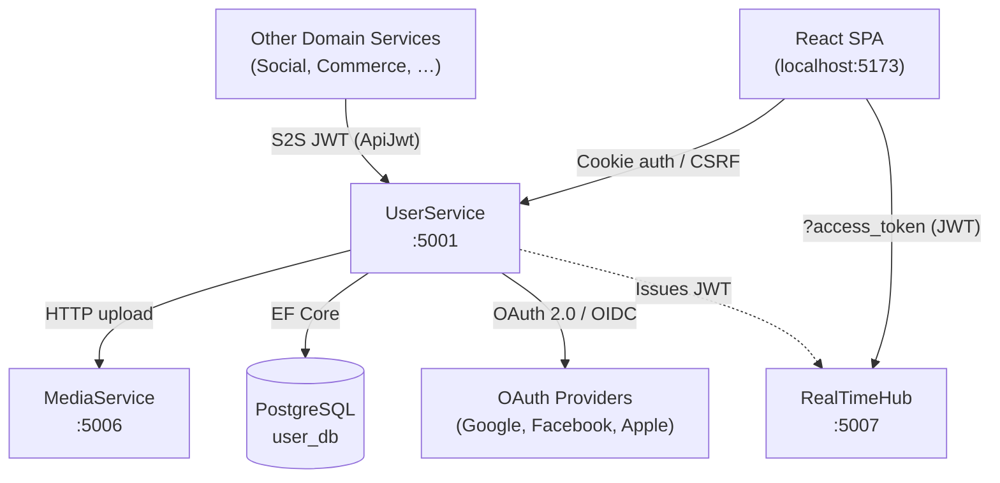
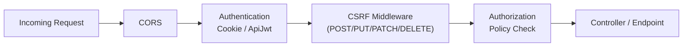
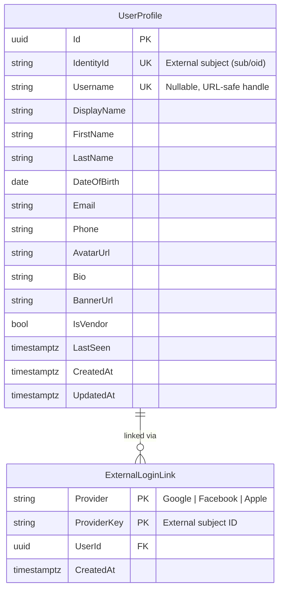
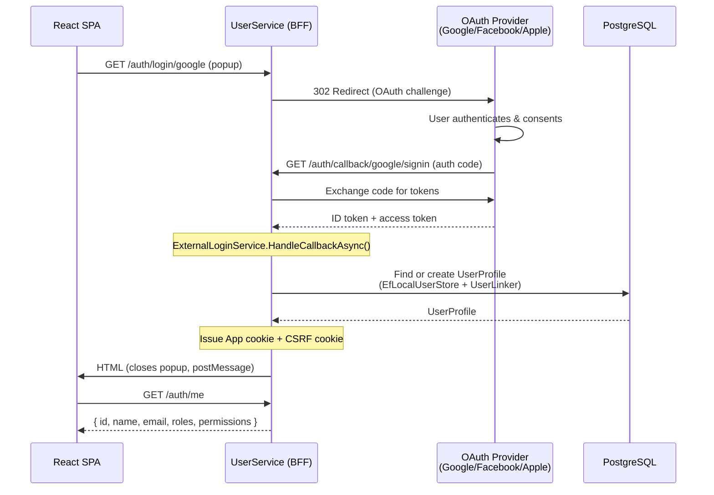
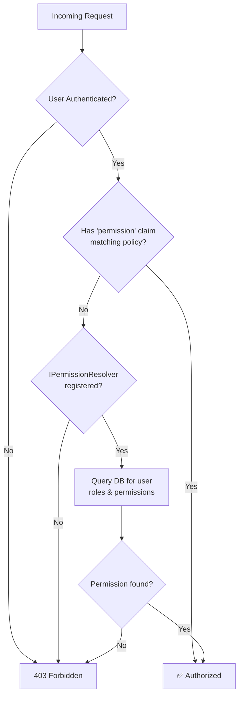
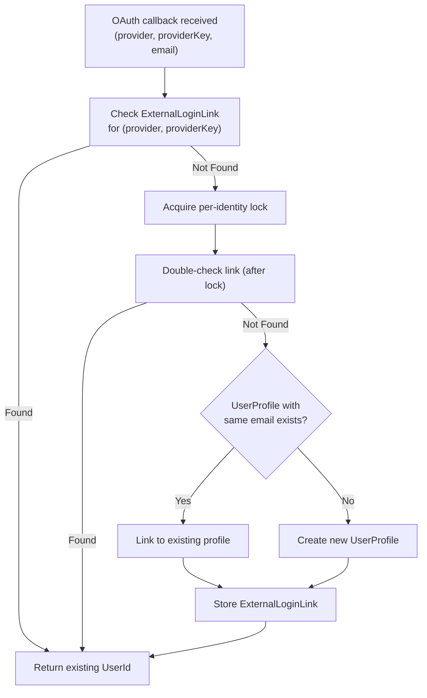

# UserService

> **Port:** 5001 &nbsp;|&nbsp; **Runtime:** ASP.NET Core (.NET 8) &nbsp;|&nbsp; **Database:** PostgreSQL (`user_db`) &nbsp;|&nbsp; **Phase:** 0 — Foundations

## Overview

UserService is the **BFF (Backend for Frontend) gateway** and **identity anchor** for the SocialCommerce super-app. It owns:

- **Authentication** — Cookie-based BFF sessions for the SPA, external OAuth flows (Google, Facebook, Apple), and CSRF protection.
- **JWT issuance** — Short-lived tokens for the RealTimeHub (SignalR) and service-to-service calls.
- **User profile management** — CRUD operations on user profiles, avatar uploads (delegated to MediaService), and public profile views.
- **Internal user lookup** — A JWT-protected endpoint consumed by other microservices to resolve user data.
- **Authorization** — Permission-based policies (`user.read`, `user.write`, etc.) evaluated via claims or an optional DB-backed resolver.

---

## Architecture

### Position in the Platform



### Request Pipeline



---

## Project Structure

```
services/UserService/
├── UserService.csproj
├── Program.cs                          # Composition root — DI, pipeline, endpoint mapping
├── Dockerfile                          # Multi-stage .NET 8 container build
├── appsettings.json
├── appsettings.Development.json
│
├── Controllers/
│   ├── ProfileController.cs            # /api/user/profile — authenticated profile CRUD
│   └── InternalUsersController.cs      # /api/user/internal/users — S2S user lookup
│
├── Data/
│   ├── AppDbContext.cs                 # EF Core DbContext (UserProfiles, ExternalLoginLinks)
│   └── Entities.cs                     # UserProfile entity
│
├── Dtos/
│   └── ProfileDtos.cs                  # ProfileReadDto, ProfileUpdateDto, ProfileCreateDto,
│                                       #   PublicProfileReadDto, InternalUserDto
│
├── Services/
│   ├── IMediaServiceClient.cs          # Interface + MediaUploadResult record
│   ├── MediaServiceHttpClient.cs       # HTTP client for MediaService upload delegation
│   └── BlobAvatarStorage.cs            # (Placeholder — reserved for direct blob access)
│
├── Auth/
│   ├── Abstractions/
│   │   ├── ITokenService.cs            # JWT minting & validation contract
│   │   ├── IExternalAuthProvider.cs    # Per-provider challenge/callback contract
│   │   ├── IPermissionResolver.cs      # Optional DB-backed permission lookup
│   │   └── ExternalUserInfo.cs         # Normalized external identity record
│   │
│   ├── Bff/
│   │   ├── CookieSchemes.cs            # App + External cookie scheme registration
│   │   ├── EfLocalUserStore.cs         # ILocalUserStore — find-or-create user via EF
│   │   ├── Endpoints.cs               # /auth/* BFF endpoints (login, callback, me, logout, csrf, hub-token)
│   │   └── Csrf/
│   │       ├── CsrfCookieWriter.cs     # Writes/deletes the JS-readable CSRF cookie
│   │       └── CsrfMiddleware.cs       # Double-submit CSRF validation middleware
│   │
│   ├── External/
│   │   ├── Core/
│   │   │   ├── ExternalAuthRegistrar.cs  # Conditional provider registration + IExternalAuthRegistry
│   │   │   └── ExternalLoginService.cs   # Orchestrates challenge/callback across providers
│   │   ├── Google/
│   │   │   ├── GoogleAuthProvider.cs
│   │   │   └── GoogleOptions.cs
│   │   ├── Facebook/
│   │   │   └── FacebookAuthProvider.cs
│   │   └── Apple/
│   │       ├── AppleAuthProvider.cs
│   │       ├── AppleClientSecretSigner.cs
│   │       └── AppleOptions.cs
│   │
│   ├── IdentityMapping/
│   │   ├── ExternalLoginLink.cs          # Entity + IExternalLoginLinkStore interface
│   │   ├── EfExternalLoginLinkStore.cs   # EF-backed provider ↔ userId link store
│   │   ├── IUserLinker.cs                # Concurrency-safe link-or-create contract
│   │   └── UserLinker.cs                 # Implementation with per-identity semaphore locking
│   │
│   ├── Authorization/
│   │   ├── AuthorizationExtensions.cs    # AddAuthorizationWithPolicies()
│   │   ├── PolicyNames.cs               # user.read, user.write, orders.read, …
│   │   ├── Requirements/
│   │   │   └── PermissionRequirement.cs  # IAuthorizationRequirement for named permissions
│   │   └── Handlers/
│   │       └── PermissionHandler.cs      # Claim-first, then optional IPermissionResolver fallback
│   │
│   ├── Jwt/
│   │   ├── TokenOptions.cs              # Issuer, Audience, SymmetricKey, AccessTokenMinutes, …
│   │   ├── JwtTokenService.cs           # HS256 ITokenService implementation
│   │   └── JwtBearerExtensions.cs       # AddApiJwtBearer() — registers "ApiJwt" scheme
│   │
│   ├── Options/
│   │   ├── AuthOptions.cs               # Top-level auth config binding
│   │   └── ProviderOptionsBinder.cs     # AddAuthOptionsFromConfig() — binds all auth sections
│   │
│   ├── JwtAuthExtensions.cs             # (Legacy/reference — commented code for future reference)
│   └── SelfHostedAuthExtensions.cs      # (Placeholder for self-hosted identity scenarios)
│
├── Migrations/
│   ├── 20250909042430_InitialCreate.cs
│   ├── 20260322164843_ProfileExtensions.cs
│   └── AppDbContextModelSnapshot.cs
│
└── Properties/
    └── launchSettings.json
```

---

## Data Model

### Entity-Relationship Diagram



### `UserProfile`

| Column | Type | Constraints | Notes |
|---|---|---|---|
| `Id` | `uuid` | PK, auto `uuid_generate_v4()` | Internal user ID used across all services |
| `IdentityId` | `varchar(200)` | Unique, Required | Stable external subject (`{Provider}\|{ProviderKey}`) |
| `Username` | `varchar(50)` | Unique (where not null) | Optional URL-safe handle |
| `DisplayName` | `varchar(100)` | — | Shown in UI |
| `FirstName` | `varchar(100)` | — | |
| `LastName` | `varchar(100)` | — | |
| `DateOfBirth` | `date` | — | |
| `Email` | `varchar(320)` | — | From OAuth claims or manual entry |
| `Phone` | `varchar(50)` | — | |
| `AvatarUrl` | `varchar(512)` | — | CDN URL from MediaService |
| `Bio` | `varchar(300)` | — | Short user description |
| `BannerUrl` | `varchar(512)` | — | Profile banner (blob ref) |
| `IsVendor` | `boolean` | Default `false` | Set when user creates a shop |
| `LastSeen` | `timestamptz` | — | Updated by PresenceService |
| `CreatedAt` | `timestamptz` | Default `UtcNow` | |
| `UpdatedAt` | `timestamptz` | Default `UtcNow` | |

### `ExternalLoginLink`

| Column | Type | Constraints | Notes |
|---|---|---|---|
| `Provider` | `varchar(50)` | PK (composite) | `"Google"`, `"Facebook"`, `"Apple"` |
| `ProviderKey` | `varchar(256)` | PK (composite) | External subject ID |
| `UserId` | `uuid` | FK → `UserProfile.Id`, Indexed | |
| `CreatedAt` | `timestamptz` | Default `UtcNow` | |

---

## Authentication Architecture

### Dual-Scheme Design

UserService registers **two** authentication schemes simultaneously:

| Scheme | Name | Purpose | Default? |
|---|---|---|---|
| **App Cookie** | `App` | Primary session for the SPA (BFF pattern) | ✅ Yes |
| **ApiJwt** | `ApiJwt` | Service-to-service and mobile token auth | No — opt-in via `[Authorize(AuthenticationSchemes = "ApiJwt")]` |

### BFF OAuth Login Flow



### Cookie Details

| Cookie | Name | HttpOnly | Secure | SameSite | Lifetime | Purpose |
|---|---|---|---|---|---|---|
| App Session | `App.Auth` | ✅ | ✅ | `None` (cross-site) or `Lax` | 8 hours (sliding) | Primary auth session |
| External Temp | `App.External` | ✅ | ✅ | Matches App | 5 minutes | Temporary during OAuth callback |
| CSRF Token | `App.CSRF` | ❌ (JS-readable) | ✅ | Matches App | Session | Double-submit CSRF protection |

### CSRF Protection

All state-changing requests (`POST`, `PUT`, `PATCH`, `DELETE`) must include:

- The `App.CSRF` cookie (sent automatically)
- An `X-CSRF` header with the same token value

The `CsrfMiddleware` validates that both match using a constant-time comparison. Safe methods (`GET`, `HEAD`, `OPTIONS`) are bypassed.

### JWT Tokens

| Token | Issuer | Audience | Algorithm | Lifetime | Use Case |
|---|---|---|---|---|---|
| Hub Token | `SocialCommerce` | `sc-rt-hub` | HS256 | 5 min | SignalR connection (`?access_token=`) |
| S2S Token | `SocialCommerce` | `sc-rt-hub` | HS256 | 15 min (configurable) | Inter-service API calls |

---

## API Reference

### BFF Auth Endpoints (Minimal API)

Mapped in `Auth/Bff/Endpoints.cs` via `app.MapAuthEndpoints()`.

| Endpoint | Method | Auth | Description |
|---|---|---|---|
| `/auth/login/{provider}` | `GET` | Anonymous | Initiates OAuth challenge (302 redirect to provider) |
| `/auth/callback/{provider}/signin` | `GET` | Anonymous | OAuth callback — creates/links user, issues cookies |
| `/auth/me` | `GET` | Cookie | Returns current user claims (`id`, `name`, `email`, `roles`, `permissions`) |
| `/auth/logout` | `POST` | Cookie + CSRF | Signs out, deletes auth and CSRF cookies |
| `/auth/csrf` | `GET` | Anonymous | Seeds the CSRF cookie (called on SPA mount) |
| `/auth/hub-token` | `GET` | Cookie | Issues a short-lived JWT for SignalR hub connection |

### Profile Controller (`/api/user/profile`)

| Endpoint | Method | Auth | Policy | Description |
|---|---|---|---|---|
| `/api/user/profile` | `GET` | Cookie | `user.read` | Get authenticated user's full profile (auto-provisions on first call) |
| `/api/user/profile` | `POST` | Cookie | `user.write` | Create profile for authenticated user |
| `/api/user/profile` | `PUT` | Cookie | `user.write` | Update profile fields (partial — only non-null fields are applied) |
| `/api/user/profile/{userId}` | `GET` | Anonymous | — | Get public profile for any user by ID |
| `/api/user/profile/me/avatar` | `POST` | Cookie | `user.write` | Upload avatar image (delegates to MediaService) |

### Internal Users Controller (`/api/user/internal/users`)

| Endpoint | Method | Auth | Description |
|---|---|---|---|
| `/api/user/internal/users/{userId}` | `GET` | `ApiJwt` scheme | Service-to-service user lookup — returns `InternalUserDto` |

> **Note:** Internal endpoints are not exposed publicly. They are consumed by other microservices using a shared JWT secret.

---

## DTOs

### `ProfileReadDto` (Full — Authenticated User)

```
{
  "id":          "uuid",
  "identityId":  "string",
  "username":    "string?",
  "displayName": "string?",
  "firstName":   "string?",
  "lastName":    "string?",
  "dateOfBirth": "date?",
  "email":       "string?",
  "phone":       "string?",
  "avatarUrl":   "string?",
  "bio":         "string?",
  "bannerUrl":   "string?",
  "isVendor":    false,
  "lastSeen":    "timestamptz?"
}
```

### `PublicProfileReadDto` (Unauthenticated — Any User)

```
{
  "id":          "uuid",
  "username":    "string?",
  "displayName": "string?",
  "avatarUrl":   "string?",
  "bio":         "string?",
  "bannerUrl":   "string?",
  "isVendor":    false,
  "lastSeen":    "timestamptz?"
}
```

### `InternalUserDto` (Service-to-Service)

```
{
  "id":          "uuid",
  "identityId":  "string",
  "username":    "string?",
  "displayName": "string?",
  "email":       "string?",
  "avatarUrl":   "string?",
  "isVendor":    false
}
```

### `ProfileCreateDto` (Request Body)

```
{
  "username":    "string?",
  "displayName": "string?",
  "firstName":   "string?",
  "lastName":    "string?",
  "dateOfBirth": "date?",
  "email":       "string?",
  "phone":       "string?",
  "avatarUrl":   "string?"
}
```

### `ProfileUpdateDto` (Request Body)

```
{
  "username":    "string?",
  "displayName": "string?",
  "firstName":   "string?",
  "lastName":    "string?",
  "dateOfBirth": "date?",
  "phone":       "string?",
  "avatarUrl":   "string?",
  "bio":         "string?",
  "bannerUrl":   "string?"
}
```

---

## Authorization

### Policy Model

Policies are registered in `Auth/Authorization/AuthorizationExtensions.cs`:

| Policy | Requirement | Description |
|---|---|---|
| `user.read` | `PermissionRequirement("user.read")` | Read own profile |
| `user.write` | `PermissionRequirement("user.write")` | Modify own profile |
| `orders.read` | `PermissionRequirement("orders.read")` | Read order data |
| `orders.write` | `PermissionRequirement("orders.write")` | Modify orders |
| `admin.only` | `RequireRole("Admin")` | Admin-only operations |

### Permission Resolution Flow



---

## Identity Mapping

### External Login Linking

When a user signs in via an OAuth provider for the first time, the `UserLinker` ensures exactly one `UserProfile` is created:



This design supports:

- **Multiple providers per user** — A user who signed up with Google can later link Facebook.
- **Email-based account merging** — If the same email exists, the external identity links to the existing profile.
- **Concurrency safety** — A `SemaphoreSlim` per `{provider}|{providerKey}` prevents duplicate creation under concurrent first-login requests.

---

## Service Dependencies

### Outbound

| Dependency | Protocol | Purpose |
|---|---|---|
| **PostgreSQL** (`user_db`) | TCP / EF Core | Persistent storage for profiles and login links |
| **MediaService** (`:5006`) | HTTP | Avatar upload delegation (`POST /media/upload?category=avatar`) |
| **OAuth Providers** | HTTPS | Google, Facebook, Apple authentication |

### Inbound (Consumers)

| Consumer | Endpoint | Auth |
|---|---|---|
| **React SPA** | `/auth/*`, `/api/user/profile/*` | Cookie + CSRF |
| **RealTimeHub** | `/auth/hub-token` | Cookie (returns JWT) |
| **All Domain Services** | `/api/user/internal/users/{userId}` | `ApiJwt` (HS256) |
| **PresenceService** | Writes `LastSeen` (planned) | — |

---

## Configuration

### `appsettings.json` Keys

| Section | Key | Description |
|---|---|---|
| `ConnectionStrings:Default` | `Host=…;Database=user_db;…` | PostgreSQL connection string |
| `Authentication:Google:ClientId` | — | Google OAuth client ID |
| `Authentication:Google:ClientSecret` | — | Google OAuth client secret |
| `Authentication:Facebook:AppId` | — | Facebook OAuth app ID |
| `Authentication:Facebook:AppSecret` | — | Facebook OAuth app secret |
| `Authentication:Apple:ClientId` | — | Apple Sign-In service ID |
| `Authentication:Apple:TeamId` | — | Apple developer team ID |
| `Authentication:Apple:KeyId` | — | Apple Sign-In key ID |
| `Authentication:Apple:PrivateKeyPath` | — | Path to `.p8` private key file |
| `Authentication:Jwt:Issuer` | `SocialCommerce` | JWT issuer claim |
| `Authentication:Jwt:Audience` | `sc-rt-hub` | JWT audience claim |
| `Authentication:Jwt:SymmetricKey` | — | HS256 signing key (≥ 32 bytes) |
| `Authentication:Jwt:AccessTokenMinutes` | `5` | JWT lifetime |
| `Auth:CrossSite` | `true` / `false` | Set `true` when SPA is on a different origin |
| `MediaService:BaseUrl` | `http://localhost:5006` | MediaService base URL |

> ⚠️ **Never commit secrets.** Use `dotnet user-secrets` in development and Azure Key Vault / Kubernetes Secrets in production.

---

## Containerization

### Dockerfile

Multi-stage build targeting .NET 8:

| Stage | Base Image | Purpose |
|---|---|---|
| `base` | `mcr.microsoft.com/dotnet/aspnet:8.0` | Runtime (exposes 8080, 8081) |
| `build` | `mcr.microsoft.com/dotnet/sdk:8.0` | Restore + build |
| `publish` | (from `build`) | `dotnet publish` |
| `final` | (from `base`) | Copy published output, `ENTRYPOINT` |

### Docker Compose

```yaml
userservice:
  build: ./services/UserService
  ports: [ "5001:8080" ]
  depends_on: [ postgres, redis ]
  environment:
    - ConnectionStrings__Default=Host=postgres;Database=user_db;Username=postgres;Password=1234
    - MediaService__BaseUrl=http://mediaservice:8080
```

---

## Migrations

| Migration | Date | Description |
|---|---|---|
| `InitialCreate` | 2025-09-09 | `UserProfiles` (core fields) + `ExternalLoginLinks` tables, `uuid-ossp` extension |
| `ProfileExtensions` | 2026-03-22 | Added `Username`, `Bio`, `BannerUrl`, `IsVendor`, `LastSeen`, `FirstName`, `LastName`, `DateOfBirth`, `Phone` to `UserProfile`; unique index on `Username` |

### Running Migrations

Migrations auto-apply on startup in Development mode (`Program.cs`):

```csharp
if (app.Environment.IsDevelopment())
{
    using IServiceScope scope = app.Services.CreateScope();
    AppDbContext db = scope.ServiceProvider.GetRequiredService<AppDbContext>();
    await db.Database.MigrateAsync();
}
```

Manual migration commands:

```bash
cd services/UserService
dotnet ef migrations add <MigrationName>
dotnet ef database update
```

---

## Key Design Decisions

| Decision | Rationale |
|---|---|
| **Cookie-based BFF** (not SPA-held JWT) | Prevents XSS token theft; cookies are `HttpOnly` + `Secure` + `SameSite`. The SPA never touches tokens directly. |
| **Double-submit CSRF** | Lightweight CSRF protection without server-side token storage. The `App.CSRF` cookie is JS-readable so the SPA can echo it in `X-CSRF`. |
| **Separate `ApiJwt` scheme** | Allows S2S callers to use JWTs without interfering with the default cookie auth. Controllers opt in with `[Authorize(AuthenticationSchemes = "ApiJwt")]`. |
| **`UserLinker` with semaphore** | Prevents duplicate `UserProfile` creation under concurrent first-login from the same external identity. |
| **Email-based merge** | If a user signs in with Google (email: `a@b.com`) and later with Facebook (same email), both link to the same profile. |
| **Avatar delegation to MediaService** | Centralizes file upload, virus scanning, resizing, and CDN URL generation in a single service. UserService only stores the resulting URL. |
| **Auto-provisioning in `GET /profile`** | Simplifies onboarding — the first `GET` after OAuth login creates the profile if missing, so no separate registration step is needed. |

---

## Related Documents

- [Backend Super-App Strategy](../backend_superapp_strategy.md) — Full architecture and phase plan
- [MediaService](./MediaService.md) — Avatar/media upload pipeline *(planned)*
- [RealTimeHub](./RealTimeHub.md) — SignalR hub consuming hub-tokens *(planned)*
